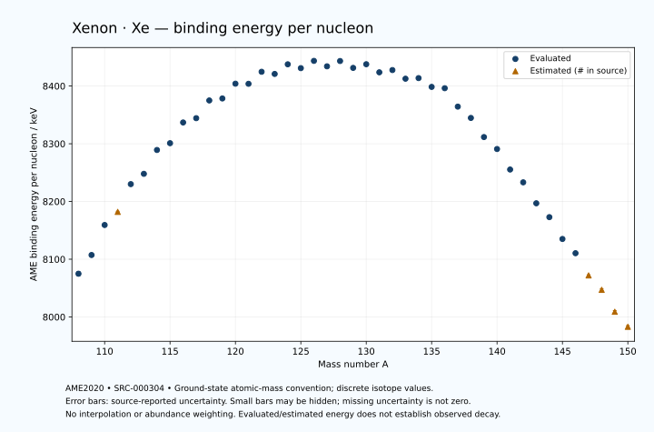

# Xenon — Atomic Masses and Reaction Energies

<!-- generated-by: sync-ame2020.mjs -->

**Dated evaluated data · scientific coverage remains partial.** 43 ground-state nuclides from AME2020. Values and uncertainties are transcribed from the retained unrounded analysis files; estimated quantities remain labelled.

- [Parent Xenon record](0054-Xenon-Xe.md) · [NUBASE states and decays](0054-Xenon-Xe-Nuclear-Evaluation.md)
- [Structured data](data/isotopes/0054-Xenon-Xe-AME2020-Evaluation.yaml)
- [Original mass table](../../data/catalog/sources/ame2020-mass_1.mas20.txt) · [Original reaction table 1](../../data/catalog/sources/ame2020-rct1.mas20.txt) · [Original reaction table 2](../../data/catalog/sources/ame2020-rct2.mas20.txt)
- [AME2020 methods](https://doi.org/10.1088/1674-1137/abddb0) (SRC-000303) · [Tables and definitions](https://doi.org/10.1088/1674-1137/abddaf) (SRC-000304)

## Reading the data

All table energies and uncertainties are in keV; binding energy is per nucleon. A # replaces a decimal point in the original estimated value. UNKNOWN (*) retains the source's not-calculable entry; it is neither zero nor automatically NOT APPLICABLE. Source lines are one-based in the retained files. Uncertainties remain those published by the evaluation, with no replacement by independent-mass quadrature.

Atomic-mass conventions apply. Qα is total decay energy, not alpha-particle kinetic energy. Positive Q alone does not establish a decay branch, rate or observation. He-4's source Qα of zero is a bookkeeping identity. These tables describe ground-state combinations, not isomer or excited-daughter transitions. Nuclear state and daughter lookups are explicit in the structured companion. The binding quantity follows [Z M(¹H) + N mₙ − M(A,Z)]c²/A; it has not been converted to a bare-nucleus convention.

## Mass and binding table

| Nuclide | N | Atomic mass excess / keV | AME binding per nucleon / keV | Mass-file line |
|---|---:|---|---|---:|
| Xe-108 | 54 | -42632.357 ± 379.497 | 8074.8886 ± 3.5139 | 1298 |
| Xe-109 | 55 | -46169.546 ± 300.108 | 8107.3071 ± 2.7533 | 1314 |
| Xe-110 | 56 | -51922.636 ± 100.988 | 8159.2808 ± 0.9181 | 1329 |
| Xe-111 | 57 | -54520# ± 115# | 8182# ± 1# | 1344 |
| Xe-112 | 58 | -60026.348 ± 8.283 | 8230.0646 ± 0.0740 | 1360 |
| Xe-113 | 59 | -62203.626 ± 6.840 | 8247.9277 ± 0.0605 | 1376 |
| Xe-114 | 60 | -67085.899 ± 11.178 | 8289.2054 ± 0.0981 | 1392 |
| Xe-115 | 61 | -68656.757 ± 12.109 | 8300.9704 ± 0.1053 | 1408 |
| Xe-116 | 62 | -73046.877 ± 13.017 | 8336.8365 ± 0.1122 | 1424 |
| Xe-117 | 63 | -74185.347 ± 10.378 | 8344.2976 ± 0.0887 | 1440 |
| Xe-118 | 64 | -78079.067 ± 10.378 | 8374.9819 ± 0.0880 | 1456 |
| Xe-119 | 65 | -78794.488 ± 10.378 | 8378.4420 ± 0.0872 | 1472 |
| Xe-120 | 66 | -82172.434 ± 11.817 | 8404.0322 ± 0.0985 | 1488 |
| Xe-121 | 67 | -82480.997 ± 10.243 | 8403.8326 ± 0.0847 | 1504 |
| Xe-122 | 68 | -85354.988 ± 11.111 | 8424.6644 ± 0.0911 | 1521 |
| Xe-123 | 69 | -85248.258 ± 9.534 | 8420.9239 ± 0.0775 | 1537 |
| Xe-124 | 70 | -87667.405 ± 1.358 | 8437.6138 ± 0.0110 | 1553 |
| Xe-125 | 71 | -87199.361 ± 1.415 | 8430.9390 ± 0.0113 | 1570 |
| Xe-126 | 72 | -89146.38687 ± 0.00562 | 8443.5375 ± 0.0003 | 1586 |
| Xe-127 | 73 | -88320.883 ± 4.088 | 8434.1066 ± 0.0322 | 1603 |
| Xe-128 | 74 | -89860.53427 ± 0.00520 | 8443.3008 ± 0.0003 | 1620 |
| Xe-129 | 75 | -88696.06975 ± 0.00505 | 8431.3904 ± 0.0003 | 1637 |
| Xe-130 | 76 | -89880.474 ± 0.009 | 8437.7314 ± 0.0003 | 1654 |
| Xe-131 | 77 | -88413.57492 ± 0.00512 | 8423.7367 ± 0.0003 | 1672 |
| Xe-132 | 78 | -89278.97451 ± 0.00507 | 8427.6229 ± 0.0003 | 1689 |
| Xe-133 | 79 | -87643.583 ± 2.400 | 8412.6477 ± 0.0180 | 1706 |
| Xe-134 | 80 | -88125.83443 ± 0.00577 | 8413.6994 ± 0.0003 | 1723 |
| Xe-135 | 81 | -86413.365 ± 3.668 | 8398.4783 ± 0.0272 | 1740 |
| Xe-136 | 82 | -86429.170 ± 0.007 | 8396.1889 ± 0.0003 | 1757 |
| Xe-137 | 83 | -82383.414 ± 0.104 | 8364.2865 ± 0.0008 | 1774 |
| Xe-138 | 84 | -79972.244 ± 2.804 | 8344.6913 ± 0.0203 | 1790 |
| Xe-139 | 85 | -75644.586 ± 2.142 | 8311.5904 ± 0.0154 | 1807 |
| Xe-140 | 86 | -72986.461 ± 2.329 | 8290.8875 ± 0.0166 | 1824 |
| Xe-141 | 87 | -68197.309 ± 2.888 | 8255.3647 ± 0.0205 | 1841 |
| Xe-142 | 88 | -65229.648 ± 2.701 | 8233.1695 ± 0.0190 | 1858 |
| Xe-143 | 89 | -60202.882 ± 4.657 | 8196.8855 ± 0.0326 | 1875 |
| Xe-144 | 90 | -56872.301 ± 5.310 | 8172.8845 ± 0.0369 | 1892 |
| Xe-145 | 91 | -51493.337 ± 11.178 | 8135.0877 ± 0.0771 | 1910 |
| Xe-146 | 92 | -47954.950 ± 24.219 | 8110.4154 ± 0.1659 | 1927 |
| Xe-147 | 93 | -42400# ± 200# | 8072# ± 1# | 1944 |
| Xe-148 | 94 | -38650# ± 300# | 8047# ± 2# | 1960 |
| Xe-149 | 95 | -33000# ± 300# | 8009# ± 2# | 1977 |
| Xe-150 | 96 | -28990# ± 300# | 7983# ± 2# | 1994 |

## Q-values and separation energies

| Nuclide | Qβ− / keV | Qα / keV | S₂n / keV | S₂p / keV | Reaction-file line |
|---|---|---|---|---|---:|
| Xe-108 | UNKNOWN (*) | 4569.5582 ± 207.7072 | UNKNOWN (*) | -1009.4603 ± 392.5894 | 1297 |
| Xe-109 | UNKNOWN (*) | 4217.0463 ± 7.2672 | UNKNOWN (*) | 90# ± 316# | 1313 |
| Xe-110 | UNKNOWN (*) | 3872.2066 ± 9.4990 | 25432.9161 ± 392.7043 | 718.9023 ± 101.1331 | 1328 |
| Xe-111 | -11620# ± 231# | 3712.1503 ± 56.8926 | 24493# ± 322# | 1383# ± 116# | 1343 |
| Xe-112 | -13612# ± 116# | 3330.4128 ± 6.2709 | 24246.3472 ± 101.3274 | 2374.4692 ± 10.5751 | 1359 |
| Xe-113 | -10439.0876 ± 10.9702 | 3086.8573 ± 7.6593 | 23826# ± 116# | 3194.0815 ± 9.3856 | 1375 |
| Xe-114 | -12399.9706 ± 85.7989 | 2719.0060 ± 12.9683 | 23202.1872 ± 13.9122 | 4096.3227 ± 13.9724 | 1391 |
| Xe-115 | -8957# ± 103# | 2505.8139 ± 13.7094 | 22595.7671 ± 13.9074 | 4887.6619 ± 30.4557 | 1407 |
| Xe-116 | -11004# ± 101# | 2095.7250 ± 15.4832 | 22103.6147 ± 17.1579 | 5735.1430 ± 27.6800 | 1423 |
| Xe-117 | -7692.2462 ± 63.2672 | 1736.7748 ± 29.8098 | 21671.2258 ± 15.9484 | 6700.5215 ± 29.8098 | 1439 |
| Xe-118 | -9669.6905 ± 16.4423 | 1385.6935 ± 26.5414 | 21174.8259 ± 16.6481 | 7393.2167 ± 26.3369 | 1455 |
| Xe-119 | -6489.4269 ± 17.3790 | 843.3634 ± 29.8098 | 20751.7774 ± 14.6773 | 8276.9300 ± 16.9927 | 1471 |
| Xe-120 | -8283.7857 ± 15.4611 | 666.4424 ± 26.9365 | 20236.0033 ± 15.7278 | 9059.6186 ± 21.7892 | 1487 |
| Xe-121 | -5378.6549 ± 13.9791 | 189.5879 ± 16.9102 | 19829.1445 ± 14.5817 | 9876.3992 ± 12.5654 | 1503 |
| Xe-122 | -7210.2195 ± 35.4720 | -89.1461 ± 21.4143 | 19325.1900 ± 16.2206 | 10570.7699 ± 11.2483 | 1520 |
| Xe-123 | -4204.6012 ± 15.4121 | -490.6342 ± 11.9939 | 18909.8973 ± 13.9931 | 11283.0893 ± 27.5127 | 1536 |
| Xe-124 | -5926.3445 ± 9.2512 | -730.1604 ± 1.1218 | 18455.0529 ± 11.1937 | 11932.0652 ± 0.1798 | 1552 |
| Xe-125 | -3109.6184 ± 7.7879 | -1081.1660 ± 25.8041 | 18093.7391 ± 9.5656 | 12606.3251 ± 0.4312 | 1569 |
| Xe-126 | -4795.7039 ± 10.3587 | -1258.0209 ± 1.3571 | 17621.6181 ± 1.3579 | 13200.1873 ± 1.3517 | 1585 |
| Xe-127 | -2080.8562 ± 6.4115 | -1574.8214 ± 4.0444 | 17264.1586 ± 4.0650 | 13877.0314 ± 4.0433 | 1602 |
| Xe-128 | -3928.7617 ± 5.3762 | -1761.3085 ± 1.3517 | 16856.7835 ± 0.0025 | 14374.3088 ± 1.3536 | 1619 |
| Xe-129 | -1197.0197 ± 4.5532 | -2099.1917 ± 1.3519 | 16517.8227 ± 4.0881 | 14993.5151 ± 1.3650 | 1636 |
| Xe-130 | -2980.7199 ± 8.3567 | -2241.2226 ± 1.3536 | 16162.5762 ± 0.0081 | 15464.6230 ± 0.7064 | 1653 |
| Xe-131 | -358.0009 ± 0.1771 | -2557.9940 ± 1.3650 | 15860.1413 ± 0.0016 | 15986.6329 ± 0.7109 | 1671 |
| Xe-132 | -2126.2813 ± 1.0359 | -2710.0969 ± 0.7064 | 15541.1363 ± 0.0081 | 16503.9570 ± 0.0100 | 1688 |
| Xe-133 | 427.3600 ± 2.4000 | -3063.6147 ± 2.5031 | 15372.6442 ± 2.4000 | 17010.5036 ± 2.4008 | 1705 |
| Xe-134 | -1234.6691 ± 0.0160 | -3197.7907 ± 0.0104 | 14989.4961 ± 0.0028 | 17515.5795 ± 3.4863 | 1722 |
| Xe-135 | 1168.5917 ± 3.6623 | -3627.2591 ± 3.6690 | 14912.4179 ± 4.3838 | 18054.1740 ± 4.2103 | 1739 |
| Xe-136 | -90.3151 ± 1.8730 | -3665.8889 ± 3.4863 | 14445.9718 ± 0.0087 | 18473.3600 ± 2.7464 | 1756 |
| Xe-137 | 4162.3582 ± 0.3193 | -1871.1970 ± 2.0687 | 12112.6854 ± 3.6699 | 19232.5659 ± 1.7254 | 1773 |
| Xe-138 | 2914.7839 ± 9.5780 | 136.5922 ± 3.9249 | 9685.7102 ± 2.8040 | 20124.9072 ± 3.6146 | 1789 |
| Xe-139 | 5056.5023 ± 3.7960 | -340.7117 ± 2.7489 | 9403.8082 ± 2.1450 | 20918.7661 ± 3.0004 | 1806 |
| Xe-140 | 4063.2768 ± 8.5232 | -986.0981 ± 3.2597 | 9156.8533 ± 3.6449 | 21868.4088 ± 4.4455 | 1823 |
| Xe-141 | 6280.0423 ± 9.6378 | -1318.4624 ± 3.5708 | 8695.3587 ± 3.5956 | 22570.1706 ± 4.5681 | 1840 |
| Xe-142 | 5284.9078 ± 7.5655 | -1958.5697 ± 4.6515 | 8385.8232 ± 3.5665 | 23440.1414 ± 14.6291 | 1857 |
| Xe-143 | 7472.6365 ± 8.8908 | -2422.7178 ± 5.8499 | 8148.2096 ± 5.4800 | 24111# ± 400# | 1874 |
| Xe-144 | 6399.0606 ± 20.8203 | -2929.7680 ± 15.3266 | 7785.2890 ± 5.9572 | 24901# ± 500# | 1891 |
| Xe-145 | 8561.0867 ± 14.3929 | -3249# ± 400# | 7433.0911 ± 12.1094 | 25541# ± 500# | 1909 |
| Xe-146 | 7355.4298 ± 24.3911 | -3830# ± 501# | 7225.2852 ± 24.7940 | 26313# ± 301# | 1926 |
| Xe-147 | 9520# ± 200# | -4294# ± 539# | 7049# ± 201# | 26968# ± 361# | 1943 |
| Xe-148 | 8261# ± 300# | -4854# ± 424# | 6837# ± 301# | UNKNOWN (*) | 1959 |
| Xe-149 | 10300# ± 500# | -5415# ± 424# | 6743# ± 361# | UNKNOWN (*) | 1976 |
| Xe-150 | 9180# ± 500# | UNKNOWN (*) | 6483# ± 424# | UNKNOWN (*) | 1993 |

## Additional decay-energy combinations

| Nuclide | Q₂β− / keV | Q₄β− / keV | Qεp / keV | Qβ−n / keV | Part 1 / part 2 line |
|---|---|---|---|---|---|
| Xe-108 | UNKNOWN (*) | UNKNOWN (*) | 10736# ± 393# | UNKNOWN (*) | 1297 / 1316 |
| Xe-109 | UNKNOWN (*) | UNKNOWN (*) | 12323.1588 ± 300.1565 | UNKNOWN (*) | 1313 / 1332 |
| Xe-110 | UNKNOWN (*) | UNKNOWN (*) | 8503.7919 ± 101.0833 | UNKNOWN (*) | 1328 / 1347 |
| Xe-111 | UNKNOWN (*) | UNKNOWN (*) | 10421# ± 116# | UNKNOWN (*) | 1343 / 1362 |
| Xe-112 | UNKNOWN (*) | UNKNOWN (*) | 6272.1683 ± 10.4839 | -25198# ± 200# | 1359 / 1378 |
| Xe-113 | -22494# ± 300# | UNKNOWN (*) | 8074.9208 ± 10.8195 | -23860# ± 116# | 1375 / 1395 |
| Xe-114 | -21180.4621 ± 103.2827 | UNKNOWN (*) | 3972.1677 ± 30.0975 | -23392.6781 ± 14.0895 | 1391 / 1411 |
| Xe-115 | -19737# ± 201# | UNKNOWN (*) | 5943.9482 ± 27.2649 | -22042.1471 ± 85.9252 | 1407 / 1427 |
| Xe-116 | -18667# ± 201# | UNKNOWN (*) | 1726.9190 ± 30.8279 | -21419# ± 103# | 1423 / 1443 |
| Xe-117 | -16727.4405 ± 250.5537 | UNKNOWN (*) | 3789.4746 ± 26.3369 | -20214# ± 101# | 1439 / 1460 |
| Xe-118 | -15879# ± 201# | UNKNOWN (*) | -272.5379 ± 16.9927 | -19657.2845 ± 63.2672 | 1455 / 1476 |
| Xe-119 | -14204.3920 ± 200.5378 | -34974# ± 500# | 1607.2986 ± 21.0435 | -18456.4296 ± 16.4423 | 1471 / 1492 |
| Xe-120 | -13283.7857 ± 300.3981 | -32443# ± 500# | -2278.8659 ± 13.8790 | -17938.6911 ± 18.2749 | 1487 / 1508 |
| Xe-121 | -11736.1497 ± 141.8669 | -29791# ± 401# | -407.8073 ± 10.3914 | -16663.6660 ± 14.2936 | 1503 / 1525 |
| Xe-122 | -10746.0365 ± 30.0727 | -27481# ± 401# | -4100.8486 ± 28.1227 | -16323.9645 ± 18.1013 | 1520 / 1542 |
| Xe-123 | -9593.2946 ± 15.4121 | -24962# ± 298# | -2223.9470 ± 9.5566 | -15174.8072 ± 35.0100 | 1536 / 1558 |
| Xe-124 | -8577.6192 ± 12.5709 | -22752# ± 298# | -5785.3982 ± 0.1613 | -14695.0664 ± 12.1853 | 1552 / 1574 |
| Xe-125 | -7530.3848 ± 11.0829 | -20542# ± 196# | -3964.1901 ± 0.4206 | -13529.6184 ± 9.2597 | 1569 / 1592 |
| Xe-126 | -6476.4736 ± 12.4973 | -18325.8218 ± 27.9448 | -7413.5641 ± 1.3519 | -13127.9627 ± 7.7359 | 1585 / 1608 |
| Xe-127 | -5502.9282 ± 12.0702 | -16341.5394 ± 29.1643 | -5545.6866 ± 4.0430 | -12041.5183 ± 11.1362 | 1602 / 1625 |
| Xe-128 | -4491.3787 ± 1.6104 | -14326.6090 ± 27.9448 | -8869.0085 ± 1.3650 | -11691.8254 ± 5.5775 | 1619 / 1642 |
| Xe-129 | -3635.2041 ± 10.5036 | -12408.5657 ± 27.9448 | -6991.2473 ± 0.7063 | -10835.6152 ± 5.3762 | 1636 / 1660 |
| Xe-130 | -2623.6980 ± 0.2871 | -10457.5612 ± 27.9448 | -10164.5612 ± 0.7109 | -10452.7424 ± 4.5532 | 1653 / 1677 |
| Xe-131 | -1734.6167 ± 0.4153 | -8705.1269 ± 32.8023 | -8349.5864 ± 0.0099 | -9585.1385 ± 8.3567 | 1671 / 1695 |
| Xe-132 | -844.0714 ± 1.0533 | -6810.2868 ± 20.4071 | -11356.9240 ± 0.0608 | -9294.7185 ± 0.1771 | 1688 / 1712 |
| Xe-133 | -90.0710 ± 2.5969 | -5225.3599 ± 16.5294 | -9744.3571 ± 4.2325 | -8562.2079 ± 2.6140 | 1705 / 1730 |
| Xe-134 | 824.1677 ± 0.2507 | -3292.9362 ± 20.3868 | -12477.6726 ± 2.0661 | -8126.2095 ± 0.0071 | 1722 / 1747 |
| Xe-135 | 1437.2900 ± 3.6666 | -1797.0572 ± 10.8990 | -11168.5835 ± 4.5826 | -7593.5175 ± 3.6685 | 1739 / 1764 |
| Xe-136 | 2457.9090 ± 0.2448 | 79.3797 ± 0.3241 | -15989.3509 ± 1.7223 | -6918.5317 ± 0.3635 | 1756 / 1781 |
| Xe-137 | 5337.9868 ± 0.2689 | 3535.3512 ± 0.3744 | -15247.1059 ± 2.2833 | -4115.8771 ± 1.8759 | 1773 / 1799 |
| Xe-138 | 8289.5615 ± 2.8150 | 7593.6224 ± 2.8481 | -17957.4531 ± 3.5035 | -1497.7900 ± 2.8202 | 1789 / 1815 |
| Xe-139 | 9269.3315 ± 2.1573 | 11313.1552 ± 2.9921 | -17237.5625 ± 4.3508 | -828.8761 ± 9.4057 | 1806 / 1832 |
| Xe-140 | 10281.4437 ± 8.2356 | 15087.7656 ± 2.6733 | -20070.3522 ± 4.2370 | -356.6911 ± 3.9042 | 1823 / 1849 |
| Xe-141 | 11535.1833 ± 6.0518 | 17233.7489 ± 3.1729 | -19118.8306 ± 14.6646 | 781.1114 ± 8.6925 | 1840 / 1867 |
| Xe-142 | 12612.6085 ± 6.5075 | 19303.2472 ± 3.6424 | -21849# ± 400# | 1176.3845 ± 9.5836 | 1857 / 1884 |
| Xe-143 | 13734.3230 ± 8.2060 | 21403.4961 ± 5.2590 | -20942# ± 500# | 2240.3560 ± 8.4635 | 1874 / 1901 |
| Xe-144 | 14894.8284 ± 8.8948 | 23559.6407 ± 6.0181 | -23631# ± 500# | 2731.8992 ± 9.2491 | 1891 / 1918 |
| Xe-145 | 16022.8458 ± 14.0285 | 25573.7215 ± 35.6957 | -22562# ± 300# | 3706.7067 ± 23.0269 | 1909 / 1937 |
| Xe-146 | 16911.3181 ± 24.2834 | 27670.9180 ± 28.3127 | -25234# ± 301# | 4028.1553 ± 25.8604 | 1926 / 1954 |
| Xe-147 | 17864# ± 201# | 29614# ± 200# | UNKNOWN (*) | 4839# ± 200# | 1943 / 1971 |
| Xe-148 | 18895# ± 300# | 31749# ± 300# | UNKNOWN (*) | 5199# ± 300# | 1959 / 1987 |
| Xe-149 | 19831# ± 300# | 33670# ± 300# | UNKNOWN (*) | 5840# ± 300# | 1976 / 2005 |
| Xe-150 | 20900# ± 300# | 35857# ± 300# | UNKNOWN (*) | 6238# ± 500# | 1993 / 2022 |

## Single-nucleon separation and reaction energies

| Nuclide | Sₙ / keV | Sₚ / keV | Q(d,α) / keV | Q(p,α) / keV | Q(n,α) / keV | Part 2 line |
|---|---|---|---|---|---|---:|
| Xe-108 | UNKNOWN (*) | 492# ± 484# | 11378# ± 551# | UNKNOWN (*) | 15825.5543 ± 483.7663 | 1316 |
| Xe-109 | 11608.5079 ± 483.8209 | 687# ± 317# | 13971# ± 424# | 1994# ± 500# | 17696.6147 ± 316.5012 | 1332 |
| Xe-110 | 13824.4081 ± 316.6437 | 1539.1022 ± 101.2122 | 11559# ± 143# | 2371# ± 316# | 14381# ± 142# | 1347 |
| Xe-111 | 10669# ± 153# | 1341# ± 131# | 13863# ± 116# | 3115.1504 ± 58.3589 | 16908# ± 116# | 1362 |
| Xe-112 | 13578# ± 116# | 2361.5239 ± 9.5499 | 11152.3034 ± 62.4909 | 2510.2129 ± 7.4380 | 13335.4540 ± 9.3705 | 1378 |
| Xe-113 | 10248.5967 ± 10.7415 | 2429.2587 ± 12.3194 | 13460.9755 ± 8.3293 | 3128.2729 ± 62.3160 | 15672.5965 ± 9.4874 | 1395 |
| Xe-114 | 12953.5905 ± 13.1044 | 3255.3533 ± 13.7521 | 10688.2469 ± 15.1636 | 2731.9513 ± 12.1468 | 12147.9904 ± 12.8940 | 1411 |
| Xe-115 | 9642.1765 ± 16.4798 | 3306.7935 ± 23.4035 | 13173.5663 ± 14.5194 | 3270.6366 ± 15.8628 | 14557.1631 ± 14.7282 | 1427 |
| Xe-116 | 12461.4382 ± 17.7788 | 3998.0437 ± 31.6747 | 10302.8644 ± 23.8858 | 2936.6944 ± 15.2846 | 10946.5623 ± 30.8279 | 1443 |
| Xe-117 | 9209.7876 ± 16.6481 | 4053.6642 ± 75.7516 | 12863.2649 ± 30.6848 | 3317.6431 ± 22.5565 | 13350.7319 ± 26.5414 | 1460 |
| Xe-118 | 11965.0383 ± 14.6773 | 4929.4700 ± 27.5845 | 10052.3936 ± 75.7516 | 3122.7928 ± 30.6848 | 9630.1025 ± 29.8098 | 1476 |
| Xe-119 | 8786.7391 ± 14.6773 | 5112.4029 ± 22.3197 | 12354.8870 ± 27.5845 | 3490.2208 ± 75.7516 | 12115.7066 ± 26.3369 | 1492 |
| Xe-120 | 11449.2642 ± 15.7278 | 5683.6739 ± 24.7147 | 9509.4291 ± 23.0241 | 3130.1891 ± 28.1575 | 8569.4682 ± 17.9079 | 1508 |
| Xe-121 | 8379.8803 ± 15.6386 | 6022.8073 ± 18.2478 | 12007.5419 ± 24.0016 | 3354.1150 ± 22.2569 | 10856.1635 ± 20.9768 | 1525 |
| Xe-122 | 10945.3096 ± 15.1119 | 6398.3101 ± 12.0731 | 9102.9792 ± 18.7490 | 3286.7985 ± 24.3848 | 7473.9535 ± 13.2827 | 1542 |
| Xe-123 | 7964.5877 ± 14.6407 | 6457.9470 ± 10.7856 | 11708.1984 ± 10.5731 | 3362.9578 ± 17.8201 | 9760.3048 ± 9.6205 | 1558 |
| Xe-124 | 10490.4652 ± 9.5573 | 7013.7881 ± 3.4485 | 9122.6840 ± 5.0032 | 3442.2994 ± 4.5272 | 6522.1079 ± 25.8010 | 1574 |
| Xe-125 | 7603.2739 ± 0.3999 | 7123.7770 ± 1.9063 | 11454.0342 ± 3.4716 | 3743.9763 ± 5.0192 | 8760.3233 ± 0.4384 | 1592 |
| Xe-126 | 10018.3442 ± 1.4148 | 7599.3341 ± 1.3532 | 8928.9749 ± 2.2987 | 3660.2562 ± 3.6858 | 5670.9930 ± 1.3548 | 1608 |
| Xe-127 | 7245.8143 ± 4.0881 | 7699.3578 ± 3.3980 | 11225.9477 ± 4.0437 | 3907.7268 ± 4.4503 | 7849.6607 ± 4.0433 | 1625 |
| Xe-128 | 9610.9692 ± 4.0881 | 8166.2886 ± 3.6209 | 8760.7692 ± 3.7779 | 3839.5448 ± 1.3532 | 4807.6618 ± 1.3519 | 1642 |
| Xe-129 | 6906.8535 ± 0.0015 | 8247.0107 ± 3.6211 | 10997.9540 ± 3.6209 | 4078.4819 ± 3.7779 | 7014.5001 ± 1.3536 | 1660 |
| Xe-130 | 9255.7227 ± 0.0080 | 8662.2693 ± 3.1534 | 8568.3628 ± 3.6211 | 3966.7976 ± 3.6209 | 4046.4246 ± 1.3650 | 1677 |
| Xe-131 | 6604.4186 ± 0.0080 | 8766.3580 ± 3.1537 | 10804.4082 ± 3.1534 | 4188.5104 ± 3.6211 | 6226.6208 ± 0.7064 | 1695 |
| Xe-132 | 8936.7176 ± 0.0016 | 9125.2183 ± 0.6046 | 8368.0205 ± 3.1537 | 4092.2568 ± 3.1534 | 3372.3119 ± 0.7109 | 1712 |
| Xe-133 | 6435.9266 ± 2.4000 | 9229.0525 ± 4.7210 | 10509.9513 ± 2.4750 | 4156.6602 ± 3.9630 | 5355.7788 ± 2.4000 | 1730 |
| Xe-134 | 8553.5695 ± 2.4000 | 9557.5037 ± 5.9019 | 8288.4742 ± 4.0654 | 4180.9480 ± 0.6047 | 2731.5893 ± 0.0609 | 1747 |
| Xe-135 | 6358.8484 ± 3.6685 | 9658.8961 ± 6.0865 | 10154.7441 ± 6.9491 | 4154.1920 ± 5.4759 | 4421.2345 ± 5.0608 | 1764 |
| Xe-136 | 8087.1234 ± 3.6685 | 9938.9615 ± 2.0599 | 8325.0767 ± 4.8567 | 4292.1869 ± 5.9019 | 2154.3649 ± 2.0661 | 1781 |
| Xe-137 | 4025.5620 ± 0.1033 | 10127.1604 ± 14.1884 | 12106.5727 ± 2.0625 | 6524.0810 ± 4.8578 | 5796.7405 ± 2.7483 | 1799 |
| Xe-138 | 5660.1482 ± 2.8059 | 10904.9468 ± 8.8399 | 10283.7875 ± 14.4625 | 8670.9907 ± 3.4793 | 3402.9482 ± 3.2907 | 1815 |
| Xe-139 | 3743.6600 ± 3.5288 | 10953.6476 ± 6.3349 | 11422.4894 ± 8.6529 | 8764.6937 ± 14.3489 | 4427.0953 ± 3.1294 | 1832 |
| Xe-140 | 5413.1933 ± 3.1643 | 11804.4687 ± 4.6332 | 9704.2552 ± 6.4003 | 8233.8623 ± 8.7009 | 1963.7030 ± 3.1361 | 1849 |
| Xe-141 | 3282.1654 ± 3.7096 | 11880.0572 ± 12.4490 | 10984.4620 ± 4.9378 | 8646.6561 ± 6.6241 | 3145.0882 ± 4.7621 | 1867 |
| Xe-142 | 5103.6578 ± 3.9542 | 12591.9538 ± 16.0642 | 9087.3812 ± 12.4071 | 8105.3704 ± 4.8312 | 621.8339 ± 4.4527 | 1884 |
| Xe-143 | 3044.5518 ± 5.3842 | 12688.8840 ± 6.7871 | 10434.5906 ± 16.5061 | 8267.3956 ± 12.9742 | 1810.9692 ± 15.1131 | 1901 |
| Xe-144 | 4740.7372 ± 7.0628 | 13372# ± 200# | 8641.4749 ± 7.2501 | 7918.4196 ± 16.7018 | -556# ± 400# | 1918 |
| Xe-145 | 2692.3538 ± 12.3749 | 13452# ± 400# | 10007# ± 201# | 8173.6873 ± 12.2196 | 703# ± 500# | 1937 |
| Xe-146 | 4532.9314 ± 26.6739 | 14114# ± 501# | 8086# ± 400# | 7699# ± 202# | -1778# ± 501# | 1954 |
| Xe-147 | 2516# ± 202# | 14148# ± 361# | 9441# ± 539# | 7795# ± 447# | -533# ± 361# | 1971 |
| Xe-148 | 4321# ± 361# | 14738# ± 424# | 7601# ± 424# | 7345# ± 583# | -2993# ± 424# | 1987 |
| Xe-149 | 2422# ± 424# | UNKNOWN (*) | 8911# ± 424# | 7404# ± 424# | UNKNOWN (*) | 2005 |
| Xe-150 | 4061# ± 424# | UNKNOWN (*) | UNKNOWN (*) | 7074# ± 424# | UNKNOWN (*) | 2022 |

Qβ− comes from the mass-file line in the first table. Qα, S₂n, S₂p, Q₂β−, Qεp and Qβ−n come from reaction part 1; Q₄β− and the last table come from part 2. Qεp is electron-capture/proton energy balance; Qβ−n is beta-minus/neutron energy balance. These are evaluated mass combinations, not observations of decay modes, cross sections or reaction rates. Light-nuclide zero entries can be bookkeeping identities, without a physical A=0 residual. Definitions and original source strings are retained in the structured data.

## Binding-energy chart

Discrete source values and source-reported uncertainties. No interpolation, natural-abundance weighting or observed-decay claim is implied. This quantitative chart supplements the 22 separate illustrative panels.

## Remaining review

Later measurements, state-specific decay branches, isomer Q-values, reaction rates, applicability and full claim-level review remain open. Existing authored values retain their own provenance; this companion does not overwrite them.
