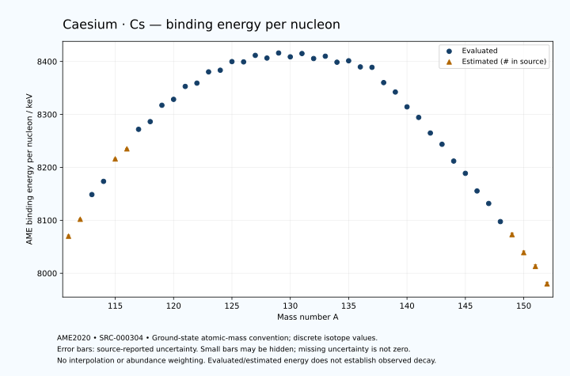

# Caesium — Atomic Masses and Reaction Energies

<!-- generated-by: sync-ame2020.mjs -->

**Dated evaluated data · scientific coverage remains partial.** 42 ground-state nuclides from AME2020. Values and uncertainties are transcribed from the retained unrounded analysis files; estimated quantities remain labelled.

- [Parent Caesium record](0055-Caesium-Cs.md) · [NUBASE states and decays](0055-Caesium-Cs-Nuclear-Evaluation.md)
- [Structured data](data/isotopes/0055-Caesium-Cs-AME2020-Evaluation.yaml)
- [Original mass table](../../data/catalog/sources/ame2020-mass_1.mas20.txt) · [Original reaction table](../../data/catalog/sources/ame2020-rct1.mas20.txt)
- [AME2020 methods](https://doi.org/10.1088/1674-1137/abddb0) (SRC-000303) · [Tables and definitions](https://doi.org/10.1088/1674-1137/abddaf) (SRC-000304)

## Reading the data

All table energies and uncertainties are in keV; binding energy is per nucleon. A # replaces a decimal point in the original estimated value. UNKNOWN (*) retains the source's not-calculable entry; it is neither zero nor automatically NOT APPLICABLE. Source lines are one-based in the retained files. Uncertainties remain those published by the evaluation, with no replacement by independent-mass quadrature.

Atomic-mass conventions apply. Qα is total decay energy, not alpha-particle kinetic energy. Positive Q alone does not establish a decay branch, rate or observation. He-4's source Qα of zero is a bookkeeping identity. These tables describe ground-state combinations, not isomer or excited-daughter transitions. Nuclear state and daughter lookups are explicit in the structured companion. The binding quantity follows [Z M(¹H) + N mₙ − M(A,Z)]c²/A; it has not been converted to a bare-nucleus convention.

## Mass and binding table

| Nuclide | N | Atomic mass excess / keV | AME binding per nucleon / keV | Mass-file line |
|---|---:|---|---|---:|
| Cs-111 | 56 | -42900# ± 200# | 8070# ± 2# | 1345 |
| Cs-112 | 57 | -46415# ± 116# | 8102# ± 1# | 1361 |
| Cs-113 | 58 | -51764.539 ± 8.577 | 8148.6230 ± 0.0759 | 1377 |
| Cs-114 | 59 | -54685.928 ± 85.068 | 8173.5711 ± 0.7462 | 1393 |
| Cs-115 | 60 | -59699# ± 102# | 8216# ± 1# | 1409 |
| Cs-116 | 61 | -62043# ± 100# | 8235# ± 1# | 1425 |
| Cs-117 | 62 | -66493.101 ± 62.410 | 8271.8652 ± 0.5334 | 1441 |
| Cs-118 | 63 | -68409.377 ± 12.753 | 8286.4053 ± 0.1081 | 1457 |
| Cs-119 | 64 | -72305.061 ± 13.940 | 8317.3347 ± 0.1171 | 1473 |
| Cs-120 | 65 | -73888.649 ± 9.970 | 8328.4811 ± 0.0831 | 1489 |
| Cs-121 | 66 | -77102.342 ± 14.290 | 8352.9152 ± 0.1181 | 1505 |
| Cs-122 | 67 | -78144.769 ± 33.687 | 8359.1515 ± 0.2761 | 1522 |
| Cs-123 | 68 | -81043.657 ± 12.109 | 8380.3796 ± 0.0985 | 1538 |
| Cs-124 | 69 | -81741.060 ± 9.151 | 8383.5114 ± 0.0738 | 1554 |
| Cs-125 | 70 | -84089.742 ± 7.736 | 8399.8033 ± 0.0619 | 1571 |
| Cs-126 | 71 | -84350.683 ± 10.359 | 8399.2673 ± 0.0822 | 1587 |
| Cs-127 | 72 | -86240.027 ± 5.578 | 8411.5617 ± 0.0439 | 1604 |
| Cs-128 | 73 | -85931.773 ± 5.376 | 8406.4953 ± 0.0420 | 1621 |
| Cs-129 | 74 | -87499.050 ± 4.553 | 8416.0465 ± 0.0353 | 1638 |
| Cs-130 | 75 | -86899.754 ± 8.357 | 8408.7848 ± 0.0643 | 1655 |
| Cs-131 | 76 | -88055.574 ± 0.177 | 8415.0317 ± 0.0014 | 1673 |
| Cs-132 | 77 | -87152.693 ± 1.036 | 8405.5878 ± 0.0079 | 1690 |
| Cs-133 | 78 | -88070.943 ± 0.008 | 8409.9786 ± 0.0003 | 1707 |
| Cs-134 | 79 | -86891.165 ± 0.016 | 8398.6470 ± 0.0003 | 1724 |
| Cs-135 | 80 | -87581.956 ± 0.364 | 8401.3393 ± 0.0027 | 1741 |
| Cs-136 | 81 | -86338.855 ± 1.873 | 8389.7723 ± 0.0138 | 1758 |
| Cs-137 | 82 | -86545.772 ± 0.302 | 8388.9581 ± 0.0022 | 1775 |
| Cs-138 | 83 | -82887.028 ± 9.158 | 8360.1437 ± 0.0664 | 1791 |
| Cs-139 | 84 | -80701.088 ± 3.134 | 8342.3397 ± 0.0225 | 1808 |
| Cs-140 | 85 | -77049.738 ± 8.199 | 8314.3227 ± 0.0586 | 1825 |
| Cs-141 | 86 | -74477.351 ± 9.195 | 8294.3554 ± 0.0652 | 1842 |
| Cs-142 | 87 | -70514.556 ± 7.067 | 8264.8777 ± 0.0498 | 1859 |
| Cs-143 | 88 | -67675.519 ± 7.573 | 8243.6707 ± 0.0530 | 1876 |
| Cs-144 | 89 | -63271.362 ± 20.132 | 8211.8894 ± 0.1398 | 1893 |
| Cs-145 | 90 | -60054.424 ± 9.067 | 8188.7342 ± 0.0625 | 1911 |
| Cs-146 | 91 | -55310.380 ± 2.893 | 8155.4365 ± 0.0198 | 1928 |
| Cs-147 | 92 | -51920.073 ± 8.383 | 8131.8010 ± 0.0570 | 1945 |
| Cs-148 | 93 | -46910.950 ± 13.041 | 8097.5469 ± 0.0881 | 1961 |
| Cs-149 | 94 | -43300# ± 400# | 8073# ± 3# | 1978 |
| Cs-150 | 95 | -38170# ± 400# | 8039# ± 3# | 1995 |
| Cs-151 | 96 | -34280# ± 500# | 8013# ± 3# | 2012 |
| Cs-152 | 97 | -29130# ± 500# | 7980# ± 3# | 2029 |

## Q-values and separation energies

| Nuclide | Qβ− / keV | Qα / keV | S₂n / keV | S₂p / keV | Reaction-file line |
|---|---|---|---|---|---:|
| Cs-111 | UNKNOWN (*) | 4105# ± 361# | UNKNOWN (*) | -195# ± 200# | 1344 |
| Cs-112 | UNKNOWN (*) | 3931.4368 ± 58.5006 | UNKNOWN (*) | 525# ± 131# | 1360 |
| Cs-113 | -12055# ± 300# | 3483.0508 ± 7.7646 | 25007# ± 200# | 1388.6860 ± 9.8064 | 1376 |
| Cs-114 | -8780.4915 ± 133.3375 | 3356.9999 ± 58.3095 | 24414# ± 143# | 2200.5317 ± 85.6825 | 1392 |
| Cs-115 | -10779# ± 225# | 2829# ± 103# | 24078# ± 103# | 3158# ± 103# | 1408 |
| Cs-116 | -7663# ± 224# | 2596# ± 101# | 23499# ± 132# | 3982# ± 102# | 1424 |
| Cs-117 | -9035.1943 ± 258.0009 | 2201.5000 ± 62.9221 | 22936# ± 120# | 4733.2381 ± 68.7667 | 1440 |
| Cs-118 | -6210# ± 201# | 1804.6423 ± 23.7429 | 22509# ± 101# | 5566.6650 ± 76.1133 | 1456 |
| Cs-119 | -7714.9651 ± 200.7537 | 1607.8276 ± 32.0649 | 21954.5967 ± 63.9479 | 6444.4352 ± 29.1121 | 1472 |
| Cs-120 | -5000.0000 ± 300.0000 | 1107.0893 ± 75.6967 | 21621.9080 ± 16.1874 | 7495.5343 ± 22.1326 | 1488 |
| Cs-121 | -6357.4948 ± 141.1765 | 911.3106 ± 29.2813 | 20939.9166 ± 19.9630 | 7902.5524 ± 25.9878 | 1504 |
| Cs-122 | -3535.8170 ± 43.7690 | 401.3719 ± 39.0546 | 20398.7562 ± 35.1312 | 8975.5504 ± 36.9171 | 1521 |
| Cs-123 | -5388.6934 ± 17.1253 | 309.1590 ± 24.8556 | 20083.9510 ± 18.7307 | 9375.9496 ± 12.9978 | 1537 |
| Cs-124 | -2651.2748 ± 15.4894 | -418.8160 ± 17.6581 | 19738.9279 ± 34.9077 | 10239.7207 ± 10.5158 | 1553 |
| Cs-125 | -4420.7663 ± 13.4415 | -269.0091 ± 9.0032 | 19188.7219 ± 14.3695 | 10725.0965 ± 8.5073 | 1570 |
| Cs-126 | -1680.7697 ± 16.2322 | -696.3170 ± 11.5820 | 18752.2587 ± 13.8218 | 11564.0703 ± 10.6107 | 1586 |
| Cs-127 | -3422.0719 ± 12.6525 | -722.3549 ± 6.6534 | 18292.9208 ± 9.5300 | 11981.9452 ± 5.7008 | 1603 |
| Cs-128 | -562.6171 ± 5.6122 | -992.1338 ± 5.8471 | 17723.7258 ± 11.6707 | 12599.2183 ± 6.5709 | 1620 |
| Cs-129 | -2438.1843 ± 10.5627 | -1087.9420 ± 4.7500 | 17401.6592 ± 7.2000 | 13093.7754 ± 5.8174 | 1637 |
| Cs-130 | 357.0219 ± 8.3617 | -1414.1739 ± 9.1710 | 17110.6180 ± 9.9367 | 13739.6665 ± 9.1075 | 1654 |
| Cs-131 | -1376.6158 ± 0.4515 | -1497.2732 ± 3.6252 | 16699.1602 ± 4.5566 | 14126.3401 ± 3.1584 | 1672 |
| Cs-132 | 1282.2099 ± 1.4773 | -1839.5789 ± 3.7664 | 16395.5748 ± 8.4207 | 14794.4473 ± 3.3194 | 1689 |
| Cs-133 | -517.4310 ± 0.9920 | -1988.6828 ± 3.1534 | 16158.0051 ± 0.1770 | 15206.1579 ± 0.6047 | 1706 |
| Cs-134 | 2058.8368 ± 0.2508 | -2379.8932 ± 3.1537 | 15881.1082 ± 1.0360 | 15765.6058 ± 4.0655 | 1723 |
| Cs-135 | 268.6983 ± 0.2862 | -2564.1451 ± 0.7055 | 15653.6496 ± 0.3635 | 16302.5968 ± 5.9131 | 1740 |
| Cs-136 | 2548.2241 ± 1.8570 | -3060.2693 ± 4.4761 | 15590.3258 ± 1.8730 | 16873.3574 ± 5.2054 | 1757 |
| Cs-137 | 1175.6285 ± 0.1723 | -3113.3863 ± 5.9096 | 15106.4519 ± 0.3426 | 17344.5347 ± 2.0800 | 1774 |
| Cs-138 | 5374.7776 ± 9.1584 | -1268.5042 ± 10.3665 | 12690.8092 ± 9.3448 | 17919.7456 ± 16.8872 | 1790 |
| Cs-139 | 4212.8293 ± 3.1235 | 653.1754 ± 3.7490 | 10297.9522 ± 3.1287 | 18922.7620 ± 8.9500 | 1807 |
| Cs-140 | 6218.1669 ± 9.8671 | 70.5706 ± 16.3866 | 10305.3462 ± 12.2922 | 19647.7707 ± 10.1371 | 1824 |
| Cs-141 | 5255.1410 ± 9.6174 | -545.9984 ± 12.4431 | 9918.8988 ± 9.7143 | 20584.3295 ± 10.0296 | 1841 |
| Cs-142 | 7327.7007 ± 8.3627 | -959.5625 ± 9.2455 | 9607.4542 ± 10.8241 | 21486.2758 ± 14.0206 | 1858 |
| Cs-143 | 6261.6865 ± 9.7303 | -1629.4708 ± 8.5673 | 9340.8037 ± 11.9123 | 22326.7950 ± 17.5532 | 1875 |
| Cs-144 | 8495.7679 ± 20.4163 | -2090.0552 ± 23.4932 | 8899.4418 ± 21.1802 | 23046.3348 ± 20.7284 | 1892 |
| Cs-145 | 7461.7591 ± 12.4121 | -2552.6740 ± 18.2474 | 8521.5413 ± 11.8137 | 23843# ± 200# | 1910 |
| Cs-146 | 9555.8882 ± 3.3918 | -2932.3269 ± 5.7223 | 8181.6545 ± 20.3388 | 24558# ± 400# | 1927 |
| Cs-147 | 8343.9631 ± 21.4535 | -3555# ± 200# | 8008.2848 ± 12.3487 | 25368# ± 500# | 1944 |
| Cs-148 | 10633.9614 ± 13.1258 | -4006# ± 400# | 7743.2056 ± 13.3580 | 25949# ± 300# | 1960 |
| Cs-149 | 9531# ± 400# | -4594# ± 640# | 7522# ± 400# | 26677# ± 500# | 1977 |
| Cs-150 | 11720# ± 400# | -5055# ± 500# | 7402# ± 400# | UNKNOWN (*) | 1994 |
| Cs-151 | 10660# ± 640# | -5504# ± 583# | 7123# ± 640# | UNKNOWN (*) | 2011 |
| Cs-152 | 12480# ± 640# | UNKNOWN (*) | 7102# ± 640# | UNKNOWN (*) | 2028 |

Qβ− comes from the mass-file line in the first table. The other three columns come from the reaction-file line. Definitions and original source strings are retained in the structured data.

## Binding-energy chart

Discrete source values and source-reported uncertainties. No interpolation, natural-abundance weighting or observed-decay claim is implied. This quantitative chart supplements the 22 separate illustrative panels.

## Remaining review

Later measurements, state-specific decay branches, isomer Q-values, additional reaction channels and full claim-level review remain open. Existing authored values retain their own provenance; this companion does not overwrite them.
