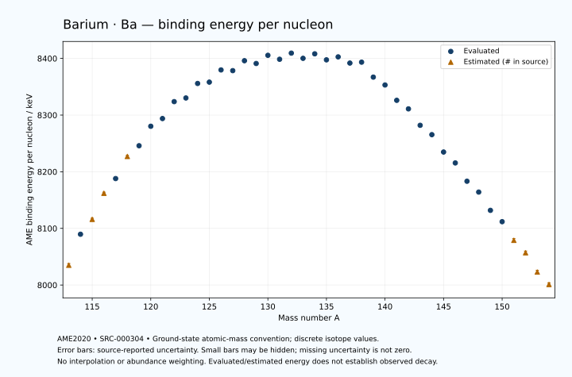

# Barium — Atomic Masses and Reaction Energies

<!-- generated-by: sync-ame2020.mjs -->

**Dated evaluated data · scientific coverage remains partial.** 42 ground-state nuclides from AME2020. Values and uncertainties are transcribed from the retained unrounded analysis files; estimated quantities remain labelled.

- [Parent Barium record](0056-Barium-Ba.md) · [NUBASE states and decays](0056-Barium-Ba-Nuclear-Evaluation.md)
- [Structured data](data/isotopes/0056-Barium-Ba-AME2020-Evaluation.yaml)
- [Original mass table](../../data/catalog/sources/ame2020-mass_1.mas20.txt) · [Original reaction table 1](../../data/catalog/sources/ame2020-rct1.mas20.txt) · [Original reaction table 2](../../data/catalog/sources/ame2020-rct2.mas20.txt)
- [AME2020 methods](https://doi.org/10.1088/1674-1137/abddb0) (SRC-000303) · [Tables and definitions](https://doi.org/10.1088/1674-1137/abddaf) (SRC-000304)

## Reading the data

All table energies and uncertainties are in keV; binding energy is per nucleon. A # replaces a decimal point in the original estimated value. UNKNOWN (*) retains the source's not-calculable entry; it is neither zero nor automatically NOT APPLICABLE. Source lines are one-based in the retained files. Uncertainties remain those published by the evaluation, with no replacement by independent-mass quadrature.

Atomic-mass conventions apply. Qα is total decay energy, not alpha-particle kinetic energy. Positive Q alone does not establish a decay branch, rate or observation. He-4's source Qα of zero is a bookkeeping identity. These tables describe ground-state combinations, not isomer or excited-daughter transitions. Nuclear state and daughter lookups are explicit in the structured companion. The binding quantity follows [Z M(¹H) + N mₙ − M(A,Z)]c²/A; it has not been converted to a bare-nucleus convention.

## Mass and binding table

| Nuclide | N | Atomic mass excess / keV | AME binding per nucleon / keV | Mass-file line |
|---|---:|---|---|---:|
| Ba-113 | 57 | -39710# ± 300# | 8035# ± 3# | 1378 |
| Ba-114 | 58 | -45905.437 ± 102.676 | 8089.6865 ± 0.9007 | 1394 |
| Ba-115 | 59 | -48920# ± 200# | 8116# ± 2# | 1410 |
| Ba-116 | 60 | -54380# ± 200# | 8162# ± 2# | 1426 |
| Ba-117 | 61 | -57457.906 ± 250.339 | 8187.9546 ± 2.1396 | 1442 |
| Ba-118 | 62 | -62200# ± 200# | 8227# ± 2# | 1458 |
| Ba-119 | 63 | -64590.096 ± 200.269 | 8245.9287 ± 1.6829 | 1474 |
| Ba-120 | 64 | -68888.649 ± 300.166 | 8280.2949 ± 2.5014 | 1490 |
| Ba-121 | 65 | -70744.847 ± 141.898 | 8293.9083 ± 1.1727 | 1506 |
| Ba-122 | 66 | -74608.952 ± 27.945 | 8323.7567 ± 0.2291 | 1523 |
| Ba-123 | 67 | -75654.963 ± 12.109 | 8330.2086 ± 0.0985 | 1539 |
| Ba-124 | 68 | -79089.786 ± 12.497 | 8355.8209 ± 0.1008 | 1555 |
| Ba-125 | 69 | -79668.976 ± 10.992 | 8358.1784 ± 0.0879 | 1572 |
| Ba-126 | 70 | -82669.913 ± 12.497 | 8379.7187 ± 0.0992 | 1588 |
| Ba-127 | 71 | -82817.955 ± 11.357 | 8378.4560 ± 0.0894 | 1605 |
| Ba-128 | 72 | -85369.156 ± 1.610 | 8395.9878 ± 0.0126 | 1622 |
| Ba-129 | 73 | -85060.866 ± 10.504 | 8391.0811 ± 0.0814 | 1639 |
| Ba-130 | 74 | -87256.776 ± 0.287 | 8405.5130 ± 0.0022 | 1656 |
| Ba-131 | 75 | -86678.958 ± 0.415 | 8398.5511 ± 0.0032 | 1674 |
| Ba-132 | 76 | -88434.903 ± 1.053 | 8409.3747 ± 0.0080 | 1691 |
| Ba-133 | 77 | -87553.512 ± 0.992 | 8400.2059 ± 0.0075 | 1708 |
| Ba-134 | 78 | -88950.002 ± 0.251 | 8408.1731 ± 0.0019 | 1725 |
| Ba-135 | 79 | -87850.655 ± 0.245 | 8397.5345 ± 0.0018 | 1742 |
| Ba-136 | 80 | -88887.079 ± 0.245 | 8402.7566 ± 0.0018 | 1759 |
| Ba-137 | 81 | -87721.401 ± 0.248 | 8391.8288 ± 0.0018 | 1776 |
| Ba-138 | 82 | -88261.806 ± 0.249 | 8393.4222 ± 0.0018 | 1792 |
| Ba-139 | 83 | -84913.918 ± 0.253 | 8367.0194 ± 0.0018 | 1809 |
| Ba-140 | 84 | -83267.905 ± 7.900 | 8353.1500 ± 0.0564 | 1826 |
| Ba-141 | 85 | -79732.492 ± 5.318 | 8326.0774 ± 0.0377 | 1843 |
| Ba-142 | 86 | -77842.257 ± 5.920 | 8310.9718 ± 0.0417 | 1860 |
| Ba-143 | 87 | -73937.205 ± 6.756 | 8281.9878 ± 0.0472 | 1877 |
| Ba-144 | 88 | -71767.130 ± 7.136 | 8265.4549 ± 0.0496 | 1894 |
| Ba-145 | 89 | -67516.183 ± 8.477 | 8234.7991 ± 0.0585 | 1912 |
| Ba-146 | 90 | -64866.269 ± 1.770 | 8215.5293 ± 0.0121 | 1929 |
| Ba-147 | 91 | -60264.036 ± 19.748 | 8183.2405 ± 0.1343 | 1946 |
| Ba-148 | 92 | -57544.911 ± 1.490 | 8164.1118 ± 0.0101 | 1962 |
| Ba-149 | 93 | -52830.620 ± 2.515 | 8131.8495 ± 0.0169 | 1979 |
| Ba-150 | 94 | -49889.799 ± 5.682 | 8111.8405 ± 0.0379 | 1996 |
| Ba-151 | 95 | -44940# ± 400# | 8079# ± 3# | 2013 |
| Ba-152 | 96 | -41610# ± 400# | 8057# ± 3# | 2030 |
| Ba-153 | 97 | -36470# ± 400# | 8023# ± 3# | 2046 |
| Ba-154 | 98 | -32920# ± 500# | 8001# ± 3# | 2063 |

## Q-values and separation energies

| Nuclide | Qβ− / keV | Qα / keV | S₂n / keV | S₂p / keV | Reaction-file line |
|---|---|---|---|---|---:|
| Ba-113 | UNKNOWN (*) | 4035# ± 424# | UNKNOWN (*) | -233# ± 321# | 1377 |
| Ba-114 | UNKNOWN (*) | 3592.2840 ± 18.5403 | UNKNOWN (*) | 457.0311 ± 103.0096 | 1393 |
| Ba-115 | UNKNOWN (*) | 3175# ± 231# | 25353# ± 361# | 1295# ± 200# | 1409 |
| Ba-116 | -14330# ± 379# | 3222# ± 200# | 24617# ± 225# | 1872# ± 201# | 1425 |
| Ba-117 | -11187# ± 321# | 2320.8041 ± 250.4321 | 24680# ± 321# | 3379.0913 ± 250.6314 | 1441 |
| Ba-118 | -12580# ± 361# | 2461# ± 201# | 23963# ± 283# | 3731# ± 201# | 1457 |
| Ba-119 | -9570# ± 361# | 1641.7452 ± 200.6349 | 23274.8259 ± 320.5888 | 4982.6914 ± 200.5378 | 1473 |
| Ba-120 | -11319# ± 424# | 1733.3129 ± 300.4477 | 22832# ± 361# | 5387.5236 ± 300.3450 | 1489 |
| Ba-121 | -8555# ± 332# | 1015.5841 ± 142.2769 | 22297.3869 ± 245.4439 | 6528.3009 ± 142.2769 | 1505 |
| Ba-122 | -10066# ± 299# | 1045.1996 ± 29.8098 | 21862.9392 ± 301.4636 | 7014.4595 ± 30.3408 | 1522 |
| Ba-123 | -7004# ± 196# | 714.6091 ± 15.9484 | 21052.7524 ± 142.4136 | 7751.9087 ± 15.8604 | 1538 |
| Ba-124 | -8831.1685 ± 58.0305 | 657.7328 ± 17.1999 | 20623.4701 ± 30.6120 | 8312.7396 ± 16.7224 | 1554 |
| Ba-125 | -5909.4836 ± 27.6308 | 387.1047 ± 15.0247 | 20156.6489 ± 16.3545 | 8998.6603 ± 14.5507 | 1571 |
| Ba-126 | -7696.4376 ± 91.3663 | 260.1590 ± 16.7224 | 19722.7638 ± 17.6739 | 9580.4505 ± 12.5709 | 1587 |
| Ba-127 | -4921.8386 ± 27.7403 | 5.3868 ± 14.8281 | 19291.6152 ± 15.8053 | 10196.5364 ± 11.4446 | 1604 |
| Ba-128 | -6743.7167 ± 54.4716 | -126.6665 ± 2.1064 | 18841.8784 ± 12.6006 | 10800.7108 ± 1.6104 | 1621 |
| Ba-129 | -3737.3247 ± 21.6280 | -286.4209 ± 10.5985 | 18385.5468 ± 15.4695 | 11317.9247 ± 11.2711 | 1638 |
| Ba-130 | -5629.4021 ± 25.9477 | -535.3054 ± 0.2872 | 18030.2570 ± 1.5339 | 11974.1842 ± 0.2872 | 1655 |
| Ba-131 | -2909.6936 ± 27.9479 | -782.9910 ± 4.1092 | 17760.7287 ± 10.5080 | 12560.8306 ± 0.4153 | 1673 |
| Ba-132 | -4711.3256 ± 36.3537 | -999.2847 ± 1.0533 | 17320.7628 ± 1.0898 | 13132.3708 ± 1.0533 | 1690 |
| Ba-133 | -2059.1203 ± 27.9624 | -1282.3581 ± 0.9920 | 17017.1898 ± 1.0738 | 13717.8792 ± 0.9920 | 1707 |
| Ba-134 | -3731.3434 ± 19.9312 | -1494.4436 ± 0.2508 | 16657.7352 ± 1.0827 | 14248.9698 ± 0.2507 | 1724 |
| Ba-135 | -1207.1973 ± 9.4299 | -1861.9957 ± 0.2454 | 16439.7789 ± 1.0219 | 14785.0139 ± 2.4125 | 1741 |
| Ba-136 | -2849.5915 ± 53.1715 | -2033.0205 ± 0.2448 | 16079.7131 ± 0.1067 | 15339.1868 ± 0.2448 | 1758 |
| Ba-137 | -580.5356 ± 1.6231 | -2502.7336 ± 2.4128 | 16013.3821 ± 0.0788 | 15885.9782 ± 3.6672 | 1775 |
| Ba-138 | -1748.3977 ± 0.3384 | -2560.8872 ± 0.2494 | 15517.3627 ± 0.0791 | 16410.5777 ± 0.2494 | 1791 |
| Ba-139 | 2308.4632 ± 0.6571 | -925.4687 ± 3.6675 | 13335.1530 ± 0.0565 | 17108.4457 ± 0.2728 | 1808 |
| Ba-140 | 1044.1542 ± 7.9051 | 736.3492 ± 7.8995 | 11148.7355 ± 7.9035 | 17873.6030 ± 8.3824 | 1825 |
| Ba-141 | 3197.3515 ± 6.5510 | 226.0061 ± 5.3195 | 10961.2106 ± 5.3244 | 18665.8481 ± 5.7338 | 1842 |
| Ba-142 | 2181.6932 ± 8.3754 | -294.9286 ± 6.5507 | 10716.9880 ± 9.8717 | 19433.7377 ± 6.3618 | 1859 |
| Ba-143 | 4234.2623 ± 9.9682 | -717.5349 ± 7.0878 | 10347.3492 ± 8.5984 | 20317.8386 ± 7.3474 | 1876 |
| Ba-144 | 3082.5300 ± 14.7744 | -1205.5842 ± 7.5067 | 10067.5089 ± 9.2698 | 21115.4234 ± 7.6305 | 1893 |
| Ba-145 | 5319.1425 ± 14.9122 | -1743.7901 ± 8.9550 | 9721.6139 ± 10.8397 | 21891.2429 ± 9.6719 | 1911 |
| Ba-146 | 4354.9052 ± 2.4366 | -2061.5359 ± 3.2295 | 9241.7749 ± 7.3525 | 22571.9093 ± 5.5967 | 1928 |
| Ba-147 | 6414.3615 ± 22.4660 | -2486.0693 ± 20.2895 | 8890.4888 ± 21.4901 | 23348.6406 ± 22.6918 | 1945 |
| Ba-148 | 5163.8307 ± 19.5252 | -3097.5257 ± 5.5147 | 8821.2788 ± 2.3138 | 24167.9028 ± 24.2647 | 1961 |
| Ba-149 | 7389.3010 ± 200.2781 | -3762.1983 ± 11.4574 | 8709.2200 ± 19.9072 | 25009# ± 200# | 1978 |
| Ba-150 | 6421.3477 ± 6.2138 | -4359.7649 ± 24.8765 | 8487.5244 ± 5.8743 | 25818# ± 300# | 1995 |
| Ba-151 | 8370# ± 591# | -4965# ± 447# | 8252# ± 400# | 26518# ± 500# | 2012 |
| Ba-152 | 7680# ± 500# | -5385# ± 500# | 7863# ± 400# | 27198# ± 500# | 2029 |
| Ba-153 | 9590# ± 500# | -5895# ± 500# | 7673# ± 565# | UNKNOWN (*) | 2045 |
| Ba-154 | 8610# ± 583# | -6355# ± 583# | 7453# ± 640# | UNKNOWN (*) | 2062 |

## Additional decay-energy combinations

| Nuclide | Q₂β− / keV | Q₄β− / keV | Qεp / keV | Qβ−n / keV | Part 1 / part 2 line |
|---|---|---|---|---|---|
| Ba-113 | UNKNOWN (*) | UNKNOWN (*) | 13028# ± 300# | UNKNOWN (*) | 1377 / 1397 |
| Ba-114 | UNKNOWN (*) | UNKNOWN (*) | 9009.2186 ± 102.9036 | UNKNOWN (*) | 1393 / 1413 |
| Ba-115 | UNKNOWN (*) | UNKNOWN (*) | 10877# ± 201# | UNKNOWN (*) | 1409 / 1429 |
| Ba-116 | UNKNOWN (*) | UNKNOWN (*) | 6988# ± 201# | UNKNOWN (*) | 1425 / 1445 |
| Ba-117 | UNKNOWN (*) | UNKNOWN (*) | 8299.9999 ± 250.0000 | -25479# ± 407# | 1441 / 1462 |
| Ba-118 | UNKNOWN (*) | UNKNOWN (*) | 4697# ± 201# | -24000# ± 283# | 1457 / 1478 |
| Ba-119 | -20770# ± 539# | UNKNOWN (*) | 6199.9999 ± 200.0000 | -23042# ± 361# | 1473 / 1494 |
| Ba-120 | -19159# ± 583# | UNKNOWN (*) | 2616.8685 ± 300.3450 | -21940# ± 424# | 1489 / 1510 |
| Ba-121 | -18055# ± 425# | UNKNOWN (*) | 4138.6163 ± 142.3891 | -21246# ± 332# | 1505 / 1527 |
| Ba-122 | -16735# ± 402# | UNKNOWN (*) | 583.0738 ± 29.7628 | -20490# ± 301# | 1522 / 1544 |
| Ba-123 | -15369# ± 298# | UNKNOWN (*) | 2411.0539 ± 16.4345 | -19183# ± 298# | 1538 / 1560 |
| Ba-124 | -14174# ± 298# | -34260# ± 500# | -1130.4990 ± 15.7187 | -18510# ± 196# | 1554 / 1576 |
| Ba-125 | -13011# ± 196# | -31599# ± 400# | 709.4579 ± 11.0758 | -17481.6769 ± 57.7251 | 1571 / 1594 |
| Ba-126 | -11849.3481 ± 30.6120 | -29290# ± 300# | -2759.5236 ± 12.5771 | -16981.7389 ± 28.8450 | 1587 / 1610 |
| Ba-127 | -10838.6112 ± 31.0293 | -26908# ± 300# | -960.5392 ± 11.3569 | -15915.7974 ± 91.2174 | 1604 / 1627 |
| Ba-128 | -9835.2303 ± 27.9912 | -24839# ± 200# | -4337.2434 ± 4.3939 | -15544.3572 ± 26.0499 | 1621 / 1644 |
| Ba-129 | -8773.3617 ± 29.8536 | -22686# ± 202# | -2489.3025 ± 10.5036 | -14506.7449 ± 55.4517 | 1638 / 1662 |
| Ba-130 | -7833.8632 ± 27.9463 | -20660.5370 ± 27.9463 | -5849.6777 ± 0.2872 | -14004.5534 ± 21.3445 | 1655 / 1679 |
| Ba-131 | -6970.5103 ± 32.8050 | -18910.9180 ± 27.5205 | -4087.4550 ± 0.4153 | -13122.9021 ± 25.9494 | 1673 / 1697 |
| Ba-132 | -5966.2154 ± 20.4603 | -17009.0880 ± 24.2283 | -7310.2992 ± 1.0533 | -12736.9565 ± 27.9647 | 1690 / 1714 |
| Ba-133 | -5135.2888 ± 16.3843 | -15221.1319 ± 46.5853 | -5563.5085 ± 0.9920 | -11901.2525 ± 36.3543 | 1707 / 1732 |
| Ba-134 | -4117.1039 ± 20.3883 | -13303.5595 ± 11.8201 | -8595.3902 ± 2.4131 | -11526.9285 ± 27.9459 | 1724 / 1749 |
| Ba-135 | -3234.3472 ± 10.2641 | -11637.0351 ± 19.1291 | -7013.7914 ± 0.2454 | -10703.3141 ± 19.9311 | 1741 / 1766 |
| Ba-136 | -2378.5294 ± 0.2126 | -9687.7818 ± 11.8200 | -9762.6854 ± 3.6667 | -10314.9397 ± 9.4300 | 1758 / 1783 |
| Ba-137 | -1802.6356 ± 0.2727 | -8137.4318 ± 11.7272 | -8581.2017 ± 0.2483 | -9755.2312 ± 53.1715 | 1775 / 1801 |
| Ba-138 | -695.9392 ± 0.4438 | -6244.6239 ± 11.6055 | -13167.3628 ± 0.2699 | -9192.2586 ± 1.6235 | 1791 / 1817 |
| Ba-139 | 2043.8237 ± 2.1039 | -2896.9879 ± 27.5223 | -12230.6445 ± 2.8153 | -6471.8276 ± 0.3408 | 1808 / 1834 |
| Ba-140 | 4806.3219 ± 8.0002 | 989.3413 ± 8.5459 | -14912.2900 ± 8.1849 | -4116.8423 ± 7.9051 | 1825 / 1851 |
| Ba-141 | 5698.5656 ± 5.4569 | 4459.0277 ± 6.1841 | -14035.0017 ± 5.8059 | -3491.7508 ± 5.3507 | 1842 / 1869 |
| Ba-142 | 6690.6387 ± 6.3551 | 8107.7984 ± 6.0402 | -16933.9193 ± 6.5870 | -2983.7314 ± 7.2112 | 1859 / 1886 |
| Ba-143 | 7669.1731 ± 7.1841 | 10065.1051 ± 6.8717 | -15996.5278 ± 7.2762 | -1984.5731 ± 9.2282 | 1876 / 1903 |
| Ba-144 | 8664.8123 ± 7.6781 | 11980.8984 ± 7.2457 | -18853.2186 ± 8.5217 | -1666.9804 ± 10.2296 | 1893 / 1920 |
| Ba-145 | 9550.8756 ± 34.9441 | 13915.8214 ± 8.5713 | -17932.8527 ± 10.0022 | -737.8413 ± 15.4664 | 1911 / 1939 |
| Ba-146 | 10759.5999 ± 14.7712 | 16059.6477 ± 2.1799 | -20661.9025 ± 11.3172 | -102.2611 ± 12.3957 | 1928 / 1956 |
| Ba-147 | 11749.8662 ± 21.5312 | 17882.7588 ± 19.7888 | -19598.0562 ± 31.2494 | 885.8201 ± 19.8186 | 1945 / 1973 |
| Ba-148 | 12853.5131 ± 11.2934 | 19863.1546 ± 2.5369 | -22434# ± 200# | 1062.1679 ± 10.8154 | 1961 / 1989 |
| Ba-149 | 13839.3010 ± 10.5506 | 21544.9153 ± 3.2474 | -21470# ± 300# | 1806.8043 ± 19.6300 | 1978 / 2007 |
| Ba-150 | 14957.0632 ± 13.0039 | 23790.1517 ± 5.7931 | -24179# ± 300# | 2258.8030 ± 200.3429 | 1995 / 2024 |
| Ba-151 | 16285# ± 400# | 26003# ± 400# | -23239# ± 500# | 3300# ± 400# | 2012 / 2041 |
| Ba-152 | 17371# ± 447# | 28540# ± 400# | UNKNOWN (*) | 3629# ± 591# | 2029 / 2058 |
| Ba-153 | 18440# ± 447# | 30861# ± 400# | UNKNOWN (*) | 4749# ± 500# | 2045 / 2075 |
| Ba-154 | 19300# ± 539# | 32660# ± 500# | UNKNOWN (*) | 5068# ± 583# | 2062 / 2092 |

## Single-nucleon separation and reaction energies

| Nuclide | Sₙ / keV | Sₚ / keV | Q(d,α) / keV | Q(p,α) / keV | Q(n,α) / keV | Part 2 line |
|---|---|---|---|---|---|---:|
| Ba-113 | UNKNOWN (*) | 584# ± 321# | 13901# ± 361# | UNKNOWN (*) | 17859# ± 316# | 1397 |
| Ba-114 | 14267# ± 317# | 1429.8690 ± 103.0337 | 11220# ± 155# | 1859# ± 225# | 14261# ± 155# | 1413 |
| Ba-115 | 11086# ± 225# | 1523# ± 218# | 13555# ± 200# | 2359# ± 231# | 16753# ± 200# | 1429 |
| Ba-116 | 13531# ± 283# | 1969# ± 225# | 11017# ± 218# | 2249# ± 200# | 13470# ± 200# | 1445 |
| Ba-117 | 11150# ± 321# | 2704# ± 270# | 12952# ± 270# | 2092.0770 ± 264.3973 | 15274.3946 ± 250.5881 | 1462 |
| Ba-118 | 12813# ± 321# | 2995# ± 210# | 10554# ± 224# | 2364# ± 225# | 12104# ± 201# | 1478 |
| Ba-119 | 10462# ± 283# | 3469.6905 ± 200.6747 | 12613.8116 ± 209.7683 | 2317# ± 224# | 14103.1834 ± 200.6917 | 1494 |
| Ba-120 | 12369.8705 ± 360.8422 | 3872.5584 ± 300.4891 | 10231.5351 ± 300.4364 | 2468.5073 ± 306.5851 | 10943.1005 ± 300.3450 | 1510 |
| Ba-121 | 9927.5164 ± 332.0156 | 4145.1694 ± 142.2476 | 12271.0214 ± 142.5809 | 2528.5850 ± 142.4698 | 12980.6224 ± 142.2769 | 1527 |
| Ba-122 | 11935.4228 ± 144.6233 | 4795.5810 ± 31.3865 | 9990.5039 ± 29.6700 | 2560.1648 ± 31.2287 | 9831.9387 ± 29.8098 | 1544 |
| Ba-123 | 9117.3296 ± 30.4557 | 4799.1656 ± 35.7973 | 12158.1856 ± 18.7307 | 3097.7406 ± 15.6854 | 12163.8733 ± 16.9201 | 1560 |
| Ba-124 | 11506.1405 ± 17.4017 | 5335.1002 ± 17.4017 | 9765.7900 ± 35.9304 | 2876.6113 ± 18.9838 | 9037.6131 ± 16.1584 | 1576 |
| Ba-125 | 8650.5084 ± 16.6437 | 5216.8866 ± 14.3028 | 12085.4876 ± 16.3545 | 3339.8479 ± 35.4350 | 11332.4144 ± 15.6296 | 1594 |
| Ba-126 | 11072.2554 ± 16.6437 | 5869.1421 ± 14.6978 | 9781.9542 ± 15.4894 | 3237.7985 ± 17.4017 | 8224.7466 ± 15.7187 | 1610 |
| Ba-127 | 8219.3598 ± 16.8867 | 5756.2431 ± 15.3714 | 11982.5943 ± 13.7412 | 3787.1606 ± 14.5849 | 10495.8520 ± 11.4377 | 1627 |
| Ba-128 | 10622.5186 ± 11.4705 | 6418.0997 ± 5.8053 | 9692.3344 ± 10.4831 | 3584.6419 ± 7.9017 | 7476.6074 ± 2.1436 | 1644 |
| Ba-129 | 7763.0282 ± 10.6189 | 6418.0641 ± 11.7996 | 11889.9683 ± 11.8926 | 4153.8724 ± 14.7522 | 9731.9234 ± 10.5036 | 1662 |
| Ba-130 | 10267.2287 ± 10.5037 | 7046.6974 ± 4.5615 | 9385.8033 ± 5.3839 | 3847.3057 ± 5.5849 | 6710.5090 ± 4.0982 | 1679 |
| Ba-131 | 7493.5000 ± 0.3000 | 7068.1748 ± 8.3670 | 11530.8988 ± 4.5713 | 4116.8695 ± 5.3923 | 8827.9782 ± 0.4153 | 1697 |
| Ba-132 | 9827.2629 ± 1.1304 | 7668.3001 ± 1.0680 | 9175.6585 ± 8.4228 | 3928.2021 ± 4.6734 | 5907.5689 ± 1.0533 | 1714 |
| Ba-133 | 7189.9270 ± 0.3596 | 7689.7899 ± 1.4343 | 11212.8691 ± 1.0077 | 4210.2977 ± 8.4154 | 7973.3646 ± 0.9921 | 1732 |
| Ba-134 | 9467.8082 ± 1.0232 | 8168.0302 ± 0.2507 | 8913.4981 ± 1.0658 | 3969.6271 ± 0.3069 | 5109.9750 ± 0.2507 | 1749 |
| Ba-135 | 6971.9707 ± 0.0999 | 8248.4605 ± 0.2455 | 10931.0953 ± 0.2454 | 4166.0936 ± 1.0645 | 7074.7219 ± 0.2454 | 1766 |
| Ba-136 | 9107.7424 ± 0.0390 | 8594.0937 ± 0.2886 | 8714.8932 ± 0.2449 | 4047.9191 ± 0.2448 | 4402.9061 ± 2.4125 | 1783 |
| Ba-137 | 6905.6397 ± 0.0687 | 8671.5169 ± 1.8582 | 10571.3627 ± 0.2962 | 4033.8197 ± 0.2484 | 6050.8358 ± 0.2483 | 1801 |
| Ba-138 | 8611.7230 ± 0.0399 | 9005.0045 ± 0.1768 | 8787.8563 ± 1.8586 | 4184.2060 ± 0.2986 | 3797.9612 ± 3.6673 | 1817 |
| Ba-139 | 4723.4300 ± 0.0400 | 9315.8606 ± 9.1585 | 12342.6617 ± 0.1813 | 6288.9926 ± 1.8591 | 7161.6547 ± 0.2525 | 1834 |
| Ba-140 | 6425.3055 ± 7.9036 | 9855.7878 ± 8.4984 | 10329.9300 ± 12.0946 | 8141.9224 ± 7.9053 | 4761.9111 ± 7.9002 | 1851 |
| Ba-141 | 4535.9050 ± 9.4488 | 9971.7249 ± 9.7541 | 11679.4033 ± 6.1730 | 8018.5912 ± 10.5907 | 5886.1543 ± 6.0123 | 1869 |
| Ba-142 | 6181.0830 ± 7.9580 | 10653.8770 ± 10.9360 | 9918.2883 ± 10.1129 | 7722.8866 ± 6.6985 | 3448.7314 ± 6.2960 | 1886 |
| Ba-143 | 4166.2663 ± 8.9831 | 10711.6200 ± 9.7768 | 11250.9529 ± 11.4103 | 7976.5882 ± 10.6239 | 4695.6584 ± 7.1463 | 1903 |
| Ba-144 | 5901.2426 ± 9.8272 | 11380.5822 ± 10.4058 | 9458.2335 ± 10.0271 | 7574.2765 ± 11.6394 | 2076.5812 ± 7.6984 | 1920 |
| Ba-145 | 3820.3713 ± 11.0806 | 11533.7921 ± 21.8437 | 10870.1427 ± 11.3669 | 7862.4285 ± 11.0359 | 3359.8677 ± 8.8966 | 1939 |
| Ba-146 | 5421.4036 ± 8.6594 | 12100.8157 ± 9.2380 | 9115.9004 ± 20.2095 | 7673.3053 ± 7.7773 | 983.0158 ± 4.9824 | 1956 |
| Ba-147 | 3469.0852 ± 19.8268 | 12242.6264 ± 19.9585 | 10501.1953 ± 21.7297 | 7871.3815 ± 28.2004 | 2254.6679 ± 20.4490 | 1973 |
| Ba-148 | 5352.1936 ± 19.8038 | 12913.8097 ± 8.5149 | 8476.2762 ± 3.2547 | 7373.5679 ± 9.1886 | -405.1719 ± 11.2769 | 1989 |
| Ba-149 | 3357.0264 ± 2.9235 | 13208.6408 ± 13.2812 | 9800.2600 ± 8.7526 | 7343.8160 ± 3.8337 | 770.7331 ± 24.3491 | 2007 |
| Ba-150 | 5130.4980 ± 6.2138 | 13879# ± 400# | 7731.9573 ± 14.2250 | 6894.3282 ± 10.1276 | -1844# ± 200# | 2024 |
| Ba-151 | 3121# ± 400# | 14059# ± 565# | 9070# ± 565# | 6835# ± 400# | -644# ± 500# | 2041 |
| Ba-152 | 4741# ± 565# | 14619# ± 640# | 7271# ± 565# | 6554# ± 565# | -2963# ± 500# | 2058 |
| Ba-153 | 2931# ± 565# | 14629# ± 640# | 8521# ± 640# | 6564# ± 565# | -1833# ± 500# | 2075 |
| Ba-154 | 4521# ± 640# | UNKNOWN (*) | 6921# ± 707# | 6224# ± 707# | UNKNOWN (*) | 2092 |

Qβ− comes from the mass-file line in the first table. Qα, S₂n, S₂p, Q₂β−, Qεp and Qβ−n come from reaction part 1; Q₄β− and the last table come from part 2. Qεp is electron-capture/proton energy balance; Qβ−n is beta-minus/neutron energy balance. These are evaluated mass combinations, not observations of decay modes, cross sections or reaction rates. Light-nuclide zero entries can be bookkeeping identities, without a physical A=0 residual. Definitions and original source strings are retained in the structured data.

## Binding-energy chart

Discrete source values and source-reported uncertainties. No interpolation, natural-abundance weighting or observed-decay claim is implied. This quantitative chart supplements the 22 separate illustrative panels.

## Remaining review

Later measurements, state-specific decay branches, isomer Q-values, reaction rates, applicability and full claim-level review remain open. Existing authored values retain their own provenance; this companion does not overwrite them.
