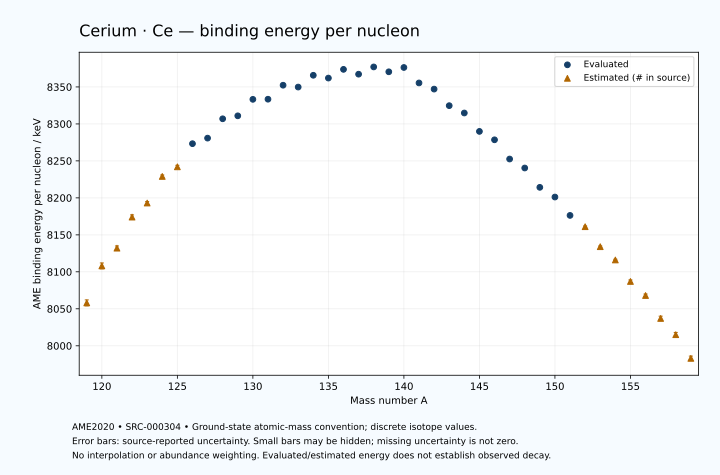

# Cerium — Atomic Masses and Reaction Energies

<!-- generated-by: sync-ame2020.mjs -->

**Dated evaluated data · scientific coverage remains partial.** 41 ground-state nuclides from AME2020. Values and uncertainties are transcribed from the retained unrounded analysis files; estimated quantities remain labelled.

- [Parent Cerium record](0058-Cerium-Ce.md) · [NUBASE states and decays](0058-Cerium-Ce-Nuclear-Evaluation.md)
- [Structured data](data/isotopes/0058-Cerium-Ce-AME2020-Evaluation.yaml)
- [Original mass table](../../data/catalog/sources/ame2020-mass_1.mas20.txt) · [Original reaction table](../../data/catalog/sources/ame2020-rct1.mas20.txt)
- [AME2020 methods](https://doi.org/10.1088/1674-1137/abddb0) (SRC-000303) · [Tables and definitions](https://doi.org/10.1088/1674-1137/abddaf) (SRC-000304)

## Reading the data

All table energies and uncertainties are in keV; binding energy is per nucleon. A # replaces a decimal point in the original estimated value. UNKNOWN (*) retains the source's not-calculable entry; it is neither zero nor automatically NOT APPLICABLE. Source lines are one-based in the retained files. Uncertainties remain those published by the evaluation, with no replacement by independent-mass quadrature.

Atomic-mass conventions apply. Qα is total decay energy, not alpha-particle kinetic energy. Positive Q alone does not establish a decay branch, rate or observation. He-4's source Qα of zero is a bookkeeping identity. These tables describe ground-state combinations, not isomer or excited-daughter transitions. Nuclear state and daughter lookups are explicit in the structured companion. The binding quantity follows [Z M(¹H) + N mₙ − M(A,Z)]c²/A; it has not been converted to a bare-nucleus convention.

## Mass and binding table

| Nuclide | N | Atomic mass excess / keV | AME binding per nucleon / keV | Mass-file line |
|---|---:|---|---|---:|
| Ce-119 | 61 | -43820# ± 500# | 8058# ± 4# | 1476 |
| Ce-120 | 62 | -49730# ± 500# | 8108# ± 4# | 1492 |
| Ce-121 | 63 | -52690# ± 401# | 8132# ± 3# | 1508 |
| Ce-122 | 64 | -57874# ± 401# | 8174# ± 3# | 1525 |
| Ce-123 | 65 | -60286# ± 298# | 8193# ± 2# | 1541 |
| Ce-124 | 66 | -64916# ± 298# | 8229# ± 2# | 1557 |
| Ce-125 | 67 | -66658# ± 196# | 8242# ± 2# | 1574 |
| Ce-126 | 68 | -70820.565 ± 27.945 | 8273.2581 ± 0.2218 | 1590 |
| Ce-127 | 69 | -71979.344 ± 28.876 | 8280.7922 ± 0.2274 | 1607 |
| Ce-128 | 70 | -75533.925 ± 27.945 | 8306.9259 ± 0.2183 | 1624 |
| Ce-129 | 71 | -76287.504 ± 27.945 | 8310.9411 ± 0.2166 | 1641 |
| Ce-130 | 72 | -79422.913 ± 27.945 | 8333.2164 ± 0.2150 | 1658 |
| Ce-131 | 73 | -79708.448 ± 32.802 | 8333.3969 ± 0.2504 | 1676 |
| Ce-132 | 74 | -82468.688 ± 20.407 | 8352.3223 ± 0.1546 | 1693 |
| Ce-133 | 75 | -82418.223 ± 16.354 | 8349.8301 ± 0.1230 | 1710 |
| Ce-134 | 76 | -84832.898 ± 20.387 | 8365.7716 ± 0.1521 | 1727 |
| Ce-135 | 77 | -84616.308 ± 10.266 | 8361.9861 ± 0.0760 | 1744 |
| Ce-136 | 78 | -86508.550 ± 0.324 | 8373.7624 ± 0.0024 | 1761 |
| Ce-137 | 79 | -85918.765 ± 0.360 | 8367.2497 ± 0.0026 | 1778 |
| Ce-138 | 80 | -87565.867 ± 0.499 | 8377.0408 ± 0.0036 | 1794 |
| Ce-139 | 81 | -86957.741 ± 2.089 | 8370.4664 ± 0.0150 | 1811 |
| Ce-140 | 82 | -88074.227 ± 1.313 | 8376.3045 ± 0.0094 | 1828 |
| Ce-141 | 83 | -85431.058 ± 1.315 | 8355.3956 ± 0.0093 | 1845 |
| Ce-142 | 84 | -84532.896 ± 2.443 | 8347.0700 ± 0.0172 | 1862 |
| Ce-143 | 85 | -81606.378 ± 2.442 | 8324.6765 ± 0.0171 | 1879 |
| Ce-144 | 86 | -80431.942 ± 2.833 | 8314.7612 ± 0.0197 | 1896 |
| Ce-145 | 87 | -77067.059 ± 33.900 | 8289.8762 ± 0.2338 | 1914 |
| Ce-146 | 88 | -75625.868 ± 14.665 | 8278.5081 ± 0.1004 | 1931 |
| Ce-147 | 89 | -72013.902 ± 8.580 | 8252.5274 ± 0.0584 | 1948 |
| Ce-148 | 90 | -70398.424 ± 11.195 | 8240.3876 ± 0.0756 | 1964 |
| Ce-149 | 91 | -66669.921 ± 10.246 | 8214.2294 ± 0.0688 | 1981 |
| Ce-150 | 92 | -64846.863 ± 11.697 | 8201.1230 ± 0.0780 | 1998 |
| Ce-151 | 93 | -61225.058 ± 17.698 | 8176.2779 ± 0.1172 | 2015 |
| Ce-152 | 94 | -58980# ± 200# | 8161# ± 1# | 2032 |
| Ce-153 | 95 | -54910# ± 200# | 8134# ± 1# | 2048 |
| Ce-154 | 96 | -52220# ± 200# | 8116# ± 1# | 2065 |
| Ce-155 | 97 | -47780# ± 300# | 8087# ± 2# | 2081 |
| Ce-156 | 98 | -44820# ± 300# | 8068# ± 2# | 2098 |
| Ce-157 | 99 | -39930# ± 400# | 8037# ± 3# | 2115 |
| Ce-158 | 100 | -36540# ± 400# | 8015# ± 3# | 2132 |
| Ce-159 | 101 | -31340# ± 500# | 7983# ± 3# | 2149 |

## Q-values and separation energies

| Nuclide | Qβ− / keV | Qα / keV | S₂n / keV | S₂p / keV | Reaction-file line |
|---|---|---|---|---|---:|
| Ce-119 | UNKNOWN (*) | 2675# ± 539# | UNKNOWN (*) | 940# ± 559# | 1475 |
| Ce-120 | UNKNOWN (*) | 2225# ± 539# | UNKNOWN (*) | 2108# ± 539# | 1491 |
| Ce-121 | -11139# ± 641# | 2343# ± 472# | 25012# ± 641# | 2678# ± 448# | 1507 |
| Ce-122 | -13094# ± 641# | 1901# ± 448# | 24287# ± 641# | 3563# ± 501# | 1524 |
| Ce-123 | -10056# ± 499# | 1879# ± 359# | 23739# ± 499# | 4119# ± 330# | 1540 |
| Ce-124 | -11765# ± 499# | 1548# ± 423# | 23185# ± 499# | 4885# ± 299# | 1556 |
| Ce-125 | -8587# ± 358# | 1662# ± 242# | 22514# ± 357# | 5581# ± 196# | 1573 |
| Ce-126 | -10497# ± 198# | 1363.4706 ± 39.5199 | 22047# ± 299# | 6308.7216 ± 30.6120 | 1589 |
| Ce-127 | -7436# ± 198# | 1250.7035 ± 31.3126 | 21464# ± 198# | 6888.3100 ± 30.8978 | 1606 |
| Ce-128 | -9203.1617 ± 40.8585 | 1130.9445 ± 30.6120 | 20855.9963 ± 39.5199 | 7441.9542 ± 30.6120 | 1623 |
| Ce-129 | -6513.9383 ± 40.8585 | 956.5560 ± 30.0290 | 20450.7963 ± 40.1840 | 8047.4911 ± 30.1644 | 1640 |
| Ce-130 | -8247.4488 ± 70.0853 | 822.0842 ± 30.6120 | 20031.6240 ± 39.5199 | 8631.6997 ± 27.9912 | 1657 |
| Ce-131 | -5407.7842 ± 55.4462 | 684.5912 ± 34.7127 | 19563.5801 ± 43.0918 | 9225.5244 ± 34.4430 | 1675 |
| Ce-132 | -7241.2240 ± 35.3594 | 475.5520 ± 20.4363 | 19188.4107 ± 34.6029 | 9789.8534 ± 20.4072 | 1692 |
| Ce-133 | -4480.6319 ± 20.5826 | 217.7266 ± 19.4368 | 18852.4113 ± 36.6532 | 10317.2070 ± 16.3595 | 1709 |
| Ce-134 | -6304.8987 ± 28.7814 | -1.0377 ± 20.3888 | 18506.8467 ± 28.8456 | 10975.9373 ± 20.4140 | 1726 |
| Ce-135 | -3680.4357 ± 15.6540 | -362.2652 ± 10.2746 | 18340.7205 ± 19.3095 | 11640.7377 ± 10.3140 | 1743 |
| Ce-136 | -5168.1290 ± 11.4561 | -498.5626 ± 1.1020 | 17818.2877 ± 20.3894 | 12136.4898 ± 0.2379 | 1760 |
| Ce-137 | -2716.9515 ± 8.1328 | -790.1691 ± 1.0553 | 17445.0938 ± 10.2675 | 12646.0526 ± 0.2668 | 1777 |
| Ce-138 | -4437.0000 ± 10.0000 | -1040.7803 ± 0.4615 | 17199.9529 ± 0.4977 | 13256.7296 ± 0.4501 | 1793 |
| Ce-139 | -2129.0890 ± 2.9962 | -1532.0024 ± 2.1031 | 17181.6122 ± 2.1195 | 13814.2826 ± 2.1034 | 1810 |
| Ce-140 | -3388.0000 ± 6.0000 | -1612.0637 ± 1.3354 | 16650.9965 ± 1.4045 | 14390.3634 ± 1.3362 | 1827 |
| Ce-141 | 583.4758 ± 1.1784 | -134.5727 ± 1.3380 | 14615.9525 ± 2.4056 | 15095.0821 ± 1.3388 | 1844 |
| Ce-142 | -746.5288 ± 2.4868 | 1303.9942 ± 2.4560 | 12601.3048 ± 2.4698 | 15842.9327 ± 8.2654 | 1861 |
| Ce-143 | 1461.8214 ± 1.8649 | 882.6235 ± 2.4553 | 12317.9567 ± 2.4694 | 16451.8283 ± 5.8431 | 1878 |
| Ce-144 | 318.6462 ± 0.8321 | 411.0472 ± 8.3897 | 12041.6825 ± 3.3594 | 17167.6272 ± 6.5523 | 1895 |
| Ce-145 | 2558.9318 ± 33.6347 | 240.5176 ± 34.3143 | 11603.3164 ± 33.9617 | 17707.7955 ± 34.5671 | 1913 |
| Ce-146 | 1047.6178 ± 32.4842 | -208.5274 ± 15.8146 | 11336.5626 ± 14.9324 | 18436.6808 ± 16.3090 | 1930 |
| Ce-147 | 3430.1913 ± 15.5317 | -501.6125 ± 10.9209 | 11089.4793 ± 34.9669 | 19075.6610 ± 12.0612 | 1947 |
| Ce-148 | 2137.0282 ± 12.5663 | -1056.2104 ± 13.2758 | 10915.1919 ± 18.4488 | 20110.0978 ± 11.3337 | 1963 |
| Ce-149 | 4369.4525 ± 14.2296 | -1578.6535 ± 13.2982 | 10798.6549 ± 13.3645 | 20983.8271 ± 22.2477 | 1980 |
| Ce-150 | 3453.6462 ± 14.2913 | -2405.5101 ± 11.8299 | 10591.0746 ± 16.1905 | 21879.8937 ± 11.7913 | 1997 |
| Ce-151 | 5554.6233 ± 21.1885 | -3385.9383 ± 26.5180 | 10697.7736 ± 20.4505 | 22972.3807 ± 17.8762 | 2014 |
| Ce-152 | 4778# ± 201# | -3860# ± 200# | 10276# ± 201# | 23668# ± 200# | 2031 |
| Ce-153 | 6659# ± 201# | -4504# ± 200# | 9827# ± 201# | 24548# ± 447# | 2047 |
| Ce-154 | 5640# ± 224# | -4755# ± 200# | 9382# ± 283# | 25188# ± 447# | 2064 |
| Ce-155 | 7635# ± 300# | -5265# ± 500# | 9013# ± 361# | 25888# ± 500# | 2080 |
| Ce-156 | 6630# ± 300# | -5635# ± 500# | 8743# ± 361# | 26478# ± 583# | 2097 |
| Ce-157 | 8504# ± 400# | -5885# ± 565# | 8293# ± 500# | UNKNOWN (*) | 2114 |
| Ce-158 | 7610# ± 500# | -6045# ± 640# | 7863# ± 500# | UNKNOWN (*) | 2131 |
| Ce-159 | 9430# ± 640# | UNKNOWN (*) | 7552# ± 640# | UNKNOWN (*) | 2148 |

Qβ− comes from the mass-file line in the first table. The other three columns come from the reaction-file line. Definitions and original source strings are retained in the structured data.

## Binding-energy chart

Discrete source values and source-reported uncertainties. No interpolation, natural-abundance weighting or observed-decay claim is implied. This quantitative chart supplements the 22 separate illustrative panels.

## Remaining review

Later measurements, state-specific decay branches, isomer Q-values, additional reaction channels and full claim-level review remain open. Existing authored values retain their own provenance; this companion does not overwrite them.
