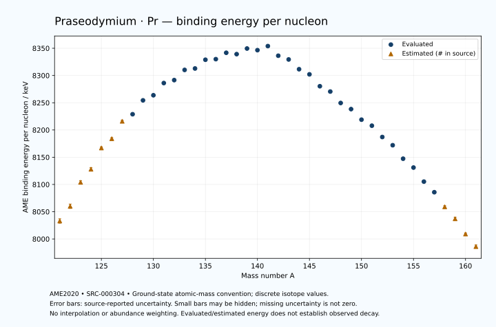

# Praseodymium — Atomic Masses and Reaction Energies

<!-- generated-by: sync-ame2020.mjs -->

**Dated evaluated data · scientific coverage remains partial.** 41 ground-state nuclides from AME2020. Values and uncertainties are transcribed from the retained unrounded analysis files; estimated quantities remain labelled.

- [Parent Praseodymium record](0059-Praseodymium-Pr.md) · [NUBASE states and decays](0059-Praseodymium-Pr-Nuclear-Evaluation.md)
- [Structured data](data/isotopes/0059-Praseodymium-Pr-AME2020-Evaluation.yaml)
- [Original mass table](../../data/catalog/sources/ame2020-mass_1.mas20.txt) · [Original reaction table 1](../../data/catalog/sources/ame2020-rct1.mas20.txt) · [Original reaction table 2](../../data/catalog/sources/ame2020-rct2.mas20.txt)
- [AME2020 methods](https://doi.org/10.1088/1674-1137/abddb0) (SRC-000303) · [Tables and definitions](https://doi.org/10.1088/1674-1137/abddaf) (SRC-000304)

## Reading the data

All table energies and uncertainties are in keV; binding energy is per nucleon. A # replaces a decimal point in the original estimated value. UNKNOWN (*) retains the source's not-calculable entry; it is neither zero nor automatically NOT APPLICABLE. Source lines are one-based in the retained files. Uncertainties remain those published by the evaluation, with no replacement by independent-mass quadrature.

Atomic-mass conventions apply. Qα is total decay energy, not alpha-particle kinetic energy. Positive Q alone does not establish a decay branch, rate or observation. He-4's source Qα of zero is a bookkeeping identity. These tables describe ground-state combinations, not isomer or excited-daughter transitions. Nuclear state and daughter lookups are explicit in the structured companion. The binding quantity follows [Z M(¹H) + N mₙ − M(A,Z)]c²/A; it has not been converted to a bare-nucleus convention.

## Mass and binding table

| Nuclide | N | Atomic mass excess / keV | AME binding per nucleon / keV | Mass-file line |
|---|---:|---|---|---:|
| Pr-121 | 62 | -41551# ± 500# | 8033# ± 4# | 1509 |
| Pr-122 | 63 | -44780# ± 500# | 8060# ± 4# | 1526 |
| Pr-123 | 64 | -50230# ± 400# | 8104# ± 3# | 1542 |
| Pr-124 | 65 | -53151# ± 401# | 8128# ± 3# | 1558 |
| Pr-125 | 66 | -58070# ± 300# | 8167# ± 2# | 1575 |
| Pr-126 | 67 | -60324# ± 196# | 8184# ± 2# | 1591 |
| Pr-127 | 68 | -64543# ± 196# | 8216# ± 2# | 1608 |
| Pr-128 | 69 | -66330.764 ± 29.808 | 8228.9141 ± 0.2329 | 1625 |
| Pr-129 | 70 | -69773.566 ± 29.808 | 8254.3808 ± 0.2311 | 1642 |
| Pr-130 | 71 | -71175.464 ± 64.273 | 8263.7565 ± 0.4944 | 1659 |
| Pr-131 | 72 | -74300.664 ± 46.995 | 8286.1439 ± 0.3587 | 1677 |
| Pr-132 | 73 | -75227.464 ± 28.876 | 8291.5377 ± 0.2188 | 1694 |
| Pr-133 | 74 | -77937.591 ± 12.497 | 8310.2588 ± 0.0940 | 1711 |
| Pr-134 | 75 | -78528.000 ± 20.316 | 8312.8817 ± 0.1516 | 1728 |
| Pr-135 | 76 | -80935.872 ± 11.817 | 8328.9284 ± 0.0875 | 1745 |
| Pr-136 | 77 | -81340.421 ± 11.455 | 8330.0089 ± 0.0842 | 1762 |
| Pr-137 | 78 | -83201.814 ± 8.135 | 8341.7074 ± 0.0594 | 1779 |
| Pr-138 | 79 | -83128.867 ± 10.012 | 8339.2195 ± 0.0726 | 1795 |
| Pr-139 | 80 | -84828.652 ± 3.649 | 8349.5208 ± 0.0263 | 1812 |
| Pr-140 | 81 | -84686.227 ± 6.142 | 8346.5163 ± 0.0439 | 1829 |
| Pr-141 | 82 | -86014.533 ± 1.498 | 8353.9852 ± 0.0106 | 1846 |
| Pr-142 | 83 | -83786.367 ± 1.498 | 8336.3032 ± 0.0106 | 1863 |
| Pr-143 | 84 | -83068.200 ± 1.816 | 8329.4280 ± 0.0127 | 1880 |
| Pr-144 | 85 | -80750.588 ± 2.708 | 8311.5411 ± 0.0188 | 1897 |
| Pr-145 | 86 | -79625.990 ± 7.149 | 8302.1285 ± 0.0493 | 1915 |
| Pr-146 | 87 | -76673.486 ± 34.356 | 8280.3250 ± 0.2353 | 1932 |
| Pr-147 | 88 | -75444.093 ± 15.855 | 8270.5400 ± 0.1079 | 1949 |
| Pr-148 | 89 | -72535.452 ± 15.041 | 8249.5409 ± 0.1016 | 1965 |
| Pr-149 | 90 | -71039.373 ± 9.874 | 8238.3040 ± 0.0663 | 1982 |
| Pr-150 | 91 | -68300.509 ± 9.015 | 8218.9316 ± 0.0601 | 1999 |
| Pr-151 | 92 | -66779.681 ± 11.650 | 8207.8824 ± 0.0772 | 2016 |
| Pr-152 | 93 | -63758.070 ± 18.537 | 8187.1049 ± 0.1220 | 2033 |
| Pr-153 | 94 | -61568.490 ± 11.882 | 8172.0371 ± 0.0777 | 2049 |
| Pr-154 | 95 | -57859.602 ± 100.005 | 8147.2994 ± 0.6494 | 2066 |
| Pr-155 | 96 | -55415.335 ± 17.198 | 8131.0398 ± 0.1110 | 2082 |
| Pr-156 | 97 | -51449.307 ± 1.025 | 8105.2337 ± 0.0066 | 2099 |
| Pr-157 | 98 | -48434.806 ± 3.167 | 8085.8170 ± 0.0202 | 2116 |
| Pr-158 | 99 | -44150# ± 300# | 8059# ± 2# | 2133 |
| Pr-159 | 100 | -40770# ± 400# | 8037# ± 3# | 2150 |
| Pr-160 | 101 | -36200# ± 400# | 8009# ± 2# | 2167 |
| Pr-161 | 102 | -32490# ± 500# | 7986# ± 3# | 2184 |

## Q-values and separation energies

| Nuclide | Qβ− / keV | Qα / keV | S₂n / keV | S₂p / keV | Reaction-file line |
|---|---|---|---|---|---:|
| Pr-121 | UNKNOWN (*) | 2295# ± 539# | UNKNOWN (*) | 1109# ± 583# | 1508 |
| Pr-122 | UNKNOWN (*) | 2415# ± 583# | UNKNOWN (*) | 1788# ± 583# | 1525 |
| Pr-123 | UNKNOWN (*) | 2365# ± 500# | 24821# ± 640# | 2618# ± 500# | 1541 |
| Pr-124 | -8321# ± 641# | 1994# ± 500# | 24514# ± 641# | 3186# ± 499# | 1557 |
| Pr-125 | -10001# ± 500# | 1695# ± 424# | 23983# ± 500# | 3997# ± 358# | 1574 |
| Pr-126 | -6943# ± 358# | 1795# ± 357# | 23315# ± 446# | 4643# ± 204# | 1590 |
| Pr-127 | -8633# ± 358# | 1683# ± 277# | 22616# ± 358# | 5362# ± 197# | 1607 |
| Pr-128 | -5800# ± 202# | 1502.9377 ± 64.0301 | 22150# ± 198# | 5935.2300 ± 95.2897 | 1624 |
| Pr-129 | -7399# ± 204# | 1561.0107 ± 39.5519 | 21373# ± 198# | 6455.3914 ± 39.5539 | 1641 |
| Pr-130 | -4579.2250 ± 70.0853 | 1373.0954 ± 111.0075 | 20987.3370 ± 70.8487 | 7127.9676 ± 84.2353 | 1658 |
| Pr-131 | -6532.6235 ± 53.0809 | 1170.5368 ± 53.7079 | 20669.7341 ± 55.6511 | 7555.0648 ± 51.6147 | 1676 |
| Pr-132 | -3801.6487 ± 37.6795 | 973.0593 ± 61.6312 | 20194.6355 ± 70.4618 | 8178.0316 ± 38.8206 | 1693 |
| Pr-133 | -5605.2112 ± 48.2223 | 961.0339 ± 24.7331 | 19779.5637 ± 48.6284 | 8746.2688 ± 30.6120 | 1710 |
| Pr-134 | -2881.5569 ± 23.5032 | 674.4589 ± 32.9538 | 19443.1719 ± 35.3071 | 9382.3641 ± 41.6497 | 1727 |
| Pr-135 | -4722.2522 ± 22.4837 | 408.4769 ± 30.3408 | 19140.9167 ± 17.1999 | 10019.4223 ± 30.3408 | 1744 |
| Pr-136 | -2141.1234 ± 16.4578 | -41.7592 ± 38.1202 | 18955.0574 ± 23.3229 | 10699.7042 ± 22.9869 | 1761 |
| Pr-137 | -3617.8447 ± 14.2706 | -132.3378 ± 29.1049 | 18408.5779 ± 14.3470 | 11136.2983 ± 12.4533 | 1778 |
| Pr-138 | -1111.6847 ± 15.3256 | -335.1237 ± 22.3033 | 17931.0819 ± 15.2125 | 11669.3210 ± 54.1055 | 1794 |
| Pr-139 | -2811.7226 ± 27.6166 | -610.1106 ± 10.1137 | 17769.4747 ± 8.9164 | 12265.7292 ± 4.0010 | 1811 |
| Pr-140 | -428.9806 ± 6.9536 | -1073.6551 ± 53.5245 | 17699.9965 ± 11.7462 | 12750.7610 ± 6.1560 | 1828 |
| Pr-141 | -1823.0137 ± 2.8090 | -1298.5841 ± 2.2209 | 17328.5173 ± 3.9159 | 13370.0947 ± 1.5437 | 1845 |
| Pr-142 | 2163.6885 ± 1.3656 | 302.1253 ± 1.5544 | 15242.7760 ± 6.1154 | 14052.2497 ± 1.5439 | 1862 |
| Pr-143 | 934.1107 ± 1.3673 | 1729.2653 ± 1.8841 | 13196.3023 ± 1.8886 | 14716.2982 ± 4.3649 | 1879 |
| Pr-144 | 2997.4400 ± 2.4000 | 1136.5553 ± 2.7563 | 13106.8574 ± 2.7619 | 15304.5802 ± 6.6541 | 1896 |
| Pr-145 | 1806.0140 ± 7.0370 | 878.9374 ± 8.1855 | 12700.4269 ± 7.1723 | 16032.4650 ± 10.2140 | 1914 |
| Pr-146 | 4252.4300 ± 34.3686 | 925.5479 ± 34.9178 | 12065.5342 ± 34.4520 | 16401.7687 ± 36.7111 | 1931 |
| Pr-147 | 2702.7013 ± 15.8571 | 302.4585 ± 17.4601 | 11960.7388 ± 17.3479 | 17186.7097 ± 20.0467 | 1948 |
| Pr-148 | 4872.6133 ± 15.0858 | -110.7086 ± 19.8393 | 12004.6023 ± 37.5012 | 17892.2209 ± 15.1343 | 1964 |
| Pr-149 | 3336.1617 ± 10.0853 | -628.9635 ± 15.7484 | 11737.9161 ± 18.6780 | 18938.9181 ± 14.5686 | 1981 |
| Pr-150 | 5379.4422 ± 9.0682 | -1504.2511 ± 9.1689 | 11907.6926 ± 17.5336 | 20169.7092 ± 21.4541 | 1998 |
| Pr-151 | 4163.5021 ± 11.6789 | -2526.2001 ± 15.8262 | 11882.9444 ± 15.2712 | 21137.7029 ± 200.6009 | 2015 |
| Pr-152 | 6391.5934 ± 30.7035 | -3474.2440 ± 26.8816 | 11600.1971 ± 20.6125 | 22024.8649 ± 18.7066 | 2032 |
| Pr-153 | 5761.8901 ± 12.1896 | -3773.4849 ± 200.6145 | 10931.4443 ± 16.6401 | 22836.0927 ± 435.6356 | 2048 |
| Pr-154 | 7720.0000 ± 100.0000 | -3973.3709 ± 100.0369 | 10244.1684 ± 101.7087 | 23148# ± 316# | 2065 |
| Pr-155 | 6868.4609 ± 19.4725 | -4529.9121 ± 435.8130 | 9989.4818 ± 20.9005 | 23934# ± 300# | 2081 |
| Pr-156 | 8752.8229 ± 1.6585 | -4584# ± 300# | 9732.3408 ± 100.0105 | 24498# ± 300# | 2098 |
| Pr-157 | 8059.3109 ± 3.8207 | -4800# ± 300# | 9162.1066 ± 17.4871 | 25082# ± 400# | 2115 |
| Pr-158 | 9685# ± 300# | -5045# ± 424# | 8843# ± 300# | 25678# ± 500# | 2132 |
| Pr-159 | 8954# ± 401# | -5264# ± 565# | 8477# ± 400# | 26278# ± 500# | 2149 |
| Pr-160 | 10525# ± 402# | -5574# ± 565# | 8192# ± 500# | UNKNOWN (*) | 2166 |
| Pr-161 | 9741# ± 640# | -5844# ± 583# | 7863# ± 640# | UNKNOWN (*) | 2183 |

## Additional decay-energy combinations

| Nuclide | Q₂β− / keV | Q₄β− / keV | Qεp / keV | Qβ−n / keV | Part 1 / part 2 line |
|---|---|---|---|---|---|
| Pr-121 | UNKNOWN (*) | UNKNOWN (*) | 8730# ± 583# | UNKNOWN (*) | 1508 / 1530 |
| Pr-122 | UNKNOWN (*) | UNKNOWN (*) | 10122# ± 583# | UNKNOWN (*) | 1525 / 1547 |
| Pr-123 | UNKNOWN (*) | UNKNOWN (*) | 7024# ± 499# | UNKNOWN (*) | 1541 / 1563 |
| Pr-124 | UNKNOWN (*) | UNKNOWN (*) | 8211# ± 446# | UNKNOWN (*) | 1557 / 1579 |
| Pr-125 | UNKNOWN (*) | UNKNOWN (*) | 4899# ± 305# | -21312# ± 583# | 1574 / 1597 |
| Pr-126 | -20574# ± 537# | UNKNOWN (*) | 6147# ± 197# | -20325# ± 445# | 1590 / 1613 |
| Pr-127 | -19233# ± 445# | UNKNOWN (*) | 3141# ± 216# | -19234# ± 358# | 1607 / 1630 |
| Pr-128 | -18111# ± 301# | UNKNOWN (*) | 4276.3818 ± 39.5539 | -18492# ± 301# | 1624 / 1647 |
| Pr-129 | -16594# ± 301# | UNKNOWN (*) | 1562.9021 ± 62.0731 | -17315# ± 202# | 1641 / 1665 |
| Pr-130 | -15706# ± 210# | -37663# ± 543# | 2859.1056 ± 67.7242 | -16872# ± 212# | 1658 / 1682 |
| Pr-131 | -14530# ± 206# | -34837# ± 402# | 37.7394 ± 53.6818 | -15775.7424 ± 54.6759 | 1676 / 1700 |
| Pr-132 | -13600# ± 152# | -33027# ± 401# | 1252.8299 ± 40.1840 | -15530.7415 ± 39.8879 | 1693 / 1717 |
| Pr-133 | -12529.9384 ± 51.8299 | -30702# ± 298# | -1502.9848 ± 38.4464 | -14583.0943 ± 27.2412 | 1710 / 1735 |
| Pr-134 | -11764.0912 ± 46.5811 | -28728# ± 301# | -322.5789 ± 34.5494 | -14266.9375 ± 50.8129 | 1727 / 1752 |
| Pr-135 | -10873.5429 ± 83.7410 | -26788# ± 196# | -3006.1842 ± 23.1699 | -13360.7473 ± 16.7124 | 1744 / 1769 |
| Pr-136 | -10170.4981 ± 70.0161 | -25097# ± 196# | -1985.9343 ± 14.8372 | -13198.1192 ± 22.2951 | 1761 / 1786 |
| Pr-137 | -9128.9555 ± 15.3704 | -23055.9101 ± 9.2386 | -4453.2971 ± 53.7897 | -12073.8344 ± 14.3470 | 1778 / 1804 |
| Pr-138 | -8214.4966 ± 15.3256 | -21379.1910 ± 29.6844 | -3276.9724 ± 10.1406 | -11616.2156 ± 15.4180 | 1794 / 1820 |
| Pr-139 | -7327.6239 ± 14.0179 | -19430.6009 ± 13.6475 | -5604.2153 ± 3.6731 | -10882.7885 ± 12.1632 | 1811 / 1837 |
| Pr-140 | -6474.1806 ± 24.9870 | -17700.2816 ± 51.9029 | -4752.8172 ± 6.1470 | -10740.6153 ± 28.1965 | 1828 / 1854 |
| Pr-141 | -5491.6016 ± 14.0524 | -16088.8867 ± 12.7197 | -8991.4452 ± 1.5437 | -9828.6052 ± 3.5877 | 1845 / 1872 |
| Pr-142 | -2644.8311 ± 23.6385 | -12477.4374 ± 30.0638 | -8145.4944 ± 4.0975 | -7666.1652 ± 2.8100 | 1862 / 1889 |
| Pr-143 | -107.5356 ± 3.0105 | -8826.8888 ± 11.1348 | -10333.2206 ± 6.1095 | -5189.4623 ± 1.3689 | 1879 / 1906 |
| Pr-144 | 665.5283 ± 3.5726 | -5131.4137 ± 11.0682 | -9868.0918 ± 7.7814 | -4819.5959 ± 2.4006 | 1896 / 1923 |
| Pr-145 | 1641.5158 ± 7.4800 | -1634.4663 ± 7.5822 | -12065.3017 ± 14.7803 | -3949.2802 ± 7.0407 | 1914 / 1942 |
| Pr-146 | 2780.8740 ± 34.6111 | 444.1167 ± 34.8697 | -11127.1319 ± 36.4809 | -3312.8000 ± 34.3686 | 1931 / 1959 |
| Pr-147 | 3597.8909 ± 15.8625 | 2100.5181 ± 16.0188 | -13511.8904 ± 15.9430 | -2589.4949 ± 15.8572 | 1948 / 1976 |
| Pr-148 | 4330.4242 ± 16.0596 | 3762.0296 ± 18.0266 | -13146.0264 ± 18.4660 | -2459.9761 ± 15.0602 | 1964 / 1992 |
| Pr-149 | 5025.0314 ± 10.1124 | 5401.9437 ± 10.6173 | -15619.6023 ± 21.8290 | -1702.6254 ± 10.0850 | 1981 / 2010 |
| Pr-150 | 5296.8266 ± 21.9591 | 6491.8605 ± 10.9482 | -15369.5595 ± 200.4651 | -1996.2922 ± 9.2330 | 1998 / 2027 |
| Pr-151 | 6606.5788 ± 12.5052 | 7873.4168 ± 11.6849 | -17757.5052 ± 11.9182 | -1171.0482 ± 11.6787 | 2015 / 2044 |
| Pr-152 | 7496.3984 ± 31.8534 | 9130.4299 ± 18.5734 | -17736.7021 ± 435.8678 | -886.2046 ± 18.5713 | 2032 / 2061 |
| Pr-153 | 9079.5137 ± 14.9409 | 11798.9769 ± 11.9392 | -19567# ± 300# | 509.8557 ± 27.2079 | 2048 / 2078 |
| Pr-154 | 10407.0000 ± 103.0776 | 13878.7645 ± 100.0123 | -19089# ± 316# | 1399.4593 ± 100.0430 | 2065 / 2095 |
| Pr-155 | 11524.6704 ± 17.8226 | 16403.0017 ± 17.2431 | -21175# ± 300# | 2092.9489 ± 17.2284 | 2081 / 2111 |
| Pr-156 | 12717.5404 ± 1.5689 | 18633.5372 ± 3.6773 | -20808# ± 400# | 2763.1711 ± 9.2107 | 2098 / 2128 |
| Pr-157 | 13862.3102 ± 7.6887 | 21024.3285 ± 5.2878 | -22673# ± 400# | 3696.0061 ± 3.4251 | 2115 / 2146 |
| Pr-158 | 14956# ± 300# | 23120# ± 300# | -22369# ± 424# | 4273# ± 300# | 2132 / 2163 |
| Pr-159 | 15785# ± 400# | 25274# ± 400# | UNKNOWN (*) | 4994# ± 400# | 2149 / 2180 |
| Pr-160 | 16695# ± 400# | 27294# ± 400# | UNKNOWN (*) | 5453# ± 401# | 2166 / 2197 |
| Pr-161 | 17597# ± 500# | 29302# ± 500# | UNKNOWN (*) | 6164# ± 502# | 2183 / 2215 |

## Single-nucleon separation and reaction energies

| Nuclide | Sₙ / keV | Sₚ / keV | Q(d,α) / keV | Q(p,α) / keV | Q(n,α) / keV | Part 2 line |
|---|---|---|---|---|---|---:|
| Pr-121 | UNKNOWN (*) | -889.5999 ± 10.0000 | 12980# ± 707# | UNKNOWN (*) | 13715# ± 583# | 1530 |
| Pr-122 | 11300# ± 707# | -621# ± 641# | 15661# ± 707# | 3905# ± 707# | 15886# ± 583# | 1547 |
| Pr-123 | 13521# ± 640# | -355# ± 566# | 13171# ± 566# | 4364# ± 640# | 12987# ± 500# | 1563 |
| Pr-124 | 10992# ± 566# | 154# ± 499# | 15433# ± 566# | 4403# ± 566# | 14686# ± 500# | 1579 |
| Pr-125 | 12991# ± 500# | 443# ± 423# | 12927# ± 423# | 4668# ± 500# | 12119# ± 423# | 1597 |
| Pr-126 | 10325# ± 358# | 955# ± 277# | 15303# ± 357# | 4827# ± 357# | 13974# ± 277# | 1613 |
| Pr-127 | 12291# ± 277# | 1012# ± 198# | 12825# ± 277# | 5237# ± 357# | 11362# ± 204# | 1630 |
| Pr-128 | 9859# ± 198# | 1640.3908 ± 41.5012 | 15200.6086 ± 40.8585 | 5191# ± 198# | 13075.1310 ± 39.5519 | 1647 |
| Pr-129 | 11514.1203 ± 42.1546 | 1528.6115 ± 40.8585 | 12916.5851 ± 41.5012 | 5911.0546 ± 40.8585 | 10846.3121 ± 95.2897 | 1665 |
| Pr-130 | 9473.2167 ± 70.8487 | 2176.9314 ± 70.0853 | 15069.2679 ± 70.0853 | 5667.9346 ± 70.4618 | 12367.0543 ± 69.3328 | 1682 |
| Pr-131 | 11196.5174 ± 79.6214 | 2166.7216 ± 54.6759 | 12697.6473 ± 54.6759 | 6097.3167 ± 54.6759 | 9971.1773 ± 71.9243 | 1700 |
| Pr-132 | 8998.1180 ± 55.1578 | 2807.9868 ± 43.7016 | 14906.2565 ± 40.1840 | 5924.0955 ± 40.1840 | 11742.4795 ± 35.9080 | 1717 |
| Pr-133 | 10781.4456 ± 31.4647 | 2757.8747 ± 23.9297 | 12481.6637 ± 35.1024 | 6349.3771 ± 30.6120 | 9336.1852 ± 28.7990 | 1735 |
| Pr-134 | 8661.7263 ± 23.8523 | 3398.7474 ± 26.0808 | 14651.4952 ± 28.7958 | 6044.5037 ± 38.5842 | 10887.6673 ± 34.5494 | 1752 |
| Pr-135 | 10479.1904 ± 23.5032 | 3391.9447 ± 23.5642 | 12193.1583 ± 20.1771 | 6396.8710 ± 23.5818 | 8434.1078 ± 38.2309 | 1769 |
| Pr-136 | 8475.8670 ± 16.4578 | 4013.0843 ± 15.3808 | 14203.2845 ± 23.3844 | 5941.8576 ± 19.9667 | 9800.3731 ± 30.2013 | 1786 |
| Pr-137 | 9932.7110 ± 14.0480 | 3982.2350 ± 8.1333 | 12125.3009 ± 13.0962 | 6495.1398 ± 21.9501 | 7663.2473 ± 21.5261 | 1804 |
| Pr-138 | 7998.3710 ± 12.8982 | 4499.0724 ± 10.0136 | 14090.4902 ± 10.0124 | 6351.4962 ± 14.3371 | 9160.9931 ± 13.7523 | 1820 |
| Pr-139 | 9771.1038 ± 10.6568 | 4551.7568 ± 3.6834 | 11800.9200 ± 3.6671 | 6543.9527 ± 3.6638 | 6855.2376 ± 53.2961 | 1837 |
| Pr-140 | 7928.8927 ± 7.1230 | 5017.4567 ± 6.4638 | 13590.4466 ± 6.1622 | 6096.5935 ± 6.1525 | 8101.0405 ± 6.3571 | 1854 |
| Pr-141 | 9399.6246 ± 6.1151 | 5229.2776 ± 1.1810 | 11654.0148 ± 2.5254 | 6415.3883 ± 1.5786 | 6145.2768 ± 1.5543 | 1872 |
| Pr-142 | 5843.1515 ± 0.0768 | 5644.2803 ± 1.1799 | 14998.6671 ± 1.1825 | 8035.4296 ± 2.5256 | 9082.4162 ± 1.5439 | 1889 |
| Pr-143 | 7353.1508 ± 1.8881 | 5824.2750 ± 1.8667 | 13073.6650 ± 1.9236 | 9870.0825 ± 1.9232 | 6890.2619 ± 1.8841 | 1906 |
| Pr-144 | 5753.7066 ± 2.7626 | 6433.1810 ± 3.2539 | 14493.1145 ± 3.2547 | 9544.5247 ± 2.8054 | 7825.6576 ± 4.8185 | 1923 |
| Pr-145 | 6946.7202 ± 7.4386 | 6483.0194 ± 7.4849 | 12691.1949 ± 7.3752 | 9770.9605 ± 7.3756 | 6044.3620 ± 9.3851 | 1942 |
| Pr-146 | 5118.8140 ± 35.0812 | 6895.3988 ± 48.2605 | 14469.2627 ± 34.4620 | 9796.9471 ± 34.4336 | 7144.3834 ± 35.1276 | 1959 |
| Pr-147 | 6841.9248 ± 37.8333 | 7107.1957 ± 21.5958 | 12333.7725 ± 37.4110 | 9851.9041 ± 16.0595 | 5051.9689 ± 20.4629 | 1976 |
| Pr-148 | 5162.6774 ± 21.8429 | 7810.5218 ± 17.3141 | 13801.2230 ± 21.0062 | 9395.6613 ± 37.0780 | 5946.2752 ± 19.4099 | 1992 |
| Pr-149 | 6575.2387 ± 17.9926 | 7929.9199 ± 14.9269 | 11685.3357 ± 13.0810 | 9450.5506 ± 17.6790 | 3828.2028 ± 10.0149 | 2010 |
| Pr-150 | 5332.4540 ± 13.3700 | 8919.5595 ± 13.6475 | 12808.7223 ± 14.3718 | 8577.4480 ± 12.4445 | 4024.2904 ± 14.0006 | 2027 |
| Pr-151 | 6550.4904 ± 14.7279 | 9221.7897 ± 16.5084 | 10601.0462 ± 15.5148 | 8482.7981 ± 16.1546 | 1575.4627 ± 22.6877 | 2044 |
| Pr-152 | 5049.7067 ± 21.8936 | 9821.9830 ± 25.6290 | 11799.5998 ± 21.9186 | 7775.9058 ± 21.1802 | 2108.2528 ± 201.1184 | 2061 |
| Pr-153 | 5881.7376 ± 22.0179 | 9877# ± 201# | 10367.3755 ± 21.3169 | 8142.4284 ± 16.6731 | 389.0599 ± 12.1450 | 2078 |
| Pr-154 | 4362.4307 ± 100.7086 | 10239# ± 224# | 11832# ± 224# | 8229.5110 ± 101.5593 | 1097.1389 ± 446.8089 | 2095 |
| Pr-155 | 5627.0511 ± 101.4732 | 10485# ± 201# | 10205# ± 201# | 8429# ± 201# | -479# ± 300# | 2111 |
| Pr-156 | 4105.2897 ± 17.2284 | 10958# ± 300# | 11481# ± 200# | 8324# ± 200# | 257# ± 300# | 2128 |
| Pr-157 | 5056.8168 ± 3.3287 | 10904# ± 300# | 10056# ± 300# | 8649# ± 200# | -1259# ± 300# | 2146 |
| Pr-158 | 3787# ± 300# | 11509# ± 500# | 11381# ± 424# | 8494# ± 424# | -573# ± 500# | 2163 |
| Pr-159 | 4691# ± 500# | 11519# ± 565# | 9872# ± 565# | 8914# ± 500# | -2073# ± 565# | 2180 |
| Pr-160 | 3501# ± 565# | 12149# ± 640# | 11051# ± 565# | 8595# ± 565# | -1483# ± 500# | 2197 |
| Pr-161 | 4361# ± 640# | UNKNOWN (*) | 9561# ± 707# | 8914# ± 640# | UNKNOWN (*) | 2215 |

Qβ− comes from the mass-file line in the first table. Qα, S₂n, S₂p, Q₂β−, Qεp and Qβ−n come from reaction part 1; Q₄β− and the last table come from part 2. Qεp is electron-capture/proton energy balance; Qβ−n is beta-minus/neutron energy balance. These are evaluated mass combinations, not observations of decay modes, cross sections or reaction rates. Light-nuclide zero entries can be bookkeeping identities, without a physical A=0 residual. Definitions and original source strings are retained in the structured data.

## Binding-energy chart

Discrete source values and source-reported uncertainties. No interpolation, natural-abundance weighting or observed-decay claim is implied. This quantitative chart supplements the 22 separate illustrative panels.

## Remaining review

Later measurements, state-specific decay branches, isomer Q-values, reaction rates, applicability and full claim-level review remain open. Existing authored values retain their own provenance; this companion does not overwrite them.
