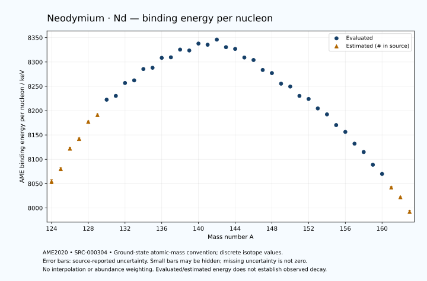

# Neodymium — Atomic Masses and Reaction Energies

<!-- generated-by: sync-ame2020.mjs -->

**Dated evaluated data · scientific coverage remains partial.** 40 ground-state nuclides from AME2020. Values and uncertainties are transcribed from the retained unrounded analysis files; estimated quantities remain labelled.

- [Parent Neodymium record](0060-Neodymium-Nd.md) · [NUBASE states and decays](0060-Neodymium-Nd-Nuclear-Evaluation.md)
- [Structured data](data/isotopes/0060-Neodymium-Nd-AME2020-Evaluation.yaml)
- [Original mass table](../../data/catalog/sources/ame2020-mass_1.mas20.txt) · [Original reaction table](../../data/catalog/sources/ame2020-rct1.mas20.txt)
- [AME2020 methods](https://doi.org/10.1088/1674-1137/abddb0) (SRC-000303) · [Tables and definitions](https://doi.org/10.1088/1674-1137/abddaf) (SRC-000304)

## Reading the data

All table energies and uncertainties are in keV; binding energy is per nucleon. A # replaces a decimal point in the original estimated value. UNKNOWN (*) retains the source's not-calculable entry; it is neither zero nor automatically NOT APPLICABLE. Source lines are one-based in the retained files. Uncertainties remain those published by the evaluation, with no replacement by independent-mass quadrature.

Atomic-mass conventions apply. Qα is total decay energy, not alpha-particle kinetic energy. Positive Q alone does not establish a decay branch, rate or observation. He-4's source Qα of zero is a bookkeeping identity. These tables describe ground-state combinations, not isomer or excited-daughter transitions. Nuclear state and daughter lookups are explicit in the structured companion. The binding quantity follows [Z M(¹H) + N mₙ − M(A,Z)]c²/A; it has not been converted to a bare-nucleus convention.

## Mass and binding table

| Nuclide | N | Atomic mass excess / keV | AME binding per nucleon / keV | Mass-file line |
|---|---:|---|---|---:|
| Nd-124 | 64 | -44830# ± 500# | 8054# ± 4# | 1559 |
| Nd-125 | 65 | -48070# ± 400# | 8080# ± 3# | 1576 |
| Nd-126 | 66 | -53380# ± 300# | 8122# ± 2# | 1592 |
| Nd-127 | 67 | -55910# ± 300# | 8142# ± 2# | 1609 |
| Nd-128 | 68 | -60530# ± 200# | 8177# ± 2# | 1626 |
| Nd-129 | 69 | -62375# ± 202# | 8191# ± 2# | 1643 |
| Nd-130 | 70 | -66596.239 ± 27.945 | 8222.5136 ± 0.2150 | 1660 |
| Nd-131 | 71 | -67768.040 ± 27.517 | 8230.3045 ± 0.2101 | 1678 |
| Nd-132 | 72 | -71425.815 ± 24.205 | 8256.8104 ± 0.1834 | 1695 |
| Nd-133 | 73 | -72332.380 ± 46.575 | 8262.2320 ± 0.3502 | 1712 |
| Nd-134 | 74 | -75646.443 ± 11.817 | 8285.5391 ± 0.0882 | 1729 |
| Nd-135 | 75 | -76213.620 ± 19.128 | 8288.1536 ± 0.1417 | 1746 |
| Nd-136 | 76 | -79199.297 ± 11.817 | 8308.5127 ± 0.0869 | 1763 |
| Nd-137 | 77 | -79583.969 ± 11.725 | 8309.5892 ± 0.0856 | 1780 |
| Nd-138 | 78 | -82017.182 ± 11.603 | 8325.4946 ± 0.0841 | 1796 |
| Nd-139 | 79 | -82016.930 ± 27.521 | 8323.6642 ± 0.1980 | 1813 |
| Nd-140 | 80 | -84257.246 ± 3.260 | 8337.8640 ± 0.0233 | 1830 |
| Nd-141 | 81 | -84191.520 ± 3.183 | 8335.5074 ± 0.0226 | 1847 |
| Nd-142 | 82 | -85950.055 ± 1.256 | 8346.0310 ± 0.0088 | 1864 |
| Nd-143 | 83 | -84002.310 ± 1.255 | 8330.4893 ± 0.0088 | 1881 |
| Nd-144 | 84 | -83748.028 ± 1.255 | 8326.9237 ± 0.0087 | 1898 |
| Nd-145 | 85 | -81432.004 ± 1.271 | 8309.1883 ± 0.0088 | 1916 |
| Nd-146 | 86 | -80925.916 ± 1.273 | 8304.0927 ± 0.0087 | 1933 |
| Nd-147 | 87 | -78146.794 ± 1.275 | 8283.6036 ± 0.0087 | 1950 |
| Nd-148 | 88 | -77408.066 ± 2.053 | 8277.1778 ± 0.0139 | 1966 |
| Nd-149 | 89 | -74375.535 ± 2.054 | 8255.4437 ± 0.0138 | 1983 |
| Nd-150 | 90 | -73679.951 ± 1.129 | 8249.5789 ± 0.0075 | 2000 |
| Nd-151 | 91 | -70943.183 ± 1.133 | 8230.2741 ± 0.0075 | 2017 |
| Nd-152 | 92 | -70149.663 ± 24.476 | 8224.0078 ± 0.1610 | 2034 |
| Nd-153 | 93 | -67330.380 ± 2.747 | 8204.5832 ± 0.0180 | 2050 |
| Nd-154 | 94 | -65579.602 ± 1.025 | 8192.3491 ± 0.0067 | 2067 |
| Nd-155 | 95 | -62283.796 ± 9.154 | 8170.3050 ± 0.0591 | 2083 |
| Nd-156 | 96 | -60202.130 ± 1.304 | 8156.3265 ± 0.0084 | 2100 |
| Nd-157 | 97 | -56494.117 ± 2.137 | 8132.1671 ± 0.0136 | 2117 |
| Nd-158 | 98 | -53835.123 ± 1.304 | 8114.9529 ± 0.0083 | 2134 |
| Nd-159 | 99 | -49724.007 ± 29.808 | 8088.8224 ± 0.1875 | 2151 |
| Nd-160 | 100 | -46724.515 ± 46.575 | 8069.9662 ± 0.2911 | 2168 |
| Nd-161 | 101 | -42230# ± 400# | 8042# ± 2# | 2185 |
| Nd-162 | 102 | -39010# ± 400# | 8022# ± 2# | 2202 |
| Nd-163 | 103 | -34080# ± 500# | 7992# ± 3# | 2219 |

## Q-values and separation energies

| Nuclide | Qβ− / keV | Qα / keV | S₂n / keV | S₂p / keV | Reaction-file line |
|---|---|---|---|---|---:|
| Nd-124 | UNKNOWN (*) | 2475# ± 707# | UNKNOWN (*) | 1534# ± 641# | 1558 |
| Nd-125 | UNKNOWN (*) | 2195# ± 566# | UNKNOWN (*) | 2361# ± 499# | 1575 |
| Nd-126 | -13631# ± 583# | 2069# ± 500# | 24693# ± 583# | 3042# ± 423# | 1591 |
| Nd-127 | -10600# ± 500# | 1951# ± 423# | 23983# ± 500# | 3830# ± 358# | 1608 |
| Nd-128 | -12311# ± 361# | 1961# ± 359# | 23293# ± 361# | 4288# ± 202# | 1625 |
| Nd-129 | -9195# ± 362# | 1858# ± 281# | 22607# ± 362# | 4974# ± 204# | 1642 |
| Nd-130 | -11127# ± 202# | 1799.4099 ± 39.5199 | 22209# ± 202# | 5640.2562 ± 39.5199 | 1659 |
| Nd-131 | -7998# ± 202# | 1786.3876 ± 39.8879 | 21536# ± 204# | 6058.4784 ± 39.2188 | 1677 |
| Nd-132 | -9798# ± 151# | 1683.1944 ± 36.9705 | 20972.2118 ± 36.9705 | 6580.8440 ± 36.9705 | 1694 |
| Nd-133 | -6924.7272 ± 68.5519 | 1530.2081 ± 54.3150 | 20706.9759 ± 54.0963 | 7201.8742 ± 56.9666 | 1711 |
| Nd-134 | -8882.5343 ± 43.5512 | 1351.5547 ± 30.3408 | 20363.2637 ± 26.9361 | 7755.6970 ± 23.5818 | 1728 |
| Nd-135 | -6151.2907 ± 85.0809 | 1069.9125 ± 37.9718 | 20023.8757 ± 50.3494 | 8373.3386 ± 25.1659 | 1745 |
| Nd-136 | -8029.3747 ± 70.0764 | 844.4745 ± 23.5818 | 19695.4909 ± 16.7124 | 8944.3412 ± 23.5642 | 1762 |
| Nd-137 | -5511.1108 ± 17.5366 | 409.3383 ± 20.1228 | 19512.9855 ± 22.4350 | 9545.6035 ± 15.5840 | 1779 |
| Nd-138 | -7102.8119 ± 16.0995 | 390.8005 ± 23.4573 | 18960.5206 ± 16.5613 | 10086.5742 ± 11.6073 | 1795 |
| Nd-139 | -4515.9014 ± 25.8700 | 174.4620 ± 29.3736 | 18575.5968 ± 29.9145 | 10676.1066 ± 27.5235 | 1812 |
| Nd-140 | -6045.2000 ± 24.0000 | -173.6125 ± 3.2763 | 18382.7006 ± 12.0521 | 11269.3219 ± 3.2983 | 1829 |
| Nd-141 | -3668.5879 ± 14.3304 | -697.6704 ± 3.2035 | 18317.2262 ± 27.7034 | 11811.7206 ± 3.7773 | 1846 |
| Nd-142 | -4808.5196 ± 23.6216 | -809.1047 ± 1.3515 | 17835.4451 ± 3.4938 | 12453.7705 ± 1.4524 | 1863 |
| Nd-143 | -1041.6463 ± 2.6830 | 530.5151 ± 2.4150 | 15953.4267 ± 3.1239 | 13149.1948 ± 1.4525 | 1880 |
| Nd-144 | -2331.9117 ± 2.6464 | 1901.2829 ± 1.4525 | 13940.6089 ± 0.0871 | 13793.0747 ± 2.1985 | 1897 |
| Nd-145 | -164.4982 ± 2.5361 | 1574.1374 ± 1.4683 | 13572.3302 ± 0.2366 | 14403.5683 ± 2.2089 | 1915 |
| Nd-146 | -1471.5560 ± 4.1194 | 1182.0635 ± 2.2117 | 13320.5242 ± 0.2453 | 15071.9164 ± 2.5520 | 1932 |
| Nd-147 | 895.1896 ± 0.5664 | 1034.6680 ± 2.2120 | 12857.4261 ± 0.1239 | 15657.6780 ± 33.8925 | 1949 |
| Nd-148 | -542.1891 ± 5.8755 | 598.9604 ± 3.0372 | 12624.7856 ± 1.6539 | 16360.1394 ± 14.8042 | 1965 |
| Nd-149 | 1688.8697 ± 2.4588 | 266.6079 ± 33.9321 | 12371.3765 ± 1.6570 | 16939.5752 ± 8.8087 | 1982 |
| Nd-150 | -82.6155 ± 20.0010 | -478.9986 ± 14.7059 | 12414.5215 ± 1.8778 | 17859.4691 ± 11.2386 | 1999 |
| Nd-151 | 2443.0767 ± 4.4734 | -1354.1975 ± 8.6458 | 12710.2847 ± 1.8817 | 18851.2050 ± 10.3088 | 2016 |
| Nd-152 | 1104.8050 ± 18.5011 | -2176.1550 ± 26.9100 | 12612.3483 ± 24.4549 | 19880.7427 ± 27.1272 | 2033 |
| Nd-153 | 3317.6236 ± 9.3521 | -3085.3749 ± 10.6083 | 12529.8323 ± 2.9689 | 20683.2637 ± 17.9103 | 2049 |
| Nd-154 | 2687.0000 ± 25.0000 | -3157.6554 ± 11.7416 | 11572.5750 ± 24.4979 | 21177# ± 200# | 2066 |
| Nd-155 | 4656.2095 ± 10.2781 | -3483.6539 ± 19.9254 | 11096.0526 ± 9.5330 | 21952# ± 200# | 2082 |
| Nd-156 | 3964.7175 ± 1.7642 | -3647# ± 200# | 10765.1637 ± 1.6585 | 22561# ± 200# | 2099 |
| Nd-157 | 5802.9994 ± 7.3246 | -4009# ± 200# | 10352.9566 ± 9.3996 | 23292# ± 300# | 2116 |
| Nd-158 | 5271.0196 ± 1.5776 | -4040# ± 200# | 9775.6296 ± 1.8443 | 23593# ± 300# | 2133 |
| Nd-159 | 6830.3441 ± 31.4529 | -4369# ± 301# | 9372.5266 ± 29.8843 | 24372# ± 401# | 2150 |
| Nd-160 | 6170.1238 ± 46.6198 | -4330# ± 304# | 9032.0277 ± 46.5930 | 24763# ± 402# | 2167 |
| Nd-161 | 7856# ± 400# | -4725# ± 565# | 8649# ± 401# | 25468# ± 640# | 2184 |
| Nd-162 | 7030# ± 500# | -4895# ± 565# | 8428# ± 402# | UNKNOWN (*) | 2201 |
| Nd-163 | 8880# ± 640# | -5164# ± 707# | 7992# ± 640# | UNKNOWN (*) | 2218 |

Qβ− comes from the mass-file line in the first table. The other three columns come from the reaction-file line. Definitions and original source strings are retained in the structured data.

## Binding-energy chart

Discrete source values and source-reported uncertainties. No interpolation, natural-abundance weighting or observed-decay claim is implied. This quantitative chart supplements the 22 separate illustrative panels.

## Remaining review

Later measurements, state-specific decay branches, isomer Q-values, additional reaction channels and full claim-level review remain open. Existing authored values retain their own provenance; this companion does not overwrite them.
