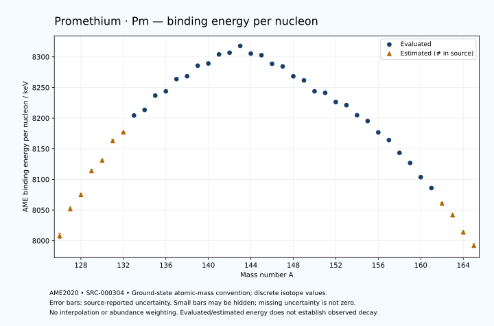

# Promethium — Atomic Masses and Reaction Energies

<!-- generated-by: sync-ame2020.mjs -->

**Dated evaluated data · scientific coverage remains partial.** 40 ground-state nuclides from AME2020. Values and uncertainties are transcribed from the retained unrounded analysis files; estimated quantities remain labelled.

- [Parent Promethium record](0061-Promethium-Pm.md) · [NUBASE states and decays](0061-Promethium-Pm-Nuclear-Evaluation.md)
- [Structured data](data/isotopes/0061-Promethium-Pm-AME2020-Evaluation.yaml)
- [Original mass table](../../data/catalog/sources/ame2020-mass_1.mas20.txt) · [Original reaction table](../../data/catalog/sources/ame2020-rct1.mas20.txt)
- [AME2020 methods](https://doi.org/10.1088/1674-1137/abddb0) (SRC-000303) · [Tables and definitions](https://doi.org/10.1088/1674-1137/abddaf) (SRC-000304)

## Reading the data

All table energies and uncertainties are in keV; binding energy is per nucleon. A # replaces a decimal point in the original estimated value. UNKNOWN (*) retains the source's not-calculable entry; it is neither zero nor automatically NOT APPLICABLE. Source lines are one-based in the retained files. Uncertainties remain those published by the evaluation, with no replacement by independent-mass quadrature.

Atomic-mass conventions apply. Qα is total decay energy, not alpha-particle kinetic energy. Positive Q alone does not establish a decay branch, rate or observation. He-4's source Qα of zero is a bookkeeping identity. These tables describe ground-state combinations, not isomer or excited-daughter transitions. Nuclear state and daughter lookups are explicit in the structured companion. The binding quantity follows [Z M(¹H) + N mₙ − M(A,Z)]c²/A; it has not been converted to a bare-nucleus convention.

## Mass and binding table

| Nuclide | N | Atomic mass excess / keV | AME binding per nucleon / keV | Mass-file line |
|---|---:|---|---|---:|
| Pm-126 | 65 | -39750# ± 500# | 8008# ± 4# | 1593 |
| Pm-127 | 66 | -45310# ± 400# | 8052# ± 3# | 1610 |
| Pm-128 | 67 | -48220# ± 300# | 8075# ± 2# | 1627 |
| Pm-129 | 68 | -53180# ± 300# | 8114# ± 2# | 1644 |
| Pm-130 | 69 | -55470# ± 200# | 8131# ± 2# | 1661 |
| Pm-131 | 70 | -59770# ± 200# | 8163# ± 2# | 1679 |
| Pm-132 | 71 | -61628# ± 149# | 8177# ± 1# | 1696 |
| Pm-133 | 72 | -65407.653 ± 50.301 | 8204.2841 ± 0.3782 | 1713 |
| Pm-134 | 73 | -66763.908 ± 41.917 | 8213.4131 ± 0.3128 | 1730 |
| Pm-135 | 74 | -70062.329 ± 82.903 | 8236.7933 ± 0.6141 | 1747 |
| Pm-136 | 75 | -71169.923 ± 69.073 | 8243.7207 ± 0.5079 | 1764 |
| Pm-137 | 76 | -74072.858 ± 13.041 | 8263.6516 ± 0.0952 | 1781 |
| Pm-138 | 77 | -74914.370 ± 11.603 | 8268.3558 ± 0.0841 | 1797 |
| Pm-139 | 78 | -77501.028 ± 13.588 | 8285.5473 ± 0.0978 | 1814 |
| Pm-140 | 79 | -78212.046 ± 24.220 | 8289.0958 ± 0.1730 | 1831 |
| Pm-141 | 80 | -80522.932 ± 13.972 | 8303.9405 ± 0.0991 | 1848 |
| Pm-142 | 81 | -81141.536 ± 23.596 | 8306.6587 ± 0.1662 | 1865 |
| Pm-143 | 82 | -82960.664 ± 2.944 | 8317.7341 ± 0.0206 | 1882 |
| Pm-144 | 83 | -81416.116 ± 2.912 | 8305.2969 ± 0.0202 | 1899 |
| Pm-145 | 84 | -81267.506 ± 2.805 | 8302.6583 ± 0.0193 | 1917 |
| Pm-146 | 85 | -79454.360 ± 4.275 | 8288.6550 ± 0.0293 | 1934 |
| Pm-147 | 86 | -79041.984 ± 1.288 | 8284.3712 ± 0.0088 | 1951 |
| Pm-148 | 87 | -76865.877 ± 5.690 | 8268.2283 ± 0.0384 | 1967 |
| Pm-149 | 88 | -76064.404 ± 2.184 | 8261.5277 ± 0.0147 | 1984 |
| Pm-150 | 89 | -73597.336 ± 20.031 | 8243.8125 ± 0.1335 | 2001 |
| Pm-151 | 90 | -73386.260 ± 4.611 | 8241.2723 ± 0.0305 | 2018 |
| Pm-152 | 91 | -71254.468 ± 25.904 | 8226.1293 ± 0.1704 | 2035 |
| Pm-153 | 92 | -70648.003 ± 9.063 | 8221.1536 ± 0.0592 | 2051 |
| Pm-154 | 93 | -68266.602 ± 25.021 | 8204.7170 ± 0.1625 | 2068 |
| Pm-155 | 94 | -66940.006 ± 4.719 | 8195.2977 ± 0.0304 | 2084 |
| Pm-156 | 95 | -64166.847 ± 1.188 | 8176.7263 ± 0.0076 | 2101 |
| Pm-157 | 96 | -62297.116 ± 7.006 | 8164.1458 ± 0.0446 | 2118 |
| Pm-158 | 97 | -59106.143 ± 0.888 | 8143.3622 ± 0.0056 | 2135 |
| Pm-159 | 98 | -56554.351 ± 10.039 | 8126.8601 ± 0.0631 | 2152 |
| Pm-160 | 99 | -52894.639 ± 2.049 | 8103.6398 ± 0.0128 | 2169 |
| Pm-161 | 100 | -50086.589 ± 9.035 | 8085.9977 ± 0.0561 | 2186 |
| Pm-162 | 101 | -46040# ± 300# | 8061# ± 2# | 2203 |
| Pm-163 | 102 | -42960# ± 400# | 8042# ± 2# | 2220 |
| Pm-164 | 103 | -38360# ± 400# | 8014# ± 2# | 2237 |
| Pm-165 | 104 | -34670# ± 500# | 7992# ± 3# | 2254 |

## Q-values and separation energies

| Nuclide | Qβ− / keV | Qα / keV | S₂n / keV | S₂p / keV | Reaction-file line |
|---|---|---|---|---|---:|
| Pm-126 | UNKNOWN (*) | 2605# ± 707# | UNKNOWN (*) | 1177# ± 641# | 1592 |
| Pm-127 | UNKNOWN (*) | 2495# ± 565# | UNKNOWN (*) | 1817# ± 500# | 1609 |
| Pm-128 | -9070# ± 583# | 2506# ± 500# | 24613# ± 583# | 2474# ± 358# | 1626 |
| Pm-129 | -10850# ± 583# | 2465# ± 424# | 24013# ± 500# | 3215# ± 358# | 1643 |
| Pm-130 | -7770# ± 447# | 2429# ± 280# | 23392# ± 361# | 3717# ± 202# | 1660 |
| Pm-131 | -9490# ± 447# | 2348# ± 280# | 22733# ± 361# | 4575# ± 202# | 1678 |
| Pm-132 | -6488# ± 335# | 2278# ± 152# | 22301# ± 250# | 5030# ± 162# | 1695 |
| Pm-133 | -8177# ± 302# | 1940.9970 ± 58.4693 | 21780# ± 206# | 5684.9313 ± 68.8382 | 1712 |
| Pm-134 | -5388# ± 200# | 1986.6402 ± 76.7339 | 21279# ± 155# | 6114.3867 ± 50.9008 | 1729 |
| Pm-135 | -7205.1069 ± 175.4501 | 1813.4189 ± 95.2966 | 20797.3122 ± 96.9694 | 6702.6798 ± 83.8396 | 1746 |
| Pm-136 | -4359.0237 ± 70.1942 | 1632.6252 ± 74.8658 | 20548.6505 ± 80.7966 | 7219.8653 ± 71.9986 | 1763 |
| Pm-137 | -6081.2029 ± 31.4460 | 1439.8173 ± 18.0623 | 20153.1654 ± 83.9224 | 7714.9284 ± 17.5988 | 1780 |
| Pm-138 | -3416.5976 ± 16.5613 | 1188.7137 ± 23.3960 | 19887.0834 ± 70.0405 | 8151.8913 ± 16.3044 | 1796 |
| Pm-139 | -5120.7993 ± 17.4098 | 1009.9277 ± 18.0079 | 19570.8063 ± 18.8335 | 8877.1568 ± 15.8372 | 1813 |
| Pm-140 | -2756.1010 ± 27.2546 | 703.4586 ± 26.7925 | 19440.3126 ± 26.8562 | 9661.1219 ± 26.2084 | 1830 |
| Pm-141 | -4588.9724 ± 16.3730 | 253.9660 ± 16.1683 | 19164.5396 ± 19.4900 | 10272.2217 ± 14.4411 | 1847 |
| Pm-142 | -2159.6062 ± 23.6524 | -437.5850 ± 25.6320 | 19072.1255 ± 33.8139 | 11033.2509 ± 24.3791 | 1864 |
| Pm-143 | -3443.5291 ± 3.5604 | -556.9276 ± 4.6781 | 18580.3683 ± 14.2792 | 11524.0727 ± 3.0037 | 1881 |
| Pm-144 | 549.5096 ± 2.6679 | 845.1947 ± 6.7120 | 16417.2168 ± 23.7662 | 12207.6917 ± 2.9719 | 1898 |
| Pm-145 | -616.0990 ± 2.5390 | 2322.1114 ± 2.8671 | 14449.4783 ± 2.0529 | 12777.2487 ± 2.8724 | 1916 |
| Pm-146 | 1542.0000 ± 3.0000 | 1907.0907 ± 4.3238 | 14180.8800 ± 4.8688 | 13281.7143 ± 4.7616 | 1933 |
| Pm-147 | 224.0638 ± 0.2940 | 1601.2998 ± 1.4680 | 13917.1139 ± 2.5722 | 13993.9358 ± 7.0591 | 1950 |
| Pm-148 | 2470.1898 ± 5.6409 | 1459.7956 ± 6.1403 | 13554.1525 ± 6.9782 | 14770.3325 ± 34.8173 | 1966 |
| Pm-149 | 1071.4936 ± 1.8747 | 1136.6700 ± 7.3302 | 13165.0566 ± 2.0540 | 15198.2535 ± 15.9722 | 1983 |
| Pm-150 | 3454.0000 ± 20.0000 | 651.2348 ± 39.7634 | 12874.0951 ± 20.7648 | 15639.8253 ± 25.0361 | 2000 |
| Pm-151 | 1190.2198 ± 4.4757 | -367.0829 ± 16.4838 | 13464.4918 ± 4.8644 | 16924.8292 ± 10.8972 | 2017 |
| Pm-152 | 3508.5089 ± 25.8859 | -1143.9318 ± 29.9445 | 13799.7689 ± 32.7119 | 17531.9016 ± 27.4230 | 2034 |
| Pm-153 | 1912.0559 ± 9.0829 | -2033.5460 ± 13.4026 | 13404.3793 ± 10.1371 | 18446.2640 ± 14.7549 | 2050 |
| Pm-154 | 4188.9614 ± 25.0550 | -2391.0091 ± 26.5954 | 13154.7699 ± 36.0149 | 19086.4744 ± 31.1394 | 2067 |
| Pm-155 | 3251.1999 ± 4.9024 | -2585.2402 ± 12.5691 | 12434.6385 ± 10.2039 | 19949.4582 ± 12.7796 | 2083 |
| Pm-156 | 5193.8878 ± 8.6044 | -2833.6932 ± 18.5748 | 12042.8812 ± 25.0492 | 20885.1873 ± 100.0123 | 2100 |
| Pm-157 | 4380.5376 ± 8.2650 | -3153.5422 ± 13.7891 | 11499.7464 ± 8.4221 | 21459.7228 ± 18.5599 | 2117 |
| Pm-158 | 6145.7062 ± 4.8634 | -3671.4565 ± 100.0092 | 11081.9316 ± 1.4831 | 22234.7780 ± 1.3557 | 2134 |
| Pm-159 | 5653.4982 ± 11.6438 | -3563.9318 ± 19.9041 | 10399.8714 ± 12.2255 | 22697.4876 ± 10.5266 | 2151 |
| Pm-160 | 7338.5338 ± 2.8330 | -3870.2476 ± 2.2912 | 9931.1320 ± 2.2333 | 23323# ± 300# | 2168 |
| Pm-161 | 6585.4546 ± 11.3187 | -4076.6990 ± 9.5745 | 9674.8738 ± 13.5063 | 23895# ± 400# | 2185 |
| Pm-162 | 8339# ± 300# | -4315# ± 424# | 9288# ± 300# | 24418# ± 500# | 2202 |
| Pm-163 | 7640# ± 400# | -4615# ± 565# | 9016# ± 400# | 25048# ± 640# | 2219 |
| Pm-164 | 9565# ± 400# | -4585# ± 565# | 8462# ± 500# | UNKNOWN (*) | 2236 |
| Pm-165 | 8840# ± 640# | -4606# ± 707# | 7853# ± 640# | UNKNOWN (*) | 2253 |

Qβ− comes from the mass-file line in the first table. The other three columns come from the reaction-file line. Definitions and original source strings are retained in the structured data.

## Binding-energy chart

Discrete source values and source-reported uncertainties. No interpolation, natural-abundance weighting or observed-decay claim is implied. This quantitative chart supplements the 22 separate illustrative panels.

## Remaining review

Later measurements, state-specific decay branches, isomer Q-values, additional reaction channels and full claim-level review remain open. Existing authored values retain their own provenance; this companion does not overwrite them.
