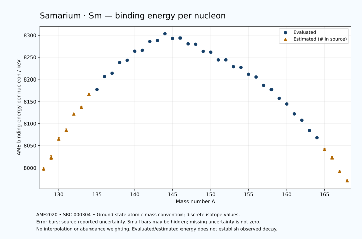

# Samarium — Atomic Masses and Reaction Energies

<!-- generated-by: sync-ame2020.mjs -->

**Dated evaluated data · scientific coverage remains partial.** 41 ground-state nuclides from AME2020. Values and uncertainties are transcribed from the retained unrounded analysis files; estimated quantities remain labelled.

- [Parent Samarium record](0062-Samarium-Sm.md) · [NUBASE states and decays](0062-Samarium-Sm-Nuclear-Evaluation.md)
- [Structured data](data/isotopes/0062-Samarium-Sm-AME2020-Evaluation.yaml)
- [Original mass table](../../data/catalog/sources/ame2020-mass_1.mas20.txt) · [Original reaction table 1](../../data/catalog/sources/ame2020-rct1.mas20.txt) · [Original reaction table 2](../../data/catalog/sources/ame2020-rct2.mas20.txt)
- [AME2020 methods](https://doi.org/10.1088/1674-1137/abddb0) (SRC-000303) · [Tables and definitions](https://doi.org/10.1088/1674-1137/abddaf) (SRC-000304)

## Reading the data

All table energies and uncertainties are in keV; binding energy is per nucleon. A # replaces a decimal point in the original estimated value. UNKNOWN (*) retains the source's not-calculable entry; it is neither zero nor automatically NOT APPLICABLE. Source lines are one-based in the retained files. Uncertainties remain those published by the evaluation, with no replacement by independent-mass quadrature.

Atomic-mass conventions apply. Qα is total decay energy, not alpha-particle kinetic energy. Positive Q alone does not establish a decay branch, rate or observation. He-4's source Qα of zero is a bookkeeping identity. These tables describe ground-state combinations, not isomer or excited-daughter transitions. Nuclear state and daughter lookups are explicit in the structured companion. The binding quantity follows [Z M(¹H) + N mₙ − M(A,Z)]c²/A; it has not been converted to a bare-nucleus convention.

## Mass and binding table

| Nuclide | N | Atomic mass excess / keV | AME binding per nucleon / keV | Mass-file line |
|---|---:|---|---|---:|
| Sm-128 | 66 | -39150# ± 500# | 7998# ± 4# | 1628 |
| Sm-129 | 67 | -42330# ± 500# | 8023# ± 4# | 1645 |
| Sm-130 | 68 | -47700# ± 400# | 8065# ± 3# | 1662 |
| Sm-131 | 69 | -50280# ± 400# | 8085# ± 3# | 1680 |
| Sm-132 | 70 | -55140# ± 300# | 8122# ± 2# | 1697 |
| Sm-133 | 71 | -57231# ± 298# | 8137# ± 2# | 1714 |
| Sm-134 | 72 | -61376# ± 196# | 8167# ± 1# | 1731 |
| Sm-135 | 73 | -62857.222 ± 154.628 | 8177.6270 ± 1.1454 | 1748 |
| Sm-136 | 74 | -66810.899 ± 12.497 | 8205.9165 ± 0.0919 | 1765 |
| Sm-137 | 75 | -67991.655 ± 28.614 | 8213.5527 ± 0.2089 | 1782 |
| Sm-138 | 76 | -71497.772 ± 11.817 | 8237.9286 ± 0.0856 | 1798 |
| Sm-139 | 77 | -72380.229 ± 10.884 | 8243.0786 ± 0.0783 | 1815 |
| Sm-140 | 78 | -75455.945 ± 12.497 | 8263.8211 ± 0.0893 | 1832 |
| Sm-141 | 79 | -75933.959 ± 8.535 | 8265.8460 ± 0.0605 | 1849 |
| Sm-142 | 80 | -78981.930 ± 1.866 | 8285.9407 ± 0.0131 | 1866 |
| Sm-143 | 81 | -79517.135 ± 2.750 | 8288.1825 ± 0.0192 | 1883 |
| Sm-144 | 82 | -81965.626 ± 1.459 | 8303.6800 ± 0.0101 | 1900 |
| Sm-145 | 83 | -80651.407 ± 1.485 | 8293.0139 ± 0.0102 | 1918 |
| Sm-146 | 84 | -80996.360 ± 3.045 | 8293.8581 ± 0.0209 | 1935 |
| Sm-147 | 85 | -79266.048 ± 1.262 | 8280.5734 ± 0.0086 | 1952 |
| Sm-148 | 86 | -79336.067 ± 1.246 | 8279.6326 ± 0.0084 | 1968 |
| Sm-149 | 87 | -77135.898 ± 1.157 | 8263.4683 ± 0.0078 | 1985 |
| Sm-150 | 88 | -77051.336 ± 1.112 | 8261.6235 ± 0.0074 | 2002 |
| Sm-151 | 89 | -74576.480 ± 1.110 | 8243.9735 ± 0.0074 | 2019 |
| Sm-152 | 90 | -74762.977 ± 1.016 | 8244.0645 ± 0.0067 | 2036 |
| Sm-153 | 91 | -72560.059 ± 1.025 | 8228.5373 ± 0.0067 | 2052 |
| Sm-154 | 92 | -72455.564 ± 1.305 | 8226.8379 ± 0.0085 | 2069 |
| Sm-155 | 93 | -70191.206 ± 1.332 | 8211.2258 ± 0.0086 | 2085 |
| Sm-156 | 94 | -69360.735 ± 8.522 | 8205.0054 ± 0.0546 | 2102 |
| Sm-157 | 95 | -66677.654 ± 4.434 | 8187.0642 ± 0.0282 | 2119 |
| Sm-158 | 96 | -65251.849 ± 4.782 | 8177.3075 ± 0.0303 | 2136 |
| Sm-159 | 97 | -62207.849 ± 5.934 | 8157.4963 ± 0.0373 | 2153 |
| Sm-160 | 98 | -60233.172 ± 1.956 | 8144.6159 ± 0.0122 | 2170 |
| Sm-161 | 99 | -56672.043 ± 6.817 | 8122.0418 ± 0.0423 | 2187 |
| Sm-162 | 100 | -54379.053 ± 3.523 | 8107.5745 ± 0.0218 | 2204 |
| Sm-163 | 101 | -50599.612 ± 7.359 | 8084.1653 ± 0.0451 | 2221 |
| Sm-164 | 102 | -47925.314 ± 4.099 | 8067.7803 ± 0.0250 | 2238 |
| Sm-165 | 103 | -43510# ± 400# | 8041# ± 2# | 2255 |
| Sm-166 | 104 | -40450# ± 400# | 8023# ± 2# | 2272 |
| Sm-167 | 105 | -35330# ± 500# | 7992# ± 3# | 2289 |
| Sm-168 | 106 | -31640# ± 300# | 7971# ± 2# | 2306 |

## Q-values and separation energies

| Nuclide | Qβ− / keV | Qα / keV | S₂n / keV | S₂p / keV | Reaction-file line |
|---|---|---|---|---|---:|
| Sm-128 | UNKNOWN (*) | 3255# ± 707# | UNKNOWN (*) | 348# ± 583# | 1627 |
| Sm-129 | UNKNOWN (*) | 3315# ± 640# | UNKNOWN (*) | 998# ± 583# | 1644 |
| Sm-130 | -14187# ± 671# | 3255# ± 500# | 24693# ± 640# | 1748# ± 447# | 1661 |
| Sm-131 | -10816# ± 565# | 3205# ± 500# | 24093# ± 640# | 2483# ± 448# | 1679 |
| Sm-132 | -12939# ± 500# | 2966# ± 361# | 23582# ± 500# | 3121# ± 301# | 1696 |
| Sm-133 | -9995# ± 422# | 2719# ± 360# | 23093# ± 499# | 4041# ± 299# | 1713 |
| Sm-134 | -11576# ± 358# | 2795# ± 198# | 22379# ± 358# | 4528# ± 197# | 1730 |
| Sm-135 | -8709# ± 249# | 2485.9024 ± 157.0574 | 21769# ± 336# | 5102.7841 ± 161.4900 | 1747 |
| Sm-136 | -10567# ± 196# | 2190.0002 ± 27.2412 | 21577# ± 196# | 5742.3986 ± 17.1999 | 1764 |
| Sm-137 | -7845.7518 ± 28.9474 | 1915.8089 ± 54.6625 | 21277.0694 ± 157.2533 | 6355.9778 ± 34.4187 | 1781 |
| Sm-138 | -9748.0968 ± 30.3408 | 1723.7543 ± 16.7124 | 20829.5095 ± 17.1999 | 6876.4172 ± 16.7124 | 1797 |
| Sm-139 | -6982.1777 ± 17.0705 | 1408.4747 ± 22.0075 | 20531.2099 ± 30.6145 | 7374.2022 ± 15.9979 | 1814 |
| Sm-140 | -8470.0000 ± 50.0000 | 1318.4361 ± 17.1999 | 20100.8091 ± 17.1999 | 8016.7057 ± 17.0531 | 1831 |
| Sm-141 | -6008.3127 ± 14.2829 | 1225.0937 ± 14.5022 | 19696.3665 ± 13.8316 | 8494.9719 ± 28.8140 | 1848 |
| Sm-142 | -7673.0000 ± 30.0000 | 610.3365 ± 11.7518 | 19668.6202 ± 12.6358 | 9302.6253 ± 3.7563 | 1865 |
| Sm-143 | -5275.8240 ± 11.3245 | 74.8790 ± 27.6576 | 19725.8115 ± 8.8494 | 9903.5572 ± 3.9761 | 1882 |
| Sm-144 | -6346.4515 ± 10.8092 | -133.2956 ± 3.5719 | 19126.3327 ± 1.1745 | 10593.5128 ± 0.7976 | 1899 |
| Sm-145 | -2659.8832 ± 2.7224 | 1115.1967 ± 3.2311 | 17276.9085 ± 2.3675 | 11227.0391 ± 0.8435 | 1917 |
| Sm-146 | -3878.7573 ± 5.8685 | 2528.7792 ± 2.8131 | 15173.3704 ± 2.8473 | 11826.2743 ± 2.8130 | 1934 |
| Sm-147 | -1721.4367 ± 2.2832 | 2311.3466 ± 0.4975 | 14757.2767 ± 0.9676 | 12411.9856 ± 0.5238 | 1951 |
| Sm-148 | -3038.5844 ± 9.9657 | 1987.0458 ± 0.4453 | 14482.3423 ± 2.8350 | 12988.0924 ± 0.4877 | 1967 |
| Sm-149 | -694.5812 ± 3.7881 | 1871.1905 ± 0.9714 | 14012.4863 ± 0.9054 | 13567.0458 ± 0.9762 | 1984 |
| Sm-150 | -2258.9662 ± 6.1803 | 1449.6648 ± 0.9664 | 13857.9052 ± 0.8801 | 14221.2120 ± 1.8676 | 2001 |
| Sm-151 | 76.6182 ± 0.5375 | 1145.3986 ± 0.9728 | 13583.2180 ± 0.3919 | 14778.8872 ± 1.8712 | 2018 |
| Sm-152 | -1874.4774 ± 0.6857 | 220.1726 ± 1.9325 | 13854.2778 ± 0.6120 | 15660.9682 ± 0.6425 | 2035 |
| Sm-153 | 807.4073 ± 0.7063 | -609.4402 ± 1.9385 | 14126.2154 ± 0.6203 | 16194.8179 ± 0.6634 | 2051 |
| Sm-154 | -717.1969 ± 1.1019 | -1200.5284 ± 1.0516 | 13835.2225 ± 0.8353 | 16883.8424 ± 24.4719 | 2068 |
| Sm-155 | 1627.1314 ± 1.2016 | -1672.9380 ± 1.0896 | 13773.7825 ± 0.8875 | 17438.7680 ± 3.0495 | 2084 |
| Sm-156 | 722.1090 ± 7.9025 | -1635.9877 ± 25.8782 | 13047.8077 ± 8.5005 | 18359.0751 ± 8.5834 | 2101 |
| Sm-157 | 2781.4807 ± 6.1191 | -1772.1898 ± 5.1690 | 12629.0841 ± 4.6287 | 18971.7996 ± 10.1498 | 2118 |
| Sm-158 | 2018.6123 ± 5.1146 | -2097.1626 ± 4.8904 | 12033.7500 ± 9.7716 | 19627.6613 ± 4.9565 | 2135 |
| Sm-159 | 3835.5363 ± 7.3211 | -2348.9691 ± 10.8896 | 11672.8319 ± 7.3774 | 20291.6749 ± 6.3065 | 2152 |
| Sm-160 | 3260.2763 ± 2.1547 | -2455.9585 ± 2.3510 | 11123.9596 ± 5.1665 | 20975.9913 ± 2.3510 | 2169 |
| Sm-161 | 5119.5577 ± 12.4147 | -2602.8428 ± 7.1440 | 10606.8302 ± 9.0114 | 21525.9785 ± 30.5774 | 2186 |
| Sm-162 | 4343.8905 ± 3.7605 | -2968.8460 ± 3.7570 | 10288.5171 ± 4.0300 | 22232.4806 ± 46.7078 | 2203 |
| Sm-163 | 5974.2073 ± 7.4141 | -3300.5203 ± 30.7027 | 10070.2042 ± 10.0312 | 22947# ± 400# | 2220 |
| Sm-164 | 5306.8315 ± 4.5907 | -3625.7154 ± 46.7547 | 9688.8972 ± 5.4049 | 23493# ± 400# | 2237 |
| Sm-165 | 7219# ± 400# | -3705# ± 565# | 9053# ± 400# | 24008# ± 640# | 2254 |
| Sm-166 | 6299# ± 412# | -3865# ± 565# | 8667# ± 400# | UNKNOWN (*) | 2271 |
| Sm-167 | 8440# ± 640# | -3675# ± 707# | 7962# ± 640# | UNKNOWN (*) | 2288 |
| Sm-168 | 7610# ± 500# | UNKNOWN (*) | 7333# ± 500# | UNKNOWN (*) | 2305 |

## Additional decay-energy combinations

| Nuclide | Q₂β− / keV | Q₄β− / keV | Qεp / keV | Qβ−n / keV | Part 1 / part 2 line |
|---|---|---|---|---|---|
| Sm-128 | UNKNOWN (*) | UNKNOWN (*) | 9471# ± 583# | UNKNOWN (*) | 1627 / 1650 |
| Sm-129 | UNKNOWN (*) | UNKNOWN (*) | 10911# ± 539# | UNKNOWN (*) | 1644 / 1668 |
| Sm-130 | UNKNOWN (*) | UNKNOWN (*) | 7386# ± 448# | UNKNOWN (*) | 1661 / 1685 |
| Sm-131 | UNKNOWN (*) | UNKNOWN (*) | 9027# ± 401# | -24839# ± 671# | 1679 / 1703 |
| Sm-132 | UNKNOWN (*) | UNKNOWN (*) | 5339# ± 301# | -23747# ± 500# | 1696 / 1720 |
| Sm-133 | -21171# ± 582# | UNKNOWN (*) | 6906# ± 299# | -23102# ± 499# | 1713 / 1738 |
| Sm-134 | -19846# ± 445# | UNKNOWN (*) | 3667# ± 201# | -22211# ± 357# | 1730 / 1755 |
| Sm-135 | -18608# ± 428# | UNKNOWN (*) | 5500.2495 ± 155.0789 | -21128# ± 337# | 1747 / 1772 |
| Sm-136 | -17721# ± 298# | UNKNOWN (*) | 2113.7496 ± 22.8483 | -20734# ± 196# | 1764 / 1789 |
| Sm-137 | -16778# ± 299# | UNKNOWN (*) | 3918.6710 ± 30.9586 | -19819# ± 198# | 1781 / 1807 |
| Sm-138 | -15838# ± 201# | -36567# ± 503# | 797.2256 ± 16.6469 | -19423.1869 ± 12.6024 | 1797 / 1823 |
| Sm-139 | -14749# ± 196# | -34680# ± 500# | 2347.9817 ± 15.9089 | -18701.8716 ± 29.9897 | 1814 / 1840 |
| Sm-140 | -13673.6675 ± 30.6120 | -32626# ± 401# | -727.9868 ± 30.2258 | -18129.2121 ± 18.1416 | 1831 / 1857 |
| Sm-141 | -12709.7287 ± 21.5245 | -30552# ± 298# | 1034.3158 ± 9.1366 | -17019.3321 ± 52.2401 | 1848 / 1875 |
| Sm-142 | -12022.4074 ± 28.0070 | -28862# ± 729# | -2079.3808 ± 3.4241 | -17127.6008 ± 12.7593 | 1865 / 1892 |
| Sm-143 | -11285.8240 ± 200.3204 | -27348.1858 ± 13.3276 | -856.0506 ± 2.4688 | -16279.5234 ± 30.1147 | 1882 / 1909 |
| Sm-144 | -10206.1149 ± 27.9829 | -25395.5350 ± 7.3194 | -5252.2868 ± 0.7947 | -15795.6333 ± 11.0821 | 1899 / 1926 |
| Sm-145 | -7724.7816 ± 19.7718 | -22408.7998 ± 6.6875 | -4192.3501 ± 0.8419 | -13103.5508 ± 10.8130 | 1917 / 1945 |
| Sm-146 | -4910.5371 ± 4.7745 | -18441.4328 ± 7.3540 | -6853.3270 ± 2.8218 | -11076.1543 ± 3.9248 | 1934 / 1962 |
| Sm-147 | -3909.1199 ± 1.4809 | -15070.0008 ± 8.9387 | -5629.1026 ± 0.5274 | -10219.7629 ± 5.9541 | 1951 / 1979 |
| Sm-148 | -3066.6474 ± 0.9006 | -11476.6699 ± 8.7936 | -8478.2432 ± 0.4925 | -9862.7734 ± 2.2939 | 1967 / 1995 |
| Sm-149 | -2008.7249 ± 3.2074 | -9441.9078 ± 9.1639 | -7016.8033 ± 1.8675 | -8909.7340 ± 9.9776 | 1984 / 2013 |
| Sm-150 | -1287.2847 ± 6.0095 | -7741.7175 ± 4.2562 | -9964.7719 ± 1.8690 | -8681.3369 ± 3.7787 | 2001 / 2030 |
| Sm-151 | -387.5596 ± 2.8170 | -5824.0918 ± 3.1447 | -8185.4998 ± 0.2237 | -7855.4285 ± 6.1801 | 2018 / 2047 |
| Sm-152 | -55.6737 ± 0.1754 | -4645.0141 ± 4.5451 | -11108.7649 ± 0.6496 | -8181.1972 ± 0.6849 | 2035 / 2064 |
| Sm-153 | 322.8848 ± 0.2547 | -3416.8626 ± 3.9089 | -9699.3669 ± 24.4580 | -7742.8773 ± 0.6987 | 2051 / 2081 |
| Sm-154 | 1250.7944 ± 0.8609 | -2061.5490 ± 7.4573 | -12414.1551 ± 3.0377 | -7159.4153 ± 1.0828 | 2068 / 2098 |
| Sm-155 | 1879.0926 ± 0.9195 | -1035.2662 ± 9.6465 | -11900.5744 ± 1.6804 | -6524.1569 ± 1.1341 | 2084 / 2114 |
| Sm-156 | 3174.5980 ± 8.4713 | 1168.6513 ± 8.4719 | -14365.9101 ± 12.5063 | -5613.7163 ± 8.4699 | 2101 / 2131 |
| Sm-157 | 4146.2421 ± 4.5395 | 2747.0156 ± 6.7982 | -13764.4948 ± 4.6215 | -4666.1275 ± 5.6677 | 2118 / 2149 |
| Sm-158 | 5438.1205 ± 4.8801 | 5155.3029 ± 5.3223 | -16046.7035 ± 5.2374 | -3864.0329 ± 6.3770 | 2135 / 2166 |
| Sm-159 | 6354.0080 ± 6.0135 | 6959.3709 ± 6.1053 | -15661.6972 ± 6.0753 | -3008.7061 ± 6.2715 | 2152 / 2183 |
| Sm-160 | 7708.8875 ± 2.2558 | 9439.2528 ± 2.0778 | -17798.1364 ± 29.8719 | -2261.1049 ± 4.7423 | 2169 / 2200 |
| Sm-161 | 8834.0984 ± 6.9804 | 11383.4507 ± 6.8525 | -17236.4996 ± 47.0710 | -1249.9128 ± 6.8767 | 2186 / 2218 |
| Sm-162 | 9901.6666 ± 5.3025 | 13802.1161 ± 3.5913 | -19438# ± 400# | -658.7703 ± 10.9802 | 2203 / 2235 |
| Sm-163 | 10788.9793 ± 7.4018 | 15781.2462 ± 7.3914 | -18879# ± 400# | 52.0143 ± 7.4752 | 2220 / 2252 |
| Sm-164 | 11768.3731 ± 4.2188 | 18042.3343 ± 4.1571 | -21135# ± 500# | 577.1863 ± 4.1970 | 2237 / 2269 |
| Sm-165 | 13016# ± 400# | 20102# ± 400# | UNKNOWN (*) | 1651# ± 400# | 2254 / 2287 |
| Sm-166 | 13921# ± 400# | 22134# ± 400# | UNKNOWN (*) | 2208# ± 400# | 2271 / 2304 |
| Sm-167 | 15446# ± 500# | 24582# ± 500# | UNKNOWN (*) | 3348# ± 510# | 2288 / 2321 |
| Sm-168 | 16510# ± 424# | 26918# ± 331# | UNKNOWN (*) | 4059# ± 500# | 2305 / 2338 |

## Single-nucleon separation and reaction energies

| Nuclide | Sₙ / keV | Sₚ / keV | Q(d,α) / keV | Q(p,α) / keV | Q(n,α) / keV | Part 2 line |
|---|---|---|---|---|---|---:|
| Sm-128 | UNKNOWN (*) | 1129# ± 640# | 11311# ± 707# | UNKNOWN (*) | 14566# ± 640# | 1650 |
| Sm-129 | 11251# ± 707# | 1399# ± 583# | 13691# ± 640# | 2284# ± 707# | 16697# ± 583# | 1668 |
| Sm-130 | 13441# ± 640# | 1809# ± 500# | 11231# ± 500# | 2474# ± 565# | 13857# ± 500# | 1685 |
| Sm-131 | 10652# ± 565# | 2100# ± 447# | 13611# ± 500# | 2804# ± 500# | 15897# ± 447# | 1703 |
| Sm-132 | 12931# ± 500# | 2659# ± 361# | 11041# ± 361# | 2904# ± 424# | 12882# ± 362# | 1720 |
| Sm-133 | 10163# ± 423# | 2892# ± 333# | 13250# ± 359# | 3103# ± 359# | 15012# ± 299# | 1738 |
| Sm-134 | 12216# ± 357# | 3257# ± 202# | 10962# ± 246# | 3258# ± 280# | 12038# ± 198# | 1755 |
| Sm-135 | 9552# ± 249# | 3382.2848 ± 160.2089 | 13261.2379 ± 162.6038 | 3634# ± 215# | 14214.9952 ± 156.5111 | 1772 |
| Sm-136 | 12024.9950 ± 155.1322 | 4037.5412 ± 83.8396 | 10663.8163 ± 43.7406 | 3460.8091 ± 51.8299 | 11167.8832 ± 48.2223 | 1789 |
| Sm-137 | 9252.0743 ± 31.2244 | 4110.7037 ± 74.7651 | 12781.4807 ± 87.7023 | 3636.3082 ± 50.7527 | 13301.1895 ± 30.9586 | 1807 |
| Sm-138 | 11577.4352 ± 30.9586 | 4713.8853 ± 17.5988 | 10382.9573 ± 70.0764 | 3428.6117 ± 83.7410 | 10362.2495 ± 22.4837 | 1823 |
| Sm-139 | 8953.7747 ± 16.0661 | 4754.8302 ± 15.9089 | 12403.4361 ± 16.9862 | 3653.7488 ± 69.9250 | 12465.4705 ± 16.0661 | 1840 |
| Sm-140 | 11147.0344 ± 16.5725 | 5243.8881 ± 18.4612 | 10169.2316 ± 17.0531 | 3480.9680 ± 18.0623 | 9774.4258 ± 17.1362 | 1857 |
| Sm-141 | 8549.3321 ± 15.1337 | 5010.8842 ± 25.6803 | 12277.8759 ± 16.0461 | 3844.4657 ± 14.4039 | 11729.6246 ± 14.4039 | 1875 |
| Sm-142 | 11119.2881 ± 8.6142 | 5747.9688 ± 14.0964 | 9940.9239 ± 24.2922 | 3383.1540 ± 13.7153 | 8681.4024 ± 27.5838 | 1892 |
| Sm-143 | 8606.5234 ± 2.6259 | 5664.5702 ± 23.7453 | 11716.6040 ± 14.2404 | 3558.9667 ± 24.3760 | 10386.5137 ± 4.2649 | 1909 |
| Sm-144 | 10519.8093 ± 2.3488 | 6293.9332 ± 2.7154 | 9886.7167 ± 23.6304 | 3421.3609 ± 14.0484 | 7872.2959 ± 3.2189 | 1926 |
| Sm-145 | 6757.0992 ± 0.2988 | 6524.2619 ± 2.6714 | 13020.0638 ± 2.7205 | 5354.1837 ± 23.6321 | 10945.0503 ± 0.8463 | 1945 |
| Sm-146 | 8416.2711 ± 2.8521 | 7017.8252 ± 3.7503 | 11130.5632 ± 3.8347 | 6828.3589 ± 3.8624 | 8652.3522 ± 2.8130 | 1962 |
| Sm-147 | 6341.0056 ± 2.8437 | 7100.6586 ± 4.1336 | 12712.2654 ± 2.5620 | 7014.1238 ± 2.6779 | 10128.3825 ± 0.4949 | 1979 |
| Sm-148 | 8141.3368 ± 0.2706 | 7583.0536 ± 0.3875 | 10829.1008 ± 4.1276 | 6795.4949 ± 2.5559 | 7742.3401 ± 0.4831 | 1995 |
| Sm-149 | 5871.1496 ± 0.8862 | 7558.9924 ± 5.5709 | 12616.8930 ± 0.9453 | 7182.5175 ± 4.2024 | 9436.4204 ± 0.9737 | 2013 |
| Sm-150 | 7986.7556 ± 0.3770 | 8275.9022 ± 1.9071 | 10525.3481 ± 5.5836 | 6854.7036 ± 0.9408 | 6741.8610 ± 0.9689 | 2030 |
| Sm-151 | 5596.4623 ± 0.1087 | 8268.1153 ± 20.0003 | 12198.7316 ± 1.9100 | 7153.4520 ± 5.5846 | 8477.9881 ± 1.8697 | 2047 |
| Sm-152 | 8257.8154 ± 0.6056 | 8665.6882 ± 4.5161 | 9545.1654 ± 20.0094 | 6165.4824 ± 1.9963 | 5258.9598 ± 1.9339 | 2064 |
| Sm-153 | 5868.4000 ± 0.1342 | 8594.5618 ± 25.8863 | 11537.0080 ± 4.5181 | 5901.3317 ± 20.0098 | 6766.2942 ± 0.6563 | 2081 |
| Sm-154 | 7966.8226 ± 0.8460 | 9096.5315 ± 9.0935 | 9509.7118 ± 25.8994 | 5794.7517 ± 4.5922 | 4134.0220 ± 1.0560 | 2098 |
| Sm-155 | 5806.9600 ± 0.2683 | 9213.5744 ± 25.0564 | 11167.6047 ± 9.0975 | 5927.3181 ± 25.9007 | 5604.8600 ± 24.4733 | 2114 |
| Sm-156 | 7240.8477 ± 8.5047 | 9709.7006 ± 9.7408 | 9616.6741 ± 26.4325 | 6151.3233 ± 12.4122 | 3616.0466 ± 8.9530 | 2131 |
| Sm-157 | 5388.2364 ± 9.6060 | 9799.7773 ± 4.5845 | 10973.1591 ± 6.4407 | 6453.0039 ± 25.4108 | 4548.3509 ± 4.5506 | 2149 |
| Sm-158 | 6645.5135 ± 6.4893 | 10243.7042 ± 8.4592 | 9625.8054 ± 4.9226 | 6552.2118 ± 6.6882 | 2678.3493 ± 10.3085 | 2166 |
| Sm-159 | 5027.3184 ± 7.5945 | 10390.6776 ± 5.9995 | 10800.0736 ± 9.1584 | 6823.0532 ± 6.0474 | 3640.6826 ± 6.0753 | 2183 |
| Sm-160 | 6096.6411 ± 6.2478 | 10967.7923 ± 10.2277 | 9583.7774 ± 2.1482 | 6927.9987 ± 7.2741 | 1907.3463 ± 2.8972 | 2200 |
| Sm-161 | 4510.1891 ± 7.0922 | 11066.3758 ± 7.1185 | 10593.1147 ± 12.1158 | 7298.1546 ± 6.8745 | 2809.4820 ± 6.9407 | 2218 |
| Sm-162 | 5778.3280 ± 7.6738 | 11581.4356 ± 9.6982 | 9226.3923 ± 4.0760 | 7039.3529 ± 10.6392 | 991.3559 ± 30.0153 | 2235 |
| Sm-163 | 4291.8762 ± 8.1588 | 11849# ± 300# | 10197.7844 ± 11.6530 | 7159.0823 ± 7.6388 | 1771.3055 ± 47.1525 | 2252 |
| Sm-164 | 5397.0210 ± 8.4232 | 12255# ± 400# | 8826# ± 300# | 7025.3296 ± 9.9216 | -49# ± 400# | 2269 |
| Sm-165 | 3656# ± 400# | 12439# ± 565# | 10160# ± 565# | 7394# ± 500# | 1146# ± 565# | 2287 |
| Sm-166 | 5011# ± 565# | 13069# ± 640# | 8621# ± 565# | 7374# ± 565# | -724# ± 640# | 2304 |
| Sm-167 | 2951# ± 640# | UNKNOWN (*) | 10051# ± 707# | 7894# ± 640# | UNKNOWN (*) | 2321 |
| Sm-168 | 4382# ± 583# | UNKNOWN (*) | UNKNOWN (*) | 7894# ± 583# | UNKNOWN (*) | 2338 |

Qβ− comes from the mass-file line in the first table. Qα, S₂n, S₂p, Q₂β−, Qεp and Qβ−n come from reaction part 1; Q₄β− and the last table come from part 2. Qεp is electron-capture/proton energy balance; Qβ−n is beta-minus/neutron energy balance. These are evaluated mass combinations, not observations of decay modes, cross sections or reaction rates. Light-nuclide zero entries can be bookkeeping identities, without a physical A=0 residual. Definitions and original source strings are retained in the structured data.

## Binding-energy chart

Discrete source values and source-reported uncertainties. No interpolation, natural-abundance weighting or observed-decay claim is implied. This quantitative chart supplements the 22 separate illustrative panels.

## Remaining review

Later measurements, state-specific decay branches, isomer Q-values, reaction rates, applicability and full claim-level review remain open. Existing authored values retain their own provenance; this companion does not overwrite them.
