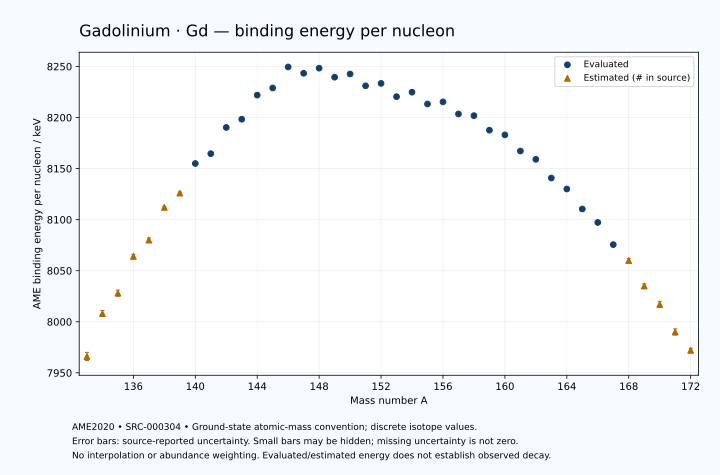

# Gadolinium — Atomic Masses and Reaction Energies

<!-- generated-by: sync-ame2020.mjs -->

**Dated evaluated data · scientific coverage remains partial.** 40 ground-state nuclides from AME2020. Values and uncertainties are transcribed from the retained unrounded analysis files; estimated quantities remain labelled.

- [Parent Gadolinium record](0064-Gadolinium-Gd.md) · [NUBASE states and decays](0064-Gadolinium-Gd-Nuclear-Evaluation.md)
- [Structured data](data/isotopes/0064-Gadolinium-Gd-AME2020-Evaluation.yaml)
- [Original mass table](../../data/catalog/sources/ame2020-mass_1.mas20.txt) · [Original reaction table](../../data/catalog/sources/ame2020-rct1.mas20.txt)
- [AME2020 methods](https://doi.org/10.1088/1674-1137/abddb0) (SRC-000303) · [Tables and definitions](https://doi.org/10.1088/1674-1137/abddaf) (SRC-000304)

## Reading the data

All table energies and uncertainties are in keV; binding energy is per nucleon. A # replaces a decimal point in the original estimated value. UNKNOWN (*) retains the source's not-calculable entry; it is neither zero nor automatically NOT APPLICABLE. Source lines are one-based in the retained files. Uncertainties remain those published by the evaluation, with no replacement by independent-mass quadrature.

Atomic-mass conventions apply. Qα is total decay energy, not alpha-particle kinetic energy. Positive Q alone does not establish a decay branch, rate or observation. He-4's source Qα of zero is a bookkeeping identity. These tables describe ground-state combinations, not isomer or excited-daughter transitions. Nuclear state and daughter lookups are explicit in the structured companion. The binding quantity follows [Z M(¹H) + N mₙ − M(A,Z)]c²/A; it has not been converted to a bare-nucleus convention.

## Mass and binding table

| Nuclide | N | Atomic mass excess / keV | AME binding per nucleon / keV | Mass-file line |
|---|---:|---|---|---:|
| Gd-133 | 69 | -36060# ± 500# | 7966# ± 4# | 1716 |
| Gd-134 | 70 | -41530# ± 400# | 8008# ± 3# | 1733 |
| Gd-135 | 71 | -44250# ± 400# | 8028# ± 3# | 1750 |
| Gd-136 | 72 | -49090# ± 298# | 8064# ± 2# | 1767 |
| Gd-137 | 73 | -51214# ± 298# | 8080# ± 2# | 1784 |
| Gd-138 | 74 | -55660# ± 200# | 8112# ± 1# | 1800 |
| Gd-139 | 75 | -57632# ± 196# | 8126# ± 1# | 1817 |
| Gd-140 | 76 | -61782.278 ± 27.945 | 8154.9757 ± 0.1996 | 1834 |
| Gd-141 | 77 | -63224.231 ± 19.760 | 8164.6090 ± 0.1401 | 1851 |
| Gd-142 | 78 | -66959.522 ± 27.945 | 8190.2569 ± 0.1968 | 1868 |
| Gd-143 | 79 | -68231.311 ± 200.301 | 8198.3188 ± 1.4007 | 1885 |
| Gd-144 | 80 | -71759.511 ± 27.945 | 8221.9382 ± 0.1941 | 1902 |
| Gd-145 | 81 | -72926.626 ± 19.716 | 8228.9485 ± 0.1360 | 1920 |
| Gd-146 | 82 | -76085.823 ± 4.076 | 8249.5072 ± 0.0279 | 1937 |
| Gd-147 | 83 | -75356.928 ± 1.887 | 8243.3366 ± 0.0128 | 1954 |
| Gd-148 | 84 | -76269.419 ± 1.460 | 8248.3398 ± 0.0099 | 1970 |
| Gd-149 | 85 | -75127.173 ± 3.310 | 8239.4856 ± 0.0222 | 1987 |
| Gd-150 | 86 | -75764.051 ± 6.055 | 8242.6103 ± 0.0404 | 2004 |
| Gd-151 | 87 | -74188.920 ± 2.993 | 8231.0446 ± 0.0198 | 2021 |
| Gd-152 | 88 | -74707.304 ± 1.007 | 8233.4042 ± 0.0066 | 2038 |
| Gd-153 | 89 | -72882.944 ± 1.002 | 8220.4209 ± 0.0066 | 2054 |
| Gd-154 | 90 | -73706.358 ± 0.994 | 8224.7996 ± 0.0065 | 2071 |
| Gd-155 | 91 | -72070.298 ± 0.983 | 8213.2541 ± 0.0063 | 2087 |
| Gd-156 | 92 | -72535.333 ± 0.983 | 8215.3253 ± 0.0063 | 2104 |
| Gd-157 | 93 | -70823.896 ± 0.977 | 8203.5072 ± 0.0062 | 2121 |
| Gd-158 | 94 | -70689.969 ± 0.976 | 8201.8229 ± 0.0062 | 2138 |
| Gd-159 | 95 | -68561.857 ± 0.980 | 8187.6177 ± 0.0062 | 2155 |
| Gd-160 | 96 | -67942.060 ± 1.123 | 8183.0171 ± 0.0070 | 2172 |
| Gd-161 | 97 | -65506.142 ± 1.504 | 8167.1934 ± 0.0093 | 2189 |
| Gd-162 | 98 | -64280.720 ± 3.963 | 8159.0373 ± 0.0245 | 2206 |
| Gd-163 | 99 | -61388.591 ± 0.797 | 8140.7560 ± 0.0049 | 2223 |
| Gd-164 | 100 | -59693.688 ± 1.000 | 8129.9978 ± 0.0061 | 2240 |
| Gd-165 | 101 | -56525.782 ± 1.304 | 8110.4428 ± 0.0079 | 2257 |
| Gd-166 | 102 | -54370.926 ± 1.584 | 8097.2260 ± 0.0095 | 2274 |
| Gd-167 | 103 | -50775.732 ± 5.213 | 8075.5428 ± 0.0312 | 2291 |
| Gd-168 | 104 | -48150# ± 300# | 8060# ± 2# | 2308 |
| Gd-169 | 105 | -43890# ± 400# | 8035# ± 2# | 2325 |
| Gd-170 | 106 | -40850# ± 500# | 8017# ± 3# | 2342 |
| Gd-171 | 107 | -36210# ± 500# | 7990# ± 3# | 2359 |
| Gd-172 | 108 | -32970# ± 300# | 7972# ± 2# | 2376 |

## Q-values and separation energies

| Nuclide | Qβ− / keV | Qα / keV | S₂n / keV | S₂p / keV | Reaction-file line |
|---|---|---|---|---|---:|
| Gd-133 | UNKNOWN (*) | 3845# ± 707# | UNKNOWN (*) | 358# ± 640# | 1715 |
| Gd-134 | UNKNOWN (*) | 3745# ± 565# | UNKNOWN (*) | 968# ± 500# | 1732 |
| Gd-135 | -11197# ± 565# | 3606# ± 565# | 24332# ± 640# | 1597# ± 499# | 1749 |
| Gd-136 | -13190# ± 582# | 3625# ± 423# | 23703# ± 499# | 2292# ± 357# | 1766 |
| Gd-137 | -10246# ± 499# | 3593# ± 422# | 23106# ± 499# | 2934# ± 336# | 1783 |
| Gd-138 | -12059# ± 361# | 3292# ± 280# | 22712# ± 359# | 3427# ± 201# | 1799 |
| Gd-139 | -9501# ± 357# | 2801# ± 249# | 22561# ± 357# | 4218# ± 198# | 1816 |
| Gd-140 | -11300.0000 ± 800.0000 | 2603.7053 ± 30.6120 | 22265# ± 202# | 4862.4476 ± 30.3408 | 1833 |
| Gd-141 | -8683.3880 ± 107.0975 | 2342.5087 ± 34.7741 | 21735# ± 197# | 5421.9438 ± 22.5593 | 1850 |
| Gd-142 | -10400.0000 ± 700.0000 | 2113.3344 ± 30.3408 | 21319.8803 ± 39.5199 | 6081.5188 ± 30.6120 | 1867 |
| Gd-143 | -7812.1185 ± 206.7497 | 1724.0023 ± 200.5970 | 21149.7162 ± 201.2738 | 6875.2935 ± 200.4832 | 1884 |
| Gd-144 | -9391.3235 ± 39.5199 | 1271.5183 ± 30.6120 | 20942.6252 ± 39.5199 | 7355.5238 ± 28.0070 | 1901 |
| Gd-145 | -6526.9329 ± 109.7144 | 582.4179 ± 21.4841 | 20837.9510 ± 201.2695 | 7987.4329 ± 19.9068 | 1919 |
| Gd-146 | -8322.1791 ± 44.7488 | 471.1904 ± 4.0056 | 20468.9481 ± 28.2406 | 8698.1392 ± 3.8404 | 1936 |
| Gd-147 | -4614.2543 ± 8.1414 | 1735.2911 ± 2.0002 | 18572.9383 ± 19.8061 | 9283.4628 ± 1.2672 | 1953 |
| Gd-148 | -5732.4723 ± 12.5208 | 3271.2911 ± 0.0308 | 16326.2320 ± 3.8403 | 9851.0009 ± 2.8475 | 1969 |
| Gd-149 | -3638.5336 ± 4.3388 | 3099.3183 ± 3.1316 | 15912.8813 ± 3.3621 | 10439.0674 ± 3.1810 | 1986 |
| Gd-150 | -4658.2621 ± 8.3784 | 2807.3935 ± 6.0162 | 15637.2680 ± 6.0357 | 11005.9266 ± 6.0086 | 2003 |
| Gd-151 | -2565.3796 ± 3.7615 | 2652.2117 ± 2.9135 | 15204.3833 ± 4.2266 | 11630.9643 ± 2.8395 | 2020 |
| Gd-152 | -3990.0000 ± 40.0000 | 2203.8471 ± 1.0238 | 15085.8888 ± 6.0227 | 12233.9101 ± 0.6301 | 2037 |
| Gd-153 | -1569.3340 ± 3.8444 | 1828.0382 ± 0.7345 | 14836.6598 ± 2.8555 | 12884.4062 ± 0.6332 | 2053 |
| Gd-154 | -3549.6514 ± 45.2983 | 920.0617 ± 0.6537 | 15141.6906 ± 0.2084 | 13521.3229 ± 0.2694 | 2070 |
| Gd-155 | -819.8588 ± 9.7884 | 81.2659 ± 0.6691 | 15329.9903 ± 0.2451 | 14088.1811 ± 0.3506 | 2086 |
| Gd-156 | -2444.3230 ± 3.6774 | -197.2718 ± 0.3303 | 14971.6113 ± 0.1933 | 14657.7117 ± 0.8819 | 2103 |
| Gd-157 | -60.0473 ± 0.2972 | -688.7523 ± 0.3854 | 14896.2336 ± 0.1626 | 15210.6322 ± 0.9334 | 2120 |
| Gd-158 | -1219.0862 ± 0.9799 | -659.3217 ± 0.8962 | 14297.2724 ± 0.1621 | 15907.1764 ± 8.4727 | 2137 |
| Gd-159 | 970.7242 ± 0.7495 | -795.5676 ± 0.9393 | 13880.5978 ± 0.1065 | 16462.1459 ± 4.5400 | 2154 |
| Gd-160 | -105.5863 ± 1.0207 | -1006.2406 ± 8.5036 | 13394.7265 ± 0.7298 | 17268.1530 ± 4.9114 | 2171 |
| Gd-161 | 1955.6357 ± 1.4402 | -1253.4041 ± 4.6810 | 13086.9206 ± 1.2408 | 17876.2346 ± 6.1207 | 2188 |
| Gd-162 | 1598.8278 ± 4.4611 | -1453.7869 ± 6.2098 | 12481.2962 ± 3.8000 | 18625.4897 ± 4.4191 | 2205 |
| Gd-163 | 3207.1628 ± 4.1374 | -1605.6573 ± 5.9869 | 12025.0851 ± 1.7020 | 19294.4895 ± 6.8635 | 2222 |
| Gd-164 | 2411.2959 ± 2.1143 | -1885.4310 ± 2.1968 | 11555.6037 ± 4.0868 | 19892.5763 ± 3.6625 | 2239 |
| Gd-165 | 4063.0674 ± 2.0189 | -2278.6545 ± 6.9407 | 11279.8274 ± 1.5282 | 20504.1127 ± 7.4735 | 2256 |
| Gd-166 | 3437.8515 ± 2.1558 | -2416.7885 ± 3.8629 | 10819.8746 ± 1.8727 | 21023.5537 ± 4.3938 | 2273 |
| Gd-167 | 5107.3505 ± 5.5584 | -2601.0362 ± 9.0180 | 10392.5859 ± 5.3734 | 21844# ± 400# | 2290 |
| Gd-168 | 4631# ± 300# | -2649# ± 300# | 9922# ± 300# | 22278# ± 500# | 2307 |
| Gd-169 | 6590# ± 500# | -2805# ± 565# | 9257# ± 400# | 23138# ± 640# | 2324 |
| Gd-170 | 5860# ± 583# | -2825# ± 640# | 8843# ± 583# | 23788# ± 583# | 2341 |
| Gd-171 | 7560# ± 640# | -3305# ± 707# | 8462# ± 640# | UNKNOWN (*) | 2358 |
| Gd-172 | 6720# ± 583# | -3755# ± 424# | 8263# ± 583# | UNKNOWN (*) | 2375 |

Qβ− comes from the mass-file line in the first table. The other three columns come from the reaction-file line. Definitions and original source strings are retained in the structured data.

## Binding-energy chart

Discrete source values and source-reported uncertainties. No interpolation, natural-abundance weighting or observed-decay claim is implied. This quantitative chart supplements the 22 separate illustrative panels.

## Remaining review

Later measurements, state-specific decay branches, isomer Q-values, additional reaction channels and full claim-level review remain open. Existing authored values retain their own provenance; this companion does not overwrite them.
