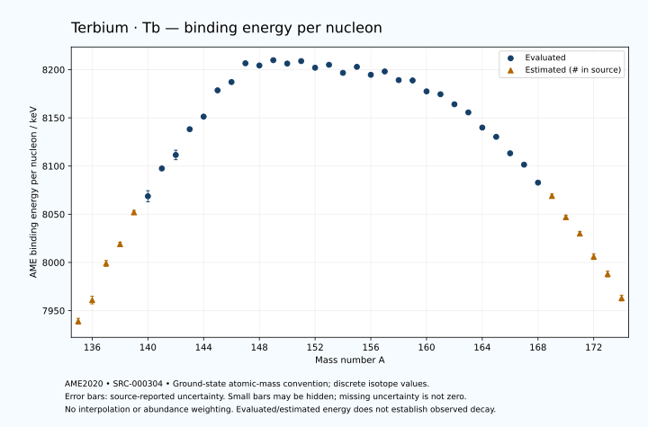

# Terbium — Atomic Masses and Reaction Energies

<!-- generated-by: sync-ame2020.mjs -->

**Dated evaluated data · scientific coverage remains partial.** 40 ground-state nuclides from AME2020. Values and uncertainties are transcribed from the retained unrounded analysis files; estimated quantities remain labelled.

- [Parent Terbium record](0065-Terbium-Tb.md) · [NUBASE states and decays](0065-Terbium-Tb-Nuclear-Evaluation.md)
- [Structured data](data/isotopes/0065-Terbium-Tb-AME2020-Evaluation.yaml)
- [Original mass table](../../data/catalog/sources/ame2020-mass_1.mas20.txt) · [Original reaction table 1](../../data/catalog/sources/ame2020-rct1.mas20.txt) · [Original reaction table 2](../../data/catalog/sources/ame2020-rct2.mas20.txt)
- [AME2020 methods](https://doi.org/10.1088/1674-1137/abddb0) (SRC-000303) · [Tables and definitions](https://doi.org/10.1088/1674-1137/abddaf) (SRC-000304)

## Reading the data

All table energies and uncertainties are in keV; binding energy is per nucleon. A # replaces a decimal point in the original estimated value. UNKNOWN (*) retains the source's not-calculable entry; it is neither zero nor automatically NOT APPLICABLE. Source lines are one-based in the retained files. Uncertainties remain those published by the evaluation, with no replacement by independent-mass quadrature.

Atomic-mass conventions apply. Qα is total decay energy, not alpha-particle kinetic energy. Positive Q alone does not establish a decay branch, rate or observation. He-4's source Qα of zero is a bookkeeping identity. These tables describe ground-state combinations, not isomer or excited-daughter transitions. Nuclear state and daughter lookups are explicit in the structured companion. The binding quantity follows [Z M(¹H) + N mₙ − M(A,Z)]c²/A; it has not been converted to a bare-nucleus convention.

## Mass and binding table

| Nuclide | N | Atomic mass excess / keV | AME binding per nucleon / keV | Mass-file line |
|---|---:|---|---|---:|
| Tb-135 | 70 | -33053# ± 400# | 7939# ± 3# | 1751 |
| Tb-136 | 71 | -35900# ± 500# | 7961# ± 4# | 1768 |
| Tb-137 | 72 | -40967# ± 401# | 7999# ± 3# | 1785 |
| Tb-138 | 73 | -43600# ± 300# | 8019# ± 2# | 1801 |
| Tb-139 | 74 | -48130# ± 298# | 8052# ± 2# | 1818 |
| Tb-140 | 75 | -50482.278 ± 800.488 | 8068.6732 ± 5.7178 | 1835 |
| Tb-141 | 76 | -54540.843 ± 105.259 | 8097.4761 ± 0.7465 | 1852 |
| Tb-142 | 77 | -56559.522 ± 700.558 | 8111.5080 ± 4.9335 | 1869 |
| Tb-143 | 78 | -60419.192 ± 51.232 | 8138.2176 ± 0.3583 | 1886 |
| Tb-144 | 79 | -62368.188 ± 27.945 | 8151.2877 ± 0.1941 | 1903 |
| Tb-145 | 80 | -66399.693 ± 110.896 | 8178.5397 ± 0.7648 | 1921 |
| Tb-146 | 81 | -67763.644 ± 44.860 | 8187.1474 ± 0.3073 | 1938 |
| Tb-147 | 82 | -70742.674 ± 8.096 | 8206.6250 ± 0.0551 | 1955 |
| Tb-148 | 83 | -70536.947 ± 12.463 | 8204.3207 ± 0.0842 | 1971 |
| Tb-149 | 84 | -71488.639 ± 3.629 | 8209.8153 ± 0.0244 | 1988 |
| Tb-150 | 85 | -71105.789 ± 7.371 | 8206.3396 ± 0.0491 | 2005 |
| Tb-151 | 86 | -71623.541 ± 4.094 | 8208.8743 ± 0.0271 | 2022 |
| Tb-152 | 87 | -70717.304 ± 40.013 | 8202.0072 ± 0.2632 | 2039 |
| Tb-153 | 88 | -71313.610 ± 3.947 | 8205.0504 ± 0.0258 | 2055 |
| Tb-154 | 89 | -70156.707 ± 45.309 | 8196.6697 ± 0.2942 | 2072 |
| Tb-155 | 90 | -71250.439 ± 9.830 | 8202.9173 ± 0.0634 | 2088 |
| Tb-156 | 91 | -70091.010 ± 3.768 | 8194.6415 ± 0.0242 | 2105 |
| Tb-157 | 92 | -70763.848 ± 1.018 | 8198.1416 ± 0.0065 | 2122 |
| Tb-158 | 93 | -69470.883 ± 1.268 | 8189.1556 ± 0.0080 | 2139 |
| Tb-159 | 94 | -69532.582 ± 1.103 | 8188.8025 ± 0.0069 | 2156 |
| Tb-160 | 95 | -67836.474 ± 1.110 | 8177.4676 ± 0.0069 | 2173 |
| Tb-161 | 96 | -67461.778 ± 1.218 | 8174.4809 ± 0.0076 | 2190 |
| Tb-162 | 97 | -65879.548 ± 2.049 | 8164.0773 ± 0.0127 | 2207 |
| Tb-163 | 98 | -64595.754 ± 4.060 | 8155.6322 ± 0.0249 | 2224 |
| Tb-164 | 99 | -62104.983 ± 1.863 | 8139.9304 ± 0.0114 | 2241 |
| Tb-165 | 100 | -60588.849 ± 1.541 | 8130.3259 ± 0.0093 | 2258 |
| Tb-166 | 101 | -57808.778 ± 1.463 | 8113.2230 ± 0.0088 | 2275 |
| Tb-167 | 102 | -55883.082 ± 1.929 | 8101.4410 ± 0.0116 | 2292 |
| Tb-168 | 103 | -52781.181 ± 4.192 | 8082.7980 ± 0.0250 | 2309 |
| Tb-169 | 104 | -50480# ± 300# | 8069# ± 2# | 2326 |
| Tb-170 | 105 | -46710# ± 300# | 8047# ± 2# | 2343 |
| Tb-171 | 106 | -43770# ± 400# | 8030# ± 2# | 2360 |
| Tb-172 | 107 | -39690# ± 500# | 8006# ± 3# | 2377 |
| Tb-173 | 108 | -36510# ± 500# | 7988# ± 3# | 2393 |
| Tb-174 | 109 | -31970# ± 500# | 7963# ± 3# | 2409 |

## Q-values and separation energies

| Nuclide | Qβ− / keV | Qα / keV | S₂n / keV | S₂p / keV | Reaction-file line |
|---|---|---|---|---|---:|
| Tb-135 | UNKNOWN (*) | 3986# ± 565# | UNKNOWN (*) | 395# ± 499# | 1750 |
| Tb-136 | UNKNOWN (*) | 3876# ± 640# | UNKNOWN (*) | 677# ± 583# | 1767 |
| Tb-137 | UNKNOWN (*) | 3844# ± 499# | 24057# ± 566# | 1397# ± 446# | 1784 |
| Tb-138 | -8669# ± 586# | 3775# ± 424# | 23843# ± 583# | 1935# ± 358# | 1800 |
| Tb-139 | -10430# ± 582# | 3593# ± 357# | 23306# ± 499# | 2562# ± 298# | 1817 |
| Tb-140 | -7652# ± 895# | 3336# ± 824# | 23024# ± 855# | 3310.5444 ± 800.9755 | 1834 |
| Tb-141 | -9158# ± 316# | 3180.1450 ± 105.3498 | 22553# ± 316# | 3720.7334 ± 106.0771 | 1851 |
| Tb-142 | -6440# ± 200# | 2765.2376 ± 701.1147 | 22219.8803 ± 1063.7489 | 4151.5188 ± 702.4508 | 1868 |
| Tb-143 | -8250.2433 ± 52.8659 | 2553.9432 ± 52.8930 | 22020.9858 ± 117.0648 | 5071.4877 ± 52.7681 | 1885 |
| Tb-144 | -5798.0965 ± 28.8506 | 2192.8419 ± 58.6268 | 21951.3017 ± 701.1147 | 5637.2003 ± 41.0414 | 1902 |
| Tb-145 | -8157.0853 ± 111.0872 | 1101.0382 ± 111.6135 | 22123.1365 ± 122.1580 | 6736.3240 ± 111.4385 | 1920 |
| Tb-146 | -5208.7165 ± 45.1580 | 1120.3696 ± 53.9693 | 21538.0926 ± 52.8522 | 6722.4117 ± 46.1256 | 1937 |
| Tb-147 | -6546.6266 ± 11.9939 | 1073.7214 ± 13.6466 | 20485.6169 ± 111.1908 | 7329.0916 ± 8.5420 | 1954 |
| Tb-148 | -2677.5501 ± 9.5961 | 2657.3119 ± 16.4752 | 18915.9388 ± 46.5538 | 7997.2859 ± 13.8197 | 1970 |
| Tb-149 | -3794.6493 ± 9.1335 | 4077.9687 ± 2.1651 | 16888.6021 ± 8.7632 | 8521.9705 ± 4.0899 | 1987 |
| Tb-150 | -1796.1707 ± 8.3886 | 3586.8983 ± 4.9256 | 16711.4781 ± 14.4640 | 9386.2488 ± 12.3353 | 2004 |
| Tb-151 | -2871.1525 ± 4.9455 | 3496.1546 ± 3.9256 | 16277.5372 ± 5.2416 | 9760.1660 ± 5.4515 | 2021 |
| Tb-152 | -599.3405 ± 40.2575 | 3155.2627 ± 41.2251 | 15754.1509 ± 40.6710 | 10502.8763 ± 40.4766 | 2038 |
| Tb-153 | -2170.4134 ± 1.9335 | 2702.7909 ± 5.0231 | 15832.7055 ± 5.5084 | 11238.4540 ± 3.8771 | 2054 |
| Tb-154 | 237.3080 ± 45.9008 | 2210.7470 ± 45.7200 | 15582.0392 ± 60.4316 | 11846.1488 ± 45.3040 | 2071 |
| Tb-155 | -2094.5000 ± 1.8974 | 977.7429 ± 9.8155 | 16079.4654 ± 10.5177 | 12460.9150 ± 9.8161 | 2087 |
| Tb-156 | 438.3762 ± 3.6789 | 372.5738 ± 3.7472 | 16076.9397 ± 45.4476 | 12930.5856 ± 3.7539 | 2104 |
| Tb-157 | -1339.1791 ± 5.1297 | 178.7023 ± 0.8164 | 15656.0451 ± 9.7936 | 13523.4535 ± 0.9297 | 2121 |
| Tb-158 | 936.2686 ± 2.4750 | -157.4324 ± 1.2454 | 15522.5092 ± 3.6596 | 13965.9813 ± 3.5461 | 2138 |
| Tb-159 | -365.3613 ± 1.1573 | -139.1605 ± 1.1453 | 14911.3694 ± 0.7891 | 14651.3895 ± 4.2520 | 2155 |
| Tb-160 | 1835.9516 ± 1.1011 | -178.5453 ± 3.4924 | 14508.2264 ± 0.6521 | 15143.9544 ± 2.3158 | 2172 |
| Tb-161 | 593.7166 ± 1.2010 | -427.5592 ± 4.2988 | 14071.8321 ± 0.5607 | 15996.3340 ± 4.4247 | 2189 |
| Tb-162 | 2301.6217 ± 2.1640 | -1034.0023 ± 2.8862 | 14185.7103 ± 2.3307 | 16964.0412 ± 2.2396 | 2206 |
| Tb-163 | 1785.1041 ± 4.0006 | -977.2839 ± 5.9133 | 13276.6122 ± 4.1770 | 17382.0946 ± 11.1639 | 2223 |
| Tb-164 | 3862.6653 ± 1.9884 | -1036.4506 ± 2.0705 | 12368.0718 ± 2.7695 | 17959.9817 ± 2.2798 | 2240 |
| Tb-165 | 3023.4392 ± 1.6915 | -1222.1641 ± 10.5131 | 12135.7319 ± 4.3426 | 18592.9727 ± 1.7865 | 2257 |
| Tb-166 | 4775.6930 ± 1.6690 | -1510.7496 ± 1.9663 | 11846.4303 ± 2.3686 | 19154.5737 ± 2.5329 | 2274 |
| Tb-167 | 4028.3686 ± 4.4459 | -1734.1794 ± 2.1305 | 11436.8690 ± 2.4693 | 19731.9212 ± 5.5583 | 2291 |
| Tb-168 | 5777.2167 ± 140.0696 | -1973.9511 ± 4.6740 | 11115.0397 ± 4.4396 | 20610# ± 100# | 2308 |
| Tb-169 | 5116# ± 425# | -2176# ± 300# | 10740# ± 300# | 21288# ± 500# | 2325 |
| Tb-170 | 7000# ± 361# | -2386# ± 316# | 10071# ± 300# | 22037# ± 500# | 2342 |
| Tb-171 | 6240# ± 447# | -2425# ± 565# | 9432# ± 500# | 22688# ± 640# | 2359 |
| Tb-172 | 8070# ± 583# | -2865# ± 640# | 9123# ± 583# | 23408# ± 707# | 2376 |
| Tb-173 | 7230# ± 640# | -3274# ± 707# | 8883# ± 640# | UNKNOWN (*) | 2392 |
| Tb-174 | 9160# ± 707# | -3534# ± 707# | 8422# ± 707# | UNKNOWN (*) | 2408 |

## Additional decay-energy combinations

| Nuclide | Q₂β− / keV | Q₄β− / keV | Qεp / keV | Qβ−n / keV | Part 1 / part 2 line |
|---|---|---|---|---|---|
| Tb-135 | UNKNOWN (*) | UNKNOWN (*) | 9459# ± 500# | UNKNOWN (*) | 1750 / 1775 |
| Tb-136 | UNKNOWN (*) | UNKNOWN (*) | 10959# ± 537# | UNKNOWN (*) | 1767 / 1792 |
| Tb-137 | UNKNOWN (*) | UNKNOWN (*) | 7988# ± 446# | UNKNOWN (*) | 1784 / 1810 |
| Tb-138 | UNKNOWN (*) | UNKNOWN (*) | 9256# ± 300# | UNKNOWN (*) | 1800 / 1826 |
| Tb-139 | UNKNOWN (*) | UNKNOWN (*) | 6330# ± 299# | -21271# ± 585# | 1817 / 1843 |
| Tb-140 | -21165# ± 944# | UNKNOWN (*) | 7626.8025 ± 800.5959 | -20853# ± 944# | 1834 / 1860 |
| Tb-141 | -20176# ± 414# | UNKNOWN (*) | 5156.1316 ± 117.1990 | -19782# ± 414# | 1851 / 1878 |
| Tb-142 | -19309# ± 807# | UNKNOWN (*) | 6077.1537 ± 700.6716 | -19248# ± 761# | 1868 / 1895 |
| Tb-143 | -18372# ± 302# | UNKNOWN (*) | 3600.7661 ± 59.3988 | -18371# ± 730# | 1885 / 1912 |
| Tb-144 | -17758.6671 ± 29.2022 | -40209# ± 401# | 4584.1521 ± 30.0266 | -18270.5566 ± 30.8379 | 1902 / 1929 |
| Tb-145 | -17279.5797 ± 111.1457 | -38817# ± 225# | 1930.5107 ± 111.4191 | -17900.9197 ± 111.1274 | 1920 / 1948 |
| Tb-146 | -16525.4172 ± 45.3413 | -36708# ± 205# | 2938.9089 ± 44.9297 | -17592.3547 ± 45.3317 | 1937 / 1965 |
| Tb-147 | -14985.5726 ± 9.5159 | -34768.2666 ± 10.5978 | -914.0416 ± 10.0162 | -16259.0641 ± 10.5042 | 1954 / 1982 |
| Tb-148 | -12545.7805 ± 84.7558 | -31771.9129 ± 16.1346 | -281.3067 ± 12.7053 | -14412.2179 ± 15.2854 | 1970 / 1998 |
| Tb-149 | -9842.7859 ± 12.3039 | -27548# ± 200# | -2480.1285 ± 10.5046 | -11700.5609 ± 9.3745 | 1987 / 2016 |
| Tb-150 | -9159.8971 ± 15.9480 | -24615# ± 196# | -1953.4431 ± 8.2308 | -11483.1167 ± 11.6749 | 2004 / 2033 |
| Tb-151 | -8000.7946 ± 9.1834 | -20851.9273 ± 19.7903 | -4120.1422 ± 7.3153 | -10385.2406 ± 5.7509 | 2021 / 2050 |
| Tb-152 | -7112.6679 ± 41.9254 | -18997.0250 ± 67.2302 | -3353.1765 ± 40.0061 | -10036.2336 ± 40.1263 | 2038 / 2067 |
| Tb-153 | -6301.5363 ± 6.1480 | -17341.0004 ± 12.5728 | -5714.0812 ± 3.8775 | -9266.9649 ± 5.8557 | 2054 / 2084 |
| Tb-154 | -5517.3283 ± 46.0354 | -15729.5644 ± 47.5423 | -4078.2112 ± 45.3042 | -9084.8281 ± 45.4665 | 2071 / 2101 |
| Tb-155 | -5210.6405 ± 16.6968 | -14624.5182 ± 13.9452 | -6801.0436 ± 9.8181 | -8927.7427 ± 12.2765 | 2087 / 2117 |
| Tb-156 | -4552.6074 ± 38.5868 | -13256.5933 ± 14.7609 | -5561.6444 ± 3.7748 | -9006.3890 ± 10.2815 | 2104 / 2134 |
| Tb-157 | -3930.9859 ± 23.4850 | -12054.5695 ± 27.9634 | -7969.9752 ± 3.4240 | -8305.7799 ± 0.3464 | 2121 / 2152 |
| Tb-158 | -3283.4869 ± 27.1180 | -10767.6832 ± 25.2513 | -7300.7201 ± 4.2986 | -8117.5322 ± 5.1874 | 2138 / 2169 |
| Tb-159 | -2202.9613 ± 2.9222 | -8962.1775 ± 27.9666 | -9551.0913 ± 2.3124 | -7196.7477 ± 2.4188 | 2155 / 2186 |
| Tb-160 | -1454.0484 ± 15.0404 | -7535.4367 ± 32.7047 | -9082.0590 ± 4.4054 | -6740.5714 ± 1.1646 | 2172 / 2203 |
| Tb-161 | -265.4837 ± 2.3948 | -5563.0629 ± 27.9714 | -11257.2999 ± 1.5169 | -5860.6704 ± 1.2022 | 2189 / 2221 |
| Tb-162 | 161.0149 ± 3.7178 | -4402.0656 ± 26.1389 | -11376.9177 ± 10.5995 | -5895.3718 ± 2.1646 | 2206 / 2238 |
| Tb-163 | 1782.2732 ± 4.0007 | -1867.3409 ± 6.7778 | -13161.7808 ± 4.2673 | -4485.9022 ± 4.0009 | 2223 / 2255 |
| Tb-164 | 2875.5338 ± 2.3246 | -196.0405 ± 25.0756 | -12820.1357 ± 2.0706 | -3795.4438 ± 1.9878 | 2240 / 2272 |
| Tb-165 | 4309.1679 ± 1.7301 | 2341.1749 ± 2.2635 | -14645.6745 ± 2.5790 | -2692.5188 ± 1.6906 | 2257 / 2290 |
| Tb-166 | 5261.5614 ± 1.6607 | 4077.7004 ± 11.6441 | -14368.6454 ± 5.4140 | -2267.8070 ± 1.6204 | 2274 / 2307 |
| Tb-167 | 6396.3762 ± 5.5359 | 6660.0342 ± 2.3032 | -16423# ± 100# | -1369.9299 ± 2.0901 | 2291 / 2324 |
| Tb-168 | 7278.0500 ± 30.2926 | 8531.1974 ± 4.5148 | -16300# ± 400# | -941.0483 ± 5.7978 | 2308 / 2341 |
| Tb-169 | 8316# ± 301# | 10794# ± 300# | -18519# ± 500# | 7# ± 331# | 2325 / 2359 |
| Tb-170 | 9528# ± 304# | 13086# ± 300# | -18338# ± 583# | 815# ± 425# | 2342 / 2376 |
| Tb-171 | 10748# ± 721# | 15440# ± 400# | -20199# ± 640# | 1869# ± 447# | 2359 / 2393 |
| Tb-172 | 11794# ± 537# | 17684# ± 500# | UNKNOWN (*) | 2249# ± 539# | 2376 / 2410 |
| Tb-173 | 12841# ± 582# | 19746# ± 500# | UNKNOWN (*) | 3178# ± 583# | 2392 / 2427 |
| Tb-174 | 13900# ± 583# | 21895# ± 502# | UNKNOWN (*) | 3699# ± 640# | 2408 / 2443 |

## Single-nucleon separation and reaction energies

| Nuclide | Sₙ / keV | Sₚ / keV | Q(d,α) / keV | Q(p,α) / keV | Q(n,α) / keV | Part 2 line |
|---|---|---|---|---|---|---:|
| Tb-135 | UNKNOWN (*) | -1187.9999 ± 7.0000 | 13718# ± 640# | UNKNOWN (*) | 14794# ± 565# | 1775 |
| Tb-136 | 10918# ± 640# | -1061# ± 640# | 16341# ± 640# | 5024# ± 707# | 16983# ± 582# | 1792 |
| Tb-137 | 13139# ± 641# | -834# ± 499# | 13993# ± 566# | 5427# ± 566# | 14480# ± 500# | 1810 |
| Tb-138 | 10705# ± 500# | -324# ± 423# | 16200# ± 423# | 5513# ± 500# | 16194# ± 358# | 1826 |
| Tb-139 | 12601# ± 423# | -240# ± 359# | 13794# ± 422# | 5823# ± 422# | 13760# ± 357# | 1843 |
| Tb-140 | 10423# ± 854# | 140# ± 824# | 15888# ± 825# | 5595# ± 854# | 15310.0279 ± 800.4999 | 1860 |
| Tb-141 | 12129.8829 ± 807.3787 | 47.5359 ± 108.9052 | 13802# ± 222# | 5983# ± 226# | 12855.2351 ± 108.9052 | 1878 |
| Tb-142 | 10089.9974 ± 708.4210 | 624.2624 ± 700.8362 | 15933.5628 ± 701.1147 | 5936# ± 727# | 14484.9315 ± 700.6810 | 1895 |
| Tb-143 | 11930.9883 ± 702.4284 | 748.6413 ± 58.3579 | 13515.8454 ± 54.9108 | 6227.1407 ± 58.3579 | 12213.1552 ± 72.6699 | 1912 |
| Tb-144 | 10020.3134 ± 58.3579 | 1425.8479 ± 202.2414 | 15302.1415 ± 39.5199 | 5720.0983 ± 34.2253 | 13203.8614 ± 30.6700 | 1929 |
| Tb-145 | 12102.8232 ± 114.3624 | 1929.1526 ± 114.3624 | 12542.4251 ± 228.9509 | 5423.8845 ± 114.3624 | 10555.6390 ± 114.8970 | 1948 |
| Tb-146 | 9435.2694 ± 119.6256 | 2125.9895 ± 49.0017 | 14706.6741 ± 52.8522 | 5331.7220 ± 205.2636 | 12124.0690 ± 46.1858 | 1965 |
| Tb-147 | 11050.3476 ± 45.5170 | 1945.8214 ± 8.6271 | 12894.7591 ± 21.3135 | 5880.8928 ± 29.0940 | 10522.9032 ± 13.4588 | 1982 |
| Tb-148 | 7865.5913 ± 14.8512 | 2468.9900 ± 12.5784 | 16259.6834 ± 13.0881 | 7253.7341 ± 23.3250 | 13100.9795 ± 12.7868 | 1998 |
| Tb-149 | 9023.0108 ± 12.9225 | 2508.1915 ± 3.3450 | 14579.0954 ± 3.5639 | 9461.2389 ± 5.0917 | 11275.3657 ± 6.8205 | 2016 |
| Tb-150 | 7688.4674 ± 8.0487 | 3267.5868 ± 7.9377 | 15874.4373 ± 7.3254 | 9115.1943 ± 7.4253 | 12085.2245 ± 7.6554 | 2033 |
| Tb-151 | 8589.0699 ± 8.3146 | 3148.4607 ± 7.1691 | 14214.4395 ± 5.0420 | 9509.9337 ± 4.0486 | 10320.3437 ± 10.7053 | 2050 |
| Tb-152 | 7165.0810 ± 40.2006 | 3817.3544 ± 40.1017 | 15757.5544 ± 40.4509 | 9273.9247 ± 40.1291 | 11370.4154 ± 40.1804 | 2067 |
| Tb-153 | 8667.6245 ± 40.1844 | 3895.2775 ± 3.8453 | 13586.1173 ± 4.7541 | 9314.4961 ± 7.1051 | 9125.1617 ± 7.2538 | 2084 |
| Tb-154 | 6914.4147 ± 45.4614 | 4562.7337 ± 45.2986 | 15261.4040 ± 45.2988 | 8896.2688 ± 45.3884 | 10142.7937 ± 45.3040 | 2101 |
| Tb-155 | 9165.0508 ± 46.3442 | 4833.0523 ± 9.7900 | 12343.3117 ± 9.7913 | 8320.9195 ± 9.7921 | 7284.4628 ± 9.8156 | 2117 |
| Tb-156 | 6911.8890 ± 10.4551 | 5309.6832 ± 3.6767 | 14326.1548 ± 3.6809 | 7655.9889 ± 3.6844 | 8922.8584 ± 3.7486 | 2134 |
| Tb-157 | 8744.1561 ± 3.6890 | 5517.4862 ± 0.3309 | 12017.2569 ± 0.3372 | 7806.5650 ± 0.3828 | 6620.9206 ± 0.8407 | 2152 |
| Tb-158 | 6778.3531 ± 1.0099 | 5935.9587 ± 0.9778 | 13775.2569 ± 0.9890 | 7463.4700 ± 0.9905 | 7993.8558 ± 1.3070 | 2169 |
| Tb-159 | 8133.0163 ± 0.6383 | 6131.5832 ± 0.7471 | 12002.1211 ± 0.7476 | 7866.8068 ± 0.7622 | 6196.6648 ± 3.4898 | 2186 |
| Tb-160 | 6375.2101 ± 0.1336 | 6563.5873 ± 0.7618 | 13564.3029 ± 0.7594 | 7851.4772 ± 0.7599 | 7269.0628 ± 4.2546 | 2203 |
| Tb-161 | 7696.6220 ± 0.5498 | 6808.6887 ± 1.0364 | 11810.8868 ± 0.9438 | 8092.2471 ± 0.9419 | 5455.0860 ± 2.3696 | 2221 |
| Tb-162 | 6489.0883 ± 2.3841 | 7662.3771 ± 2.5420 | 12773.3191 ± 2.3370 | 7546.3647 ± 2.2714 | 5810.2400 ± 4.7815 | 2238 |
| Tb-163 | 6787.5239 ± 4.5478 | 7604.0047 ± 5.6268 | 11621.1952 ± 4.2686 | 8210.3614 ± 4.1498 | 4544.0973 ± 4.1593 | 2255 |
| Tb-164 | 5580.5479 ± 4.4670 | 8005.3637 ± 2.0262 | 12886.5436 ± 4.3787 | 8265.2136 ± 2.3943 | 5333.0199 ± 10.5651 | 2272 |
| Tb-165 | 6555.1841 ± 2.4178 | 8184.1329 ± 1.8370 | 11510.5484 ± 1.7348 | 8555.9258 ± 4.2517 | 3780.4966 ± 2.0253 | 2290 |
| Tb-166 | 5291.2462 ± 2.1248 | 8571.9666 ± 1.9597 | 12595.7170 ± 1.7718 | 8443.8684 ± 1.6656 | 4411.4434 ± 1.7194 | 2307 |
| Tb-167 | 6145.6228 ± 2.4212 | 8801.1274 ± 2.4960 | 11353.5067 ± 2.3287 | 8674.6604 ± 2.1730 | 2995.4658 ± 2.8281 | 2324 |
| Tb-168 | 4969.4169 ± 4.6144 | 9294.4204 ± 6.6891 | 12300.5519 ± 4.4809 | 8608.6561 ± 4.3899 | 3594.3243 ± 6.6890 | 2341 |
| Tb-169 | 5771# ± 300# | 9620# ± 424# | 11006# ± 300# | 8755# ± 300# | 1915# ± 316# | 2359 |
| Tb-170 | 4301# ± 424# | 10109# ± 500# | 12151# ± 424# | 8930# ± 300# | 2707# ± 500# | 2376 |
| Tb-171 | 5132# ± 500# | 10209# ± 640# | 10831# ± 565# | 9244# ± 500# | 1127# ± 565# | 2393 |
| Tb-172 | 3991# ± 640# | 10769# ± 707# | 11871# ± 707# | 9064# ± 640# | 1617# ± 707# | 2410 |
| Tb-173 | 4891# ± 707# | 10829# ± 583# | 10411# ± 707# | 9204# ± 707# | -3# ± 707# | 2427 |
| Tb-174 | 3531# ± 707# | UNKNOWN (*) | 11711# ± 583# | 9104# ± 707# | UNKNOWN (*) | 2443 |

Qβ− comes from the mass-file line in the first table. Qα, S₂n, S₂p, Q₂β−, Qεp and Qβ−n come from reaction part 1; Q₄β− and the last table come from part 2. Qεp is electron-capture/proton energy balance; Qβ−n is beta-minus/neutron energy balance. These are evaluated mass combinations, not observations of decay modes, cross sections or reaction rates. Light-nuclide zero entries can be bookkeeping identities, without a physical A=0 residual. Definitions and original source strings are retained in the structured data.

## Binding-energy chart

Discrete source values and source-reported uncertainties. No interpolation, natural-abundance weighting or observed-decay claim is implied. This quantitative chart supplements the 22 separate illustrative panels.

## Remaining review

Later measurements, state-specific decay branches, isomer Q-values, reaction rates, applicability and full claim-level review remain open. Existing authored values retain their own provenance; this companion does not overwrite them.
