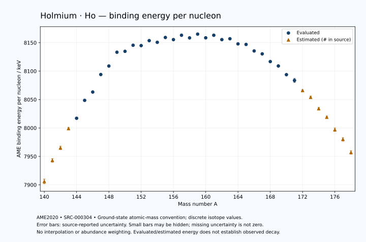

# Holmium — Atomic Masses and Reaction Energies

<!-- generated-by: sync-ame2020.mjs -->

**Dated evaluated data · scientific coverage remains partial.** 39 ground-state nuclides from AME2020. Values and uncertainties are transcribed from the retained unrounded analysis files; estimated quantities remain labelled.

- [Parent Holmium record](0067-Holmium-Ho.md) · [NUBASE states and decays](0067-Holmium-Ho-Nuclear-Evaluation.md)
- [Structured data](data/isotopes/0067-Holmium-Ho-AME2020-Evaluation.yaml)
- [Original mass table](../../data/catalog/sources/ame2020-mass_1.mas20.txt) · [Original reaction table 1](../../data/catalog/sources/ame2020-rct1.mas20.txt) · [Original reaction table 2](../../data/catalog/sources/ame2020-rct2.mas20.txt)
- [AME2020 methods](https://doi.org/10.1088/1674-1137/abddb0) (SRC-000303) · [Tables and definitions](https://doi.org/10.1088/1674-1137/abddaf) (SRC-000304)

## Reading the data

All table energies and uncertainties are in keV; binding energy is per nucleon. A # replaces a decimal point in the original estimated value. UNKNOWN (*) retains the source's not-calculable entry; it is neither zero nor automatically NOT APPLICABLE. Source lines are one-based in the retained files. Uncertainties remain those published by the evaluation, with no replacement by independent-mass quadrature.

Atomic-mass conventions apply. Qα is total decay energy, not alpha-particle kinetic energy. Positive Q alone does not establish a decay branch, rate or observation. He-4's source Qα of zero is a bookkeeping identity. These tables describe ground-state combinations, not isomer or excited-daughter transitions. Nuclear state and daughter lookups are explicit in the structured companion. The binding quantity follows [Z M(¹H) + N mₙ − M(A,Z)]c²/A; it has not been converted to a bare-nucleus convention.

## Mass and binding table

| Nuclide | N | Atomic mass excess / keV | AME binding per nucleon / keV | Mass-file line |
|---|---:|---|---|---:|
| Ho-140 | 73 | -29317# ± 500# | 7906# ± 4# | 1837 |
| Ho-141 | 74 | -34364# ± 401# | 7943# ± 3# | 1854 |
| Ho-142 | 75 | -37250# ± 401# | 7965# ± 3# | 1871 |
| Ho-143 | 76 | -42048# ± 298# | 7999# ± 2# | 1888 |
| Ho-144 | 77 | -44609.521 ± 8.477 | 8017.0977 ± 0.0589 | 1905 |
| Ho-145 | 78 | -49120.113 ± 7.452 | 8048.5792 ± 0.0514 | 1923 |
| Ho-146 | 79 | -51238.227 ± 6.587 | 8063.2426 ± 0.0451 | 1940 |
| Ho-147 | 80 | -55757.101 ± 5.001 | 8094.0381 ± 0.0340 | 1957 |
| Ho-148 | 81 | -57991.166 ± 83.834 | 8108.9797 ± 0.5664 | 1973 |
| Ho-149 | 82 | -61645.854 ± 11.985 | 8133.2550 ± 0.0804 | 1990 |
| Ho-150 | 83 | -61945.892 ± 14.168 | 8134.8423 ± 0.0945 | 2007 |
| Ho-151 | 84 | -63622.746 ± 8.298 | 8145.5267 ± 0.0550 | 2024 |
| Ho-152 | 85 | -63604.636 ± 12.528 | 8144.9193 ± 0.0824 | 2041 |
| Ho-153 | 86 | -65012.074 ± 5.066 | 8153.6372 ± 0.0331 | 2057 |
| Ho-154 | 87 | -64639.378 ± 8.216 | 8150.6825 ± 0.0534 | 2074 |
| Ho-155 | 88 | -66039.799 ± 17.470 | 8159.2055 ± 0.1127 | 2090 |
| Ho-156 | 89 | -65538.403 ± 38.424 | 8155.4280 ± 0.2463 | 2107 |
| Ho-157 | 90 | -66832.862 ± 23.469 | 8163.1373 ± 0.1495 | 2124 |
| Ho-158 | 91 | -66187.396 ± 27.106 | 8158.4709 ± 0.1716 | 2141 |
| Ho-159 | 92 | -67329.620 ± 3.045 | 8165.1066 ± 0.0192 | 2158 |
| Ho-160 | 93 | -66382.425 ± 15.016 | 8158.6004 ± 0.0939 | 2175 |
| Ho-161 | 94 | -67196.294 ± 2.151 | 8163.1134 ± 0.0134 | 2192 |
| Ho-162 | 95 | -66040.563 ± 3.102 | 8155.4126 ± 0.0192 | 2209 |
| Ho-163 | 96 | -66378.027 ± 0.693 | 8156.9670 ± 0.0043 | 2226 |
| Ho-164 | 97 | -64980.517 ± 1.390 | 8147.9234 ± 0.0085 | 2243 |
| Ho-165 | 98 | -64898.017 ± 0.786 | 8146.9591 ± 0.0048 | 2260 |
| Ho-166 | 99 | -63070.339 ± 0.786 | 8135.4933 ± 0.0047 | 2277 |
| Ho-167 | 100 | -62279.459 ± 5.189 | 8130.3732 ± 0.0311 | 2294 |
| Ho-168 | 101 | -60059.231 ± 30.001 | 8116.8061 ± 0.1786 | 2311 |
| Ho-169 | 102 | -58796.010 ± 20.048 | 8109.0622 ± 0.1186 | 2328 |
| Ho-170 | 103 | -56237.514 ± 50.019 | 8093.7902 ± 0.2942 | 2345 |
| Ho-171 | 104 | -54517.822 ± 600.002 | 8083.6021 ± 3.5088 | 2362 |
| Ho-172 | 105 | -51484# ± 196# | 8066# ± 1# | 2379 |
| Ho-173 | 106 | -49351# ± 298# | 8054# ± 2# | 2395 |
| Ho-174 | 107 | -45870# ± 300# | 8034# ± 2# | 2411 |
| Ho-175 | 108 | -43300# ± 400# | 8019# ± 2# | 2426 |
| Ho-176 | 109 | -39390# ± 500# | 7997# ± 3# | 2441 |
| Ho-177 | 110 | -36280# ± 500# | 7980# ± 3# | 2456 |
| Ho-178 | 111 | -32130# ± 500# | 7957# ± 3# | 2471 |

## Q-values and separation energies

| Nuclide | Qβ− / keV | Qα / keV | S₂n / keV | S₂p / keV | Reaction-file line |
|---|---|---|---|---|---:|
| Ho-140 | UNKNOWN (*) | 4157# ± 707# | UNKNOWN (*) | 295# ± 583# | 1836 |
| Ho-141 | UNKNOWN (*) | 4178# ± 567# | UNKNOWN (*) | 812# ± 499# | 1853 |
| Ho-142 | -9321# ± 641# | 3925# ± 500# | 24076# ± 641# | 1346# ± 895# | 1870 |
| Ho-143 | -10887# ± 499# | 3658# ± 422# | 23826# ± 499# | 2085# ± 316# | 1887 |
| Ho-144 | -8002# ± 196# | 3447.8415 ± 800.5328 | 23502# ± 401# | 2627.9406 ± 700.6089 | 1904 |
| Ho-145 | -9880# ± 200# | 2995.8137 ± 105.5223 | 23215# ± 298# | 3278.8629 ± 51.7713 | 1922 |
| Ho-146 | -6916.2074 ± 9.3987 | 2896.3793 ± 700.5885 | 22771.3425 ± 10.7348 | 3447.9814 ± 28.7106 | 1939 |
| Ho-147 | -9149.2869 ± 38.5173 | 2237.1755 ± 51.4756 | 22779.6240 ± 8.9743 | 3935.3503 ± 111.0083 | 1956 |
| Ho-148 | -6512.1694 ± 84.4583 | 1952.1055 ± 88.3693 | 22895.5755 ± 84.0928 | 4805.4643 ± 95.0824 | 1972 |
| Ho-149 | -7904.2328 ± 30.4066 | 2328.9233 ± 111.5415 | 22031.3887 ± 12.9868 | 5481.1221 ± 14.4404 | 1989 |
| Ho-150 | -4114.5689 ± 13.5910 | 3392.8365 ± 46.9677 | 20097.3616 ± 85.0232 | 5986.8871 ± 18.8648 | 2006 |
| Ho-151 | -5356.4558 ± 18.4420 | 4695.0117 ± 1.8190 | 18119.5286 ± 14.5545 | 6712.0486 ± 8.9500 | 2023 |
| Ho-152 | -3104.4174 ± 9.8150 | 4507.3953 ± 1.3374 | 17801.3801 ± 18.9078 | 7076.7890 ± 14.5200 | 2040 |
| Ho-153 | -4545.3918 ± 9.8899 | 4051.6499 ± 3.5355 | 17531.9638 ± 9.6230 | 7966.4752 ± 6.3225 | 2056 |
| Ho-154 | -2034.4045 ± 9.4621 | 4041.4946 ± 3.6300 | 17177.3788 ± 14.9668 | 8500.0169 ± 40.8327 | 2073 |
| Ho-155 | -3830.6268 ± 18.4730 | 3158.8259 ± 17.9159 | 17170.3612 ± 18.1666 | 9304.1310 ± 17.8808 | 2089 |
| Ho-156 | -1326.7201 ± 45.6391 | 2753.9849 ± 55.4572 | 17041.6606 ± 39.2779 | 9959.6383 ± 59.3919 | 2106 |
| Ho-157 | -3419.2146 ± 33.6675 | 2055.8317 ± 23.7932 | 16935.6997 ± 29.2541 | 10160.3652 ± 25.4391 | 2123 |
| Ho-158 | -883.5812 ± 37.0236 | 1544.3943 ± 52.7917 | 16791.6297 ± 47.0151 | 10674.3283 ± 27.3512 | 2140 |
| Ho-159 | -2768.5000 ± 2.0000 | 1495.9032 ± 10.2315 | 16639.3940 ± 23.6606 | 11143.7141 ± 2.9952 | 2157 |
| Ho-160 | -318.2488 ± 28.5197 | 1283.6691 ± 15.4654 | 16337.6649 ± 30.9729 | 11489.4841 ± 15.0527 | 2174 |
| Ho-161 | -1994.9954 ± 9.0041 | 1142.6386 ± 2.3303 | 16009.3097 ± 3.6724 | 12241.6544 ± 2.3410 | 2191 |
| Ho-162 | 293.6478 ± 3.1069 | 1005.4047 ± 3.2959 | 15800.7736 ± 15.3155 | 12782.0312 ± 3.2391 | 2208 |
| Ho-163 | -1210.6141 ± 4.5755 | 729.6389 ± 1.0936 | 15324.3691 ± 2.1377 | 13494.1914 ± 1.2016 | 2225 |
| Ho-164 | 962.0559 ± 1.3756 | 431.0405 ± 1.6760 | 15082.5907 ± 3.2127 | 13678.9116 ± 2.4765 | 2242 |
| Ho-165 | -376.6648 ± 0.9575 | 138.8443 ± 1.3174 | 14662.6266 ± 0.7492 | 14880.2058 ± 4.0694 | 2259 |
| Ho-166 | 1853.8057 ± 0.7792 | 384.2930 ± 2.1950 | 14232.4579 ± 1.1481 | 15543.2977 ± 2.0221 | 2276 |
| Ho-167 | 1009.7971 ± 5.1890 | -108.6208 ± 6.5892 | 13524.0774 ± 5.2505 | 16268.5513 ± 5.4128 | 2293 |
| Ho-168 | 2930.0000 ± 30.0000 | -379.1637 ± 30.0589 | 13131.5284 ± 30.0102 | 16828.3958 ± 30.0368 | 2310 |
| Ho-169 | 2125.1534 ± 20.0483 | -632.0761 ± 20.1072 | 12659.1872 ± 20.6155 | 17490.8694 ± 20.1407 | 2327 |
| Ho-170 | 3870.0000 ± 50.0000 | -853.6521 ± 50.0406 | 12320.9187 ± 58.3259 | 18034.2747 ± 50.1946 | 2344 |
| Ho-171 | 3200.0000 ± 600.0000 | -1059.6558 ± 600.0048 | 11864.4487 ± 600.3333 | 18615# ± 671# | 2361 |
| Ho-172 | 4999# ± 196# | -1127# ± 196# | 11389# ± 202# | 19352# ± 358# | 2378 |
| Ho-173 | 4304# ± 357# | -1295# ± 423# | 10975# ± 670# | 20159# ± 499# | 2394 |
| Ho-174 | 6080# ± 423# | -1585# ± 424# | 10529# ± 358# | 20757# ± 583# | 2410 |
| Ho-175 | 5352# ± 566# | -1955# ± 565# | 10092# ± 499# | 21368# ± 640# | 2425 |
| Ho-176 | 7241# ± 641# | -2125# ± 707# | 9663# ± 583# | 21998# ± 707# | 2440 |
| Ho-177 | 6578# ± 709# | -2195# ± 707# | 9123# ± 640# | UNKNOWN (*) | 2455 |
| Ho-178 | 8130# ± 778# | -2585# ± 707# | 8883# ± 707# | UNKNOWN (*) | 2470 |

## Additional decay-energy combinations

| Nuclide | Q₂β− / keV | Q₄β− / keV | Qεp / keV | Qβ−n / keV | Part 1 / part 2 line |
|---|---|---|---|---|---|
| Ho-140 | UNKNOWN (*) | UNKNOWN (*) | 11524# ± 582# | UNKNOWN (*) | 1836 / 1862 |
| Ho-141 | UNKNOWN (*) | UNKNOWN (*) | 8829# ± 895# | UNKNOWN (*) | 1853 / 1880 |
| Ho-142 | UNKNOWN (*) | UNKNOWN (*) | 10001# ± 414# | UNKNOWN (*) | 1870 / 1897 |
| Ho-143 | UNKNOWN (*) | UNKNOWN (*) | 7223# ± 761# | -22189# ± 582# | 1887 / 1914 |
| Ho-144 | -22450# ± 400# | UNKNOWN (*) | 8520.7008 ± 51.9287 | -21520# ± 400# | 1904 / 1931 |
| Ho-145 | -21537# ± 196# | UNKNOWN (*) | 5959.1035 ± 28.9214 | -20584# ± 196# | 1922 / 1950 |
| Ho-146 | -20183# ± 200# | UNKNOWN (*) | 7872.4948 ± 111.0911 | -20069# ± 200# | 1939 / 1967 |
| Ho-147 | -19782.6940 ± 8.4719 | UNKNOWN (*) | 4717.5720 ± 45.1382 | -19506.3996 ± 8.3641 | 1956 / 1984 |
| Ho-148 | -19226.1324 ± 84.4583 | UNKNOWN (*) | 5462.5362 ± 84.2245 | -19454.6702 ± 92.1238 | 1972 / 2000 |
| Ho-149 | -17705# ± 201# | UNKNOWN (*) | 1602.1222 ± 15.4647 | -18238.1747 ± 15.7683 | 1989 / 2018 |
| Ho-150 | -15455# ± 196# | -37175# ± 300# | 2253.7767 ± 14.5891 | -16275.5890 ± 31.3311 | 2006 / 2035 |
| Ho-151 | -12851.1327 ± 21.0385 | -33322# ± 300# | 194.0718 ± 11.0396 | -13862.7412 ± 19.0492 | 2023 / 2052 |
| Ho-152 | -11884.3571 ± 55.4602 | -30183# ± 196# | 729.9339 ± 13.1648 | -13409.6636 ± 20.6933 | 2040 / 2069 |
| Ho-153 | -11039.4641 ± 12.7976 | -26636.6116 ± 150.1029 | -1583.7412 ± 40.3142 | -12583.1735 ± 10.1093 | 2056 / 2086 |
| Ho-154 | -10212.2361 ± 16.5678 | -24973# ± 201# | -614.7394 ± 9.0179 | -12244.0145 ± 12.3030 | 2073 / 2103 |
| Ho-155 | -9413.8777 ± 20.0807 | -23494.7427 ± 25.9887 | -3172.0633 ± 48.5484 | -11506.1431 ± 18.1394 | 2089 / 2119 |
| Ho-156 | -8703.9859 ± 40.9883 | -21838.8532 ± 66.3743 | -1576.9346 ± 39.6385 | -11400.5489 ± 38.8834 | 2106 / 2136 |
| Ho-157 | -8123.5836 ± 36.4925 | -20393.0445 ± 26.3913 | -4030.8232 ± 23.7638 | -10692.4977 ± 34.0202 | 2123 / 2154 |
| Ho-158 | -7484.1963 ± 37.0236 | -18975.1960 ± 31.0379 | -2712.5192 ± 27.1120 | -10845.0667 ± 37.9089 | 2140 / 2171 |
| Ho-159 | -6759.2162 ± 28.1102 | -17621.0112 ± 37.7861 | -5147.7080 ± 2.9902 | -10097.1230 ± 25.4026 | 2157 / 2188 |
| Ho-160 | -6081.3883 ± 35.9702 | -16112.4830 ± 58.7719 | -4138.8147 ± 15.0399 | -9892.6231 ± 15.4316 | 2174 / 2205 |
| Ho-161 | -5297.5792 ± 28.0275 | -14633.9446 ± 28.0275 | -6648.7913 ± 2.3442 | -9203.4354 ± 24.3416 | 2191 / 2223 |
| Ho-162 | -4563.0804 ± 26.2321 | -13208.8036 ± 75.0999 | -5867.7562 ± 3.2760 | -8910.5823 ± 9.2773 | 2208 / 2240 |
| Ho-163 | -3649.6141 ± 5.4713 | -11586.6122 ± 27.9534 | -7787.4501 ± 2.1634 | -8115.1344 ± 0.3024 | 2225 / 2257 |
| Ho-164 | -3071.5743 ± 25.0423 | -10338.1417 ± 27.9794 | -7673.7347 ± 4.2284 | -7884.4225 ± 4.7760 | 2242 / 2274 |
| Ho-165 | -1967.9930 ± 1.6737 | -8455.7698 ± 26.5507 | -10082.0050 ± 2.0221 | -7026.7622 ± 0.7565 | 2259 / 2292 |
| Ho-166 | -1183.8610 ± 11.5733 | -7049.3521 ± 29.8182 | -9770.4606 ± 1.7301 | -6620.3045 ± 0.9576 | 2276 / 2309 |
| Ho-167 | 263.6579 ± 5.4094 | -4753.1773 ± 37.6193 | -11759.6521 ± 5.3910 | -5426.6320 ± 5.1922 | 2293 / 2326 |
| Ho-168 | 1253.1474 ± 30.0473 | -2986.3997 ± 48.3947 | -11465.1199 ± 30.0631 | -4841.2936 ± 30.0002 | 2310 / 2343 |
| Ho-169 | 2478.6445 ± 20.0804 | -713.4825 ± 20.2718 | -13303.7996 ± 20.4816 | -3878.0965 ± 20.0477 | 2327 / 2361 |
| Ho-170 | 3557.8003 ± 50.0319 | 1068.7200 ± 52.7789 | -13046# ± 304# | -3387.6687 ± 50.0193 | 2344 / 2378 |
| Ho-171 | 4692.4490 ± 600.0010 | 3310.6432 ± 600.0045 | -15097# ± 671# | -2481.6265 ± 600.0001 | 2361 / 2395 |
| Ho-172 | 5890# ± 196# | 5252# ± 196# | -15003# ± 445# | -1837# ± 196# | 2378 / 2412 |
| Ho-173 | 6906# ± 298# | 7530# ± 298# | -16949# ± 582# | -939# ± 298# | 2394 / 2429 |
| Ho-174 | 7995# ± 303# | 9701# ± 300# | -16649# ± 583# | -287# ± 358# | 2410 / 2445 |
| Ho-175 | 9011# ± 403# | 11866# ± 400# | -18619# ± 640# | 579# ± 499# | 2425 / 2460 |
| Ho-176 | 9981# ± 510# | 13992# ± 500# | UNKNOWN (*) | 1191# ± 641# | 2440 / 2475 |
| Ho-177 | 11290# ± 539# | 16104# ± 500# | UNKNOWN (*) | 2279# ± 641# | 2455 / 2490 |
| Ho-178 | 12110# ± 583# | 18208# ± 500# | UNKNOWN (*) | 2657# ± 709# | 2470 / 2506 |

## Single-nucleon separation and reaction energies

| Nuclide | Sₙ / keV | Sₚ / keV | Q(d,α) / keV | Q(p,α) / keV | Q(n,α) / keV | Part 2 line |
|---|---|---|---|---|---|---:|
| Ho-140 | UNKNOWN (*) | -1093.8999 ± 10.0000 | 16324# ± 709# | UNKNOWN (*) | 17296# ± 641# | 1862 |
| Ho-141 | 13118# ± 641# | -1176.7792 ± 7.4278 | 14047# ± 641# | 5431# ± 643# | 14882# ± 500# | 1880 |
| Ho-142 | 10957# ± 567# | -843# ± 499# | 16290# ± 566# | 5314# ± 641# | 16526# ± 499# | 1897 |
| Ho-143 | 12869# ± 499# | -783# ± 787# | 14046# ± 422# | 5647# ± 499# | 14081# ± 854# | 1914 |
| Ho-144 | 10633# ± 298# | -270.4575 ± 15.5537 | 16221# ± 729# | 5637# ± 298# | 15577.7244 ± 105.5996 | 1931 |
| Ho-145 | 12581.9106 ± 11.2865 | -161.0069 ± 10.3429 | 13759.6430 ± 15.0199 | 5863# ± 729# | 13085.8112 ± 700.5972 | 1950 |
| Ho-146 | 10189.4318 ± 9.9456 | 284.5905 ± 9.2683 | 16042.6713 ± 9.7380 | 5794.7774 ± 14.6099 | 14827.3677 ± 51.6538 | 1967 |
| Ho-147 | 12590.1922 ± 8.2699 | 491.1445 ± 8.3562 | 13196.3135 ± 8.2172 | 5677.0453 ± 8.7437 | 12257.4889 ± 28.3887 | 1984 |
| Ho-148 | 10305.3834 ± 83.9835 | 1084.0903 ± 84.3002 | 15274.5683 ± 84.1014 | 5115.4964 ± 84.0877 | 14054.9287 ± 139.0182 | 2000 |
| Ho-149 | 11726.0054 ± 84.6869 | 1075.4280 ± 12.4293 | 13261.0005 ± 14.8982 | 5773.1292 ± 13.7282 | 11764.1927 ± 46.4221 | 2018 |
| Ho-150 | 8371.3562 ± 18.5474 | 1540.8726 ± 16.8561 | 16624.3119 ± 16.6345 | 7114.2105 ± 16.7043 | 14443.1840 ± 16.2535 | 2035 |
| Ho-151 | 9748.1723 ± 16.3549 | 1602.0989 ± 8.9355 | 14782.0512 ± 12.3088 | 9100.7058 ± 12.0305 | 12560.6030 ± 14.9621 | 2052 |
| Ho-152 | 8053.2077 ± 15.0163 | 2141.2186 ± 12.9160 | 16415.7895 ± 13.2272 | 8953.4097 ± 15.0862 | 13530.4060 ± 12.9851 | 2069 |
| Ho-153 | 9478.7561 ± 13.4579 | 2183.0816 ± 6.5310 | 14451.1214 ± 5.6731 | 9161.5996 ± 6.3625 | 11740.1173 ± 8.7910 | 2086 |
| Ho-154 | 7698.6227 ± 9.5110 | 2785.1529 ± 9.0370 | 16189.3918 ± 9.2630 | 8977.0649 ± 8.6773 | 12630.5645 ± 9.0724 | 2103 |
| Ho-155 | 9471.7385 ± 19.2873 | 2934.7552 ± 18.9647 | 13814.2048 ± 17.8935 | 8942.2195 ± 18.0405 | 10323.9070 ± 43.6468 | 2119 |
| Ho-156 | 7569.9221 ± 42.1946 | 3671.4346 ± 39.5930 | 15566.4188 ± 39.1201 | 8468.8489 ± 38.6098 | 11421.6094 ± 38.6038 | 2136 |
| Ho-157 | 9365.7776 ± 45.0210 | 3592.4470 ± 23.4836 | 13033.8840 ± 25.3682 | 8425.2075 ± 24.6135 | 8970.2464 ± 51.0239 | 2154 |
| Ho-158 | 7425.8521 ± 35.8364 | 4051.6983 ± 27.4867 | 15052.7970 ± 27.1110 | 7832.5981 ± 28.7595 | 10709.4451 ± 28.8220 | 2171 |
| Ho-159 | 9213.5419 ± 27.2607 | 4211.4394 ± 3.7270 | 12805.8560 ± 5.8960 | 8063.8214 ± 2.9889 | 8407.7922 ± 4.6398 | 2188 |
| Ho-160 | 7124.1231 ± 15.3014 | 4504.1761 ± 15.0643 | 14735.5337 ± 15.1679 | 7906.2992 ± 15.8551 | 10027.8253 ± 15.0355 | 2205 |
| Ho-161 | 8885.1867 ± 15.1512 | 4812.8397 ± 2.1354 | 12681.7334 ± 2.5074 | 8074.9133 ± 3.0944 | 7920.9917 ± 2.4221 | 2223 |
| Ho-162 | 6915.5869 ± 3.6063 | 5274.0397 ± 3.0919 | 14342.6696 ± 3.0928 | 7990.7127 ± 3.3590 | 9138.4211 ± 3.2368 | 2240 |
| Ho-163 | 8408.7822 ± 3.0926 | 5485.8284 ± 0.0516 | 12388.2743 ± 0.0791 | 8158.4536 ± 0.1094 | 7104.8490 ± 1.1003 | 2257 |
| Ho-164 | 6673.8085 ± 1.3692 | 5888.6306 ± 1.3692 | 13911.4593 ± 1.3708 | 7939.0321 ± 1.3719 | 8127.6625 ± 1.7463 | 2274 |
| Ho-165 | 7988.8182 ± 1.1479 | 6219.3397 ± 0.7482 | 12193.6474 ± 0.7493 | 8147.2073 ± 0.7522 | 6627.9327 ± 2.1950 | 2292 |
| Ho-166 | 6243.6397 ± 0.0200 | 6747.0214 ± 0.7503 | 13608.1168 ± 0.7484 | 8174.5740 ± 0.7494 | 7171.8169 ± 4.0694 | 2309 |
| Ho-167 | 7280.4377 ± 5.2505 | 6983.9591 ± 5.2518 | 12043.6371 ± 5.2365 | 8552.2454 ± 5.2362 | 5471.9271 ± 5.5131 | 2326 |
| Ho-168 | 5851.0907 ± 30.4452 | 7436.7513 ± 30.2673 | 13236.0464 ± 30.0114 | 8417.1126 ± 30.0087 | 6176.0204 ± 30.0407 | 2343 |
| Ho-169 | 6808.0965 ± 36.0820 | 7526.5829 ± 141.4214 | 11826.2483 ± 20.4442 | 8652.5161 ± 20.0644 | 4659.1701 ± 20.1013 | 2361 |
| Ho-170 | 5512.8222 ± 53.8516 | 7930.4752 ± 304.7950 | 13031.6911 ± 148.6607 | 8537.9924 ± 50.1793 | 5291.9708 ± 50.0564 | 2378 |
| Ho-171 | 6351.6265 ± 602.0798 | 8097# ± 633# | 11788.9945 ± 671.1186 | 8904.6308 ± 616.1170 | 3909.7611 ± 600.0163 | 2395 |
| Ho-172 | 5037# ± 631# | 8763# ± 280# | 12937# ± 280# | 8976# ± 359# | 4643# ± 358# | 2412 |
| Ho-173 | 5938# ± 357# | 8880# ± 423# | 11370# ± 359# | 9223# ± 359# | 3006# ± 423# | 2429 |
| Ho-174 | 4590# ± 423# | 9418# ± 500# | 12601# ± 424# | 9005# ± 361# | 3547# ± 500# | 2445 |
| Ho-175 | 5501# ± 500# | 9458# ± 640# | 11151# ± 565# | 9324# ± 500# | 2037# ± 640# | 2460 |
| Ho-176 | 4162# ± 640# | 9949# ± 707# | 12451# ± 707# | 9214# ± 640# | 2766# ± 707# | 2475 |
| Ho-177 | 4961# ± 707# | 9959# ± 707# | 11161# ± 707# | 9714# ± 707# | 1336# ± 707# | 2490 |
| Ho-178 | 3922# ± 707# | UNKNOWN (*) | 12191# ± 707# | 9464# ± 707# | UNKNOWN (*) | 2506 |

Qβ− comes from the mass-file line in the first table. Qα, S₂n, S₂p, Q₂β−, Qεp and Qβ−n come from reaction part 1; Q₄β− and the last table come from part 2. Qεp is electron-capture/proton energy balance; Qβ−n is beta-minus/neutron energy balance. These are evaluated mass combinations, not observations of decay modes, cross sections or reaction rates. Light-nuclide zero entries can be bookkeeping identities, without a physical A=0 residual. Definitions and original source strings are retained in the structured data.

## Binding-energy chart

Discrete source values and source-reported uncertainties. No interpolation, natural-abundance weighting or observed-decay claim is implied. This quantitative chart supplements the 22 separate illustrative panels.

## Remaining review

Later measurements, state-specific decay branches, isomer Q-values, reaction rates, applicability and full claim-level review remain open. Existing authored values retain their own provenance; this companion does not overwrite them.
