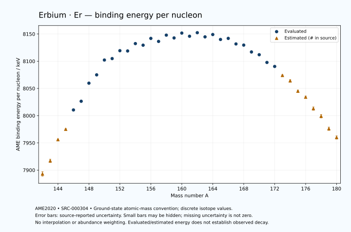

# Erbium — Atomic Masses and Reaction Energies

<!-- generated-by: sync-ame2020.mjs -->

**Dated evaluated data · scientific coverage remains partial.** 39 ground-state nuclides from AME2020. Values and uncertainties are transcribed from the retained unrounded analysis files; estimated quantities remain labelled.

- [Parent Erbium record](0068-Erbium-Er.md) · [NUBASE states and decays](0068-Erbium-Er-Nuclear-Evaluation.md)
- [Structured data](data/isotopes/0068-Erbium-Er-AME2020-Evaluation.yaml)
- [Original mass table](../../data/catalog/sources/ame2020-mass_1.mas20.txt) · [Original reaction table](../../data/catalog/sources/ame2020-rct1.mas20.txt)
- [AME2020 methods](https://doi.org/10.1088/1674-1137/abddb0) (SRC-000303) · [Tables and definitions](https://doi.org/10.1088/1674-1137/abddaf) (SRC-000304)

## Reading the data

All table energies and uncertainties are in keV; binding energy is per nucleon. A # replaces a decimal point in the original estimated value. UNKNOWN (*) retains the source's not-calculable entry; it is neither zero nor automatically NOT APPLICABLE. Source lines are one-based in the retained files. Uncertainties remain those published by the evaluation, with no replacement by independent-mass quadrature.

Atomic-mass conventions apply. Qα is total decay energy, not alpha-particle kinetic energy. Positive Q alone does not establish a decay branch, rate or observation. He-4's source Qα of zero is a bookkeeping identity. These tables describe ground-state combinations, not isomer or excited-daughter transitions. Nuclear state and daughter lookups are explicit in the structured companion. The binding quantity follows [Z M(¹H) + N mₙ − M(A,Z)]c²/A; it has not been converted to a bare-nucleus convention.

## Mass and binding table

| Nuclide | N | Atomic mass excess / keV | AME binding per nucleon / keV | Mass-file line |
|---|---:|---|---|---:|
| Er-142 | 74 | -27930# ± 500# | 7893# ± 4# | 1872 |
| Er-143 | 75 | -31160# ± 400# | 7917# ± 3# | 1889 |
| Er-144 | 76 | -36608# ± 196# | 7956# ± 1# | 1906 |
| Er-145 | 77 | -39240# ± 200# | 7975# ± 1# | 1924 |
| Er-146 | 78 | -44322.019 ± 6.705 | 8010.5127 ± 0.0459 | 1941 |
| Er-147 | 79 | -46607.814 ± 38.191 | 8026.4760 ± 0.2598 | 1958 |
| Er-148 | 80 | -51478.997 ± 10.246 | 8059.6924 ± 0.0692 | 1974 |
| Er-149 | 81 | -53741.621 ± 27.945 | 8074.9558 ± 0.1875 | 1991 |
| Er-150 | 82 | -57831.323 ± 17.194 | 8102.1962 ± 0.1146 | 2008 |
| Er-151 | 83 | -58266.290 ± 16.470 | 8104.8723 ± 0.1091 | 2025 |
| Er-152 | 84 | -60500.218 ± 8.830 | 8119.3485 ± 0.0581 | 2042 |
| Er-153 | 85 | -60466.682 ± 9.285 | 8118.8154 ± 0.0607 | 2058 |
| Er-154 | 86 | -62604.974 ± 4.961 | 8132.3919 ± 0.0322 | 2075 |
| Er-155 | 87 | -62209.172 ± 6.074 | 8129.4444 ± 0.0392 | 2091 |
| Er-156 | 88 | -64211.683 ± 24.629 | 8141.9084 ± 0.1579 | 2108 |
| Er-157 | 89 | -63413.648 ± 26.505 | 8136.3757 ± 0.1688 | 2125 |
| Er-158 | 90 | -65303.815 ± 25.219 | 8147.9270 ± 0.1596 | 2142 |
| Er-159 | 91 | -64561.120 ± 3.643 | 8142.7742 ± 0.0229 | 2159 |
| Er-160 | 92 | -66064.176 ± 24.246 | 8151.7217 ± 0.1515 | 2176 |
| Er-161 | 93 | -65201.298 ± 8.774 | 8145.8628 ± 0.0545 | 2193 |
| Er-162 | 94 | -66334.210 ± 0.756 | 8152.3959 ± 0.0047 | 2210 |
| Er-163 | 95 | -65167.413 ± 4.628 | 8144.7403 ± 0.0284 | 2227 |
| Er-164 | 96 | -65942.573 ± 0.704 | 8149.0191 ± 0.0043 | 2244 |
| Er-165 | 97 | -64521.353 ± 0.918 | 8139.9348 ± 0.0056 | 2261 |
| Er-166 | 98 | -64924.145 ± 0.334 | 8141.9479 ± 0.0020 | 2278 |
| Er-167 | 99 | -63289.256 ± 0.286 | 8131.7352 ± 0.0017 | 2295 |
| Er-168 | 100 | -62989.231 ± 0.262 | 8129.5897 ± 0.0016 | 2312 |
| Er-169 | 101 | -60921.163 ± 0.304 | 8117.0078 ± 0.0018 | 2329 |
| Er-170 | 102 | -60107.514 ± 1.387 | 8111.9529 ± 0.0082 | 2346 |
| Er-171 | 103 | -57717.822 ± 1.408 | 8097.7404 ± 0.0082 | 2363 |
| Er-172 | 104 | -56482.578 ± 3.962 | 8090.4052 ± 0.0230 | 2380 |
| Er-173 | 105 | -53654# ± 196# | 8074# ± 1# | 2396 |
| Er-174 | 106 | -51949# ± 298# | 8064# ± 2# | 2412 |
| Er-175 | 107 | -48652# ± 401# | 8045# ± 2# | 2427 |
| Er-176 | 108 | -46631# ± 401# | 8034# ± 2# | 2442 |
| Er-177 | 109 | -42858# ± 503# | 8013# ± 3# | 2457 |
| Er-178 | 110 | -40260# ± 596# | 7999# ± 3# | 2472 |
| Er-179 | 111 | -36080# ± 500# | 7976# ± 3# | 2487 |
| Er-180 | 112 | -33180# ± 500# | 7960# ± 3# | 2502 |

## Q-values and separation energies

| Nuclide | Qβ− / keV | Qα / keV | S₂n / keV | S₂p / keV | Reaction-file line |
|---|---|---|---|---|---:|
| Er-142 | UNKNOWN (*) | 4576# ± 709# | UNKNOWN (*) | -322# ± 641# | 1871 |
| Er-143 | UNKNOWN (*) | 4115# ± 640# | UNKNOWN (*) | 356# ± 499# | 1888 |
| Er-144 | -14448# ± 445# | 3797# ± 446# | 24820# ± 537# | 1066# ± 754# | 1905 |
| Er-145 | -11657# ± 280# | 3717# ± 359# | 24222# ± 447# | 1649# ± 201# | 1923 |
| Er-146 | -13267# ± 200# | 3373# ± 729# | 23857# ± 196# | 2329.8705 ± 9.8182 | 1940 |
| Er-147 | -10633.4071 ± 38.7987 | 3136.2191 ± 40.3564 | 23510# ± 204# | 2943.1488 ± 38.7439 | 1957 |
| Er-148 | -12713.9630 ± 14.4906 | 2666.1783 ± 12.5074 | 23299.6135 ± 12.2450 | 3502.0115 ± 12.2397 | 1973 |
| Er-149 | -9801# ± 202# | 2076.0708 ± 28.6955 | 23276.4428 ± 47.3232 | 4123.5159 ± 29.3125 | 1990 |
| Er-150 | -11340# ± 196# | 2298.6889 ± 18.4510 | 22494.9621 ± 20.0158 | 4549.8683 ± 19.2783 | 2007 |
| Er-151 | -7494.6768 ± 25.4292 | 3504.8410 ± 18.6966 | 20667.3055 ± 32.4371 | 5150.2421 ± 18.8567 | 2024 |
| Er-152 | -8779.9397 ± 54.7434 | 4934.2625 ± 1.6182 | 18811.5316 ± 19.3263 | 5768.5423 ± 9.8052 | 2041 |
| Er-153 | -6494.0723 ± 12.8812 | 4802.3924 ± 1.4040 | 18343.0278 ± 18.9066 | 6292.2359 ± 9.6570 | 2057 |
| Er-154 | -8177.8316 ± 14.9113 | 4279.7284 ± 2.6107 | 18247.3917 ± 10.1047 | 7064.9528 ± 6.4628 | 2074 |
| Er-155 | -5583.2509 ± 11.5109 | 4118.3002 ± 5.1327 | 17885.1263 ± 10.9363 | 7643.9176 ± 7.0990 | 2090 |
| Er-156 | -7377.2657 ± 26.7099 | 3481.3646 ± 25.0504 | 17749.3450 ± 25.1208 | 8395.6102 ± 25.7240 | 2107 |
| Er-157 | -4704.3690 ± 38.5152 | 3304.6329 ± 26.8046 | 17347.1119 ± 27.1914 | 8835.6506 ± 28.2046 | 2124 |
| Er-158 | -6600.6151 ± 31.3411 | 2665.2835 ± 26.2914 | 17234.7687 ± 35.2508 | 9352.3710 ± 25.2388 | 2141 |
| Er-159 | -3990.7162 ± 28.1813 | 2169.9032 ± 10.2510 | 17290.1086 ± 26.7535 | 9714.3932 ± 6.2259 | 2158 |
| Er-160 | -5763.1395 ± 39.1333 | 2040.2941 ± 24.2664 | 16902.9973 ± 34.9844 | 10234.9667 ± 24.3587 | 2175 |
| Er-161 | -3302.5839 ± 29.2899 | 1798.4549 ± 10.1435 | 16782.8144 ± 9.4676 | 10612.0204 ± 8.8564 | 2192 |
| Er-162 | -4856.7282 ± 26.0475 | 1648.0256 ± 2.2716 | 16412.6701 ± 24.2581 | 11239.7274 ± 0.3132 | 2209 |
| Er-163 | -2439.0000 ± 3.0000 | 1574.8916 ± 4.7819 | 16108.7504 ± 9.8693 | 11689.8608 ± 4.5760 | 2226 |
| Er-164 | -4033.6302 ± 25.0113 | 1304.9362 ± 0.1698 | 15750.9988 ± 0.3291 | 12339.3458 ± 0.1397 | 2243 |
| Er-165 | -1591.3282 ± 1.4891 | 1109.2257 ± 0.6072 | 15496.5759 ± 4.6142 | 12718.4369 ± 0.6024 | 2260 |
| Er-166 | -3037.6667 ± 11.5470 | 832.1090 ± 0.7359 | 15124.2076 ± 0.7438 | 13534.4380 ± 0.7354 | 2277 |
| Er-167 | -746.1392 ± 1.2633 | 666.6862 ± 0.7235 | 14910.5392 ± 0.9425 | 14254.9092 ± 0.7269 | 2294 |
| Er-168 | -1676.8526 ± 1.6858 | 553.5017 ± 0.7202 | 14207.7227 ± 0.2137 | 14982.7028 ± 0.8256 | 2311 |
| Er-169 | 353.4910 ± 0.7729 | 266.2097 ± 0.7385 | 13774.5436 ± 0.1948 | 15587.6543 ± 4.0169 | 2328 |
| Er-170 | -312.1997 ± 1.7852 | 52.0409 ± 1.6065 | 13260.9187 ± 1.3819 | 16127.0580 ± 140.0000 | 2345 |
| Er-171 | 1492.4490 ± 1.0788 | -231.2871 ± 4.2457 | 12939.2952 ± 1.4124 | 16699.7547 ± 300.6661 | 2362 |
| Er-172 | 890.9756 ± 4.5418 | -349.0963 ± 140.0507 | 12517.7007 ± 3.7695 | 17351# ± 200# | 2379 |
| Er-173 | 2602# ± 196# | -483# ± 359# | 12079# ± 196# | 18222# ± 280# | 2395 |
| Er-174 | 1915# ± 301# | -664# ± 359# | 11609# ± 298# | 18768# ± 423# | 2411 |
| Er-175 | 3659# ± 404# | -1067# ± 448# | 11141# ± 446# | 19490# ± 566# | 2426 |
| Er-176 | 2741# ± 413# | -1296# ± 500# | 10824# ± 499# | 20078# ± 641# | 2441 |
| Er-177 | 4711# ± 541# | -1543# ± 642# | 10349# ± 643# | 20706# ± 709# | 2456 |
| Er-178 | 3980# ± 667# | -1555# ± 778# | 9772# ± 718# | 21228# ± 778# | 2471 |
| Er-179 | 5821# ± 640# | -1775# ± 707# | 9364# ± 709# | UNKNOWN (*) | 2486 |
| Er-180 | 4990# ± 640# | -1995# ± 707# | 9062# ± 778# | UNKNOWN (*) | 2501 |

Qβ− comes from the mass-file line in the first table. The other three columns come from the reaction-file line. Definitions and original source strings are retained in the structured data.

## Binding-energy chart

Discrete source values and source-reported uncertainties. No interpolation, natural-abundance weighting or observed-decay claim is implied. This quantitative chart supplements the 22 separate illustrative panels.

## Remaining review

Later measurements, state-specific decay branches, isomer Q-values, additional reaction channels and full claim-level review remain open. Existing authored values retain their own provenance; this companion does not overwrite them.
