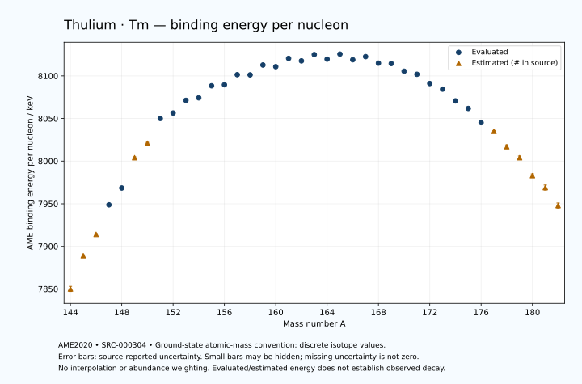

# Thulium — Atomic Masses and Reaction Energies

<!-- generated-by: sync-ame2020.mjs -->

**Dated evaluated data · scientific coverage remains partial.** 39 ground-state nuclides from AME2020. Values and uncertainties are transcribed from the retained unrounded analysis files; estimated quantities remain labelled.

- [Parent Thulium record](0069-Thulium-Tm.md) · [NUBASE states and decays](0069-Thulium-Tm-Nuclear-Evaluation.md)
- [Structured data](data/isotopes/0069-Thulium-Tm-AME2020-Evaluation.yaml)
- [Original mass table](../../data/catalog/sources/ame2020-mass_1.mas20.txt) · [Original reaction table](../../data/catalog/sources/ame2020-rct1.mas20.txt)
- [AME2020 methods](https://doi.org/10.1088/1674-1137/abddb0) (SRC-000303) · [Tables and definitions](https://doi.org/10.1088/1674-1137/abddaf) (SRC-000304)

## Reading the data

All table energies and uncertainties are in keV; binding energy is per nucleon. A # replaces a decimal point in the original estimated value. UNKNOWN (*) retains the source's not-calculable entry; it is neither zero nor automatically NOT APPLICABLE. Source lines are one-based in the retained files. Uncertainties remain those published by the evaluation, with no replacement by independent-mass quadrature.

Atomic-mass conventions apply. Qα is total decay energy, not alpha-particle kinetic energy. Positive Q alone does not establish a decay branch, rate or observation. He-4's source Qα of zero is a bookkeeping identity. These tables describe ground-state combinations, not isomer or excited-daughter transitions. Nuclear state and daughter lookups are explicit in the structured companion. The binding quantity follows [Z M(¹H) + N mₙ − M(A,Z)]c²/A; it has not been converted to a bare-nucleus convention.

## Mass and binding table

| Nuclide | N | Atomic mass excess / keV | AME binding per nucleon / keV | Mass-file line |
|---|---:|---|---|---:|
| Tm-144 | 75 | -22159# ± 400# | 7850# ± 3# | 1907 |
| Tm-145 | 76 | -27583# ± 196# | 7889# ± 1# | 1925 |
| Tm-146 | 77 | -31055# ± 200# | 7914# ± 1# | 1942 |
| Tm-147 | 78 | -35974.407 ± 6.839 | 7948.8178 ± 0.0465 | 1959 |
| Tm-148 | 79 | -38765.034 ± 10.246 | 7968.5011 ± 0.0692 | 1975 |
| Tm-149 | 80 | -43940# ± 200# | 8004# ± 1# | 1992 |
| Tm-150 | 81 | -46491# ± 196# | 8021# ± 1# | 2009 |
| Tm-151 | 82 | -50771.613 ± 19.375 | 8050.0576 ± 0.1283 | 2026 |
| Tm-152 | 83 | -51720.279 ± 54.027 | 8056.4387 ± 0.3554 | 2043 |
| Tm-153 | 84 | -53972.610 ± 11.979 | 8071.2571 ± 0.0783 | 2059 |
| Tm-154 | 85 | -54427.142 ± 14.412 | 8074.2090 ± 0.0936 | 2076 |
| Tm-155 | 86 | -56625.921 ± 9.921 | 8088.3760 ± 0.0640 | 2092 |
| Tm-156 | 87 | -56834.417 ± 14.279 | 8089.6032 ± 0.0915 | 2109 |
| Tm-157 | 88 | -58709.279 ± 27.945 | 8101.4285 ± 0.1780 | 2126 |
| Tm-158 | 89 | -58703.200 ± 25.219 | 8101.1994 ± 0.1596 | 2143 |
| Tm-159 | 90 | -60570.404 ± 27.945 | 8112.7549 ± 0.1758 | 2160 |
| Tm-160 | 91 | -60301.037 ± 32.686 | 8110.8124 ± 0.2043 | 2177 |
| Tm-161 | 92 | -61898.715 ± 27.945 | 8120.4906 ± 0.1736 | 2194 |
| Tm-162 | 93 | -61477.482 ± 26.058 | 8117.5868 ± 0.1609 | 2211 |
| Tm-163 | 94 | -62728.413 ± 5.515 | 8124.9774 ± 0.0338 | 2228 |
| Tm-164 | 95 | -61908.943 ± 25.006 | 8119.6534 ± 0.1525 | 2245 |
| Tm-165 | 96 | -62930.024 ± 1.658 | 8125.5489 ± 0.0101 | 2262 |
| Tm-166 | 97 | -61886.478 ± 11.552 | 8118.9357 ± 0.0696 | 2279 |
| Tm-167 | 98 | -62543.117 ± 1.258 | 8122.5826 ± 0.0075 | 2296 |
| Tm-168 | 99 | -61312.379 ± 1.677 | 8114.9516 ± 0.0100 | 2313 |
| Tm-169 | 100 | -61274.654 ± 0.738 | 8114.4702 ± 0.0044 | 2330 |
| Tm-170 | 101 | -59795.314 ± 0.732 | 8105.5144 ± 0.0043 | 2347 |
| Tm-171 | 102 | -59210.271 ± 0.972 | 8101.8931 ± 0.0057 | 2364 |
| Tm-172 | 103 | -57373.554 ± 5.481 | 8091.0367 ± 0.0319 | 2381 |
| Tm-173 | 104 | -56256.067 ± 4.400 | 8084.4633 ± 0.0254 | 2397 |
| Tm-174 | 105 | -53864.521 ± 44.721 | 8070.6432 ± 0.2570 | 2413 |
| Tm-175 | 106 | -52310.556 ± 50.000 | 8061.7673 ± 0.2857 | 2428 |
| Tm-176 | 107 | -49371.322 ± 100.000 | 8045.1214 ± 0.5682 | 2443 |
| Tm-177 | 108 | -47570# ± 200# | 8035# ± 1# | 2458 |
| Tm-178 | 109 | -44240# ± 300# | 8017# ± 2# | 2473 |
| Tm-179 | 110 | -41900# ± 400# | 8004# ± 2# | 2488 |
| Tm-180 | 111 | -38170# ± 400# | 7983# ± 2# | 2503 |
| Tm-181 | 112 | -35440# ± 500# | 7969# ± 3# | 2517 |
| Tm-182 | 113 | -31490# ± 500# | 7948# ± 3# | 2531 |

## Q-values and separation energies

| Nuclide | Qβ− / keV | Qα / keV | S₂n / keV | S₂p / keV | Reaction-file line |
|---|---|---|---|---|---:|
| Tm-144 | UNKNOWN (*) | 4733# ± 641# | UNKNOWN (*) | -513# ± 566# | 1906 |
| Tm-145 | UNKNOWN (*) | 4357# ± 446# | UNKNOWN (*) | 113# ± 357# | 1924 |
| Tm-146 | UNKNOWN (*) | 3770# ± 448# | 25039# ± 447# | 1024# ± 201# | 1941 |
| Tm-147 | UNKNOWN (*) | 3648# ± 298# | 24534# ± 196# | 1432.2360 ± 10.1142 | 1958 |
| Tm-148 | -8535# ± 400# | 3419.5708 ± 13.2982 | 23852# ± 201# | 2104.7491 ± 12.1809 | 1974 |
| Tm-149 | -10611# ± 361# | 2755# ± 200# | 24109# ± 200# | 2761# ± 200# | 1991 |
| Tm-150 | -7661# ± 358# | 2322# ± 196# | 23868# ± 196# | 3078# ± 213# | 2008 |
| Tm-151 | -9229.2615 ± 300.1329 | 2560.5718 ± 20.0099 | 22974# ± 201# | 3703.7019 ± 22.7762 | 2025 |
| Tm-152 | -5449.8923 ± 139.6200 | 3845.9718 ± 99.7351 | 21372# ± 203# | 4352.3290 ± 55.8534 | 2042 |
| Tm-153 | -6813# ± 201# | 5248.3281 ± 1.4525 | 19343.6324 ± 22.7729 | 4927.8057 ± 14.5495 | 2058 |
| Tm-154 | -4495.0495 ± 13.9528 | 5093.8336 ± 2.6412 | 18849.4998 ± 55.9158 | 5400.4487 ± 19.0914 | 2075 |
| Tm-155 | -6123.3072 ± 19.3388 | 4571.9090 ± 5.4388 | 18795.9477 ± 15.5328 | 6191.7895 ± 11.0537 | 2091 |
| Tm-156 | -3568.8794 ± 12.5484 | 4345.3028 ± 7.2027 | 18549.9108 ± 20.2830 | 6772.9807 ± 16.4600 | 2108 |
| Tm-157 | -5289.3667 ± 29.9971 | 3877.8790 ± 28.4003 | 18225.9938 ± 29.6538 | 7247.4221 ± 32.9561 | 2125 |
| Tm-158 | -2693.5796 ± 26.4499 | 3511.2624 ± 26.5241 | 18011.4193 ± 28.9810 | 7742.7394 ± 45.9609 | 2142 |
| Tm-159 | -4736.8869 ± 33.0155 | 3044.4789 ± 32.9561 | 18003.7613 ± 39.5199 | 8315.4838 ± 36.4925 | 2159 |
| Tm-160 | -2137.8101 ± 33.1447 | 2812.4500 ± 50.4455 | 17740.4729 ± 41.2842 | 8691.5826 ± 42.4627 | 2176 |
| Tm-161 | -4064.4665 ± 31.7640 | 2509.2319 ± 36.4925 | 17470.9467 ± 39.5199 | 9147.0365 ± 28.1102 | 2193 |
| Tm-162 | -1656.3190 ± 30.1127 | 2284.9983 ± 37.5884 | 17319.0814 ± 41.8020 | 9672.9991 ± 30.0594 | 2210 |
| Tm-163 | -3434.5345 ± 16.0687 | 2176.2916 ± 6.2504 | 16972.3343 ± 28.4838 | 10110.0611 ± 5.8741 | 2227 |
| Tm-164 | -896.7722 ± 29.2135 | 2048.5664 ± 29.1645 | 16574.0968 ± 36.1126 | 10446.3224 ± 25.1954 | 2244 |
| Tm-165 | -2634.6364 ± 26.5907 | 1841.3536 ± 2.6115 | 16344.2477 ± 5.6734 | 11129.9396 ± 1.5033 | 2261 |
| Tm-166 | -292.7714 ± 13.5069 | 1729.1689 ± 11.9560 | 16120.1711 ± 27.5454 | 11483.9029 ± 11.6299 | 2278 |
| Tm-167 | -1953.2162 ± 3.7968 | 1409.9944 ± 1.4108 | 15755.7283 ± 1.9259 | 12223.0413 ± 1.4261 | 2295 |
| Tm-168 | 267.4880 ± 1.6782 | 1243.2228 ± 2.1473 | 15568.5367 ± 11.6698 | 12819.9818 ± 1.8154 | 2312 |
| Tm-169 | -899.1270 ± 0.7563 | 1198.4473 ± 1.0213 | 14874.1737 ± 1.0193 | 13573.1377 ± 5.3125 | 2329 |
| Tm-170 | 968.6148 ± 0.7319 | 850.1090 ± 1.0187 | 14625.5716 ± 1.5142 | 14314.0250 ± 30.0094 | 2346 |
| Tm-171 | 96.5468 ± 0.9715 | 644.2715 ± 5.1097 | 14078.2533 ± 1.1994 | 14992.2037 ± 20.0277 | 2363 |
| Tm-172 | 1881.9024 ± 5.4814 | 260.7614 ± 30.4968 | 13720.8760 ± 5.5765 | 15713.9823 ± 50.2916 | 2380 |
| Tm-173 | 1295.1669 ± 4.4000 | 115.0265 ± 20.5252 | 13188.4322 ± 4.5060 | 16316.1872 ± 600.0178 | 2396 |
| Tm-174 | 3080.0000 ± 44.7214 | -51.9228 ± 67.0964 | 12633.6029 ± 45.0560 | 16959# ± 201# | 2412 |
| Tm-175 | 2385.0000 ± 50.0000 | -217.6501 ± 602.0814 | 12197.1253 ± 50.1933 | 17538# ± 302# | 2427 |
| Tm-176 | 4120.0000 ± 100.0000 | -313# ± 220# | 11649.4379 ± 109.5445 | 18080# ± 316# | 2442 |
| Tm-177 | 3417# ± 200# | -644# ± 359# | 11402# ± 206# | 18848# ± 447# | 2457 |
| Tm-178 | 5437# ± 300# | -796# ± 424# | 11012# ± 316# | 19428# ± 583# | 2472 |
| Tm-179 | 4739# ± 447# | -1026# ± 565# | 10474# ± 447# | 20199# ± 640# | 2487 |
| Tm-180 | 6550# ± 500# | -1205# ± 640# | 10072# ± 500# | 20618# ± 640# | 2502 |
| Tm-181 | 5649# ± 582# | -1585# ± 707# | 9682# ± 640# | UNKNOWN (*) | 2516 |
| Tm-182 | 7410# ± 640# | -1785# ± 707# | 9463# ± 640# | UNKNOWN (*) | 2530 |

Qβ− comes from the mass-file line in the first table. The other three columns come from the reaction-file line. Definitions and original source strings are retained in the structured data.

## Binding-energy chart

Discrete source values and source-reported uncertainties. No interpolation, natural-abundance weighting or observed-decay claim is implied. This quantitative chart supplements the 22 separate illustrative panels.

## Remaining review

Later measurements, state-specific decay branches, isomer Q-values, additional reaction channels and full claim-level review remain open. Existing authored values retain their own provenance; this companion does not overwrite them.
