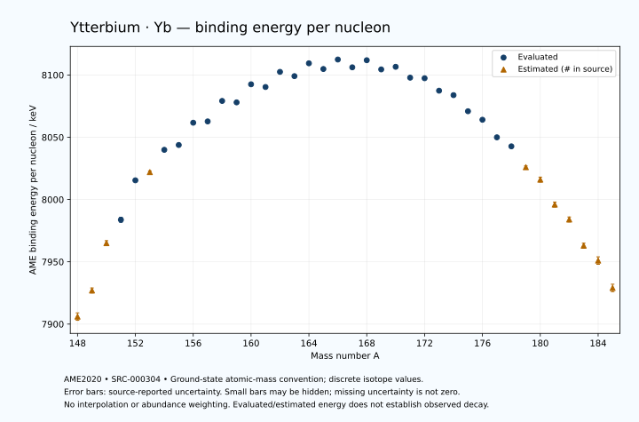

# Ytterbium — Atomic Masses and Reaction Energies

<!-- generated-by: sync-ame2020.mjs -->

**Dated evaluated data · scientific coverage remains partial.** 38 ground-state nuclides from AME2020. Values and uncertainties are transcribed from the retained unrounded analysis files; estimated quantities remain labelled.

- [Parent Ytterbium record](0070-Ytterbium-Yb.md) · [NUBASE states and decays](0070-Ytterbium-Yb-Nuclear-Evaluation.md)
- [Structured data](data/isotopes/0070-Ytterbium-Yb-AME2020-Evaluation.yaml)
- [Original mass table](../../data/catalog/sources/ame2020-mass_1.mas20.txt) · [Original reaction table 1](../../data/catalog/sources/ame2020-rct1.mas20.txt) · [Original reaction table 2](../../data/catalog/sources/ame2020-rct2.mas20.txt)
- [AME2020 methods](https://doi.org/10.1088/1674-1137/abddb0) (SRC-000303) · [Tables and definitions](https://doi.org/10.1088/1674-1137/abddaf) (SRC-000304)

## Reading the data

All table energies and uncertainties are in keV; binding energy is per nucleon. A # replaces a decimal point in the original estimated value. UNKNOWN (*) retains the source's not-calculable entry; it is neither zero nor automatically NOT APPLICABLE. Source lines are one-based in the retained files. Uncertainties remain those published by the evaluation, with no replacement by independent-mass quadrature.

Atomic-mass conventions apply. Qα is total decay energy, not alpha-particle kinetic energy. Positive Q alone does not establish a decay branch, rate or observation. He-4's source Qα of zero is a bookkeeping identity. These tables describe ground-state combinations, not isomer or excited-daughter transitions. Nuclear state and daughter lookups are explicit in the structured companion. The binding quantity follows [Z M(¹H) + N mₙ − M(A,Z)]c²/A; it has not been converted to a bare-nucleus convention.

## Mass and binding table

| Nuclide | N | Atomic mass excess / keV | AME binding per nucleon / keV | Mass-file line |
|---|---:|---|---|---:|
| Yb-148 | 78 | -30230# ± 400# | 7906# ± 3# | 1976 |
| Yb-149 | 79 | -33330# ± 300# | 7927# ± 2# | 1993 |
| Yb-150 | 80 | -38830# ± 300# | 7965# ± 2# | 2010 |
| Yb-151 | 81 | -41542.352 ± 300.492 | 7983.7556 ± 1.9900 | 2027 |
| Yb-152 | 82 | -46270.386 ± 149.708 | 8015.4371 ± 0.9849 | 2044 |
| Yb-153 | 83 | -47160# ± 200# | 8022# ± 1# | 2060 |
| Yb-154 | 84 | -49932.093 ± 17.281 | 8039.9402 ± 0.1122 | 2077 |
| Yb-155 | 85 | -50502.614 ± 16.600 | 8043.8234 ± 0.1071 | 2093 |
| Yb-156 | 86 | -53265.538 ± 9.308 | 8061.7107 ± 0.0597 | 2110 |
| Yb-157 | 87 | -53419.912 ± 10.905 | 8062.7551 ± 0.0695 | 2127 |
| Yb-158 | 88 | -56009.620 ± 7.973 | 8079.1999 ± 0.0505 | 2144 |
| Yb-159 | 89 | -55833.517 ± 17.582 | 8078.0428 ± 0.1106 | 2161 |
| Yb-160 | 90 | -58163.227 ± 5.496 | 8092.5614 ± 0.0343 | 2178 |
| Yb-161 | 91 | -57834.248 ± 15.101 | 8090.3861 ± 0.0938 | 2195 |
| Yb-162 | 92 | -59821.163 ± 15.103 | 8102.5333 ± 0.0932 | 2212 |
| Yb-163 | 93 | -59293.878 ± 15.105 | 8099.1069 ± 0.0927 | 2229 |
| Yb-164 | 94 | -61012.171 ± 15.106 | 8109.4149 ± 0.0921 | 2246 |
| Yb-165 | 95 | -60295.388 ± 26.539 | 8104.8399 ± 0.1608 | 2263 |
| Yb-166 | 96 | -61593.706 ± 7.001 | 8112.4591 ± 0.0422 | 2280 |
| Yb-167 | 97 | -60589.900 ± 3.960 | 8106.2020 ± 0.0237 | 2297 |
| Yb-168 | 98 | -61579.867 ± 0.093 | 8111.8870 ± 0.0006 | 2314 |
| Yb-169 | 99 | -60375.527 ± 0.178 | 8104.5206 ± 0.0011 | 2331 |
| Yb-170 | 100 | -60763.929 ± 0.010 | 8106.6101 ± 0.0003 | 2348 |
| Yb-171 | 101 | -59306.818 ± 0.013 | 8097.8826 ± 0.0003 | 2365 |
| Yb-172 | 102 | -59255.456 ± 0.014 | 8097.4295 ± 0.0003 | 2382 |
| Yb-173 | 103 | -57551.234 ± 0.011 | 8087.4276 ± 0.0003 | 2398 |
| Yb-174 | 104 | -56944.521 ± 0.011 | 8083.8481 ± 0.0003 | 2414 |
| Yb-175 | 105 | -54695.556 ± 0.071 | 8070.9253 ± 0.0005 | 2429 |
| Yb-176 | 106 | -53491.322 ± 0.014 | 8064.0853 ± 0.0003 | 2444 |
| Yb-177 | 107 | -50986.404 ± 0.220 | 8049.9741 ± 0.0013 | 2459 |
| Yb-178 | 108 | -49677.139 ± 6.588 | 8042.7386 ± 0.0370 | 2474 |
| Yb-179 | 109 | -46640# ± 200# | 8026# ± 1# | 2489 |
| Yb-180 | 110 | -44720# ± 300# | 8016# ± 2# | 2504 |
| Yb-181 | 111 | -41088# ± 298# | 7996# ± 2# | 2518 |
| Yb-182 | 112 | -38900# ± 400# | 7984# ± 2# | 2532 |
| Yb-183 | 113 | -35000# ± 400# | 7963# ± 2# | 2545 |
| Yb-184 | 114 | -32600# ± 503# | 7951# ± 3# | 2558 |
| Yb-185 | 115 | -28480# ± 500# | 7929# ± 3# | 2572 |

## Q-values and separation energies

| Nuclide | Qβ− / keV | Qα / keV | S₂n / keV | S₂p / keV | Reaction-file line |
|---|---|---|---|---|---:|
| Yb-148 | UNKNOWN (*) | 3953# ± 445# | UNKNOWN (*) | 486# ± 400# | 1975 |
| Yb-149 | UNKNOWN (*) | 3485# ± 361# | UNKNOWN (*) | 1300# ± 302# | 1992 |
| Yb-150 | -14059# ± 424# | 3067# ± 300# | 24743# ± 500# | 1929# ± 300# | 2009 |
| Yb-151 | -11242# ± 425# | 2640.5464 ± 302.9096 | 24355# ± 425# | 2378.6732 ± 301.7889 | 2026 |
| Yb-152 | -12848# ± 246# | 2783.6948 ± 150.0587 | 23583# ± 335# | 3017.0055 ± 150.6927 | 2043 |
| Yb-153 | -8784# ± 250# | 4157# ± 202# | 21760# ± 361# | 3471# ± 201# | 2059 |
| Yb-154 | -10265# ± 201# | 5474.3142 ± 1.7293 | 19804.3427 ± 150.7026 | 4009.8166 ± 19.4035 | 2076 |
| Yb-155 | -7957.5578 ± 25.4153 | 5338.7604 ± 2.0739 | 19486# ± 201# | 4613.8742 ± 19.0200 | 2092 |
| Yb-156 | -9565.9880 ± 54.9162 | 4809.7648 ± 3.5359 | 19476.0810 ± 19.6256 | 5238.5059 ± 10.5235 | 2109 |
| Yb-157 | -6980.0942 ± 14.2406 | 4621.8539 ± 5.8580 | 19059.9343 ± 19.8612 | 5788.6822 ± 12.3428 | 2126 |
| Yb-158 | -8797.4201 ± 16.8655 | 4170.4374 ± 7.0306 | 18886.7190 ± 12.2366 | 6375.8799 ± 25.8848 | 2143 |
| Yb-159 | -6124.9081 ± 41.5648 | 3950.7391 ± 18.4759 | 18556.2411 ± 20.5647 | 6997.8115 ± 31.8055 | 2160 |
| Yb-160 | -7893.2846 ± 57.0863 | 3623.5400 ± 25.2348 | 18296.2424 ± 9.6838 | 7437.3537 ± 25.8114 | 2177 |
| Yb-161 | -5271.8989 ± 31.7640 | 3154.4838 ± 30.5043 | 18143.3671 ± 22.9849 | 7851.0700 ± 15.5007 | 2194 |
| Yb-162 | -6989.4042 ± 76.5406 | 3057.7361 ± 29.3958 | 17800.5726 ± 16.0716 | 8334.9290 ± 28.5653 | 2211 |
| Yb-163 | -4502.4636 ± 31.7657 | 2842.3261 ± 15.5038 | 17602.2663 ± 21.1452 | 8670.5219 ± 17.4578 | 2228 |
| Yb-164 | -6369.7952 ± 31.7666 | 2627.0899 ± 28.5672 | 17333.6436 ± 21.1452 | 9255.9024 ± 15.1133 | 2245 |
| Yb-165 | -3853.1403 ± 35.4324 | 2480.9947 ± 27.9519 | 17144.1458 ± 30.5363 | 9705.9172 ± 26.9395 | 2262 |
| Yb-166 | -5572.7197 ± 30.6189 | 2315.5881 ± 7.0411 | 16724.1719 ± 16.6496 | 10229.0755 ± 7.0356 | 2279 |
| Yb-167 | -3063.6190 ± 37.4696 | 2152.5966 ± 6.0854 | 16437.1486 ± 26.8328 | 10646.4899 ± 4.0518 | 2296 |
| Yb-168 | -4507.0351 ± 37.9735 | 1937.7907 ± 0.7073 | 16128.7962 ± 7.0000 | 11233.6641 ± 0.3220 | 2313 |
| Yb-169 | -2293.0000 ± 3.0000 | 1720.9095 ± 0.9329 | 15928.2630 ± 3.9633 | 11664.2136 ± 0.3111 | 2330 |
| Yb-170 | -3457.6950 ± 16.8430 | 1735.3000 ± 0.3335 | 15326.6983 ± 0.0929 | 12352.6397 ± 0.2614 | 2347 |
| Yb-171 | -1478.3526 ± 1.8621 | 1557.5217 ± 0.2857 | 15073.9270 ± 0.1785 | 12963.5971 ± 0.3039 | 2364 |
| Yb-172 | -2519.3805 ± 2.3360 | 1308.8590 ± 0.2618 | 14634.1637 ± 0.0147 | 13725.8847 ± 1.3870 | 2381 |
| Yb-173 | -670.2201 ± 1.5674 | 945.0130 ± 0.3038 | 14387.0523 ± 0.0145 | 14411.3541 ± 1.4080 | 2397 |
| Yb-174 | -1374.2287 ± 1.5675 | 738.0772 ± 1.3870 | 13831.7004 ± 0.0150 | 15039.8845 ± 3.9618 | 2413 |
| Yb-175 | 470.1219 ± 1.2068 | 597.3499 ± 1.4098 | 13286.9584 ± 0.0711 | 15619# ± 196# | 2428 |
| Yb-176 | -108.9895 ± 1.2124 | 566.3400 ± 3.9619 | 12689.4379 ± 0.0155 | 16120# ± 298# | 2443 |
| Yb-177 | 1397.4983 ± 1.2406 | 243# ± 196# | 12433.4840 ± 0.2314 | 16912# ± 401# | 2458 |
| Yb-178 | 660.7415 ± 6.9617 | -153# ± 298# | 12328.4527 ± 6.5876 | 17624# ± 401# | 2473 |
| Yb-179 | 2419# ± 200# | -413# ± 448# | 11796# ± 200# | 18360# ± 541# | 2488 |
| Yb-180 | 1956# ± 308# | -514# ± 500# | 11186# ± 300# | 19038# ± 667# | 2503 |
| Yb-181 | 3709# ± 324# | -655# ± 585# | 10591# ± 359# | 19587# ± 582# | 2517 |
| Yb-182 | 2870# ± 447# | -1065# ± 718# | 10323# ± 500# | 20298# ± 640# | 2531 |
| Yb-183 | 4716# ± 408# | -1345# ± 640# | 10054# ± 499# | UNKNOWN (*) | 2544 |
| Yb-184 | 3700# ± 541# | -1846# ± 709# | 9843# ± 642# | UNKNOWN (*) | 2557 |
| Yb-185 | 5480# ± 583# | UNKNOWN (*) | 9623# ± 640# | UNKNOWN (*) | 2571 |

## Additional decay-energy combinations

| Nuclide | Q₂β− / keV | Q₄β− / keV | Qεp / keV | Qβ−n / keV | Part 1 / part 2 line |
|---|---|---|---|---|---|
| Yb-148 | UNKNOWN (*) | UNKNOWN (*) | 9089# ± 401# | UNKNOWN (*) | 1975 / 2003 |
| Yb-149 | UNKNOWN (*) | UNKNOWN (*) | 10860# ± 300# | UNKNOWN (*) | 1992 / 2021 |
| Yb-150 | UNKNOWN (*) | UNKNOWN (*) | 7622# ± 301# | UNKNOWN (*) | 2009 / 2038 |
| Yb-151 | UNKNOWN (*) | UNKNOWN (*) | 8999.9999 ± 300.0000 | -24842# ± 425# | 2026 / 2055 |
| Yb-152 | UNKNOWN (*) | UNKNOWN (*) | 4706.9329 ± 150.6117 | -24041# ± 335# | 2043 / 2072 |
| Yb-153 | -19859# ± 361# | UNKNOWN (*) | 6052# ± 200# | -21809# ± 280# | 2059 / 2089 |
| Yb-154 | -17202# ± 300# | UNKNOWN (*) | 3245.6181 ± 19.5991 | -19627.9487 ± 151.0095 | 2076 / 2106 |
| Yb-155 | -16193# ± 300# | UNKNOWN (*) | 4813.3889 ± 17.3253 | -18907# ± 201# | 2092 / 2122 |
| Yb-156 | -15446.0232 ± 150.0292 | UNKNOWN (*) | 1654.6634 ± 11.0904 | -18791.7996 ± 21.3755 | 2109 / 2139 |
| Yb-157 | -14565# ± 201# | -33730# ± 400# | 3502.7996 ± 26.8762 | -17791.6805 ± 55.2093 | 2126 / 2157 |
| Yb-158 | -13907.2211 ± 19.0650 | -32317# ± 300# | 115.0562 ± 27.6777 | -17641.1207 ± 14.4258 | 2143 / 2174 |
| Yb-159 | -12980.9111 ± 24.3267 | -30400# ± 300# | 2181.3271 ± 30.7431 | -16692.6347 ± 23.1653 | 2160 / 2191 |
| Yb-160 | -12224.4796 ± 11.0100 | -28834.1538 ± 149.9112 | -891.0777 ± 6.5935 | -16525.9359 ± 38.0621 | 2177 / 2208 |
| Yb-161 | -11518.4308 ± 27.8750 | -27327# ± 201# | 940.9573 ± 28.5643 | -15635.6239 ± 58.7935 | 2194 / 2226 |
| Yb-162 | -10652.7375 ± 17.4323 | -25821.9466 ± 23.2141 | -1908.8359 ± 17.4562 | -15330.1321 ± 31.7648 | 2211 / 2243 |
| Yb-163 | -10024.5580 ± 29.8040 | -24385.4396 ± 60.3469 | -248.6388 ± 15.1115 | -14533.4372 ± 76.5410 | 2228 / 2260 |
| Yb-164 | -9193.8146 ± 21.8685 | -22776.6157 ± 17.9159 | -3133.7290 ± 15.7879 | -14292.0742 ± 31.7666 | 2245 / 2277 |
| Yb-165 | -8659.8753 ± 38.5387 | -21434.0717 ± 36.9820 | -1641.7858 ± 26.5484 | -13724.3304 ± 38.5387 | 2262 / 2295 |
| Yb-166 | -7734.7175 ± 28.8084 | -19706.2356 ± 11.7711 | -4361.3250 ± 7.0603 | -13222.7770 ± 27.4468 | 2279 / 2312 |
| Yb-167 | -7122.1388 ± 28.2240 | -18496.6882 ± 19.1178 | -2954.7268 ± 3.9588 | -12640.2316 ± 30.0697 | 2296 / 2329 |
| Yb-168 | -6219.3091 ± 27.9450 | -16686.9363 ± 13.2590 | -5579.5820 ± 0.2715 | -12124.9034 ± 37.2599 | 2313 / 2346 |
| Yb-169 | -5658.6321 ± 27.9454 | -15457.6607 ± 15.4369 | -4675.2670 ± 0.2890 | -11374.0137 ± 37.9738 | 2330 / 2364 |
| Yb-170 | -4510.0684 ± 27.9448 | -13473.1243 ± 13.1953 | -7131.7367 ± 0.3036 | -10752.7197 ± 3.0053 | 2347 / 2381 |
| Yb-171 | -3875.4670 ± 28.8763 | -12220.7227 ± 27.9448 | -6488.2754 ± 1.3869 | -10071.9024 ± 16.8430 | 2364 / 2398 |
| Yb-172 | -2853.2248 ± 24.4282 | -10158.2652 ± 27.9448 | -8826.6052 ± 1.4081 | -9498.3089 ± 1.8621 | 2381 / 2415 |
| Yb-173 | -2139.4445 ± 27.9448 | -8823.8462 ± 27.9448 | -8357.6270 ± 3.9619 | -8886.4764 ± 2.3360 | 2397 / 2432 |
| Yb-174 | -1099.9376 ± 2.2593 | -6717.4272 ± 27.9448 | -10579# ± 196# | -8134.8246 ± 1.5675 | 2413 / 2448 |
| Yb-175 | -213.7935 ± 2.2825 | -5062.7562 ± 27.9449 | -10035# ± 298# | -7196.5826 ± 1.5673 | 2428 / 2463 |
| Yb-176 | 1085.1052 ± 1.4824 | -2849.7141 ± 27.9448 | -12128# ± 401# | -6396.9621 ± 1.2070 | 2443 / 2478 |
| Yb-177 | 1894.3409 ± 1.4274 | -1284.6735 ± 27.9457 | -11645# ± 401# | -5675.3894 ± 1.2322 | 2458 / 2493 |
| Yb-178 | 2758.2266 ± 6.7379 | 729.9266 ± 16.5650 | -14108# ± 503# | -5364.5544 ± 6.6998 | 2473 / 2509 |
| Yb-179 | 3823# ± 200# | 2655# ± 201# | -13669# ± 629# | -4373# ± 200# | 2488 / 2524 |
| Yb-180 | 5059# ± 300# | 4916# ± 300# | -15930# ± 583# | -3732# ± 300# | 2503 / 2539 |
| Yb-181 | 6315# ± 298# | 7146# ± 298# | -15197# ± 582# | -2483# ± 306# | 2517 / 2553 |
| Yb-182 | 7150# ± 400# | 9346# ± 400# | UNKNOWN (*) | -2174# ± 419# | 2531 / 2567 |
| Yb-183 | 8284# ± 401# | 11366# ± 400# | UNKNOWN (*) | -1301# ± 447# | 2544 / 2581 |
| Yb-184 | 8899# ± 505# | 13105# ± 503# | UNKNOWN (*) | -956# ± 509# | 2557 / 2594 |
| Yb-185 | 9839# ± 504# | 14907# ± 500# | UNKNOWN (*) | -251# ± 539# | 2571 / 2608 |

## Single-nucleon separation and reaction energies

| Nuclide | Sₙ / keV | Sₚ / keV | Q(d,α) / keV | Q(p,α) / keV | Q(n,α) / keV | Part 2 line |
|---|---|---|---|---|---|---:|
| Yb-148 | UNKNOWN (*) | 1544# ± 400# | 11536# ± 447# | 2217# ± 445# | 14657# ± 447# | 2003 |
| Yb-149 | 11171# ± 500# | 1854# ± 300# | 13355# ± 300# | 2590# ± 361# | 16639# ± 300# | 2021 |
| Yb-150 | 13572# ± 424# | 2179# ± 361# | 10646# ± 300# | 2008# ± 300# | 13424# ± 302# | 2038 |
| Yb-151 | 10783# ± 425# | 2340# ± 359# | 13109# ± 361# | 2086.7373 ± 300.6670 | 15583.0473 ± 300.6670 | 2055 |
| Yb-152 | 12799.3524 ± 335.7205 | 2787.7440 ± 150.9570 | 10931# ± 246# | 2534# ± 250# | 13117.6367 ± 152.2943 | 2072 |
| Yb-153 | 8961# ± 250# | 2728# ± 207# | 14323# ± 201# | 4195# ± 280# | 16318# ± 201# | 2089 |
| Yb-154 | 10844# ± 201# | 3248.4543 ± 21.0202 | 12498.9928 ± 56.7231 | 5703.5758 ± 8.7610 | 13980.5996 ± 23.8723 | 2106 |
| Yb-155 | 8641.8392 ± 23.9623 | 3364.4427 ± 21.9831 | 14180.8027 ± 20.4708 | 6081.7198 ± 56.5193 | 15644.0066 ± 18.8020 | 2122 |
| Yb-156 | 10834.2418 ± 19.0313 | 3928.5875 ± 13.5948 | 11872.4117 ± 17.1522 | 5571.1272 ± 12.3720 | 12847.5465 ± 12.4737 | 2139 |
| Yb-157 | 8225.6925 ± 13.7282 | 3874.4662 ± 17.5912 | 13916.8161 ± 14.6866 | 5871.2854 ± 18.0473 | 14831.4639 ± 11.8412 | 2157 |
| Yb-158 | 10661.0265 ± 13.3914 | 4589.3128 ± 29.0600 | 11535.6035 ± 16.3358 | 5480.3558 ± 12.4870 | 11845.9537 ± 9.8440 | 2174 |
| Yb-159 | 7895.2146 ± 19.1878 | 4419.2880 ± 30.7431 | 13586.5687 ± 33.0155 | 5864.9551 ± 22.6304 | 14024.5678 ± 30.2573 | 2191 |
| Yb-160 | 10401.0278 ± 18.4205 | 4881.7939 ± 28.4801 | 11250.7803 ± 25.8114 | 5410.1072 ± 28.4801 | 10896.8231 ± 27.0686 | 2208 |
| Yb-161 | 7742.3393 ± 16.0699 | 4822.1822 ± 36.0056 | 13446.9629 ± 31.7640 | 5733.0072 ± 29.3949 | 13115.9694 ± 29.3949 | 2226 |
| Yb-162 | 10058.2332 ± 21.1452 | 5211.4197 ± 31.7648 | 11190.6807 ± 36.0063 | 5613.2959 ± 31.7648 | 10386.3592 ± 15.5022 | 2243 |
| Yb-163 | 7544.0330 ± 21.1452 | 5105.3671 ± 30.1136 | 13315.6434 ± 31.7657 | 5871.2139 ± 36.0071 | 12416.7004 ± 28.5663 | 2260 |
| Yb-164 | 9789.6105 ± 21.1452 | 5572.7290 ± 16.0704 | 11176.1186 ± 30.1145 | 5750.5991 ± 31.7666 | 9835.5299 ± 17.4593 | 2277 |
| Yb-165 | 7354.5352 ± 30.5372 | 5675.4160 ± 36.4642 | 13143.8319 ± 27.1060 | 6046.1496 ± 37.1936 | 11685.2248 ± 26.5498 | 2295 |
| Yb-166 | 9369.6367 ± 27.4468 | 5952.6533 ± 7.1944 | 11026.0435 ± 25.9678 | 5998.7615 ± 8.9118 | 9220.1085 ± 8.3917 | 2312 |
| Yb-167 | 7067.5119 ± 8.0427 | 5992.3934 ± 12.2068 | 13050.9310 ± 4.2274 | 6183.0978 ± 25.3176 | 10999.0750 ± 4.0139 | 2329 |
| Yb-168 | 9061.2843 ± 3.9604 | 6325.7212 ± 1.2595 | 11017.4184 ± 11.5515 | 6214.2129 ± 1.6610 | 8587.8881 ± 0.9204 | 2346 |
| Yb-169 | 6866.9786 ± 0.1519 | 6352.1196 ± 1.6850 | 12878.3964 ± 1.2686 | 6375.0060 ± 11.5525 | 10195.0197 ± 0.3561 | 2364 |
| Yb-170 | 8459.7197 ± 0.1780 | 6778.2457 ± 0.7383 | 11259.2568 ± 1.6770 | 6643.2429 ± 1.2579 | 8171.7291 ± 0.2854 | 2381 |
| Yb-171 | 6614.2073 ± 0.0139 | 6800.4751 ± 0.7320 | 12678.6431 ± 0.7384 | 6869.6157 ± 1.6771 | 9328.8153 ± 0.2617 | 2398 |
| Yb-172 | 8019.9563 ± 0.0167 | 7334.1562 ± 0.9716 | 11250.6647 ± 0.7320 | 6883.2530 ± 0.7385 | 7312.1090 ± 0.3039 | 2415 |
| Yb-173 | 6367.0959 ± 0.0152 | 7466.6514 ± 5.4814 | 12369.8441 ± 0.9716 | 7108.1350 ± 0.7320 | 8202.6817 ± 1.3870 | 2432 |
| Yb-174 | 7464.6045 ± 0.0126 | 7977.4245 ± 4.4000 | 11139.8403 ± 5.4814 | 7129.8058 ± 0.9716 | 6419.7038 ± 1.4080 | 2448 |
| Yb-175 | 5822.3539 ± 0.0700 | 8120.0069 ± 44.7214 | 12271.3178 ± 4.4006 | 7542.0526 ± 5.4818 | 7433.4240 ± 3.9625 | 2463 |
| Yb-176 | 6867.0841 ± 0.0717 | 8469.7371 ± 50.0001 | 11084.0052 ± 44.7214 | 7628.8000 ± 4.4000 | 5809# ± 196# | 2478 |
| Yb-177 | 5566.4000 ± 0.2200 | 8904.0530 ± 100.0002 | 12034.9591 ± 50.0005 | 7742.1715 ± 44.7219 | 6609# ± 298# | 2493 |
| Yb-178 | 6762.0528 ± 6.5913 | 9397# ± 200# | 10404.9904 ± 100.2167 | 7497.4726 ± 50.4322 | 4621# ± 401# | 2509 |
| Yb-179 | 5034# ± 200# | 9688# ± 361# | 11640# ± 283# | 7595# ± 224# | 5637# ± 448# | 2524 |
| Yb-180 | 6152# ± 361# | 10109# ± 500# | 10231# ± 424# | 7713# ± 361# | 3784# ± 586# | 2539 |
| Yb-181 | 4439# ± 423# | 10207# ± 499# | 11523# ± 499# | 8016# ± 423# | 4818# ± 667# | 2553 |
| Yb-182 | 5883# ± 499# | 10749# ± 640# | 9981# ± 565# | 7864# ± 565# | 2826# ± 640# | 2567 |
| Yb-183 | 4171# ± 565# | 10799# ± 640# | 11150# ± 640# | 8034# ± 565# | 3826# ± 640# | 2581 |
| Yb-184 | 5672# ± 642# | UNKNOWN (*) | 9600# ± 709# | 7703# ± 709# | UNKNOWN (*) | 2594 |
| Yb-185 | 3951# ± 709# | UNKNOWN (*) | UNKNOWN (*) | 7874# ± 707# | UNKNOWN (*) | 2608 |

Qβ− comes from the mass-file line in the first table. Qα, S₂n, S₂p, Q₂β−, Qεp and Qβ−n come from reaction part 1; Q₄β− and the last table come from part 2. Qεp is electron-capture/proton energy balance; Qβ−n is beta-minus/neutron energy balance. These are evaluated mass combinations, not observations of decay modes, cross sections or reaction rates. Light-nuclide zero entries can be bookkeeping identities, without a physical A=0 residual. Definitions and original source strings are retained in the structured data.

## Binding-energy chart

Discrete source values and source-reported uncertainties. No interpolation, natural-abundance weighting or observed-decay claim is implied. This quantitative chart supplements the 22 separate illustrative panels.

## Remaining review

Later measurements, state-specific decay branches, isomer Q-values, reaction rates, applicability and full claim-level review remain open. Existing authored values retain their own provenance; this companion does not overwrite them.
