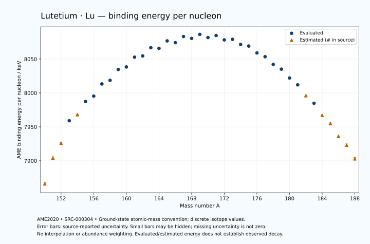

# Lutetium — Atomic Masses and Reaction Energies

<!-- generated-by: sync-ame2020.mjs -->

**Dated evaluated data · scientific coverage remains partial.** 39 ground-state nuclides from AME2020. Values and uncertainties are transcribed from the retained unrounded analysis files; estimated quantities remain labelled.

- [Parent Lutetium record](0071-Lutetium-Lu.md) · [NUBASE states and decays](0071-Lutetium-Lu-Nuclear-Evaluation.md)
- [Structured data](data/isotopes/0071-Lutetium-Lu-AME2020-Evaluation.yaml)
- [Original mass table](../../data/catalog/sources/ame2020-mass_1.mas20.txt) · [Original reaction table](../../data/catalog/sources/ame2020-rct1.mas20.txt)
- [AME2020 methods](https://doi.org/10.1088/1674-1137/abddb0) (SRC-000303) · [Tables and definitions](https://doi.org/10.1088/1674-1137/abddaf) (SRC-000304)

## Reading the data

All table energies and uncertainties are in keV; binding energy is per nucleon. A # replaces a decimal point in the original estimated value. UNKNOWN (*) retains the source's not-calculable entry; it is neither zero nor automatically NOT APPLICABLE. Source lines are one-based in the retained files. Uncertainties remain those published by the evaluation, with no replacement by independent-mass quadrature.

Atomic-mass conventions apply. Qα is total decay energy, not alpha-particle kinetic energy. Positive Q alone does not establish a decay branch, rate or observation. He-4's source Qα of zero is a bookkeeping identity. These tables describe ground-state combinations, not isomer or excited-daughter transitions. Nuclear state and daughter lookups are explicit in the structured companion. The binding quantity follows [Z M(¹H) + N mₙ − M(A,Z)]c²/A; it has not been converted to a bare-nucleus convention.

## Mass and binding table

| Nuclide | N | Atomic mass excess / keV | AME binding per nucleon / keV | Mass-file line |
|---|---:|---|---|---:|
| Lu-150 | 79 | -24771# ± 300# | 7866# ± 2# | 2011 |
| Lu-151 | 80 | -30300# ± 300# | 7904# ± 2# | 2028 |
| Lu-152 | 81 | -33422# ± 196# | 7926# ± 1# | 2045 |
| Lu-153 | 82 | -38375.462 ± 150.017 | 7959.0882 ± 0.9805 | 2061 |
| Lu-154 | 83 | -39667# ± 201# | 7968# ± 1# | 2078 |
| Lu-155 | 84 | -42545.056 ± 19.245 | 7987.4369 ± 0.1242 | 2094 |
| Lu-156 | 85 | -43699.550 ± 54.122 | 7995.3752 ± 0.3469 | 2111 |
| Lu-157 | 86 | -46439.818 ± 12.074 | 8013.3128 ± 0.0769 | 2128 |
| Lu-158 | 87 | -47212.200 ± 15.125 | 8018.5685 ± 0.0957 | 2145 |
| Lu-159 | 88 | -49708.609 ± 37.663 | 8034.6009 ± 0.2369 | 2162 |
| Lu-160 | 89 | -50269.942 ± 56.821 | 8038.3387 ± 0.3551 | 2179 |
| Lu-161 | 90 | -52562.349 ± 27.945 | 8052.7821 ± 0.1736 | 2196 |
| Lu-162 | 91 | -52831.759 ± 75.036 | 8054.5596 ± 0.4632 | 2213 |
| Lu-163 | 92 | -54791.415 ± 27.945 | 8066.6848 ± 0.1714 | 2230 |
| Lu-164 | 93 | -54642.376 ± 27.945 | 8065.8043 ± 0.1704 | 2247 |
| Lu-165 | 94 | -56442.248 ± 26.539 | 8076.7460 ± 0.1608 | 2264 |
| Lu-166 | 95 | -56020.987 ± 29.808 | 8074.1756 ± 0.1796 | 2281 |
| Lu-167 | 96 | -57526.281 ± 37.260 | 8083.1722 ± 0.2231 | 2298 |
| Lu-168 | 97 | -57072.832 ± 37.973 | 8080.4026 ± 0.2260 | 2315 |
| Lu-169 | 98 | -58082.527 ± 3.005 | 8086.3233 ± 0.0178 | 2332 |
| Lu-170 | 99 | -57306.234 ± 16.843 | 8081.6686 ± 0.0991 | 2349 |
| Lu-171 | 100 | -57828.465 ± 1.862 | 8084.6621 ± 0.0109 | 2366 |
| Lu-172 | 101 | -56736.076 ± 2.336 | 8078.2334 ± 0.0136 | 2383 |
| Lu-173 | 102 | -56881.014 ± 1.567 | 8079.0312 ± 0.0091 | 2399 |
| Lu-174 | 103 | -55570.292 ± 1.567 | 8071.4540 ± 0.0090 | 2415 |
| Lu-175 | 104 | -55165.678 ± 1.207 | 8069.1412 ± 0.0069 | 2430 |
| Lu-176 | 105 | -53382.333 ± 1.212 | 8059.0209 ± 0.0069 | 2445 |
| Lu-177 | 106 | -52383.903 ± 1.221 | 8053.4495 ± 0.0069 | 2460 |
| Lu-178 | 107 | -50337.881 ± 2.251 | 8042.0554 ± 0.0127 | 2475 |
| Lu-179 | 108 | -49059.013 ± 5.150 | 8035.0744 ± 0.0288 | 2490 |
| Lu-180 | 109 | -46676.476 ± 70.725 | 8022.0394 ± 0.3929 | 2505 |
| Lu-181 | 110 | -44797.414 ± 125.752 | 8011.9301 ± 0.6948 | 2519 |
| Lu-182 | 111 | -41770# ± 200# | 7996# ± 1# | 2533 |
| Lu-183 | 112 | -39716.114 ± 80.108 | 7984.8125 ± 0.4378 | 2546 |
| Lu-184 | 113 | -36300# ± 200# | 7967# ± 1# | 2559 |
| Lu-185 | 114 | -33960# ± 300# | 7955# ± 2# | 2573 |
| Lu-186 | 115 | -30320# ± 400# | 7936# ± 2# | 2586 |
| Lu-187 | 116 | -27770# ± 400# | 7923# ± 2# | 2600 |
| Lu-188 | 117 | -23820# ± 400# | 7903# ± 2# | 2614 |

## Q-values and separation energies

| Nuclide | Qβ− / keV | Qα / keV | S₂n / keV | S₂p / keV | Reaction-file line |
|---|---|---|---|---|---:|
| Lu-150 | UNKNOWN (*) | 3859# ± 361# | UNKNOWN (*) | 584# ± 300# | 2010 |
| Lu-151 | UNKNOWN (*) | 3249# ± 300# | UNKNOWN (*) | 938# ± 361# | 2027 |
| Lu-152 | UNKNOWN (*) | 2918# ± 196# | 24793# ± 358# | 1509# ± 277# | 2044 |
| Lu-153 | -11075# ± 335# | 3140# ± 250# | 24218# ± 335# | 2181.7909 ± 151.2634 | 2060 |
| Lu-154 | -6937# ± 361# | 4399# ± 280# | 22387# ± 280# | 2524# ± 208# | 2077 |
| Lu-155 | -8235# ± 301# | 5801.6414 ± 2.2374 | 20312.2301 ± 151.2469 | 3150.3886 ± 22.6628 | 2093 |
| Lu-156 | -5880.0352 ± 139.6908 | 5595.8130 ± 3.2058 | 20176# ± 208# | 3850.3495 ± 56.0077 | 2110 |
| Lu-157 | -7585# ± 201# | 5107.8759 ± 2.8536 | 20037.3979 ± 22.7130 | 4391.8388 ± 15.6063 | 2127 |
| Lu-158 | -5109.8010 ± 14.9373 | 4790.0260 ± 4.5885 | 19655.2869 ± 56.1953 | 4955.7256 ± 20.7956 | 2144 |
| Lu-159 | -6856.0030 ± 41.2456 | 4492.3962 ± 38.9481 | 19411.4273 ± 39.5512 | 5577.2723 ± 46.8981 | 2161 |
| Lu-160 | -4331.1951 ± 57.6165 | 4139.5589 ± 58.5877 | 19200.3779 ± 58.7996 | 6144.6842 ± 62.1664 | 2178 |
| Lu-161 | -6246.5319 ± 36.4805 | 3722.0137 ± 39.5199 | 18996.3763 ± 46.8981 | 6569.8873 ± 39.5199 | 2195 |
| Lu-162 | -3663.3333 ± 75.5679 | 3446.5252 ± 79.1606 | 18704.4530 ± 94.1223 | 7108.6643 ± 81.8458 | 2212 |
| Lu-163 | -5522.0944 ± 37.9611 | 3354.0735 ± 39.5199 | 18371.7015 ± 39.5199 | 7470.6421 ± 39.5199 | 2229 |
| Lu-164 | -2824.0194 ± 32.1083 | 3233.7455 ± 43.0032 | 17953.2526 ± 80.0705 | 7742.8354 ± 38.2094 | 2246 |
| Lu-165 | -4806.7350 ± 38.5387 | 3031.5512 ± 38.5387 | 17793.4691 ± 38.5387 | 8291.7769 ± 27.1060 | 2263 |
| Lu-166 | -2161.9978 ± 40.8585 | 3031.5796 ± 39.5923 | 17521.2474 ± 40.8585 | 8689.9860 ± 38.9079 | 2280 |
| Lu-167 | -4058.5198 ± 46.5747 | 2777.2156 ± 37.6657 | 17226.6699 ± 45.7450 | 9174.1991 ± 37.2966 | 2297 |
| Lu-168 | -1712.2740 ± 47.1476 | 2411.1956 ± 45.4676 | 17194.4808 ± 48.2751 | 9764.2957 ± 39.6916 | 2314 |
| Lu-169 | -3365.6321 ± 28.1060 | 2422.5813 ± 3.4325 | 16698.8820 ± 37.3808 | 10117.3528 ± 3.2572 | 2331 |
| Lu-170 | -1052.3734 ± 32.6282 | 2155.3283 ± 20.4238 | 16376.0384 ± 41.5412 | 10571.7973 ± 16.9263 | 2348 |
| Lu-171 | -2397.1144 ± 28.9363 | 2289.7352 ± 2.2468 | 15888.5745 ± 3.5354 | 11131.7535 ± 2.0028 | 2365 |
| Lu-172 | -333.8443 ± 24.5396 | 2151.3869 ± 2.8753 | 15572.4782 ± 17.0043 | 11518.7039 ± 2.4476 | 2382 |
| Lu-173 | -1469.2244 ± 27.9887 | 1968.7241 ± 1.7322 | 15195.1847 ± 1.9767 | 12248.6850 ± 1.8441 | 2398 |
| Lu-174 | 274.2911 ± 2.1686 | 1800.1062 ± 1.7294 | 14976.8523 ± 2.2361 | 12774.6802 ± 5.7011 | 2414 |
| Lu-175 | -683.9154 ± 1.9516 | 1619.6770 ± 1.5494 | 14427.3004 ± 1.0001 | 13487.5533 ± 4.5626 | 2429 |
| Lu-176 | 1194.0947 ± 0.8744 | 1566.3050 ± 5.6139 | 13954.6772 ± 1.0112 | 14095.7545 ± 44.7378 | 2444 |
| Lu-177 | 496.8425 ± 0.7921 | 1447.2487 ± 4.5662 | 13360.8604 ± 0.2161 | 14651.2884 ± 50.0149 | 2459 |
| Lu-178 | 2097.4851 ± 2.0569 | 1101.7242 ± 44.7780 | 13098.1837 ± 1.8982 | 15544.5002 ± 100.0253 | 2474 |
| Lu-179 | 1404.0231 ± 5.0672 | 826.6276 ± 50.2645 | 12817.7464 ± 5.0029 | 16067# ± 200# | 2489 |
| Lu-180 | 3103.0000 ± 70.7107 | 269.9306 ± 122.4827 | 12481.2315 ± 70.7406 | 17014# ± 308# | 2504 |
| Lu-181 | 2605.5435 ± 125.7598 | 347# ± 236# | 11881.0375 ± 125.8571 | 17475# ± 419# | 2518 |
| Lu-182 | 4280# ± 200# | 45# ± 361# | 11236# ± 212# | 18178# ± 447# | 2532 |
| Lu-183 | 3567.4325 ± 85.5564 | -241# ± 408# | 11061.3358 ± 149.1002 | 18854# ± 507# | 2545 |
| Lu-184 | 5199# ± 204# | -555# ± 447# | 10673# ± 283# | 19388# ± 539# | 2558 |
| Lu-185 | 4359# ± 307# | -946# ± 583# | 10387# ± 310# | UNKNOWN (*) | 2572 |
| Lu-186 | 6104# ± 403# | -1255# ± 640# | 10162# ± 447# | UNKNOWN (*) | 2585 |
| Lu-187 | 5230# ± 447# | UNKNOWN (*) | 9952# ± 500# | UNKNOWN (*) | 2599 |
| Lu-188 | 7009# ± 500# | UNKNOWN (*) | 9643# ± 565# | UNKNOWN (*) | 2613 |

Qβ− comes from the mass-file line in the first table. The other three columns come from the reaction-file line. Definitions and original source strings are retained in the structured data.

## Binding-energy chart

Discrete source values and source-reported uncertainties. No interpolation, natural-abundance weighting or observed-decay claim is implied. This quantitative chart supplements the 22 separate illustrative panels.

## Remaining review

Later measurements, state-specific decay branches, isomer Q-values, additional reaction channels and full claim-level review remain open. Existing authored values retain their own provenance; this companion does not overwrite them.
