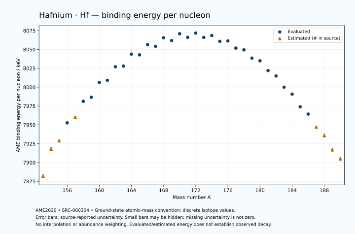

# Hafnium — Atomic Masses and Reaction Energies

<!-- generated-by: sync-ame2020.mjs -->

**Dated evaluated data · scientific coverage remains partial.** 38 ground-state nuclides from AME2020. Values and uncertainties are transcribed from the retained unrounded analysis files; estimated quantities remain labelled.

- [Parent Hafnium record](0072-Hafnium-Hf.md) · [NUBASE states and decays](0072-Hafnium-Hf-Nuclear-Evaluation.md)
- [Structured data](data/isotopes/0072-Hafnium-Hf-AME2020-Evaluation.yaml)
- [Original mass table](../../data/catalog/sources/ame2020-mass_1.mas20.txt) · [Original reaction table](../../data/catalog/sources/ame2020-rct1.mas20.txt)
- [AME2020 methods](https://doi.org/10.1088/1674-1137/abddb0) (SRC-000303) · [Tables and definitions](https://doi.org/10.1088/1674-1137/abddaf) (SRC-000304)

## Reading the data

All table energies and uncertainties are in keV; binding energy is per nucleon. A # replaces a decimal point in the original estimated value. UNKNOWN (*) retains the source's not-calculable entry; it is neither zero nor automatically NOT APPLICABLE. Source lines are one-based in the retained files. Uncertainties remain those published by the evaluation, with no replacement by independent-mass quadrature.

Atomic-mass conventions apply. Qα is total decay energy, not alpha-particle kinetic energy. Positive Q alone does not establish a decay branch, rate or observation. He-4's source Qα of zero is a bookkeeping identity. These tables describe ground-state combinations, not isomer or excited-daughter transitions. Nuclear state and daughter lookups are explicit in the structured companion. The binding quantity follows [Z M(¹H) + N mₙ − M(A,Z)]c²/A; it has not been converted to a bare-nucleus convention.

## Mass and binding table

| Nuclide | N | Atomic mass excess / keV | AME binding per nucleon / keV | Mass-file line |
|---|---:|---|---|---:|
| Hf-153 | 81 | -27300# ± 300# | 7882# ± 2# | 2062 |
| Hf-154 | 82 | -32730# ± 300# | 7918# ± 2# | 2079 |
| Hf-155 | 83 | -34310# ± 300# | 7929# ± 2# | 2095 |
| Hf-156 | 84 | -37819.514 ± 149.740 | 7952.6676 ± 0.9599 | 2112 |
| Hf-157 | 85 | -38855# ± 200# | 7960# ± 1# | 2129 |
| Hf-158 | 86 | -42102.399 ± 17.494 | 7981.2764 ± 0.1107 | 2146 |
| Hf-159 | 87 | -42852.606 ± 16.813 | 7986.5610 ± 0.1057 | 2163 |
| Hf-160 | 88 | -45938.747 ± 9.540 | 8006.3791 ± 0.0596 | 2180 |
| Hf-161 | 89 | -46315.817 ± 23.450 | 8009.1245 ± 0.1457 | 2197 |
| Hf-162 | 90 | -49168.426 ± 8.952 | 8027.1171 ± 0.0553 | 2214 |
| Hf-163 | 91 | -49269.320 ± 25.693 | 8028.0072 ± 0.1576 | 2231 |
| Hf-164 | 92 | -51818.356 ± 15.812 | 8043.8142 ± 0.0964 | 2248 |
| Hf-165 | 93 | -51635.513 ± 27.945 | 8042.8728 ± 0.1694 | 2265 |
| Hf-166 | 94 | -53858.989 ± 27.945 | 8056.4386 ± 0.1683 | 2282 |
| Hf-167 | 95 | -53467.761 ± 27.945 | 8054.1850 ± 0.1673 | 2299 |
| Hf-168 | 96 | -55360.557 ± 27.945 | 8065.5536 ± 0.1663 | 2316 |
| Hf-169 | 97 | -54716.895 ± 27.945 | 8061.7791 ± 0.1654 | 2333 |
| Hf-170 | 98 | -56253.860 ± 27.945 | 8070.8762 ± 0.1644 | 2350 |
| Hf-171 | 99 | -55431.351 ± 28.876 | 8066.0687 ± 0.1689 | 2367 |
| Hf-172 | 100 | -56402.232 ± 24.428 | 8071.7439 ± 0.1420 | 2384 |
| Hf-173 | 101 | -55411.790 ± 27.945 | 8066.0164 ± 0.1615 | 2400 |
| Hf-174 | 102 | -55844.583 ± 2.259 | 8068.5341 ± 0.0130 | 2416 |
| Hf-175 | 103 | -54481.763 ± 2.283 | 8060.7625 ± 0.0130 | 2431 |
| Hf-176 | 104 | -54576.428 ± 1.482 | 8061.3604 ± 0.0084 | 2446 |
| Hf-177 | 105 | -52880.745 ± 1.410 | 8051.8365 ± 0.0080 | 2461 |
| Hf-178 | 106 | -52435.366 ± 1.415 | 8049.4438 ± 0.0080 | 2476 |
| Hf-179 | 107 | -50463.036 ± 1.416 | 8038.5474 ± 0.0079 | 2491 |
| Hf-180 | 108 | -49779.476 ± 1.421 | 8034.9319 ± 0.0079 | 2506 |
| Hf-181 | 109 | -47402.958 ± 1.423 | 8022.0030 ± 0.0079 | 2520 |
| Hf-182 | 110 | -46049.636 ± 6.166 | 8014.8381 ± 0.0339 | 2534 |
| Hf-183 | 111 | -43283.547 ± 30.042 | 8000.0315 ± 0.1642 | 2547 |
| Hf-184 | 112 | -41499.453 ± 39.706 | 7990.7228 ± 0.2158 | 2560 |
| Hf-185 | 113 | -38319.804 ± 64.273 | 7973.9711 ± 0.3474 | 2574 |
| Hf-186 | 114 | -36424.214 ± 51.232 | 7964.3032 ± 0.2754 | 2587 |
| Hf-187 | 115 | -33000# ± 200# | 7947# ± 1# | 2601 |
| Hf-188 | 116 | -30830# ± 300# | 7936# ± 2# | 2615 |
| Hf-189 | 117 | -27150# ± 300# | 7917# ± 2# | 2628 |
| Hf-190 | 118 | -24800# ± 400# | 7905# ± 2# | 2641 |

## Q-values and separation energies

| Nuclide | Qβ− / keV | Qα / keV | S₂n / keV | S₂p / keV | Reaction-file line |
|---|---|---|---|---|---:|
| Hf-153 | UNKNOWN (*) | 3605# ± 424# | UNKNOWN (*) | 336# ± 425# | 2061 |
| Hf-154 | UNKNOWN (*) | 3675# ± 424# | UNKNOWN (*) | 1037# ± 335# | 2078 |
| Hf-155 | -10322# ± 424# | 4808# ± 425# | 23152# ± 424# | 1728# ± 361# | 2094 |
| Hf-156 | -11819# ± 335# | 6025.9559 ± 3.0801 | 21232# ± 335# | 2465.3638 ± 150.7341 | 2111 |
| Hf-157 | -9259# ± 250# | 5880.0072 ± 3.0595 | 20688# ± 361# | 2930# ± 201# | 2128 |
| Hf-158 | -10984# ± 201# | 5404.7775 ± 2.7180 | 20425.5211 ± 150.7586 | 3414.8040 ± 19.8129 | 2145 |
| Hf-159 | -8413.4492 ± 25.8909 | 5225.0920 ± 2.6686 | 20140# ± 201# | 4010.6361 ± 20.0397 | 2162 |
| Hf-160 | -10115.0475 ± 55.1472 | 4901.8746 ± 2.5862 | 19978.9839 ± 19.9230 | 4507.0688 ± 12.4135 | 2179 |
| Hf-161 | -7537.2421 ± 33.7278 | 4679.1789 ± 25.0152 | 19605.8474 ± 28.8547 | 5060.2423 ± 29.2934 | 2196 |
| Hf-162 | -9387.0211 ± 63.8938 | 4416.2789 ± 4.8624 | 19372.3147 ± 13.0646 | 5583.1410 ± 10.5042 | 2213 |
| Hf-163 | -6734.6864 ± 45.9217 | 4139.2810 ± 31.1326 | 19096.1391 ± 34.7857 | 6013.0143 ± 29.8021 | 2230 |
| Hf-164 | -8535.5511 ± 32.1083 | 3919.9548 ± 16.7401 | 18792.5665 ± 18.1703 | 6575.1350 ± 21.8659 | 2247 |
| Hf-165 | -5787.6410 ± 31.0668 | 3773.8196 ± 31.7640 | 18508.8285 ± 37.9611 | 6919.5765 ± 31.7657 | 2264 |
| Hf-166 | -7761.2089 ± 39.5199 | 3537.2584 ± 31.7648 | 18183.2690 ± 32.1083 | 7424.7604 ± 31.7666 | 2281 |
| Hf-167 | -5116.6971 ± 39.5199 | 3401.2009 ± 31.7657 | 17974.8850 ± 39.5199 | 7750.3157 ± 38.5387 | 2298 |
| Hf-168 | -6966.6444 ± 39.5199 | 3226.6973 ± 31.7666 | 17644.2046 ± 39.5199 | 8344.7931 ± 28.8084 | 2315 |
| Hf-169 | -4426.4600 ± 39.5199 | 3153.5769 ± 38.5387 | 17391.7697 ± 39.5199 | 8704.9369 ± 28.2240 | 2332 |
| Hf-170 | -6116.1903 ± 39.5199 | 2914.9303 ± 28.8084 | 17035.9390 ± 39.5199 | 9251.9359 ± 27.9450 | 2349 |
| Hf-171 | -3711.0725 ± 40.1840 | 2733.6334 ± 29.1466 | 16857.0921 ± 40.1840 | 9633.7660 ± 28.8769 | 2366 |
| Hf-172 | -5072.2490 ± 37.1167 | 2752.7192 ± 24.4283 | 16291.0073 ± 37.1167 | 10216.2449 ± 24.4282 | 2383 |
| Hf-173 | -3015.2464 ± 39.5199 | 2538.8216 ± 27.9454 | 16123.0747 ± 40.1840 | 10682.9137 ± 27.9448 | 2399 |
| Hf-174 | -4103.8117 ± 28.0360 | 2494.4298 ± 2.2593 | 15584.9877 ± 24.5324 | 11167.0689 ± 2.2593 | 2415 |
| Hf-175 | -2073.1103 ± 28.0379 | 2400.1392 ± 2.2826 | 15212.6094 ± 28.0379 | 11508.4709 ± 2.2826 | 2430 |
| Hf-176 | -3211.0484 ± 30.7750 | 2254.1128 ± 1.4824 | 14874.4807 ± 1.7482 | 12209.8492 ± 1.4823 | 2445 |
| Hf-177 | -1166.0000 ± 3.0000 | 2245.5731 ± 1.4103 | 14541.6183 ± 1.9859 | 12763.1309 ± 1.4103 | 2460 |
| Hf-178 | -1837# ± 52# | 2084.2391 ± 1.4151 | 14001.5741 ± 1.0208 | 13521.9853 ± 1.4152 | 2475 |
| Hf-179 | -105.5801 ± 0.4088 | 1807.6045 ± 1.4159 | 13724.9271 ± 0.1924 | 14054.5739 ± 1.4330 | 2490 |
| Hf-180 | -845.8453 ± 2.3472 | 1286.9306 ± 1.4215 | 13486.7464 ± 0.1692 | 14680.2790 ± 6.7392 | 2505 |
| Hf-181 | 1036.1061 ± 1.9298 | 1158.5306 ± 1.4401 | 13082.5579 ± 0.1664 | 15341# ± 200# | 2519 |
| Hf-182 | 381.0486 ± 6.3027 | 1202.5871 ± 9.0231 | 12412.7962 ± 6.0000 | 15907# ± 300# | 2533 |
| Hf-183 | 2010.0000 ± 30.0000 | 931# ± 203# | 12023.2248 ± 30.0628 | 16773# ± 300# | 2546 |
| Hf-184 | 1340.0000 ± 30.0000 | 796# ± 303# | 11592.4527 ± 40.1803 | 17177# ± 402# | 2559 |
| Hf-185 | 3074.5667 ± 65.8147 | 343# ± 305# | 11178.8939 ± 70.9476 | 17898# ± 405# | 2573 |
| Hf-186 | 2183.3883 ± 78.9063 | 51# ± 403# | 11067.3973 ± 64.8173 | 18402# ± 506# | 2586 |
| Hf-187 | 3896# ± 208# | -425# ± 447# | 10823# ± 210# | 19098# ± 539# | 2600 |
| Hf-188 | 3080# ± 361# | -654# ± 586# | 10548# ± 304# | UNKNOWN (*) | 2614 |
| Hf-189 | 4809# ± 361# | -1095# ± 583# | 10293# ± 361# | UNKNOWN (*) | 2627 |
| Hf-190 | 3920# ± 447# | UNKNOWN (*) | 10113# ± 500# | UNKNOWN (*) | 2640 |

Qβ− comes from the mass-file line in the first table. The other three columns come from the reaction-file line. Definitions and original source strings are retained in the structured data.

## Binding-energy chart

Discrete source values and source-reported uncertainties. No interpolation, natural-abundance weighting or observed-decay claim is implied. This quantitative chart supplements the 22 separate illustrative panels.

## Remaining review

Later measurements, state-specific decay branches, isomer Q-values, additional reaction channels and full claim-level review remain open. Existing authored values retain their own provenance; this companion does not overwrite them.
