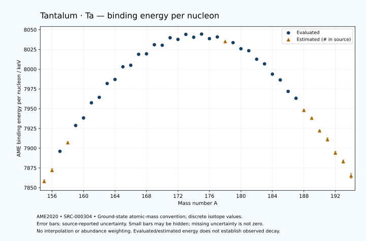

# Tantalum — Atomic Masses and Reaction Energies

<!-- generated-by: sync-ame2020.mjs -->

**Dated evaluated data · scientific coverage remains partial.** 40 ground-state nuclides from AME2020. Values and uncertainties are transcribed from the retained unrounded analysis files; estimated quantities remain labelled.

- [Parent Tantalum record](0073-Tantalum-Ta.md) · [NUBASE states and decays](0073-Tantalum-Ta-Nuclear-Evaluation.md)
- [Structured data](data/isotopes/0073-Tantalum-Ta-AME2020-Evaluation.yaml)
- [Original mass table](../../data/catalog/sources/ame2020-mass_1.mas20.txt) · [Original reaction table 1](../../data/catalog/sources/ame2020-rct1.mas20.txt) · [Original reaction table 2](../../data/catalog/sources/ame2020-rct2.mas20.txt)
- [AME2020 methods](https://doi.org/10.1088/1674-1137/abddb0) (SRC-000303) · [Tables and definitions](https://doi.org/10.1088/1674-1137/abddaf) (SRC-000304)

## Reading the data

All table energies and uncertainties are in keV; binding energy is per nucleon. A # replaces a decimal point in the original estimated value. UNKNOWN (*) retains the source's not-calculable entry; it is neither zero nor automatically NOT APPLICABLE. Source lines are one-based in the retained files. Uncertainties remain those published by the evaluation, with no replacement by independent-mass quadrature.

Atomic-mass conventions apply. Qα is total decay energy, not alpha-particle kinetic energy. Positive Q alone does not establish a decay branch, rate or observation. He-4's source Qα of zero is a bookkeeping identity. These tables describe ground-state combinations, not isomer or excited-daughter transitions. Nuclear state and daughter lookups are explicit in the structured companion. The binding quantity follows [Z M(¹H) + N mₙ − M(A,Z)]c²/A; it has not been converted to a bare-nucleus convention.

## Mass and binding table

| Nuclide | N | Atomic mass excess / keV | AME binding per nucleon / keV | Mass-file line |
|---|---:|---|---|---:|
| Ta-155 | 82 | -23988# ± 300# | 7858# ± 2# | 2096 |
| Ta-156 | 83 | -26001# ± 300# | 7872# ± 2# | 2113 |
| Ta-157 | 84 | -29595.948 ± 150.052 | 7896.0608 ± 0.9557 | 2130 |
| Ta-158 | 85 | -31118# ± 201# | 7907# ± 1# | 2147 |
| Ta-159 | 86 | -34439.157 ± 19.689 | 7928.7258 ± 0.1238 | 2164 |
| Ta-160 | 87 | -35823.700 ± 54.316 | 7938.2704 ± 0.3395 | 2181 |
| Ta-161 | 88 | -38778.575 ± 24.381 | 7957.4500 ± 0.1514 | 2198 |
| Ta-162 | 89 | -39781.405 ± 63.322 | 7964.3432 ± 0.3909 | 2215 |
| Ta-163 | 90 | -42534.634 ± 38.061 | 7981.8905 ± 0.2335 | 2232 |
| Ta-164 | 91 | -43282.805 ± 27.945 | 7986.9978 ± 0.1704 | 2249 |
| Ta-165 | 92 | -45847.872 ± 13.573 | 8003.0547 ± 0.0823 | 2266 |
| Ta-166 | 93 | -46097.780 ± 27.945 | 8004.9714 ± 0.1683 | 2283 |
| Ta-167 | 94 | -48351.064 ± 27.945 | 8018.8614 ± 0.1673 | 2300 |
| Ta-168 | 95 | -48393.913 ± 27.945 | 8019.4287 ± 0.1663 | 2317 |
| Ta-169 | 96 | -50290.435 ± 27.945 | 8030.9577 ± 0.1654 | 2334 |
| Ta-170 | 97 | -50137.670 ± 27.945 | 8030.2965 ± 0.1644 | 2351 |
| Ta-171 | 98 | -51720.279 ± 27.945 | 8039.7914 ± 0.1634 | 2368 |
| Ta-172 | 99 | -51329.983 ± 27.945 | 8037.7056 ± 0.1625 | 2385 |
| Ta-173 | 100 | -52396.543 ± 27.945 | 8044.0650 ± 0.1615 | 2401 |
| Ta-174 | 101 | -51740.771 ± 27.945 | 8040.4528 ± 0.1606 | 2417 |
| Ta-175 | 102 | -52408.653 ± 27.945 | 8044.4456 ± 0.1597 | 2432 |
| Ta-176 | 103 | -51365.379 ± 30.739 | 8038.6706 ± 0.1747 | 2447 |
| Ta-177 | 104 | -51714.745 ± 3.315 | 8040.8289 ± 0.0187 | 2462 |
| Ta-178 | 105 | -50598# ± 52# | 8035# ± 0# | 2477 |
| Ta-179 | 106 | -50357.456 ± 1.466 | 8033.5869 ± 0.0082 | 2492 |
| Ta-180 | 107 | -48933.631 ± 2.068 | 8025.8864 ± 0.0115 | 2507 |
| Ta-181 | 108 | -48439.064 ± 1.576 | 8023.4050 ± 0.0087 | 2521 |
| Ta-182 | 109 | -46430.685 ± 1.578 | 8012.6332 ± 0.0087 | 2535 |
| Ta-183 | 110 | -45293.547 ± 1.590 | 8006.7400 ± 0.0087 | 2548 |
| Ta-184 | 111 | -42839.453 ± 26.010 | 7993.7535 ± 0.1414 | 2561 |
| Ta-185 | 112 | -41394.371 ± 14.161 | 7986.3615 ± 0.0765 | 2575 |
| Ta-186 | 113 | -38607.602 ± 60.012 | 7971.8357 ± 0.3226 | 2588 |
| Ta-187 | 114 | -36895.550 ± 55.890 | 7963.2123 ± 0.2989 | 2602 |
| Ta-188 | 115 | -33910# ± 200# | 7948# ± 1# | 2616 |
| Ta-189 | 116 | -31960# ± 200# | 7938# ± 1# | 2629 |
| Ta-190 | 117 | -28720# ± 200# | 7922# ± 1# | 2642 |
| Ta-191 | 118 | -26520# ± 300# | 7911# ± 2# | 2654 |
| Ta-192 | 119 | -23100# ± 400# | 7894# ± 2# | 2667 |
| Ta-193 | 120 | -20810# ± 400# | 7883# ± 2# | 2680 |
| Ta-194 | 121 | -17130# ± 500# | 7865# ± 3# | 2694 |

## Q-values and separation energies

| Nuclide | Qβ− / keV | Qα / keV | S₂n / keV | S₂p / keV | Reaction-file line |
|---|---|---|---|---|---:|
| Ta-155 | UNKNOWN (*) | 3887# ± 424# | UNKNOWN (*) | 190# ± 336# | 2095 |
| Ta-156 | UNKNOWN (*) | 4996# ± 358# | UNKNOWN (*) | 912# ± 361# | 2112 |
| Ta-157 | -9906# ± 427# | 6354.5987 ± 6.2869 | 21751# ± 336# | 1628.8336 ± 151.2815 | 2129 |
| Ta-158 | -7426# ± 361# | 6123.6044 ± 4.3503 | 21260# ± 361# | 1997# ± 208# | 2146 |
| Ta-159 | -9005# ± 301# | 5680.9834 ± 6.0667 | 20985.8454 ± 151.3386 | 2577.2812 ± 23.0902 | 2163 |
| Ta-160 | -6494.6267 ± 139.8413 | 5450.9341 ± 4.5870 | 20848# ± 208# | 3189.4414 ± 56.3822 | 2180 |
| Ta-161 | -8272# ± 202# | 5236.3268 ± 23.8420 | 20482.0544 ± 31.3357 | 3647.9083 ± 44.8662 | 2197 |
| Ta-162 | -5782.1880 ± 63.3235 | 5005.8799 ± 61.4896 | 20100.3411 ± 83.4262 | 4089.4045 ± 85.0786 | 2214 |
| Ta-163 | -7626.1952 ± 69.7301 | 4749.0593 ± 5.4915 | 19898.6948 ± 45.2010 | 4550.2267 ± 47.2185 | 2231 |
| Ta-164 | -5047.2500 ± 29.5717 | 4562.2214 ± 63.3210 | 19644.0365 ± 69.2145 | 5028.9880 ± 80.0705 | 2248 |
| Ta-165 | -6986.5555 ± 29.1133 | 4289.5617 ± 31.0668 | 19455.8739 ± 40.4093 | 5634.3991 ± 31.0668 | 2265 |
| Ta-166 | -4210.3092 ± 29.5036 | 4309.0630 ± 80.0705 | 18957.6113 ± 39.5199 | 6033.3467 ± 39.5199 | 2282 |
| Ta-167 | -6257.8523 ± 33.6262 | 4015.4344 ± 39.5199 | 18645.8289 ± 31.0668 | 6486.7590 ± 38.5387 | 2299 |
| Ta-168 | -3500.9828 ± 30.9307 | 3823.5466 ± 39.5199 | 18438.7691 ± 39.5199 | 6950.8684 ± 40.8585 | 2316 |
| Ta-169 | -5372.5686 ± 31.9246 | 3726.8966 ± 38.5387 | 18082.0068 ± 39.5199 | 7342.0959 ± 46.5747 | 2333 |
| Ta-170 | -2846.8656 ± 30.9035 | 3458.4009 ± 40.8585 | 17886.3931 ± 39.5199 | 7642.7807 ± 47.1476 | 2350 |
| Ta-171 | -4634.1832 ± 39.5199 | 3381.0869 ± 46.5747 | 17572.4796 ± 39.5199 | 8215.6935 ± 28.1060 | 2367 |
| Ta-172 | -2232.7914 ± 39.5199 | 3317.9331 ± 47.1476 | 17334.9486 ± 39.5199 | 8601.6909 ± 32.6282 | 2384 |
| Ta-173 | -3669.1553 ± 39.5199 | 3261.0680 ± 28.1060 | 16818.9008 ± 39.5199 | 9146.0199 ± 28.0068 | 2400 |
| Ta-174 | -1513.6779 ± 39.5199 | 3140.5465 ± 32.6282 | 16553.4250 ± 39.5199 | 9582.6377 ± 28.0423 | 2416 |
| Ta-175 | -2775.8524 ± 39.5199 | 2994.8969 ± 28.0068 | 16154.7455 ± 39.5199 | 10105.5807 ± 27.9887 | 2431 |
| Ta-176 | -723.7709 ± 41.5430 | 2945.7807 ± 30.8279 | 15767.2440 ± 41.5430 | 10373.0295 ± 30.7792 | 2446 |
| Ta-177 | -2013.0144 ± 28.1408 | 2741.3530 ± 3.2653 | 15448.7287 ± 28.1408 | 11127.0089 ± 3.1084 | 2461 |
| Ta-178 | -191# ± 50# | 2547# ± 52# | 15376# ± 61# | 11794# ± 52# | 2476 |
| Ta-179 | -1062.2093 ± 14.5197 | 2383.3065 ± 0.9188 | 14785.3470 ± 3.0338 | 12551.4955 ± 0.9002 | 2491 |
| Ta-180 | 702.6122 ± 2.3590 | 2023.7865 ± 2.2787 | 14478# ± 52# | 13173.6922 ± 2.9638 | 2506 |
| Ta-181 | -205.1193 ± 1.9495 | 1519.9228 ± 1.8483 | 14224.2441 ± 1.9544 | 13957.9931 ± 5.3333 | 2520 |
| Ta-182 | 1815.4592 ± 1.5276 | 1482.2800 ± 2.6455 | 13639.6901 ± 1.3421 | 14332.1508 ± 70.7370 | 2534 |
| Ta-183 | 1072.1161 ± 1.5405 | 1340.5506 ± 5.3375 | 12997.1187 ± 0.2260 | 15074.0743 ± 125.7618 | 2547 |
| Ta-184 | 2866.0000 ± 26.0000 | 1412.1074 ± 75.3555 | 12551.4041 ± 26.0450 | 15647# ± 202# | 2560 |
| Ta-185 | 1993.5000 ± 14.1421 | 978.1274 ± 126.5466 | 12243.4606 ± 14.2261 | 16256.1992 ± 81.3506 | 2574 |
| Ta-186 | 3901.0000 ± 60.0000 | 738# ± 209# | 11910.7856 ± 65.4014 | 16885# ± 209# | 2587 |
| Ta-187 | 3008.4937 ± 55.9028 | 395.6483 ± 97.6782 | 11643.8150 ± 57.6559 | 17513# ± 305# | 2601 |
| Ta-188 | 4758# ± 200# | -35# ± 283# | 11445# ± 209# | 18168# ± 447# | 2615 |
| Ta-189 | 3850# ± 283# | -424# ± 361# | 11207# ± 208# | 18768# ± 447# | 2628 |
| Ta-190 | 5649# ± 203# | -825# ± 447# | 10952# ± 283# | 19478# ± 447# | 2641 |
| Ta-191 | 4657# ± 303# | -1175# ± 500# | 10703# ± 361# | UNKNOWN (*) | 2653 |
| Ta-192 | 6520# ± 447# | -1705# ± 565# | 10523# ± 447# | UNKNOWN (*) | 2666 |
| Ta-193 | 5380# ± 447# | UNKNOWN (*) | 10433# ± 500# | UNKNOWN (*) | 2679 |
| Ta-194 | 7280# ± 583# | UNKNOWN (*) | 10173# ± 640# | UNKNOWN (*) | 2693 |

## Additional decay-energy combinations

| Nuclide | Q₂β− / keV | Q₄β− / keV | Qεp / keV | Qβ−n / keV | Part 1 / part 2 line |
|---|---|---|---|---|---|
| Ta-155 | UNKNOWN (*) | UNKNOWN (*) | 8390# ± 361# | UNKNOWN (*) | 2095 / 2125 |
| Ta-156 | UNKNOWN (*) | UNKNOWN (*) | 9255# ± 301# | UNKNOWN (*) | 2112 / 2142 |
| Ta-157 | UNKNOWN (*) | UNKNOWN (*) | 6814.6310 ± 140.0253 | UNKNOWN (*) | 2129 / 2160 |
| Ta-158 | UNKNOWN (*) | UNKNOWN (*) | 8033# ± 201# | -19500# ± 447# | 2146 / 2177 |
| Ta-159 | -19634# ± 305# | UNKNOWN (*) | 5484.0725 ± 17.4574 | -18818# ± 301# | 2163 / 2194 |
| Ta-160 | -18945# ± 305# | UNKNOWN (*) | 6595.9383 ± 66.0963 | -18461# ± 305# | 2180 / 2211 |
| Ta-161 | -17935.7552 ± 151.8753 | UNKNOWN (*) | 4202.3960 ± 61.8312 | -17520.8202 ± 151.7815 | 2197 / 2229 |
| Ta-162 | -17329# ± 210# | UNKNOWN (*) | 5491.9735 ± 69.2145 | -17346# ± 210# | 2214 / 2246 |
| Ta-163 | -16532.3811 ± 42.3343 | -37224# ± 401# | 3008.1542 ± 84.1371 | -16606.7352 ± 41.9578 | 2231 / 2263 |
| Ta-164 | -15810.3638 ± 61.2953 | -35799# ± 317# | 4219.6386 ± 39.5199 | -16445.6844 ± 64.7651 | 2248 / 2280 |
| Ta-165 | -15188.5181 ± 27.2189 | -34253# ± 159# | 1505.5329 ± 31.0668 | -15683.6347 ± 16.6674 | 2265 / 2298 |
| Ta-166 | -14260.4450 ± 92.5607 | -32792# ± 203# | 3055.4963 ± 38.5387 | -15307.7821 ± 38.0035 | 2282 / 2315 |
| Ta-167 | -13517# ± 49# | -31278.6162 ± 33.4287 | 380.9514 ± 40.8585 | -14534.9115 ± 29.5036 | 2299 / 2332 |
| Ta-168 | -12599.0239 ± 41.6032 | -29727.6828 ± 61.8851 | 1843.3971 ± 46.5747 | -14372.0191 ± 33.6262 | 2316 / 2349 |
| Ta-169 | -11881.1881 ± 30.1689 | -28197.0191 ± 36.3885 | -506.5746 ± 47.1476 | -13468.8229 ± 30.9307 | 2333 / 2367 |
| Ta-170 | -11233.6739 ± 30.1911 | -26955# ± 105# | 655.8860 ± 28.1060 | -13291.1216 ± 31.9246 | 2350 / 2384 |
| Ta-171 | -10469.9937 ± 39.5199 | -25308.2485 ± 47.5454 | -1703.0159 ± 32.6282 | -12500.7921 ± 30.9035 | 2367 / 2401 |
| Ta-172 | -9763.1439 ± 45.2323 | -23950.6092 ± 42.7882 | -790.4881 ± 28.0068 | -12315.2052 ± 39.5199 | 2384 / 2418 |
| Ta-173 | -8842.6735 ± 39.5199 | -22128.0875 ± 29.8670 | -2949.4385 ± 28.0423 | -11370.6702 ± 39.5199 | 2400 / 2435 |
| Ta-174 | -8067.6704 ± 39.5199 | -20954.8346 ± 30.1137 | -2148.7284 ± 27.9887 | -11084.7015 ± 39.5199 | 2416 / 2451 |
| Ta-175 | -7120.3409 ± 39.5199 | -19014.1418 ± 30.5661 | -4127.3318 ± 27.9887 | -10252.8773 ± 39.5199 | 2431 / 2466 |
| Ta-176 | -6302.4891 ± 41.5430 | -17483.4567 ± 31.7848 | -3488.6719 ± 30.7630 | -9803.8971 ± 41.5430 | 2446 / 2481 |
| Ta-177 | -5445.5702 ± 28.1408 | -15667.3207 ± 20.0361 | -5621.3833 ± 3.1050 | -9144.4549 ± 28.1408 | 2461 / 2496 |
| Ta-178 | -4945# ± 59# | -14344# ± 56# | -5503# ± 52# | -8968# ± 59# | 2476 / 2512 |
| Ta-179 | -3773.1440 ± 24.6646 | -12275.7368 ± 9.8802 | -7308.5466 ± 2.0940 | -8021.7085 ± 15.1385 | 2491 / 2527 |
| Ta-180 | -3096.2672 ± 21.4917 | -10956.1009 ± 21.8046 | -7163.5887 ± 5.4986 | -7709.7020 ± 14.6941 | 2506 / 2542 |
| Ta-181 | -1921.6523 ± 12.6277 | -8976.0289 ± 5.4770 | -9051.5591 ± 70.7370 | -6874.1392 ± 1.9429 | 2520 / 2556 |
| Ta-182 | -984.5408 ± 101.9918 | -7379.0022 ± 21.0265 | -8922.2414 ± 125.7616 | -6268.0580 ± 1.9508 | 2534 / 2570 |
| Ta-183 | 516.1161 ± 8.1470 | -5091.4082 ± 24.7231 | -10812# ± 200# | -5118.7208 ± 1.5406 | 2547 / 2584 |
| Ta-184 | 1380.3667 ± 26.3366 | -3228.5975 ± 38.1767 | -10412.3097 ± 84.2254 | -4545.1081 ± 26.0003 | 2560 / 2597 |
| Ta-185 | 2424.6764 ± 14.1576 | -1058.8134 ± 31.3283 | -12383# ± 201# | -3760.2364 ± 14.1422 | 2574 / 2611 |
| Ta-186 | 3319.7181 ± 60.0128 | 564.7481 ± 62.2460 | -11936# ± 306# | -3291.0492 ± 60.0112 | 2587 / 2624 |
| Ta-187 | 4320.9985 ± 55.8945 | 2653.8267 ± 62.4865 | -13864# ± 404# | -2458.2658 ± 55.9028 | 2601 / 2638 |
| Ta-188 | 5107# ± 200# | 4435# ± 200# | -13429# ± 447# | -2077# ± 200# | 2615 / 2653 |
| Ta-189 | 6020# ± 200# | 6490# ± 201# | -15428# ± 447# | -1363# ± 200# | 2628 / 2666 |
| Ta-190 | 6863# ± 200# | 8034# ± 200# | UNKNOWN (*) | -982# ± 283# | 2641 / 2679 |
| Ta-191 | 7831# ± 300# | 10189# ± 300# | UNKNOWN (*) | -222# ± 302# | 2653 / 2691 |
| Ta-192 | 8489# ± 406# | 11736# ± 400# | UNKNOWN (*) | 5# ± 402# | 2666 / 2704 |
| Ta-193 | 9422# ± 402# | 13727# ± 400# | UNKNOWN (*) | 739# ± 447# | 2679 / 2717 |
| Ta-194 | 10130# ± 539# | 15402# ± 500# | UNKNOWN (*) | 988# ± 539# | 2693 / 2732 |

## Single-nucleon separation and reaction energies

| Nuclide | Sₙ / keV | Sₚ / keV | Q(d,α) / keV | Q(p,α) / keV | Q(n,α) / keV | Part 2 line |
|---|---|---|---|---|---|---:|
| Ta-155 | UNKNOWN (*) | -1452.9999 ± 15.0000 | 14023# ± 424# | UNKNOWN (*) | 15080# ± 358# | 2125 |
| Ta-156 | 10084# ± 424# | -1019.7972 ± 4.2690 | 17440# ± 424# | 6163# ± 424# | 18021# ± 335# | 2142 |
| Ta-157 | 11666# ± 335# | -934.5958 ± 9.6737 | 15425# ± 335# | 7998# ± 335# | 15717# ± 251# | 2160 |
| Ta-158 | 9594# ± 251# | -447.6541 ± 12.9040 | 17412# ± 250# | 8056# ± 361# | 17073# ± 202# | 2177 |
| Ta-159 | 11392# ± 202# | -374.2715 ± 9.0354 | 15126# ± 201# | 8244.4128 ± 151.0291 | 14906.7950 ± 57.5918 | 2194 |
| Ta-160 | 9455.8609 ± 57.7742 | 260.0647 ± 56.8584 | 16989.5068 ± 57.0633 | 7895# ± 208# | 16262.5203 ± 55.6415 | 2211 |
| Ta-161 | 11026.1935 ± 59.5370 | 128.7990 ± 23.3873 | 14784.8379 ± 29.6164 | 8187.8795 ± 30.0048 | 14080.0275 ± 28.6874 | 2229 |
| Ta-162 | 9074.1475 ± 67.8524 | 754.5584 ± 67.5239 | 16868.1496 ± 64.0359 | 7935.2566 ± 65.5165 | 15573.6066 ± 73.6767 | 2246 |
| Ta-163 | 10824.5473 ± 73.8810 | 655.1792 ± 39.1000 | 14491.9905 ± 44.7056 | 8268.1686 ± 39.2389 | 13381.7106 ± 68.3909 | 2263 |
| Ta-164 | 8819.4892 ± 47.2185 | 1302.4558 ± 37.9611 | 16596.4278 ± 29.3436 | 7897.0675 ± 36.4805 | 14925.9464 ± 39.5199 | 2280 |
| Ta-165 | 10636.3847 ± 31.0668 | 1318.4866 ± 20.0124 | 14132.2557 ± 29.0579 | 8184.6093 ± 16.2593 | 12630.2897 ± 76.2536 | 2298 |
| Ta-166 | 8321.2266 ± 31.0668 | 1751.2386 ± 39.5199 | 16431.3830 ± 32.1083 | 8035.5953 ± 37.9611 | 14340.0367 ± 39.5199 | 2315 |
| Ta-167 | 10324.6023 ± 39.5199 | 1781.0464 ± 39.5199 | 13995.2552 ± 39.5199 | 8331.3469 ± 32.1083 | 11937.7134 ± 39.5199 | 2332 |
| Ta-168 | 8114.1668 ± 39.5199 | 2215.1227 ± 39.5199 | 16175.8829 ± 39.5199 | 8105.6547 ± 39.5199 | 13694.7366 ± 38.5387 | 2349 |
| Ta-169 | 9967.8401 ± 39.5199 | 2218.8487 ± 39.5199 | 13888.1334 ± 39.5199 | 8432.6091 ± 39.5199 | 11376.9539 ± 40.8585 | 2367 |
| Ta-170 | 7918.5530 ± 39.5199 | 2709.7461 ± 39.5199 | 15933.6945 ± 39.5199 | 8194.1466 ± 39.5199 | 13035.0134 ± 46.5747 | 2384 |
| Ta-171 | 9653.9265 ± 39.5199 | 2755.3893 ± 39.5199 | 13707.4236 ± 39.5199 | 8504.3341 ± 39.5199 | 10998.9552 ± 47.1476 | 2401 |
| Ta-172 | 7681.0220 ± 39.5199 | 3187.6025 ± 40.1840 | 15634.6849 ± 39.5199 | 8250.9678 ± 39.5199 | 12398.9468 ± 28.1060 | 2418 |
| Ta-173 | 9137.8788 ± 39.5199 | 3283.2828 ± 37.1167 | 13745.6148 ± 40.1840 | 8721.3723 ± 39.5199 | 10556.0927 ± 32.6282 | 2435 |
| Ta-174 | 7415.5462 ± 39.5199 | 3617.9528 ± 39.5199 | 15372.2671 ± 37.1167 | 8554.6348 ± 40.1840 | 11734.0963 ± 28.0068 | 2451 |
| Ta-175 | 8739.1993 ± 39.5199 | 3853.0407 ± 28.0360 | 13713.9440 ± 39.5199 | 8857.6340 ± 37.1167 | 9973.8253 ± 28.0423 | 2466 |
| Ta-176 | 7028.0447 ± 41.5430 | 4172.5874 ± 30.8239 | 15190.0108 ± 30.8222 | 8910.4656 ± 41.5430 | 11162.0370 ± 30.7792 | 2481 |
| Ta-177 | 8420.6840 ± 30.9175 | 4427.2886 ± 3.1681 | 13477.8248 ± 3.5977 | 8993.8931 ± 3.5836 | 9501.9489 ± 3.2653 | 2496 |
| Ta-178 | 6955# ± 52# | 5007# ± 52# | 14689# ± 52# | 8747# ± 52# | 10214# ± 52# | 2512 |
| Ta-179 | 7830# ± 52# | 5211.0615 ± 0.4159 | 13234.0962 ± 0.4515 | 9083.0268 ± 1.0979 | 8671.2791 ± 0.9075 | 2527 |
| Ta-180 | 6647.4927 ± 2.3685 | 5759.5656 ± 2.3435 | 14212.5420 ± 2.3434 | 8811.1697 ± 2.3424 | 9096.6742 ± 2.2817 | 2542 |
| Ta-181 | 7576.7514 ± 1.3379 | 5948.5591 ± 1.9285 | 12734.7792 ± 1.9241 | 8860.3568 ± 1.9239 | 7545.2187 ± 2.6446 | 2556 |
| Ta-182 | 6062.9387 ± 0.1052 | 6316.6979 ± 1.9311 | 14059.5983 ± 1.9298 | 8896.4067 ± 1.9254 | 8274.7305 ± 5.3338 | 2570 |
| Ta-183 | 6934.1800 ± 0.2000 | 6532.8816 ± 6.3059 | 12820.2183 ± 1.9414 | 9349.9846 ± 1.9401 | 7029.3316 ± 70.7373 | 2584 |
| Ta-184 | 5617.2242 ± 26.0457 | 6844.8772 ± 39.7288 | 13920.9904 ± 26.7293 | 9427.5604 ± 26.0473 | 7604.3639 ± 128.4135 | 2597 |
| Ta-185 | 6626.2364 ± 29.5973 | 7183.8894 ± 42.1426 | 12599.9825 ± 33.2022 | 9519.3202 ± 15.4420 | 6022# ± 201# | 2611 |
| Ta-186 | 5284.5492 ± 61.6550 | 7576.7689 ± 87.9347 | 13602.6575 ± 71.9537 | 9539.9996 ± 67.1087 | 6754.9140 ± 100.0942 | 2624 |
| Ta-187 | 6359.2658 ± 82.0069 | 7760.3071 ± 75.8181 | 12135.0615 ± 85.1744 | 9467.9580 ± 68.5580 | 5051# ± 208# | 2638 |
| Ta-188 | 5086# ± 208# | 8199# ± 283# | 13225# ± 207# | 9274# ± 210# | 5697# ± 361# | 2653 |
| Ta-189 | 6121# ± 283# | 8419# ± 361# | 11751# ± 283# | 9329# ± 207# | 4007# ± 447# | 2666 |
| Ta-190 | 4832# ± 283# | 8859# ± 361# | 12821# ± 361# | 9144# ± 283# | 4696# ± 447# | 2679 |
| Ta-191 | 5871# ± 361# | 9009# ± 500# | 11341# ± 424# | 9174# ± 424# | 2947# ± 500# | 2691 |
| Ta-192 | 4652# ± 500# | UNKNOWN (*) | 12411# ± 565# | 8914# ± 500# | UNKNOWN (*) | 2704 |
| Ta-193 | 5781# ± 565# | UNKNOWN (*) | UNKNOWN (*) | 8855# ± 565# | UNKNOWN (*) | 2717 |
| Ta-194 | 4392# ± 640# | UNKNOWN (*) | UNKNOWN (*) | UNKNOWN (*) | UNKNOWN (*) | 2732 |

Qβ− comes from the mass-file line in the first table. Qα, S₂n, S₂p, Q₂β−, Qεp and Qβ−n come from reaction part 1; Q₄β− and the last table come from part 2. Qεp is electron-capture/proton energy balance; Qβ−n is beta-minus/neutron energy balance. These are evaluated mass combinations, not observations of decay modes, cross sections or reaction rates. Light-nuclide zero entries can be bookkeeping identities, without a physical A=0 residual. Definitions and original source strings are retained in the structured data.

## Binding-energy chart

Discrete source values and source-reported uncertainties. No interpolation, natural-abundance weighting or observed-decay claim is implied. This quantitative chart supplements the 22 separate illustrative panels.

## Remaining review

Later measurements, state-specific decay branches, isomer Q-values, reaction rates, applicability and full claim-level review remain open. Existing authored values retain their own provenance; this companion does not overwrite them.
