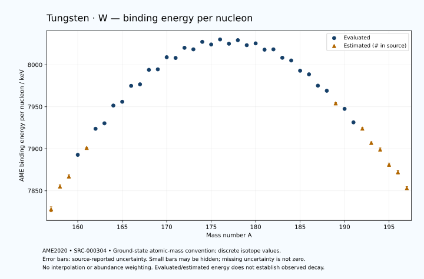

# Tungsten — Atomic Masses and Reaction Energies

<!-- generated-by: sync-ame2020.mjs -->

**Dated evaluated data · scientific coverage remains partial.** 41 ground-state nuclides from AME2020. Values and uncertainties are transcribed from the retained unrounded analysis files; estimated quantities remain labelled.

- [Parent Tungsten record](0074-Tungsten-W.md) · [NUBASE states and decays](0074-Tungsten-W-Nuclear-Evaluation.md)
- [Structured data](data/isotopes/0074-Tungsten-W-AME2020-Evaluation.yaml)
- [Original mass table](../../data/catalog/sources/ame2020-mass_1.mas20.txt) · [Original reaction table](../../data/catalog/sources/ame2020-rct1.mas20.txt)
- [AME2020 methods](https://doi.org/10.1088/1674-1137/abddb0) (SRC-000303) · [Tables and definitions](https://doi.org/10.1088/1674-1137/abddaf) (SRC-000304)

## Reading the data

All table energies and uncertainties are in keV; binding energy is per nucleon. A # replaces a decimal point in the original estimated value. UNKNOWN (*) retains the source's not-calculable entry; it is neither zero nor automatically NOT APPLICABLE. Source lines are one-based in the retained files. Uncertainties remain those published by the evaluation, with no replacement by independent-mass quadrature.

Atomic-mass conventions apply. Qα is total decay energy, not alpha-particle kinetic energy. Positive Q alone does not establish a decay branch, rate or observation. He-4's source Qα of zero is a bookkeeping identity. These tables describe ground-state combinations, not isomer or excited-daughter transitions. Nuclear state and daughter lookups are explicit in the structured companion. The binding quantity follows [Z M(¹H) + N mₙ − M(A,Z)]c²/A; it has not been converted to a bare-nucleus convention.

## Mass and binding table

| Nuclide | N | Atomic mass excess / keV | AME binding per nucleon / keV | Mass-file line |
|---|---:|---|---|---:|
| W-157 | 83 | -19690# ± 400# | 7828# ± 3# | 2131 |
| W-158 | 84 | -23693# ± 300# | 7855# ± 2# | 2148 |
| W-159 | 85 | -25434# ± 300# | 7867# ± 2# | 2165 |
| W-160 | 86 | -29329.073 ± 149.810 | 7892.7893 ± 0.9363 | 2182 |
| W-161 | 87 | -30507# ± 200# | 7901# ± 1# | 2199 |
| W-162 | 88 | -33999.217 ± 17.657 | 7923.8214 ± 0.1090 | 2216 |
| W-163 | 89 | -34908.439 ± 58.426 | 7930.3043 ± 0.3584 | 2233 |
| W-164 | 90 | -38235.555 ± 9.673 | 7951.4515 ± 0.0590 | 2250 |
| W-165 | 91 | -38861.316 ± 25.756 | 7955.9704 ± 0.1561 | 2267 |
| W-166 | 92 | -41887.471 ± 9.463 | 7974.8951 ± 0.0570 | 2284 |
| W-167 | 93 | -42093.212 ± 18.703 | 7976.7045 ± 0.1120 | 2301 |
| W-168 | 94 | -44892.930 ± 13.259 | 7993.9327 ± 0.0789 | 2318 |
| W-169 | 95 | -44917.866 ± 15.436 | 7994.5381 ± 0.0913 | 2335 |
| W-170 | 96 | -47290.804 ± 13.195 | 8008.9482 ± 0.0776 | 2352 |
| W-171 | 97 | -47086.095 ± 27.945 | 8008.1158 ± 0.1634 | 2369 |
| W-172 | 98 | -49097.191 ± 27.945 | 8020.1757 ± 0.1625 | 2386 |
| W-173 | 99 | -48727.388 ± 27.945 | 8018.3337 ± 0.1615 | 2402 |
| W-174 | 100 | -50227.093 ± 27.945 | 8027.2572 ± 0.1606 | 2418 |
| W-175 | 101 | -49632.800 ± 27.945 | 8024.1130 ± 0.1597 | 2433 |
| W-176 | 102 | -50641.608 ± 27.945 | 8030.1131 ± 0.1588 | 2448 |
| W-177 | 103 | -49701.731 ± 27.945 | 8025.0359 ± 0.1579 | 2463 |
| W-178 | 104 | -50407.066 ± 15.199 | 8029.2584 ± 0.0854 | 2478 |
| W-179 | 105 | -49295.247 ± 14.573 | 8023.2821 ± 0.0814 | 2493 |
| W-180 | 106 | -49636.243 ± 1.439 | 8025.4434 ± 0.0080 | 2508 |
| W-181 | 107 | -48233.945 ± 1.448 | 8017.9494 ± 0.0080 | 2522 |
| W-182 | 108 | -48246.144 ± 0.745 | 8018.3096 ± 0.0041 | 2536 |
| W-183 | 109 | -46365.663 ± 0.743 | 8008.3234 ± 0.0041 | 2549 |
| W-184 | 110 | -45705.453 ± 0.738 | 8005.0777 ± 0.0040 | 2562 |
| W-185 | 111 | -43387.871 ± 0.739 | 7992.9083 ± 0.0040 | 2576 |
| W-186 | 112 | -42508.602 ± 1.213 | 7988.6026 ± 0.0065 | 2589 |
| W-187 | 113 | -39904.044 ± 1.213 | 7975.1168 ± 0.0065 | 2603 |
| W-188 | 114 | -38667.880 ± 3.089 | 7969.0532 ± 0.0164 | 2617 |
| W-189 | 115 | -35809# ± 200# | 7954# ± 1# | 2630 |
| W-190 | 116 | -34368.832 ± 35.391 | 7947.5031 ± 0.1863 | 2643 |
| W-191 | 117 | -31176.176 ± 41.917 | 7931.4359 ± 0.2195 | 2655 |
| W-192 | 118 | -29620# ± 200# | 7924# ± 1# | 2668 |
| W-193 | 119 | -26190# ± 200# | 7907# ± 1# | 2681 |
| W-194 | 120 | -24410# ± 300# | 7899# ± 2# | 2695 |
| W-195 | 121 | -20740# ± 300# | 7881# ± 2# | 2708 |
| W-196 | 122 | -18740# ± 400# | 7872# ± 2# | 2721 |
| W-197 | 123 | -14870# ± 400# | 7853# ± 2# | 2734 |

## Q-values and separation energies

| Nuclide | Qβ− / keV | Qα / keV | S₂n / keV | S₂p / keV | Reaction-file line |
|---|---|---|---|---|---:|
| W-157 | UNKNOWN (*) | 5185# ± 500# | UNKNOWN (*) | -42# ± 500# | 2130 |
| W-158 | UNKNOWN (*) | 6612.4547 ± 2.6394 | UNKNOWN (*) | 451# ± 335# | 2147 |
| W-159 | -10629# ± 427# | 6450.8877 ± 3.5522 | 21887# ± 500# | 1157# ± 361# | 2164 |
| W-160 | -12451# ± 335# | 6065.5256 ± 4.5871 | 21779# ± 335# | 1804.6157 ± 150.8283 | 2181 |
| W-161 | -9664# ± 250# | 5922.8816 ± 3.6258 | 21216# ± 361# | 2232# ± 201# | 2198 |
| W-162 | -11546# ± 201# | 5678.2669 ± 2.4002 | 20812.7798 ± 150.8474 | 2638.4116 ± 20.0671 | 2215 |
| W-163 | -8906.1859 ± 61.2953 | 5519.2516 ± 55.9547 | 20544# ± 209# | 3170.5634 ± 62.9565 | 2232 |
| W-164 | -10763.1138 ± 55.4055 | 5278.2763 ± 2.0079 | 20378.9745 ± 20.1306 | 3645.0714 ± 13.1616 | 2249 |
| W-165 | -8201.9627 ± 34.9116 | 5029.5853 ± 32.0155 | 20095.5137 ± 63.8510 | 4169.9380 ± 36.3796 | 2266 |
| W-166 | -10050.1358 ± 88.7072 | 4856.0389 ± 3.9381 | 19794.5521 ± 13.5153 | 4647.0570 ± 18.4276 | 2283 |
| W-167 | -7259# ± 44# | 4751.1923 ± 29.8826 | 19374.5321 ± 31.8302 | 5035.6416 ± 33.6262 | 2300 |
| W-168 | -9098.0411 ± 33.5515 | 4500.5100 ± 11.4561 | 19148.0955 ± 16.2893 | 5611.8834 ± 30.9307 | 2317 |
| W-169 | -6508.6195 ± 19.1703 | 4292.7302 ± 31.9246 | 18967.2905 ± 24.2498 | 6028.0471 ± 31.9246 | 2334 |
| W-170 | -8386.8083 ± 17.4557 | 4143.2687 ± 30.9035 | 18540.5103 ± 18.6980 | 6508.1891 ± 30.9035 | 2351 |
| W-171 | -5835.8106 ± 39.5199 | 3956.7502 ± 39.5199 | 18310.8650 ± 31.9246 | 6947.1424 ± 39.5199 | 2368 |
| W-172 | -7530.3525 ± 45.2323 | 3838.4505 ± 39.5199 | 17949.0228 ± 30.9035 | 7421.2729 ± 39.5199 | 2385 |
| W-173 | -5173.5182 ± 39.5199 | 3564.5912 ± 39.5199 | 17783.9287 ± 39.5199 | 7873.9791 ± 40.1840 | 2401 |
| W-174 | -6553.9925 ± 39.5199 | 3601.8510 ± 39.5199 | 17272.5385 ± 39.5199 | 8402.8041 ± 37.1167 | 2417 |
| W-175 | -4344.4885 ± 39.5199 | 3373.6349 ± 40.1840 | 17048.0484 ± 39.5199 | 8798.9527 ± 39.5199 | 2432 |
| W-176 | -5578.7182 ± 39.5199 | 3335.7073 ± 37.1167 | 16557.1510 ± 39.5199 | 9374.9674 ± 28.0360 | 2447 |
| W-177 | -3432.5558 ± 39.5199 | 3285.1430 ± 39.5199 | 16211.5667 ± 39.5199 | 9797.9100 ± 28.0379 | 2462 |
| W-178 | -4753.6082 ± 31.8106 | 3012.6016 ± 15.2594 | 15908.0934 ± 31.8106 | 10408.5801 ± 15.1671 | 2477 |
| W-179 | -2710.9347 ± 26.8021 | 2761.6004 ± 14.6457 | 15736.1520 ± 31.5165 | 10992.4436 ± 14.5151 | 2492 |
| W-180 | -3798.8793 ± 21.4404 | 2515.2690 ± 1.0307 | 15371.8133 ± 15.1362 | 11778.8193 ± 0.3230 | 2507 |
| W-181 | -1716.5331 ± 12.6289 | 2221.8846 ± 0.3995 | 15081.3341 ± 14.5119 | 12348.8507 ± 0.3525 | 2521 |
| W-182 | -2800.0000 ± 101.9804 | 1764.3059 ± 1.5633 | 14752.5372 ± 1.5854 | 13044.6100 ± 1.5690 | 2535 |
| W-183 | -556.0000 ± 8.0000 | 1672.4576 ± 1.5635 | 14274.3540 ± 1.5929 | 13540.6469 ± 1.5701 | 2548 |
| W-184 | -1485.6333 ± 4.1971 | 1649.1074 ± 1.5668 | 13601.9449 ± 0.1353 | 14233.7587 ± 6.2012 | 2561 |
| W-185 | 431.1764 ± 0.6616 | 1590.1709 ± 1.5689 | 13164.8446 ± 0.1386 | 14682.2666 ± 30.0397 | 2575 |
| W-186 | -581.2819 ± 1.2386 | 1116.1180 ± 6.2789 | 12945.7856 ± 1.1567 | 15587.0916 ± 39.7157 | 2588 |
| W-187 | 1312.5048 ± 1.1219 | 954.5871 ± 30.0595 | 12658.8087 ± 1.1576 | 16162.1813 ± 64.2845 | 2602 |
| W-188 | 349.0000 ± 3.0000 | 406.6565 ± 39.8214 | 12301.9142 ± 3.2032 | 16821.6085 ± 51.3252 | 2616 |
| W-189 | 2170# ± 200# | 86# ± 210# | 12048# ± 200# | 17387# ± 283# | 2629 |
| W-190 | 1214.1824 ± 35.5545 | -369.5342 ± 62.2676 | 11843.5881 ± 35.5217 | 18117# ± 302# | 2642 |
| W-191 | 3174.2318 ± 43.1556 | -601# ± 205# | 11510# ± 205# | 18604# ± 303# | 2654 |
| W-192 | 1969# ± 212# | -1215# ± 361# | 11393# ± 203# | 19397# ± 447# | 2667 |
| W-193 | 4042# ± 204# | -1465# ± 361# | 11156# ± 205# | UNKNOWN (*) | 2680 |
| W-194 | 2850# ± 361# | -2035# ± 500# | 10933# ± 361# | UNKNOWN (*) | 2694 |
| W-195 | 4820# ± 424# | UNKNOWN (*) | 10692# ± 361# | UNKNOWN (*) | 2707 |
| W-196 | 3620# ± 500# | UNKNOWN (*) | 10473# ± 500# | UNKNOWN (*) | 2720 |
| W-197 | 5480# ± 500# | UNKNOWN (*) | 10273# ± 500# | UNKNOWN (*) | 2733 |

Qβ− comes from the mass-file line in the first table. The other three columns come from the reaction-file line. Definitions and original source strings are retained in the structured data.

## Binding-energy chart

Discrete source values and source-reported uncertainties. No interpolation, natural-abundance weighting or observed-decay claim is implied. This quantitative chart supplements the 22 separate illustrative panels.

## Remaining review

Later measurements, state-specific decay branches, isomer Q-values, additional reaction channels and full claim-level review remain open. Existing authored values retain their own provenance; this companion does not overwrite them.
