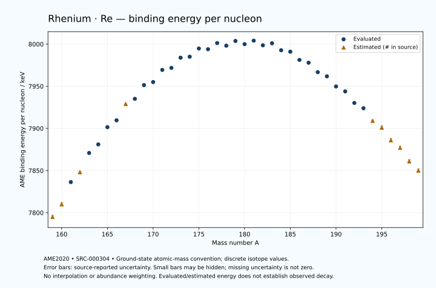

# Rhenium — Atomic Masses and Reaction Energies

<!-- generated-by: sync-ame2020.mjs -->

**Dated evaluated data · scientific coverage remains partial.** 41 ground-state nuclides from AME2020. Values and uncertainties are transcribed from the retained unrounded analysis files; estimated quantities remain labelled.

- [Parent Rhenium record](0075-Rhenium-Re.md) · [NUBASE states and decays](0075-Rhenium-Re-Nuclear-Evaluation.md)
- [Structured data](data/isotopes/0075-Rhenium-Re-AME2020-Evaluation.yaml)
- [Original mass table](../../data/catalog/sources/ame2020-mass_1.mas20.txt) · [Original reaction table](../../data/catalog/sources/ame2020-rct1.mas20.txt)
- [AME2020 methods](https://doi.org/10.1088/1674-1137/abddb0) (SRC-000303) · [Tables and definitions](https://doi.org/10.1088/1674-1137/abddaf) (SRC-000304)

## Reading the data

All table energies and uncertainties are in keV; binding energy is per nucleon. A # replaces a decimal point in the original estimated value. UNKNOWN (*) retains the source's not-calculable entry; it is neither zero nor automatically NOT APPLICABLE. Source lines are one-based in the retained files. Uncertainties remain those published by the evaluation, with no replacement by independent-mass quadrature.

Atomic-mass conventions apply. Qα is total decay energy, not alpha-particle kinetic energy. Positive Q alone does not establish a decay branch, rate or observation. He-4's source Qα of zero is a bookkeeping identity. These tables describe ground-state combinations, not isomer or excited-daughter transitions. Nuclear state and daughter lookups are explicit in the structured companion. The binding quantity follows [Z M(¹H) + N mₙ − M(A,Z)]c²/A; it has not been converted to a bare-nucleus convention.

## Mass and binding table

| Nuclide | N | Atomic mass excess / keV | AME binding per nucleon / keV | Mass-file line |
|---|---:|---|---|---:|
| Re-159 | 84 | -14805# ± 305# | 7795# ± 2# | 2166 |
| Re-160 | 85 | -16878# ± 300# | 7810# ± 2# | 2183 |
| Re-161 | 86 | -20842.820 ± 149.905 | 7836.3292 ± 0.9311 | 2200 |
| Re-162 | 87 | -22453# ± 201# | 7848# ± 1# | 2217 |
| Re-163 | 88 | -26002.253 ± 18.534 | 7870.8655 ± 0.1137 | 2234 |
| Re-164 | 89 | -27472.441 ± 54.555 | 7881.0523 ± 0.3326 | 2251 |
| Re-165 | 90 | -30659.353 ± 23.593 | 7901.5201 ± 0.1430 | 2268 |
| Re-166 | 91 | -31837.335 ± 88.242 | 7909.6392 ± 0.5316 | 2285 |
| Re-167 | 92 | -34834# ± 40# | 7929# ± 0# | 2302 |
| Re-168 | 93 | -35794.889 ± 30.821 | 7935.1208 ± 0.1835 | 2319 |
| Re-169 | 94 | -38409.247 ± 11.369 | 7951.3963 ± 0.0673 | 2336 |
| Re-170 | 95 | -38903.996 ± 11.427 | 7955.0120 ± 0.0672 | 2353 |
| Re-171 | 96 | -41250.285 ± 27.945 | 7969.4131 ± 0.1634 | 2370 |
| Re-172 | 97 | -41566.839 ± 35.568 | 7971.8460 ± 0.2068 | 2387 |
| Re-173 | 98 | -43553.870 ± 27.945 | 7983.9068 ± 0.1615 | 2403 |
| Re-174 | 99 | -43673.101 ± 27.945 | 7985.0944 ± 0.1606 | 2419 |
| Re-175 | 100 | -45288.312 ± 27.945 | 7994.8168 ± 0.1597 | 2434 |
| Re-176 | 101 | -45062.890 ± 27.945 | 7993.9707 ± 0.1588 | 2449 |
| Re-177 | 102 | -46269.175 ± 27.945 | 8001.2229 ± 0.1579 | 2464 |
| Re-178 | 103 | -45653.457 ± 27.945 | 7998.1576 ± 0.1570 | 2479 |
| Re-179 | 104 | -46584.312 ± 24.639 | 8003.7666 ± 0.1376 | 2494 |
| Re-180 | 105 | -45837.364 ± 21.392 | 7999.9922 ± 0.1188 | 2509 |
| Re-181 | 106 | -46517.412 ± 12.549 | 8004.1434 ± 0.0693 | 2523 |
| Re-182 | 107 | -45446.144 ± 101.983 | 7998.6264 ± 0.5603 | 2537 |
| Re-183 | 108 | -45809.663 ± 8.034 | 8001.0101 ± 0.0439 | 2550 |
| Re-184 | 109 | -44219.819 ± 4.276 | 7992.7517 ± 0.0232 | 2563 |
| Re-185 | 110 | -43819.047 ± 0.820 | 7991.0101 ± 0.0044 | 2577 |
| Re-186 | 111 | -41927.320 ± 0.820 | 7981.2713 ± 0.0044 | 2590 |
| Re-187 | 112 | -41216.548 ± 0.737 | 7977.9519 ± 0.0039 | 2604 |
| Re-188 | 113 | -39016.880 ± 0.738 | 7966.7481 ± 0.0039 | 2618 |
| Re-189 | 114 | -37979.097 ± 8.191 | 7961.8105 ± 0.0433 | 2631 |
| Re-190 | 115 | -35583.015 ± 4.870 | 7949.7759 ± 0.0256 | 2644 |
| Re-191 | 116 | -34350.408 ± 10.264 | 7943.9588 ± 0.0537 | 2656 |
| Re-192 | 117 | -31588.828 ± 70.794 | 7930.2389 ± 0.3687 | 2669 |
| Re-193 | 118 | -30231.641 ± 39.123 | 7923.9378 ± 0.2027 | 2682 |
| Re-194 | 119 | -27260# ± 200# | 7909# ± 1# | 2696 |
| Re-195 | 120 | -25560# ± 300# | 7901# ± 2# | 2709 |
| Re-196 | 121 | -22360# ± 300# | 7886# ± 2# | 2722 |
| Re-197 | 122 | -20350# ± 300# | 7877# ± 2# | 2735 |
| Re-198 | 123 | -16990# ± 400# | 7861# ± 2# | 2748 |
| Re-199 | 124 | -14730# ± 400# | 7850# ± 2# | 2761 |

## Q-values and separation energies

| Nuclide | Qβ− / keV | Qα / keV | S₂n / keV | S₂p / keV | Reaction-file line |
|---|---|---|---|---|---:|
| Re-159 | UNKNOWN (*) | 6758# ± 55# | UNKNOWN (*) | -213# ± 340# | 2165 |
| Re-160 | UNKNOWN (*) | 6697.7533 ± 4.1028 | UNKNOWN (*) | 338# ± 361# | 2182 |
| Re-161 | -10647# ± 427# | 6328.2117 ± 6.6894 | 22181# ± 339# | 981.6053 ± 151.1930 | 2199 |
| Re-162 | -7953# ± 361# | 6240.3702 ± 5.1268 | 21717# ± 361# | 1207# ± 208# | 2216 |
| Re-163 | -9666# ± 301# | 6011.9883 ± 7.7655 | 21302.0689 ± 151.0469 | 1801.6197 ± 30.6232 | 2233 |
| Re-164 | -7047.7180 ± 140.0330 | 5926.3426 ± 5.0993 | 21162# ± 208# | 2268.9787 ± 83.5819 | 2250 |
| Re-165 | -8913# ± 202# | 5694.3058 ± 6.1494 | 20799.7369 ± 29.9994 | 2702.6618 ± 44.7807 | 2267 |
| Re-166 | -6405.8090 ± 88.3046 | 5519.1536 ± 61.4560 | 20507.5300 ± 103.7438 | 3132.4723 ± 92.5607 | 2284 |
| Re-167 | -8335# ± 90# | 5276# ± 13# | 20317# ± 47# | 3564# ± 42# | 2301 |
| Re-168 | -5799.8944 ± 32.3727 | 5062.9999 ± 13.0000 | 20100.1902 ± 93.4692 | 4275.0512 ± 41.6032 | 2318 |
| Re-169 | -7686.2626 ± 28.3218 | 5013.7087 ± 13.2102 | 19718# ± 42# | 4636.1248 ± 30.1689 | 2335 |
| Re-170 | -4978.3046 ± 15.0274 | 4768.8681 ± 30.1911 | 19251.7431 ± 32.8710 | 5088.0252 ± 30.1911 | 2352 |
| Re-171 | -6953.0469 ± 33.3748 | 4675.8637 ± 39.5199 | 18983.6739 ± 30.1689 | 5537.7919 ± 39.5199 | 2369 |
| Re-172 | -4323.1979 ± 37.7890 | 4402.1586 ± 45.2323 | 18805.4786 ± 37.3583 | 6007.1107 ± 45.2323 | 2386 |
| Re-173 | -6115.6196 ± 31.6968 | 4311.6495 ± 39.5199 | 18446.2210 ± 39.5199 | 6411.5333 ± 39.5199 | 2402 |
| Re-174 | -3677.7177 ± 29.7667 | 4039.6532 ± 39.5199 | 18248.8985 ± 45.2323 | 6921.0606 ± 39.5199 | 2418 |
| Re-175 | -5182.9513 ± 30.3243 | 4007.0509 ± 39.5199 | 17877.0781 ± 39.5199 | 7469.7106 ± 39.5199 | 2433 |
| Re-176 | -2931.7058 ± 30.0134 | 3842.1765 ± 39.5199 | 17532.4253 ± 39.5199 | 7900.0609 ± 39.5199 | 2448 |
| Re-177 | -4312.7271 ± 31.5349 | 3702.4523 ± 39.5199 | 17123.4994 ± 39.5199 | 8438.4645 ± 39.5199 | 2463 |
| Re-178 | -2109.2143 ± 31.0925 | 3662.3981 ± 39.5199 | 16733.2034 ± 39.5199 | 8866.0203 ± 41.5430 | 2478 |
| Re-179 | -3564.1747 ± 29.1116 | 3399.4248 ± 37.2557 | 16457.7731 ± 37.2557 | 9447.5089 ± 24.8433 | 2493 |
| Re-180 | -1481.1659 ± 26.5482 | 3103.0999 ± 37.4503 | 16326.5422 ± 35.1928 | 9817# ± 56# | 2508 |
| Re-181 | -2967.4438 ± 28.2755 | 2772.4177 ± 12.9762 | 16075.7358 ± 27.6501 | 10737.8977 ± 12.6309 | 2522 |
| Re-182 | -837.0348 ± 104.2757 | 2727# ± 115# | 15751.4165 ± 104.2026 | 11090.4553 ± 102.0006 | 2536 |
| Re-183 | -2145.9028 ± 50.4129 | 2122.8775 ± 8.1600 | 15434.8871 ± 14.8745 | 11948.5408 ± 8.1443 | 2549 |
| Re-184 | 32.7460 ± 4.1387 | 2288.8955 ± 4.6681 | 14916.3116 ± 102.0668 | 12367.0768 ± 4.4726 | 2562 |
| Re-185 | -1013.1393 ± 0.4190 | 2195.1007 ± 1.6310 | 14152.0209 ± 8.0282 | 13103.4430 ± 1.6442 | 2576 |
| Re-186 | 1072.7114 ± 0.8337 | 2078.4485 ± 1.6325 | 13850.1371 ± 4.0918 | 13665.8097 ± 26.0084 | 2589 |
| Re-187 | 2.4667 ± 0.0016 | 1652.0823 ± 1.6875 | 13540.1371 ± 0.8618 | 14400.1194 ± 14.1685 | 2603 |
| Re-188 | 2120.4209 ± 0.1520 | 1397.6565 ± 26.0143 | 13232.1961 ± 0.8629 | 14987.2202 ± 60.0105 | 2617 |
| Re-189 | 1007.7049 ± 8.1671 | 990.3585 ± 16.3518 | 12905.1845 ± 8.1792 | 15661.4889 ± 56.4866 | 2630 |
| Re-190 | 3124.8105 ± 4.7864 | 599.6717 ± 60.2034 | 12708.7705 ± 4.8179 | 16251# ± 200# | 2643 |
| Re-191 | 2044.8311 ± 10.2443 | 120.2261 ± 56.8244 | 12513.9473 ± 13.0998 | 16969# ± 201# | 2655 |
| Re-192 | 4293.4750 ± 70.8314 | -104# ± 212# | 12148.4495 ± 70.9608 | 17447# ± 212# | 2668 |
| Re-193 | 3162.7597 ± 39.1915 | -697# ± 204# | 12023.8693 ± 40.4468 | 18290# ± 302# | 2681 |
| Re-194 | 5175# ± 200# | -965# ± 283# | 11814# ± 212# | 18738# ± 447# | 2695 |
| Re-195 | 3951# ± 305# | -1465# ± 424# | 11471# ± 302# | 19329# ± 500# | 2708 |
| Re-196 | 5918# ± 303# | -1684# ± 500# | 11242# ± 361# | 19807# ± 583# | 2721 |
| Re-197 | 4729# ± 361# | -1966# ± 500# | 10933# ± 424# | UNKNOWN (*) | 2734 |
| Re-198 | 6610# ± 447# | -2285# ± 640# | 10774# ± 500# | UNKNOWN (*) | 2747 |
| Re-199 | 5541# ± 447# | UNKNOWN (*) | 10522# ± 500# | UNKNOWN (*) | 2760 |

Qβ− comes from the mass-file line in the first table. The other three columns come from the reaction-file line. Definitions and original source strings are retained in the structured data.

## Binding-energy chart

Discrete source values and source-reported uncertainties. No interpolation, natural-abundance weighting or observed-decay claim is implied. This quantitative chart supplements the 22 separate illustrative panels.

## Remaining review

Later measurements, state-specific decay branches, isomer Q-values, additional reaction channels and full claim-level review remain open. Existing authored values retain their own provenance; this companion does not overwrite them.
