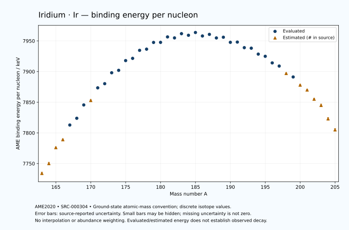

# Iridium — Atomic Masses and Reaction Energies

<!-- generated-by: sync-ame2020.mjs -->

**Dated evaluated data · scientific coverage remains partial.** 43 ground-state nuclides from AME2020. Values and uncertainties are transcribed from the retained unrounded analysis files; estimated quantities remain labelled.

- [Parent Iridium record](0077-Iridium-Ir.md) · [NUBASE states and decays](0077-Iridium-Ir-Nuclear-Evaluation.md)
- [Structured data](data/isotopes/0077-Iridium-Ir-AME2020-Evaluation.yaml)
- [Original mass table](../../data/catalog/sources/ame2020-mass_1.mas20.txt) · [Original reaction table](../../data/catalog/sources/ame2020-rct1.mas20.txt)
- [AME2020 methods](https://doi.org/10.1088/1674-1137/abddb0) (SRC-000303) · [Tables and definitions](https://doi.org/10.1088/1674-1137/abddaf) (SRC-000304)

## Reading the data

All table energies and uncertainties are in keV; binding energy is per nucleon. A # replaces a decimal point in the original estimated value. UNKNOWN (*) retains the source's not-calculable entry; it is neither zero nor automatically NOT APPLICABLE. Source lines are one-based in the retained files. Uncertainties remain those published by the evaluation, with no replacement by independent-mass quadrature.

Atomic-mass conventions apply. Qα is total decay energy, not alpha-particle kinetic energy. Positive Q alone does not establish a decay branch, rate or observation. He-4's source Qα of zero is a bookkeeping identity. These tables describe ground-state combinations, not isomer or excited-daughter transitions. Nuclear state and daughter lookups are explicit in the structured companion. The binding quantity follows [Z M(¹H) + N mₙ − M(A,Z)]c²/A; it has not been converted to a bare-nucleus convention.

## Mass and binding table

| Nuclide | N | Atomic mass excess / keV | AME binding per nucleon / keV | Mass-file line |
|---|---:|---|---|---:|
| Ir-163 | 86 | -5310# ± 400# | 7734# ± 2# | 2236 |
| Ir-164 | 87 | -7483# ± 316# | 7750# ± 2# | 2253 |
| Ir-165 | 88 | -11595# ± 158# | 7776# ± 1# | 2270 |
| Ir-166 | 89 | -13306# ± 201# | 7789# ± 1# | 2287 |
| Ir-167 | 90 | -17072.448 ± 18.346 | 7812.8254 ± 0.1099 | 2304 |
| Ir-168 | 91 | -18666.230 ± 55.216 | 7823.8509 ± 0.3287 | 2321 |
| Ir-169 | 92 | -22093.416 ± 23.307 | 7845.5944 ± 0.1379 | 2338 |
| Ir-170 | 93 | -23182# ± 101# | 7853# ± 1# | 2355 |
| Ir-171 | 94 | -26412.030 ± 38.466 | 7873.4895 ± 0.2249 | 2372 |
| Ir-172 | 95 | -27379.373 ± 32.402 | 7880.2637 ± 0.1884 | 2389 |
| Ir-173 | 96 | -30268.456 ± 10.542 | 7898.0680 ± 0.0609 | 2405 |
| Ir-174 | 97 | -30785.937 ± 11.221 | 7902.0377 ± 0.0645 | 2421 |
| Ir-175 | 98 | -33394.511 ± 12.384 | 7917.9112 ± 0.0708 | 2436 |
| Ir-176 | 99 | -33881.923 ± 8.085 | 7921.5522 ± 0.0459 | 2451 |
| Ir-177 | 100 | -36047.425 ± 19.760 | 7934.6328 ± 0.1116 | 2466 |
| Ir-178 | 101 | -36254.314 ± 18.821 | 7936.5630 ± 0.1057 | 2481 |
| Ir-179 | 102 | -38081.719 ± 9.771 | 7947.5248 ± 0.0546 | 2496 |
| Ir-180 | 103 | -37977.530 ± 21.706 | 7947.6337 ± 0.1206 | 2511 |
| Ir-181 | 104 | -39463.035 ± 5.245 | 7956.5242 ± 0.0290 | 2525 |
| Ir-182 | 105 | -39051.682 ± 20.967 | 7954.8948 ± 0.1152 | 2539 |
| Ir-183 | 106 | -40202.138 ± 24.672 | 7961.8176 ± 0.1348 | 2552 |
| Ir-184 | 107 | -39610.855 ± 27.945 | 7959.1992 ± 0.1519 | 2565 |
| Ir-185 | 108 | -40335.558 ± 27.945 | 7963.7226 ± 0.1511 | 2579 |
| Ir-186 | 109 | -39172.350 ± 16.526 | 7958.0473 ± 0.0888 | 2592 |
| Ir-187 | 110 | -39549.377 ± 27.945 | 7960.6692 ± 0.1494 | 2606 |
| Ir-188 | 111 | -38344.955 ± 9.423 | 7954.8512 ± 0.0501 | 2620 |
| Ir-189 | 112 | -38449.652 ± 12.576 | 7956.0214 ± 0.0665 | 2633 |
| Ir-190 | 113 | -36753.614 ± 1.370 | 7947.7017 ± 0.0072 | 2646 |
| Ir-191 | 114 | -36708.826 ± 1.310 | 7948.1144 ± 0.0069 | 2658 |
| Ir-192 | 115 | -34835.631 ± 1.314 | 7938.9999 ± 0.0068 | 2671 |
| Ir-193 | 116 | -34536.305 ± 1.327 | 7938.1346 ± 0.0069 | 2684 |
| Ir-194 | 117 | -32531.776 ± 1.332 | 7928.4885 ± 0.0069 | 2698 |
| Ir-195 | 118 | -31692.318 ± 1.333 | 7924.9160 ± 0.0068 | 2711 |
| Ir-196 | 119 | -29435.522 ± 38.414 | 7914.1487 ± 0.1960 | 2724 |
| Ir-197 | 120 | -28264.123 ± 20.110 | 7909.0003 ± 0.1021 | 2737 |
| Ir-198 | 121 | -25710# ± 200# | 7897# ± 1# | 2750 |
| Ir-199 | 122 | -24398.534 ± 41.054 | 7891.2066 ± 0.2063 | 2763 |
| Ir-200 | 123 | -21570# ± 196# | 7878# ± 1# | 2775 |
| Ir-201 | 124 | -19840# ± 200# | 7870# ± 1# | 2787 |
| Ir-202 | 125 | -16640# ± 300# | 7855# ± 1# | 2800 |
| Ir-203 | 126 | -14370# ± 400# | 7845# ± 2# | 2813 |
| Ir-204 | 127 | -9570# ± 400# | 7823# ± 2# | 2825 |
| Ir-205 | 128 | -5600# ± 500# | 7805# ± 2# | 2837 |

## Q-values and separation energies

| Nuclide | Qβ− / keV | Qα / keV | S₂n / keV | S₂p / keV | Reaction-file line |
|---|---|---|---|---|---:|
| Ir-163 | UNKNOWN (*) | 7069# ± 502# | UNKNOWN (*) | -954# ± 427# | 2235 |
| Ir-164 | UNKNOWN (*) | 6970# ± 100# | UNKNOWN (*) | -392# ± 375# | 2252 |
| Ir-165 | -11277# ± 430# | 6823# ± 50# | 22427# ± 430# | 171# ± 159# | 2269 |
| Ir-166 | -8523# ± 361# | 6722.3507 ± 5.5825 | 21965# ± 374# | 411# ± 208# | 2286 |
| Ir-167 | -10319# ± 307# | 6504.8887 ± 2.6357 | 21620# ± 159# | 991.0369 ± 29.8834 | 2303 |
| Ir-168 | -7656.1526 ± 140.3258 | 6381.2950 ± 8.5238 | 21503# ± 208# | 1406.8373 ± 104.0934 | 2320 |
| Ir-169 | -9629# ± 202# | 6141.0216 ± 3.6646 | 21163.6039 ± 29.6579 | 1838# ± 46# | 2337 |
| Ir-170 | -6883# ± 102# | 6230# ± 50# | 20659# ± 115# | 1965# ± 106# | 2354 |
| Ir-171 | -8945.4613 ± 89.6251 | 5997# ± 12# | 20461.2502 ± 44.9762 | 2580.7251 ± 40.1112 | 2371 |
| Ir-172 | -6272.7035 ± 34.0232 | 5990.5999 ± 10.0000 | 20340# ± 106# | 3053.3193 ± 34.3584 | 2388 |
| Ir-173 | -8331.6974 ± 64.3014 | 5715.8754 ± 9.0040 | 19999.0618 ± 39.8846 | 3596.1130 ± 29.8670 | 2404 |
| Ir-174 | -5468.3293 ± 15.2578 | 5693.1435 ± 16.0159 | 19549.1995 ± 34.2904 | 3797.0403 ± 37.2958 | 2420 |
| Ir-175 | -7685.8265 ± 22.3572 | 5430.8581 ± 30.5661 | 19268.6912 ± 16.2634 | 4418.5832 ± 30.5661 | 2435 |
| Ir-176 | -4948.0041 ± 15.0657 | 5260.0002 ± 35.5908 | 19238.6219 ± 13.8308 | 4786.7637 ± 29.0910 | 2450 |
| Ir-177 | -6676.9880 ± 24.8010 | 5081.5294 ± 34.2253 | 18795.5498 ± 23.3202 | 5337.0549 ± 34.2253 | 2465 |
| Ir-178 | -4256.8282 ± 21.3752 | 4993.8714 ± 33.6917 | 18515.0273 ± 20.4839 | 5769.3656 ± 33.6917 | 2480 |
| Ir-179 | -5813.5920 ± 12.6133 | 4781.6767 ± 29.6037 | 18176.9308 ± 22.0437 | 6390.4863 ± 29.6037 | 2495 |
| Ir-180 | -3547.6546 ± 23.9205 | 4660.4446 ± 35.3847 | 17865.8522 ± 28.7295 | 6902.0144 ± 35.3847 | 2510 |
| Ir-181 | -5081.5379 ± 14.6597 | 4381.2240 ± 28.4328 | 17523.9521 ± 11.0896 | 7456.6652 ± 25.1910 | 2524 |
| Ir-182 | -2883.2620 ± 24.7202 | 4176.8591 ± 34.9362 | 17216.7888 ± 30.1792 | 7792.2611 ± 29.9540 | 2538 |
| Ir-183 | -4428.9417 ± 28.4743 | 3957.2578 ± 34.8680 | 16881.7393 ± 25.2233 | 8262.6688 ± 27.6798 | 2551 |
| Ir-184 | -2278.3688 ± 31.5957 | 3801.5924 ± 35.1928 | 16701.8089 ± 34.9362 | 8742.6535 ± 105.7425 | 2564 |
| Ir-185 | -3647.4137 ± 38.0554 | 3756.9382 ± 30.6331 | 16276.0554 ± 37.2775 | 9103.8371 ± 29.0769 | 2578 |
| Ir-186 | -1307.9030 ± 27.3122 | 3848.8777 ± 103.3133 | 15704.1312 ± 32.4655 | 9530.4731 ± 17.0698 | 2591 |
| Ir-187 | -2864.0151 ± 36.8802 | 3835.3702 ± 29.0769 | 15356.4551 ± 39.5199 | 10308.2713 ± 27.9568 | 2605 |
| Ir-188 | -523.9860 ± 8.6863 | 3449.9480 ± 10.3071 | 15315.2413 ± 19.0234 | 10995.5773 ± 9.4188 | 2619 |
| Ir-189 | -1980.2470 ± 13.6363 | 2944.4793 ± 12.5889 | 15042.9118 ± 30.6442 | 11811.0460 ± 12.5698 | 2632 |
| Ir-190 | 552.8893 ± 1.2822 | 2748.7900 ± 1.4844 | 14551.2950 ± 9.4954 | 12314.6762 ± 1.3045 | 2645 |
| Ir-191 | -1010.4903 ± 3.6360 | 2082.8062 ± 1.2410 | 14401.8102 ± 12.5409 | 13307.6718 ± 8.2449 | 2657 |
| Ir-192 | 1452.8946 ± 2.2739 | 1756.3336 ± 1.2457 | 14224.6525 ± 0.4146 | 13830.5583 ± 4.5931 | 2670 |
| Ir-193 | -56.6276 ± 0.2997 | 1017.8763 ± 8.2476 | 13970.1143 ± 0.2274 | 14763.8388 ± 10.2829 | 2683 |
| Ir-194 | 2228.3252 ± 1.2569 | 626.3225 ± 4.5946 | 13838.7816 ± 0.2281 | 15520.8904 ± 70.8061 | 2697 |
| Ir-195 | 1101.5601 ± 1.2637 | 233.1739 ± 10.2837 | 13298.6497 ± 0.1255 | 16038.6192 ± 39.1455 | 2710 |
| Ir-196 | 3209.0164 ± 38.4111 | -271.6095 ± 80.5444 | 13046.3815 ± 38.4320 | 16753# ± 204# | 2723 |
| Ir-197 | 2155.6519 ± 20.1061 | -457.3975 ± 43.9886 | 12714.4407 ± 20.1466 | 17282# ± 301# | 2736 |
| Ir-198 | 4194# ± 200# | -875# ± 283# | 12417# ± 204# | 17929# ± 361# | 2749 |
| Ir-199 | 2990.1656 ± 41.0030 | -1263# ± 303# | 12277.0475 ± 45.6180 | 18626# ± 303# | 2762 |
| Ir-200 | 5030# ± 197# | -1635# ± 358# | 12002# ± 280# | 19157# ± 445# | 2774 |
| Ir-201 | 3901# ± 206# | -1914# ± 361# | 11584# ± 204# | 19688# ± 447# | 2786 |
| Ir-202 | 6052# ± 301# | -2075# ± 500# | 11213# ± 358# | UNKNOWN (*) | 2799 |
| Ir-203 | 5140# ± 447# | -2065# ± 565# | 10673# ± 447# | UNKNOWN (*) | 2812 |
| Ir-204 | 8050# ± 447# | UNKNOWN (*) | 9073# ± 500# | UNKNOWN (*) | 2824 |
| Ir-205 | 7220# ± 583# | UNKNOWN (*) | 7373# ± 640# | UNKNOWN (*) | 2836 |

Qβ− comes from the mass-file line in the first table. The other three columns come from the reaction-file line. Definitions and original source strings are retained in the structured data.

## Binding-energy chart

Discrete source values and source-reported uncertainties. No interpolation, natural-abundance weighting or observed-decay claim is implied. This quantitative chart supplements the 22 separate illustrative panels.

## Remaining review

Later measurements, state-specific decay branches, isomer Q-values, additional reaction channels and full claim-level review remain open. Existing authored values retain their own provenance; this companion does not overwrite them.
