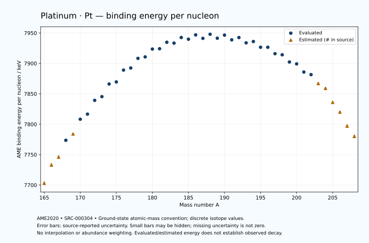

# Platinum — Atomic Masses and Reaction Energies

<!-- generated-by: sync-ame2020.mjs -->

**Dated evaluated data · scientific coverage remains partial.** 44 ground-state nuclides from AME2020. Values and uncertainties are transcribed from the retained unrounded analysis files; estimated quantities remain labelled.

- [Parent Platinum record](0078-Platinum-Pt.md) · [NUBASE states and decays](0078-Platinum-Pt-Nuclear-Evaluation.md)
- [Structured data](data/isotopes/0078-Platinum-Pt-AME2020-Evaluation.yaml)
- [Original mass table](../../data/catalog/sources/ame2020-mass_1.mas20.txt) · [Original reaction table](../../data/catalog/sources/ame2020-rct1.mas20.txt)
- [AME2020 methods](https://doi.org/10.1088/1674-1137/abddb0) (SRC-000303) · [Tables and definitions](https://doi.org/10.1088/1674-1137/abddaf) (SRC-000304)

## Reading the data

All table energies and uncertainties are in keV; binding energy is per nucleon. A # replaces a decimal point in the original estimated value. UNKNOWN (*) retains the source's not-calculable entry; it is neither zero nor automatically NOT APPLICABLE. Source lines are one-based in the retained files. Uncertainties remain those published by the evaluation, with no replacement by independent-mass quadrature.

Atomic-mass conventions apply. Qα is total decay energy, not alpha-particle kinetic energy. Positive Q alone does not establish a decay branch, rate or observation. He-4's source Qα of zero is a bookkeeping identity. These tables describe ground-state combinations, not isomer or excited-daughter transitions. Nuclear state and daughter lookups are explicit in the structured companion. The binding quantity follows [Z M(¹H) + N mₙ − M(A,Z)]c²/A; it has not been converted to a bare-nucleus convention.

## Mass and binding table

| Nuclide | N | Atomic mass excess / keV | AME binding per nucleon / keV | Mass-file line |
|---|---:|---|---|---:|
| Pt-165 | 87 | -318# ± 400# | 7703# ± 2# | 2271 |
| Pt-166 | 88 | -4783# ± 300# | 7733# ± 2# | 2288 |
| Pt-167 | 89 | -6753# ± 306# | 7746# ± 2# | 2305 |
| Pt-168 | 90 | -11010.078 ± 149.934 | 7773.6217 ± 0.8925 | 2322 |
| Pt-169 | 91 | -12464# ± 200# | 7784# ± 1# | 2339 |
| Pt-170 | 92 | -16299.202 ± 18.246 | 7808.2365 ± 0.1073 | 2356 |
| Pt-171 | 93 | -17466.569 ± 80.951 | 7816.6017 ± 0.4734 | 2373 |
| Pt-172 | 94 | -21106.670 ± 10.376 | 7839.2460 ± 0.0603 | 2390 |
| Pt-173 | 95 | -21936.758 ± 63.431 | 7845.3856 ± 0.3667 | 2406 |
| Pt-174 | 96 | -25317.608 ± 10.338 | 7866.1143 ± 0.0594 | 2422 |
| Pt-175 | 97 | -25708.684 ± 18.614 | 7869.5216 ± 0.1064 | 2437 |
| Pt-176 | 98 | -28933.918 ± 12.712 | 7888.9934 ± 0.0722 | 2452 |
| Pt-177 | 99 | -29370.437 ± 14.988 | 7892.4896 ± 0.0847 | 2467 |
| Pt-178 | 100 | -31997.486 ± 10.133 | 7908.2530 ± 0.0569 | 2482 |
| Pt-179 | 101 | -32268.127 ± 7.977 | 7910.6759 ± 0.0446 | 2497 |
| Pt-180 | 102 | -34429.875 ± 10.051 | 7923.5781 ± 0.0558 | 2512 |
| Pt-181 | 103 | -34381.497 ± 13.689 | 7924.1271 ± 0.0756 | 2526 |
| Pt-182 | 104 | -36168.420 ± 13.095 | 7934.7541 ± 0.0719 | 2540 |
| Pt-183 | 105 | -35773.197 ± 14.216 | 7933.3406 ± 0.0777 | 2553 |
| Pt-184 | 106 | -37332.486 ± 14.744 | 7942.5649 ± 0.0801 | 2566 |
| Pt-185 | 107 | -36688.144 ± 25.832 | 7939.7779 ± 0.1396 | 2580 |
| Pt-186 | 108 | -37864.447 ± 21.745 | 7946.8094 ± 0.1169 | 2593 |
| Pt-187 | 109 | -36685.361 ± 24.067 | 7941.1699 ± 0.1287 | 2607 |
| Pt-188 | 110 | -37820.970 ± 5.305 | 7947.9027 ± 0.0282 | 2621 |
| Pt-189 | 111 | -36469.405 ± 10.090 | 7941.4045 ± 0.0534 | 2634 |
| Pt-190 | 112 | -37306.504 ± 0.657 | 7946.4941 ± 0.0035 | 2647 |
| Pt-191 | 113 | -35698.336 ± 4.127 | 7938.7279 ± 0.0216 | 2659 |
| Pt-192 | 114 | -36288.525 ± 2.570 | 7942.4923 ± 0.0134 | 2672 |
| Pt-193 | 115 | -34479.677 ± 1.359 | 7933.7875 ± 0.0070 | 2685 |
| Pt-194 | 116 | -34760.101 ± 0.496 | 7935.9420 ± 0.0026 | 2699 |
| Pt-195 | 117 | -32793.878 ± 0.503 | 7926.5530 ± 0.0026 | 2712 |
| Pt-196 | 118 | -32644.538 ± 0.510 | 7926.5297 ± 0.0026 | 2725 |
| Pt-197 | 119 | -30419.775 ± 0.536 | 7915.9714 ± 0.0027 | 2738 |
| Pt-198 | 120 | -29904.018 ± 2.100 | 7914.1512 ± 0.0106 | 2751 |
| Pt-199 | 121 | -27388.700 ± 2.159 | 7902.3011 ± 0.0109 | 2764 |
| Pt-200 | 122 | -26599.178 ± 20.110 | 7899.1986 ± 0.1006 | 2776 |
| Pt-201 | 123 | -23740.705 ± 50.103 | 7885.8337 ± 0.2493 | 2788 |
| Pt-202 | 124 | -22692.128 ± 25.150 | 7881.5609 ± 0.1245 | 2801 |
| Pt-203 | 125 | -19510# ± 200# | 7867# ± 1# | 2814 |
| Pt-204 | 126 | -17620# ± 200# | 7859# ± 1# | 2826 |
| Pt-205 | 127 | -12820# ± 300# | 7836# ± 1# | 2838 |
| Pt-206 | 128 | -9240# ± 300# | 7820# ± 1# | 2850 |
| Pt-207 | 129 | -4140# ± 400# | 7797# ± 2# | 2862 |
| Pt-208 | 130 | -500# ± 400# | 7780# ± 2# | 2874 |

## Q-values and separation energies

| Nuclide | Qβ− / keV | Qα / keV | S₂n / keV | S₂p / keV | Reaction-file line |
|---|---|---|---|---|---:|
| Pt-165 | UNKNOWN (*) | 7453.0050 ± 14.3485 | UNKNOWN (*) | -1440# ± 500# | 2270 |
| Pt-166 | UNKNOWN (*) | 7292.2662 ± 7.2334 | UNKNOWN (*) | -1064# ± 335# | 2287 |
| Pt-167 | UNKNOWN (*) | 7158.0892 ± 61.5773 | 22578# ± 504# | -415# ± 366# | 2304 |
| Pt-168 | -13540# ± 427# | 6989.7297 ± 3.0733 | 22370# ± 335# | 156.4937 ± 151.0067 | 2321 |
| Pt-169 | -10676# ± 359# | 6857.6107 ± 5.1214 | 21853# ± 366# | 543# ± 216# | 2338 |
| Pt-170 | -12596# ± 202# | 6707.4081 ± 3.1863 | 21431.7606 ± 151.0403 | 882.1496 ± 20.7577 | 2355 |
| Pt-171 | -9904.2655 ± 83.5586 | 6607.3757 ± 3.0768 | 21145# ± 216# | 1321.5265 ± 85.0051 | 2372 |
| Pt-172 | -11788.6592 ± 57.1082 | 6463.4090 ± 4.0389 | 20950.1038 ± 20.9871 | 1758.9204 ± 14.2262 | 2389 |
| Pt-173 | -9104.7415 ± 67.3903 | 6361.3102 ± 57.8850 | 20612.8258 ± 102.8424 | 2217.4626 ± 66.0039 | 2405 |
| Pt-174 | -11259# ± 102# | 6183.1682 ± 3.4119 | 20353.5738 ± 14.6296 | 2651.9090 ± 16.4267 | 2421 |
| Pt-175 | -8304.9980 ± 42.8203 | 6163.6377 ± 3.9932 | 19914.5621 ± 66.1062 | 2848.3763 ± 23.8794 | 2436 |
| Pt-176 | -10412.9516 ± 35.5363 | 5884.8064 ± 2.0421 | 19758.9471 ± 16.3854 | 3516.4773 ± 16.3207 | 2451 |
| Pt-177 | -7824.7003 ± 17.9991 | 5642.8977 ± 2.7340 | 19804.3883 ± 23.8973 | 3843.0182 ± 19.0576 | 2466 |
| Pt-178 | -9694.4567 ± 14.4108 | 5572.9819 ± 2.2037 | 19206.2032 ± 16.2451 | 4444.2432 ± 14.9009 | 2481 |
| Pt-179 | -7279.5556 ± 14.1567 | 5412.3174 ± 9.4588 | 19040.3268 ± 16.9753 | 4889.6214 ± 16.6436 | 2496 |
| Pt-180 | -8804.2290 ± 11.1207 | 5276.3933 ± 5.0409 | 18575.0258 ± 14.2533 | 5463.5742 ± 16.9229 | 2511 |
| Pt-181 | -6510.3575 ± 24.2164 | 5150.0349 ± 5.1132 | 18256.0061 ± 15.8387 | 5939.3020 ± 20.6808 | 2525 |
| Pt-182 | -7864.4447 ± 22.8812 | 4950.9069 ± 5.0470 | 17881.1813 ± 16.4926 | 6390.1649 ± 20.4591 | 2539 |
| Pt-183 | -5581.7092 ± 17.0554 | 4822.0248 ± 8.7991 | 17534.3356 ± 19.7320 | 6801.1710 ± 29.0537 | 2552 |
| Pt-184 | -7013.7724 ± 26.7122 | 4598.7954 ± 8.0883 | 17306.7021 ± 19.7169 | 7301.3195 ± 26.2724 | 2565 |
| Pt-185 | -4829.9942 ± 25.9635 | 4436.9081 ± 10.0078 | 17057.5833 ± 29.4853 | 7602.3262 ± 56.0732 | 2579 |
| Pt-186 | -6149.5913 ± 30.2074 | 4319.7459 ± 18.1557 | 16674.5970 ± 26.2724 | 8189.8241 ± 21.7613 | 2592 |
| Pt-187 | -3656.5811 ± 27.4478 | 4553.4825 ± 55.1336 | 16139.8537 ± 35.3064 | 8457.3955 ± 24.0818 | 2606 |
| Pt-188 | -5449.6549 ± 5.9528 | 4006.6799 ± 5.2746 | 16099.1583 ± 22.3831 | 9398.8800 ± 5.3067 | 2620 |
| Pt-189 | -2887.4471 ± 22.4737 | 3911.5870 ± 10.1090 | 15926.6799 ± 26.0969 | 9828.3323 ± 10.0846 | 2633 |
| Pt-190 | -4472.9637 ± 3.5086 | 3268.6121 ± 0.5873 | 15628.1703 ± 5.2999 | 10747.1446 ± 0.5705 | 2646 |
| Pt-191 | -1900.4257 ± 6.4260 | 3095.7631 ± 4.0749 | 15371.5670 ± 10.8270 | 11289.4766 ± 4.0460 | 2658 |
| Pt-192 | -3516.3415 ± 15.6174 | 2423.8600 ± 2.5347 | 15124.6578 ± 2.5200 | 12158.6423 ± 2.4931 | 2671 |
| Pt-193 | -1074.8477 ± 8.7676 | 2082.2089 ± 1.2149 | 14923.9770 ± 3.6226 | 12662.3800 ± 1.1966 | 2684 |
| Pt-194 | -2548.1518 ± 2.1174 | 1522.8078 ± 0.4791 | 14614.2122 ± 2.5317 | 13455.7405 ± 2.2722 | 2698 |
| Pt-195 | -226.8175 ± 0.9998 | 1176.4449 ± 0.5047 | 14456.8375 ± 1.2902 | 13977.4196 ± 2.2806 | 2711 |
| Pt-196 | -1505.8204 ± 2.9605 | 812.8492 ± 2.2784 | 14027.0727 ± 0.1743 | 14787.3039 ± 2.3682 | 2724 |
| Pt-197 | 719.9769 ± 0.5022 | 549.7104 ± 2.2973 | 13768.5324 ± 0.2900 | 15486.1205 ± 55.8922 | 2737 |
| Pt-198 | -323.2251 ± 2.0595 | 106.2426 ± 3.1433 | 13402.1159 ± 2.0739 | 16204.8372 ± 40.0000 | 2750 |
| Pt-199 | 1705.0525 ± 2.1201 | -302.0194 ± 55.9313 | 13111.5612 ± 2.1222 | 16887# ± 200# | 2763 |
| Pt-200 | 640.9158 ± 33.4386 | -746.9711 ± 44.7214 | 12837.7962 ± 20.0000 | 17577# ± 201# | 2775 |
| Pt-201 | 2660.0000 ± 50.0000 | -1086# ± 206# | 12494.6419 ± 50.1488 | 18048# ± 206# | 2787 |
| Pt-202 | 1660.8540 ± 34.2759 | -1517# ± 202# | 12235.5861 ± 32.2017 | 18720# ± 301# | 2800 |
| Pt-203 | 3633# ± 200# | -1665# ± 283# | 11912# ± 206# | 19248# ± 361# | 2813 |
| Pt-204 | 2770# ± 283# | -1495# ± 361# | 11071# ± 202# | 19668# ± 447# | 2825 |
| Pt-205 | 5750# ± 361# | -405# ± 424# | 9453# ± 361# | 20128# ± 500# | 2837 |
| Pt-206 | 4950# ± 424# | 865# ± 500# | 7763# ± 361# | UNKNOWN (*) | 2849 |
| Pt-207 | 6501# ± 500# | 706# ± 565# | 7462# ± 500# | UNKNOWN (*) | 2861 |
| Pt-208 | 5410# ± 500# | UNKNOWN (*) | 7402# ± 500# | UNKNOWN (*) | 2873 |

Qβ− comes from the mass-file line in the first table. The other three columns come from the reaction-file line. Definitions and original source strings are retained in the structured data.

## Binding-energy chart

Discrete source values and source-reported uncertainties. No interpolation, natural-abundance weighting or observed-decay claim is implied. This quantitative chart supplements the 22 separate illustrative panels.

## Remaining review

Later measurements, state-specific decay branches, isomer Q-values, additional reaction channels and full claim-level review remain open. Existing authored values retain their own provenance; this companion does not overwrite them.
