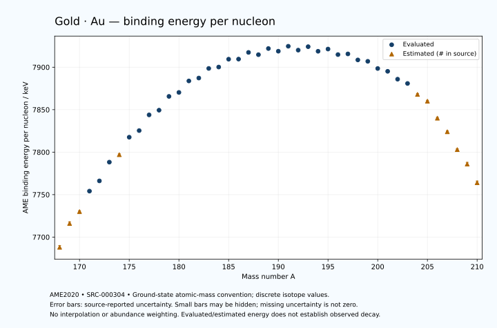

# Gold — Atomic Masses and Reaction Energies

<!-- generated-by: sync-ame2020.mjs -->

**Dated evaluated data · scientific coverage remains partial.** 43 ground-state nuclides from AME2020. Values and uncertainties are transcribed from the retained unrounded analysis files; estimated quantities remain labelled.

- [Parent Gold record](0079-Gold-Au.md) · [NUBASE states and decays](0079-Gold-Au-Nuclear-Evaluation.md)
- [Structured data](data/isotopes/0079-Gold-Au-AME2020-Evaluation.yaml)
- [Original mass table](../../data/catalog/sources/ame2020-mass_1.mas20.txt) · [Original reaction table](../../data/catalog/sources/ame2020-rct1.mas20.txt)
- [AME2020 methods](https://doi.org/10.1088/1674-1137/abddb0) (SRC-000303) · [Tables and definitions](https://doi.org/10.1088/1674-1137/abddaf) (SRC-000304)

## Reading the data

All table energies and uncertainties are in keV; binding energy is per nucleon. A # replaces a decimal point in the original estimated value. UNKNOWN (*) retains the source's not-calculable entry; it is neither zero nor automatically NOT APPLICABLE. Source lines are one-based in the retained files. Uncertainties remain those published by the evaluation, with no replacement by independent-mass quadrature.

Atomic-mass conventions apply. Qα is total decay energy, not alpha-particle kinetic energy. Positive Q alone does not establish a decay branch, rate or observation. He-4's source Qα of zero is a bookkeeping identity. These tables describe ground-state combinations, not isomer or excited-daughter transitions. Nuclear state and daughter lookups are explicit in the structured companion. The binding quantity follows [Z M(¹H) + N mₙ − M(A,Z)]c²/A; it has not been converted to a bare-nucleus convention.

## Mass and binding table

| Nuclide | N | Atomic mass excess / keV | AME binding per nucleon / keV | Mass-file line |
|---|---:|---|---|---:|
| Au-168 | 89 | 2530# ± 400# | 7688# ± 2# | 2323 |
| Au-169 | 90 | -1788# ± 298# | 7716# ± 2# | 2340 |
| Au-170 | 91 | -3703# ± 201# | 7730# ± 1# | 2357 |
| Au-171 | 92 | -7562.303 ± 20.713 | 7754.1069 ± 0.1211 | 2374 |
| Au-172 | 93 | -9318.011 ± 56.158 | 7766.1587 ± 0.3265 | 2391 |
| Au-173 | 94 | -12832.017 ± 22.783 | 7788.2348 ± 0.1317 | 2407 |
| Au-174 | 95 | -14058# ± 102# | 7797# ± 1# | 2423 |
| Au-175 | 96 | -17403.686 ± 38.563 | 7817.5939 ± 0.2204 | 2438 |
| Au-176 | 97 | -18520.967 ± 33.185 | 7825.3837 ± 0.1885 | 2453 |
| Au-177 | 98 | -21545.736 ± 9.968 | 7843.8623 ± 0.0563 | 2468 |
| Au-178 | 99 | -22303.029 ± 10.246 | 7849.3946 ± 0.0576 | 2483 |
| Au-179 | 100 | -24988.572 ± 11.696 | 7865.6374 ± 0.0653 | 2498 |
| Au-180 | 101 | -25625.646 ± 4.759 | 7870.3194 ± 0.0264 | 2513 |
| Au-181 | 102 | -27871.140 ± 19.976 | 7883.8359 ± 0.1104 | 2527 |
| Au-182 | 103 | -28303.976 ± 18.764 | 7887.2442 ± 0.1031 | 2541 |
| Au-183 | 104 | -30191.488 ± 9.423 | 7898.5644 ± 0.0515 | 2554 |
| Au-184 | 105 | -30318.714 ± 22.275 | 7900.1947 ± 0.1211 | 2567 |
| Au-185 | 106 | -31858.150 ± 2.608 | 7909.4410 ± 0.0141 | 2581 |
| Au-186 | 107 | -31714.856 ± 20.967 | 7909.5409 ± 0.1127 | 2594 |
| Au-187 | 108 | -33028.780 ± 22.499 | 7917.4323 ± 0.1203 | 2608 |
| Au-188 | 109 | -32371.315 ± 2.701 | 7914.7537 ± 0.0144 | 2622 |
| Au-189 | 110 | -33581.958 ± 20.081 | 7921.9876 ± 0.1063 | 2635 |
| Au-190 | 111 | -32833.540 ± 3.447 | 7918.8345 ± 0.0181 | 2648 |
| Au-191 | 112 | -33797.910 ± 4.926 | 7924.6819 ± 0.0258 | 2660 |
| Au-192 | 113 | -32772.184 ± 15.827 | 7920.1033 ± 0.0824 | 2673 |
| Au-193 | 114 | -33404.829 ± 8.674 | 7924.1648 ± 0.0449 | 2686 |
| Au-194 | 115 | -32211.950 ± 2.118 | 7918.7744 ± 0.0109 | 2700 |
| Au-195 | 116 | -32567.061 ± 1.119 | 7921.3778 ± 0.0057 | 2713 |
| Au-196 | 117 | -31138.718 ± 2.962 | 7914.8553 ± 0.0151 | 2726 |
| Au-197 | 118 | -31139.751 ± 0.542 | 7915.6548 ± 0.0028 | 2739 |
| Au-198 | 119 | -29580.793 ± 0.540 | 7908.5675 ± 0.0027 | 2752 |
| Au-199 | 120 | -29093.752 ± 0.542 | 7906.9379 ± 0.0027 | 2765 |
| Au-200 | 121 | -27240.094 ± 26.717 | 7898.4915 ± 0.1336 | 2777 |
| Au-201 | 122 | -26400.705 ± 3.218 | 7895.1752 ± 0.0160 | 2789 |
| Au-202 | 123 | -24352.982 ± 23.287 | 7885.9100 ± 0.1153 | 2802 |
| Au-203 | 124 | -23143.444 ± 3.083 | 7880.8650 ± 0.0152 | 2815 |
| Au-204 | 125 | -20390# ± 200# | 7868# ± 1# | 2827 |
| Au-205 | 126 | -18570# ± 200# | 7860# ± 1# | 2839 |
| Au-206 | 127 | -14190# ± 300# | 7840# ± 1# | 2851 |
| Au-207 | 128 | -10640# ± 300# | 7824# ± 1# | 2863 |
| Au-208 | 129 | -5910# ± 300# | 7803# ± 1# | 2875 |
| Au-209 | 130 | -2230# ± 400# | 7786# ± 2# | 2887 |
| Au-210 | 131 | 2680# ± 400# | 7764# ± 2# | 2899 |

## Q-values and separation energies

| Nuclide | Qβ− / keV | Qα / keV | S₂n / keV | S₂p / keV | Reaction-file line |
|---|---|---|---|---|---:|
| Au-168 | UNKNOWN (*) | 7588# ± 510# | UNKNOWN (*) | -1258# ± 447# | 2322 |
| Au-169 | UNKNOWN (*) | 7382# ± 337# | UNKNOWN (*) | -706# ± 299# | 2339 |
| Au-170 | -9119# ± 362# | 7177.3107 ± 15.3045 | 22376# ± 447# | -385# ± 208# | 2356 |
| Au-171 | -10901# ± 307# | 7085.2291 ± 10.6974 | 21916# ± 299# | 46.8294 ± 31.1779 | 2373 |
| Au-172 | -8256.6495 ± 140.8350 | 6923.3037 ± 10.2385 | 21757# ± 209# | 714# ± 116# | 2390 |
| Au-173 | -10171# ± 202# | 6836.4832 ± 4.9138 | 21412.3498 ± 30.7882 | 997.9290 ± 44.7070 | 2406 |
| Au-174 | -7417# ± 102# | 6699.2937 ± 7.2378 | 20883# ± 116# | 1257# ± 107# | 2422 |
| Au-175 | -9434.2436 ± 89.7876 | 6583.4278 ± 2.7292 | 20714.3056 ± 44.7902 | 1713.1727 ± 39.9778 | 2437 |
| Au-176 | -6736.3283 ± 34.9978 | 6433.4907 ± 7.1631 | 20605# ± 107# | 2312.9722 ± 35.0306 | 2452 |
| Au-177 | -8769.9135 ± 85.3061 | 6297.8037 ± 3.8888 | 20284.6860 ± 39.8303 | 2729.1675 ± 15.8974 | 2467 |
| Au-178 | -5987.6832 ± 14.8566 | 6057.9921 ± 4.5751 | 19924.6981 ± 34.7306 | 2999.0484 ± 13.0522 | 2482 |
| Au-179 | -8055.6480 ± 30.4559 | 5981.0233 ± 5.0452 | 19585.4716 ± 15.3668 | 3519.0893 ± 22.9618 | 2497 |
| Au-180 | -5375.1330 ± 13.5105 | 5831.3605 ± 6.7668 | 19465.2535 ± 11.2975 | 3949.2746 ± 19.4130 | 2512 |
| Au-181 | -7210.0126 ± 25.2123 | 5751.3689 ± 2.9298 | 19025.2042 ± 23.1479 | 4367.3627 ± 22.2375 | 2526 |
| Au-182 | -4727.0905 ± 21.1645 | 5525.4222 ± 4.4407 | 18820.9656 ± 19.3579 | 4904.3880 ± 28.6923 | 2540 |
| Au-183 | -6386.8322 ± 11.7891 | 5465.3158 ± 2.9369 | 18462.9839 ± 22.0871 | 5306.3945 ± 10.7849 | 2553 |
| Au-184 | -3973.9269 ± 24.2296 | 5233.8999 ± 5.0000 | 18157.3744 ± 29.1247 | 5844.9737 ± 30.5906 | 2566 |
| Au-185 | -5674.4989 ± 13.8859 | 5179.9695 ± 4.5508 | 17809.2983 ± 9.7777 | 6233.9535 ± 24.8094 | 2580 |
| Au-186 | -3175.7972 ± 23.9866 | 4911.9106 ± 14.0238 | 17538.7782 ± 30.5906 | 6681.9429 ± 34.9362 | 2593 |
| Au-187 | -4910.2713 ± 25.9171 | 4748.4422 ± 30.1607 | 17313.2667 ± 22.6497 | 7271.1648 ± 35.8764 | 2607 |
| Au-188 | -2172.9634 ± 7.3046 | 4814.6247 ± 28.0751 | 16799.0947 ± 21.1405 | 7776.9064 ± 16.7449 | 2621 |
| Au-189 | -3955.5800 ± 37.4009 | 4328.6837 ± 34.4117 | 16695.8139 ± 30.1573 | 8610.5236 ± 34.4117 | 2634 |
| Au-190 | -1462.9150 ± 16.2760 | 3913.8945 ± 16.8811 | 16604.8614 ± 4.3790 | 9066.5266 ± 10.0338 | 2647 |
| Au-191 | -3206.0616 ± 22.7103 | 3326.5503 ± 28.3757 | 16358.5884 ± 20.6766 | 9926.2003 ± 13.5063 | 2659 |
| Au-192 | -760.7028 ± 22.1777 | 3147.8557 ± 18.4063 | 16081.2801 ± 16.1983 | 10596.5116 ± 15.7874 | 2672 |
| Au-193 | -2342.6641 ± 14.3702 | 2619.9072 ± 15.2702 | 15749.5549 ± 9.9751 | 11273.9450 ± 8.7602 | 2685 |
| Au-194 | -27.9978 ± 3.5809 | 2116.7489 ± 2.4775 | 15582.4019 ± 15.9614 | 11954.2610 ± 2.4470 | 2699 |
| Au-195 | -1553.7190 ± 23.1562 | 1716.8497 ± 1.5924 | 15304.8677 ± 8.7319 | 12608.6984 ± 1.6065 | 2712 |
| Au-196 | 687.2263 ± 3.1176 | 1271.9973 ± 3.2059 | 15069.4041 ± 3.5827 | 13184.8835 ± 3.2132 | 2725 |
| Au-197 | -599.5206 ± 3.2022 | 971.6373 ± 1.3523 | 14715.3268 ± 1.1333 | 14025.3754 ± 1.3581 | 2738 |
| Au-198 | 1373.5226 ± 0.4905 | 526.0677 ± 1.3574 | 14584.7113 ± 2.9397 | 14723.2133 ± 38.4147 | 2751 |
| Au-199 | 452.3142 ± 0.6126 | 173.6501 ± 1.3597 | 14096.6369 ± 0.1083 | 15407.5716 ± 20.1058 | 2764 |
| Au-200 | 2263.1737 ± 26.7188 | -229.4880 ± 46.7912 | 13801.9371 ± 26.7209 | 16108# ± 202# | 2776 |
| Au-201 | 1261.8237 ± 3.1471 | -561.4987 ± 20.3629 | 13449.5894 ± 3.2405 | 16580.1135 ± 41.1782 | 2788 |
| Au-202 | 2992.3278 ± 23.2980 | -1068# ± 202# | 13255.5242 ± 35.4411 | 17361# ± 197# | 2801 |
| Au-203 | 2125.7592 ± 3.4514 | -1169.8255 ± 41.1689 | 12885.3743 ± 4.3757 | 17881# ± 200# | 2814 |
| Au-204 | 4300# ± 200# | -1245# ± 280# | 12180# ± 201# | 18328# ± 361# | 2826 |
| Au-205 | 3717# ± 200# | -1155# ± 283# | 11569# ± 200# | 18778# ± 447# | 2838 |
| Au-206 | 6755# ± 301# | 25# ± 424# | 9943# ± 361# | 19198# ± 500# | 2850 |
| Au-207 | 5847# ± 301# | 1305# ± 500# | 8213# ± 361# | 19618# ± 583# | 2862 |
| Au-208 | 7355# ± 302# | 1235# ± 500# | 7863# ± 424# | UNKNOWN (*) | 2874 |
| Au-209 | 6380# ± 427# | 945# ± 640# | 7732# ± 500# | UNKNOWN (*) | 2886 |
| Au-210 | 7980# ± 447# | UNKNOWN (*) | 7552# ± 500# | UNKNOWN (*) | 2898 |

Qβ− comes from the mass-file line in the first table. The other three columns come from the reaction-file line. Definitions and original source strings are retained in the structured data.

## Binding-energy chart

Discrete source values and source-reported uncertainties. No interpolation, natural-abundance weighting or observed-decay claim is implied. This quantitative chart supplements the 22 separate illustrative panels.

## Remaining review

Later measurements, state-specific decay branches, isomer Q-values, additional reaction channels and full claim-level review remain open. Existing authored values retain their own provenance; this companion does not overwrite them.
