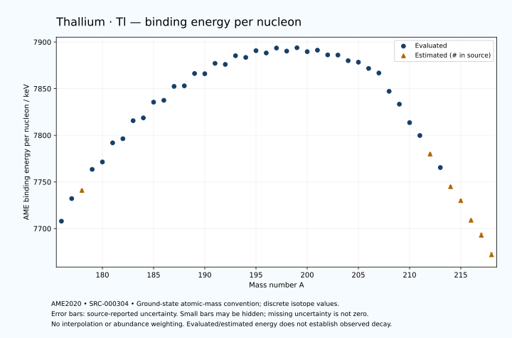

# Thallium — Atomic Masses and Reaction Energies

<!-- generated-by: sync-ame2020.mjs -->

**Dated evaluated data · scientific coverage remains partial.** 43 ground-state nuclides from AME2020. Values and uncertainties are transcribed from the retained unrounded analysis files; estimated quantities remain labelled.

- [Parent Thallium record](0081-Thallium-Tl.md) · [NUBASE states and decays](0081-Thallium-Tl-Nuclear-Evaluation.md)
- [Structured data](data/isotopes/0081-Thallium-Tl-AME2020-Evaluation.yaml)
- [Original mass table](../../data/catalog/sources/ame2020-mass_1.mas20.txt) · [Original reaction table 1](../../data/catalog/sources/ame2020-rct1.mas20.txt) · [Original reaction table 2](../../data/catalog/sources/ame2020-rct2.mas20.txt)
- [AME2020 methods](https://doi.org/10.1088/1674-1137/abddb0) (SRC-000303) · [Tables and definitions](https://doi.org/10.1088/1674-1137/abddaf) (SRC-000304)

## Reading the data

All table energies and uncertainties are in keV; binding energy is per nucleon. A # replaces a decimal point in the original estimated value. UNKNOWN (*) retains the source's not-calculable entry; it is neither zero nor automatically NOT APPLICABLE. Source lines are one-based in the retained files. Uncertainties remain those published by the evaluation, with no replacement by independent-mass quadrature.

Atomic-mass conventions apply. Qα is total decay energy, not alpha-particle kinetic energy. Positive Q alone does not establish a decay branch, rate or observation. He-4's source Qα of zero is a bookkeeping identity. These tables describe ground-state combinations, not isomer or excited-daughter transitions. Nuclear state and daughter lookups are explicit in the structured companion. The binding quantity follows [Z M(¹H) + N mₙ − M(A,Z)]c²/A; it has not been converted to a bare-nucleus convention.

## Mass and binding table

| Nuclide | N | Atomic mass excess / keV | AME binding per nucleon / keV | Mass-file line |
|---|---:|---|---|---:|
| Tl-176 | 95 | 584.728 ± 83.058 | 7707.9383 ± 0.4719 | 2455 |
| Tl-177 | 96 | -3340.103 ± 21.628 | 7732.1655 ± 0.1222 | 2470 |
| Tl-178 | 97 | -4613# ± 102# | 7741# ± 1# | 2485 |
| Tl-179 | 98 | -8269.632 ± 38.653 | 7763.4942 ± 0.2159 | 2500 |
| Tl-180 | 99 | -9390.438 ± 69.917 | 7771.4310 ± 0.3884 | 2515 |
| Tl-181 | 100 | -12798.749 ± 9.102 | 7791.9183 ± 0.0503 | 2529 |
| Tl-182 | 101 | -13327.213 ± 11.976 | 7796.3571 ± 0.0658 | 2543 |
| Tl-183 | 102 | -16587.261 ± 9.331 | 7815.6741 ± 0.0510 | 2556 |
| Tl-184 | 103 | -16883.355 ± 10.012 | 7818.6727 ± 0.0544 | 2569 |
| Tl-185 | 104 | -19757.745 ± 20.674 | 7835.5756 ± 0.1118 | 2583 |
| Tl-186 | 105 | -19882.940 ± 20.751 | 7837.5161 ± 0.1116 | 2596 |
| Tl-187 | 106 | -22444.592 ± 8.048 | 7852.4650 ± 0.0430 | 2610 |
| Tl-188 | 107 | -22336.403 ± 29.904 | 7853.0537 ± 0.1591 | 2624 |
| Tl-189 | 108 | -24616.105 ± 8.368 | 7866.2704 ± 0.0443 | 2637 |
| Tl-190 | 109 | -24366.236 ± 7.252 | 7866.0345 ± 0.0382 | 2650 |
| Tl-191 | 110 | -26282.951 ± 7.349 | 7877.1445 ± 0.0385 | 2662 |
| Tl-192 | 111 | -25872.249 ± 31.671 | 7876.0167 ± 0.1650 | 2675 |
| Tl-193 | 112 | -27477.218 ± 6.707 | 7885.3445 ± 0.0348 | 2688 |
| Tl-194 | 113 | -26937.498 ± 13.972 | 7883.5211 ± 0.0720 | 2702 |
| Tl-195 | 114 | -28155.292 ± 11.126 | 7890.7293 ± 0.0571 | 2715 |
| Tl-196 | 115 | -27496.598 ± 12.109 | 7888.2900 ± 0.0618 | 2728 |
| Tl-197 | 116 | -28354.222 ± 13.575 | 7893.5725 ± 0.0689 | 2741 |
| Tl-198 | 117 | -27528.753 ± 7.545 | 7890.3011 ± 0.0381 | 2754 |
| Tl-199 | 118 | -28059.397 ± 27.945 | 7893.8773 ± 0.1404 | 2767 |
| Tl-200 | 119 | -27047.227 ± 5.759 | 7889.7037 ± 0.0288 | 2779 |
| Tl-201 | 120 | -27180.778 ± 14.185 | 7891.2717 ± 0.0706 | 2791 |
| Tl-202 | 121 | -25980.419 ± 1.838 | 7886.2206 ± 0.0091 | 2804 |
| Tl-203 | 122 | -25761.309 ± 1.171 | 7886.0530 ± 0.0058 | 2817 |
| Tl-204 | 123 | -24346.070 ± 1.154 | 7880.0238 ± 0.0057 | 2829 |
| Tl-205 | 124 | -23820.802 ± 1.239 | 7878.3946 ± 0.0060 | 2841 |
| Tl-206 | 125 | -22253.293 ± 1.286 | 7871.7219 ± 0.0062 | 2853 |
| Tl-207 | 126 | -21034.436 ± 5.439 | 7866.7979 ± 0.0263 | 2865 |
| Tl-208 | 127 | -16750.121 ± 1.854 | 7847.1835 ± 0.0089 | 2877 |
| Tl-209 | 128 | -13644.793 ± 6.110 | 7833.3979 ± 0.0292 | 2889 |
| Tl-210 | 129 | -9246.996 ± 11.603 | 7813.5890 ± 0.0553 | 2901 |
| Tl-211 | 130 | -6077.999 ± 41.917 | 7799.7915 ± 0.1987 | 2912 |
| Tl-212 | 131 | -1551# ± 200# | 7780# ± 1# | 2924 |
| Tl-213 | 132 | 1783.811 ± 27.013 | 7765.4311 ± 0.1268 | 2936 |
| Tl-214 | 133 | 6465# ± 196# | 7745# ± 1# | 2948 |
| Tl-215 | 134 | 10030# ± 300# | 7730# ± 1# | 2960 |
| Tl-216 | 135 | 14870# ± 300# | 7709# ± 1# | 2973 |
| Tl-217 | 136 | 18660# ± 400# | 7693# ± 2# | 2985 |
| Tl-218 | 137 | 23710# ± 400# | 7672# ± 2# | 2997 |

## Q-values and separation energies

| Nuclide | Qβ− / keV | Qα / keV | S₂n / keV | S₂p / keV | Reaction-file line |
|---|---|---|---|---|---:|
| Tl-176 | UNKNOWN (*) | 7477.8231 ± 100.2616 | UNKNOWN (*) | -65# ± 131# | 2454 |
| Tl-177 | UNKNOWN (*) | 7066.9981 ± 7.1622 | UNKNOWN (*) | 514.3587 ± 44.2139 | 2469 |
| Tl-178 | -8187# ± 103# | 7020.0433 ± 10.2303 | 21341# ± 132# | 670# ± 107# | 2484 |
| Tl-179 | -10321.2401 ± 89.9571 | 6709.1387 ± 2.6356 | 21072.1650 ± 44.2924 | 1301.8377 ± 39.9174 | 2499 |
| Tl-180 | -7449.3696 ± 71.0069 | 6705.6128 ± 61.5396 | 20920# ± 124# | 1665.3515 ± 70.6635 | 2514 |
| Tl-181 | -9688.1182 ± 85.5227 | 6322.0712 ± 4.4906 | 20671.7534 ± 39.7102 | 2388.1196 ± 14.8201 | 2528 |
| Tl-182 | -6502.6567 ± 17.0151 | 6550.8999 ± 6.2000 | 20079.4110 ± 70.9350 | 2279.5090 ± 12.8870 | 2542 |
| Tl-183 | -9007.2534 ± 30.4442 | 5976.3946 ± 9.1607 | 19931.1482 ± 13.0356 | 3294.0636 ± 22.0481 | 2555 |
| Tl-184 | -5831.7688 ± 16.2517 | 6317.3754 ± 9.2648 | 19698.7780 ± 15.6096 | 3157.3214 ± 21.2676 | 2568 |
| Tl-185 | -8216.5333 ± 26.2493 | 5688.4793 ± 5.3263 | 19313.1195 ± 22.6823 | 4144.1992 ± 22.7203 | 2582 |
| Tl-186 | -5202.0427 ± 23.4877 | 5996.1199 ± 25.9456 | 19142.2210 ± 23.0394 | 4142.1680 ± 30.4425 | 2595 |
| Tl-187 | -7457.6370 ± 9.5248 | 5321.9796 ± 7.1424 | 18829.4836 ± 22.1853 | 5164.3844 ± 8.4604 | 2609 |
| Tl-188 | -4525.3784 ± 31.5712 | 5557.3954 ± 37.2881 | 18596.0990 ± 36.3982 | 5199.4888 ± 36.5221 | 2623 |
| Tl-189 | -6772.0862 ± 16.3636 | 4817.1285 ± 8.7647 | 18314.1495 ± 11.6101 | 6165.2672 ± 24.0047 | 2636 |
| Tl-190 | -3949.6288 ± 14.4634 | 4923.7044 ± 22.1858 | 18172.4691 ± 30.7706 | 6572.8632 ± 7.7384 | 2649 |
| Tl-191 | -5991.7073 ± 9.8864 | 4320.9137 ± 23.6688 | 17809.4815 ± 11.1367 | 7278.9348 ± 21.3837 | 2661 |
| Tl-192 | -3320.4029 ± 32.1843 | 4074.1501 ± 31.7858 | 17648.6491 ± 32.4904 | 7616.6509 ± 31.8578 | 2674 |
| Tl-193 | -5247.9637 ± 12.2808 | 3679.8238 ± 21.1716 | 17336.9039 ± 9.9493 | 8257.2502 ± 8.3214 | 2687 |
| Tl-194 | -2729.6315 ± 22.3433 | 3471.1265 ± 14.3912 | 17207.8850 ± 34.6160 | 8743.2559 ± 21.1124 | 2701 |
| Tl-195 | -4417.2524 ± 12.2333 | 3217.7026 ± 12.1674 | 16820.7096 ± 12.9909 | 9328.4048 ± 14.1058 | 2714 |
| Tl-196 | -2148.3639 ± 14.3556 | 2850.6697 ± 19.9285 | 16701.7368 ± 18.4896 | 9862.5908 ± 12.2932 | 2727 |
| Tl-197 | -3608.8367 ± 14.3969 | 2625.6917 ± 16.1083 | 16341.5659 ± 17.5499 | 10365.1030 ± 13.6205 | 2740 |
| Tl-198 | -1461.3103 ± 11.5537 | 2258.2809 ± 7.8367 | 16174.7906 ± 14.2677 | 10967.9774 ± 8.1057 | 2753 |
| Tl-199 | -2827.6624 ± 28.7653 | 2082.7481 ± 27.9672 | 15847.8113 ± 31.0674 | 11497.5875 ± 27.9501 | 2766 |
| Tl-200 | -796.3695 ± 11.5360 | 1666.5746 ± 6.4618 | 15661.1104 ± 9.4919 | 12044.3765 ± 5.7676 | 2778 |
| Tl-201 | -1909.7458 ± 18.5299 | 1534.0571 ± 14.1921 | 15264.0177 ± 31.3390 | 12664.9684 ± 14.1920 | 2790 |
| Tl-202 | -39.8110 ± 4.1863 | 1175.4578 ± 1.8889 | 15075.8280 ± 6.0256 | 13318.2675 ± 26.7784 | 2803 |
| Tl-203 | -974.8265 ± 6.4609 | 907.5272 ± 1.2472 | 14723.1668 ± 14.1474 | 13938.5458 ± 3.3116 | 2816 |
| Tl-204 | 763.7453 ± 0.1768 | 469.1081 ± 26.7398 | 14508.2868 ± 1.6916 | 14571.0300 ± 23.3159 | 2828 |
| Tl-205 | -50.6402 ± 0.5033 | 154.9875 ± 3.2729 | 14202.1291 ± 0.5373 | 15255.3006 ± 3.2231 | 2840 |
| Tl-206 | 1532.2128 ± 0.6117 | -325.2275 ± 23.3228 | 14049.8598 ± 0.5944 | 16441# ± 200# | 2852 |
| Tl-207 | 1417.5323 ± 5.4024 | -315.9084 ± 6.2391 | 13356.2702 ± 5.4187 | 17042# ± 200# | 2864 |
| Tl-208 | 4998.3984 ± 1.6693 | 1215# ± 200# | 10639.4633 ± 1.7761 | 17138# ± 300# | 2876 |
| Tl-209 | 3969.7809 ± 6.2115 | 2501# ± 200# | 8752.9926 ± 8.0361 | 17582# ± 300# | 2888 |
| Tl-210 | 5481.4334 ± 11.5610 | 2518# ± 300# | 8639.5111 ± 11.6708 | 17915# ± 300# | 2900 |
| Tl-211 | 4415.0129 ± 41.9781 | 2138# ± 303# | 8575.8425 ± 42.3602 | 18426# ± 402# | 2911 |
| Tl-212 | 5998# ± 200# | 1934# ± 361# | 8447# ± 201# | 18809# ± 447# | 2923 |
| Tl-213 | 4987.4088 ± 27.8941 | 1589# ± 401# | 8280.8259 ± 49.8676 | UNKNOWN (*) | 2935 |
| Tl-214 | 6648# ± 196# | 1360# ± 445# | 8127# ± 280# | UNKNOWN (*) | 2947 |
| Tl-215 | 5688# ± 305# | UNKNOWN (*) | 7896# ± 301# | UNKNOWN (*) | 2959 |
| Tl-216 | 7361# ± 361# | UNKNOWN (*) | 7737# ± 358# | UNKNOWN (*) | 2972 |
| Tl-217 | 6399# ± 500# | UNKNOWN (*) | 7513# ± 500# | UNKNOWN (*) | 2984 |
| Tl-218 | 8081# ± 500# | UNKNOWN (*) | 7303# ± 500# | UNKNOWN (*) | 2996 |

## Additional decay-energy combinations

| Nuclide | Q₂β− / keV | Q₄β− / keV | Qεp / keV | Qβ−n / keV | Part 1 / part 2 line |
|---|---|---|---|---|---|
| Tl-176 | UNKNOWN (*) | UNKNOWN (*) | 10699.4435 ± 91.5740 | UNKNOWN (*) | 2454 / 2489 |
| Tl-177 | UNKNOWN (*) | UNKNOWN (*) | 7891.8929 ± 39.6105 | UNKNOWN (*) | 2469 / 2504 |
| Tl-178 | UNKNOWN (*) | UNKNOWN (*) | 9644# ± 103# | UNKNOWN (*) | 2484 / 2520 |
| Tl-179 | UNKNOWN (*) | UNKNOWN (*) | 6744.4260 ± 39.9880 | -19914.3210 ± 45.0728 | 2499 / 2535 |
| Tl-180 | UNKNOWN (*) | UNKNOWN (*) | 8309.1624 ± 70.8882 | -19513.3646 ± 107.1755 | 2514 / 2550 |
| Tl-181 | UNKNOWN (*) | UNKNOWN (*) | 5537.9260 ± 10.2710 | -18928.9986 ± 15.3780 | 2528 / 2564 |
| Tl-182 | UNKNOWN (*) | UNKNOWN (*) | 7254.9556 ± 23.2910 | -18287.9002 ± 85.8761 | 2542 / 2578 |
| Tl-183 | UNKNOWN (*) | UNKNOWN (*) | 4427.7434 ± 20.9561 | -17834.0229 ± 15.2696 | 2555 / 2592 |
| Tl-184 | -18138# ± 122# | UNKNOWN (*) | 6019.1615 ± 13.7489 | -17374.6652 ± 30.6595 | 2568 / 2605 |
| Tl-185 | -17522# ± 84# | UNKNOWN (*) | 3271.9983 ± 30.3904 | -16777.4765 ± 24.3166 | 2582 / 2619 |
| Tl-186 | -16737.4426 ± 26.7958 | UNKNOWN (*) | 4686.2388 ± 20.9138 | -16413.0466 ± 26.3097 | 2595 / 2632 |
| Tl-187 | -16061.3168 ± 12.8402 | UNKNOWN (*) | 1981.2929 ± 22.4588 | -15835.0129 ± 13.6332 | 2609 / 2646 |
| Tl-188 | -15141.6025 ± 31.9252 | UNKNOWN (*) | 3403.4065 ± 37.4225 | -15420.7657 ± 30.3346 | 2623 / 2661 |
| Tl-189 | -14551.4417 ± 22.4673 | UNKNOWN (*) | 466.2382 ± 8.7929 | -14876.3991 ± 13.1347 | 2636 / 2674 |
| Tl-190 | -13770.3302 ± 22.1912 | UNKNOWN (*) | 1926.7513 ± 21.3504 | -14593.5346 ± 15.8220 | 2649 / 2687 |
| Tl-191 | -13043.5995 ± 10.4912 | -30146.8640 ± 17.7006 | -738.3819 ± 8.1171 | -13937.6619 ± 14.5124 | 2661 / 2699 |
| Tl-192 | -12337.7118 ± 43.7010 | -28797.9904 ± 42.1894 | 636.6907 ± 32.0516 | -13652.3233 ± 32.3539 | 2674 / 2712 |
| Tl-193 | -11592.6550 ± 10.1179 | -27409.8953 ± 22.6476 | -1994.0057 ± 17.1897 | -12996.6907 ± 8.8188 | 2687 / 2725 |
| Tl-194 | -10914.4777 ± 14.9270 | -26221.0079 ± 27.3421 | -821.6395 ± 16.4459 | -12779.5610 ± 17.3513 | 2701 / 2740 |
| Tl-195 | -10129.7253 ± 12.3179 | -24684.9928 ± 14.6771 | -3232.3134 ± 11.3247 | -12018.7439 ± 20.6726 | 2714 / 2753 |
| Tl-196 | -9487.5659 ± 27.2649 | -23583.4234 ± 32.5700 | -2218.5086 ± 12.1610 | -11829.8769 ± 13.1348 | 2727 / 2766 |
| Tl-197 | -8667.0261 ± 15.9284 | -21998.9668 ± 15.7480 | -4504.4751 ± 13.8936 | -11077.3052 ± 15.6013 | 2740 / 2779 |
| Tl-198 | -8154.9019 ± 28.5846 | -20820.0062 ± 8.9989 | -3677.9725 ± 7.5645 | -10854.6859 ± 8.9449 | 2753 / 2792 |
| Tl-199 | -7261.7805 ± 29.8931 | -19236.0196 ± 28.4588 | -5767.5752 ± 27.9500 | -10063.2724 ± 29.2826 | 2766 / 2805 |
| Tl-200 | -6676.6536 ± 23.4202 | -18059.3335 ± 25.1336 | -5242.4460 ± 5.7677 | -9886.8107 ± 8.9272 | 2778 / 2818 |
| Tl-201 | -5751.7726 ± 18.6871 | -16391.3370 ± 16.3769 | -7229.6558 ± 30.2475 | -9001.2389 ± 17.3049 | 2790 / 2830 |
| Tl-202 | -5229.5649 ± 14.1183 | -15385.3127 ± 27.6626 | -6868.6846 ± 3.6307 | -8780.7044 ± 13.8623 | 2803 / 2843 |
| Tl-203 | -4236.4160 ± 12.8261 | -13598.7020 ± 10.6632 | -8697.2984 ± 23.3168 | -7892.0191 ± 3.9258 | 2816 / 2856 |
| Tl-204 | -3700.1430 ± 9.2488 | -12470.8182 ± 22.6974 | -8491.5971 ± 3.2594 | -7630.9052 ± 6.4562 | 2828 / 2868 |
| Tl-205 | -2755.2329 ± 4.8442 | -10836.2832 ± 12.1050 | -10720# ± 200# | -6782.3052 ± 0.4973 | 2840 / 2880 |
| Tl-206 | -2225.0929 ± 7.5708 | -9813.9055 ± 13.5830 | -10972# ± 200# | -6554.4495 ± 0.6105 | 2852 / 2893 |
| Tl-207 | -979.8817 ± 5.7966 | -7806.9545 ± 13.5338 | -14133# ± 300# | -5320.2480 ± 5.4025 | 2864 / 2905 |
| Tl-208 | 2120.0304 ± 2.6093 | -4280.2195 ± 9.1019 | -13399# ± 300# | -2369.4702 ± 1.6698 | 2876 / 2917 |
| Tl-209 | 4613.7961 ± 6.1635 | -761.0196 ± 7.7110 | -15023# ± 300# | 32.4083 ± 6.1400 | 2888 / 2929 |
| Tl-210 | 5544.9092 ± 11.5654 | 2725.1037 ± 13.8531 | -14306# ± 400# | 296.2599 ± 11.6204 | 2900 / 2941 |
| Tl-211 | 5781.1170 ± 42.2690 | 5569.1921 ± 42.0060 | -16047# ± 402# | 579.1119 ± 41.9422 | 2911 / 2952 |
| Tl-212 | 6567# ± 200# | 7077# ± 200# | UNKNOWN (*) | 871# ± 200# | 2923 / 2965 |
| Tl-213 | 7015.4818 ± 27.4872 | 8363.3327 ± 27.4538 | UNKNOWN (*) | 1261.4226 ± 27.0759 | 2935 / 2977 |
| Tl-214 | 7665# ± 196# | 9844# ± 196# | UNKNOWN (*) | 1597# ± 196# | 2947 / 2989 |
| Tl-215 | 8401# ± 300# | 11287# ± 300# | UNKNOWN (*) | 2142# ± 300# | 2959 / 3001 |
| Tl-216 | 8996# ± 300# | 12614# ± 300# | UNKNOWN (*) | 2457# ± 305# | 2972 / 3014 |
| Tl-217 | 9930# ± 400# | 14265# ± 400# | UNKNOWN (*) | 3079# ± 447# | 2984 / 3026 |
| Tl-218 | 10494# ± 401# | 15610# ± 400# | UNKNOWN (*) | 3379# ± 500# | 2996 / 3039 |

## Single-nucleon separation and reaction energies

| Nuclide | Sₙ / keV | Sₚ / keV | Q(d,α) / keV | Q(p,α) / keV | Q(n,α) / keV | Part 2 line |
|---|---|---|---|---|---|---:|
| Tl-176 | UNKNOWN (*) | -1265.1999 ± 18.0000 | 17936.5524 ± 85.2512 | 8110# ± 217# | 19063.1473 ± 86.1264 | 2489 |
| Tl-177 | 11996.1492 ± 85.8281 | -1155.5646 ± 19.4247 | 15340.1469 ± 83.9194 | 8164.9694 ± 28.9248 | 16365# ± 104# | 2504 |
| Tl-178 | 9344# ± 104# | -874# ± 133# | 17882# ± 103# | 8220# ± 130# | 18437# ± 109# | 2520 |
| Tl-179 | 11728# ± 109# | -756.7428 ± 40.1220 | 15216.9979 ± 93.1227 | 8379.0620 ± 40.2203 | 15897.7372 ± 50.9438 | 2535 |
| Tl-180 | 9192.1244 ± 79.8899 | -253.5144 ± 75.3599 | 17635.7145 ± 70.7395 | 8249.4397 ± 109.8459 | 17801.7002 ± 70.6236 | 2550 |
| Tl-181 | 11479.6290 ± 70.5067 | -162.7930 ± 13.7008 | 14844.9816 ± 29.5554 | 8380.6517 ± 14.0918 | 15150.6819 ± 13.7054 | 2564 |
| Tl-182 | 8599.7820 ± 15.0426 | -44.9430 ± 19.4948 | 17634.1072 ± 17.4160 | 8469.7658 ± 30.5647 | 17307.7608 ± 16.7396 | 2578 |
| Tl-183 | 11331.3663 ± 15.1824 | 299.3471 ± 13.5251 | 14784.6729 ± 17.9915 | 8527.3072 ± 15.7151 | 14684.7872 ± 10.4748 | 2592 |
| Tl-184 | 8367.4118 ± 13.6860 | 367.6707 ± 12.2643 | 17404.3372 ± 14.0030 | 8641.8274 ± 18.3534 | 16634.1870 ± 22.3444 | 2605 |
| Tl-185 | 10945.7077 ± 22.9704 | 701.9286 ± 22.7666 | 14757.7178 ± 21.8539 | 8683.1958 ± 22.8749 | 14192.6333 ± 27.9194 | 2619 |
| Tl-186 | 8196.5133 ± 29.2915 | 988.2601 ± 24.8314 | 17172.6542 ± 22.8363 | 8785.7707 ± 21.9264 | 15954.9498 ± 22.7900 | 2632 |
| Tl-187 | 10632.9702 ± 22.2567 | 1194.5043 ± 14.1601 | 14449.8658 ± 15.8364 | 8764.2502 ± 12.4775 | 13520.5241 ± 23.6842 | 2646 |
| Tl-188 | 7963.1287 ± 30.9680 | 1506.8648 ± 32.5536 | 16913.4632 ± 32.0932 | 8711.3033 ± 32.8673 | 15168.1492 ± 30.0174 | 2661 |
| Tl-189 | 10351.0207 ± 31.0525 | 1706.7253 ± 10.7739 | 14213.2107 ± 15.3463 | 8787.0087 ± 14.3440 | 12745.1528 ± 22.5752 | 2674 |
| Tl-190 | 7821.4484 ± 11.0726 | 2028.8287 ± 32.3753 | 16542.9225 ± 9.9321 | 8616.3285 ± 14.7675 | 14308.9468 ± 23.6388 | 2687 |
| Tl-191 | 9988.0331 ± 10.3244 | 2201.2968 ± 17.5225 | 14054.2344 ± 32.3972 | 8779.4557 ± 10.0034 | 11734.7661 ± 7.8298 | 2699 |
| Tl-192 | 7660.6160 ± 32.5123 | 2569.3709 ± 38.7227 | 16209.1833 ± 35.4411 | 8618.1846 ± 44.7058 | 13356.1116 ± 37.5006 | 2712 |
| Tl-193 | 9676.2878 ± 32.3731 | 2754.7085 ± 16.9229 | 13825.4374 ± 23.2677 | 8757.4617 ± 17.2630 | 11002.7237 ± 7.5405 | 2725 |
| Tl-194 | 7531.5972 ± 15.4987 | 3164.3036 ± 20.8721 | 15784.7905 ± 20.8957 | 8518.4064 ± 26.2990 | 12506.8150 ± 14.8153 | 2740 |
| Tl-195 | 9289.1123 ± 17.8609 | 3260.3111 ± 11.4944 | 13617.6802 ± 19.0801 | 8720.2443 ± 19.0989 | 10263.2942 ± 19.3463 | 2753 |
| Tl-196 | 7412.6245 ± 16.4445 | 3772.2275 ± 26.1185 | 15398.1605 ± 12.4490 | 8429.6220 ± 19.6737 | 11554.6331 ± 14.8956 | 2766 |
| Tl-197 | 8928.9414 ± 18.1909 | 3817.2488 ± 13.8903 | 13369.9272 ± 26.8247 | 8693.7854 ± 13.8784 | 9504.1302 ± 13.7384 | 2779 |
| Tl-198 | 7245.8493 ± 15.5306 | 4277.4931 ± 8.1982 | 15007.9981 ± 8.1000 | 8348.6442 ± 24.3406 | 10684.7102 ± 7.6277 | 2792 |
| Tl-199 | 8601.9621 ± 28.9455 | 4394.0526 ± 27.9486 | 13191.6410 ± 28.1282 | 8630.6022 ± 28.0997 | 8725.7229 ± 28.1014 | 2805 |
| Tl-200 | 7059.1483 ± 28.5321 | 4790.1318 ± 5.7357 | 14617.8952 ± 5.7645 | 8357.0589 ± 6.5749 | 9738.9265 ± 5.7679 | 2818 |
| Tl-201 | 8204.8694 ± 15.3009 | 4966.4821 ± 14.1856 | 13076.0949 ± 14.1855 | 8637.5921 ± 14.1900 | 8046.4165 ± 14.1920 | 2830 |
| Tl-202 | 6870.9586 ± 14.2434 | 5606.8609 ± 1.8398 | 14233.6554 ± 1.8500 | 8429.7025 ± 1.8491 | 8759.7353 ± 1.8894 | 2843 |
| Tl-203 | 7852.2081 ± 1.6777 | 5704.9706 ± 1.0822 | 12612.0271 ± 1.0926 | 8606.0135 ± 1.1627 | 7125.1868 ± 26.7406 | 2856 |
| Tl-204 | 6656.0787 ± 0.2907 | 6365.8379 ± 1.2542 | 13710.0469 ± 1.0612 | 8180.5147 ± 1.0721 | 7701.0380 ± 3.3084 | 2868 |
| Tl-205 | 7546.0504 ± 0.4796 | 6419.6254 ± 1.2706 | 12159.2078 ± 1.3332 | 8388.5627 ± 1.1542 | 6178.5819 ± 23.3203 | 2880 |
| Tl-206 | 6503.8094 ± 0.3865 | 7254.5460 ± 3.7400 | 13147.6614 ± 1.3164 | 7879.9647 ± 1.3789 | 6536.5524 ± 3.2461 | 2893 |
| Tl-207 | 6852.4608 ± 5.4299 | 7377.6797 ± 21.1109 | 11964.0894 ± 6.5029 | 8519.7668 ± 5.4517 | 5002# ± 200# | 2905 |
| Tl-208 | 3787.0025 ± 5.5967 | 7551.6460 ± 29.8654 | 14906.4140 ± 20.4771 | 10401.6531 ± 4.0064 | 7467# ± 200# | 2917 |
| Tl-209 | 4965.9901 ± 6.2704 | 7668.3562 ± 31.3407 | 13553.4600 ± 30.4276 | 12164.9901 ± 21.3058 | 6192# ± 300# | 2929 |
| Tl-210 | 3673.5210 ± 13.0584 | 7926# ± 150# | 14729.2190 ± 32.8564 | 12104.5053 ± 31.9866 | 7040# ± 300# | 2941 |
| Tl-211 | 4902.3215 ± 43.4936 | 8067# ± 205# | 13243# ± 156# | 12051.4637 ± 51.9804 | 5479# ± 303# | 2952 |
| Tl-212 | 3544# ± 205# | 8450# ± 283# | 14460# ± 283# | 11923# ± 250# | 6325# ± 447# | 2965 |
| Tl-213 | 4737# ± 202# | 8525# ± 301# | 12885# ± 202# | 11948# ± 202# | 4750# ± 401# | 2977 |
| Tl-214 | 3391# ± 197# | 9024# ± 358# | 14155# ± 358# | 11719# ± 280# | UNKNOWN (*) | 2989 |
| Tl-215 | 4506# ± 358# | 9029# ± 500# | 12541# ± 424# | 11874# ± 424# | UNKNOWN (*) | 3001 |
| Tl-216 | 3231# ± 424# | 9528# ± 500# | 13811# ± 500# | 11534# ± 424# | UNKNOWN (*) | 3014 |
| Tl-217 | 4282# ± 500# | 9550# ± 565# | 12261# ± 565# | 11753# ± 565# | UNKNOWN (*) | 3026 |
| Tl-218 | 3021# ± 565# | UNKNOWN (*) | 13501# ± 565# | 11465# ± 565# | UNKNOWN (*) | 3039 |

Qβ− comes from the mass-file line in the first table. Qα, S₂n, S₂p, Q₂β−, Qεp and Qβ−n come from reaction part 1; Q₄β− and the last table come from part 2. Qεp is electron-capture/proton energy balance; Qβ−n is beta-minus/neutron energy balance. These are evaluated mass combinations, not observations of decay modes, cross sections or reaction rates. Light-nuclide zero entries can be bookkeeping identities, without a physical A=0 residual. Definitions and original source strings are retained in the structured data.

## Binding-energy chart

Discrete source values and source-reported uncertainties. No interpolation, natural-abundance weighting or observed-decay claim is implied. This quantitative chart supplements the 22 separate illustrative panels.

## Remaining review

Later measurements, state-specific decay branches, isomer Q-values, reaction rates, applicability and full claim-level review remain open. Existing authored values retain their own provenance; this companion does not overwrite them.
