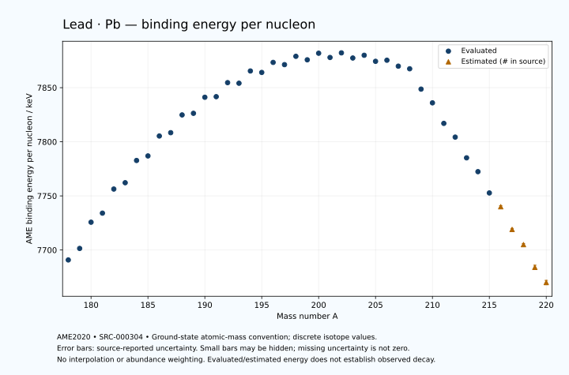

# Lead — Atomic Masses and Reaction Energies

<!-- generated-by: sync-ame2020.mjs -->

**Dated evaluated data · scientific coverage remains partial.** 43 ground-state nuclides from AME2020. Values and uncertainties are transcribed from the retained unrounded analysis files; estimated quantities remain labelled.

- [Parent Lead record](0082-Lead-Pb.md) · [NUBASE states and decays](0082-Lead-Pb-Nuclear-Evaluation.md)
- [Structured data](data/isotopes/0082-Lead-Pb-AME2020-Evaluation.yaml)
- [Original mass table](../../data/catalog/sources/ame2020-mass_1.mas20.txt) · [Original reaction table 1](../../data/catalog/sources/ame2020-rct1.mas20.txt) · [Original reaction table 2](../../data/catalog/sources/ame2020-rct2.mas20.txt)
- [AME2020 methods](https://doi.org/10.1088/1674-1137/abddb0) (SRC-000303) · [Tables and definitions](https://doi.org/10.1088/1674-1137/abddaf) (SRC-000304)

## Reading the data

All table energies and uncertainties are in keV; binding energy is per nucleon. A # replaces a decimal point in the original estimated value. UNKNOWN (*) retains the source's not-calculable entry; it is neither zero nor automatically NOT APPLICABLE. Source lines are one-based in the retained files. Uncertainties remain those published by the evaluation, with no replacement by independent-mass quadrature.

Atomic-mass conventions apply. Qα is total decay energy, not alpha-particle kinetic energy. Positive Q alone does not establish a decay branch, rate or observation. He-4's source Qα of zero is a bookkeeping identity. These tables describe ground-state combinations, not isomer or excited-daughter transitions. Nuclear state and daughter lookups are explicit in the structured companion. The binding quantity follows [Z M(¹H) + N mₙ − M(A,Z)]c²/A; it has not been converted to a bare-nucleus convention.

## Mass and binding table

| Nuclide | N | Atomic mass excess / keV | AME binding per nucleon / keV | Mass-file line |
|---|---:|---|---|---:|
| Pb-178 | 96 | 3573.371 ± 23.184 | 7690.8359 ± 0.1302 | 2486 |
| Pb-179 | 97 | 2051.608 ± 81.229 | 7701.4630 ± 0.4538 | 2501 |
| Pb-180 | 98 | -1941.069 ± 12.395 | 7725.6993 ± 0.0689 | 2516 |
| Pb-181 | 99 | -3110.631 ± 85.037 | 7734.0704 ± 0.4698 | 2530 |
| Pb-182 | 100 | -6824.556 ± 12.086 | 7756.3296 ± 0.0664 | 2544 |
| Pb-183 | 101 | -7580.008 ± 28.979 | 7762.1790 ± 0.1584 | 2557 |
| Pb-184 | 102 | -11051.586 ± 12.802 | 7782.7264 ± 0.0696 | 2570 |
| Pb-185 | 103 | -11541.211 ± 16.175 | 7786.9330 ± 0.0874 | 2584 |
| Pb-186 | 104 | -14680.897 ± 11.004 | 7805.3420 ± 0.0592 | 2597 |
| Pb-187 | 105 | -14986.955 ± 5.094 | 7808.4010 ± 0.0272 | 2611 |
| Pb-188 | 106 | -17811.024 ± 10.124 | 7824.8211 ± 0.0539 | 2625 |
| Pb-189 | 107 | -17844.019 ± 14.062 | 7826.2999 ± 0.0744 | 2638 |
| Pb-190 | 108 | -20416.607 ± 12.514 | 7841.1294 ± 0.0659 | 2651 |
| Pb-191 | 109 | -20291.243 ± 6.613 | 7841.6782 ± 0.0346 | 2663 |
| Pb-192 | 110 | -22551.846 ± 5.726 | 7854.6482 ± 0.0298 | 2676 |
| Pb-193 | 111 | -22229.255 ± 10.288 | 7854.0994 ± 0.0533 | 2689 |
| Pb-194 | 112 | -24207.866 ± 17.435 | 7865.4181 ± 0.0899 | 2703 |
| Pb-195 | 113 | -23738.039 ± 5.088 | 7864.0647 ± 0.0261 | 2716 |
| Pb-196 | 114 | -25348.234 ± 7.710 | 7873.3374 ± 0.0393 | 2729 |
| Pb-197 | 115 | -24745.385 ± 4.804 | 7871.2822 ± 0.0244 | 2742 |
| Pb-198 | 116 | -26067.443 ± 8.750 | 7878.9695 ± 0.0442 | 2755 |
| Pb-199 | 117 | -25231.734 ± 6.821 | 7875.7366 ± 0.0343 | 2768 |
| Pb-200 | 118 | -26250.858 ± 10.008 | 7881.8101 ± 0.0500 | 2780 |
| Pb-201 | 119 | -25271.033 ± 13.747 | 7877.8782 ± 0.0684 | 2792 |
| Pb-202 | 120 | -25940.608 ± 3.796 | 7882.1505 ± 0.0188 | 2805 |
| Pb-203 | 121 | -24786.483 ± 6.554 | 7877.3970 ± 0.0323 | 2818 |
| Pb-204 | 122 | -25109.815 ± 1.147 | 7879.9326 ± 0.0056 | 2830 |
| Pb-205 | 123 | -23770.162 ± 1.145 | 7874.3313 ± 0.0056 | 2842 |
| Pb-206 | 124 | -23785.506 ± 1.144 | 7875.3620 ± 0.0056 | 2854 |
| Pb-207 | 125 | -22451.968 ± 1.147 | 7869.8664 ± 0.0055 | 2866 |
| Pb-208 | 126 | -21748.519 ± 1.148 | 7867.4530 ± 0.0055 | 2878 |
| Pb-209 | 127 | -17614.574 ± 1.747 | 7848.6488 ± 0.0084 | 2890 |
| Pb-210 | 128 | -14728.429 ± 1.448 | 7835.9656 ± 0.0069 | 2902 |
| Pb-211 | 129 | -10493.012 ± 2.260 | 7817.0079 ± 0.0107 | 2913 |
| Pb-212 | 130 | -7548.929 ± 1.840 | 7804.3203 ± 0.0087 | 2925 |
| Pb-213 | 131 | -3203.598 ± 6.954 | 7785.1732 ± 0.0326 | 2937 |
| Pb-214 | 132 | -183.019 ± 1.969 | 7772.3955 ± 0.0092 | 2949 |
| Pb-215 | 133 | 4342.245 ± 52.685 | 7752.7381 ± 0.2450 | 2961 |
| Pb-216 | 134 | 7510# ± 200# | 7740# ± 1# | 2974 |
| Pb-217 | 135 | 12260# ± 300# | 7719# ± 1# | 2986 |
| Pb-218 | 136 | 15630# ± 300# | 7705# ± 1# | 2998 |
| Pb-219 | 137 | 20620# ± 400# | 7684# ± 2# | 3009 |
| Pb-220 | 138 | 24130# ± 400# | 7670# ± 2# | 3021 |

## Q-values and separation energies

| Nuclide | Qβ− / keV | Qα / keV | S₂n / keV | S₂p / keV | Reaction-file line |
|---|---|---|---|---|---:|
| Pb-178 | UNKNOWN (*) | 7789.4724 ± 12.9788 | UNKNOWN (*) | -780.0676 ± 25.7096 | 2485 |
| Pb-179 | UNKNOWN (*) | 7596.1352 ± 4.8507 | UNKNOWN (*) | -249.4889 ± 117.3713 | 2500 |
| Pb-180 | UNKNOWN (*) | 7418.6542 ± 5.4785 | 21657.0758 ± 26.2868 | 203.6650 ± 16.3941 | 2515 |
| Pb-181 | UNKNOWN (*) | 7240.2760 ± 7.3138 | 21304.8753 ± 117.5989 | 755.6494 ± 89.5659 | 2529 |
| Pb-182 | UNKNOWN (*) | 7065.8734 ± 5.5095 | 21026.1240 ± 17.2951 | 1151.9853 ± 17.4920 | 2543 |
| Pb-183 | UNKNOWN (*) | 6927.9999 ± 7.0000 | 20612.0131 ± 89.8390 | 1496.8229 ± 32.8044 | 2556 |
| Pb-184 | -12306# ± 123# | 6774.0111 ± 3.1263 | 20369.6659 ± 17.6060 | 2052.6432 ± 16.1036 | 2569 |
| Pb-185 | -9305# ± 83# | 6694.9999 ± 5.0000 | 20103.8396 ± 33.1832 | 2314.4981 ± 17.6547 | 2583 |
| Pb-186 | -11535.3999 ± 20.2118 | 6471.0721 ± 5.0236 | 19771.9471 ± 16.8690 | 2914.0522 ± 14.5387 | 2596 |
| Pb-187 | -8603.6798 ± 11.2268 | 6392.7844 ± 6.1913 | 19588.3799 ± 16.9565 | 3381.2464 ± 14.5568 | 2610 |
| Pb-188 | -10616.2241 ± 15.0824 | 6108.8469 ± 3.4046 | 19272.7633 ± 14.9320 | 3849.9076 ± 15.4134 | 2624 |
| Pb-189 | -7779.3555 ± 25.1498 | 5914.7158 ± 4.3142 | 18999.7002 ± 14.9544 | 4303.4523 ± 19.0523 | 2637 |
| Pb-190 | -9820.7014 ± 24.4226 | 5697.5361 ± 4.5685 | 18748.2187 ± 16.0762 | 4796.1978 ± 14.2278 | 2650 |
| Pb-191 | -7051.8922 ± 9.9895 | 5402.3497 ± 14.4647 | 18589.8604 ± 15.5397 | 5242.8075 ± 32.2383 | 2662 |
| Pb-192 | -9017.3089 ± 30.6518 | 5221.5895 ± 4.7900 | 18277.8751 ± 13.7569 | 5759.1630 ± 16.8987 | 2675 |
| Pb-193 | -6344.6913 ± 12.7761 | 4972.2075 ± 33.1875 | 18080.6474 ± 12.2300 | 6215.3480 ± 24.5407 | 2688 |
| Pb-194 | -8184.8462 ± 18.2094 | 4737.8430 ± 16.7225 | 17798.6564 ± 18.3447 | 6774.3272 ± 23.3050 | 2702 |
| Pb-195 | -5712.4729 ± 7.3370 | 4428.8935 ± 22.8527 | 17651.4209 ± 11.4770 | 7253.8165 ± 16.3180 | 2715 |
| Pb-196 | -7339.2020 ± 25.6160 | 4238.3307 ± 17.2767 | 17283.0045 ± 19.0011 | 7742.2247 ± 8.2332 | 2728 |
| Pb-197 | -5058.1894 ± 9.6190 | 3891.8643 ± 16.2257 | 17149.9816 ± 6.9963 | 8309.9853 ± 23.6244 | 2741 |
| Pb-198 | -6693.5916 ± 28.9259 | 3691.5934 ± 9.2140 | 16861.8442 ± 11.5943 | 8819.4408 ± 9.2290 | 2754 |
| Pb-199 | -4434.1181 ± 12.6179 | 3356.6915 ± 24.1260 | 16628.9856 ± 8.3433 | 9269.4458 ± 7.5372 | 2767 |
| Pb-200 | -5880.2841 ± 24.8094 | 3150.1704 ± 10.4286 | 16326.0512 ± 13.2430 | 9874.4844 ± 10.0154 | 2779 |
| Pb-201 | -3842.0269 ± 18.3637 | 2844.2822 ± 14.1158 | 16181.9344 ± 15.3465 | 10302.9085 ± 13.7562 | 2791 |
| Pb-202 | -5189.7539 ± 14.5070 | 2588.7914 ± 3.8220 | 15832.3866 ± 10.6891 | 11015.2828 ± 3.8271 | 2804 |
| Pb-203 | -3261.5896 ± 14.3559 | 2334.6679 ± 6.5526 | 15658.0861 ± 15.2209 | 11701.8955 ± 6.5406 | 2817 |
| Pb-204 | -4463.8883 ± 9.2480 | 1968.5365 ± 1.1376 | 15311.8431 ± 3.9175 | 12342.4475 ± 1.0533 | 2829 |
| Pb-205 | -2704.5927 ± 4.8196 | 1467.4514 ± 1.0616 | 15126.3154 ± 6.4555 | 13078.9012 ± 1.2680 | 2841 |
| Pb-206 | -3757.3057 ± 7.5461 | 1134.8875 ± 1.0497 | 14818.3273 ± 0.1239 | 13673.3006 ± 1.1784 | 2853 |
| Pb-207 | -2397.4140 ± 2.1175 | 392.3186 ± 1.2726 | 14824.4426 ± 0.1126 | 14742.1920 ± 3.6987 | 2865 |
| Pb-208 | -2878.3680 ± 2.0127 | 516.7129 ± 1.1821 | 14105.6489 ± 0.1085 | 15380.7336 ± 20.4098 | 2877 |
| Pb-209 | 644.0152 ± 1.1462 | 2248.2291 ± 3.9266 | 11305.2413 ± 1.3436 | 15705.0701 ± 29.8590 | 2889 |
| Pb-210 | 63.4758 ± 0.4992 | 3792.3827 ± 20.3892 | 9122.5461 ± 0.9184 | 16040.9636 ± 30.7734 | 2901 |
| Pb-211 | 1366.1041 ± 5.4713 | 3569.5178 ± 29.8934 | 9021.0745 ± 2.7471 | 16461# ± 150# | 2912 |
| Pb-212 | 569.0133 ± 1.8246 | 3291.5622 ± 30.7943 | 8963.1366 ± 2.0978 | 16827# ± 200# | 2924 |
| Pb-213 | 2028.0730 ± 8.3708 | 2981# ± 150# | 8853.2218 ± 7.1545 | 17391# ± 200# | 2936 |
| Pb-214 | 1017.7611 ± 11.2559 | 2692# ± 200# | 8776.7253 ± 2.0017 | 17781# ± 300# | 2948 |
| Pb-215 | 2712.9729 ± 52.9848 | 2308# ± 207# | 8596.7936 ± 53.1425 | 18436# ± 305# | 2960 |
| Pb-216 | 1636# ± 201# | 2065# ± 361# | 8450# ± 200# | 18839# ± 447# | 2973 |
| Pb-217 | 3530# ± 300# | 1635# ± 424# | 8225# ± 305# | 19427# ± 500# | 2985 |
| Pb-218 | 2414# ± 301# | 1434# ± 500# | 8023# ± 361# | 19869# ± 500# | 2997 |
| Pb-219 | 4300# ± 447# | 1085# ± 565# | 7783# ± 500# | UNKNOWN (*) | 3008 |
| Pb-220 | 3171# ± 500# | 785# ± 565# | 7642# ± 500# | UNKNOWN (*) | 3020 |

## Additional decay-energy combinations

| Nuclide | Q₂β− / keV | Q₄β− / keV | Qεp / keV | Qβ−n / keV | Part 1 / part 2 line |
|---|---|---|---|---|---|
| Pb-178 | UNKNOWN (*) | UNKNOWN (*) | 9060.2228 ± 87.8366 | UNKNOWN (*) | 2485 / 2521 |
| Pb-179 | UNKNOWN (*) | UNKNOWN (*) | 11077.9829 ± 81.9388 | UNKNOWN (*) | 2500 / 2536 |
| Pb-180 | UNKNOWN (*) | UNKNOWN (*) | 7702.8840 ± 30.7312 | UNKNOWN (*) | 2515 / 2551 |
| Pb-181 | UNKNOWN (*) | UNKNOWN (*) | 9850.9113 ± 85.9719 | UNKNOWN (*) | 2529 / 2565 |
| Pb-182 | UNKNOWN (*) | UNKNOWN (*) | 6547.5997 ± 19.5627 | UNKNOWN (*) | 2543 / 2579 |
| Pb-183 | UNKNOWN (*) | UNKNOWN (*) | 8707.9062 ± 30.5738 | UNKNOWN (*) | 2556 / 2593 |
| Pb-184 | UNKNOWN (*) | UNKNOWN (*) | 5464.0981 ± 14.6229 | UNKNOWN (*) | 2569 / 2606 |
| Pb-185 | UNKNOWN (*) | UNKNOWN (*) | 7514.6047 ± 18.7706 | -20867# ± 123# | 2583 / 2620 |
| Pb-186 | -18782.4278 ± 21.3351 | UNKNOWN (*) | 4213.7826 ± 17.5161 | -20516# ± 82# | 2596 / 2633 |
| Pb-187 | -17810.7630 ± 33.0232 | UNKNOWN (*) | 6263.1327 ± 12.7097 | -19912.7759 ± 17.7024 | 2610 / 2647 |
| Pb-188 | -17266.6467 ± 22.3804 | UNKNOWN (*) | 3018.5136 ± 16.3537 | -19499.0671 ± 14.2336 | 2624 / 2662 |
| Pb-189 | -16422.0237 ± 26.1587 | UNKNOWN (*) | 5065.3609 ± 15.6111 | -18720.5370 ± 17.9646 | 2637 / 2675 |
| Pb-190 | -15853.8988 ± 18.1444 | UNKNOWN (*) | 1920.8002 ± 33.9374 | -18423.2612 ± 24.3180 | 2650 / 2688 |
| Pb-191 | -15222.5127 ± 9.7046 | UNKNOWN (*) | 3790.4104 ± 17.2269 | -17766.6560 ± 21.9908 | 2662 / 2700 |
| Pb-192 | -14485.3623 ± 12.0725 | UNKNOWN (*) | 751.0319 ± 23.0006 | -17383.8127 ± 9.4259 | 2675 / 2713 |
| Pb-193 | -13903.9526 ± 17.8044 | -31272.1750 ± 27.1377 | 2493.2553 ± 18.6344 | -16766.0359 ± 31.8211 | 2688 / 2726 |
| Pb-194 | -13203.2491 ± 21.6665 | -29932.4898 ± 24.0900 | -434.6721 ± 23.3151 | -16394.6207 ± 19.0102 | 2702 / 2741 |
| Pb-195 | -12621.3849 ± 7.8988 | -28788.3245 ± 51.9358 | 1156.9413 ± 5.8500 | -15786.3376 ± 7.3123 | 2715 / 2754 |
| Pb-196 | -11879.5032 ± 9.3909 | -27323.4035 ± 15.9906 | -1623.8637 ± 24.3532 | -15393.9859 ± 9.3485 | 2728 / 2767 |
| Pb-197 | -11352.3066 ± 10.9689 | -26255.7533 ± 16.8862 | -208.4122 ± 5.6335 | -14807.6706 ± 24.8962 | 2741 / 2780 |
| Pb-198 | -10594.1643 ± 19.4588 | -24837.1230 ± 15.9946 | -2816.1828 ± 9.3151 | -14451.5651 ± 12.0831 | 2754 / 2793 |
| Pb-199 | -9992.9056 ± 8.7180 | -23671.8880 ± 9.9887 | -1566.3902 ± 6.8365 | -13929.2016 ± 28.4020 | 2767 / 2806 |
| Pb-200 | -9309.1742 ± 12.4688 | -22250.4033 ± 11.5548 | -3993.7623 ± 10.0095 | -13524.5593 ± 14.5741 | 2779 / 2819 |
| Pb-201 | -8749.8666 ± 14.6058 | -21163.6200 ± 17.0712 | -3056.7364 ± 13.7563 | -12971.7772 ± 26.5391 | 2791 / 2831 |
| Pb-202 | -7999.0389 ± 9.4524 | -19666.0475 ± 17.9167 | -5567.0499 ± 3.8493 | -12582.9203 ± 12.7528 | 2804 / 2844 |
| Pb-203 | -7475.6640 ± 8.0304 | -18602.4379 ± 8.7578 | -4730.1441 ± 6.5388 | -12106.9466 ± 15.4549 | 2817 / 2857 |
| Pb-204 | -6768.7696 ± 10.0270 | -17139.6995 ± 7.3619 | -7129.5832 ± 1.2644 | -11656.2400 ± 12.8238 | 2829 / 2869 |
| Pb-205 | -6248.7637 ± 10.1169 | -16060.3977 ± 5.1282 | -6368.9852 ± 1.1790 | -11195.5533 ± 9.2477 | 2841 / 2881 |
| Pb-206 | -5596.8380 ± 4.1263 | -14652.5881 ± 8.5750 | -8786.7588 ± 3.6976 | -10791.2550 ± 4.8197 | 2853 / 2894 |
| Pb-207 | -5306.2681 ± 6.5628 | -13817.2268 ± 4.8784 | -8795.2120 ± 20.4098 | -10495.0859 ± 7.5467 | 2865 / 2906 |
| Pb-208 | -4279.3119 ± 1.2817 | -12093.1298 ± 10.1210 | -12550.0444 ± 29.8299 | -9765.2826 ± 2.1181 | 2877 / 2918 |
| Pb-209 | -1248.5589 ± 1.9108 | -8673.5243 ± 10.1053 | -11638.1371 ± 30.7889 | -6815.7406 ± 2.1822 | 2889 / 2930 |
| Pb-210 | 1224.6307 ± 0.9123 | -5123.6650 ± 4.7430 | -13408# ± 150# | -4541.1583 ± 0.5053 | 2901 / 2942 |
| Pb-211 | 1939.4804 ± 2.4780 | -1737.6822 ± 7.1399 | -12482# ± 200# | -3772.4252 ± 2.5286 | 2912 / 2953 |
| Pb-212 | 2820.4789 ± 1.9089 | 1110.2898 ± 3.4728 | -14448# ± 200# | -3761.1315 ± 5.5972 | 2924 / 2966 |
| Pb-213 | 3449.9211 ± 7.5471 | 2492.3512 ± 7.7010 | -13512# ± 300# | -3156.9729 ± 7.1159 | 2936 / 2978 |
| Pb-214 | 4286.9537 ± 2.3188 | 4136.6454 ± 9.3655 | -15672# ± 300# | -3022.6661 ± 5.2644 | 2948 / 2990 |
| Pb-215 | 4884.0155 ± 52.7281 | 5511.2349 ± 53.0363 | -14717# ± 403# | -2528.2934 ± 53.8646 | 2960 / 3002 |
| Pb-216 | 5727# ± 200# | 7256# ± 200# | -16889# ± 447# | -2191# ± 200# | 2973 / 3015 |
| Pb-217 | 6377# ± 300# | 8602# ± 300# | -15949# ± 500# | -1685# ± 300# | 2985 / 3027 |
| Pb-218 | 7273# ± 300# | 10412# ± 300# | UNKNOWN (*) | -1172# ± 300# | 2997 / 3040 |
| Pb-219 | 7938# ± 400# | 11790# ± 400# | UNKNOWN (*) | -668# ± 401# | 3008 / 3051 |
| Pb-220 | 8867# ± 400# | 13518# ± 400# | UNKNOWN (*) | -261# ± 447# | 3020 / 3063 |

## Single-nucleon separation and reaction energies

| Nuclide | Sₙ / keV | Sₚ / keV | Q(d,α) / keV | Q(p,α) / keV | Q(n,α) / keV | Part 2 line |
|---|---|---|---|---|---|---:|
| Pb-178 | UNKNOWN (*) | 375.4970 ± 31.7032 | 13699.4500 ± 86.2335 | UNKNOWN (*) | 17189.2161 ± 84.3339 | 2521 |
| Pb-179 | 9593.0809 ± 84.4733 | 624# ± 131# | 16102.5182 ± 84.0595 | 6330.9353 ± 18.6421 | 19482.6491 ± 81.9869 | 2536 |
| Pb-180 | 12063.9949 ± 82.1697 | 960.4078 ± 40.5917 | 13383# ± 103# | 6263.0895 ± 20.1825 | 16481.1564 ± 85.6186 | 2551 |
| Pb-181 | 9240.8804 ± 85.9305 | 1009.1638 ± 110.0892 | 15869.8079 ± 93.4095 | 6367# ± 133# | 18851.1170 ± 85.7142 | 2565 |
| Pb-182 | 11785.2436 ± 85.8910 | 1314.7783 ± 15.1305 | 13276.6888 ± 70.9537 | 6309.1306 ± 40.4985 | 15754.7695 ± 30.6081 | 2579 |
| Pb-183 | 8826.7695 ± 31.3983 | 1541.7659 ± 31.3561 | 15929.5483 ± 30.3731 | 6674.4855 ± 75.6844 | 18316.9075 ± 31.6081 | 2593 |
| Pb-184 | 11542.8964 ± 31.6715 | 1753.2960 ± 15.8419 | 12986.4339 ± 17.5305 | 6611.2181 ± 13.7586 | 15255.9431 ± 20.0095 | 2606 |
| Pb-185 | 8560.9432 ± 20.6247 | 1946.8274 ± 19.0223 | 15756.8569 ± 18.6733 | 6650.0569 ± 20.1258 | 17682.0760 ± 18.9018 | 2620 |
| Pb-186 | 11211.0039 ± 19.5580 | 2212.1237 ± 23.4201 | 12913.2648 ± 14.8768 | 6770.4192 ± 14.4279 | 14770.1603 ± 13.0733 | 2633 |
| Pb-187 | 8377.3759 ± 12.1202 | 2392.9863 ± 21.3666 | 15481.5965 ± 21.2922 | 6760.4551 ± 11.2328 | 17004.2342 ± 10.8037 | 2647 |
| Pb-188 | 10895.3873 ± 11.3275 | 2655.4034 ± 12.9336 | 12782.7226 ± 23.0887 | 6810.7755 ± 23.0198 | 14019.0287 ± 16.9772 | 2662 |
| Pb-189 | 8104.3129 ± 17.3195 | 2796.5875 ± 33.0453 | 15311.3799 ± 16.2026 | 6902.9759 ± 25.0666 | 16341.4419 ± 18.2533 | 2675 |
| Pb-190 | 10643.9057 ± 18.8163 | 3089.4725 ± 15.0539 | 12630.6029 ± 32.4167 | 6892.0404 ± 14.8788 | 13348.3043 ± 17.9310 | 2688 |
| Pb-191 | 7945.9547 ± 14.1540 | 3213.9788 ± 9.8143 | 15035.6690 ± 10.6654 | 6909.2145 ± 30.6264 | 15553.5099 ± 9.4759 | 2700 |
| Pb-192 | 10331.9204 ± 8.7478 | 3557.8662 ± 9.3166 | 12525.1969 ± 9.2400 | 6928.3148 ± 10.1395 | 12720.9345 ± 32.0667 | 2713 |
| Pb-193 | 7748.7270 ± 11.7741 | 3645.9771 ± 33.2998 | 14764.5030 ± 12.6430 | 7001.0362 ± 12.5867 | 14787.7724 ± 18.9438 | 2726 |
| Pb-194 | 10049.9294 ± 20.2444 | 4019.6187 ± 18.6809 | 12375.1896 ± 36.1529 | 6939.1398 ± 18.9210 | 12030.3849 ± 28.2642 | 2741 |
| Pb-195 | 7601.4914 ± 18.1607 | 4089.5129 ± 14.8699 | 14449.9860 ± 8.4181 | 6998.2644 ± 32.0768 | 13919.8438 ± 16.3469 | 2754 |
| Pb-196 | 9681.5131 ± 9.2336 | 4481.9136 ± 13.5200 | 12300.0702 ± 15.9585 | 6993.0392 ± 10.2190 | 11360.3328 ± 17.2919 | 2767 |
| Pb-197 | 7468.4686 ± 9.0477 | 4537.7577 ± 13.0277 | 14120.7140 ± 12.1140 | 7056.1678 ± 14.7754 | 13084.9691 ± 5.6055 | 2780 |
| Pb-198 | 9393.3756 ± 9.9609 | 5002.1920 ± 16.1441 | 12139.9628 ± 14.9398 | 6951.9045 ± 14.1444 | 10592.3015 ± 24.7162 | 2793 |
| Pb-199 | 7235.6100 ± 11.0945 | 4991.9527 ± 10.1713 | 13833.2942 ± 15.1921 | 7128.9191 ± 13.8984 | 12240.6116 ± 7.4303 | 2806 |
| Pb-200 | 9090.4412 ± 12.1117 | 5480.4318 ± 29.6830 | 11988.7022 ± 12.5337 | 6967.4192 ± 16.8572 | 9935.7754 ± 10.5048 | 2819 |
| Pb-201 | 7091.4931 ± 16.9979 | 5512.7766 ± 14.9037 | 13499.1712 ± 31.1432 | 7121.7753 ± 15.6817 | 11329.6848 ± 13.7546 | 2831 |
| Pb-202 | 8740.8934 ± 14.2603 | 6048.8007 ± 14.6731 | 11817.4261 ± 6.8944 | 6982.8440 ± 28.2015 | 9251.8605 ± 3.8266 | 2844 |
| Pb-203 | 6917.1926 ± 7.5494 | 6095.0347 ± 6.6717 | 13105.1028 ± 15.5524 | 7124.7997 ± 8.7078 | 10363.1870 ± 6.5528 | 2857 |
| Pb-204 | 8394.6504 ± 6.4550 | 6637.4770 ± 0.3378 | 11581.4111 ± 1.6964 | 6935.0186 ± 14.1508 | 8199.1164 ± 1.0643 | 2869 |
| Pb-205 | 6731.6650 ± 0.1088 | 6713.0633 ± 0.2060 | 12701.9542 ± 0.3532 | 7074.3123 ± 1.6982 | 9221.5498 ± 1.0506 | 2881 |
| Pb-206 | 8086.6623 ± 0.0599 | 7253.6752 ± 0.5050 | 11271.3705 ± 0.2139 | 6839.8581 ± 0.3576 | 7130.0988 ± 1.2691 | 2894 |
| Pb-207 | 6737.7802 ± 0.0953 | 7487.6460 ± 0.6189 | 12079.6407 ± 0.5138 | 6758.1565 ± 0.2341 | 7884.5816 ± 1.1813 | 2906 |
| Pb-208 | 7367.8686 ± 0.0520 | 8003.0539 ± 5.4026 | 11215.5815 ± 0.6210 | 6936.3383 ± 0.5163 | 6185.6017 ± 3.6990 | 2918 |
| Pb-209 | 3937.3726 ± 1.3444 | 8153.4241 ± 2.1338 | 14130.6696 ± 5.5587 | 9502.7751 ± 1.3586 | 8977.5561 ± 20.4276 | 2930 |
| Pb-210 | 5185.1735 ± 1.2521 | 8372.6074 ± 6.1823 | 12732.4986 ± 1.8959 | 11170.0624 ± 5.4728 | 7405.4189 ± 29.8430 | 2942 |
| Pb-211 | 3835.9010 ± 2.5740 | 8534.9874 ± 11.7735 | 13862.5877 ± 6.1910 | 11121.1638 ± 2.6804 | 8418.7978 ± 30.8223 | 2953 |
| Pb-212 | 5127.2356 ± 2.4564 | 8759.9015 ± 41.9576 | 12408.8731 ± 11.6734 | 10959.9184 ± 6.2125 | 6707# ± 150# | 2966 |
| Pb-213 | 3725.9863 ± 7.0416 | 8942# ± 200# | 13585.2084 ± 42.4902 | 10907.4531 ± 13.4895 | 7743# ± 200# | 2978 |
| Pb-214 | 5050.7390 ± 7.0652 | 9255.8009 ± 27.0850 | 12079# ± 200# | 10759.0356 ± 41.9635 | 5854# ± 200# | 2990 |
| Pb-215 | 3546.0546 ± 52.7223 | 9411# ± 203# | 13269.2407 ± 59.2071 | 10757# ± 207# | 6969# ± 305# | 3002 |
| Pb-216 | 4904# ± 207# | 9810# ± 361# | 11756# ± 280# | 10590# ± 202# | 4956# ± 361# | 3015 |
| Pb-217 | 3321# ± 361# | 9899# ± 424# | 12941# ± 424# | 10660# ± 358# | 6136# ± 500# | 3027 |
| Pb-218 | 4702# ± 424# | 10319# ± 500# | 11470# ± 424# | 10463# ± 424# | 4166# ± 500# | 3040 |
| Pb-219 | 3081# ± 500# | 10380# ± 565# | 12671# ± 565# | 10613# ± 500# | 5346# ± 565# | 3051 |
| Pb-220 | 4561# ± 565# | UNKNOWN (*) | 11131# ± 565# | 10335# ± 565# | UNKNOWN (*) | 3063 |

Qβ− comes from the mass-file line in the first table. Qα, S₂n, S₂p, Q₂β−, Qεp and Qβ−n come from reaction part 1; Q₄β− and the last table come from part 2. Qεp is electron-capture/proton energy balance; Qβ−n is beta-minus/neutron energy balance. These are evaluated mass combinations, not observations of decay modes, cross sections or reaction rates. Light-nuclide zero entries can be bookkeeping identities, without a physical A=0 residual. Definitions and original source strings are retained in the structured data.

## Binding-energy chart

Discrete source values and source-reported uncertainties. No interpolation, natural-abundance weighting or observed-decay claim is implied. This quantitative chart supplements the 22 separate illustrative panels.

## Remaining review

Later measurements, state-specific decay branches, isomer Q-values, reaction rates, applicability and full claim-level review remain open. Existing authored values retain their own provenance; this companion does not overwrite them.
