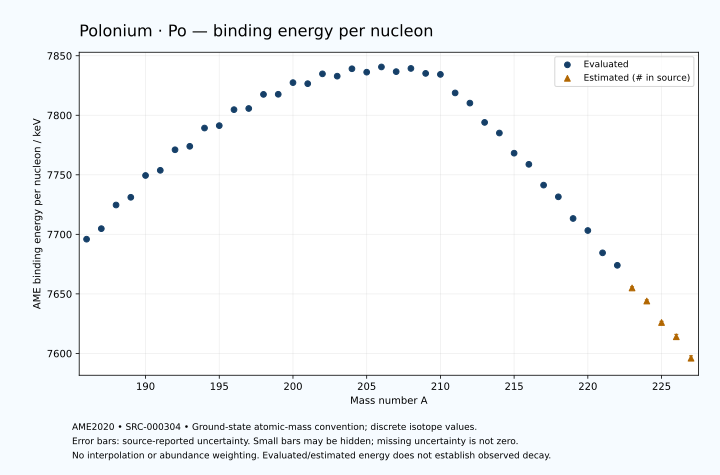

# Polonium — Atomic Masses and Reaction Energies

<!-- generated-by: sync-ame2020.mjs -->

**Dated evaluated data · scientific coverage remains partial.** 42 ground-state nuclides from AME2020. Values and uncertainties are transcribed from the retained unrounded analysis files; estimated quantities remain labelled.

- [Parent Polonium record](0084-Polonium-Po.md) · [NUBASE states and decays](0084-Polonium-Po-Nuclear-Evaluation.md)
- [Structured data](data/isotopes/0084-Polonium-Po-AME2020-Evaluation.yaml)
- [Original mass table](../../data/catalog/sources/ame2020-mass_1.mas20.txt) · [Original reaction table](../../data/catalog/sources/ame2020-rct1.mas20.txt)
- [AME2020 methods](https://doi.org/10.1088/1674-1137/abddb0) (SRC-000303) · [Tables and definitions](https://doi.org/10.1088/1674-1137/abddaf) (SRC-000304)

## Reading the data

All table energies and uncertainties are in keV; binding energy is per nucleon. A # replaces a decimal point in the original estimated value. UNKNOWN (*) retains the source's not-calculable entry; it is neither zero nor automatically NOT APPLICABLE. Source lines are one-based in the retained files. Uncertainties remain those published by the evaluation, with no replacement by independent-mass quadrature.

Atomic-mass conventions apply. Qα is total decay energy, not alpha-particle kinetic energy. Positive Q alone does not establish a decay branch, rate or observation. He-4's source Qα of zero is a bookkeeping identity. These tables describe ground-state combinations, not isomer or excited-daughter transitions. Nuclear state and daughter lookups are explicit in the structured companion. The binding quantity follows [Z M(¹H) + N mₙ − M(A,Z)]c²/A; it has not been converted to a bare-nucleus convention.

## Mass and binding table

| Nuclide | N | Atomic mass excess / keV | AME binding per nucleon / keV | Mass-file line |
|---|---:|---|---|---:|
| Po-186 | 102 | 4101.531 ± 18.278 | 7695.9488 ± 0.0983 | 2599 |
| Po-187 | 103 | 2823.808 ± 32.631 | 7704.7889 ± 0.1745 | 2613 |
| Po-188 | 104 | -544.378 ± 19.970 | 7724.6544 ± 0.1062 | 2627 |
| Po-189 | 105 | -1421.996 ± 22.059 | 7731.1321 ± 0.1167 | 2640 |
| Po-190 | 106 | -4562.708 ± 13.163 | 7749.4526 ± 0.0693 | 2653 |
| Po-191 | 107 | -5068.731 ± 7.103 | 7753.7871 ± 0.0372 | 2665 |
| Po-192 | 108 | -8066.483 ± 10.634 | 7771.0542 ± 0.0554 | 2678 |
| Po-193 | 109 | -8325.302 ± 14.531 | 7773.9510 ± 0.0753 | 2691 |
| Po-194 | 110 | -11004.617 ± 12.911 | 7789.2947 ± 0.0666 | 2705 |
| Po-195 | 111 | -11116.655 ± 6.042 | 7791.3155 ± 0.0310 | 2718 |
| Po-196 | 112 | -13468.731 ± 5.383 | 7804.7445 ± 0.0275 | 2731 |
| Po-197 | 113 | -13393.078 ± 9.861 | 7805.7136 ± 0.0501 | 2744 |
| Po-198 | 114 | -15473.278 ± 17.424 | 7817.5611 ± 0.0880 | 2757 |
| Po-199 | 115 | -15238.829 ± 5.429 | 7817.6582 ± 0.0273 | 2770 |
| Po-200 | 116 | -16941.683 ± 7.579 | 7827.4407 ± 0.0379 | 2782 |
| Po-201 | 117 | -16521.166 ± 4.942 | 7826.5619 ± 0.0246 | 2794 |
| Po-202 | 118 | -17941.569 ± 8.670 | 7834.8053 ± 0.0429 | 2807 |
| Po-203 | 119 | -17310.819 ± 4.640 | 7832.8632 ± 0.0229 | 2820 |
| Po-204 | 120 | -18341.045 ± 10.071 | 7839.0823 ± 0.0494 | 2832 |
| Po-205 | 121 | -17521.398 ± 10.059 | 7836.2168 ± 0.0491 | 2844 |
| Po-206 | 122 | -18188.668 ± 4.012 | 7840.5973 ± 0.0195 | 2856 |
| Po-207 | 123 | -17145.700 ± 6.659 | 7836.6734 ± 0.0322 | 2868 |
| Po-208 | 124 | -17469.207 ± 1.672 | 7839.3568 ± 0.0080 | 2880 |
| Po-209 | 125 | -16366.015 ± 1.778 | 7835.1882 ± 0.0085 | 2892 |
| Po-210 | 126 | -15953.060 ± 1.146 | 7834.3462 ± 0.0055 | 2904 |
| Po-211 | 127 | -12432.492 ± 1.255 | 7818.7842 ± 0.0060 | 2915 |
| Po-212 | 128 | -10369.408 ± 1.153 | 7810.2438 ± 0.0054 | 2927 |
| Po-213 | 129 | -6653.519 ± 3.053 | 7794.0240 ± 0.0143 | 2939 |
| Po-214 | 130 | -4469.972 ± 1.449 | 7785.1163 ± 0.0068 | 2951 |
| Po-215 | 131 | -541.771 ± 2.120 | 7768.1768 ± 0.0099 | 2963 |
| Po-216 | 132 | 1782.336 ± 1.815 | 7758.8205 ± 0.0084 | 2976 |
| Po-217 | 133 | 5883.452 ± 6.544 | 7741.3614 ± 0.0302 | 2988 |
| Po-218 | 134 | 8356.652 ± 1.967 | 7731.5300 ± 0.0090 | 3000 |
| Po-219 | 135 | 12681.361 ± 15.835 | 7713.3340 ± 0.0723 | 3011 |
| Po-220 | 136 | 15263.462 ± 17.698 | 7703.2244 ± 0.0804 | 3023 |
| Po-221 | 137 | 19773.757 ± 19.561 | 7684.4814 ± 0.0885 | 3034 |
| Po-222 | 138 | 22486.268 ± 40.054 | 7674.0054 ± 0.1804 | 3046 |
| Po-223 | 139 | 27079# ± 196# | 7655# ± 1# | 3058 |
| Po-224 | 140 | 29910# ± 196# | 7644# ± 1# | 3071 |
| Po-225 | 141 | 34580# ± 300# | 7626# ± 1# | 3083 |
| Po-226 | 142 | 37549# ± 401# | 7614# ± 2# | 3095 |
| Po-227 | 143 | 42281# ± 401# | 7596# ± 2# | 3107 |

## Q-values and separation energies

| Nuclide | Qβ− / keV | Qα / keV | S₂n / keV | S₂p / keV | Reaction-file line |
|---|---|---|---|---|---:|
| Po-186 | UNKNOWN (*) | 8501.1712 ± 13.7119 | UNKNOWN (*) | -575.1747 ± 22.3156 | 2598 |
| Po-187 | UNKNOWN (*) | 7978.8999 ± 15.0000 | UNKNOWN (*) | 212.9229 ± 36.4160 | 2612 |
| Po-188 | UNKNOWN (*) | 8082.2927 ± 15.3267 | 20788.5444 ± 27.0720 | 441.4225 ± 22.7919 | 2626 |
| Po-189 | UNKNOWN (*) | 7694.2999 ± 15.0000 | 20388.4396 ± 39.3843 | 1012.9826 ± 22.6390 | 2639 |
| Po-190 | UNKNOWN (*) | 7693.2733 ± 7.2234 | 20160.9666 ± 23.9092 | 1329.6258 ± 16.5875 | 2652 |
| Po-191 | -8932.6440 ± 17.5997 | 7493.3085 ± 4.9498 | 19789.3713 ± 23.1737 | 1802.6537 ± 15.7522 | 2664 |
| Po-192 | -10992.2252 ± 29.8328 | 7319.6250 ± 3.2536 | 19646.4116 ± 16.9035 | 2227.8187 ± 16.4021 | 2677 |
| Po-193 | -8257.9789 ± 26.0594 | 7093.8012 ± 3.6617 | 19399.2075 ± 16.1722 | 2612.0008 ± 15.9653 | 2690 |
| Po-194 | -10288.1273 ± 26.8153 | 6987.0740 ± 3.1772 | 19080.7696 ± 16.7070 | 3030.7133 ± 14.1191 | 2704 |
| Po-195 | -7646.3554 ± 11.3199 | 6749.6730 ± 2.7855 | 18933.9886 ± 15.7374 | 3465.3419 ± 11.9309 | 2717 |
| Po-196 | -9555.5564 ± 30.7105 | 6658.1987 ± 2.3802 | 18606.7504 ± 13.9839 | 3838.8073 ± 18.2414 | 2730 |
| Po-197 | -7037.8235 ± 12.6871 | 6411.2605 ± 3.1793 | 18419.0599 ± 11.5647 | 4232.9810 ± 11.0959 | 2743 |
| Po-198 | -8764.5316 ± 18.1013 | 6309.6720 ± 1.3683 | 18147.1831 ± 18.2306 | 4702.9859 ± 18.9908 | 2756 |
| Po-199 | -6415.4515 ± 7.6464 | 6074.2948 ± 1.8951 | 17988.3866 ± 11.2566 | 5071.3860 ± 7.2484 | 2769 |
| Po-200 | -7953.7897 ± 25.6119 | 5981.6352 ± 1.8470 | 17611.0413 ± 18.9378 | 5452.1830 ± 11.5073 | 2781 |
| Po-201 | -5731.7247 ± 9.5606 | 5799.3030 ± 1.6972 | 17424.9734 ± 7.3399 | 5867.3738 ± 8.4230 | 2793 |
| Po-202 | -7346.4628 ± 28.9311 | 5700.9575 ± 1.6915 | 17142.5219 ± 11.4470 | 6268.6536 ± 13.1906 | 2806 |
| Po-203 | -5148.2116 ± 11.5921 | 5495.9999 ± 5.0000 | 16932.2887 ± 6.7785 | 6617.7281 ± 14.5091 | 2819 |
| Po-204 | -6465.7939 ± 24.8047 | 5484.8964 ± 1.3668 | 16542.1124 ± 13.2386 | 6978.3794 ± 10.7481 | 2831 |
| Po-205 | -4536.8793 ± 15.6996 | 5324.7186 ± 9.9356 | 16353.2157 ± 11.0771 | 7312.8578 ± 11.9999 | 2843 |
| Po-206 | -5749.2803 ± 14.1099 | 5327.0240 ± 1.2972 | 15990.2590 ± 10.8261 | 7656.7953 ± 4.1267 | 2855 |
| Po-207 | -3918.2186 ± 14.0754 | 5215.8665 ± 2.5023 | 15766.9382 ± 12.0575 | 7953.4805 ± 6.5620 | 2867 |
| Po-208 | -4999.3061 ± 9.0736 | 5215.6920 ± 1.2716 | 15423.1750 ± 4.3046 | 8261.6430 ± 1.2772 | 2879 |
| Po-209 | -3482.2417 ± 4.9599 | 4979.2314 ± 1.3608 | 15362.9505 ± 6.7016 | 8491.9884 ± 1.3655 | 2891 |
| Po-210 | -3980.9605 ± 7.6101 | 5407.5307 ± 0.0713 | 14626.4887 ± 1.2791 | 8782.4828 ± 0.1298 | 2903 |
| Po-211 | -785.3012 ± 2.5385 | 7594.5602 ± 0.5097 | 12209.1138 ± 1.4575 | 9395.8609 ± 1.4370 | 2914 |
| Po-212 | -1741.2596 ± 2.1066 | 8954.1948 ± 0.1140 | 10558.9848 ± 0.1727 | 10218.9215 ± 0.9254 | 2926 |
| Po-213 | -73.9972 ± 5.4646 | 8536.1390 ± 2.5581 | 10363.6625 ± 2.9045 | 10738.4489 ± 3.6863 | 2938 |
| Po-214 | -1090.8208 ± 3.7750 | 7833.5408 ± 0.0611 | 10243.2001 ± 0.9273 | 11498.9849 ± 2.0987 | 2950 |
| Po-215 | 714.8128 ± 6.6491 | 7526.3255 ± 0.8129 | 10030.8880 ± 3.6037 | 11916.1150 ± 7.1108 | 2962 |
| Po-216 | -474.3423 ± 3.5713 | 6906.3495 ± 0.5050 | 9890.3280 ± 2.0869 | 12612.5876 ± 1.9577 | 2975 |
| Po-217 | 1488.8543 ± 7.9791 | 6662.1342 ± 2.3529 | 9717.4131 ± 6.7103 | 13036.7346 ± 53.0903 | 2987 |
| Po-218 | 256.4334 ± 11.5490 | 6114.7544 ± 0.0917 | 9568.3203 ± 1.9556 | 13731# ± 200# | 2999 |
| Po-219 | 2285.3395 ± 16.1628 | 5914.1999 ± 50.2494 | 9344.7279 ± 17.1343 | 14157# ± 300# | 3010 |
| Po-220 | 887.7139 ± 22.5491 | 5329# ± 201# | 9235.8255 ± 17.8074 | 14944# ± 300# | 3022 |
| Po-221 | 2991.0276 ± 24.0390 | 5089# ± 301# | 9050.2400 ± 25.1676 | 15424# ± 400# | 3033 |
| Po-222 | 1533.2393 ± 43.0709 | 4432# ± 303# | 8919.8309 ± 43.7901 | 16222# ± 402# | 3045 |
| Po-223 | 3651# ± 196# | 4034# ± 445# | 8838# ± 197# | UNKNOWN (*) | 3057 |
| Po-224 | 2199# ± 197# | 3355# ± 445# | 8719# ± 200# | UNKNOWN (*) | 3070 |
| Po-225 | 4280# ± 424# | UNKNOWN (*) | 8641# ± 358# | UNKNOWN (*) | 3082 |
| Po-226 | 2889# ± 500# | UNKNOWN (*) | 8504# ± 446# | UNKNOWN (*) | 3094 |
| Po-227 | 4850# ± 500# | UNKNOWN (*) | 8442# ± 500# | UNKNOWN (*) | 3106 |

Qβ− comes from the mass-file line in the first table. The other three columns come from the reaction-file line. Definitions and original source strings are retained in the structured data.

## Binding-energy chart

Discrete source values and source-reported uncertainties. No interpolation, natural-abundance weighting or observed-decay claim is implied. This quantitative chart supplements the 22 separate illustrative panels.

## Remaining review

Later measurements, state-specific decay branches, isomer Q-values, additional reaction channels and full claim-level review remain open. Existing authored values retain their own provenance; this companion does not overwrite them.
