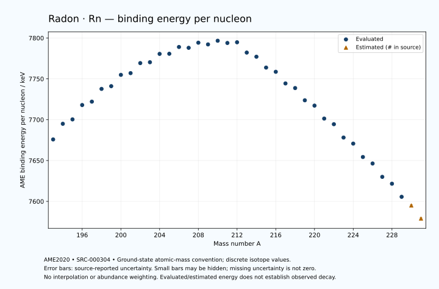

# Radon — Atomic Masses and Reaction Energies

<!-- generated-by: sync-ame2020.mjs -->

**Dated evaluated data · scientific coverage remains partial.** 39 ground-state nuclides from AME2020. Values and uncertainties are transcribed from the retained unrounded analysis files; estimated quantities remain labelled.

- [Parent Radon record](0086-Radon-Rn.md) · [NUBASE states and decays](0086-Radon-Rn-Nuclear-Evaluation.md)
- [Structured data](data/isotopes/0086-Radon-Rn-AME2020-Evaluation.yaml)
- [Original mass table](../../data/catalog/sources/ame2020-mass_1.mas20.txt) · [Original reaction table 1](../../data/catalog/sources/ame2020-rct1.mas20.txt) · [Original reaction table 2](../../data/catalog/sources/ame2020-rct2.mas20.txt)
- [AME2020 methods](https://doi.org/10.1088/1674-1137/abddb0) (SRC-000303) · [Tables and definitions](https://doi.org/10.1088/1674-1137/abddaf) (SRC-000304)

## Reading the data

All table energies and uncertainties are in keV; binding energy is per nucleon. A # replaces a decimal point in the original estimated value. UNKNOWN (*) retains the source's not-calculable entry; it is neither zero nor automatically NOT APPLICABLE. Source lines are one-based in the retained files. Uncertainties remain those published by the evaluation, with no replacement by independent-mass quadrature.

Atomic-mass conventions apply. Qα is total decay energy, not alpha-particle kinetic energy. Positive Q alone does not establish a decay branch, rate or observation. He-4's source Qα of zero is a bookkeeping identity. These tables describe ground-state combinations, not isomer or excited-daughter transitions. Nuclear state and daughter lookups are explicit in the structured companion. The binding quantity follows [Z M(¹H) + N mₙ − M(A,Z)]c²/A; it has not been converted to a bare-nucleus convention.

## Mass and binding table

| Nuclide | N | Atomic mass excess / keV | AME binding per nucleon / keV | Mass-file line |
|---|---:|---|---|---:|
| Rn-193 | 107 | 9042.920 ± 25.112 | 7675.8530 ± 0.1301 | 2693 |
| Rn-194 | 108 | 5724.624 ± 16.659 | 7694.9961 ± 0.0859 | 2707 |
| Rn-195 | 109 | 5050.285 ± 51.686 | 7700.3841 ± 0.2651 | 2720 |
| Rn-196 | 110 | 1975.169 ± 14.054 | 7717.9660 ± 0.0717 | 2733 |
| Rn-197 | 111 | 1510.368 ± 16.193 | 7722.1190 ± 0.0822 | 2746 |
| Rn-198 | 112 | -1230.320 ± 13.420 | 7737.7245 ± 0.0678 | 2759 |
| Rn-199 | 113 | -1559.846 ± 7.297 | 7741.0568 ± 0.0367 | 2772 |
| Rn-200 | 114 | -4000.454 ± 5.792 | 7754.9111 ± 0.0290 | 2784 |
| Rn-201 | 115 | -4107.413 ± 10.121 | 7757.0174 ± 0.0504 | 2796 |
| Rn-202 | 116 | -6274.561 ± 17.520 | 7769.3018 ± 0.0867 | 2809 |
| Rn-203 | 117 | -6184.045 ± 5.815 | 7770.3437 ± 0.0286 | 2822 |
| Rn-204 | 118 | -7970.115 ± 7.444 | 7780.5743 ± 0.0365 | 2834 |
| Rn-205 | 119 | -7709.764 ± 5.080 | 7780.7226 ± 0.0248 | 2846 |
| Rn-206 | 120 | -9132.918 ± 8.591 | 7789.0417 ± 0.0417 | 2858 |
| Rn-207 | 121 | -8634.742 ± 4.742 | 7787.9987 ± 0.0229 | 2870 |
| Rn-208 | 122 | -9655.389 ± 10.163 | 7794.2678 ± 0.0489 | 2882 |
| Rn-209 | 123 | -8941.049 ± 9.960 | 7792.1755 ± 0.0477 | 2894 |
| Rn-210 | 124 | -9604.764 ± 4.557 | 7796.6653 ± 0.0217 | 2906 |
| Rn-211 | 125 | -8755.330 ± 6.813 | 7793.9412 ± 0.0323 | 2917 |
| Rn-212 | 126 | -8659.219 ± 3.110 | 7794.7963 ± 0.0147 | 2929 |
| Rn-213 | 127 | -5695.949 ± 3.370 | 7782.1824 ± 0.0158 | 2941 |
| Rn-214 | 128 | -4319.664 ± 9.187 | 7777.1023 ± 0.0429 | 2953 |
| Rn-215 | 129 | -1168.990 ± 6.090 | 7763.8164 ± 0.0283 | 2965 |
| Rn-216 | 130 | 253.312 ± 5.768 | 7758.6553 ± 0.0267 | 2978 |
| Rn-217 | 131 | 3658.566 ± 4.198 | 7744.4037 ± 0.0193 | 2990 |
| Rn-218 | 132 | 5217.413 ± 2.316 | 7738.7527 ± 0.0106 | 3002 |
| Rn-219 | 133 | 8829.337 ± 2.100 | 7723.7784 ± 0.0096 | 3013 |
| Rn-220 | 134 | 10611.994 ± 1.814 | 7717.2552 ± 0.0082 | 3025 |
| Rn-221 | 135 | 14471.354 ± 5.714 | 7701.3941 ± 0.0259 | 3036 |
| Rn-222 | 136 | 16371.957 ± 1.944 | 7694.4991 ± 0.0088 | 3048 |
| Rn-223 | 137 | 20389.738 ± 7.822 | 7678.1720 ± 0.0351 | 3060 |
| Rn-224 | 138 | 22445.098 ± 9.814 | 7670.7514 ± 0.0438 | 3073 |
| Rn-225 | 139 | 26534.143 ± 11.140 | 7654.3581 ± 0.0495 | 3085 |
| Rn-226 | 140 | 28747.194 ± 10.477 | 7646.4108 ± 0.0464 | 3097 |
| Rn-227 | 141 | 32885.835 ± 14.091 | 7630.0508 ± 0.0621 | 3109 |
| Rn-228 | 142 | 35243.466 ± 17.677 | 7621.6457 ± 0.0775 | 3120 |
| Rn-229 | 143 | 39362.400 ± 13.041 | 7605.6227 ± 0.0569 | 3131 |
| Rn-230 | 144 | 42170# ± 200# | 7595# ± 1# | 3141 |
| Rn-231 | 145 | 46550# ± 300# | 7579# ± 1# | 3151 |

## Q-values and separation energies

| Nuclide | Qβ− / keV | Qα / keV | S₂n / keV | S₂p / keV | Reaction-file line |
|---|---|---|---|---|---:|
| Rn-193 | UNKNOWN (*) | 8039.9999 ± 12.0000 | UNKNOWN (*) | 466.2911 ± 26.0964 | 2692 |
| Rn-194 | UNKNOWN (*) | 7862.4159 ± 10.2109 | UNKNOWN (*) | 786.8349 ± 19.7482 | 2706 |
| Rn-195 | UNKNOWN (*) | 7694.0999 ± 51.1957 | 20135.2713 ± 57.4632 | 1202.3550 ± 53.6893 | 2719 |
| Rn-196 | UNKNOWN (*) | 7616.7366 ± 9.1879 | 19892.0908 ± 21.7809 | 1598.1561 ± 19.0668 | 2732 |
| Rn-197 | -8743.5996 ± 58.7110 | 7410.7546 ± 7.1454 | 19682.5529 ± 54.1627 | 1950.9193 ± 17.2835 | 2745 |
| Rn-198 | -10808.0177 ± 33.8991 | 7349.3816 ± 3.6598 | 19348.1247 ± 19.4148 | 2339.5304 ± 14.4549 | 2758 |
| Rn-199 | -8331.2349 ± 15.5446 | 7131.8922 ± 4.0913 | 19212.8509 ± 17.7612 | 2744.7103 ± 12.2671 | 2771 |
| Rn-200 | -10134.0327 ± 31.0688 | 7043.3611 ± 2.1381 | 18912.7709 ± 14.6122 | 3105.1182 ± 18.3556 | 2783 |
| Rn-201 | -7695.9856 ± 13.5972 | 6860.7498 ± 2.2816 | 18690.2023 ± 12.4774 | 3446.5260 ± 11.4854 | 2795 |
| Rn-202 | -9376.0984 ± 18.5296 | 6773.8018 ± 1.8291 | 18416.7424 ± 18.4465 | 3910.8193 ± 19.0259 | 2808 |
| Rn-203 | -7060.4572 ± 8.5231 | 6629.8682 ± 2.0824 | 18219.2682 ± 11.6727 | 4240.8208 ± 7.6296 | 2821 |
| Rn-204 | -8577.4239 ± 25.6840 | 6546.6520 ± 1.8199 | 17838.1911 ± 18.9728 | 4606.4885 ± 11.3586 | 2833 |
| Rn-205 | -6399.9479 ± 9.3288 | 6386.4860 ± 1.8383 | 17668.3556 ± 7.7199 | 4976.8877 ± 6.8801 | 2845 |
| Rn-206 | -7886.0592 ± 29.1075 | 6383.7351 ± 1.6439 | 17305.4388 ± 11.2992 | 5369.8149 ± 13.1877 | 2857 |
| Rn-207 | -5785.7211 ± 18.1857 | 6251.1611 ± 1.6269 | 17067.6136 ± 6.9492 | 5691.2855 ± 11.1202 | 2869 |
| Rn-208 | -6990.4614 ± 15.4656 | 6260.7403 ± 1.6650 | 16665.1072 ± 13.2583 | 6044.6632 ± 10.9118 | 2881 |
| Rn-209 | -5158.9051 ± 15.2153 | 6155.4331 ± 1.9512 | 16448.9438 ± 11.0307 | 6373.2911 ± 11.9752 | 2893 |
| Rn-210 | -6261.2558 ± 14.1720 | 6158.9884 ± 2.1626 | 16092.0108 ± 11.1241 | 6713.4990 ± 4.8173 | 2905 |
| Rn-211 | -4615.0152 ± 13.7862 | 5965.4548 ± 1.4416 | 15956.9165 ± 12.0617 | 6967.2571 ± 6.8549 | 2916 |
| Rn-212 | -5143.2210 ± 9.3064 | 6385.0720 ± 2.6220 | 15197.0914 ± 5.4847 | 7284.1017 ± 2.9174 | 2928 |
| Rn-213 | -2141.7493 ± 5.6996 | 8245.1500 ± 2.8629 | 13083.2553 ± 7.4287 | 7841.3986 ± 3.2125 | 2940 |
| Rn-214 | -3361.3369 ± 12.4238 | 9208.4798 ± 9.1150 | 11803.0809 ± 9.5705 | 8528.1978 ± 9.1166 | 2952 |
| Rn-215 | -1487.1274 ± 9.1890 | 8838.5865 ± 5.9595 | 11615.6773 ± 6.7703 | 9093.4134 ± 6.6296 | 2964 |
| Rn-216 | -2717.7096 ± 6.9366 | 8197.8049 ± 5.6519 | 11569.6596 ± 10.7265 | 9854.6574 ± 5.7274 | 2977 |
| Rn-217 | -656.0967 ± 7.5383 | 7887.1691 ± 2.8816 | 11315.0800 ± 7.2288 | 10377.6054 ± 4.6142 | 2989 |
| Rn-218 | -1842.0267 ± 4.4418 | 7262.4699 ± 1.8507 | 11178.5351 ± 6.0131 | 11142.8645 ± 2.7413 | 3001 |
| Rn-219 | 212.3984 ± 6.8938 | 6946.1921 ± 0.3055 | 10971.8649 ± 4.6049 | 11632.0572 ± 6.7037 | 3012 |
| Rn-220 | -870.3384 ± 4.0256 | 6404.7417 ± 0.1018 | 10748.0561 ± 2.7408 | 12322.6003 ± 1.9538 | 3024 |
| Rn-221 | 1194.1032 ± 7.2312 | 6162.9859 ± 3.1893 | 10500.6193 ± 5.8965 | 12787.9486 ± 16.8349 | 3035 |
| Rn-222 | -6.1461 ± 7.7013 | 5590.3894 ± 0.3055 | 10382.6727 ± 1.9299 | 13469.4475 ± 17.8048 | 3047 |
| Rn-223 | 2007.4091 ± 8.0568 | 5283.4618 ± 17.6619 | 10224.2520 ± 9.6869 | 13961.9605 ± 21.0673 | 3059 |
| Rn-224 | 696.4840 ± 14.8750 | 4756.7202 ± 20.2374 | 10069.4947 ± 10.0049 | 14619.1114 ± 41.2391 | 3072 |
| Rn-225 | 2713.5412 ± 16.3492 | 4335.4705 ± 22.5108 | 9998.2314 ± 13.6115 | 15122# ± 196# | 3084 |
| Rn-226 | 1226.6542 ± 12.1895 | 3836.0102 ± 41.4018 | 9840.5409 ± 14.3558 | 15741# ± 196# | 3096 |
| Rn-227 | 3203.3894 ± 15.2755 | 3382# ± 196# | 9790.9447 ± 17.9622 | 16272# ± 300# | 3108 |
| Rn-228 | 1859.2451 ± 18.9157 | 2908# ± 196# | 9646.3634 ± 20.5489 | 16883# ± 401# | 3119 |
| Rn-229 | 3694.1465 ± 13.9670 | 2358# ± 300# | 9666.0708 ± 19.1994 | 17496# ± 401# | 3130 |
| Rn-230 | 2683# ± 200# | 2196# ± 448# | 9216# ± 201# | UNKNOWN (*) | 3140 |
| Rn-231 | 4469# ± 300# | 1844# ± 500# | 8955# ± 300# | UNKNOWN (*) | 3150 |

## Additional decay-energy combinations

| Nuclide | Q₂β− / keV | Q₄β− / keV | Qεp / keV | Qβ−n / keV | Part 1 / part 2 line |
|---|---|---|---|---|---|
| Rn-193 | UNKNOWN (*) | UNKNOWN (*) | 9820.4327 ± 27.2675 | UNKNOWN (*) | 2692 / 2730 |
| Rn-194 | UNKNOWN (*) | UNKNOWN (*) | 6760.9548 ± 22.0998 | UNKNOWN (*) | 2706 / 2745 |
| Rn-195 | UNKNOWN (*) | UNKNOWN (*) | 8765.9310 ± 53.2729 | UNKNOWN (*) | 2719 / 2758 |
| Rn-196 | UNKNOWN (*) | UNKNOWN (*) | 5802.8525 ± 15.2975 | UNKNOWN (*) | 2732 / 2771 |
| Rn-197 | UNKNOWN (*) | UNKNOWN (*) | 7690.1285 ± 17.0626 | UNKNOWN (*) | 2745 / 2784 |
| Rn-198 | UNKNOWN (*) | UNKNOWN (*) | 4873.7877 ± 16.6531 | -19555.6055 ± 58.0074 | 2758 / 2797 |
| Rn-199 | UNKNOWN (*) | UNKNOWN (*) | 6624.4607 ± 18.8905 | -19208.8627 ± 31.9735 | 2771 / 2810 |
| Rn-200 | UNKNOWN (*) | UNKNOWN (*) | 3949.4035 ± 7.9381 | -18843.1608 ± 14.8975 | 2783 / 2823 |
| Rn-201 | -16044.2295 ± 22.6842 | UNKNOWN (*) | 5545.2997 ± 12.6442 | -18312.3092 ± 32.1585 | 2795 / 2835 |
| Rn-202 | -15349.4604 ± 23.0483 | UNKNOWN (*) | 2957.6345 ± 18.1842 | -17934.4515 ± 19.7331 | 2808 / 2848 |
| Rn-203 | -14785.3755 ± 11.2991 | UNKNOWN (*) | 4468.5533 ± 10.4371 | -17356.9007 ± 8.3789 | 2821 / 2861 |
| Rn-204 | -14031.2128 ± 11.6119 | UNKNOWN (*) | 2051.7321 ± 8.7720 | -16917.8460 ± 9.7083 | 2833 / 2873 |
| Rn-205 | -13513.6172 ± 23.3315 | UNKNOWN (*) | 3342.3101 ± 11.2496 | -16388.3907 ± 25.1009 | 2845 / 2885 |
| Rn-206 | -12698.5313 ± 19.9147 | UNKNOWN (*) | 1099.5090 ± 13.2253 | -15894.4199 ± 11.6203 | 2857 / 2898 |
| Rn-207 | -12148.7296 ± 58.4784 | UNKNOWN (*) | 2264.9555 ± 6.2109 | -15459.2008 ± 28.2120 | 2869 / 2910 |
| Rn-208 | -11383.3229 ± 13.5125 | -26343.4305 ± 33.4433 | 201.3400 ± 12.0608 | -14877.6867 ± 20.2851 | 2881 / 2922 |
| Rn-209 | -10799.2896 ± 11.4967 | -25336# ± 104# | 1239.1868 ± 10.0928 | -14347.4395 ± 15.3326 | 2893 / 2934 |
| Rn-210 | -10047.6025 ± 10.2493 | -23664.2848 ± 19.4415 | -527.7204 ± 4.8534 | -13893.9378 ± 12.3713 | 2905 / 2946 |
| Rn-211 | -9587.1996 ± 8.4314 | -22631.7258 ± 86.3385 | -91.2411 ± 6.7188 | -13483.1396 ± 15.0444 | 2916 / 2957 |
| Rn-212 | -8460.4566 ± 10.6179 | -20770.1055 ± 10.4621 | -3515.6980 ± 2.9623 | -12590.2228 ± 12.3821 | 2928 / 2970 |
| Rn-213 | -6041.5061 ± 10.3747 | -17816.0564 ± 9.7722 | -2615.5115 ± 3.1743 | -10251.2686 ± 9.3965 | 2940 / 2982 |
| Rn-214 | -4412.4045 ± 10.5633 | -15014.5957 ± 14.0166 | -4955.1164 ± 9.5526 | -8836.7826 ± 10.2726 | 2952 / 2994 |
| Rn-215 | -3700.9847 ± 9.2929 | -12090.4235 ± 8.7874 | -3987.9888 ± 6.0515 | -8281.9809 ± 10.3464 | 2964 / 3006 |
| Rn-216 | -3038.1538 ± 9.7402 | -10045.2245 ± 12.4264 | -6493.8880 ± 6.1020 | -8136.1431 ± 8.9789 | 2977 / 3019 |
| Rn-217 | -2230.9696 ± 8.0510 | -8547.2139 ± 11.4087 | -5412.7407 ± 4.4500 | -7383.7739 ± 5.6210 | 2989 / 3031 |
| Rn-218 | -1428.1429 ± 9.9524 | -7149.3334 ± 10.7515 | -7955.0100 ± 6.9030 | -7168.5675 ± 6.6670 | 3001 / 3044 |
| Rn-219 | -564.5153 ± 7.0930 | -5633.4426 ± 56.4938 | -6816.2853 ± 2.4313 | -6301.4208 ± 4.6672 | 3012 / 3055 |
| Rn-220 | 339.9023 ± 7.7427 | -4077.5442 ± 13.7717 | -9358.3383 ± 15.9389 | -6076.2636 ± 6.9910 | 3024 / 3067 |
| Rn-221 | 1507.4773 ± 7.3054 | -2468.5715 ± 9.8055 | -8081.0792 ± 18.5980 | -5082.2957 ± 6.9080 | 3035 / 3078 |
| Rn-222 | 2051.7519 ± 4.7093 | -831.0819 ± 10.3717 | -10690.7709 ± 19.6577 | -4976.6121 ± 5.0610 | 3047 / 3090 |
| Rn-223 | 3156.4935 ± 8.0964 | 1004.3365 ± 11.1481 | -9385.5003 ± 40.8109 | -4059.6828 ± 10.8035 | 3059 / 3102 |
| Rn-224 | 3619.2659 ± 9.9800 | 2449.5179 ± 13.7318 | -11922# ± 196# | -4008.5490 ± 10.0025 | 3072 / 3116 |
| Rn-225 | 4541.0996 ± 11.4380 | 4223.9504 ± 12.2485 | -10665# ± 196# | -3285.7893 ± 15.7809 | 3084 / 3128 |
| Rn-226 | 5079.6180 ± 10.6528 | 5549.5445 ± 11.3952 | -13122# ± 300# | -3144.7263 ± 15.9052 | 3096 / 3140 |
| Rn-227 | 5708.3708 ± 14.2245 | 7081.0756 ± 14.2446 | -11952# ± 401# | -2706.0230 ± 15.4067 | 3108 / 3152 |
| Rn-228 | 6303.2721 ± 17.7895 | 8472.5668 ± 17.7693 | -14326# ± 401# | -2510.2969 ± 18.6354 | 3119 / 3163 |
| Rn-229 | 6800.4372 ± 20.2110 | 9776.8828 ± 13.2607 | UNKNOWN (*) | -2093.1393 ± 14.6758 | 3130 / 3174 |
| Rn-230 | 7653# ± 201# | 11307# ± 200# | UNKNOWN (*) | -1570# ± 200# | 3140 / 3185 |
| Rn-231 | 8333# ± 300# | 12734# ± 300# | UNKNOWN (*) | -1009# ± 300# | 3150 / 3195 |

## Single-nucleon separation and reaction energies

| Nuclide | Sₙ / keV | Sₚ / keV | Q(d,α) / keV | Q(p,α) / keV | Q(n,α) / keV | Part 2 line |
|---|---|---|---|---|---|---:|
| Rn-193 | UNKNOWN (*) | 1171.7925 ± 37.5170 | 15889.8141 ± 29.8315 | UNKNOWN (*) | 19252.0305 ± 28.3495 | 2730 |
| Rn-194 | 11389.6146 ± 30.1323 | 1497.0241 ± 27.3032 | 13509.6890 ± 32.4721 | 6724.7657 ± 23.1697 | 16439.7567 ± 18.1064 | 2745 |
| Rn-195 | 8745.6567 ± 54.3032 | 1522.1963 ± 56.7786 | 15828.4153 ± 56.0302 | 6988.5985 ± 58.7227 | 18763.1707 ± 52.7674 | 2758 |
| Rn-196 | 11146.4341 ± 53.5613 | 1843.5029 ± 17.0041 | 13402.4658 ± 27.3837 | 6906.5474 ± 25.7961 | 15946.8733 ± 20.2083 | 2771 |
| Rn-197 | 8536.1188 ± 21.4344 | 1865.4279 ± 34.2984 | 15691.4744 ± 18.8108 | 7090.9132 ± 28.5408 | 18161.3875 ± 20.7030 | 2784 |
| Rn-198 | 10812.0059 ± 21.0239 | 2164.0358 ± 15.6147 | 13393.6624 ± 33.0795 | 7104.0347 ± 16.4841 | 15532.7372 ± 14.7173 | 2797 |
| Rn-199 | 8400.8450 ± 15.2754 | 2140.0709 ± 8.7920 | 15506.2154 ± 10.8155 | 7217.3836 ± 31.1032 | 17555.2870 ± 9.0675 | 2810 |
| Rn-200 | 10511.9259 ± 9.3162 | 2466.0481 ± 7.9081 | 13419.0994 ± 7.5893 | 7218.8557 ± 9.8627 | 15039.0262 ± 11.4359 | 2823 |
| Rn-201 | 8178.2764 ± 11.6613 | 2408.4901 ± 26.4759 | 15426.7716 ± 11.4644 | 7465.3892 ± 11.2469 | 17012.2677 ± 20.1505 | 2835 |
| Rn-202 | 10238.4659 ± 20.2334 | 2774.0901 ± 19.3374 | 13424.1401 ± 30.0912 | 7412.8719 ± 18.3287 | 14610.6705 ± 18.3400 | 2848 |
| Rn-203 | 7980.8023 ± 18.4579 | 2877.9094 ± 28.2073 | 15316.2037 ± 10.0397 | 7667.9041 ± 25.1464 | 16404.0408 ± 9.5486 | 2861 |
| Rn-204 | 9857.3888 ± 9.4424 | 3096.4795 ± 12.9518 | 13335.7979 ± 28.5878 | 7683.3812 ± 11.0636 | 14197.4528 ± 8.8943 | 2873 |
| Rn-205 | 7810.9668 ± 8.9678 | 3123.4838 ± 23.2304 | 15163.6499 ± 11.7682 | 7749.3973 ± 28.0651 | 15878.2071 ± 10.0234 | 2885 |
| Rn-206 | 9494.4720 ± 9.9558 | 3437.3703 ± 14.7965 | 13453.1404 ± 24.2416 | 7893.7441 ± 13.6506 | 13824.3027 ± 9.7643 | 2898 |
| Rn-207 | 7573.1416 ± 9.8131 | 3484.3248 ± 14.3355 | 15060.5843 ± 12.9539 | 8104.5650 ± 23.1587 | 15352.7059 ± 11.1316 | 2910 |
| Rn-208 | 9091.9656 ± 11.2149 | 3716.8786 ± 16.0340 | 13494.8057 ± 16.9164 | 8193.1849 ± 15.7589 | 13512.4112 ± 14.2952 | 2922 |
| Rn-209 | 7356.9781 ± 14.2258 | 3760.1193 ± 13.3709 | 14997.2394 ± 15.9091 | 8362.3938 ± 16.7990 | 14894.0211 ± 10.7362 | 2934 |
| Rn-210 | 8735.0327 ± 10.9519 | 4009.9620 ± 6.5675 | 13575.9441 ± 10.0176 | 8486.7729 ± 13.2161 | 13187.3385 ± 8.0460 | 2946 |
| Rn-211 | 7221.8838 ± 8.1742 | 4072.2015 ± 10.1512 | 14839.2504 ± 8.2384 | 8578.6266 ± 11.2229 | 14360.2797 ± 6.8372 | 2957 |
| Rn-212 | 7975.2076 ± 7.3228 | 4300.9992 ± 3.8300 | 14023.6870 ± 8.1495 | 9088.6090 ± 5.5828 | 13353.1976 ± 3.2179 | 2970 |
| Rn-213 | 5108.0476 ± 4.3071 | 4356.7711 ± 3.8030 | 16662.0494 ± 4.0280 | 11140.2056 ± 8.2438 | 15903.5131 ± 3.1712 | 2982 |
| Rn-214 | 6695.0333 ± 9.6509 | 5029.1135 ± 10.2860 | 15019.2918 ± 9.3540 | 12191.5823 ± 9.4477 | 13759.2306 ± 9.1300 | 2994 |
| Rn-215 | 4920.6440 ± 10.9029 | 5078.8095 ± 7.0972 | 16121.3386 ± 7.6487 | 12323.2140 ± 6.3402 | 14846.8206 ± 5.9826 | 3006 |
| Rn-216 | 6649.0156 ± 8.2301 | 5779.0752 ± 8.6891 | 14343.2710 ± 6.8230 | 11696.8892 ± 7.3950 | 12553.2334 ± 6.3352 | 3019 |
| Rn-217 | 4666.0643 ± 6.9598 | 5887.0830 ± 5.3383 | 15625.9566 ± 7.7324 | 11901.7729 ± 5.4810 | 13774.9407 ± 4.0367 | 3031 |
| Rn-218 | 6512.4708 ± 4.4364 | 6466.1558 ± 5.4001 | 13671.5424 ± 4.0267 | 11338.0521 ± 6.8988 | 11405.5862 ± 3.0350 | 3044 |
| Rn-219 | 4459.3941 ± 3.0210 | 6559.8519 ± 11.6452 | 15145.5463 ± 5.0236 | 11436.7145 ± 3.9790 | 12693.4037 ± 2.2748 | 3055 |
| Rn-220 | 6288.6620 ± 2.2734 | 7072.9988 ± 3.4104 | 13222.5822 ± 11.5699 | 11081.4505 ± 5.1110 | 10374.9432 ± 6.6254 | 3067 |
| Rn-221 | 4211.9573 ± 5.8073 | 7193.3653 ± 15.0957 | 14786.1400 ± 6.4180 | 11235.1911 ± 12.8041 | 11761.1047 ± 5.8481 | 3078 |
| Rn-222 | 6170.7153 ± 5.8402 | 7699.7433 ± 14.1070 | 12707.0155 ± 14.1070 | 10839.9909 ± 3.5005 | 9336.9984 ± 15.9542 | 3090 |
| Rn-223 | 4053.5366 ± 8.0599 | 7852.2610 ± 17.6619 | 14317.8162 ± 16.0129 | 10878.0451 ± 16.0129 | 10772.6782 ± 19.3498 | 3102 |
| Rn-224 | 6015.9581 ± 12.5501 | 8271.8808 ± 17.0748 | 12202.8771 ± 18.6301 | 10526.4243 ± 17.0748 | 8317.7438 ± 21.8853 | 3116 |
| Rn-225 | 3982.2733 ± 14.8462 | 8465.8460 ± 24.9775 | 13816.9420 ± 17.8695 | 10445.1700 ± 19.3610 | 9694.2777 ± 41.5744 | 3128 |
| Rn-226 | 5858.2675 ± 15.2924 | 8841# ± 300# | 11746.9826 ± 24.6891 | 10183.2407 ± 17.4642 | 7315# ± 196# | 3140 |
| Rn-227 | 3932.6771 ± 17.5590 | 9063# ± 300# | 13297# ± 300# | 10038.8717 ± 26.4260 | 8622# ± 196# | 3152 |
| Rn-228 | 5713.6863 ± 22.6061 | 9476# ± 300# | 11294# ± 300# | 9808# ± 300# | 6310# ± 300# | 3163 |
| Rn-229 | 3952.3845 ± 21.9671 | 9807# ± 400# | 12643# ± 300# | 9566# ± 300# | 7460# ± 401# | 3174 |
| Rn-230 | 5264# ± 201# | 10009# ± 447# | 11001# ± 447# | 9603# ± 361# | 5536# ± 448# | 3185 |
| Rn-231 | 3691# ± 361# | UNKNOWN (*) | 12371# ± 500# | 9534# ± 500# | UNKNOWN (*) | 3195 |

Qβ− comes from the mass-file line in the first table. Qα, S₂n, S₂p, Q₂β−, Qεp and Qβ−n come from reaction part 1; Q₄β− and the last table come from part 2. Qεp is electron-capture/proton energy balance; Qβ−n is beta-minus/neutron energy balance. These are evaluated mass combinations, not observations of decay modes, cross sections or reaction rates. Light-nuclide zero entries can be bookkeeping identities, without a physical A=0 residual. Definitions and original source strings are retained in the structured data.

## Binding-energy chart

Discrete source values and source-reported uncertainties. No interpolation, natural-abundance weighting or observed-decay claim is implied. This quantitative chart supplements the 22 separate illustrative panels.

## Remaining review

Later measurements, state-specific decay branches, isomer Q-values, reaction rates, applicability and full claim-level review remain open. Existing authored values retain their own provenance; this companion does not overwrite them.
