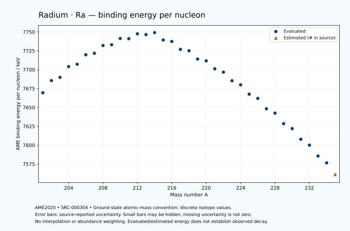

# Radium — Atomic Masses and Reaction Energies

<!-- generated-by: sync-ame2020.mjs -->

**Dated evaluated data · scientific coverage remains partial.** 35 ground-state nuclides from AME2020. Values and uncertainties are transcribed from the retained unrounded analysis files; estimated quantities remain labelled.

- [Parent Radium record](0088-Radium-Ra.md) · [NUBASE states and decays](0088-Radium-Ra-Nuclear-Evaluation.md)
- [Structured data](data/isotopes/0088-Radium-Ra-AME2020-Evaluation.yaml)
- [Original mass table](../../data/catalog/sources/ame2020-mass_1.mas20.txt) · [Original reaction table](../../data/catalog/sources/ame2020-rct1.mas20.txt)
- [AME2020 methods](https://doi.org/10.1088/1674-1137/abddb0) (SRC-000303) · [Tables and definitions](https://doi.org/10.1088/1674-1137/abddaf) (SRC-000304)

## Reading the data

All table energies and uncertainties are in keV; binding energy is per nucleon. A # replaces a decimal point in the original estimated value. UNKNOWN (*) retains the source's not-calculable entry; it is neither zero nor automatically NOT APPLICABLE. Source lines are one-based in the retained files. Uncertainties remain those published by the evaluation, with no replacement by independent-mass quadrature.

Atomic-mass conventions apply. Qα is total decay energy, not alpha-particle kinetic energy. Positive Q alone does not establish a decay branch, rate or observation. He-4's source Qα of zero is a bookkeeping identity. These tables describe ground-state combinations, not isomer or excited-daughter transitions. Nuclear state and daughter lookups are explicit in the structured companion. The binding quantity follows [Z M(¹H) + N mₙ − M(A,Z)]c²/A; it has not been converted to a bare-nucleus convention.

## Mass and binding table

| Nuclide | N | Atomic mass excess / keV | AME binding per nucleon / keV | Mass-file line |
|---|---:|---|---|---:|
| Ra-201 | 113 | 11936.817 ± 20.301 | 7669.4108 ± 0.1010 | 2798 |
| Ra-202 | 114 | 9074.900 ± 15.018 | 7685.5684 ± 0.0743 | 2811 |
| Ra-203 | 115 | 8601.331 ± 9.688 | 7689.8015 ± 0.0477 | 2824 |
| Ra-204 | 116 | 6061.097 ± 8.924 | 7704.1238 ± 0.0437 | 2836 |
| Ra-205 | 117 | 5803.853 ± 22.772 | 7707.1698 ± 0.1111 | 2848 |
| Ra-206 | 118 | 3565.613 ± 18.008 | 7719.8028 ± 0.0874 | 2860 |
| Ra-207 | 119 | 3513.988 ± 58.286 | 7721.7503 ± 0.2816 | 2872 |
| Ra-208 | 120 | 1727.934 ± 9.023 | 7732.0177 ± 0.0434 | 2884 |
| Ra-209 | 121 | 1858.240 ± 5.747 | 7733.0177 ± 0.0275 | 2896 |
| Ra-210 | 122 | 442.839 ± 9.193 | 7741.3687 ± 0.0438 | 2908 |
| Ra-211 | 123 | 831.870 ± 4.966 | 7741.0887 ± 0.0235 | 2919 |
| Ra-212 | 124 | -198.763 ± 10.254 | 7747.5078 ± 0.0484 | 2931 |
| Ra-213 | 125 | 345.557 ± 9.818 | 7746.4726 ± 0.0461 | 2943 |
| Ra-214 | 126 | 92.740 ± 5.250 | 7749.1719 ± 0.0245 | 2955 |
| Ra-215 | 127 | 2531.995 ± 7.201 | 7739.3249 ± 0.0335 | 2967 |
| Ra-216 | 128 | 3291.466 ± 8.004 | 7737.3458 ± 0.0371 | 2980 |
| Ra-217 | 129 | 5889.536 ± 7.047 | 7726.9122 ± 0.0325 | 2992 |
| Ra-218 | 130 | 6645.556 ± 9.807 | 7725.0241 ± 0.0450 | 3004 |
| Ra-219 | 131 | 9393.853 ± 6.814 | 7714.0560 ± 0.0311 | 3015 |
| Ra-220 | 132 | 10272.091 ± 7.595 | 7711.6879 ± 0.0345 | 3027 |
| Ra-221 | 133 | 12963.877 ± 4.630 | 7701.1352 ± 0.0210 | 3038 |
| Ra-222 | 134 | 14320.205 ± 4.454 | 7696.6931 ± 0.0201 | 3050 |
| Ra-223 | 135 | 17233.245 ± 2.090 | 7685.3101 ± 0.0094 | 3062 |
| Ra-224 | 136 | 18825.832 ± 1.811 | 7679.9236 ± 0.0081 | 3075 |
| Ra-225 | 137 | 21993.044 ± 2.596 | 7667.5866 ± 0.0115 | 3087 |
| Ra-226 | 138 | 23667.576 ± 1.927 | 7661.9636 ± 0.0085 | 3099 |
| Ra-227 | 139 | 27177.464 ± 1.946 | 7648.3048 ± 0.0086 | 3111 |
| Ra-228 | 140 | 28940.194 ± 1.995 | 7642.4289 ± 0.0088 | 3122 |
| Ra-229 | 141 | 32561.963 ± 15.441 | 7628.4862 ± 0.0674 | 3133 |
| Ra-230 | 142 | 34516.306 ± 10.296 | 7621.9144 ± 0.0448 | 3143 |
| Ra-231 | 143 | 38216.488 ± 11.370 | 7607.8418 ± 0.0492 | 3153 |
| Ra-232 | 144 | 40496.955 ± 9.151 | 7600.0099 ± 0.0394 | 3163 |
| Ra-233 | 145 | 44334.062 ± 8.603 | 7585.5644 ± 0.0369 | 3173 |
| Ra-234 | 146 | 46930.629 ± 8.383 | 7576.5439 ± 0.0358 | 3183 |
| Ra-235 | 147 | 51130# ± 300# | 7561# ± 1# | 3193 |

## Q-values and separation energies

| Nuclide | Qβ− / keV | Qα / keV | S₂n / keV | S₂p / keV | Reaction-file line |
|---|---|---|---|---|---:|
| Ra-201 | UNKNOWN (*) | 8001.5326 ± 12.2441 | UNKNOWN (*) | 1081.2789 ± 21.5726 | 2797 |
| Ra-202 | UNKNOWN (*) | 7880.3036 ± 6.7407 | UNKNOWN (*) | 1502.5879 ± 16.0920 | 2810 |
| Ra-203 | UNKNOWN (*) | 7736.2613 ± 6.3728 | 19478.1222 ± 22.4942 | 1869.1988 ± 14.0106 | 2823 |
| Ra-204 | UNKNOWN (*) | 7636.6358 ± 6.7898 | 19156.4387 ± 17.4658 | 2242.2843 ± 19.6564 | 2835 |
| Ra-205 | -8302.8357 ± 63.5402 | 7486.3498 ± 20.3988 | 18940.1138 ± 24.7469 | 2590.0444 ± 23.5024 | 2847 |
| Ra-206 | -9919.1406 ± 67.5328 | 7415.2578 ± 4.1635 | 18638.1203 ± 20.0925 | 3042.2135 ± 19.4243 | 2859 |
| Ra-207 | -7632.2404 ± 81.0004 | 7273.1168 ± 57.9950 | 18432.5012 ± 62.5762 | 3354.1900 ± 58.5066 | 2871 |
| Ra-208 | -9032.9208 ± 65.1111 | 7273.1333 ± 5.0982 | 17980.3156 ± 20.0822 | 3717.0903 ± 12.3961 | 2883 |
| Ra-209 | -6986.6464 ± 56.1409 | 7143.0886 ± 2.6860 | 17798.3837 ± 58.5682 | 4084.9602 ± 7.4503 | 2895 |
| Ra-210 | -8321.2403 ± 62.8832 | 7150.8409 ± 3.2700 | 17427.7312 ± 12.8202 | 4479.7143 ± 13.6556 | 2907 |
| Ra-211 | -6311.6152 ± 53.9818 | 7041.6957 ± 2.9334 | 17169.0065 ± 7.5953 | 4805.0229 ± 11.1292 | 2918 |
| Ra-212 | -7498.3626 ± 24.1666 | 7031.7107 ± 1.6690 | 16784.2374 ± 13.7233 | 5171.9408 ± 11.2069 | 2930 |
| Ra-213 | -5795.4721 ± 15.2463 | 6861.6908 ± 2.2765 | 16628.9487 ± 11.0031 | 5477.0551 ± 11.9456 | 2942 |
| Ra-214 | -6340.5313 ± 14.5317 | 7272.5886 ± 2.6063 | 15851.1330 ± 11.5060 | 5825.9824 ± 6.0725 | 2954 |
| Ra-215 | -3498.5554 ± 14.3395 | 8862.4086 ± 2.3309 | 13956.1987 ± 12.1709 | 6349.9986 ± 7.7858 | 2966 |
| Ra-216 | -4858.2701 ± 12.2147 | 9525.7696 ± 7.3754 | 12943.9103 ± 9.5536 | 6966.8119 ± 12.0827 | 2979 |
| Ra-217 | -2812.7853 ± 13.2129 | 9160.5687 ± 6.1884 | 12785.0951 ± 9.9456 | 7519.4164 ± 9.1724 | 2991 |
| Ra-218 | -4205.2887 ± 58.4224 | 8540.3045 ± 3.4317 | 12788.5460 ± 12.5606 | 8185.6982 ± 11.2620 | 3003 |
| Ra-219 | -2175.7005 ± 51.9016 | 8137.9268 ± 3.0559 | 12638.3192 ± 9.6681 | 8842.6556 ± 7.8482 | 3014 |
| Ra-220 | -3471.6640 ± 9.6266 | 7593.8629 ± 4.9407 | 12516.1013 ± 12.2981 | 9523.2644 ± 7.7825 | 3026 |
| Ra-221 | -1567.1715 ± 57.0591 | 6880.3948 ± 1.9528 | 12572.6120 ± 8.0875 | 10443.4026 ± 5.0019 | 3037 |
| Ra-222 | -2301.5922 ± 6.2737 | 6677.8757 ± 4.2266 | 12094.5223 ± 8.6998 | 10869.7305 ± 4.6071 | 3049 |
| Ra-223 | -591.8099 ± 6.9657 | 5978.9916 ± 0.2121 | 11873.2681 ± 4.9978 | 11816.0514 ± 5.8928 | 3061 |
| Ra-224 | -1408.3152 ± 4.0869 | 5788.9231 ± 0.1526 | 11637.0088 ± 4.6061 | 12124.0666 ± 1.9258 | 3074 |
| Ra-225 | 355.7386 ± 5.0067 | 5096.7734 ± 5.0907 | 11382.8376 ± 2.9683 | 12974.6370 ± 8.2414 | 3086 |
| Ra-226 | -641.6252 ± 3.2730 | 4870.7028 ± 0.2545 | 11300.8929 ± 1.9090 | 13355.4648 ± 10.0017 | 3098 |
| Ra-227 | 1327.9489 ± 2.2622 | 4362.8095 ± 8.0604 | 10958.2159 ± 2.8639 | 13934.6215 ± 11.3082 | 3110 |
| Ra-228 | 45.5402 ± 0.6344 | 4070.1799 ± 10.0150 | 10870.0176 ± 2.3190 | 14384.9416 ± 10.6653 | 3121 |
| Ra-229 | 1872.0266 ± 19.6229 | 3602.9038 ± 19.0396 | 10758.1371 ± 15.5630 | 14901.8139 ± 20.9038 | 3132 |
| Ra-230 | 677.9196 ± 18.8884 | 3344.1964 ± 14.6895 | 10566.5244 ± 10.4877 | 15305.1026 ± 20.4573 | 3142 |
| Ra-231 | 2453.6351 ± 17.3014 | 2905.7377 ± 18.1059 | 10488.1107 ± 19.1753 | 15723.8539 ± 17.3014 | 3152 |
| Ra-232 | 1342.5322 ± 15.9313 | 2828.5731 ± 19.9055 | 10161.9867 ± 13.7751 | 16251# ± 200# | 3162 |
| Ra-233 | 3026.0244 ± 15.6228 | 2546.7460 ± 15.6227 | 10025.0624 ± 14.2575 | 16793# ± 300# | 3172 |
| Ra-234 | 2089.4348 ± 16.2945 | 2336# ± 200# | 9708.9621 ± 12.4106 | UNKNOWN (*) | 3182 |
| Ra-235 | 3773# ± 300# | 2155# ± 424# | 9347# ± 300# | UNKNOWN (*) | 3192 |

Qβ− comes from the mass-file line in the first table. The other three columns come from the reaction-file line. Definitions and original source strings are retained in the structured data.

## Binding-energy chart

Discrete source values and source-reported uncertainties. No interpolation, natural-abundance weighting or observed-decay claim is implied. This quantitative chart supplements the 22 separate illustrative panels.

## Remaining review

Later measurements, state-specific decay branches, isomer Q-values, additional reaction channels and full claim-level review remain open. Existing authored values retain their own provenance; this companion does not overwrite them.
