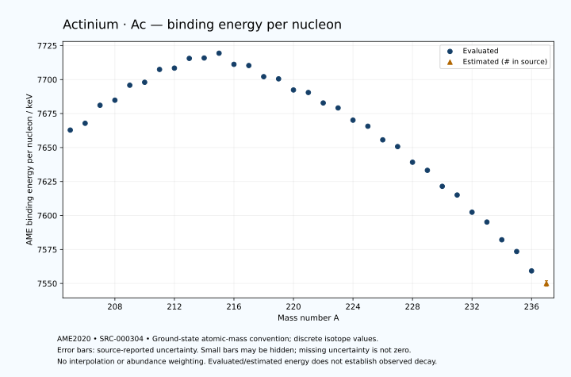

# Actinium — Atomic Masses and Reaction Energies

<!-- generated-by: sync-ame2020.mjs -->

**Dated evaluated data · scientific coverage remains partial.** 33 ground-state nuclides from AME2020. Values and uncertainties are transcribed from the retained unrounded analysis files; estimated quantities remain labelled.

- [Parent Actinium record](0089-Actinium-Ac.md) · [NUBASE states and decays](0089-Actinium-Ac-Nuclear-Evaluation.md)
- [Structured data](data/isotopes/0089-Actinium-Ac-AME2020-Evaluation.yaml)
- [Original mass table](../../data/catalog/sources/ame2020-mass_1.mas20.txt) · [Original reaction table](../../data/catalog/sources/ame2020-rct1.mas20.txt)
- [AME2020 methods](https://doi.org/10.1088/1674-1137/abddb0) (SRC-000303) · [Tables and definitions](https://doi.org/10.1088/1674-1137/abddaf) (SRC-000304)

## Reading the data

All table energies and uncertainties are in keV; binding energy is per nucleon. A # replaces a decimal point in the original estimated value. UNKNOWN (*) retains the source's not-calculable entry; it is neither zero nor automatically NOT APPLICABLE. Source lines are one-based in the retained files. Uncertainties remain those published by the evaluation, with no replacement by independent-mass quadrature.

Atomic-mass conventions apply. Qα is total decay energy, not alpha-particle kinetic energy. Positive Q alone does not establish a decay branch, rate or observation. He-4's source Qα of zero is a bookkeeping identity. These tables describe ground-state combinations, not isomer or excited-daughter transitions. Nuclear state and daughter lookups are explicit in the structured companion. The binding quantity follows [Z M(¹H) + N mₙ − M(A,Z)]c²/A; it has not been converted to a bare-nucleus convention.

## Mass and binding table

| Nuclide | N | Atomic mass excess / keV | AME binding per nucleon / keV | Mass-file line |
|---|---:|---|---|---:|
| Ac-205 | 116 | 14106.689 ± 59.320 | 7662.8519 ± 0.2894 | 2849 |
| Ac-206 | 117 | 13484.754 ± 65.088 | 7667.8538 ± 0.3160 | 2861 |
| Ac-207 | 118 | 11146.228 ± 56.248 | 7681.1001 ± 0.2717 | 2873 |
| Ac-208 | 119 | 10760.854 ± 64.483 | 7684.8289 ± 0.3100 | 2885 |
| Ac-209 | 120 | 8844.887 ± 55.846 | 7695.8455 ± 0.2672 | 2897 |
| Ac-210 | 121 | 8764.079 ± 62.208 | 7698.0182 ± 0.2962 | 2909 |
| Ac-211 | 122 | 7143.485 ± 53.753 | 7707.4680 ± 0.2548 | 2920 |
| Ac-212 | 123 | 7299.600 ± 21.883 | 7708.4479 ± 0.1032 | 2932 |
| Ac-213 | 124 | 6141.029 ± 11.665 | 7715.5908 ± 0.0548 | 2944 |
| Ac-214 | 125 | 6433.272 ± 13.551 | 7715.8874 ± 0.0633 | 2956 |
| Ac-215 | 126 | 6030.550 ± 12.406 | 7719.4137 ± 0.0577 | 2968 |
| Ac-216 | 127 | 8149.736 ± 9.230 | 7711.2319 ± 0.0427 | 2981 |
| Ac-217 | 128 | 8702.321 ± 11.223 | 7710.3448 ± 0.0517 | 2993 |
| Ac-218 | 129 | 10850.845 ± 57.616 | 7702.1450 ± 0.2643 | 3005 |
| Ac-219 | 130 | 11569.553 ± 51.477 | 7700.5489 ± 0.2351 | 3016 |
| Ac-220 | 131 | 13743.755 ± 6.129 | 7692.3515 ± 0.0279 | 3028 |
| Ac-221 | 132 | 14531.048 ± 56.901 | 7690.5039 ± 0.2575 | 3039 |
| Ac-222 | 133 | 16621.797 ± 4.699 | 7682.8015 ± 0.0212 | 3051 |
| Ac-223 | 134 | 17825.055 ± 6.947 | 7679.1479 ± 0.0312 | 3063 |
| Ac-224 | 135 | 20234.148 ± 4.089 | 7670.1438 ± 0.0183 | 3076 |
| Ac-225 | 136 | 21637.305 ± 4.758 | 7665.6906 ± 0.0211 | 3088 |
| Ac-226 | 137 | 24309.201 ± 3.100 | 7655.6628 ± 0.0137 | 3100 |
| Ac-227 | 138 | 25849.515 ± 1.926 | 7650.7084 ± 0.0085 | 3112 |
| Ac-228 | 139 | 28894.654 ± 2.093 | 7639.1973 ± 0.0092 | 3123 |
| Ac-229 | 140 | 30689.936 ± 12.109 | 7633.2446 ± 0.0529 | 3134 |
| Ac-230 | 141 | 33838.386 ± 15.835 | 7621.4604 ± 0.0689 | 3144 |
| Ac-231 | 142 | 35762.853 ± 13.041 | 7615.0768 ± 0.0565 | 3154 |
| Ac-232 | 143 | 39154.423 ± 13.041 | 7602.4245 ± 0.0562 | 3164 |
| Ac-233 | 144 | 41308.037 ± 13.041 | 7595.1939 ± 0.0560 | 3174 |
| Ac-234 | 145 | 44841.195 ± 13.972 | 7582.1297 ± 0.0597 | 3184 |
| Ac-235 | 146 | 47357.160 ± 13.972 | 7573.5051 ± 0.0595 | 3194 |
| Ac-236 | 147 | 51220.998 ± 38.191 | 7559.2423 ± 0.1618 | 3203 |
| Ac-237 | 148 | 54020# ± 400# | 7550# ± 2# | 3212 |

## Q-values and separation energies

| Nuclide | Qβ− / keV | Qα / keV | S₂n / keV | S₂p / keV | Reaction-file line |
|---|---|---|---|---|---:|
| Ac-205 | UNKNOWN (*) | 8093.1999 ± 58.6205 | UNKNOWN (*) | 1347.6659 ± 59.6459 | 2848 |
| Ac-206 | UNKNOWN (*) | 7958.2999 ± 64.8074 | UNKNOWN (*) | 1700.4969 ± 69.5747 | 2860 |
| Ac-207 | UNKNOWN (*) | 7844.8999 ± 55.9017 | 19103.0966 ± 81.7474 | 2121.8975 ± 56.7895 | 2872 |
| Ac-208 | -5927.1868 ± 71.9264 | 7728.6302 ± 59.6138 | 18866.5353 ± 91.6212 | 2570.2287 ± 70.2245 | 2884 |
| Ac-209 | -7550# ± 117# | 7729.7872 ± 55.2952 | 18443.9777 ± 79.2629 | 2884.0349 ± 58.5407 | 2896 |
| Ac-210 | -5295.4420 ± 65.0180 | 7586.0220 ± 57.4594 | 18139.4117 ± 89.5982 | 3148.9354 ± 63.2904 | 2908 |
| Ac-211 | -6732.9111 ± 101.4758 | 7567.5897 ± 52.4760 | 17844.0378 ± 77.5122 | 3652.3129 ± 54.9699 | 2919 |
| Ac-212 | -4811.2864 ± 24.1055 | 7539.6118 ± 23.9586 | 17607.1151 ± 65.9445 | 3934.8341 ± 25.6708 | 2931 |
| Ac-213 | -5979.0781 ± 14.8635 | 7498.2578 ± 4.2486 | 17145.0917 ± 55.0038 | 4296.5982 ± 16.6986 | 2943 |
| Ac-214 | -4261.6599 ± 17.2389 | 7351.8640 ± 2.4984 | 17008.9643 ± 25.7395 | 4628.6722 ± 16.1360 | 2955 |
| Ac-215 | -4890.8833 ± 13.9296 | 7745.9488 ± 3.1828 | 16253.1154 ± 16.9992 | 4993.1925 ± 13.2668 | 2967 |
| Ac-216 | -2148.8006 ± 14.4375 | 9240.8187 ± 2.8621 | 14426.1715 ± 16.3878 | 5469.8787 ± 12.5578 | 2980 |
| Ac-217 | -3503.4590 ± 15.4454 | 9831.6047 ± 10.1882 | 13470.8652 ± 16.7275 | 6193.7585 ± 13.2238 | 2992 |
| Ac-218 | -1515.9019 ± 58.5648 | 9384.2563 ± 56.9829 | 13441.5274 ± 58.3502 | 6698.1192 ± 57.7448 | 3004 |
| Ac-219 | -2893.2268 ± 76.3627 | 8826.4999 ± 50.9902 | 13275.4040 ± 52.6770 | 7323.0518 ± 51.8544 | 3015 |
| Ac-220 | -945.7825 ± 14.9144 | 8347.8172 ± 4.4884 | 13249.7260 ± 57.9190 | 7893.6271 ± 7.1960 | 3027 |
| Ac-221 | -2408.8773 ± 57.4376 | 7791.4696 ± 56.5253 | 13181.1410 ± 76.7071 | 8663.8327 ± 57.3000 | 3038 |
| Ac-222 | -581.2415 ± 11.1289 | 7137.4413 ± 2.0368 | 13264.5940 ± 7.4787 | 9438.4767 ± 6.0306 | 3050 |
| Ac-223 | -1560.3471 ± 10.4712 | 6783.1999 ± 1.0000 | 12848.6297 ± 57.3087 | 10030.1384 ± 8.3527 | 3062 |
| Ac-224 | 238.5672 ± 10.3428 | 6326.8999 ± 0.7000 | 12530.2858 ± 6.0711 | 10721.8975 ± 8.4999 | 3075 |
| Ac-225 | -672.8878 ± 6.6576 | 5935.1380 ± 1.4294 | 12330.3860 ± 8.2776 | 11322.9665 ± 4.6932 | 3087 |
| Ac-226 | 1111.5517 ± 4.5626 | 5506.1819 ± 8.0710 | 12067.5829 ± 4.9569 | 12017.3556 ± 11.5998 | 3099 |
| Ac-227 | 44.7559 ± 0.8297 | 5042.2697 ± 0.1425 | 11930.4262 ± 4.6912 | 12549.0292 ± 12.1059 | 3111 |
| Ac-228 | 2123.7545 ± 2.6446 | 4721.1237 ± 11.3723 | 11557.1831 ± 3.4488 | 13203.8276 ± 6.5725 | 3122 |
| Ac-229 | 1104.4191 ± 12.3458 | 4444.4184 ± 17.0248 | 11302.2148 ± 12.2617 | 13570.4511 ± 13.4696 | 3133 |
| Ac-230 | 2975.8745 ± 15.8815 | 3892.9309 ± 17.0169 | 11198.9038 ± 15.9732 | 14123.7771 ± 17.2068 | 3143 |
| Ac-231 | 1947.0425 ± 13.0976 | 3655.4921 ± 14.3128 | 11069.7192 ± 17.7962 | 14483.3425 ± 13.9670 | 3153 |
| Ac-232 | 3707.7131 ± 13.1181 | 3345.2860 ± 14.6758 | 10826.5993 ± 20.5140 | 14910.2876 ± 14.5896 | 3163 |
| Ac-233 | 2576.3950 ± 13.1184 | 3214.8682 ± 13.9670 | 10597.4517 ± 18.4426 | 15350.4796 ± 15.1605 | 3173 |
| Ac-234 | 4228.2364 ± 14.2103 | 2929.5101 ± 15.4278 | 10455.8646 ± 19.1127 | 15809.5819 ± 19.7600 | 3183 |
| Ac-235 | 3339.4064 ± 19.1127 | 2851.6694 ± 15.9688 | 10093.5134 ± 19.1127 | 16140.8344 ± 24.0390 | 3193 |
| Ac-236 | 4965.7951 ± 40.6669 | 2723.2474 ± 40.6669 | 9762.8330 ± 40.6669 | UNKNOWN (*) | 3202 |
| Ac-237 | 4065# ± 400# | 2675# ± 400# | 9480# ± 400# | UNKNOWN (*) | 3211 |

Qβ− comes from the mass-file line in the first table. The other three columns come from the reaction-file line. Definitions and original source strings are retained in the structured data.

## Binding-energy chart

Discrete source values and source-reported uncertainties. No interpolation, natural-abundance weighting or observed-decay claim is implied. This quantitative chart supplements the 22 separate illustrative panels.

## Remaining review

Later measurements, state-specific decay branches, isomer Q-values, additional reaction channels and full claim-level review remain open. Existing authored values retain their own provenance; this companion does not overwrite them.
