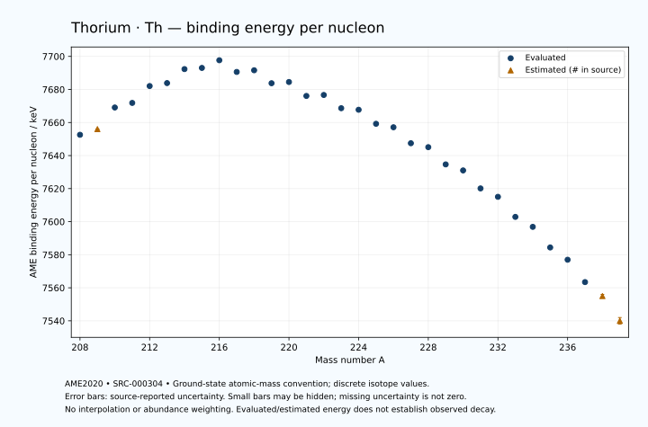

# Thorium — Atomic Masses and Reaction Energies

<!-- generated-by: sync-ame2020.mjs -->

**Dated evaluated data · scientific coverage remains partial.** 32 ground-state nuclides from AME2020. Values and uncertainties are transcribed from the retained unrounded analysis files; estimated quantities remain labelled.

- [Parent Thorium record](0090-Thorium-Th.md) · [NUBASE states and decays](0090-Thorium-Th-Nuclear-Evaluation.md)
- [Structured data](data/isotopes/0090-Thorium-Th-AME2020-Evaluation.yaml)
- [Original mass table](../../data/catalog/sources/ame2020-mass_1.mas20.txt) · [Original reaction table](../../data/catalog/sources/ame2020-rct1.mas20.txt)
- [AME2020 methods](https://doi.org/10.1088/1674-1137/abddb0) (SRC-000303) · [Tables and definitions](https://doi.org/10.1088/1674-1137/abddaf) (SRC-000304)

## Reading the data

All table energies and uncertainties are in keV; binding energy is per nucleon. A # replaces a decimal point in the original estimated value. UNKNOWN (*) retains the source's not-calculable entry; it is neither zero nor automatically NOT APPLICABLE. Source lines are one-based in the retained files. Uncertainties remain those published by the evaluation, with no replacement by independent-mass quadrature.

Atomic-mass conventions apply. Qα is total decay energy, not alpha-particle kinetic energy. Positive Q alone does not establish a decay branch, rate or observation. He-4's source Qα of zero is a bookkeeping identity. These tables describe ground-state combinations, not isomer or excited-daughter transitions. Nuclear state and daughter lookups are explicit in the structured companion. The binding quantity follows [Z M(¹H) + N mₙ − M(A,Z)]c²/A; it has not been converted to a bare-nucleus convention.

## Mass and binding table

| Nuclide | N | Atomic mass excess / keV | AME binding per nucleon / keV | Mass-file line |
|---|---:|---|---|---:|
| Th-208 | 118 | 16688.041 ± 31.865 | 7652.5716 ± 0.1532 | 2886 |
| Th-209 | 119 | 16395# ± 103# | 7656# ± 0# | 2898 |
| Th-210 | 120 | 14059.521 ± 18.909 | 7669.0764 ± 0.0900 | 2910 |
| Th-211 | 121 | 13876.396 ± 86.070 | 7671.8506 ± 0.4079 | 2921 |
| Th-212 | 122 | 12110.886 ± 10.109 | 7682.0628 ± 0.0477 | 2933 |
| Th-213 | 123 | 12120.108 ± 9.217 | 7683.8470 ± 0.0433 | 2945 |
| Th-214 | 124 | 10694.932 ± 10.661 | 7692.3173 ± 0.0498 | 2957 |
| Th-215 | 125 | 10921.434 ± 6.335 | 7693.0266 ± 0.0295 | 2969 |
| Th-216 | 126 | 10298.537 ± 11.104 | 7697.6617 ± 0.0514 | 2982 |
| Th-217 | 127 | 12205.780 ± 10.614 | 7690.5945 ± 0.0489 | 2994 |
| Th-218 | 128 | 12366.747 ± 10.516 | 7691.6026 ± 0.0482 | 3006 |
| Th-219 | 129 | 14462.780 ± 56.460 | 7683.7655 ± 0.2578 | 3017 |
| Th-220 | 130 | 14689.538 ± 13.687 | 7684.4964 ± 0.0622 | 3029 |
| Th-221 | 131 | 16939.926 ± 7.994 | 7676.0640 ± 0.0362 | 3040 |
| Th-222 | 132 | 17203.039 ± 10.216 | 7676.6592 ± 0.0460 | 3052 |
| Th-223 | 133 | 19385.402 ± 7.943 | 7668.6426 ± 0.0356 | 3064 |
| Th-224 | 134 | 19995.581 ± 9.604 | 7667.7162 ± 0.0429 | 3077 |
| Th-225 | 135 | 22310.193 ± 5.093 | 7659.2229 ± 0.0226 | 3089 |
| Th-226 | 136 | 23197.649 ± 4.481 | 7657.1195 ± 0.0198 | 3101 |
| Th-227 | 137 | 25804.759 ± 2.088 | 7647.4591 ± 0.0092 | 3113 |
| Th-228 | 138 | 26770.899 ± 1.806 | 7645.0807 ± 0.0079 | 3124 |
| Th-229 | 139 | 29585.517 ± 2.404 | 7634.6510 ± 0.0105 | 3135 |
| Th-230 | 140 | 30862.512 ± 1.209 | 7630.9974 ± 0.0053 | 3145 |
| Th-231 | 141 | 33815.811 ± 1.217 | 7620.1188 ± 0.0053 | 3155 |
| Th-232 | 142 | 35446.710 ± 1.421 | 7615.0338 ± 0.0061 | 3165 |
| Th-233 | 143 | 38731.642 ± 1.424 | 7602.8937 ± 0.0061 | 3175 |
| Th-234 | 144 | 40612.958 ± 2.589 | 7596.8557 ± 0.0111 | 3185 |
| Th-235 | 145 | 44017.754 ± 13.041 | 7584.3862 ± 0.0555 | 3195 |
| Th-236 | 146 | 46255.203 ± 13.972 | 7576.9688 ± 0.0592 | 3204 |
| Th-237 | 147 | 49955.097 ± 15.835 | 7563.4433 ± 0.0668 | 3213 |
| Th-238 | 148 | 52525# ± 283# | 7555# ± 1# | 3222 |
| Th-239 | 149 | 56500# ± 400# | 7540# ± 2# | 3231 |

## Q-values and separation energies

| Nuclide | Qβ− / keV | Qα / keV | S₂n / keV | S₂p / keV | Reaction-file line |
|---|---|---|---|---|---:|
| Th-208 | UNKNOWN (*) | 8202.0281 ± 30.5894 | UNKNOWN (*) | 1455.5139 ± 36.5981 | 2885 |
| Th-209 | UNKNOWN (*) | 8166# ± 106# | UNKNOWN (*) | 1697# ± 119# | 2897 |
| Th-210 | UNKNOWN (*) | 8068.9919 ± 5.7680 | 18771.1566 ± 37.0498 | 2246.3549 ± 20.8941 | 2909 |
| Th-211 | -8175.8296 ± 110.6091 | 7937.4924 ± 63.3304 | 18661# ± 134# | 2559.7862 ± 86.2611 | 2920 |
| Th-212 | -9485.6366 ± 88.1858 | 7958.0367 ± 4.5583 | 18091.2707 ± 21.3856 | 2909.8944 ± 13.6064 | 2932 |
| Th-213 | -7534.0866 ± 57.9078 | 7836.9514 ± 7.2067 | 17898.9247 ± 86.5616 | 3289.7045 ± 10.4702 | 2944 |
| Th-214 | -8764.9630 ± 81.9051 | 7827.1772 ± 5.3992 | 17558.5907 ± 14.6385 | 3684.2478 ± 14.7472 | 2956 |
| Th-215 | -6883.1037 ± 82.6932 | 7664.6478 ± 3.9321 | 17341.3102 ± 11.1842 | 4002.0659 ± 11.6845 | 2968 |
| Th-216 | -7525.2616 ± 27.0327 | 8072.3838 ± 4.2621 | 16539.0308 ± 15.3508 | 4372.1456 ± 12.2700 | 2981 |
| Th-217 | -4848.9680 ± 16.3966 | 9435.3069 ± 4.0315 | 14858.2895 ± 12.3605 | 4904.1568 ± 12.8212 | 2993 |
| Th-218 | -6282.8212 ± 20.7132 | 9849.0906 ± 9.1118 | 14074.4262 ± 15.2833 | 5502.6614 ± 13.2021 | 3005 |
| Th-219 | -4120.4434 ± 89.7010 | 9505.8694 ± 55.9984 | 13885.6362 ± 57.4474 | 6004.6979 ± 56.8748 | 3016 |
| Th-220 | -5588.8595 ± 20.0508 | 8973.1556 ± 11.1020 | 13819.8454 ± 17.2497 | 6533.9608 ± 16.7637 | 3028 |
| Th-221 | -3435.0112 ± 59.9069 | 8625.4740 ± 3.7755 | 13665.4904 ± 57.0000 | 7031.8692 ± 10.3791 | 3039 |
| Th-222 | -4861.3220 ± 87.1915 | 8132.5665 ± 2.8606 | 13629.1350 ± 17.0061 | 7646.9945 ± 12.6264 | 3051 |
| Th-223 | -2952.2124 ± 76.0305 | 7566.6333 ± 4.0825 | 13697.1599 ± 11.1531 | 8156.4172 ± 9.0595 | 3063 |
| Th-224 | -3866.7705 ± 12.1339 | 7298.5734 ± 5.8787 | 13350.0944 ± 13.9279 | 8902.5667 ± 10.4998 | 3076 |
| Th-225 | -2046.4473 ± 82.0038 | 6921.3999 ± 2.1213 | 13217.8453 ± 9.3046 | 9500.9943 ± 5.4293 | 3088 |
| Th-226 | -2835.9504 ± 11.9702 | 6452.5282 ± 1.0117 | 12940.5675 ± 10.5126 | 10206.1254 ± 4.6292 | 3100 |
| Th-227 | -1025.6117 ± 7.2815 | 6146.5981 ± 0.1000 | 12648.0699 ± 5.4285 | 10766.2267 ± 2.9667 | 3112 |
| Th-228 | -2152.6993 ± 4.3399 | 5520.1511 ± 0.2236 | 12569.3858 ± 4.6270 | 11474.6183 ± 1.8998 | 3123 |
| Th-229 | -311.3310 ± 3.7152 | 5167.5578 ± 1.0244 | 12361.8779 ± 2.8041 | 12169.8888 ± 2.6906 | 3134 |
| Th-230 | -1311.0313 ± 2.8334 | 4770.0202 ± 1.5149 | 12051.0239 ± 1.1439 | 12655.6246 ± 1.7579 | 3144 |
| Th-231 | 391.4727 ± 1.4598 | 4213.4310 ± 1.5514 | 11912.3427 ± 2.2135 | 13324.0943 ± 15.4887 | 3154 |
| Th-232 | -499.8388 ± 7.7338 | 4081.5999 ± 1.4000 | 11558.4379 ± 1.0630 | 13647.5380 ± 10.3939 | 3164 |
| Th-233 | 1242.2320 ± 1.1224 | 3744.7638 ± 15.5063 | 11226.8043 ± 1.0749 | 14062.7879 ± 11.4586 | 3174 |
| Th-234 | 274.0882 ± 3.1716 | 3671.7365 ± 10.6168 | 10976.3879 ± 2.5727 | 14461.9393 ± 9.5102 | 3184 |
| Th-235 | 1728.8531 ± 19.1127 | 3376.3498 ± 17.3014 | 10856.5248 ± 13.1184 | 14894.2502 ± 15.6228 | 3194 |
| Th-236 | 921.2477 ± 19.7600 | 3333.3314 ± 16.7023 | 10500.3917 ± 14.2103 | 15253.3688 ± 16.2945 | 3203 |
| Th-237 | 2427.4736 ± 20.5140 | 3196.1195 ± 18.0212 | 10205.2927 ± 20.5140 | 15753# ± 300# | 3212 |
| Th-238 | 1631# ± 284# | 3169# ± 283# | 9873# ± 284# | UNKNOWN (*) | 3221 |
| Th-239 | 3162# ± 445# | 2945# ± 500# | 9598# ± 400# | UNKNOWN (*) | 3230 |

Qβ− comes from the mass-file line in the first table. The other three columns come from the reaction-file line. Definitions and original source strings are retained in the structured data.

## Binding-energy chart

Discrete source values and source-reported uncertainties. No interpolation, natural-abundance weighting or observed-decay claim is implied. This quantitative chart supplements the 22 separate illustrative panels.

## Remaining review

Later measurements, state-specific decay branches, isomer Q-values, additional reaction channels and full claim-level review remain open. Existing authored values retain their own provenance; this companion does not overwrite them.
