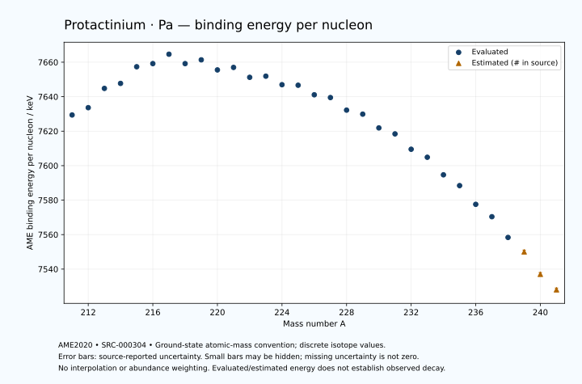

# Protactinium — Atomic Masses and Reaction Energies

<!-- generated-by: sync-ame2020.mjs -->

**Dated evaluated data · scientific coverage remains partial.** 31 ground-state nuclides from AME2020. Values and uncertainties are transcribed from the retained unrounded analysis files; estimated quantities remain labelled.

- [Parent Protactinium record](0091-Protactinium-Pa.md) · [NUBASE states and decays](0091-Protactinium-Pa-Nuclear-Evaluation.md)
- [Structured data](data/isotopes/0091-Protactinium-Pa-AME2020-Evaluation.yaml)
- [Original mass table](../../data/catalog/sources/ame2020-mass_1.mas20.txt) · [Original reaction table 1](../../data/catalog/sources/ame2020-rct1.mas20.txt) · [Original reaction table 2](../../data/catalog/sources/ame2020-rct2.mas20.txt)
- [AME2020 methods](https://doi.org/10.1088/1674-1137/abddb0) (SRC-000303) · [Tables and definitions](https://doi.org/10.1088/1674-1137/abddaf) (SRC-000304)

## Reading the data

All table energies and uncertainties are in keV; binding energy is per nucleon. A # replaces a decimal point in the original estimated value. UNKNOWN (*) retains the source's not-calculable entry; it is neither zero nor automatically NOT APPLICABLE. Source lines are one-based in the retained files. Uncertainties remain those published by the evaluation, with no replacement by independent-mass quadrature.

Atomic-mass conventions apply. Qα is total decay energy, not alpha-particle kinetic energy. Positive Q alone does not establish a decay branch, rate or observation. He-4's source Qα of zero is a bookkeeping identity. These tables describe ground-state combinations, not isomer or excited-daughter transitions. Nuclear state and daughter lookups are explicit in the structured companion. The binding quantity follows [Z M(¹H) + N mₙ − M(A,Z)]c²/A; it has not been converted to a bare-nucleus convention.

## Mass and binding table

| Nuclide | N | Atomic mass excess / keV | AME binding per nucleon / keV | Mass-file line |
|---|---:|---|---|---:|
| Pa-211 | 120 | 22052.226 ± 69.472 | 7629.3948 ± 0.3293 | 2922 |
| Pa-212 | 121 | 21596.523 ± 87.604 | 7633.6289 ± 0.4132 | 2934 |
| Pa-213 | 122 | 19654.194 ± 57.170 | 7644.8027 ± 0.2684 | 2946 |
| Pa-214 | 123 | 19459.895 ± 81.208 | 7647.7037 ± 0.3795 | 2958 |
| Pa-215 | 124 | 17804.537 ± 82.450 | 7657.3733 ± 0.3835 | 2970 |
| Pa-216 | 125 | 17823.799 ± 24.647 | 7659.2006 ± 0.1141 | 2983 |
| Pa-217 | 126 | 17054.748 ± 12.498 | 7664.6438 ± 0.0576 | 2995 |
| Pa-218 | 127 | 18649.568 ± 17.846 | 7659.1935 ± 0.0819 | 3007 |
| Pa-219 | 128 | 18583.223 ± 69.705 | 7661.3783 ± 0.3183 | 3018 |
| Pa-220 | 129 | 20278.397 ± 14.655 | 7655.5364 ± 0.0666 | 3030 |
| Pa-221 | 130 | 20374.937 ± 59.380 | 7656.9809 ± 0.2687 | 3041 |
| Pa-222 | 131 | 22064.361 ± 86.606 | 7651.2373 ± 0.3901 | 3053 |
| Pa-223 | 132 | 22337.614 ± 75.632 | 7651.8957 ± 0.3392 | 3065 |
| Pa-224 | 133 | 23862.351 ± 7.587 | 7646.9612 ± 0.0339 | 3078 |
| Pa-225 | 134 | 24356.640 ± 81.867 | 7646.6504 ± 0.3639 | 3090 |
| Pa-226 | 135 | 26033.600 ± 11.213 | 7641.1093 ± 0.0496 | 3102 |
| Pa-227 | 136 | 26830.371 ± 7.263 | 7639.4945 ± 0.0320 | 3114 |
| Pa-228 | 137 | 28923.599 ± 4.340 | 7632.2076 ± 0.0190 | 3125 |
| Pa-229 | 138 | 29896.848 ± 3.280 | 7629.8752 ± 0.0143 | 3136 |
| Pa-230 | 139 | 32173.543 ± 3.038 | 7621.8958 ± 0.0132 | 3146 |
| Pa-231 | 140 | 33424.338 ± 1.771 | 7618.4267 ± 0.0077 | 3156 |
| Pa-232 | 141 | 35946.549 ± 7.645 | 7609.5072 ± 0.0330 | 3166 |
| Pa-233 | 142 | 37489.410 ± 1.336 | 7604.8675 ± 0.0057 | 3176 |
| Pa-234 | 143 | 40338.870 ± 4.094 | 7594.6837 ± 0.0175 | 3186 |
| Pa-235 | 144 | 42288.901 ± 13.972 | 7588.4139 ± 0.0595 | 3196 |
| Pa-236 | 145 | 45333.955 ± 13.972 | 7577.5573 ± 0.0592 | 3205 |
| Pa-237 | 146 | 47527.624 ± 13.041 | 7570.3847 ± 0.0550 | 3214 |
| Pa-238 | 147 | 50894.043 ± 15.835 | 7558.3449 ± 0.0665 | 3223 |
| Pa-239 | 148 | 53337# ± 196# | 7550# ± 1# | 3232 |
| Pa-240 | 149 | 57010# ± 200# | 7537# ± 1# | 3241 |
| Pa-241 | 150 | 59740# ± 300# | 7528# ± 1# | 3250 |

## Q-values and separation energies

| Nuclide | Qβ− / keV | Qα / keV | S₂n / keV | S₂p / keV | Reaction-file line |
|---|---|---|---|---|---:|
| Pa-211 | UNKNOWN (*) | 8481.0817 ± 40.7744 | UNKNOWN (*) | 1370.6030 ± 89.1357 | 2921 |
| Pa-212 | UNKNOWN (*) | 8410.7525 ± 59.3000 | UNKNOWN (*) | 1745.4982 ± 107.4445 | 2933 |
| Pa-213 | UNKNOWN (*) | 8384.3916 ± 12.2301 | 18540.6678 ± 89.9708 | 2067.2330 ± 78.4711 | 2945 |
| Pa-214 | UNKNOWN (*) | 8270.8999 ± 52.2015 | 18279.2643 ± 119.4543 | 2417.6473 ± 84.1051 | 2957 |
| Pa-215 | -7084.7747 ± 132.8246 | 8236.1363 ± 62.5194 | 17992.2930 ± 100.3314 | 2914.4343 ± 83.2712 | 2969 |
| Pa-216 | -5242.6308 ± 37.3721 | 8099.2828 ± 11.3392 | 17778.7323 ± 84.8661 | 3187.4153 ± 28.1265 | 2982 |
| Pa-217 | -5916# ± 81# | 8488.8028 ± 4.4886 | 16892.4252 ± 83.3921 | 3553.7442 ± 17.5818 | 2994 |
| Pa-218 | -3245.0869 ± 22.5042 | 9791.3805 ± 11.6121 | 15316.8666 ± 30.4293 | 4078.1104 ± 20.0849 | 3006 |
| Pa-219 | -4712.7298 ± 70.9693 | 10127.7574 ± 68.5918 | 14614.1608 ± 70.8093 | 4697.0398 ± 70.6020 | 3017 |
| Pa-220 | -2735# ± 102# | 9703.7450 ± 11.3834 | 14513.8070 ± 23.0864 | 5150.3900 ± 59.4503 | 3029 |
| Pa-221 | -4145.0590 ± 93.4311 | 9247.6999 ± 58.3095 | 14350.9226 ± 91.5677 | 5772.5585 ± 78.5803 | 3040 |
| Pa-222 | -2208.4729 ± 101.0129 | 8788.5999 ± 64.6607 | 14356.6724 ± 87.8370 | 6257.3365 ± 86.8079 | 3052 |
| Pa-223 | -3707.6637 ± 95.9225 | 8343.1452 ± 55.4094 | 14179.9587 ± 96.1513 | 6771.3762 ± 94.6265 | 3064 |
| Pa-224 | -1880.3393 ± 16.9711 | 7693.6799 ± 4.4721 | 14344.6460 ± 86.9230 | 7337.3884 ± 8.7138 | 3077 |
| Pa-225 | -3015.3610 ± 82.4514 | 7400.6757 ± 58.8590 | 14123.6104 ± 111.4386 | 8046.3569 ± 82.1503 | 3089 |
| Pa-226 | -1295.1978 ± 15.6747 | 6986.8864 ± 10.1805 | 13971.3875 ± 13.4005 | 8778.4902 ± 11.8533 | 3101 |
| Pa-227 | -2214.6629 ± 11.1118 | 6580.3999 ± 2.1213 | 13668.9055 ± 82.1777 | 9384.8764 ± 8.5451 | 3113 |
| Pa-228 | -296.4020 ± 14.0858 | 6264.5352 ± 1.4552 | 13252.6370 ± 11.9423 | 9963.5442 ± 5.1660 | 3124 |
| Pa-229 | -1313.7716 ± 6.6554 | 5834.6274 ± 4.2622 | 13076.1586 ± 7.7918 | 10530.6088 ± 2.9642 | 3135 |
| Pa-230 | 558.5262 ± 4.5919 | 5439.4263 ± 0.7102 | 12892.6919 ± 5.1293 | 11299.0530 ± 3.3912 | 3145 |
| Pa-231 | -381.6138 ± 2.0325 | 5149.9071 ± 0.8253 | 12615.1464 ± 2.8486 | 11843.5404 ± 12.2383 | 3155 |
| Pa-232 | 1337.1034 ± 7.4278 | 4626.9789 ± 7.8851 | 12369.6304 ± 8.0327 | 12469.7796 ± 17.5841 | 3165 |
| Pa-233 | 570.2993 ± 1.9750 | 4374.5584 ± 12.1829 | 12077.5636 ± 1.6619 | 12851.3848 ± 13.1091 | 3175 |
| Pa-234 | 2193.9105 ± 3.9998 | 4075.5678 ± 16.3561 | 11750.3149 ± 8.5805 | 13393.4953 ± 13.6685 | 3185 |
| Pa-235 | 1370.1184 ± 14.0169 | 4101.1318 ± 19.1127 | 11343.1458 ± 14.0361 | 13597.0788 ± 19.1127 | 3195 |
| Pa-236 | 2889.3730 ± 14.0166 | 3754.6160 ± 19.1127 | 11147.5511 ± 14.5599 | 14085.1817 ± 19.7600 | 3204 |
| Pa-237 | 2137.4905 ± 13.0962 | 3794.6703 ± 18.4426 | 10903.9133 ± 19.1127 | 14407.4787 ± 19.1127 | 3213 |
| Pa-238 | 3586.3111 ± 15.9056 | 3627.9328 ± 21.1184 | 10582.5478 ± 21.1184 | 14904.8966 ± 41.3441 | 3222 |
| Pa-239 | 2765# ± 196# | 3555# ± 196# | 10333# ± 196# | 15261# ± 445# | 3231 |
| Pa-240 | 4295# ± 200# | 3364# ± 204# | 10026# ± 201# | UNKNOWN (*) | 3240 |
| Pa-241 | 3543# ± 358# | 3295# ± 500# | 9740# ± 358# | UNKNOWN (*) | 3249 |

## Additional decay-energy combinations

| Nuclide | Q₂β− / keV | Q₄β− / keV | Qεp / keV | Qβ−n / keV | Part 1 / part 2 line |
|---|---|---|---|---|---|
| Pa-211 | UNKNOWN (*) | UNKNOWN (*) | 5999.1759 ± 93.2533 | UNKNOWN (*) | 2921 / 2962 |
| Pa-212 | UNKNOWN (*) | UNKNOWN (*) | 7164.0667 ± 102.7809 | UNKNOWN (*) | 2933 / 2975 |
| Pa-213 | UNKNOWN (*) | UNKNOWN (*) | 5065.6232 ± 61.2147 | UNKNOWN (*) | 2945 / 2987 |
| Pa-214 | UNKNOWN (*) | UNKNOWN (*) | 6029.8942 ± 82.0417 | UNKNOWN (*) | 2957 / 2999 |
| Pa-215 | UNKNOWN (*) | UNKNOWN (*) | 4082.2944 ± 83.5564 | UNKNOWN (*) | 2969 / 3011 |
| Pa-216 | UNKNOWN (*) | UNKNOWN (*) | 4504.2772 ± 27.5929 | -15136.8315 ± 107.0131 | 2982 / 3024 |
| Pa-217 | UNKNOWN (*) | UNKNOWN (*) | 1616.0407 ± 15.5232 | -14082.9992 ± 30.7428 | 2994 / 3036 |
| Pa-218 | UNKNOWN (*) | UNKNOWN (*) | 2658.2759 ± 21.0798 | -12392# ± 82# | 3006 / 3049 |
| Pa-219 | -10853.7275 ± 115.3992 | UNKNOWN (*) | 443.4073 ± 90.4335 | -11382.7496 ± 71.0403 | 3017 / 3060 |
| Pa-220 | -10196.6250 ± 34.0348 | UNKNOWN (*) | 1419.8728 ± 53.5222 | -11088.8742 ± 19.8161 | 3029 / 3072 |
| Pa-221 | -9535# ± 209# | UNKNOWN (*) | -657.7893 ± 59.6867 | -10710# ± 117# | 3040 / 3083 |
| Pa-222 | -9210.2801 ± 94.5956 | UNKNOWN (*) | 244.3414 ± 103.6137 | -10526.9531 ± 112.7119 | 3052 / 3095 |
| Pa-223 | -8320.9684 ± 112.1884 | -20362# ± 309# | -1573.1541 ± 75.7530 | -10006.5375 ± 91.7775 | 3064 / 3107 |
| Pa-224 | -8169.8965 ± 29.9029 | -19398# ± 400# | -1251.6749 ± 10.2028 | -10254.2451 ± 59.5136 | 3077 / 3121 |
| Pa-225 | -7261.4579 ± 122.8614 | -18034# ± 408# | -3166.4787 ± 81.9568 | -9457.3684 ± 83.2622 | 3089 / 3133 |
| Pa-226 | -6783.2770 ± 102.6642 | -16936# ± 300# | -2892.6764 ± 12.1358 | -9409.7194 ± 14.8938 | 3101 / 3145 |
| Pa-227 | -5748.6477 ± 77.3202 | -15350# ± 200# | -4767.8013 ± 7.8076 | -8569.7449 ± 13.1763 | 3113 / 3157 |
| Pa-228 | -4902# ± 100# | -13926# ± 200# | -4214.8872 ± 4.6037 | -8192.7528 ± 9.4496 | 3124 / 3168 |
| Pa-229 | -3904.5293 ± 101.2269 | -12283.5655 ± 106.3978 | -6286.7768 ± 3.6022 | -7394.4707 ± 13.8460 | 3135 / 3179 |
| Pa-230 | -3063.0724 ± 55.0819 | -10698# ± 143# | -5805.3642 ± 12.4847 | -7108.3949 ± 6.5947 | 3145 / 3190 |
| Pa-231 | -2199.3485 ± 51.1560 | -8986# ± 300# | -7703.0194 ± 15.9341 | -6261.9970 ± 4.7117 | 3155 / 3200 |
| Pa-232 | -1413# ± 100# | -7473# ± 300# | -7105.2754 ± 15.1165 | -5930.7210 ± 7.9386 | 3165 / 3210 |
| Pa-233 | -459.1205 ± 50.9773 | -5796# ± 114# | -8953.9837 ± 13.1091 | -5191.3530 ± 1.8061 | 3175 / 3220 |
| Pa-234 | 384.0643 ± 9.2319 | -4123# ± 160# | -8258.1386 ± 13.6685 | -4651.5592 ± 4.4539 | 3185 / 3230 |
| Pa-235 | 1245.8565 ± 14.0412 | -2335.7015 ± 54.5984 | -9841.2649 ± 19.7600 | -3927.3768 ± 14.0180 | 3195 / 3240 |
| Pa-236 | 1955.8613 ± 52.3214 | -707# ± 120# | -9312.1763 ± 19.7600 | -3656.1455 ± 14.0169 | 3204 / 3249 |
| Pa-237 | 2656.0243 ± 13.0889 | 958# ± 61# | -10982.3452 ± 40.3564 | -2988.2765 ± 13.0883 | 3213 / 3259 |
| Pa-238 | 3439.4459 ± 15.8762 | 2472.6218 ± 61.0022 | -10415# ± 400# | -2567.4079 ± 15.8810 | 3222 / 3268 |
| Pa-239 | 4026# ± 196# | 3947# ± 196# | UNKNOWN (*) | -2042# ± 196# | 3231 / 3277 |
| Pa-240 | 4694# ± 201# | 5500# ± 201# | UNKNOWN (*) | -1634# ± 200# | 3240 / 3286 |
| Pa-241 | 5425# ± 316# | 6806# ± 300# | UNKNOWN (*) | -1046# ± 300# | 3249 / 3295 |

## Single-nucleon separation and reaction energies

| Nuclide | Sₙ / keV | Sₚ / keV | Q(d,α) / keV | Q(p,α) / keV | Q(n,α) / keV | Part 2 line |
|---|---|---|---|---|---|---:|
| Pa-211 | UNKNOWN (*) | -703.7339 ± 71.9996 | 16368# ± 124# | 10228.2397 ± 76.4313 | 16937.7735 ± 94.7863 | 2962 |
| Pa-212 | 8527.0210 ± 111.8076 | -431.1556 ± 122.8109 | 18247.8090 ± 89.6220 | 10066# ± 135# | 18398.0383 ± 103.8909 | 2975 |
| Pa-213 | 10013.6467 ± 104.6083 | -254.3369 ± 58.0564 | 16488.6050 ± 103.3263 | 10458.7285 ± 60.2155 | 16536.5175 ± 84.4875 | 2987 |
| Pa-214 | 8265.6176 ± 99.3133 | -50.8161 ± 81.7297 | 18059.8155 ± 81.8350 | 10447.5537 ± 118.3333 | 17962.8118 ± 97.3866 | 2999 |
| Pa-215 | 9726.6755 ± 115.7273 | 179.3655 ± 83.1365 | 16395.2367 ± 82.9637 | 10557.7062 ± 83.0674 | 16151.3396 ± 85.3049 | 3011 |
| Pa-216 | 8052.0568 ± 86.0552 | 386.6061 ± 25.4478 | 17839.6739 ± 26.8537 | 10567.7462 ± 26.3139 | 17329.1713 ± 27.2677 | 3024 |
| Pa-217 | 8840.3684 ± 27.6346 | 532.7599 ± 16.7111 | 16844.1217 ± 14.0120 | 11223.8717 ± 16.4220 | 16267.8786 ± 18.3986 | 3036 |
| Pa-218 | 6476.4981 ± 21.7566 | 845.1831 ± 20.7635 | 19061.8382 ± 21.0149 | 12592.1898 ± 18.9368 | 18265.4201 ± 21.7204 | 3049 |
| Pa-219 | 8137.6627 ± 71.9486 | 1072.4945 ± 70.4933 | 17088.2503 ± 70.5080 | 13148.7417 ± 70.5828 | 16079.8893 ± 70.3117 | 3060 |
| Pa-220 | 6376.1443 ± 71.2272 | 1473.3539 ± 58.3300 | 18622.4573 ± 18.0373 | 12936.6723 ± 18.0947 | 17222.4782 ± 18.4580 | 3072 |
| Pa-221 | 7974.7783 ± 61.1613 | 1603.5718 ± 60.9287 | 16622.9639 ± 81.9306 | 12872.2452 ± 60.3025 | 15170.4941 ± 82.7318 | 3083 |
| Pa-222 | 6381.8941 ± 105.0026 | 2164.5359 ± 86.9593 | 18085.6302 ± 87.6668 | 12465.6360 ± 103.3717 | 16141.2098 ± 100.7371 | 3095 |
| Pa-223 | 7798.0646 ± 114.9703 | 2154.3956 ± 76.3013 | 16108.4956 ± 76.0359 | 12512.1318 ± 76.8440 | 14240.2613 ± 75.8551 | 3107 |
| Pa-224 | 6546.5814 ± 75.9868 | 2812.0219 ± 10.8666 | 17370.1192 ± 12.6229 | 11786.4805 ± 10.9038 | 14977.7048 ± 57.3724 | 3121 |
| Pa-225 | 7577.0291 ± 82.1947 | 2927.9116 ± 82.4124 | 15682.0451 ± 82.2354 | 12017.6564 ± 82.4858 | 13381.2449 ± 81.9787 | 3133 |
| Pa-226 | 6394.3584 ± 82.6084 | 3565.5642 ± 12.1746 | 16748.8261 ± 14.6761 | 11512.2529 ± 13.6470 | 13854.9470 ± 13.1246 | 3145 |
| Pa-227 | 7274.5471 ± 13.2949 | 3656.2496 ± 8.4410 | 15230.9849 ± 8.7706 | 11698.8453 ± 11.9704 | 12242.6251 ± 8.2329 | 3157 |
| Pa-228 | 5978.0899 ± 8.3605 | 4170.1312 ± 4.6731 | 16436.7566 ± 6.0874 | 11477.4612 ± 6.5473 | 12932.6960 ± 6.3281 | 3168 |
| Pa-229 | 7098.0687 ± 5.3116 | 4163.0224 ± 3.3941 | 14802.8963 ± 3.0763 | 11563.2542 ± 5.4328 | 11234.0495 ± 4.2669 | 3179 |
| Pa-230 | 5794.6232 ± 4.2208 | 4700.9452 ± 3.5863 | 16113.4506 ± 3.0567 | 11232.8393 ± 3.3747 | 11970.4303 ± 3.2762 | 3190 |
| Pa-231 | 6820.5232 ± 3.1819 | 4727.1449 ± 1.4640 | 14549.6278 ± 2.5675 | 11517.4936 ± 1.9498 | 10176.0861 ± 2.2944 | 3200 |
| Pa-232 | 5549.1072 ± 7.6800 | 5158.2329 ± 7.5199 | 15794.8440 ± 7.5159 | 11225.0868 ± 7.8732 | 10903.0148 ± 14.3206 | 3210 |
| Pa-233 | 6528.4564 ± 7.6442 | 5246.2706 ± 1.1197 | 14384.4068 ± 1.0341 | 11490.9539 ± 1.0267 | 9297.4264 ± 15.8916 | 3220 |
| Pa-234 | 5221.8585 ± 4.0585 | 5681.7435 ± 4.0847 | 15602.9670 ± 4.0838 | 11387.1146 ± 4.0471 | 10222.4191 ± 13.6685 | 3230 |
| Pa-235 | 6121.2873 ± 14.5599 | 5613.0285 ± 14.2103 | 14268.0653 ± 14.0448 | 11706.2459 ± 14.0445 | 8780.8798 ± 19.1127 | 3240 |
| Pa-236 | 5026.2638 ± 19.7600 | 5972.7699 ± 19.1127 | 15431.8038 ± 14.2103 | 11466.3677 ± 14.0448 | 9672.3197 ± 19.1127 | 3249 |
| Pa-237 | 5877.6495 ± 19.1127 | 6016.5501 ± 19.1127 | 14220.6768 ± 18.4426 | 11778.7206 ± 13.2954 | 8332.8312 ± 19.1127 | 3259 |
| Pa-238 | 4704.8984 ± 20.5140 | 6350.0250 ± 22.3946 | 15349.6477 ± 21.1184 | 11740.3447 ± 20.5140 | 9183.2853 ± 21.1184 | 3268 |
| Pa-239 | 5628# ± 196# | 6477# ± 344# | 14093# ± 196# | 11946# ± 196# | 7763# ± 199# | 3277 |
| Pa-240 | 4398# ± 280# | 6779# ± 447# | 15196# ± 347# | 11919# ± 201# | 8636# ± 447# | 3286 |
| Pa-241 | 5341# ± 361# | UNKNOWN (*) | 13951# ± 500# | 12080# ± 413# | UNKNOWN (*) | 3295 |

Qβ− comes from the mass-file line in the first table. Qα, S₂n, S₂p, Q₂β−, Qεp and Qβ−n come from reaction part 1; Q₄β− and the last table come from part 2. Qεp is electron-capture/proton energy balance; Qβ−n is beta-minus/neutron energy balance. These are evaluated mass combinations, not observations of decay modes, cross sections or reaction rates. Light-nuclide zero entries can be bookkeeping identities, without a physical A=0 residual. Definitions and original source strings are retained in the structured data.

## Binding-energy chart

Discrete source values and source-reported uncertainties. No interpolation, natural-abundance weighting or observed-decay claim is implied. This quantitative chart supplements the 22 separate illustrative panels.

## Remaining review

Later measurements, state-specific decay branches, isomer Q-values, reaction rates, applicability and full claim-level review remain open. Existing authored values retain their own provenance; this companion does not overwrite them.
