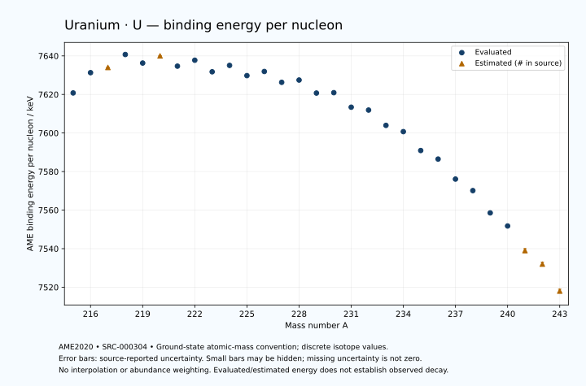

# Uranium — Atomic Masses and Reaction Energies

<!-- generated-by: sync-ame2020.mjs -->

**Dated evaluated data · scientific coverage remains partial.** 29 ground-state nuclides from AME2020. Values and uncertainties are transcribed from the retained unrounded analysis files; estimated quantities remain labelled.

- [Parent Uranium record](0092-Uranium-U.md) · [NUBASE states and decays](0092-Uranium-U-Nuclear-Evaluation.md)
- [Structured data](data/isotopes/0092-Uranium-U-AME2020-Evaluation.yaml)
- [Original mass table](../../data/catalog/sources/ame2020-mass_1.mas20.txt) · [Original reaction table](../../data/catalog/sources/ame2020-rct1.mas20.txt)
- [AME2020 methods](https://doi.org/10.1088/1674-1137/abddb0) (SRC-000303) · [Tables and definitions](https://doi.org/10.1088/1674-1137/abddaf) (SRC-000304)

## Reading the data

All table energies and uncertainties are in keV; binding energy is per nucleon. A # replaces a decimal point in the original estimated value. UNKNOWN (*) retains the source's not-calculable entry; it is neither zero nor automatically NOT APPLICABLE. Source lines are one-based in the retained files. Uncertainties remain those published by the evaluation, with no replacement by independent-mass quadrature.

Atomic-mass conventions apply. Qα is total decay energy, not alpha-particle kinetic energy. Positive Q alone does not establish a decay branch, rate or observation. He-4's source Qα of zero is a bookkeeping identity. These tables describe ground-state combinations, not isomer or excited-daughter transitions. Nuclear state and daughter lookups are explicit in the structured companion. The binding quantity follows [Z M(¹H) + N mₙ − M(A,Z)]c²/A; it has not been converted to a bare-nucleus convention.

## Mass and binding table

| Nuclide | N | Atomic mass excess / keV | AME binding per nucleon / keV | Mass-file line |
|---|---:|---|---|---:|
| U-215 | 123 | 24889.312 ± 104.136 | 7620.7821 ± 0.4844 | 2971 |
| U-216 | 124 | 23066.429 ± 28.093 | 7631.3072 ± 0.1301 | 2984 |
| U-217 | 125 | 22971# ± 81# | 7634# ± 0# | 2996 |
| U-218 | 126 | 21894.655 ± 13.714 | 7640.7191 ± 0.0629 | 3008 |
| U-219 | 127 | 23295.953 ± 13.338 | 7636.2867 ± 0.0609 | 3019 |
| U-220 | 128 | 23013# ± 101# | 7640# ± 0# | 3031 |
| U-221 | 129 | 24519.996 ± 72.135 | 7634.6849 ± 0.3264 | 3042 |
| U-222 | 130 | 24272.834 ± 51.994 | 7637.7651 ± 0.2342 | 3054 |
| U-223 | 131 | 26045.278 ± 59.054 | 7631.7611 ± 0.2648 | 3066 |
| U-224 | 132 | 25742.690 ± 15.261 | 7635.0742 ± 0.0681 | 3079 |
| U-225 | 133 | 27372.001 ± 9.934 | 7629.7717 ± 0.0442 | 3091 |
| U-226 | 134 | 27328.797 ± 11.071 | 7631.9166 ± 0.0490 | 3103 |
| U-227 | 135 | 29045.034 ± 8.510 | 7626.2918 ± 0.0375 | 3115 |
| U-228 | 136 | 29220.001 ± 13.474 | 7627.4763 ± 0.0591 | 3126 |
| U-229 | 137 | 31210.620 ± 5.938 | 7620.7218 ± 0.0259 | 3137 |
| U-230 | 138 | 31615.017 ± 4.509 | 7620.9227 ± 0.0196 | 3147 |
| U-231 | 139 | 33805.952 ± 2.670 | 7613.3879 ± 0.0116 | 3157 |
| U-232 | 140 | 34609.445 ± 1.808 | 7611.8984 ± 0.0078 | 3167 |
| U-233 | 141 | 36919.111 ± 2.254 | 7603.9574 ± 0.0097 | 3177 |
| U-234 | 142 | 38144.959 ± 1.129 | 7600.7160 ± 0.0048 | 3187 |
| U-235 | 143 | 40918.782 ± 1.116 | 7590.9151 ± 0.0048 | 3197 |
| U-236 | 144 | 42444.582 ± 1.112 | 7586.4854 ± 0.0047 | 3206 |
| U-237 | 145 | 45390.133 ± 1.202 | 7576.1026 ± 0.0051 | 3215 |
| U-238 | 146 | 47307.732 ± 1.492 | 7570.1262 ± 0.0063 | 3224 |
| U-239 | 147 | 50572.668 ± 1.502 | 7558.5624 ± 0.0063 | 3233 |
| U-240 | 148 | 52715.497 ± 2.553 | 7551.7705 ± 0.0106 | 3242 |
| U-241 | 149 | 56197# ± 196# | 7539# ± 1# | 3251 |
| U-242 | 150 | 58620# ± 201# | 7532# ± 1# | 3260 |
| U-243 | 151 | 62480# ± 300# | 7518# ± 1# | 3269 |

## Q-values and separation energies

| Nuclide | Qβ− / keV | Qα / keV | S₂n / keV | S₂p / keV | Reaction-file line |
|---|---|---|---|---|---:|
| U-215 | UNKNOWN (*) | 8587.9999 ± 58.6205 | UNKNOWN (*) | 1808.7377 ± 104.5432 | 2970 |
| U-216 | UNKNOWN (*) | 8530.6272 ± 26.2111 | UNKNOWN (*) | 2206.4445 ± 30.0218 | 2983 |
| U-217 | UNKNOWN (*) | 8426# ± 80# | 18061# ± 132# | 2529# ± 81# | 2995 |
| U-218 | UNKNOWN (*) | 8774.8074 ± 8.6266 | 17314.4105 ± 31.2366 | 2981.8241 ± 17.6086 | 3007 |
| U-219 | -6140.9976 ± 92.9309 | 9949.6039 ± 11.7381 | 15817# ± 82# | 3487.7690 ± 17.0460 | 3018 |
| U-220 | -7462# ± 105# | 10290# ± 100# | 15024# ± 102# | 3931# ± 101# | 3030 |
| U-221 | -5390# ± 213# | 9889.2999 ± 71.3499 | 14918.5935 ± 73.3579 | 4520.7262 ± 91.6025 | 3041 |
| U-222 | -7001.8072 ± 64.4300 | 9481.1710 ± 50.9193 | 14883# ± 113# | 4994.6460 ± 53.7617 | 3053 |
| U-223 | -4613.3046 ± 101.7520 | 9157.5821 ± 17.3111 | 14617.3540 ± 93.2239 | 5472.5898 ± 59.5707 | 3065 |
| U-224 | -6289.5572 ± 32.7036 | 8628.2368 ± 6.7512 | 14672.7796 ± 54.1840 | 6038.2906 ± 18.2971 | 3078 |
| U-225 | -4246.0969 ± 92.1491 | 8007.1594 ± 5.8969 | 14815.9132 ± 59.8619 | 6591.3430 ± 12.6161 | 3090 |
| U-226 | -5488.0792 ± 102.6485 | 7700.8428 ± 4.2662 | 14556.5290 ± 18.7879 | 7244.7252 ± 14.5666 | 3102 |
| U-227 | -3533.9848 ± 77.4417 | 7234.7157 ± 3.0539 | 14469.6036 ± 12.9804 | 7843.1013 ± 9.7929 | 3114 |
| U-228 | -4605# ± 101# | 6799.5044 ± 9.4509 | 14251.4328 ± 17.3639 | 8555.5905 ± 14.1363 | 3125 |
| U-229 | -2590.7577 ± 101.3342 | 6475.5112 ± 3.0534 | 13977.0498 ± 10.2579 | 9172.0813 ± 6.2283 | 3136 |
| U-230 | -3621.5986 ± 55.1683 | 5992.4518 ± 0.5038 | 13747.6201 ± 14.1452 | 9733.8248 ± 4.6543 | 3146 |
| U-231 | -1817.7347 ± 51.1839 | 5576.2769 ± 1.6641 | 13547.3043 ± 6.4468 | 10357.5076 ± 3.2607 | 3156 |
| U-232 | -2750# ± 100# | 5413.6300 ± 0.0900 | 13148.2076 ± 4.6552 | 10831.0086 ± 1.1474 | 3166 |
| U-233 | -1029.4197 ± 51.0050 | 4908.6781 ± 1.1800 | 13029.4766 ± 3.1577 | 11474.6416 ± 2.0590 | 3176 |
| U-234 | -1809.8462 ± 8.3205 | 4857.5319 ± 0.6763 | 12607.1219 ± 1.5743 | 11879.6926 ± 0.9222 | 3186 |
| U-235 | -124.2619 ± 0.8524 | 4678.0559 ± 0.6911 | 12142.9649 ± 1.9958 | 12390.8022 ± 0.9059 | 3196 |
| U-236 | -933.5116 ± 50.4152 | 4572.9562 ± 0.8731 | 11843.0136 ± 0.3332 | 12746.3183 ± 2.4204 | 3205 |
| U-237 | 518.5338 ± 0.5200 | 4233.5748 ± 0.9911 | 11671.2854 ± 0.5268 | 13205.5628 ± 13.0962 | 3214 |
| U-238 | -146.8652 ± 1.2006 | 4269.8581 ± 2.1157 | 11279.4859 ± 1.1755 | 13525.4126 ± 14.0519 | 3223 |
| U-239 | 1261.6634 ± 1.4935 | 4129.9984 ± 13.1271 | 10960.1012 ± 1.2723 | 13960.3713 ± 15.9065 | 3232 |
| U-240 | 399.2685 ± 17.0830 | 4035.3789 ± 14.2038 | 10734.8710 ± 2.8537 | 14387# ± 283# | 3241 |
| U-241 | 1882# ± 220# | 3817# ± 196# | 10518# ± 196# | 14881# ± 445# | 3250 |
| U-242 | 1203# ± 283# | 3670# ± 200# | 10238# ± 201# | UNKNOWN (*) | 3259 |
| U-243 | 2674# ± 302# | 3555# ± 500# | 9860# ± 358# | UNKNOWN (*) | 3268 |

Qβ− comes from the mass-file line in the first table. The other three columns come from the reaction-file line. Definitions and original source strings are retained in the structured data.

## Binding-energy chart

Discrete source values and source-reported uncertainties. No interpolation, natural-abundance weighting or observed-decay claim is implied. This quantitative chart supplements the 22 separate illustrative panels.

## Remaining review

Later measurements, state-specific decay branches, isomer Q-values, additional reaction channels and full claim-level review remain open. Existing authored values retain their own provenance; this companion does not overwrite them.
