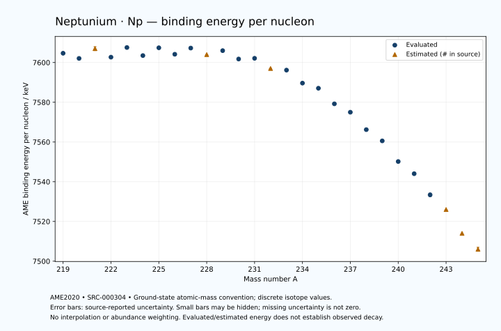

# Neptunium — Atomic Masses and Reaction Energies

<!-- generated-by: sync-ame2020.mjs -->

**Dated evaluated data · scientific coverage remains partial.** 27 ground-state nuclides from AME2020. Values and uncertainties are transcribed from the retained unrounded analysis files; estimated quantities remain labelled.

- [Parent Neptunium record](0093-Neptunium-Np.md) · [NUBASE states and decays](0093-Neptunium-Np-Nuclear-Evaluation.md)
- [Structured data](data/isotopes/0093-Neptunium-Np-AME2020-Evaluation.yaml)
- [Original mass table](../../data/catalog/sources/ame2020-mass_1.mas20.txt) · [Original reaction table](../../data/catalog/sources/ame2020-rct1.mas20.txt)
- [AME2020 methods](https://doi.org/10.1088/1674-1137/abddb0) (SRC-000303) · [Tables and definitions](https://doi.org/10.1088/1674-1137/abddaf) (SRC-000304)

## Reading the data

All table energies and uncertainties are in keV; binding energy is per nucleon. A # replaces a decimal point in the original estimated value. UNKNOWN (*) retains the source's not-calculable entry; it is neither zero nor automatically NOT APPLICABLE. Source lines are one-based in the retained files. Uncertainties remain those published by the evaluation, with no replacement by independent-mass quadrature.

Atomic-mass conventions apply. Qα is total decay energy, not alpha-particle kinetic energy. Positive Q alone does not establish a decay branch, rate or observation. He-4's source Qα of zero is a bookkeeping identity. These tables describe ground-state combinations, not isomer or excited-daughter transitions. Nuclear state and daughter lookups are explicit in the structured companion. The binding quantity follows [Z M(¹H) + N mₙ − M(A,Z)]c²/A; it has not been converted to a bare-nucleus convention.

## Mass and binding table

| Nuclide | N | Atomic mass excess / keV | AME binding per nucleon / keV | Mass-file line |
|---|---:|---|---|---:|
| Np-219 | 126 | 29436.951 ± 91.969 | 7604.6732 ± 0.4199 | 3020 |
| Np-220 | 127 | 30475.022 ± 30.718 | 7602.0758 ± 0.1396 | 3032 |
| Np-221 | 128 | 29910# ± 200# | 7607# ± 1# | 3043 |
| Np-222 | 129 | 31274.641 ± 38.051 | 7602.7013 ± 0.1714 | 3055 |
| Np-223 | 130 | 30658.583 ± 82.863 | 7607.5654 ± 0.3716 | 3067 |
| Np-224 | 131 | 32032.248 ± 28.925 | 7603.5032 ± 0.1291 | 3080 |
| Np-225 | 132 | 31618.098 ± 91.618 | 7607.4231 ± 0.4072 | 3092 |
| Np-226 | 133 | 32816.877 ± 102.063 | 7604.1714 ± 0.4516 | 3104 |
| Np-227 | 134 | 32579.018 ± 76.989 | 7607.2771 ± 0.3392 | 3116 |
| Np-228 | 135 | 33825# ± 100# | 7604# ± 0# | 3127 |
| Np-229 | 136 | 33801.378 ± 101.177 | 7605.9921 ± 0.4418 | 3138 |
| Np-230 | 137 | 35236.615 ± 55.007 | 7601.7751 ± 0.2392 | 3148 |
| Np-231 | 138 | 35623.686 ± 51.154 | 7602.1321 ± 0.2214 | 3158 |
| Np-232 | 139 | 37359# ± 100# | 7597# ± 0# | 3168 |
| Np-233 | 140 | 37948.531 ± 50.981 | 7596.1816 ± 0.2188 | 3178 |
| Np-234 | 141 | 39954.806 ± 8.397 | 7589.6382 ± 0.0359 | 3188 |
| Np-235 | 142 | 41043.044 ± 1.388 | 7587.0571 ± 0.0059 | 3198 |
| Np-236 | 143 | 43378.094 ± 50.421 | 7579.2148 ± 0.2136 | 3207 |
| Np-237 | 144 | 44871.599 ± 1.120 | 7574.9895 ± 0.0047 | 3216 |
| Np-238 | 145 | 47454.597 ± 1.137 | 7566.2220 ± 0.0048 | 3225 |
| Np-239 | 146 | 49311.005 ± 1.310 | 7560.5680 ± 0.0055 | 3234 |
| Np-240 | 147 | 52316.229 ± 17.032 | 7550.1743 ± 0.0710 | 3243 |
| Np-241 | 148 | 54315.115 ± 100.006 | 7544.0426 ± 0.4150 | 3252 |
| Np-242 | 149 | 57416.876 ± 200.004 | 7533.4042 ± 0.8265 | 3261 |
| Np-243 | 150 | 59806# ± 32# | 7526# ± 0# | 3270 |
| Np-244 | 151 | 63240# ± 100# | 7514# ± 0# | 3278 |
| Np-245 | 152 | 65850# ± 200# | 7506# ± 1# | 3287 |

## Q-values and separation energies

| Nuclide | Qβ− / keV | Qα / keV | S₂n / keV | S₂p / keV | Reaction-file line |
|---|---|---|---|---|---:|
| Np-219 | UNKNOWN (*) | 9207.4978 ± 40.7456 | UNKNOWN (*) | 2195.7394 ± 92.8141 | 3019 |
| Np-220 | UNKNOWN (*) | 10226.3078 ± 18.3340 | UNKNOWN (*) | 2752.4880 ± 35.5257 | 3031 |
| Np-221 | -6019# ± 361# | 10431# ± 201# | 15669# ± 220# | 3251# ± 212# | 3042 |
| Np-222 | -3785# ± 302# | 10200.1570 ± 33.6067 | 15343.0173 ± 48.9029 | 3581.6983 ± 40.7725 | 3054 |
| Np-223 | -5462# ± 311# | 9650.4434 ± 44.8053 | 15394# ± 217# | 4294.2964 ± 101.9419 | 3066 |
| Np-224 | -3248# ± 301# | 9328.9344 ± 29.6829 | 15385.0296 ± 47.7944 | 4610.0555 ± 91.3085 | 3079 |
| Np-225 | -4682# ± 314# | 8818.2451 ± 69.7700 | 15183.1210 ± 123.5314 | 5297.4586 ± 118.7978 | 3091 |
| Np-226 | -2813# ± 225# | 8327.5999 ± 54.0015 | 15358.0070 ± 106.0821 | 5623.4165 ± 102.3317 | 3103 |
| Np-227 | -4191# ± 126# | 7816.4881 ± 14.3963 | 15181.7157 ± 119.6669 | 6355.5639 ± 112.3646 | 3115 |
| Np-228 | -2283# ± 103# | 7538# ± 100# | 15134# ± 143# | 6786# ± 101# | 3126 |
| Np-229 | -3593.5462 ± 117.9433 | 7019.8216 ± 59.4531 | 14920.2769 ± 127.1239 | 7606.9352 ± 101.4290 | 3137 |
| Np-230 | -1695.5543 ± 56.8505 | 6778.0999 ± 53.8516 | 14731# ± 114# | 8264.9255 ± 55.1599 | 3147 |
| Np-231 | -2684.8905 ± 55.6931 | 6368.3999 ± 50.6360 | 14320.3272 ± 113.3659 | 8851.1039 ± 51.2319 | 3157 |
| Np-232 | -1001# ± 101# | 6011# ± 100# | 14020# ± 114# | 9392# ± 100# | 3167 |
| Np-233 | -2103.3047 ± 74.3811 | 5626.7668 ± 50.8749 | 13817.7917 ± 72.2009 | 10053.7491 ± 50.9546 | 3177 |
| Np-234 | -395.1807 ± 10.7522 | 5356.3467 ± 8.8129 | 13547# ± 100# | 10569.6852 ± 11.2642 | 3187 |
| Np-235 | -1139.3021 ± 20.4992 | 5193.7905 ± 1.4720 | 13048.1227 ± 50.9725 | 11024.3083 ± 1.1662 | 3197 |
| Np-236 | 476.5854 ± 50.3887 | 5006.6290 ± 50.9333 | 12719.3481 ± 51.0954 | 11538.7184 ± 50.5716 | 3206 |
| Np-237 | -220.0630 ± 1.2944 | 4957.2730 ± 0.7363 | 12314.0811 ± 0.9124 | 11995.2436 ± 14.0172 | 3215 |
| Np-238 | 1291.4491 ± 0.4573 | 4690.8116 ± 3.9971 | 12066.1324 ± 50.4158 | 12457.2997 ± 14.0186 | 3224 |
| Np-239 | 722.7849 ± 0.9304 | 4597.1881 ± 14.0337 | 11703.2307 ± 0.9736 | 12794.5610 ± 13.1066 | 3233 |
| Np-240 | 2190.9095 ± 17.0151 | 4557.3580 ± 22.0297 | 11281.0047 ± 17.0174 | 13155.7565 ± 23.2560 | 3242 |
| Np-241 | 1360.0000 ± 100.0000 | 4362.5759 ± 100.8528 | 11138.5254 ± 100.0045 | 13600# ± 220# | 3251 |
| Np-242 | 2700.0000 ± 200.0000 | 4097.9171 ± 200.6298 | 11041.9888 ± 200.7234 | 14171# ± 283# | 3260 |
| Np-243 | 2051# ± 32# | 4044# ± 198# | 10652# ± 105# | 14512# ± 302# | 3269 |
| Np-244 | 3434# ± 100# | 3805# ± 224# | 10319# ± 223# | UNKNOWN (*) | 3277 |
| Np-245 | 2672# ± 201# | 3685# ± 361# | 10098# ± 203# | UNKNOWN (*) | 3286 |

Qβ− comes from the mass-file line in the first table. The other three columns come from the reaction-file line. Definitions and original source strings are retained in the structured data.

## Binding-energy chart

Discrete source values and source-reported uncertainties. No interpolation, natural-abundance weighting or observed-decay claim is implied. This quantitative chart supplements the 22 separate illustrative panels.

## Remaining review

Later measurements, state-specific decay branches, isomer Q-values, additional reaction channels and full claim-level review remain open. Existing authored values retain their own provenance; this companion does not overwrite them.
