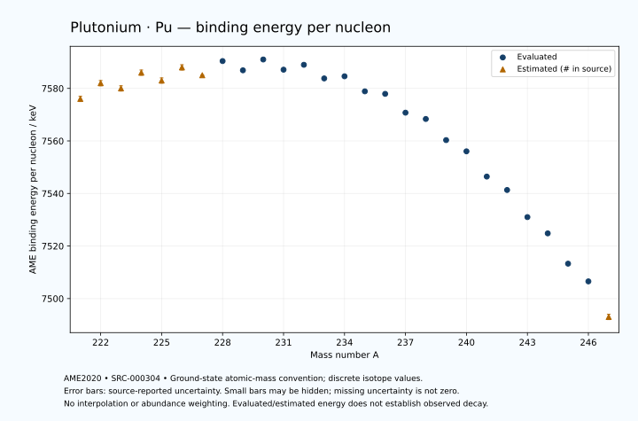

# Plutonium — Atomic Masses and Reaction Energies

<!-- generated-by: sync-ame2020.mjs -->

**Dated evaluated data · scientific coverage remains partial.** 27 ground-state nuclides from AME2020. Values and uncertainties are transcribed from the retained unrounded analysis files; estimated quantities remain labelled.

- [Parent Plutonium record](0094-Plutonium-Pu.md) · [NUBASE states and decays](0094-Plutonium-Pu-Nuclear-Evaluation.md)
- [Structured data](data/isotopes/0094-Plutonium-Pu-AME2020-Evaluation.yaml)
- [Original mass table](../../data/catalog/sources/ame2020-mass_1.mas20.txt) · [Original reaction table](../../data/catalog/sources/ame2020-rct1.mas20.txt)
- [AME2020 methods](https://doi.org/10.1088/1674-1137/abddb0) (SRC-000303) · [Tables and definitions](https://doi.org/10.1088/1674-1137/abddaf) (SRC-000304)

## Reading the data

All table energies and uncertainties are in keV; binding energy is per nucleon. A # replaces a decimal point in the original estimated value. UNKNOWN (*) retains the source's not-calculable entry; it is neither zero nor automatically NOT APPLICABLE. Source lines are one-based in the retained files. Uncertainties remain those published by the evaluation, with no replacement by independent-mass quadrature.

Atomic-mass conventions apply. Qα is total decay energy, not alpha-particle kinetic energy. Positive Q alone does not establish a decay branch, rate or observation. He-4's source Qα of zero is a bookkeeping identity. These tables describe ground-state combinations, not isomer or excited-daughter transitions. Nuclear state and daughter lookups are explicit in the structured companion. The binding quantity follows [Z M(¹H) + N mₙ − M(A,Z)]c²/A; it has not been converted to a bare-nucleus convention.

## Mass and binding table

| Nuclide | N | Atomic mass excess / keV | AME binding per nucleon / keV | Mass-file line |
|---|---:|---|---|---:|
| Pu-221 | 127 | 35930# ± 300# | 7576# ± 1# | 3044 |
| Pu-222 | 128 | 35060# ± 300# | 7582# ± 1# | 3056 |
| Pu-223 | 129 | 36121# ± 300# | 7580# ± 1# | 3068 |
| Pu-224 | 130 | 35280# ± 300# | 7586# ± 1# | 3081 |
| Pu-225 | 131 | 36300# ± 300# | 7583# ± 1# | 3093 |
| Pu-226 | 132 | 35630# ± 200# | 7588# ± 1# | 3105 |
| Pu-227 | 133 | 36770# ± 100# | 7585# ± 0# | 3117 |
| Pu-228 | 134 | 36107.809 ± 23.352 | 7590.4039 ± 0.1024 | 3128 |
| Pu-229 | 135 | 37394.924 ± 60.633 | 7586.8834 ± 0.2648 | 3139 |
| Pu-230 | 136 | 36932.170 ± 14.451 | 7591.0016 ± 0.0628 | 3149 |
| Pu-231 | 137 | 38308.577 ± 22.061 | 7587.1224 ± 0.0955 | 3159 |
| Pu-232 | 138 | 38360.915 ± 16.885 | 7588.9839 ± 0.0728 | 3169 |
| Pu-233 | 139 | 40051.836 ± 54.178 | 7583.7968 ± 0.2325 | 3179 |
| Pu-234 | 140 | 40349.986 ± 6.798 | 7584.6061 ± 0.0291 | 3189 |
| Pu-235 | 141 | 42182.346 ± 20.521 | 7578.8799 ± 0.0873 | 3199 |
| Pu-236 | 142 | 42901.508 ± 1.810 | 7577.9192 ± 0.0077 | 3208 |
| Pu-237 | 143 | 45091.662 ± 1.697 | 7570.7599 ± 0.0072 | 3217 |
| Pu-238 | 144 | 46163.148 ± 1.138 | 7568.3611 ± 0.0048 | 3226 |
| Pu-239 | 145 | 48588.220 ± 1.112 | 7560.3187 ± 0.0047 | 3235 |
| Pu-240 | 146 | 50125.319 ± 1.105 | 7556.0433 ± 0.0046 | 3244 |
| Pu-241 | 147 | 52955.115 ± 1.105 | 7546.4395 ± 0.0046 | 3253 |
| Pu-242 | 148 | 54716.876 ± 1.245 | 7541.3284 ± 0.0052 | 3262 |
| Pu-243 | 149 | 57754.561 ± 2.542 | 7531.0087 ± 0.0105 | 3271 |
| Pu-244 | 150 | 59806.021 ± 2.346 | 7524.8154 ± 0.0096 | 3279 |
| Pu-245 | 151 | 63178.173 ± 13.620 | 7513.2822 ± 0.0556 | 3288 |
| Pu-246 | 152 | 65394.772 ± 14.985 | 7506.5401 ± 0.0609 | 3296 |
| Pu-247 | 153 | 69210# ± 200# | 7493# ± 1# | 3304 |

## Q-values and separation energies

| Nuclide | Qβ− / keV | Qα / keV | S₂n / keV | S₂p / keV | Reaction-file line |
|---|---|---|---|---|---:|
| Pu-221 | UNKNOWN (*) | 10534# ± 311# | UNKNOWN (*) | 1944# ± 300# | 3043 |
| Pu-222 | UNKNOWN (*) | 10740# ± 300# | UNKNOWN (*) | 2532# ± 316# | 3055 |
| Pu-223 | -6579# ± 424# | 10400# ± 300# | 15952# ± 424# | 2977# ± 308# | 3067 |
| Pu-224 | -7980# ± 500# | 9842# ± 316# | 15922# ± 424# | 3570# ± 304# | 3080 |
| Pu-225 | -6090# ± 500# | 9355# ± 308# | 15963# ± 424# | 4323# ± 306# | 3092 |
| Pu-226 | -7340# ± 361# | 8932# ± 207# | 15793# ± 361# | 4691# ± 201# | 3104 |
| Pu-227 | -5410# ± 224# | 8300# ± 116# | 15673# ± 316# | 5180# ± 100# | 3116 |
| Pu-228 | -6742# ± 202# | 7940.2027 ± 17.6755 | 15664# ± 202# | 5798.9307 ± 25.7955 | 3127 |
| Pu-229 | -4785.4899 ± 122.4147 | 7598.0069 ± 59.8141 | 15518# ± 117# | 6228.0519 ± 61.2064 | 3138 |
| Pu-230 | -5940# ± 144# | 7178.4564 ± 9.2888 | 15318.2752 ± 27.4170 | 6865.7732 ± 19.6923 | 3148 |
| Pu-231 | -4101# ± 301# | 6838.6275 ± 20.3531 | 15228.9830 ± 64.5017 | 7479.9851 ± 22.7919 | 3158 |
| Pu-232 | -5059# ± 300# | 6715.9980 ± 10.1758 | 14713.8912 ± 22.1660 | 7832.0442 ± 17.4251 | 3168 |
| Pu-233 | -3233# ± 126# | 6416.2999 ± 53.8516 | 14399.3774 ± 58.4762 | 8332.0582 ± 54.2362 | 3178 |
| Pu-234 | -4112# ± 160# | 6310.0537 ± 5.0871 | 14153.5644 ± 18.1525 | 8837.4011 ± 6.8956 | 3188 |
| Pu-235 | -2442.2558 ± 56.5932 | 5951.4789 ± 20.3469 | 14012.1253 ± 57.9272 | 9314.7069 ± 20.5905 | 3198 |
| Pu-236 | -3139# ± 119# | 5867.1471 ± 0.0814 | 13591.1142 ± 6.8961 | 9821.3933 ± 1.5763 | 3207 |
| Pu-237 | -1478# ± 59# | 5747.6353 ± 2.2559 | 13233.3202 ± 20.5405 | 10405.0622 ± 1.3239 | 3216 |
| Pu-238 | -2258.2731 ± 58.9005 | 5593.2729 ± 0.1927 | 12880.9961 ± 1.5888 | 10859.3759 ± 0.3603 | 3225 |
| Pu-239 | -802.1402 ± 1.6635 | 5244.5216 ± 0.2066 | 12646.0786 ± 1.3191 | 11379.8554 ± 0.5208 | 3234 |
| Pu-240 | -1384.7902 ± 13.7882 | 5255.8215 ± 0.1448 | 12180.4651 ± 0.3567 | 11760.3550 ± 1.1670 | 3243 |
| Pu-241 | 20.7799 ± 0.1658 | 5140.0664 ± 0.4784 | 11775.7406 ± 0.2330 | 12195.4948 ± 1.1793 | 3252 |
| Pu-242 | -751.1373 ± 0.7080 | 4984.2282 ± 0.9860 | 11551.0792 ± 0.6820 | 12576.5633 ± 2.7209 | 3261 |
| Pu-243 | 579.5559 ± 2.6216 | 4756.9774 ± 2.5760 | 11343.1902 ± 2.4321 | 13020# ± 196# | 3270 |
| Pu-244 | -73.1143 ± 2.6856 | 4665.6077 ± 1.0159 | 11053.4915 ± 2.5277 | 13392# ± 201# | 3278 |
| Pu-245 | 1277.7559 ± 13.7334 | 4556# ± 196# | 10719.0247 ± 13.7334 | 13880# ± 300# | 3287 |
| Pu-246 | 401# ± 14# | 4350# ± 200# | 10553.8847 ± 14.9542 | UNKNOWN (*) | 3295 |
| Pu-247 | 2057# ± 224# | 4305# ± 361# | 10111# ± 201# | UNKNOWN (*) | 3303 |

Qβ− comes from the mass-file line in the first table. The other three columns come from the reaction-file line. Definitions and original source strings are retained in the structured data.

## Binding-energy chart

Discrete source values and source-reported uncertainties. No interpolation, natural-abundance weighting or observed-decay claim is implied. This quantitative chart supplements the 22 separate illustrative panels.

## Remaining review

Later measurements, state-specific decay branches, isomer Q-values, additional reaction channels and full claim-level review remain open. Existing authored values retain their own provenance; this companion does not overwrite them.
