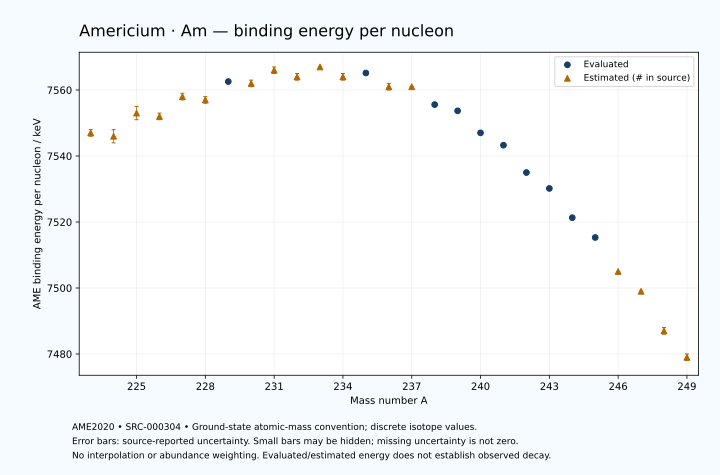

# Americium — Atomic Masses and Reaction Energies

<!-- generated-by: sync-ame2020.mjs -->

**Dated evaluated data · scientific coverage remains partial.** 27 ground-state nuclides from AME2020. Values and uncertainties are transcribed from the retained unrounded analysis files; estimated quantities remain labelled.

- [Parent Americium record](0095-Americium-Am.md) · [NUBASE states and decays](0095-Americium-Am-Nuclear-Evaluation.md)
- [Structured data](data/isotopes/0095-Americium-Am-AME2020-Evaluation.yaml)
- [Original mass table](../../data/catalog/sources/ame2020-mass_1.mas20.txt) · [Original reaction table](../../data/catalog/sources/ame2020-rct1.mas20.txt)
- [AME2020 methods](https://doi.org/10.1088/1674-1137/abddb0) (SRC-000303) · [Tables and definitions](https://doi.org/10.1088/1674-1137/abddaf) (SRC-000304)

## Reading the data

All table energies and uncertainties are in keV; binding energy is per nucleon. A # replaces a decimal point in the original estimated value. UNKNOWN (*) retains the source's not-calculable entry; it is neither zero nor automatically NOT APPLICABLE. Source lines are one-based in the retained files. Uncertainties remain those published by the evaluation, with no replacement by independent-mass quadrature.

Atomic-mass conventions apply. Qα is total decay energy, not alpha-particle kinetic energy. Positive Q alone does not establish a decay branch, rate or observation. He-4's source Qα of zero is a bookkeeping identity. These tables describe ground-state combinations, not isomer or excited-daughter transitions. Nuclear state and daughter lookups are explicit in the structured companion. The binding quantity follows [Z M(¹H) + N mₙ − M(A,Z)]c²/A; it has not been converted to a bare-nucleus convention.

## Mass and binding table

| Nuclide | N | Atomic mass excess / keV | AME binding per nucleon / keV | Mass-file line |
|---|---:|---|---|---:|
| Am-223 | 128 | 42700# ± 300# | 7547# ± 1# | 3069 |
| Am-224 | 129 | 43260# ± 400# | 7546# ± 2# | 3082 |
| Am-225 | 130 | 42390# ± 400# | 7553# ± 2# | 3094 |
| Am-226 | 131 | 42970# ± 300# | 7552# ± 1# | 3106 |
| Am-227 | 132 | 42180# ± 200# | 7558# ± 1# | 3118 |
| Am-228 | 133 | 42850# ± 200# | 7557# ± 1# | 3129 |
| Am-229 | 134 | 42180.414 ± 106.348 | 7562.5697 ± 0.4644 | 3140 |
| Am-230 | 135 | 42872# ± 143# | 7562# ± 1# | 3150 |
| Am-231 | 136 | 42410# ± 300# | 7566# ± 1# | 3160 |
| Am-232 | 137 | 43420# ± 300# | 7564# ± 1# | 3170 |
| Am-233 | 138 | 43285# ± 114# | 7567# ± 0# | 3180 |
| Am-234 | 139 | 44462# ± 160# | 7564# ± 1# | 3190 |
| Am-235 | 140 | 44624.602 ± 52.780 | 7565.1582 ± 0.2246 | 3200 |
| Am-236 | 141 | 46041# ± 119# | 7561# ± 1# | 3209 |
| Am-237 | 142 | 46570# ± 59# | 7561# ± 0# | 3218 |
| Am-238 | 143 | 48421.421 ± 58.911 | 7555.5853 ± 0.2475 | 3227 |
| Am-239 | 144 | 49390.360 ± 1.982 | 7553.6891 ± 0.0083 | 3236 |
| Am-240 | 145 | 51510.110 ± 13.832 | 7547.0136 ± 0.0576 | 3245 |
| Am-241 | 146 | 52934.335 ± 1.113 | 7543.2795 ± 0.0046 | 3254 |
| Am-242 | 147 | 55468.014 ± 1.118 | 7534.9917 ± 0.0046 | 3263 |
| Am-243 | 148 | 57175.005 ± 1.388 | 7530.1742 ± 0.0057 | 3272 |
| Am-244 | 149 | 59879.135 ± 1.491 | 7521.3095 ± 0.0061 | 3280 |
| Am-245 | 150 | 61900.417 ± 1.886 | 7515.3043 ± 0.0077 | 3289 |
| Am-246 | 151 | 64994# ± 18# | 7505# ± 0# | 3297 |
| Am-247 | 152 | 67153# ± 100# | 7499# ± 0# | 3305 |
| Am-248 | 153 | 70563# ± 200# | 7487# ± 1# | 3312 |
| Am-249 | 154 | 73104# ± 298# | 7479# ± 1# | 3320 |

## Q-values and separation energies

| Nuclide | Qβ− / keV | Qα / keV | S₂n / keV | S₂p / keV | Reaction-file line |
|---|---|---|---|---|---:|
| Am-223 | UNKNOWN (*) | 10838# ± 314# | UNKNOWN (*) | 1789# ± 361# | 3068 |
| Am-224 | UNKNOWN (*) | 10361# ± 401# | UNKNOWN (*) | 2592# ± 401# | 3081 |
| Am-225 | UNKNOWN (*) | 10055# ± 447# | 16452# ± 500# | 2846# ± 408# | 3093 |
| Am-226 | UNKNOWN (*) | 9270# ± 302# | 16433# ± 500# | 3640# ± 301# | 3105 |
| Am-227 | UNKNOWN (*) | 9096# ± 217# | 16353# ± 447# | 4016# ± 220# | 3117 |
| Am-228 | UNKNOWN (*) | 8392# ± 202# | 16263# ± 361# | 4545# ± 225# | 3128 |
| Am-229 | UNKNOWN (*) | 8137.3999 ± 54.0015 | 16142# ± 227# | 4976.5467 ± 131.2872 | 3139 |
| Am-230 | UNKNOWN (*) | 7630# ± 100# | 16121# ± 246# | 5531# ± 175# | 3149 |
| Am-231 | -4860# ± 424# | 7406# ± 310# | 15913# ± 318# | 5969# ± 317# | 3159 |
| Am-232 | -2913# ± 361# | 7170# ± 316# | 15595# ± 332# | 6395# ± 305# | 3169 |
| Am-233 | -4008# ± 140# | 7059# ± 53# | 15268# ± 321# | 6917# ± 125# | 3179 |
| Am-234 | -2261# ± 161# | 6800# ± 150# | 15101# ± 340# | 7476# ± 188# | 3189 |
| Am-235 | -3389# ± 115# | 6575.9999 ± 13.0000 | 14803# ± 126# | 7901.8708 ± 73.3619 | 3199 |
| Am-236 | -1812# ± 120# | 6256.1999 ± 64.0312 | 14564# ± 199# | 8492# ± 119# | 3208 |
| Am-237 | -2677# ± 95# | 6196# ± 30# | 14198# ± 79# | 9051# ± 59# | 3217 |
| Am-238 | -1023.7818 ± 60.1587 | 6041.6999 ± 58.3095 | 13762# ± 133# | 9534.6143 ± 77.5290 | 3226 |
| Am-239 | -1756.6021 ± 150.0740 | 5922.3999 ± 1.4142 | 13322# ± 59# | 10059.1814 ± 1.6830 | 3235 |
| Am-240 | -214.1127 ± 13.8967 | 5707.1000 ± 52.2665 | 13053.9480 ± 60.4934 | 10522.4300 ± 13.7891 | 3244 |
| Am-241 | -767.4346 ± 1.1685 | 5637.8203 ± 0.1199 | 12598.6607 ± 1.6788 | 10954.6114 ± 0.9663 | 3253 |
| Am-242 | 664.3145 ± 0.4143 | 5588.5003 ± 0.2537 | 12184.7321 ± 13.7875 | 11426.1574 ± 17.0161 | 3262 |
| Am-243 | -6.9302 ± 1.5692 | 5439.0849 ± 0.9304 | 11901.9662 ± 1.2318 | 11718.0521 ± 100.0075 | 3271 |
| Am-244 | 1427.3000 ± 1.0000 | 5137.9904 ± 17.0445 | 11731.5145 ± 1.0195 | 12115.6832 ± 200.0037 | 3279 |
| Am-245 | 895.8929 ± 1.5491 | 5160.3857 ± 100.0131 | 11417.2246 ± 2.0051 | 12483# ± 32# | 3288 |
| Am-246 | 2377# ± 18# | 5152# ± 201# | 11028# ± 18# | 12824# ± 101# | 3296 |
| Am-247 | 1620# ± 100# | 4922# ± 105# | 10890# ± 100# | 13275# ± 224# | 3304 |
| Am-248 | 3170# ± 200# | 4898# ± 223# | 10574# ± 201# | UNKNOWN (*) | 3311 |
| Am-249 | 2353# ± 298# | 4829# ± 359# | 10192# ± 314# | UNKNOWN (*) | 3319 |

Qβ− comes from the mass-file line in the first table. The other three columns come from the reaction-file line. Definitions and original source strings are retained in the structured data.

## Binding-energy chart

Discrete source values and source-reported uncertainties. No interpolation, natural-abundance weighting or observed-decay claim is implied. This quantitative chart supplements the 22 separate illustrative panels.

## Remaining review

Later measurements, state-specific decay branches, isomer Q-values, additional reaction channels and full claim-level review remain open. Existing authored values retain their own provenance; this companion does not overwrite them.
