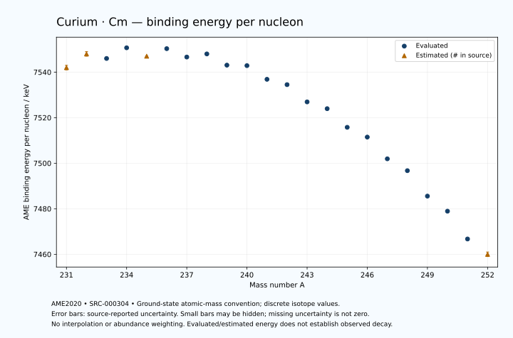

# Curium — Atomic Masses and Reaction Energies

<!-- generated-by: sync-ame2020.mjs -->

**Dated evaluated data · scientific coverage remains partial.** 22 ground-state nuclides from AME2020. Values and uncertainties are transcribed from the retained unrounded analysis files; estimated quantities remain labelled.

- [Parent Curium record](0096-Curium-Cm.md) · [NUBASE states and decays](0096-Curium-Cm-Nuclear-Evaluation.md)
- [Structured data](data/isotopes/0096-Curium-Cm-AME2020-Evaluation.yaml)
- [Original mass table](../../data/catalog/sources/ame2020-mass_1.mas20.txt) · [Original reaction table](../../data/catalog/sources/ame2020-rct1.mas20.txt)
- [AME2020 methods](https://doi.org/10.1088/1674-1137/abddb0) (SRC-000303) · [Tables and definitions](https://doi.org/10.1088/1674-1137/abddaf) (SRC-000304)

## Reading the data

All table energies and uncertainties are in keV; binding energy is per nucleon. A # replaces a decimal point in the original estimated value. UNKNOWN (*) retains the source's not-calculable entry; it is neither zero nor automatically NOT APPLICABLE. Source lines are one-based in the retained files. Uncertainties remain those published by the evaluation, with no replacement by independent-mass quadrature.

Atomic-mass conventions apply. Qα is total decay energy, not alpha-particle kinetic energy. Positive Q alone does not establish a decay branch, rate or observation. He-4's source Qα of zero is a bookkeeping identity. These tables describe ground-state combinations, not isomer or excited-daughter transitions. Nuclear state and daughter lookups are explicit in the structured companion. The binding quantity follows [Z M(¹H) + N mₙ − M(A,Z)]c²/A; it has not been converted to a bare-nucleus convention.

## Mass and binding table

| Nuclide | N | Atomic mass excess / keV | AME binding per nucleon / keV | Mass-file line |
|---|---:|---|---|---:|
| Cm-231 | 135 | 47270# ± 300# | 7542# ± 1# | 3161 |
| Cm-232 | 136 | 46333# ± 201# | 7548# ± 1# | 3171 |
| Cm-233 | 137 | 47293.340 ± 81.095 | 7546.0020 ± 0.3480 | 3181 |
| Cm-234 | 138 | 46722.411 ± 17.078 | 7550.6868 ± 0.0730 | 3191 |
| Cm-235 | 139 | 48013# ± 102# | 7547# ± 0# | 3201 |
| Cm-236 | 140 | 47852.820 ± 17.635 | 7550.3090 ± 0.0747 | 3210 |
| Cm-237 | 141 | 49247.151 ± 74.399 | 7546.6241 ± 0.3139 | 3219 |
| Cm-238 | 142 | 49445.203 ± 12.234 | 7547.9966 ± 0.0514 | 3228 |
| Cm-239 | 143 | 51146.962 ± 150.070 | 7543.0659 ± 0.6279 | 3237 |
| Cm-240 | 144 | 51724.222 ± 1.905 | 7542.8617 ± 0.0079 | 3246 |
| Cm-241 | 145 | 53701.770 ± 1.607 | 7536.8488 ± 0.0067 | 3255 |
| Cm-242 | 146 | 54803.699 ± 1.141 | 7534.5040 ± 0.0047 | 3264 |
| Cm-243 | 147 | 57181.936 ± 1.496 | 7526.9261 ± 0.0062 | 3273 |
| Cm-244 | 148 | 58451.835 ± 1.106 | 7523.9527 ± 0.0045 | 3281 |
| Cm-245 | 149 | 61004.524 ± 1.149 | 7515.7677 ± 0.0047 | 3290 |
| Cm-246 | 150 | 62616.912 ± 1.525 | 7511.4716 ± 0.0062 | 3298 |
| Cm-247 | 151 | 65533.105 ± 3.797 | 7501.9318 ± 0.0154 | 3306 |
| Cm-248 | 152 | 67392.748 ± 2.358 | 7496.7291 ± 0.0095 | 3313 |
| Cm-249 | 153 | 70750.696 ± 2.371 | 7485.5510 ± 0.0095 | 3321 |
| Cm-250 | 154 | 72989.588 ± 10.274 | 7478.9385 ± 0.0411 | 3328 |
| Cm-251 | 155 | 76647.981 ± 22.698 | 7466.7233 ± 0.0904 | 3335 |
| Cm-252 | 156 | 79056# ± 298# | 7460# ± 1# | 3343 |

## Q-values and separation energies

| Nuclide | Qβ− / keV | Qα / keV | S₂n / keV | S₂p / keV | Reaction-file line |
|---|---|---|---|---|---:|
| Cm-231 | UNKNOWN (*) | 8075# ± 316# | UNKNOWN (*) | 4703# ± 306# | 3160 |
| Cm-232 | UNKNOWN (*) | 7800# ± 200# | UNKNOWN (*) | 5177# ± 202# | 3170 |
| Cm-233 | -5478# ± 247# | 7473.4999 ± 53.8516 | 16119# ± 311# | 5593.1795 ± 84.0266 | 3180 |
| Cm-234 | -6673# ± 154# | 7365.3254 ± 9.1001 | 15753# ± 202# | 6216.4458 ± 23.9613 | 3190 |
| Cm-235 | -4757# ± 413# | 7280# ± 100# | 15422# ± 131# | 6616# ± 116# | 3200 |
| Cm-236 | -5689# ± 361# | 7066.9897 ± 5.0864 | 15012.2269 ± 24.4952 | 7075.1083 ± 18.8516 | 3209 |
| Cm-237 | -3963# ± 242# | 6770.3999 ± 50.9902 | 14909# ± 127# | 7513.1371 ± 77.1723 | 3218 |
| Cm-238 | -4771# ± 256# | 6670.3010 ± 10.1712 | 14550.2531 ± 21.4205 | 8034.2471 ± 12.2886 | 3227 |
| Cm-239 | -3103# ± 256# | 6539.6999 ± 148.6607 | 14242.8253 ± 167.4979 | 8522.6422 ± 150.0730 | 3236 |
| Cm-240 | -3940# ± 150# | 6397.7981 ± 0.5997 | 13863.6172 ± 12.3031 | 9016.8682 ± 1.6971 | 3245 |
| Cm-241 | -2279# ± 165# | 6185.1919 ± 0.5717 | 13587.8283 ± 150.0720 | 9464.3919 ± 1.2016 | 3254 |
| Cm-242 | -2948# ± 135# | 6215.6349 ± 0.0813 | 13063.1593 ± 1.6990 | 9899.5624 ± 0.3658 | 3263 |
| Cm-243 | -1507.6936 ± 4.5065 | 6168.7999 ± 1.0000 | 12662.4705 ± 1.5633 | 10351.1219 ± 1.0268 | 3272 |
| Cm-244 | -2261.9902 ± 14.3567 | 5901.5999 ± 0.0300 | 12494.5000 ± 0.3671 | 10842.9832 ± 0.6827 | 3280 |
| Cm-245 | -809.2519 ± 1.4964 | 5624.4928 ± 0.4895 | 12320.0477 ± 1.1365 | 11327.9794 ± 2.4729 | 3289 |
| Cm-246 | -1350.0000 ± 60.0000 | 5475.1197 ± 0.8897 | 11977.5595 ± 1.1196 | 11767.0512 ± 2.6673 | 3297 |
| Cm-247 | 43.5841 ± 6.3245 | 5353.6281 ± 3.3621 | 11614.0548 ± 3.7663 | 12223.0096 ± 13.9903 | 3305 |
| Cm-248 | -738.3049 ± 50.0026 | 5161.8109 ± 0.2540 | 11366.8003 ± 2.6777 | 12579.9668 ± 14.9562 | 3312 |
| Cm-249 | 904.3630 ± 2.5934 | 5147.6071 ± 13.4211 | 10925.0457 ± 3.9779 | 13037# ± 200# | 3320 |
| Cm-250 | 37.5820 ± 10.6414 | 5169.8993 ± 17.9913 | 10545.7962 ± 10.0000 | UNKNOWN (*) | 3327 |
| Cm-251 | 1420.0000 ± 20.0000 | 5013# ± 202# | 10245.3507 ± 22.7294 | UNKNOWN (*) | 3334 |
| Cm-252 | 521# ± 359# | UNKNOWN (*) | 10076# ± 298# | UNKNOWN (*) | 3342 |

Qβ− comes from the mass-file line in the first table. The other three columns come from the reaction-file line. Definitions and original source strings are retained in the structured data.

## Binding-energy chart

Discrete source values and source-reported uncertainties. No interpolation, natural-abundance weighting or observed-decay claim is implied. This quantitative chart supplements the 22 separate illustrative panels.

## Remaining review

Later measurements, state-specific decay branches, isomer Q-values, additional reaction channels and full claim-level review remain open. Existing authored values retain their own provenance; this companion does not overwrite them.
