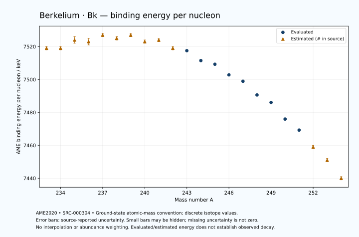

# Berkelium — Atomic Masses and Reaction Energies

<!-- generated-by: sync-ame2020.mjs -->

**Dated evaluated data · scientific coverage remains partial.** 22 ground-state nuclides from AME2020. Values and uncertainties are transcribed from the retained unrounded analysis files; estimated quantities remain labelled.

- [Parent Berkelium record](0097-Berkelium-Bk.md) · [NUBASE states and decays](0097-Berkelium-Bk-Nuclear-Evaluation.md)
- [Structured data](data/isotopes/0097-Berkelium-Bk-AME2020-Evaluation.yaml)
- [Original mass table](../../data/catalog/sources/ame2020-mass_1.mas20.txt) · [Original reaction table 1](../../data/catalog/sources/ame2020-rct1.mas20.txt) · [Original reaction table 2](../../data/catalog/sources/ame2020-rct2.mas20.txt)
- [AME2020 methods](https://doi.org/10.1088/1674-1137/abddb0) (SRC-000303) · [Tables and definitions](https://doi.org/10.1088/1674-1137/abddaf) (SRC-000304)

## Reading the data

All table energies and uncertainties are in keV; binding energy is per nucleon. A # replaces a decimal point in the original estimated value. UNKNOWN (*) retains the source's not-calculable entry; it is neither zero nor automatically NOT APPLICABLE. Source lines are one-based in the retained files. Uncertainties remain those published by the evaluation, with no replacement by independent-mass quadrature.

Atomic-mass conventions apply. Qα is total decay energy, not alpha-particle kinetic energy. Positive Q alone does not establish a decay branch, rate or observation. He-4's source Qα of zero is a bookkeeping identity. These tables describe ground-state combinations, not isomer or excited-daughter transitions. Nuclear state and daughter lookups are explicit in the structured companion. The binding quantity follows [Z M(¹H) + N mₙ − M(A,Z)]c²/A; it has not been converted to a bare-nucleus convention.

## Mass and binding table

| Nuclide | N | Atomic mass excess / keV | AME binding per nucleon / keV | Mass-file line |
|---|---:|---|---|---:|
| Bk-233 | 136 | 52771# ± 233# | 7519# ± 1# | 3182 |
| Bk-234 | 137 | 53395# ± 153# | 7519# ± 1# | 3192 |
| Bk-235 | 138 | 52770# ± 401# | 7524# ± 2# | 3202 |
| Bk-236 | 139 | 53542# ± 361# | 7523# ± 2# | 3211 |
| Bk-237 | 140 | 53210# ± 230# | 7527# ± 1# | 3220 |
| Bk-238 | 141 | 54216# ± 256# | 7525# ± 1# | 3229 |
| Bk-239 | 142 | 54250# ± 207# | 7527# ± 1# | 3238 |
| Bk-240 | 143 | 55664# ± 150# | 7523# ± 1# | 3247 |
| Bk-241 | 144 | 55981# ± 165# | 7524# ± 1# | 3256 |
| Bk-242 | 145 | 57752# ± 135# | 7519# ± 1# | 3265 |
| Bk-243 | 146 | 58689.629 ± 4.524 | 7517.5021 ± 0.0186 | 3274 |
| Bk-244 | 147 | 60713.825 ± 14.399 | 7511.4759 ± 0.0590 | 3282 |
| Bk-245 | 148 | 61813.776 ± 1.792 | 7509.2714 ± 0.0073 | 3291 |
| Bk-246 | 149 | 63966.912 ± 60.019 | 7502.8035 ± 0.2440 | 3299 |
| Bk-247 | 150 | 65489.521 ± 5.189 | 7498.9408 ± 0.0210 | 3307 |
| Bk-248 | 151 | 68131.053 ± 50.058 | 7490.5975 ± 0.2018 | 3314 |
| Bk-249 | 152 | 69846.333 ± 1.248 | 7486.0410 ± 0.0050 | 3322 |
| Bk-250 | 153 | 72952.006 ± 2.898 | 7475.9594 ± 0.0116 | 3329 |
| Bk-251 | 154 | 75227.981 ± 10.734 | 7469.2637 ± 0.0428 | 3336 |
| Bk-252 | 155 | 78535# ± 200# | 7459# ± 1# | 3344 |
| Bk-253 | 156 | 80929# ± 359# | 7451# ± 1# | 3351 |
| Bk-254 | 157 | 84393# ± 298# | 7440# ± 1# | 3359 |

## Q-values and separation energies

| Nuclide | Qβ− / keV | Qα / keV | S₂n / keV | S₂p / keV | Reaction-file line |
|---|---|---|---|---|---:|
| Bk-233 | UNKNOWN (*) | 8166# ± 207# | UNKNOWN (*) | 4217# ± 380# | 3181 |
| Bk-234 | UNKNOWN (*) | 8098.5999 ± 53.9638 | UNKNOWN (*) | 4602# ± 337# | 3191 |
| Bk-235 | UNKNOWN (*) | 7935# ± 500# | 16144# ± 463# | 5093# ± 416# | 3201 |
| Bk-236 | UNKNOWN (*) | 7697# ± 200# | 15996# ± 392# | 5498# ± 394# | 3210 |
| Bk-237 | -4728# ± 250# | 7500# ± 200# | 15703# ± 462# | 5993# ± 236# | 3219 |
| Bk-238 | -3061# ± 393# | 7330# ± 200# | 15468# ± 442# | 6402# ± 282# | 3228 |
| Bk-239 | -3952# ± 239# | 7200# ± 200# | 15103# ± 310# | 6898# ± 215# | 3237 |
| Bk-240 | -2324# ± 151# | 7199# ± 191# | 14695# ± 297# | 7335# ± 161# | 3246 |
| Bk-241 | -3346# ± 235# | 6986# ± 176# | 14411# ± 265# | 7988# ± 165# | 3255 |
| Bk-242 | -1635# ± 135# | 6906# ± 147# | 14055# ± 202# | 8336# ± 135# | 3264 |
| Bk-243 | -2300# ± 181# | 6874.3533 ± 4.0671 | 13434# ± 165# | 8822.6483 ± 4.3999 | 3273 |
| Bk-244 | -764.2709 ± 14.5724 | 6778.7999 ± 4.0000 | 13181# ± 135# | 9332.1304 ± 14.3561 | 3281 |
| Bk-245 | -1571.3755 ± 2.5861 | 6454.5246 ± 1.4045 | 13018.4895 ± 4.6187 | 9939.1716 ± 1.8681 | 3290 |
| Bk-246 | -123.3159 ± 60.0198 | 6073.9824 ± 60.0107 | 12889.5497 ± 61.7038 | 10490.1655 ± 60.0188 | 3298 |
| Bk-247 | -619.8711 ± 15.2376 | 5889.5999 ± 5.0000 | 12466.8908 ± 5.3376 | 10988.8378 ± 5.3871 | 3306 |
| Bk-248 | 893.1015 ± 50.3143 | 5827.0015 ± 50.0752 | 11978.4954 ± 78.1500 | 11441# ± 53# | 3313 |
| Bk-249 | 123.6000 ± 0.4000 | 5520.9999 ± 1.4142 | 11785.8246 ± 5.1981 | 11885# ± 100# | 3321 |
| Bk-250 | 1781.6696 ± 2.4561 | 5533# ± 18# | 11321.6831 ± 50.1348 | 12189# ± 200# | 3328 |
| Bk-251 | 1093.0000 ± 10.0000 | 5650# ± 101# | 10760.9877 ± 10.7386 | 12454# ± 298# | 3335 |
| Bk-252 | 2500# ± 200# | 5547# ± 283# | 10560# ± 200# | UNKNOWN (*) | 3343 |
| Bk-253 | 1627# ± 359# | 5400# ± 200# | 10442# ± 359# | UNKNOWN (*) | 3350 |
| Bk-254 | 3052# ± 298# | UNKNOWN (*) | 10284# ± 359# | UNKNOWN (*) | 3358 |

## Additional decay-energy combinations

| Nuclide | Q₂β− / keV | Q₄β− / keV | Qεp / keV | Qβ−n / keV | Part 1 / part 2 line |
|---|---|---|---|---|---|
| Bk-233 | UNKNOWN (*) | UNKNOWN (*) | 2063# ± 380# | UNKNOWN (*) | 3181 / 3226 |
| Bk-234 | UNKNOWN (*) | UNKNOWN (*) | 2821# ± 191# | UNKNOWN (*) | 3191 / 3236 |
| Bk-235 | UNKNOWN (*) | UNKNOWN (*) | 1020# ± 431# | UNKNOWN (*) | 3201 / 3246 |
| Bk-236 | UNKNOWN (*) | UNKNOWN (*) | 1628# ± 364# | UNKNOWN (*) | 3210 / 3255 |
| Bk-237 | UNKNOWN (*) | UNKNOWN (*) | -120# ± 259# | UNKNOWN (*) | 3219 / 3265 |
| Bk-238 | UNKNOWN (*) | UNKNOWN (*) | 358# ± 263# | -11793# ± 274# | 3228 / 3274 |
| Bk-239 | -9381# ± 364# | UNKNOWN (*) | -1461# ± 215# | -11099# ± 363# | 3237 / 3283 |
| Bk-240 | -8561# ± 395# | UNKNOWN (*) | -1015# ± 150# | -10609# ± 192# | 3246 / 3292 |
| Bk-241 | -7913# ± 284# | UNKNOWN (*) | -2818# ± 166# | -10079# ± 166# | 3255 / 3301 |
| Bk-242 | -7050# ± 290# | UNKNOWN (*) | -2471# ± 135# | -9646# ± 215# | 3264 / 3310 |
| Bk-243 | -6057# ± 207# | UNKNOWN (*) | -4067.3554 ± 4.4011 | -8768.6705 ± 13.6221 | 3273 / 3319 |
| Bk-244 | -5312# ± 182# | -14883# ± 375# | -3750.1512 ± 14.4084 | -8347# ± 181# | 3281 / 3327 |
| Bk-245 | -4501# ± 165# | -13511# ± 260# | -5354.3303 ± 1.7326 | -7735.6383 ± 2.8707 | 3290 / 3337 |
| Bk-246 | -3851.8900 ± 108.1146 | -12148# ± 267# | -5222.4762 ± 60.0321 | -7489.5577 ± 60.0499 | 3298 / 3345 |
| Bk-247 | -3088.8718 ± 20.1214 | -10446# ± 207# | -6793# ± 19# | -6672.0245 ± 5.2485 | 3306 / 3353 |
| Bk-248 | -2168# ± 72# | -8817# ± 191# | -6311# ± 112# | -6049.6579 ± 52.0680 | 3313 / 3360 |
| Bk-249 | -1328# ± 30# | -7334.6190 ± 164.4293 | -8005# ± 200# | -5462.9363 ± 5.0616 | 3321 / 3368 |
| Bk-250 | -273# ± 100# | -5447.1348 ± 90.9661 | -7441# ± 298# | -4842.0453 ± 2.7862 | 3328 / 3375 |
| Bk-251 | 716.4340 ± 11.9093 | -3738.7677 ± 21.7522 | UNKNOWN (*) | -4013.6728 ± 10.7281 | 3335 / 3382 |
| Bk-252 | 1240# ± 206# | -1933# ± 220# | UNKNOWN (*) | -3672# ± 200# | 3343 / 3390 |
| Bk-253 | 1918# ± 359# | -244# ± 360# | UNKNOWN (*) | -3177# ± 359# | 3350 / 3397 |
| Bk-254 | 2399# ± 298# | 941# ± 314# | UNKNOWN (*) | -2980# ± 298# | 3358 / 3406 |

## Single-nucleon separation and reaction energies

| Nuclide | Sₙ / keV | Sₚ / keV | Q(d,α) / keV | Q(p,α) / keV | Q(n,α) / keV | Part 2 line |
|---|---|---|---|---|---|---:|
| Bk-233 | UNKNOWN (*) | 850# ± 308# | 16212# ± 380# | UNKNOWN (*) | 15546# ± 273# | 3226 |
| Bk-234 | 7447# ± 278# | 1187# ± 173# | 17773# ± 253# | 10990# ± 337# | 16632# ± 337# | 3236 |
| Bk-235 | 8697# ± 429# | 1241# ± 401# | 16188# ± 409# | 11301# ± 448# | 14997# ± 500# | 3246 |
| Bk-236 | 7300# ± 539# | 1761# ± 375# | 17530# ± 361# | 11112# ± 370# | 15903# ± 378# | 3255 |
| Bk-237 | 8403# ± 428# | 1932# ± 231# | 15907# ± 252# | 11351# ± 231# | 14395# ± 280# | 3265 |
| Bk-238 | 7065# ± 344# | 2320# ± 267# | 17074# ± 257# | 11067# ± 276# | 15238# ± 261# | 3274 |
| Bk-239 | 8038# ± 329# | 2485# ± 207# | 15713# ± 220# | 11261# ± 208# | 13855# ± 239# | 3283 |
| Bk-240 | 6657# ± 256# | 2772# ± 212# | 16930# ± 151# | 11281# ± 167# | 14741# ± 161# | 3292 |
| Bk-241 | 7755# ± 223# | 3033# ± 165# | 15545# ± 223# | 11400# ± 166# | 13206# ± 176# | 3301 |
| Bk-242 | 6300# ± 213# | 3239# ± 135# | 16738# ± 135# | 11469# ± 202# | 14008# ± 135# | 3310 |
| Bk-243 | 7134# ± 135# | 3403.0409 ± 4.3986 | 15698.6662 ± 4.5518 | 11829.4622 ± 4.6915 | 12825.9219 ± 14.4722 | 3319 |
| Bk-244 | 6047.1220 ± 15.0148 | 3757.0814 ± 14.3933 | 16620.9333 ± 14.3613 | 11876.1105 ± 14.4032 | 13425.8921 ± 14.3557 | 3327 |
| Bk-245 | 6971.3675 ± 14.4242 | 3927.0303 ± 1.4149 | 15342.6473 ± 1.7476 | 11874.1321 ± 1.4609 | 11992.1646 ± 1.4080 | 3337 |
| Bk-246 | 5918.1822 ± 60.0271 | 4326.5833 ± 60.0124 | 16225.8837 ± 60.0104 | 11649.0313 ± 60.0192 | 12438.3086 ± 60.0223 | 3345 |
| Bk-247 | 6548.7086 ± 60.2302 | 4416.3616 ± 5.2610 | 15195.8042 ± 5.1660 | 11901.7413 ± 5.1472 | 11256.7883 ± 5.2434 | 3353 |
| Bk-248 | 5429.7868 ± 50.3221 | 4691.0239 ± 50.1600 | 16224.9477 ± 50.0742 | 11990.5836 ± 50.0665 | 11877.0378 ± 50.0892 | 3360 |
| Bk-249 | 6356.0378 ± 50.0692 | 4835.3860 ± 2.5813 | 15024.0344 ± 3.8102 | 12093.4761 ± 1.3614 | 10499# ± 18# | 3368 |
| Bk-250 | 4965.6453 ± 2.8148 | 5087.6613 ± 3.6472 | 16270.0649 ± 3.6386 | 12282.9554 ± 4.5082 | 11445# ± 100# | 3375 |
| Bk-251 | 5795.3424 ± 11.0056 | 5050.5774 ± 14.7160 | 15188.0924 ± 10.7992 | 12699.2887 ± 10.7963 | 10312# ± 200# | 3382 |
| Bk-252 | 4765# ± 200# | 5402# ± 201# | 16256# ± 200# | 12648# ± 200# | 11077# ± 359# | 3390 |
| Bk-253 | 5677# ± 411# | 5416# ± 467# | 14991# ± 360# | 12803# ± 359# | UNKNOWN (*) | 3397 |
| Bk-254 | 4607# ± 467# | UNKNOWN (*) | 16048# ± 422# | 12609# ± 299# | UNKNOWN (*) | 3406 |

Qβ− comes from the mass-file line in the first table. Qα, S₂n, S₂p, Q₂β−, Qεp and Qβ−n come from reaction part 1; Q₄β− and the last table come from part 2. Qεp is electron-capture/proton energy balance; Qβ−n is beta-minus/neutron energy balance. These are evaluated mass combinations, not observations of decay modes, cross sections or reaction rates. Light-nuclide zero entries can be bookkeeping identities, without a physical A=0 residual. Definitions and original source strings are retained in the structured data.

## Binding-energy chart

Discrete source values and source-reported uncertainties. No interpolation, natural-abundance weighting or observed-decay claim is implied. This quantitative chart supplements the 22 separate illustrative panels.

## Remaining review

Later measurements, state-specific decay branches, isomer Q-values, reaction rates, applicability and full claim-level review remain open. Existing authored values retain their own provenance; this companion does not overwrite them.
