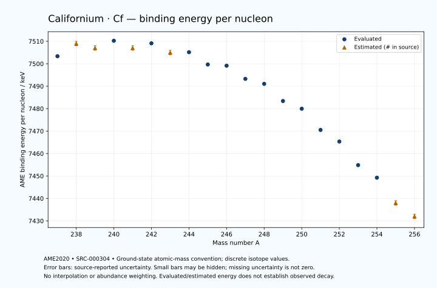

# Californium — Atomic Masses and Reaction Energies

<!-- generated-by: sync-ame2020.mjs -->

**Dated evaluated data · scientific coverage remains partial.** 20 ground-state nuclides from AME2020. Values and uncertainties are transcribed from the retained unrounded analysis files; estimated quantities remain labelled.

- [Parent Californium record](0098-Californium-Cf.md) · [NUBASE states and decays](0098-Californium-Cf-Nuclear-Evaluation.md)
- [Structured data](data/isotopes/0098-Californium-Cf-AME2020-Evaluation.yaml)
- [Original mass table](../../data/catalog/sources/ame2020-mass_1.mas20.txt) · [Original reaction table](../../data/catalog/sources/ame2020-rct1.mas20.txt)
- [AME2020 methods](https://doi.org/10.1088/1674-1137/abddb0) (SRC-000303) · [Tables and definitions](https://doi.org/10.1088/1674-1137/abddaf) (SRC-000304)

## Reading the data

All table energies and uncertainties are in keV; binding energy is per nucleon. A # replaces a decimal point in the original estimated value. UNKNOWN (*) retains the source's not-calculable entry; it is neither zero nor automatically NOT APPLICABLE. Source lines are one-based in the retained files. Uncertainties remain those published by the evaluation, with no replacement by independent-mass quadrature.

Atomic-mass conventions apply. Qα is total decay energy, not alpha-particle kinetic energy. Positive Q alone does not establish a decay branch, rate or observation. He-4's source Qα of zero is a bookkeeping identity. These tables describe ground-state combinations, not isomer or excited-daughter transitions. Nuclear state and daughter lookups are explicit in the structured companion. The binding quantity follows [Z M(¹H) + N mₙ − M(A,Z)]c²/A; it has not been converted to a bare-nucleus convention.

## Mass and binding table

| Nuclide | N | Atomic mass excess / keV | AME binding per nucleon / keV | Mass-file line |
|---|---:|---|---|---:|
| Cf-237 | 139 | 57938.255 ± 97.347 | 7503.3507 ± 0.4107 | 3221 |
| Cf-238 | 140 | 57278# ± 298# | 7509# ± 1# | 3230 |
| Cf-239 | 141 | 58202# ± 120# | 7507# ± 1# | 3239 |
| Cf-240 | 142 | 57988.719 ± 18.034 | 7510.2400 ± 0.0751 | 3248 |
| Cf-241 | 143 | 59327# ± 167# | 7507# ± 1# | 3257 |
| Cf-242 | 144 | 59386.982 ± 12.892 | 7509.0991 ± 0.0533 | 3266 |
| Cf-243 | 145 | 60990# ± 181# | 7505# ± 1# | 3275 |
| Cf-244 | 146 | 61478.096 ± 2.617 | 7505.1373 ± 0.0107 | 3283 |
| Cf-245 | 147 | 63385.151 ± 2.428 | 7499.6644 ± 0.0099 | 3292 |
| Cf-246 | 148 | 64090.228 ± 1.514 | 7499.1220 ± 0.0062 | 3300 |
| Cf-247 | 149 | 66109.392 ± 14.327 | 7493.2638 ± 0.0580 | 3308 |
| Cf-248 | 150 | 67237.951 ± 5.121 | 7491.0440 ± 0.0207 | 3315 |
| Cf-249 | 151 | 69722.733 ± 1.182 | 7483.3954 ± 0.0048 | 3323 |
| Cf-250 | 152 | 71170.336 ± 1.538 | 7479.9567 ± 0.0062 | 3330 |
| Cf-251 | 153 | 74134.981 ± 3.901 | 7470.5014 ± 0.0155 | 3337 |
| Cf-252 | 154 | 76034.610 ± 2.358 | 7465.3474 ± 0.0094 | 3345 |
| Cf-253 | 155 | 79301.562 ± 4.257 | 7454.8297 ± 0.0168 | 3352 |
| Cf-254 | 156 | 81341.395 ± 11.462 | 7449.2259 ± 0.0451 | 3360 |
| Cf-255 | 157 | 84809# ± 200# | 7438# ± 1# | 3367 |
| Cf-256 | 158 | 87041# ± 314# | 7432# ± 1# | 3375 |

## Q-values and separation energies

| Nuclide | Qβ− / keV | Qα / keV | S₂n / keV | S₂p / keV | Reaction-file line |
|---|---|---|---|---|---:|
| Cf-237 | UNKNOWN (*) | 8219.9999 ± 53.8516 | UNKNOWN (*) | 4653# ± 141# | 3220 |
| Cf-238 | UNKNOWN (*) | 8130# ± 299# | UNKNOWN (*) | 5153# ± 299# | 3229 |
| Cf-239 | -5429# ± 323# | 7763.4507 ± 62.5174 | 15879# ± 154# | 5623# ± 141# | 3238 |
| Cf-240 | -6237# ± 366# | 7710.9834 ± 3.7770 | 15431# ± 299# | 6034.4259 ± 21.7509 | 3247 |
| Cf-241 | -4567# ± 285# | 7655# ± 150# | 15018# ± 206# | 6398# ± 225# | 3256 |
| Cf-242 | -5414# ± 257# | 7516.8626 ± 4.0673 | 14744.3738 ± 22.1280 | 6915.1826 ± 12.9580 | 3265 |
| Cf-243 | -3757# ± 275# | 7418# ± 100# | 14480# ± 246# | 7290# ± 181# | 3274 |
| Cf-244 | -4547# ± 181# | 7328.9581 ± 1.8113 | 14051.5217 ± 13.0823 | 7903.5450 ± 2.4748 | 3282 |
| Cf-245 | -2930# ± 165# | 7258.4655 ± 1.8422 | 13747# ± 181# | 8374.7264 ± 2.4068 | 3291 |
| Cf-246 | -3728.5741 ± 89.9373 | 6861.6127 ± 0.9987 | 13530.5047 ± 2.6684 | 8939.5496 ± 1.0637 | 3299 |
| Cf-247 | -2469.0006 ± 24.1495 | 6502.5408 ± 14.4047 | 13418.3952 ± 14.5311 | 9473.0738 ± 14.3728 | 3307 |
| Cf-248 | -3061# ± 53# | 6361.1999 ± 5.0000 | 12994.9128 ± 5.1119 | 9956.9030 ± 5.1238 | 3314 |
| Cf-249 | -1452# ± 30# | 6293.2928 ± 0.4895 | 12529.2958 ± 14.3755 | 10388.3147 ± 3.7892 | 3322 |
| Cf-250 | -2055# ± 100# | 6128.5082 ± 0.1925 | 12210.2512 ± 5.1274 | 10800.3539 ± 2.6846 | 3329 |
| Cf-251 | -376.5660 ± 6.4677 | 6176.9599 ± 0.8944 | 11730.3877 ± 3.8933 | 11193.6567 ± 4.0772 | 3336 |
| Cf-252 | -1260.0000 ± 50.0000 | 6216.9469 ± 0.0406 | 11278.3616 ± 2.6849 | 11532.9193 ± 10.0001 | 3344 |
| Cf-253 | 291.0753 ± 4.3850 | 6125.9499 ± 3.5355 | 10976.0557 ± 5.3966 | 11924.3617 ± 23.0027 | 3351 |
| Cf-254 | -652.7561 ± 11.8014 | 5926.8918 ± 5.0801 | 10835.8513 ± 11.2165 | 12292# ± 298# | 3359 |
| Cf-255 | 720# ± 200# | 5736# ± 201# | 10635# ± 200# | UNKNOWN (*) | 3366 |
| Cf-256 | -144# ± 330# | 5560# ± 100# | 10443# ± 315# | UNKNOWN (*) | 3374 |

Qβ− comes from the mass-file line in the first table. The other three columns come from the reaction-file line. Definitions and original source strings are retained in the structured data.

## Binding-energy chart

Discrete source values and source-reported uncertainties. No interpolation, natural-abundance weighting or observed-decay claim is implied. This quantitative chart supplements the 22 separate illustrative panels.

## Remaining review

Later measurements, state-specific decay branches, isomer Q-values, additional reaction channels and full claim-level review remain open. Existing authored values retain their own provenance; this companion does not overwrite them.
