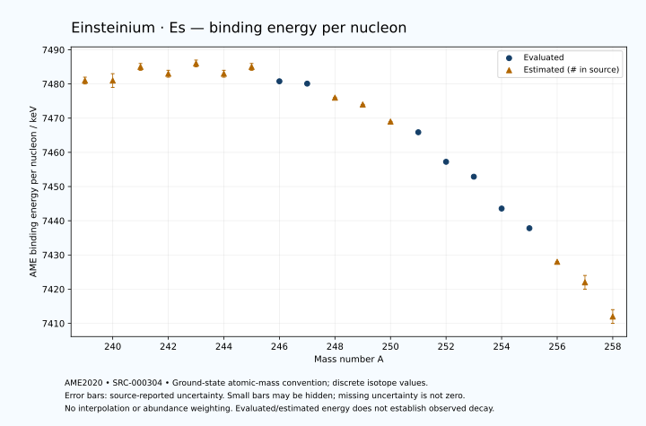

# Einsteinium — Atomic Masses and Reaction Energies

<!-- generated-by: sync-ame2020.mjs -->

**Dated evaluated data · scientific coverage remains partial.** 20 ground-state nuclides from AME2020. Values and uncertainties are transcribed from the retained unrounded analysis files; estimated quantities remain labelled.

- [Parent Einsteinium record](0099-Einsteinium-Es.md) · [NUBASE states and decays](0099-Einsteinium-Es-Nuclear-Evaluation.md)
- [Structured data](data/isotopes/0099-Einsteinium-Es-AME2020-Evaluation.yaml)
- [Original mass table](../../data/catalog/sources/ame2020-mass_1.mas20.txt) · [Original reaction table 1](../../data/catalog/sources/ame2020-rct1.mas20.txt) · [Original reaction table 2](../../data/catalog/sources/ame2020-rct2.mas20.txt)
- [AME2020 methods](https://doi.org/10.1088/1674-1137/abddb0) (SRC-000303) · [Tables and definitions](https://doi.org/10.1088/1674-1137/abddaf) (SRC-000304)

## Reading the data

All table energies and uncertainties are in keV; binding energy is per nucleon. A # replaces a decimal point in the original estimated value. UNKNOWN (*) retains the source's not-calculable entry; it is neither zero nor automatically NOT APPLICABLE. Source lines are one-based in the retained files. Uncertainties remain those published by the evaluation, with no replacement by independent-mass quadrature.

Atomic-mass conventions apply. Qα is total decay energy, not alpha-particle kinetic energy. Positive Q alone does not establish a decay branch, rate or observation. He-4's source Qα of zero is a bookkeeping identity. These tables describe ground-state combinations, not isomer or excited-daughter transitions. Nuclear state and daughter lookups are explicit in the structured companion. The binding quantity follows [Z M(¹H) + N mₙ − M(A,Z)]c²/A; it has not been converted to a bare-nucleus convention.

## Mass and binding table

| Nuclide | N | Atomic mass excess / keV | AME binding per nucleon / keV | Mass-file line |
|---|---:|---|---|---:|
| Es-239 | 140 | 63630# ± 300# | 7481# ± 1# | 3240 |
| Es-240 | 141 | 64225# ± 366# | 7481# ± 2# | 3249 |
| Es-241 | 142 | 63893# ± 231# | 7485# ± 1# | 3258 |
| Es-242 | 143 | 64801# ± 257# | 7483# ± 1# | 3267 |
| Es-243 | 144 | 64747# ± 207# | 7486# ± 1# | 3276 |
| Es-244 | 145 | 66026# ± 181# | 7483# ± 1# | 3284 |
| Es-245 | 146 | 66315# ± 165# | 7485# ± 1# | 3293 |
| Es-246 | 147 | 67818.802 ± 89.925 | 7480.7849 ± 0.3655 | 3301 |
| Es-247 | 148 | 68578.393 ± 19.441 | 7480.1005 ± 0.0787 | 3309 |
| Es-248 | 149 | 70299# ± 52# | 7476# ± 0# | 3316 |
| Es-249 | 150 | 71175# ± 30# | 7474# ± 0# | 3324 |
| Es-250 | 151 | 73225# ± 100# | 7469# ± 0# | 3331 |
| Es-251 | 152 | 74511.547 ± 5.288 | 7465.8842 ± 0.0211 | 3338 |
| Es-252 | 153 | 77294.610 ± 50.056 | 7457.2428 ± 0.1986 | 3346 |
| Es-253 | 154 | 79010.486 ± 1.249 | 7452.8879 ± 0.0049 | 3353 |
| Es-254 | 155 | 81994.151 ± 2.936 | 7443.5759 ± 0.0116 | 3361 |
| Es-255 | 156 | 84089.237 ± 10.817 | 7437.8216 ± 0.0424 | 3368 |
| Es-256 | 157 | 87185# ± 100# | 7428# ± 0# | 3376 |
| Es-257 | 158 | 89403# ± 411# | 7422# ± 2# | 3383 |
| Es-258 | 159 | 92702# ± 401# | 7412# ± 2# | 3390 |

## Q-values and separation energies

| Nuclide | Qβ− / keV | Qα / keV | S₂n / keV | S₂p / keV | Reaction-file line |
|---|---|---|---|---|---:|
| Es-239 | UNKNOWN (*) | 8435# ± 500# | UNKNOWN (*) | 4157# ± 378# | 3239 |
| Es-240 | UNKNOWN (*) | 8258.7789 ± 62.6509 | UNKNOWN (*) | 4569# ± 447# | 3248 |
| Es-241 | -5327# ± 379# | 8258.6223 ± 16.9224 | 15880# ± 379# | 4934# ± 310# | 3257 |
| Es-242 | -3598# ± 476# | 8160.1152 ± 20.3367 | 15567# ± 447# | 5441# ± 297# | 3266 |
| Es-243 | -4569# ± 245# | 8072.1077 ± 10.1677 | 15289# ± 310# | 5812# ± 265# | 3275 |
| Es-244 | -2938# ± 271# | 7936# ± 102# | 14919# ± 314# | 6304# ± 226# | 3283 |
| Es-245 | -3877# ± 256# | 7909.3581 ± 3.0499 | 14574# ± 265# | 6953# ± 165# | 3292 |
| Es-246 | -2372.3848 ± 90.9577 | 7642# ± 100# | 14349# ± 202# | 7472.9657 ± 91.0701 | 3300 |
| Es-247 | -3094# ± 182# | 7463.8478 ± 19.9602 | 13879# ± 166# | 7813.3251 ± 19.5232 | 3308 |
| Es-248 | -1599# ± 53# | 7160# ± 50# | 13662# ± 104# | 8246# ± 80# | 3315 |
| Es-249 | -2344# ± 31# | 6936# ± 30# | 13546# ± 36# | 8893# ± 31# | 3323 |
| Es-250 | -847# ± 100# | 6834# ± 117# | 13216# ± 113# | 9484# ± 112# | 3330 |
| Es-251 | -1447.2610 ± 15.2387 | 6597.1100 ± 1.0162 | 12806# ± 31# | 9912.7277 ± 5.2965 | 3337 |
| Es-252 | 477.9998 ± 50.3220 | 6738.6420 ± 0.5081 | 12073# ± 112# | 10235.3373 ± 50.1322 | 3345 |
| Es-253 | -335.0623 ± 1.0782 | 6739.2376 ± 0.0508 | 11643.6970 ± 5.2968 | 10795.4371 ± 10.7387 | 3352 |
| Es-254 | 1091.6300 ± 2.2858 | 6617.2299 ± 0.4743 | 11443.0952 ± 50.1345 | 11118# ± 200# | 3360 |
| Es-255 | 288.7717 ± 10.1024 | 6436.3399 ± 1.3416 | 11063.8854 ± 10.8222 | 11417# ± 359# | 3367 |
| Es-256 | 1700# ± 100# | 6225# ± 224# | 10952# ± 100# | 11787# ± 314# | 3375 |
| Es-257 | 813# ± 411# | 6050# ± 200# | 10828# ± 411# | UNKNOWN (*) | 3382 |
| Es-258 | 2276# ± 448# | 5884# ± 499# | 10625# ± 413# | UNKNOWN (*) | 3389 |

## Additional decay-energy combinations

| Nuclide | Q₂β− / keV | Q₄β− / keV | Qεp / keV | Qβ−n / keV | Part 1 / part 2 line |
|---|---|---|---|---|---|
| Es-239 | UNKNOWN (*) | UNKNOWN (*) | 2125# ± 394# | UNKNOWN (*) | 3239 / 3285 |
| Es-240 | UNKNOWN (*) | UNKNOWN (*) | 2687# ± 420# | UNKNOWN (*) | 3248 / 3294 |
| Es-241 | UNKNOWN (*) | UNKNOWN (*) | 940# ± 275# | UNKNOWN (*) | 3257 / 3303 |
| Es-242 | UNKNOWN (*) | UNKNOWN (*) | 1532# ± 305# | -12490# ± 395# | 3266 / 3312 |
| Es-243 | UNKNOWN (*) | UNKNOWN (*) | -294# ± 247# | -11724# ± 451# | 3275 / 3321 |
| Es-244 | -9572# ± 416# | UNKNOWN (*) | 47# ± 181# | -11362# ± 223# | 3283 / 3329 |
| Es-245 | -9010# ± 308# | UNKNOWN (*) | -1688# ± 166# | -10720# ± 260# | 3292 / 3339 |
| Es-246 | -8296# ± 275# | UNKNOWN (*) | -1283.9452 ± 89.9425 | -10444# ± 215# | 3300 / 3347 |
| Es-247 | -7357# ± 208# | UNKNOWN (*) | -2677.4899 ± 63.0894 | -9684.1117 ± 23.7660 | 3308 / 3355 |
| Es-248 | -6649# ± 191# | UNKNOWN (*) | -2479# ± 53# | -9445# ± 188# | 3315 / 3362 |
| Es-249 | -6006# ± 167# | UNKNOWN (*) | -4245# ± 58# | -8794# ± 31# | 3323 / 3370 |
| Es-250 | -5174# ± 135# | UNKNOWN (*) | -3910# ± 100# | -8365# ± 100# | 3330 / 3377 |
| Es-251 | -4455.2017 ± 19.6444 | -13318# ± 200# | -5729.4294 ± 5.8974 | -7631.9637 ± 9.4257 | 3337 / 3384 |
| Es-252 | -3172.5077 ± 104.1094 | -11242# ± 191# | -5222.3418 ± 51.1523 | -6735.5159 ± 52.0559 | 3345 / 3392 |
| Es-253 | -2162# ± 31# | -9512.9849 ± 164.5387 | -6813# ± 200# | -5877.4424 ± 5.1629 | 3352 / 3399 |
| Es-254 | -1458# ± 100# | -7651.7357 ± 91.3587 | -6223# ± 359# | -5422.7153 ± 2.9980 | 3360 / 3408 |
| Es-255 | -752.8320 ± 12.1104 | -5858.0685 ± 20.7424 | -7593# ± 298# | -4884.6024 ± 10.8593 | 3367 / 3415 |
| Es-256 | -271# ± 159# | -4562# ± 130# | UNKNOWN (*) | -4687# ± 100# | 3375 / 3423 |
| Es-257 | 411# ± 411# | -3262# ± 413# | UNKNOWN (*) | -4153# ± 411# | 3382 / 3430 |
| Es-258 | 1012# ± 401# | -2080# ± 413# | UNKNOWN (*) | -3959# ± 401# | 3389 / 3437 |

## Single-nucleon separation and reaction energies

| Nuclide | Sₙ / keV | Sₚ / keV | Q(d,α) / keV | Q(p,α) / keV | Q(n,α) / keV | Part 2 line |
|---|---|---|---|---|---|---:|
| Es-239 | UNKNOWN (*) | 936# ± 423# | 16403# ± 315# | UNKNOWN (*) | 15735# ± 469# | 3285 |
| Es-240 | 7476# ± 473# | 1265# ± 385# | 17659# ± 472# | 11151# ± 379# | 16662# ± 432# | 3294 |
| Es-241 | 8403# ± 433# | 1384# ± 232# | 16402# ± 260# | 11480# ± 377# | 15323# ± 345# | 3303 |
| Es-242 | 7163# ± 345# | 1814# ± 307# | 17524# ± 257# | 11464# ± 283# | 16198# ± 330# | 3312 |
| Es-243 | 8126# ± 330# | 1929# ± 207# | 16131# ± 266# | 11622# ± 208# | 14729# ± 256# | 3321 |
| Es-244 | 6792# ± 275# | 2253# ± 256# | 17349# ± 182# | 11563# ± 247# | 15691# ± 245# | 3329 |
| Es-245 | 7782# ± 245# | 2452# ± 165# | 16036# ± 245# | 11792# ± 166# | 14210# ± 213# | 3339 |
| Es-246 | 6567# ± 188# | 2855.3207 ± 89.9574 | 17051.5126 ± 89.9627 | 11693# ± 202# | 14775.5747 ± 90.0383 | 3347 |
| Es-247 | 7311.7269 ± 92.0020 | 2800.8057 ± 19.4996 | 15904.0486 ± 19.5917 | 11964.3520 ± 19.6161 | 13510.9698 ± 24.1923 | 3355 |
| Es-248 | 6351# ± 56# | 3099# ± 54# | 16920# ± 52# | 11778# ± 52# | 14132# ± 52# | 3362 |
| Es-249 | 7196# ± 60# | 3352# ± 31# | 15776# ± 33# | 11949# ± 30# | 12854# ± 67# | 3370 |
| Es-250 | 6021# ± 104# | 3786# ± 100# | 16698# ± 100# | 11980# ± 101# | 13382# ± 100# | 3377 |
| Es-251 | 6785# ± 100# | 3947.7598 ± 5.3617 | 15499.6214 ± 5.2814 | 12137.6514 ± 7.2475 | 12026.8968 ± 50.3324 | 3384 |
| Es-252 | 5288.2548 ± 50.3298 | 4129.3418 ± 50.1654 | 16835.0815 ± 50.0720 | 12435.9328 ± 50.0650 | 13094.6798 ± 50.0666 | 3392 |
| Es-253 | 6355.4422 ± 50.0666 | 4313.0952 ± 2.5822 | 15586.3121 ± 3.9141 | 12704.2055 ± 1.3759 | 11704.8829 ± 2.8152 | 3399 |
| Es-254 | 5087.6530 ± 2.8549 | 4596.3813 ± 5.1017 | 16670.3480 ± 3.6696 | 12723.2254 ± 4.6205 | 12412.5724 ± 11.0158 | 3408 |
| Es-255 | 5976.2324 ± 11.0972 | 4541.1293 ± 15.6259 | 15498.4824 ± 11.4422 | 12918.6818 ± 10.8795 | 11201# ± 200# | 3415 |
| Es-256 | 4976# ± 101# | 4913# ± 224# | 16554# ± 101# | 12747# ± 100# | 11903# ± 373# | 3423 |
| Es-257 | 5853# ± 423# | 4926# ± 517# | 15305# ± 457# | 12926# ± 411# | 10657# ± 508# | 3430 |
| Es-258 | 4773# ± 574# | UNKNOWN (*) | 16372# ± 509# | 12757# ± 448# | UNKNOWN (*) | 3437 |

Qβ− comes from the mass-file line in the first table. Qα, S₂n, S₂p, Q₂β−, Qεp and Qβ−n come from reaction part 1; Q₄β− and the last table come from part 2. Qεp is electron-capture/proton energy balance; Qβ−n is beta-minus/neutron energy balance. These are evaluated mass combinations, not observations of decay modes, cross sections or reaction rates. Light-nuclide zero entries can be bookkeeping identities, without a physical A=0 residual. Definitions and original source strings are retained in the structured data.

## Binding-energy chart

Discrete source values and source-reported uncertainties. No interpolation, natural-abundance weighting or observed-decay claim is implied. This quantitative chart supplements the 22 separate illustrative panels.

## Remaining review

Later measurements, state-specific decay branches, isomer Q-values, reaction rates, applicability and full claim-level review remain open. Existing authored values retain their own provenance; this companion does not overwrite them.
