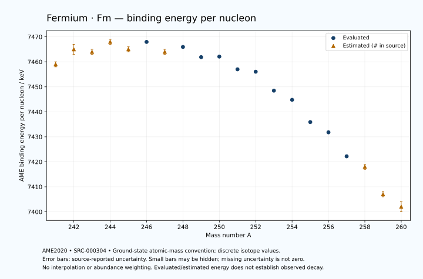

# Fermium — Atomic Masses and Reaction Energies

<!-- generated-by: sync-ame2020.mjs -->

**Dated evaluated data · scientific coverage remains partial.** 20 ground-state nuclides from AME2020. Values and uncertainties are transcribed from the retained unrounded analysis files; estimated quantities remain labelled.

- [Parent Fermium record](0100-Fermium-Fm.md) · [NUBASE states and decays](0100-Fermium-Fm-Nuclear-Evaluation.md)
- [Structured data](data/isotopes/0100-Fermium-Fm-AME2020-Evaluation.yaml)
- [Original mass table](../../data/catalog/sources/ame2020-mass_1.mas20.txt) · [Original reaction table 1](../../data/catalog/sources/ame2020-rct1.mas20.txt) · [Original reaction table 2](../../data/catalog/sources/ame2020-rct2.mas20.txt)
- [AME2020 methods](https://doi.org/10.1088/1674-1137/abddb0) (SRC-000303) · [Tables and definitions](https://doi.org/10.1088/1674-1137/abddaf) (SRC-000304)

## Reading the data

All table energies and uncertainties are in keV; binding energy is per nucleon. A # replaces a decimal point in the original estimated value. UNKNOWN (*) retains the source's not-calculable entry; it is neither zero nor automatically NOT APPLICABLE. Source lines are one-based in the retained files. Uncertainties remain those published by the evaluation, with no replacement by independent-mass quadrature.

Atomic-mass conventions apply. Qα is total decay energy, not alpha-particle kinetic energy. Positive Q alone does not establish a decay branch, rate or observation. He-4's source Qα of zero is a bookkeeping identity. These tables describe ground-state combinations, not isomer or excited-daughter transitions. Nuclear state and daughter lookups are explicit in the structured companion. The binding quantity follows [Z M(¹H) + N mₙ − M(A,Z)]c²/A; it has not been converted to a bare-nucleus convention.

## Mass and binding table

| Nuclide | N | Atomic mass excess / keV | AME binding per nucleon / keV | Mass-file line |
|---|---:|---|---|---:|
| Fm-241 | 141 | 69220# ± 300# | 7459# ± 1# | 3259 |
| Fm-242 | 142 | 68400# ± 401# | 7465# ± 2# | 3268 |
| Fm-243 | 143 | 69316# ± 130# | 7464# ± 1# | 3277 |
| Fm-244 | 144 | 68964# ± 201# | 7468# ± 1# | 3285 |
| Fm-245 | 145 | 70192# ± 195# | 7465# ± 1# | 3294 |
| Fm-246 | 146 | 70191.187 ± 13.670 | 7467.9608 ± 0.0556 | 3302 |
| Fm-247 | 147 | 71672# ± 181# | 7464# ± 1# | 3310 |
| Fm-248 | 148 | 71897.793 ± 8.497 | 7465.9451 ± 0.0343 | 3317 |
| Fm-249 | 149 | 73519.143 ± 6.212 | 7461.8649 ± 0.0249 | 3325 |
| Fm-250 | 150 | 74072.193 ± 7.888 | 7462.0905 ± 0.0316 | 3332 |
| Fm-251 | 151 | 75958.808 ± 14.292 | 7457.0013 ± 0.0569 | 3339 |
| Fm-252 | 152 | 76816.611 ± 5.221 | 7456.0351 ± 0.0207 | 3347 |
| Fm-253 | 153 | 79345.549 ± 1.549 | 7448.4712 ± 0.0061 | 3354 |
| Fm-254 | 154 | 80902.521 ± 1.843 | 7444.7936 ± 0.0073 | 3362 |
| Fm-255 | 155 | 83800.465 ± 3.934 | 7435.8860 ± 0.0154 | 3369 |
| Fm-256 | 156 | 85484.796 ± 3.020 | 7431.7888 ± 0.0118 | 3377 |
| Fm-257 | 157 | 88590.137 ± 4.350 | 7422.1942 ± 0.0169 | 3384 |
| Fm-258 | 158 | 90426# ± 200# | 7418# ± 1# | 3391 |
| Fm-259 | 159 | 93704# ± 283# | 7407# ± 1# | 3398 |
| Fm-260 | 160 | 95766# ± 435# | 7402# ± 2# | 3405 |

## Q-values and separation energies

| Nuclide | Qβ− / keV | Qα / keV | S₂n / keV | S₂p / keV | Reaction-file line |
|---|---|---|---|---|---:|
| Fm-241 | UNKNOWN (*) | 8857# ± 315# | UNKNOWN (*) | 3560# ± 323# | 3258 |
| Fm-242 | UNKNOWN (*) | 8697# ± 499# | UNKNOWN (*) | 4167# ± 401# | 3267 |
| Fm-243 | UNKNOWN (*) | 8689.1999 ± 50.6519 | 16047# ± 327# | 4589# ± 212# | 3276 |
| Fm-244 | -6634# ± 425# | 8550# ± 200# | 15579# ± 448# | 5001# ± 201# | 3284 |
| Fm-245 | -5133# ± 325# | 8440# ± 100# | 15267# ± 235# | 5376# ± 266# | 3293 |
| Fm-246 | -5924# ± 260# | 8379.2890 ± 4.5462 | 14915# ± 201# | 5864.8517 ± 13.8497 | 3301 |
| Fm-247 | -4263# ± 275# | 8257.6677 ± 9.7405 | 14662# ± 266# | 6291# ± 181# | 3309 |
| Fm-248 | -5050# ± 184# | 7994.7808 ± 8.2669 | 14436.0299 ± 16.0495 | 6770.3769 ± 8.5390 | 3316 |
| Fm-249 | -3661.8091 ± 164.5418 | 7709.0754 ± 5.9290 | 14296# ± 181# | 7168.1918 ± 15.6156 | 3324 |
| Fm-250 | -4326.9476 ± 91.2615 | 7557.0492 ± 7.8003 | 13968.2362 ± 11.5395 | 7743.7004 ± 9.3025 | 3331 |
| Fm-251 | -3007.9406 ± 23.7108 | 7424.4999 ± 1.0000 | 13702.9706 ± 15.5835 | 8341.8667 ± 14.3407 | 3338 |
| Fm-252 | -3650.5075 ± 91.4356 | 7153.7437 ± 1.0162 | 13398.2183 ± 9.3579 | 8931.6674 ± 5.2272 | 3346 |
| Fm-253 | -1827# ± 31# | 7197.8999 ± 1.0000 | 12755.8958 ± 14.3755 | 9367.3747 ± 4.0197 | 3353 |
| Fm-254 | -2550# ± 100# | 7307.2696 ± 1.0160 | 12056.7254 ± 5.3250 | 9710.0312 ± 2.8707 | 3361 |
| Fm-255 | -1041.6037 ± 6.7172 | 7240.5682 ± 0.5080 | 11687.7194 ± 4.0516 | 10079.0384 ± 5.4205 | 3368 |
| Fm-256 | -1971# ± 124# | 7025.2702 ± 1.8865 | 11560.3610 ± 3.4351 | 10434.5409 ± 11.3740 | 3376 |
| Fm-257 | -402.3347 ± 4.5748 | 6863.6599 ± 0.8944 | 11352.9640 ± 5.4938 | 10797# ± 200# | 3383 |
| Fm-258 | -1264# ± 200# | 6660# ± 200# | 11201# ± 200# | 11192# ± 373# | 3390 |
| Fm-259 | 140# ± 300# | 6470# ± 200# | 11029# ± 283# | UNKNOWN (*) | 3397 |
| Fm-260 | -784# ± 537# | 6300# ± 300# | 10803# ± 479# | UNKNOWN (*) | 3404 |

## Additional decay-energy combinations

| Nuclide | Q₂β− / keV | Q₄β− / keV | Qεp / keV | Qβ−n / keV | Part 1 / part 2 line |
|---|---|---|---|---|---|
| Fm-241 | UNKNOWN (*) | UNKNOWN (*) | 3943# ± 300# | UNKNOWN (*) | 3258 / 3304 |
| Fm-242 | UNKNOWN (*) | UNKNOWN (*) | 1784# ± 434# | UNKNOWN (*) | 3267 / 3313 |
| Fm-243 | UNKNOWN (*) | UNKNOWN (*) | 2640# ± 131# | UNKNOWN (*) | 3276 / 3322 |
| Fm-244 | UNKNOWN (*) | UNKNOWN (*) | 685# ± 270# | UNKNOWN (*) | 3284 / 3330 |
| Fm-245 | UNKNOWN (*) | UNKNOWN (*) | 1425# ± 195# | -13477# ± 422# | 3293 / 3340 |
| Fm-246 | UNKNOWN (*) | UNKNOWN (*) | -482.9359 ± 13.8472 | -13205# ± 260# | 3301 / 3348 |
| Fm-247 | UNKNOWN (*) | UNKNOWN (*) | 293# ± 181# | -12514# ± 317# | 3309 / 3356 |
| Fm-248 | -8791# ± 224# | UNKNOWN (*) | -1500.5706 ± 16.6572 | -12109# ± 208# | 3316 / 3363 |
| Fm-249 | -8267# ± 280# | UNKNOWN (*) | -1007.7794 ± 7.9330 | -11500# ± 184# | 3324 / 3371 |
| Fm-250 | -7494# ± 201# | UNKNOWN (*) | -2939.5111 ± 7.8698 | -11180.0771 ± 164.6136 | 3331 / 3378 |
| Fm-251 | -6890# ± 181# | UNKNOWN (*) | -2500.4988 ± 14.3744 | -10511.6502 ± 92.0364 | 3338 / 3385 |
| Fm-252 | -6054.7598 ± 10.5974 | UNKNOWN (*) | -4607.3416 ± 6.3895 | -10221.4563 ± 19.6265 | 3346 / 3393 |
| Fm-253 | -5013.1474 ± 6.9800 | -14296# ± 410# | -3978.0329 ± 2.7395 | -9192.8876 ± 91.2996 | 3353 / 3400 |
| Fm-254 | -3820.7905 ± 9.7651 | -12298# ± 283# | -5688.0113 ± 4.5609 | -8342# ± 31# | 3361 / 3409 |
| Fm-255 | -3011.4686 ± 14.5871 | -10529# ± 181# | -4829.9010 ± 11.9427 | -7723# ± 100# | 3368 / 3416 |
| Fm-256 | -2338.2494 ± 8.0985 | -8737.1960 ± 18.0942 | -6613# ± 200# | -7428.5906 ± 6.2992 | 3376 / 3424 |
| Fm-257 | -1656.9270 ± 7.5409 | -7276.2513 ± 11.6442 | -5740# ± 314# | -6937# ± 124# | 3383 / 3431 |
| Fm-258 | -1051# ± 224# | -5918# ± 201# | UNKNOWN (*) | -6637# ± 200# | 3390 / 3438 |
| Fm-259 | -375# ± 283# | -4663# ± 292# | UNKNOWN (*) | -6058# ± 283# | 3397 / 3445 |
| Fm-260 | 156# ± 478# | -3382# ± 478# | UNKNOWN (*) | -5870# ± 446# | 3404 / 3452 |

## Single-nucleon separation and reaction energies

| Nuclide | Sₙ / keV | Sₚ / keV | Q(d,α) / keV | Q(p,α) / keV | Q(n,α) / keV | Part 2 line |
|---|---|---|---|---|---|---:|
| Fm-241 | UNKNOWN (*) | 2294# ± 473# | 16301# ± 424# | UNKNOWN (*) | 17589# ± 423# | 3304 |
| Fm-242 | 8892# ± 500# | 2783# ± 462# | 14885# ± 543# | 9633# ± 500# | 15844# ± 418# | 3313 |
| Fm-243 | 7155# ± 421# | 2774# ± 288# | 16133# ± 265# | 9955# ± 388# | 16974# ± 131# | 3322 |
| Fm-244 | 8424# ± 239# | 3072# ± 288# | 14873# ± 326# | 9934# ± 306# | 15283# ± 261# | 3330 |
| Fm-245 | 6843# ± 280# | 3123# ± 266# | 16156# ± 285# | 10254# ± 323# | 16451# ± 196# | 3340 |
| Fm-246 | 8072# ± 196# | 3413# ± 166# | 14876# ± 182# | 10309# ± 208# | 14848# ± 181# | 3348 |
| Fm-247 | 6590# ± 181# | 3435# ± 202# | 16068# ± 245# | 10511# ± 256# | 15841# ± 181# | 3356 |
| Fm-248 | 7846# ± 181# | 3969.5712 ± 21.2167 | 14789.7981 ± 90.3252 | 10447# ± 166# | 14159.0436 ± 8.7575 | 3363 |
| Fm-249 | 6449.9683 ± 10.4729 | 4069# ± 53# | 15651.5567 ± 20.4091 | 10564.3961 ± 90.1389 | 15075.3172 ± 6.2487 | 3371 |
| Fm-250 | 7518.2680 ± 9.9670 | 4392# ± 31# | 14484# ± 53# | 10357.8549 ± 20.9801 | 13609.2026 ± 16.3548 | 3378 |
| Fm-251 | 6184.7026 ± 16.3242 | 4555# ± 101# | 15495# ± 33# | 10524# ± 54# | 14367.2594 ± 15.1816 | 3385 |
| Fm-252 | 7213.5157 ± 15.2156 | 4983.9076 ± 7.3184 | 14302# ± 100# | 10506# ± 31# | 12740.2800 ± 5.1471 | 3393 |
| Fm-253 | 5542.3801 ± 5.2434 | 5238.0329 ± 50.0750 | 15544.8084 ± 5.3752 | 10984# ± 100# | 13821.6149 ± 1.6524 | 3400 |
| Fm-254 | 6514.3453 ± 1.9398 | 5396.9360 ± 1.7104 | 14318.7180 ± 50.0823 | 11255.0294 ± 5.4571 | 12413.9424 ± 4.0155 | 3409 |
| Fm-255 | 5173.3741 ± 4.0475 | 5482.6571 ± 4.6483 | 15500.7861 ± 3.9470 | 11369.9101 ± 50.1679 | 13412.2571 ± 4.1013 | 3416 |
| Fm-256 | 6386.9869 ± 4.5144 | 5893.4116 ± 11.0418 | 14201.4522 ± 4.1261 | 11338.3654 ± 3.1979 | 11829.6371 ± 4.0153 | 3424 |
| Fm-257 | 4965.9772 ± 4.1138 | 5884# ± 100# | 15211.7074 ± 11.4771 | 11460.0412 ± 5.1795 | 12895.1443 ± 11.7970 | 3431 |
| Fm-258 | 6235# ± 200# | 6266# ± 457# | 13952# ± 224# | 11201# ± 201# | 11263# ± 283# | 3438 |
| Fm-259 | 4793# ± 347# | 6287# ± 490# | 15011# ± 499# | 11383# ± 300# | 12310# ± 423# | 3445 |
| Fm-260 | 6010# ± 519# | UNKNOWN (*) | 13774# ± 591# | 11226# ± 598# | UNKNOWN (*) | 3452 |

Qβ− comes from the mass-file line in the first table. Qα, S₂n, S₂p, Q₂β−, Qεp and Qβ−n come from reaction part 1; Q₄β− and the last table come from part 2. Qεp is electron-capture/proton energy balance; Qβ−n is beta-minus/neutron energy balance. These are evaluated mass combinations, not observations of decay modes, cross sections or reaction rates. Light-nuclide zero entries can be bookkeeping identities, without a physical A=0 residual. Definitions and original source strings are retained in the structured data.

## Binding-energy chart

Discrete source values and source-reported uncertainties. No interpolation, natural-abundance weighting or observed-decay claim is implied. This quantitative chart supplements the 22 separate illustrative panels.

## Remaining review

Later measurements, state-specific decay branches, isomer Q-values, reaction rates, applicability and full claim-level review remain open. Existing authored values retain their own provenance; this companion does not overwrite them.
