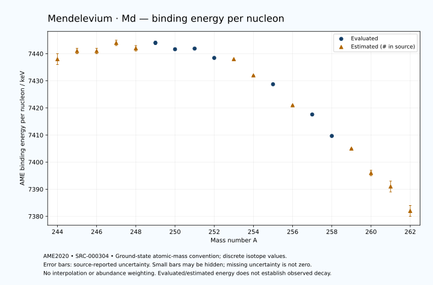

# Mendelevium — Atomic Masses and Reaction Energies

<!-- generated-by: sync-ame2020.mjs -->

**Dated evaluated data · scientific coverage remains partial.** 19 ground-state nuclides from AME2020. Values and uncertainties are transcribed from the retained unrounded analysis files; estimated quantities remain labelled.

- [Parent Mendelevium record](0101-Mendelevium-Md.md) · [NUBASE states and decays](0101-Mendelevium-Md-Nuclear-Evaluation.md)
- [Structured data](data/isotopes/0101-Mendelevium-Md-AME2020-Evaluation.yaml)
- [Original mass table](../../data/catalog/sources/ame2020-mass_1.mas20.txt) · [Original reaction table](../../data/catalog/sources/ame2020-rct1.mas20.txt)
- [AME2020 methods](https://doi.org/10.1088/1674-1137/abddb0) (SRC-000303) · [Tables and definitions](https://doi.org/10.1088/1674-1137/abddaf) (SRC-000304)

## Reading the data

All table energies and uncertainties are in keV; binding energy is per nucleon. A # replaces a decimal point in the original estimated value. UNKNOWN (*) retains the source's not-calculable entry; it is neither zero nor automatically NOT APPLICABLE. Source lines are one-based in the retained files. Uncertainties remain those published by the evaluation, with no replacement by independent-mass quadrature.

Atomic-mass conventions apply. Qα is total decay energy, not alpha-particle kinetic energy. Positive Q alone does not establish a decay branch, rate or observation. He-4's source Qα of zero is a bookkeeping identity. These tables describe ground-state combinations, not isomer or excited-daughter transitions. Nuclear state and daughter lookups are explicit in the structured companion. The binding quantity follows [Z M(¹H) + N mₙ − M(A,Z)]c²/A; it has not been converted to a bare-nucleus convention.

## Mass and binding table

| Nuclide | N | Atomic mass excess / keV | AME binding per nucleon / keV | Mass-file line |
|---|---:|---|---|---:|
| Md-244 | 143 | 75597# ± 374# | 7438# ± 2# | 3286 |
| Md-245 | 144 | 75325# ± 260# | 7441# ± 1# | 3295 |
| Md-246 | 145 | 76115# ± 260# | 7441# ± 1# | 3303 |
| Md-247 | 146 | 75936# ± 207# | 7444# ± 1# | 3311 |
| Md-248 | 147 | 76948# ± 184# | 7442# ± 1# | 3318 |
| Md-249 | 148 | 77180.952 ± 164.425 | 7444.0169 ± 0.6603 | 3326 |
| Md-250 | 149 | 78399.140 ± 90.920 | 7441.6533 ± 0.3637 | 3333 |
| Md-251 | 150 | 78966.749 ± 18.919 | 7441.9005 ± 0.0754 | 3340 |
| Md-252 | 151 | 80467.118 ± 91.286 | 7438.4444 ± 0.3622 | 3348 |
| Md-253 | 152 | 81173# ± 31# | 7438# ± 0# | 3355 |
| Md-254 | 153 | 83453# ± 100# | 7432# ± 0# | 3363 |
| Md-255 | 154 | 84842.069 ± 5.567 | 7428.7333 ± 0.0218 | 3370 |
| Md-256 | 155 | 87456# ± 124# | 7421# ± 0# | 3378 |
| Md-257 | 156 | 88992.472 ± 1.569 | 7417.5845 ± 0.0061 | 3385 |
| Md-258 | 157 | 91690.350 ± 3.474 | 7409.6615 ± 0.0135 | 3392 |
| Md-259 | 158 | 93564# ± 101# | 7405# ± 0# | 3399 |
| Md-260 | 159 | 96550# ± 316# | 7396# ± 1# | 3406 |
| Md-261 | 160 | 98578# ± 509# | 7391# ± 2# | 3413 |
| Md-262 | 161 | 101667# ± 448# | 7382# ± 2# | 3420 |

## Q-values and separation energies

| Nuclide | Qβ− / keV | Qα / keV | S₂n / keV | S₂p / keV | Reaction-file line |
|---|---|---|---|---|---:|
| Md-244 | UNKNOWN (*) | 8946.9999 ± 78.8733 | UNKNOWN (*) | 3782# ± 454# | 3285 |
| Md-245 | UNKNOWN (*) | 9006# ± 119# | UNKNOWN (*) | 4000# ± 332# | 3294 |
| Md-246 | UNKNOWN (*) | 8888.7896 ± 40.6623 | 15625# ± 456# | 4488# ± 317# | 3302 |
| Md-247 | UNKNOWN (*) | 8764.3999 ± 10.0000 | 15532# ± 332# | 4957# ± 265# | 3310 |
| Md-248 | -3741# ± 290# | 8497.2929 ± 30.4927 | 15310# ± 318# | 5449# ± 205# | 3317 |
| Md-249 | -4606# ± 324# | 8441# ± 18# | 14898# ± 265# | 5975.3834 ± 165.5698 | 3325 |
| Md-250 | -3167# ± 220# | 8155.4227 ± 27.6804 | 14691# ± 205# | 6478# ± 105# | 3332 |
| Md-251 | -3882# ± 182# | 7963.4399 ± 4.4721 | 14356.8391 ± 165.5094 | 6786# ± 36# | 3339 |
| Md-252 | -2404.2523 ± 91.7581 | 7743# ± 105# | 14074.6584 ± 128.8396 | 7336# ± 135# | 3347 |
| Md-253 | -3186# ± 32# | 7573.0769 ± 8.3205 | 13937# ± 37# | 7917# ± 32# | 3354 |
| Md-254 | -1271# ± 100# | 7802# ± 141# | 13157# ± 135# | 8420# ± 112# | 3362 |
| Md-255 | -1969.8648 ± 15.1096 | 7905.6060 ± 1.7408 | 12473# ± 32# | 8746.3594 ± 5.5755 | 3369 |
| Md-256 | -367# ± 124# | 7737# ± 113# | 12139# ± 159# | 9116# ± 124# | 3377 |
| Md-257 | -1254.5923 ± 6.1695 | 7557.0699 ± 0.9487 | 11992.2331 ± 5.6556 | 9674.7071 ± 10.8637 | 3384 |
| Md-258 | 213# ± 100# | 7271.2827 ± 1.8570 | 11908# ± 124# | 10072# ± 100# | 3391 |
| Md-259 | -515# ± 101# | 7050# ± 100# | 11571# ± 101# | 10417# ± 423# | 3398 |
| Md-260 | 940# ± 374# | 6940# ± 300# | 11283# ± 316# | 10731# ± 510# | 3405 |
| Md-261 | 123# ± 547# | 6750# ± 300# | 11128# ± 519# | UNKNOWN (*) | 3412 |
| Md-262 | 1566# ± 575# | 6540# ± 200# | 11025# ± 548# | UNKNOWN (*) | 3419 |

Qβ− comes from the mass-file line in the first table. The other three columns come from the reaction-file line. Definitions and original source strings are retained in the structured data.

## Binding-energy chart

Discrete source values and source-reported uncertainties. No interpolation, natural-abundance weighting or observed-decay claim is implied. This quantitative chart supplements the 22 separate illustrative panels.

## Remaining review

Later measurements, state-specific decay branches, isomer Q-values, additional reaction channels and full claim-level review remain open. Existing authored values retain their own provenance; this companion does not overwrite them.
