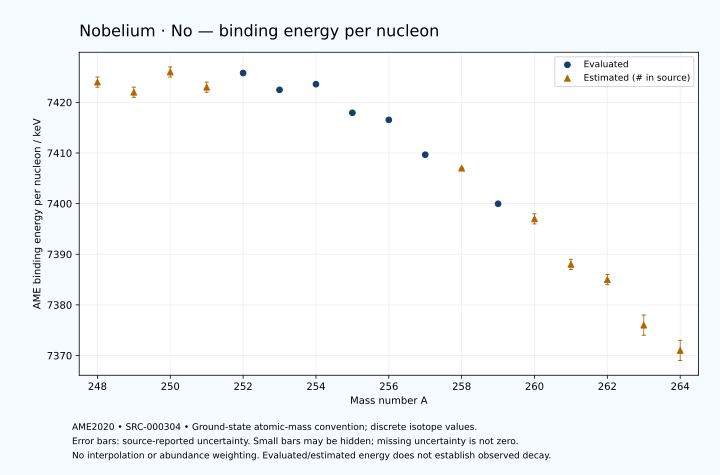

# Nobelium — Atomic Masses and Reaction Energies

<!-- generated-by: sync-ame2020.mjs -->

**Dated evaluated data · scientific coverage remains partial.** 17 ground-state nuclides from AME2020. Values and uncertainties are transcribed from the retained unrounded analysis files; estimated quantities remain labelled.

- [Parent Nobelium record](0102-Nobelium-No.md) · [NUBASE states and decays](0102-Nobelium-No-Nuclear-Evaluation.md)
- [Structured data](data/isotopes/0102-Nobelium-No-AME2020-Evaluation.yaml)
- [Original mass table](../../data/catalog/sources/ame2020-mass_1.mas20.txt) · [Original reaction table](../../data/catalog/sources/ame2020-rct1.mas20.txt)
- [AME2020 methods](https://doi.org/10.1088/1674-1137/abddb0) (SRC-000303) · [Tables and definitions](https://doi.org/10.1088/1674-1137/abddaf) (SRC-000304)

## Reading the data

All table energies and uncertainties are in keV; binding energy is per nucleon. A # replaces a decimal point in the original estimated value. UNKNOWN (*) retains the source's not-calculable entry; it is neither zero nor automatically NOT APPLICABLE. Source lines are one-based in the retained files. Uncertainties remain those published by the evaluation, with no replacement by independent-mass quadrature.

Atomic-mass conventions apply. Qα is total decay energy, not alpha-particle kinetic energy. Positive Q alone does not establish a decay branch, rate or observation. He-4's source Qα of zero is a bookkeeping identity. These tables describe ground-state combinations, not isomer or excited-daughter transitions. Nuclear state and daughter lookups are explicit in the structured companion. The binding quantity follows [Z M(¹H) + N mₙ − M(A,Z)]c²/A; it has not been converted to a bare-nucleus convention.

## Mass and binding table

| Nuclide | N | Atomic mass excess / keV | AME binding per nucleon / keV | Mass-file line |
|---|---:|---|---|---:|
| No-248 | 146 | 80689# ± 224# | 7424# ± 1# | 3319 |
| No-249 | 147 | 81787# ± 279# | 7422# ± 1# | 3327 |
| No-250 | 148 | 81566# ± 200# | 7426# ± 1# | 3334 |
| No-251 | 149 | 82849# ± 181# | 7423# ± 1# | 3341 |
| No-252 | 150 | 82871.370 ± 9.292 | 7425.7992 ± 0.0369 | 3349 |
| No-253 | 151 | 84358.696 ± 6.912 | 7422.4719 ± 0.0273 | 3356 |
| No-254 | 152 | 84723.312 ± 9.658 | 7423.5909 ± 0.0380 | 3364 |
| No-255 | 153 | 86811.934 ± 14.047 | 7417.9403 ± 0.0551 | 3371 |
| No-256 | 154 | 87823.046 ± 7.548 | 7416.5429 ± 0.0295 | 3379 |
| No-257 | 155 | 90247.064 ± 6.197 | 7409.6587 ± 0.0241 | 3386 |
| No-258 | 156 | 91477# ± 100# | 7407# ± 0# | 3393 |
| No-259 | 157 | 94079.381 ± 6.362 | 7399.9714 ± 0.0246 | 3400 |
| No-260 | 158 | 95610# ± 200# | 7397# ± 1# | 3407 |
| No-261 | 159 | 98455# ± 200# | 7388# ± 1# | 3414 |
| No-262 | 160 | 100101# ± 361# | 7385# ± 1# | 3421 |
| No-263 | 161 | 103129# ± 490# | 7376# ± 2# | 3427 |
| No-264 | 162 | 105011# ± 591# | 7371# ± 2# | 3434 |

## Q-values and separation energies

| Nuclide | Qβ− / keV | Qα / keV | S₂n / keV | S₂p / keV | Reaction-file line |
|---|---|---|---|---|---:|
| No-248 | UNKNOWN (*) | 9300# ± 100# | UNKNOWN (*) | 4081# ± 225# | 3318 |
| No-249 | UNKNOWN (*) | 9170# ± 200# | UNKNOWN (*) | 4464# ± 333# | 3326 |
| No-250 | UNKNOWN (*) | 8950# ± 200# | 15265# ± 301# | 4910# ± 201# | 3333 |
| No-251 | -4981# ± 270# | 8751.7140 ± 4.0649 | 15080# ± 333# | 5248# ± 181# | 3340 |
| No-252 | -5666# ± 185# | 8548.6616 ± 5.3226 | 14837# ± 201# | 5778.7645 ± 12.1417 | 3348 |
| No-253 | -4164.7752 ± 164.6791 | 8414.6374 ± 4.3296 | 14633# ± 181# | 6178.0544 ± 15.8757 | 3355 |
| No-254 | -4922.5753 ± 91.8208 | 8226.2032 ± 8.0482 | 14290.6947 ± 13.3707 | 6671.2409 ± 10.9147 | 3363 |
| No-255 | -3135.3716 ± 22.5952 | 8428.2098 ± 2.9932 | 13689.3982 ± 15.6553 | 7111.5568 ± 14.1318 | 3370 |
| No-256 | -3923.5573 ± 83.2459 | 8581.5194 ± 5.4519 | 13042.9021 ± 12.2006 | 7657.4176 ± 7.6209 | 3378 |
| No-257 | -2418# ± 45# | 8476.5999 ± 6.0000 | 12707.5056 ± 15.3528 | 8131.3431 ± 7.2399 | 3385 |
| No-258 | -3304# ± 143# | 8150# ± 100# | 12488# ± 100# | 8585# ± 100# | 3392 |
| No-259 | -1771# ± 71# | 7853.9999 ± 5.0000 | 12310.3194 ± 8.7986 | 9088.6984 ± 7.4284 | 3399 |
| No-260 | -2667# ± 236# | 7700# ± 200# | 12010# ± 224# | 9395# ± 283# | 3406 |
| No-261 | -1102# ± 283# | 7440# ± 200# | 11767# ± 200# | 9827# ± 347# | 3413 |
| No-262 | -2004# ± 412# | 7250# ± 300# | 11651# ± 412# | 10242# ± 565# | 3420 |
| No-263 | -540# ± 539# | 7000# ± 400# | 11469# ± 529# | UNKNOWN (*) | 3426 |
| No-264 | -1364# ± 734# | 6820# ± 400# | 11233# ± 692# | UNKNOWN (*) | 3433 |

Qβ− comes from the mass-file line in the first table. The other three columns come from the reaction-file line. Definitions and original source strings are retained in the structured data.

## Binding-energy chart

Discrete source values and source-reported uncertainties. No interpolation, natural-abundance weighting or observed-decay claim is implied. This quantitative chart supplements the 22 separate illustrative panels.

## Remaining review

Later measurements, state-specific decay branches, isomer Q-values, additional reaction channels and full claim-level review remain open. Existing authored values retain their own provenance; this companion does not overwrite them.
