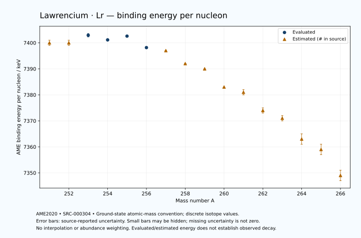

# Lawrencium — Atomic Masses and Reaction Energies

<!-- generated-by: sync-ame2020.mjs -->

**Dated evaluated data · scientific coverage remains partial.** 16 ground-state nuclides from AME2020. Values and uncertainties are transcribed from the retained unrounded analysis files; estimated quantities remain labelled.

- [Parent Lawrencium record](0103-Lawrencium-Lr.md) · [NUBASE states and decays](0103-Lawrencium-Lr-Nuclear-Evaluation.md)
- [Structured data](data/isotopes/0103-Lawrencium-Lr-AME2020-Evaluation.yaml)
- [Original mass table](../../data/catalog/sources/ame2020-mass_1.mas20.txt) · [Original reaction table 1](../../data/catalog/sources/ame2020-rct1.mas20.txt) · [Original reaction table 2](../../data/catalog/sources/ame2020-rct2.mas20.txt)
- [AME2020 methods](https://doi.org/10.1088/1674-1137/abddb0) (SRC-000303) · [Tables and definitions](https://doi.org/10.1088/1674-1137/abddaf) (SRC-000304)

## Reading the data

All table energies and uncertainties are in keV; binding energy is per nucleon. A # replaces a decimal point in the original estimated value. UNKNOWN (*) retains the source's not-calculable entry; it is neither zero nor automatically NOT APPLICABLE. Source lines are one-based in the retained files. Uncertainties remain those published by the evaluation, with no replacement by independent-mass quadrature.

Atomic-mass conventions apply. Qα is total decay energy, not alpha-particle kinetic energy. Positive Q alone does not establish a decay branch, rate or observation. He-4's source Qα of zero is a bookkeeping identity. These tables describe ground-state combinations, not isomer or excited-daughter transitions. Nuclear state and daughter lookups are explicit in the structured companion. The binding quantity follows [Z M(¹H) + N mₙ − M(A,Z)]c²/A; it has not been converted to a bare-nucleus convention.

## Mass and binding table

| Nuclide | N | Atomic mass excess / keV | AME binding per nucleon / keV | Mass-file line |
|---|---:|---|---|---:|
| Lr-251 | 148 | 87830# ± 200# | 7400# ± 1# | 3342 |
| Lr-252 | 149 | 88537# ± 185# | 7400# ± 1# | 3350 |
| Lr-253 | 150 | 88523.471 ± 164.534 | 7402.9180 ± 0.6503 | 3357 |
| Lr-254 | 151 | 89645.887 ± 91.312 | 7401.1306 ± 0.3595 | 3365 |
| Lr-255 | 152 | 89947.305 ± 17.698 | 7402.5767 ± 0.0694 | 3372 |
| Lr-256 | 153 | 91746.603 ± 82.903 | 7398.1605 ± 0.3238 | 3380 |
| Lr-257 | 154 | 92665# ± 44# | 7397# ± 0# | 3387 |
| Lr-258 | 155 | 94782# ± 102# | 7392# ± 0# | 3394 |
| Lr-259 | 156 | 95851# ± 71# | 7390# ± 0# | 3401 |
| Lr-260 | 157 | 98277# ± 125# | 7383# ± 0# | 3408 |
| Lr-261 | 158 | 99557# ± 200# | 7381# ± 1# | 3415 |
| Lr-262 | 159 | 102105# ± 200# | 7374# ± 1# | 3422 |
| Lr-263 | 160 | 103669# ± 224# | 7371# ± 1# | 3428 |
| Lr-264 | 161 | 106375# ± 436# | 7363# ± 2# | 3435 |
| Lr-265 | 162 | 108233# ± 547# | 7359# ± 2# | 3441 |
| Lr-266 | 163 | 111662# ± 539# | 7349# ± 2# | 3448 |

## Q-values and separation energies

| Nuclide | Qβ− / keV | Qα / keV | S₂n / keV | S₂p / keV | Reaction-file line |
|---|---|---|---|---|---:|
| Lr-251 | UNKNOWN (*) | 9469# ± 288# | UNKNOWN (*) | 3929# ± 259# | 3341 |
| Lr-252 | UNKNOWN (*) | 9164.3375 ± 16.9099 | UNKNOWN (*) | 4440# ± 206# | 3349 |
| Lr-253 | -5118# ± 442# | 8917.6035 ± 20.2833 | 15449# ± 259# | 5021.2198 ± 165.6181 | 3356 |
| Lr-254 | -3555# ± 298# | 8821.8308 ± 8.4473 | 15034# ± 206# | 5399.1731 ± 129.1163 | 3364 |
| Lr-255 | -4382# ± 182# | 8555.6408 ± 6.6865 | 14718.8018 ± 165.4831 | 5803# ± 36# | 3371 |
| Lr-256 | -2475.3893 ± 84.8025 | 8854.5692 ± 123.3131 | 14041.9201 ± 123.3317 | 6284# ± 130# | 3379 |
| Lr-257 | -3201# ± 45# | 9067.7440 ± 31.2138 | 13425# ± 48# | 6755# ± 44# | 3386 |
| Lr-258 | -1562# ± 103# | 8904.4827 ± 18.5695 | 13107# ± 131# | 7252# ± 160# | 3393 |
| Lr-259 | -2516# ± 101# | 8584# ± 71# | 12957# ± 83# | 7720# ± 71# | 3400 |
| Lr-260 | -871# ± 236# | 8396# ± 143# | 12648# ± 161# | 7992# ± 125# | 3407 |
| Lr-261 | -1761# ± 211# | 8140# ± 200# | 12436# ± 212# | 8585# ± 224# | 3414 |
| Lr-262 | -287# ± 300# | 7990# ± 200# | 12314# ± 236# | 9022# ± 374# | 3421 |
| Lr-263 | -1087# ± 271# | 7680# ± 200# | 12031# ± 300# | 9487# ± 556# | 3427 |
| Lr-264 | 300# ± 566# | 7400# ± 300# | 11873# ± 480# | 9871# ± 625# | 3434 |
| Lr-265 | -457# ± 655# | 7230# ± 200# | 11578# ± 591# | UNKNOWN (*) | 3440 |
| Lr-266 | 1526# ± 679# | 7570# ± 300# | 10855# ± 693# | UNKNOWN (*) | 3447 |

## Additional decay-energy combinations

| Nuclide | Q₂β− / keV | Q₄β− / keV | Qεp / keV | Qβ−n / keV | Part 1 / part 2 line |
|---|---|---|---|---|---|
| Lr-251 | UNKNOWN (*) | UNKNOWN (*) | 2142# ± 220# | UNKNOWN (*) | 3341 / 3388 |
| Lr-252 | UNKNOWN (*) | UNKNOWN (*) | 2281# ± 186# | UNKNOWN (*) | 3349 / 3396 |
| Lr-253 | UNKNOWN (*) | UNKNOWN (*) | 767.3820 ± 188.1612 | UNKNOWN (*) | 3356 / 3403 |
| Lr-254 | UNKNOWN (*) | UNKNOWN (*) | 1184# ± 97# | -12067# ± 420# | 3364 / 3412 |
| Lr-255 | -9647# ± 284# | UNKNOWN (*) | -794# ± 102# | -11325# ± 284# | 3371 / 3419 |
| Lr-256 | -8551# ± 205# | UNKNOWN (*) | -384.4369 ± 83.0897 | -10654# ± 199# | 3379 / 3427 |
| Lr-257 | -7489# ± 170# | UNKNOWN (*) | -2080# ± 131# | -9628# ± 48# | 3386 / 3434 |
| Lr-258 | -6726# ± 137# | UNKNOWN (*) | -1500# ± 102# | -9156# ± 102# | 3393 / 3441 |
| Lr-259 | -6140# ± 91# | UNKNOWN (*) | -3128# ± 71# | -8565# ± 73# | 3400 / 3448 |
| Lr-260 | -5396# ± 156# | -14847# ± 233# | -2576# ± 161# | -8162# ± 145# | 3407 / 3455 |
| Lr-261 | -4751# ± 228# | -13522# ± 269# | -4281# ± 374# | -7662# ± 283# | 3414 / 3462 |
| Lr-262 | -4148# ± 246# | -12147# ± 221# | -3762# ± 547# | -7284# ± 211# | 3421 / 3469 |
| Lr-263 | -3441# ± 280# | -10827# ± 379# | -5287# ± 501# | -6795# ± 316# | 3427 / 3475 |
| Lr-264 | -2887# ± 496# | -9583# ± 471# | UNKNOWN (*) | -6453# ± 462# | 3434 / 3483 |
| Lr-265 | -2149# ± 591# | -8162# ± 597# | UNKNOWN (*) | -5913# ± 655# | 3440 / 3489 |
| Lr-266 | -1078# ± 609# | -6442# ± 563# | UNKNOWN (*) | -5099# ± 648# | 3447 / 3496 |

## Single-nucleon separation and reaction energies

| Nuclide | Sₙ / keV | Sₚ / keV | Q(d,α) / keV | Q(p,α) / keV | Q(n,α) / keV | Part 2 line |
|---|---|---|---|---|---|---:|
| Lr-251 | UNKNOWN (*) | 1025# ± 283# | 16754# ± 344# | 12005# ± 301# | 16528# ± 272# | 3388 |
| Lr-252 | 7364# ± 272# | 1601# ± 259# | 17682# ± 273# | 11614# ± 335# | 17002# ± 247# | 3396 |
| Lr-253 | 8085# ± 247# | 1636.8703 ± 164.7961 | 16385# ± 244# | 11821# ± 259# | 15770.7329 ± 187.9837 | 3403 |
| Lr-254 | 6948.9021 ± 188.1734 | 2001.7799 ± 91.5728 | 17485.3237 ± 91.7831 | 11661# ± 203# | 16325.5404 ± 93.2509 | 3412 |
| Lr-255 | 7769.8997 ± 93.0109 | 2064.9774 ± 20.1619 | 16299.4166 ± 19.0003 | 11939.9903 ± 19.9893 | 15126.5896 ± 92.9863 | 3419 |
| Lr-256 | 6272.0204 ± 84.7711 | 2354.3018 ± 84.0846 | 17734.0984 ± 83.4636 | 12251.9624 ± 83.1906 | 16220# ± 89# | 3427 |
| Lr-257 | 7153# ± 94# | 2447# ± 45# | 16564# ± 46# | 12806# ± 45# | 14859# ± 109# | 3434 |
| Lr-258 | 5955# ± 111# | 2754# ± 102# | 17670# ± 102# | 12834# ± 103# | 15586# ± 102# | 3441 |
| Lr-259 | 7002# ± 124# | 2916# ± 123# | 16315# ± 71# | 12892# ± 71# | 14041# ± 142# | 3448 |
| Lr-260 | 5645# ± 144# | 3092# ± 125# | 17510# ± 160# | 12894# ± 125# | 14931# ± 125# | 3455 |
| Lr-261 | 6791# ± 236# | 3341# ± 283# | 16189# ± 200# | 12944# ± 224# | 13513# ± 200# | 3462 |
| Lr-262 | 5523# ± 283# | 3639# ± 283# | 17206# ± 283# | 12890# ± 200# | 14188# ± 224# | 3469 |
| Lr-263 | 6508# ± 300# | 3721# ± 425# | 15925# ± 300# | 12923# ± 300# | 12766# ± 387# | 3475 |
| Lr-264 | 5366# ± 490# | 4043# ± 656# | 16984# ± 566# | 12784# ± 480# | 13443# ± 670# | 3483 |
| Lr-265 | 6213# ± 699# | 4066# ± 805# | 15815# ± 734# | 12996# ± 655# | 12213# ± 707# | 3489 |
| Lr-266 | 4643# ± 768# | UNKNOWN (*) | 17362# ± 800# | 13397# ± 728# | UNKNOWN (*) | 3496 |

Qβ− comes from the mass-file line in the first table. Qα, S₂n, S₂p, Q₂β−, Qεp and Qβ−n come from reaction part 1; Q₄β− and the last table come from part 2. Qεp is electron-capture/proton energy balance; Qβ−n is beta-minus/neutron energy balance. These are evaluated mass combinations, not observations of decay modes, cross sections or reaction rates. Light-nuclide zero entries can be bookkeeping identities, without a physical A=0 residual. Definitions and original source strings are retained in the structured data.

## Binding-energy chart

Discrete source values and source-reported uncertainties. No interpolation, natural-abundance weighting or observed-decay claim is implied. This quantitative chart supplements the 22 separate illustrative panels.

## Remaining review

Later measurements, state-specific decay branches, isomer Q-values, reaction rates, applicability and full claim-level review remain open. Existing authored values retain their own provenance; this companion does not overwrite them.
