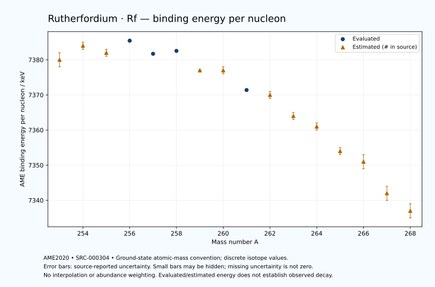

# Rutherfordium — Atomic Masses and Reaction Energies

<!-- generated-by: sync-ame2020.mjs -->

**Dated evaluated data · scientific coverage remains partial.** 16 ground-state nuclides from AME2020. Values and uncertainties are transcribed from the retained unrounded analysis files; estimated quantities remain labelled.

- [Parent Rutherfordium record](0104-Rutherfordium-Rf.md) · [NUBASE states and decays](0104-Rutherfordium-Rf-Nuclear-Evaluation.md)
- [Structured data](data/isotopes/0104-Rutherfordium-Rf-AME2020-Evaluation.yaml)
- [Original mass table](../../data/catalog/sources/ame2020-mass_1.mas20.txt) · [Original reaction table](../../data/catalog/sources/ame2020-rct1.mas20.txt)
- [AME2020 methods](https://doi.org/10.1088/1674-1137/abddb0) (SRC-000303) · [Tables and definitions](https://doi.org/10.1088/1674-1137/abddaf) (SRC-000304)

## Reading the data

All table energies and uncertainties are in keV; binding energy is per nucleon. A # replaces a decimal point in the original estimated value. UNKNOWN (*) retains the source's not-calculable entry; it is neither zero nor automatically NOT APPLICABLE. Source lines are one-based in the retained files. Uncertainties remain those published by the evaluation, with no replacement by independent-mass quadrature.

Atomic-mass conventions apply. Qα is total decay energy, not alpha-particle kinetic energy. Positive Q alone does not establish a decay branch, rate or observation. He-4's source Qα of zero is a bookkeeping identity. These tables describe ground-state combinations, not isomer or excited-daughter transitions. Nuclear state and daughter lookups are explicit in the structured companion. The binding quantity follows [Z M(¹H) + N mₙ − M(A,Z)]c²/A; it has not been converted to a bare-nucleus convention.

## Mass and binding table

| Nuclide | N | Atomic mass excess / keV | AME binding per nucleon / keV | Mass-file line |
|---|---:|---|---|---:|
| Rf-253 | 149 | 93642# ± 410# | 7380# ± 2# | 3358 |
| Rf-254 | 150 | 93201# ± 283# | 7384# ± 1# | 3366 |
| Rf-255 | 151 | 94329# ± 181# | 7382# ± 1# | 3373 |
| Rf-256 | 152 | 94221.992 ± 17.848 | 7385.4349 ± 0.0697 | 3381 |
| Rf-257 | 153 | 95866.389 ± 10.817 | 7381.7053 ± 0.0421 | 3388 |
| Rf-258 | 154 | 96344.338 ± 16.104 | 7382.5257 ± 0.0624 | 3395 |
| Rf-259 | 155 | 98367# ± 72# | 7377# ± 0# | 3402 |
| Rf-260 | 156 | 99148# ± 200# | 7377# ± 1# | 3409 |
| Rf-261 | 157 | 101318.233 ± 65.663 | 7371.3858 ± 0.2516 | 3416 |
| Rf-262 | 158 | 102392# ± 224# | 7370# ± 1# | 3423 |
| Rf-263 | 159 | 104757# ± 153# | 7364# ± 1# | 3429 |
| Rf-264 | 160 | 106075# ± 361# | 7361# ± 1# | 3436 |
| Rf-265 | 161 | 108690# ± 361# | 7354# ± 1# | 3442 |
| Rf-266 | 162 | 110136# ± 412# | 7351# ± 2# | 3449 |
| Rf-267 | 163 | 113444# ± 575# | 7342# ± 2# | 3455 |
| Rf-268 | 164 | 115476# ± 662# | 7337# ± 2# | 3462 |

## Q-values and separation energies

| Nuclide | Qβ− / keV | Qα / keV | S₂n / keV | S₂p / keV | Reaction-file line |
|---|---|---|---|---|---:|
| Rf-253 | UNKNOWN (*) | 9430# ± 300# | UNKNOWN (*) | 3786# ± 448# | 3357 |
| Rf-254 | UNKNOWN (*) | 9210# ± 200# | UNKNOWN (*) | 4248# ± 283# | 3365 |
| Rf-255 | -5265# ± 336# | 9055.4615 ± 3.9223 | 15455# ± 448# | 4607# ± 181# | 3372 |
| Rf-256 | -6076# ± 188# | 8925.7062 ± 15.2385 | 15122# ± 284# | 5079.2615 ± 20.2728 | 3380 |
| Rf-257 | -4287.8969 ± 164.9888 | 9082.7769 ± 8.3205 | 14606# ± 181# | 5523.4873 ± 17.7291 | 3387 |
| Rf-258 | -5163.3651 ± 93.2584 | 9196.1101 ± 12.8867 | 14020.2908 ± 24.0220 | 6056.6502 ± 17.7460 | 3394 |
| Rf-259 | -3624# ± 92# | 9130# ± 71# | 13642# ± 73# | 6458# ± 73# | 3401 |
| Rf-260 | -4525# ± 221# | 8900# ± 200# | 13339# ± 201# | 6907# ± 224# | 3408 |
| Rf-261 | -2990# ± 128# | 8646.2528 ± 65.3701 | 13191# ± 98# | 7339.0902 ± 65.9596 | 3415 |
| Rf-262 | -3861# ± 265# | 8490# ± 200# | 12898# ± 300# | 7795# ± 300# | 3422 |
| Rf-263 | -2353# ± 227# | 8252# ± 153# | 12704# ± 166# | 8276# ± 252# | 3428 |
| Rf-264 | -3187# ± 431# | 8040# ± 300# | 12460# ± 424# | 8605# ± 510# | 3435 |
| Rf-265 | -1692# ± 424# | 7810# ± 300# | 12209# ± 392# | 9017# ± 608# | 3441 |
| Rf-266 | -2604# ± 500# | 7610# ± 200# | 12081# ± 548# | 9452# ± 720# | 3448 |
| Rf-267 | -570# ± 686# | 7890# ± 300# | 11389# ± 678# | UNKNOWN (*) | 3454 |
| Rf-268 | -1584# ± 848# | 8040# ± 300# | 10803# ± 780# | UNKNOWN (*) | 3461 |

Qβ− comes from the mass-file line in the first table. The other three columns come from the reaction-file line. Definitions and original source strings are retained in the structured data.

## Binding-energy chart

Discrete source values and source-reported uncertainties. No interpolation, natural-abundance weighting or observed-decay claim is implied. This quantitative chart supplements the 22 separate illustrative panels.

## Remaining review

Later measurements, state-specific decay branches, isomer Q-values, additional reaction channels and full claim-level review remain open. Existing authored values retain their own provenance; this companion does not overwrite them.
