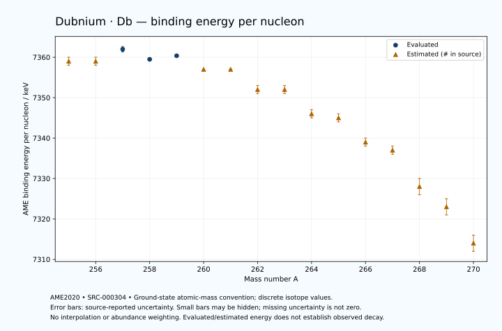

# Dubnium — Atomic Masses and Reaction Energies

<!-- generated-by: sync-ame2020.mjs -->

**Dated evaluated data · scientific coverage remains partial.** 16 ground-state nuclides from AME2020. Values and uncertainties are transcribed from the retained unrounded analysis files; estimated quantities remain labelled.

- [Parent Dubnium record](0105-Dubnium-Db.md) · [NUBASE states and decays](0105-Dubnium-Db-Nuclear-Evaluation.md)
- [Structured data](data/isotopes/0105-Dubnium-Db-AME2020-Evaluation.yaml)
- [Original mass table](../../data/catalog/sources/ame2020-mass_1.mas20.txt) · [Original reaction table 1](../../data/catalog/sources/ame2020-rct1.mas20.txt) · [Original reaction table 2](../../data/catalog/sources/ame2020-rct2.mas20.txt)
- [AME2020 methods](https://doi.org/10.1088/1674-1137/abddb0) (SRC-000303) · [Tables and definitions](https://doi.org/10.1088/1674-1137/abddaf) (SRC-000304)

## Reading the data

All table energies and uncertainties are in keV; binding energy is per nucleon. A # replaces a decimal point in the original estimated value. UNKNOWN (*) retains the source's not-calculable entry; it is neither zero nor automatically NOT APPLICABLE. Source lines are one-based in the retained files. Uncertainties remain those published by the evaluation, with no replacement by independent-mass quadrature.

Atomic-mass conventions apply. Qα is total decay energy, not alpha-particle kinetic energy. Positive Q alone does not establish a decay branch, rate or observation. He-4's source Qα of zero is a bookkeeping identity. These tables describe ground-state combinations, not isomer or excited-daughter transitions. Nuclear state and daughter lookups are explicit in the structured companion. The binding quantity follows [Z M(¹H) + N mₙ − M(A,Z)]c²/A; it has not been converted to a bare-nucleus convention.

## Mass and binding table

| Nuclide | N | Atomic mass excess / keV | AME binding per nucleon / keV | Mass-file line |
|---|---:|---|---|---:|
| Db-255 | 150 | 99595# ± 283# | 7359# ± 1# | 3374 |
| Db-256 | 151 | 100298# ± 187# | 7359# ± 1# | 3382 |
| Db-257 | 152 | 100154.285 ± 164.634 | 7361.9767 ± 0.6406 | 3389 |
| Db-258 | 153 | 101507.703 ± 91.857 | 7359.4803 ± 0.3560 | 3396 |
| Db-259 | 154 | 101991.021 ± 56.685 | 7360.3626 ± 0.2189 | 3403 |
| Db-260 | 155 | 103673# ± 93# | 7357# ± 0# | 3410 |
| Db-261 | 156 | 104308# ± 110# | 7357# ± 0# | 3417 |
| Db-262 | 157 | 106253# ± 143# | 7352# ± 1# | 3424 |
| Db-263 | 158 | 107110# ± 168# | 7352# ± 1# | 3430 |
| Db-264 | 159 | 109262# ± 236# | 7346# ± 1# | 3437 |
| Db-265 | 160 | 110382# ± 224# | 7345# ± 1# | 3443 |
| Db-266 | 161 | 112740# ± 283# | 7339# ± 1# | 3450 |
| Db-267 | 162 | 114014# ± 374# | 7337# ± 1# | 3456 |
| Db-268 | 163 | 117060# ± 529# | 7328# ± 2# | 3463 |
| Db-269 | 164 | 119148# ± 624# | 7323# ± 2# | 3469 |
| Db-270 | 165 | 122397# ± 575# | 7314# ± 2# | 3475 |

## Q-values and separation energies

| Nuclide | Qβ− / keV | Qα / keV | S₂n / keV | S₂p / keV | Reaction-file line |
|---|---|---|---|---|---:|
| Db-255 | UNKNOWN (*) | 9340# ± 200# | UNKNOWN (*) | 3507# ± 327# | 3373 |
| Db-256 | UNKNOWN (*) | 9336.1310 ± 30.4770 | UNKNOWN (*) | 3926# ± 208# | 3381 |
| Db-257 | UNKNOWN (*) | 9205.8985 ± 20.2783 | 15583# ± 327# | 4370.9621 ± 165.5823 | 3388 |
| Db-258 | -3788# ± 423# | 9436.8999 ± 10.0000 | 14933# ± 209# | 4816.8424 ± 123.7364 | 3395 |
| Db-259 | -4528# ± 190# | 9618.7999 ± 53.8516 | 14305.9004 ± 174.1192 | 5252# ± 72# | 3402 |
| Db-260 | -2875# ± 95# | 9501# ± 42# | 13978# ± 131# | 5687# ± 138# | 3409 |
| Db-261 | -3697# ± 112# | 9218# ± 101# | 13825# ± 124# | 6121# ± 131# | 3416 |
| Db-262 | -2116# ± 145# | 9046# ± 101# | 13562# ± 171# | 6602# ± 190# | 3423 |
| Db-263 | -3085# ± 193# | 8834# ± 152# | 13341# ± 201# | 7025# ± 261# | 3429 |
| Db-264 | -1521# ± 368# | 8560# ± 200# | 13134# ± 276# | 7422# ± 309# | 3436 |
| Db-265 | -2412# ± 263# | 8400# ± 100# | 12870# ± 280# | 7865# ± 316# | 3442 |
| Db-266 | -877# ± 374# | 8210# ± 200# | 12664# ± 368# | 8212# ± 520# | 3449 |
| Db-267 | -1792# ± 457# | 7920# ± 300# | 12511# ± 436# | 8797# ± 663# | 3455 |
| Db-268 | 260# ± 707# | 8260# ± 300# | 11823# ± 600# | 9181# ± 755# | 3462 |
| Db-269 | -544# ± 724# | 8490# ± 300# | 11008# ± 727# | UNKNOWN (*) | 3468 |
| Db-270 | 966# ± 735# | 8310# ± 200# | 10805# ± 781# | UNKNOWN (*) | 3474 |

## Additional decay-energy combinations

| Nuclide | Q₂β− / keV | Q₄β− / keV | Qεp / keV | Qβ−n / keV | Part 1 / part 2 line |
|---|---|---|---|---|---|
| Db-255 | UNKNOWN (*) | UNKNOWN (*) | 2660# ± 297# | UNKNOWN (*) | 3373 / 3421 |
| Db-256 | UNKNOWN (*) | UNKNOWN (*) | 3062# ± 188# | UNKNOWN (*) | 3381 / 3429 |
| Db-257 | UNKNOWN (*) | UNKNOWN (*) | 1118.7113 ± 184.3290 | UNKNOWN (*) | 3388 / 3436 |
| Db-258 | UNKNOWN (*) | UNKNOWN (*) | 1553# ± 102# | UNKNOWN (*) | 3395 / 3443 |
| Db-259 | UNKNOWN (*) | UNKNOWN (*) | -80# ± 116# | -11376# ± 416# | 3402 / 3450 |
| Db-260 | -9450# ± 217# | UNKNOWN (*) | 533# ± 117# | -10918# ± 204# | 3409 / 3457 |
| Db-261 | -8771# ± 211# | UNKNOWN (*) | -1258# ± 167# | -10311# ± 112# | 3416 / 3464 |
| Db-262 | -7999# ± 171# | UNKNOWN (*) | -593# ± 246# | -9823# ± 144# | 3423 / 3471 |
| Db-263 | -7386# ± 349# | UNKNOWN (*) | -2284# ± 261# | -9330# ± 170# | 3429 / 3477 |
| Db-264 | -6696# ± 295# | UNKNOWN (*) | -1696# ± 325# | -9005# ± 254# | 3436 / 3485 |
| Db-265 | -6013# ± 327# | -16242# ± 492# | -3281# ± 490# | -8472# ± 361# | 3442 / 3491 |
| Db-266 | -5364# ± 326# | -14932# ± 299# | -2782# ± 616# | -8125# ± 315# | 3449 / 3498 |
| Db-267 | -4751# ± 457# | -13777# ± 627# | -4937# ± 656# | -7675# ± 447# | 3455 / 3504 |
| Db-268 | -3647# ± 652# | -12091# ± 578# | UNKNOWN (*) | -6818# ± 590# | 3462 / 3511 |
| Db-269 | -2329# ± 727# | -10152# ± 697# | UNKNOWN (*) | -5723# ± 780# | 3468 / 3517 |
| Db-270 | -1833# ± 648# | -8312# ± 606# | UNKNOWN (*) | -5367# ± 683# | 3474 / 3523 |

## Single-nucleon separation and reaction energies

| Nuclide | Sₙ / keV | Sₚ / keV | Q(d,α) / keV | Q(p,α) / keV | Q(n,α) / keV | Part 2 line |
|---|---|---|---|---|---|---:|
| Db-255 | UNKNOWN (*) | 895# ± 400# | 16664# ± 498# | UNKNOWN (*) | 16704# ± 338# | 3421 |
| Db-256 | 7368# ± 339# | 1320# ± 260# | 17808# ± 339# | 11521# ± 451# | 17421# ± 249# | 3429 |
| Db-257 | 8215# ± 249# | 1356.6780 ± 165.5984 | 16536# ± 245# | 11817# ± 328# | 16154.8006 ± 188.2607 | 3436 |
| Db-258 | 6717.9007 ± 188.5261 | 1647.6568 ± 92.4922 | 17996.5174 ± 93.5754 | 12042# ± 203# | 17206.7996 ± 93.5469 | 3443 |
| Db-259 | 7587.9997 ± 107.9399 | 1642.2876 ± 58.9285 | 16835.4396 ± 57.7083 | 12633.0840 ± 59.4288 | 15890.8203 ± 100.4298 | 3450 |
| Db-260 | 6390# ± 109# | 1983# ± 118# | 18039# ± 94# | 12670# ± 94# | 16654# ± 103# | 3457 |
| Db-261 | 7436# ± 144# | 2129# ± 228# | 16652# ± 132# | 12828# ± 111# | 15173# ± 150# | 3464 |
| Db-262 | 6126# ± 181# | 2354# ± 157# | 17816# ± 246# | 12750# ± 160# | 16049# ± 160# | 3471 |
| Db-263 | 7214# ± 221# | 2571# ± 280# | 16503# ± 180# | 12826# ± 261# | 14480# ± 210# | 3477 |
| Db-264 | 5920# ± 290# | 2784# ± 281# | 17580# ± 325# | 12807# ± 245# | 15351# ± 309# | 3485 |
| Db-265 | 6951# ± 325# | 2981# ± 424# | 16337# ± 271# | 12854# ± 316# | 13923# ± 300# | 3491 |
| Db-266 | 5713# ± 361# | 3239# ± 458# | 17376# ± 458# | 12848# ± 322# | 14718# ± 361# | 3498 |
| Db-267 | 6798# ± 469# | 3411# ± 557# | 16035# ± 520# | 12803# ± 520# | 13286# ± 575# | 3504 |
| Db-268 | 5026# ± 648# | 3673# ± 781# | 17634# ± 671# | 13234# ± 640# | 14473# ± 761# | 3511 |
| Db-269 | 5983# ± 818# | 3616# ± 910# | 16415# ± 848# | 13876# ± 748# | 13133# ± 824# | 3517 |
| Db-270 | 4823# ± 848# | UNKNOWN (*) | 17632# ± 877# | 13817# ± 813# | UNKNOWN (*) | 3523 |

Qβ− comes from the mass-file line in the first table. Qα, S₂n, S₂p, Q₂β−, Qεp and Qβ−n come from reaction part 1; Q₄β− and the last table come from part 2. Qεp is electron-capture/proton energy balance; Qβ−n is beta-minus/neutron energy balance. These are evaluated mass combinations, not observations of decay modes, cross sections or reaction rates. Light-nuclide zero entries can be bookkeeping identities, without a physical A=0 residual. Definitions and original source strings are retained in the structured data.

## Binding-energy chart

Discrete source values and source-reported uncertainties. No interpolation, natural-abundance weighting or observed-decay claim is implied. This quantitative chart supplements the 22 separate illustrative panels.

## Remaining review

Later measurements, state-specific decay branches, isomer Q-values, reaction rates, applicability and full claim-level review remain open. Existing authored values retain their own provenance; this companion does not overwrite them.
