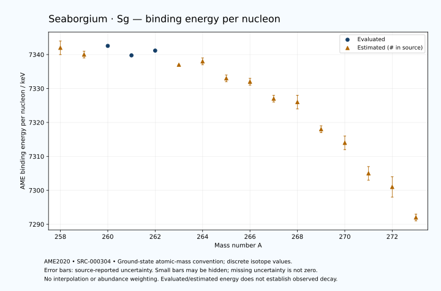

# Seaborgium — Atomic Masses and Reaction Energies

<!-- generated-by: sync-ame2020.mjs -->

**Dated evaluated data · scientific coverage remains partial.** 16 ground-state nuclides from AME2020. Values and uncertainties are transcribed from the retained unrounded analysis files; estimated quantities remain labelled.

- [Parent Seaborgium record](0106-Seaborgium-Sg.md) · [NUBASE states and decays](0106-Seaborgium-Sg-Nuclear-Evaluation.md)
- [Structured data](data/isotopes/0106-Seaborgium-Sg-AME2020-Evaluation.yaml)
- [Original mass table](../../data/catalog/sources/ame2020-mass_1.mas20.txt) · [Original reaction table](../../data/catalog/sources/ame2020-rct1.mas20.txt)
- [AME2020 methods](https://doi.org/10.1088/1674-1137/abddb0) (SRC-000303) · [Tables and definitions](https://doi.org/10.1088/1674-1137/abddaf) (SRC-000304)

## Reading the data

All table energies and uncertainties are in keV; binding energy is per nucleon. A # replaces a decimal point in the original estimated value. UNKNOWN (*) retains the source's not-calculable entry; it is neither zero nor automatically NOT APPLICABLE. Source lines are one-based in the retained files. Uncertainties remain those published by the evaluation, with no replacement by independent-mass quadrature.

Atomic-mass conventions apply. Qα is total decay energy, not alpha-particle kinetic energy. Positive Q alone does not establish a decay branch, rate or observation. He-4's source Qα of zero is a bookkeeping identity. These tables describe ground-state combinations, not isomer or excited-daughter transitions. Nuclear state and daughter lookups are explicit in the structured companion. The binding quantity follows [Z M(¹H) + N mₙ − M(A,Z)]c²/A; it has not been converted to a bare-nucleus convention.

## Mass and binding table

| Nuclide | N | Atomic mass excess / keV | AME binding per nucleon / keV | Mass-file line |
|---|---:|---|---|---:|
| Sg-258 | 152 | 105296# ± 413# | 7342# ± 2# | 3397 |
| Sg-259 | 153 | 106519# ± 181# | 7340# ± 1# | 3404 |
| Sg-260 | 154 | 106547.495 ± 20.536 | 7342.5632 ± 0.0790 | 3411 |
| Sg-261 | 155 | 108005.004 ± 18.494 | 7339.7710 ± 0.0709 | 3418 |
| Sg-262 | 156 | 108369.072 ± 22.167 | 7341.1736 ± 0.0846 | 3425 |
| Sg-263 | 157 | 110195# ± 95# | 7337# ± 0# | 3431 |
| Sg-264 | 158 | 110783# ± 283# | 7338# ± 1# | 3438 |
| Sg-265 | 159 | 112794# ± 139# | 7333# ± 1# | 3444 |
| Sg-266 | 160 | 113617# ± 245# | 7332# ± 1# | 3451 |
| Sg-267 | 161 | 115806# ± 261# | 7327# ± 1# | 3457 |
| Sg-268 | 162 | 116800# ± 469# | 7326# ± 2# | 3464 |
| Sg-269 | 163 | 119692# ± 368# | 7318# ± 1# | 3470 |
| Sg-270 | 164 | 121431# ± 458# | 7314# ± 2# | 3476 |
| Sg-271 | 165 | 124617# ± 591# | 7305# ± 2# | 3481 |
| Sg-272 | 166 | 126520# ± 692# | 7301# ± 3# | 3486 |
| Sg-273 | 167 | 129920# ± 400# | 7292# ± 1# | 3492 |

## Q-values and separation energies

| Nuclide | Qβ− / keV | Qα / keV | S₂n / keV | S₂p / keV | Reaction-file line |
|---|---|---|---|---|---:|
| Sg-258 | UNKNOWN (*) | 9670# ± 300# | UNKNOWN (*) | 3504# ± 413# | 3396 |
| Sg-259 | UNKNOWN (*) | 9765.0775 ± 8.1257 | UNKNOWN (*) | 3925# ± 181# | 3403 |
| Sg-260 | -6576# ± 197# | 9900.5871 ± 10.1565 | 14891# ± 413# | 4374.7845 ± 26.0808 | 3410 |
| Sg-261 | -5074.4052 ± 180.7519 | 9713.6999 ± 15.0000 | 14657# ± 182# | 4940# ± 75# | 3417 |
| Sg-262 | -5883.0463 ± 95.6774 | 9599.8187 ± 15.2330 | 14321.0592 ± 30.2035 | 5357# ± 201# | 3424 |
| Sg-263 | -4301# ± 320# | 9403.2630 ± 60.9283 | 13953# ± 96# | 5701# ± 115# | 3430 |
| Sg-264 | -5175# ± 334# | 9210# ± 200# | 13729# ± 284# | 6187# ± 361# | 3437 |
| Sg-265 | -3601# ± 277# | 9051# ± 123# | 13544# ± 168# | 6540# ± 207# | 3443 |
| Sg-266 | -4487# ± 294# | 8800# ± 100# | 13308# ± 374# | 7035# ± 436# | 3450 |
| Sg-267 | -2958# ± 371# | 8625# ± 212# | 13130# ± 296# | 7461# ± 445# | 3456 |
| Sg-268 | -3907# ± 605# | 8300# ± 300# | 12960# ± 529# | 7915# ± 625# | 3463 |
| Sg-269 | -1785# ± 525# | 8577.4408 ± 74.9312 | 12257# ± 452# | 8330# ± 682# | 3469 |
| Sg-270 | -2799# ± 547# | 8870# ± 200# | 11511# ± 656# | 8622# ± 806# | 3475 |
| Sg-271 | -1242# ± 705# | 8748# ± 138# | 11218# ± 696# | UNKNOWN (*) | 3480 |
| Sg-272 | -2267# ± 873# | 8620# ± 200# | 11053# ± 830# | UNKNOWN (*) | 3485 |
| Sg-273 | -763# ± 767# | UNKNOWN (*) | 10840# ± 713# | UNKNOWN (*) | 3491 |

Qβ− comes from the mass-file line in the first table. The other three columns come from the reaction-file line. Definitions and original source strings are retained in the structured data.

## Binding-energy chart

Discrete source values and source-reported uncertainties. No interpolation, natural-abundance weighting or observed-decay claim is implied. This quantitative chart supplements the 22 separate illustrative panels.

## Remaining review

Later measurements, state-specific decay branches, isomer Q-values, additional reaction channels and full claim-level review remain open. Existing authored values retain their own provenance; this companion does not overwrite them.
