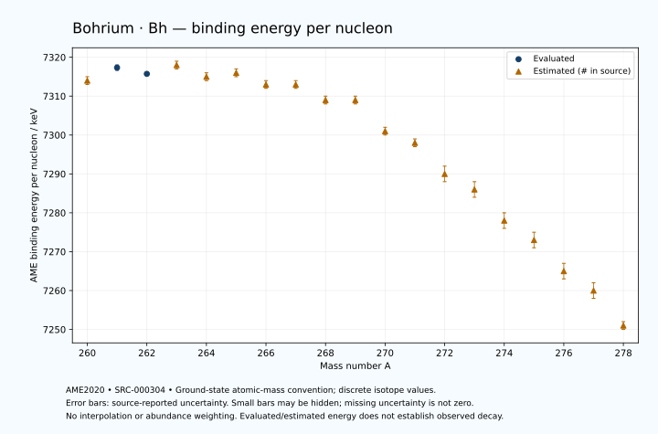

# Bohrium — Atomic Masses and Reaction Energies

<!-- generated-by: sync-ame2020.mjs -->

**Dated evaluated data · scientific coverage remains partial.** 19 ground-state nuclides from AME2020. Values and uncertainties are transcribed from the retained unrounded analysis files; estimated quantities remain labelled.

- [Parent Bohrium record](0107-Bohrium-Bh.md) · [NUBASE states and decays](0107-Bohrium-Bh-Nuclear-Evaluation.md)
- [Structured data](data/isotopes/0107-Bohrium-Bh-AME2020-Evaluation.yaml)
- [Original mass table](../../data/catalog/sources/ame2020-mass_1.mas20.txt) · [Original reaction table](../../data/catalog/sources/ame2020-rct1.mas20.txt)
- [AME2020 methods](https://doi.org/10.1088/1674-1137/abddb0) (SRC-000303) · [Tables and definitions](https://doi.org/10.1088/1674-1137/abddaf) (SRC-000304)

## Reading the data

All table energies and uncertainties are in keV; binding energy is per nucleon. A # replaces a decimal point in the original estimated value. UNKNOWN (*) retains the source's not-calculable entry; it is neither zero nor automatically NOT APPLICABLE. Source lines are one-based in the retained files. Uncertainties remain those published by the evaluation, with no replacement by independent-mass quadrature.

Atomic-mass conventions apply. Qα is total decay energy, not alpha-particle kinetic energy. Positive Q alone does not establish a decay branch, rate or observation. He-4's source Qα of zero is a bookkeeping identity. These tables describe ground-state combinations, not isomer or excited-daughter transitions. Nuclear state and daughter lookups are explicit in the structured companion. The binding quantity follows [Z M(¹H) + N mₙ − M(A,Z)]c²/A; it has not been converted to a bare-nucleus convention.

## Mass and binding table

| Nuclide | N | Atomic mass excess / keV | AME binding per nucleon / keV | Mass-file line |
|---|---:|---|---|---:|
| Bh-260 | 153 | 113123# ± 196# | 7314# ± 1# | 3412 |
| Bh-261 | 154 | 113079.410 ± 179.803 | 7317.3313 ± 0.6889 | 3419 |
| Bh-262 | 155 | 114252.119 ± 93.074 | 7315.7331 ± 0.3552 | 3426 |
| Bh-263 | 156 | 114496# ± 305# | 7318# ± 1# | 3432 |
| Bh-264 | 157 | 115958# ± 177# | 7315# ± 1# | 3439 |
| Bh-265 | 158 | 116395# ± 239# | 7316# ± 1# | 3445 |
| Bh-266 | 159 | 118104# ± 163# | 7313# ± 1# | 3452 |
| Bh-267 | 160 | 118765# ± 263# | 7313# ± 1# | 3458 |
| Bh-268 | 161 | 120707# ± 382# | 7309# ± 1# | 3465 |
| Bh-269 | 162 | 121477# ± 374# | 7309# ± 1# | 3471 |
| Bh-270 | 163 | 124230# ± 299# | 7301# ± 1# | 3477 |
| Bh-271 | 164 | 125859# ± 384# | 7298# ± 1# | 3482 |
| Bh-272 | 165 | 128787# ± 532# | 7290# ± 2# | 3487 |
| Bh-273 | 166 | 130683# ± 655# | 7286# ± 2# | 3493 |
| Bh-274 | 167 | 133762# ± 578# | 7278# ± 2# | 3498 |
| Bh-275 | 168 | 135780# ± 600# | 7273# ± 2# | 3503 |
| Bh-276 | 169 | 138950# ± 600# | 7265# ± 2# | 3508 |
| Bh-277 | 170 | 141100# ± 600# | 7260# ± 2# | 3514 |
| Bh-278 | 171 | 144370# ± 400# | 7251# ± 1# | 3520 |

## Q-values and separation energies

| Nuclide | Qβ− / keV | Qα / keV | S₂n / keV | S₂p / keV | Reaction-file line |
|---|---|---|---|---|---:|
| Bh-260 | UNKNOWN (*) | 10400.2999 ± 58.5683 | UNKNOWN (*) | 2962# ± 217# | 3411 |
| Bh-261 | UNKNOWN (*) | 10500.2083 ± 72.2838 | UNKNOWN (*) | 3489.5537 ± 188.5271 | 3418 |
| Bh-262 | UNKNOWN (*) | 10319.4999 ± 15.0000 | 15014# ± 217# | 3999# ± 132# | 3425 |
| Bh-263 | -5182# ± 363# | 10080# ± 300# | 14726# ± 354# | 4390# ± 325# | 3431 |
| Bh-264 | -3605# ± 180# | 9860# ± 151# | 14437# ± 200# | 4873# ± 228# | 3438 |
| Bh-265 | -4505# ± 240# | 9662# ± 212# | 14244# ± 388# | 5293# ± 292# | 3444 |
| Bh-266 | -3036# ± 165# | 9426# ± 77# | 13996# ± 241# | 5736# ± 287# | 3451 |
| Bh-267 | -3893# ± 279# | 9230# ± 202# | 13773# ± 355# | 6195# ± 345# | 3457 |
| Bh-268 | -2261# ± 486# | 9020# ± 300# | 13540# ± 415# | 6612# ± 475# | 3464 |
| Bh-269 | -3016# ± 396# | 8670# ± 300# | 13430# ± 457# | 7115# ± 529# | 3470 |
| Bh-270 | -882# ± 388# | 9064.4999 ± 95.3595 | 12620# ± 485# | 7408# ± 608# | 3476 |
| Bh-271 | -1832# ± 473# | 9419.9999 ± 86.0233 | 11761# ± 536# | 7867# ± 732# | 3481 |
| Bh-272 | -217# ± 737# | 9302.9999 ± 53.8516 | 11585# ± 610# | 8188# ± 783# | 3486 |
| Bh-273 | -1084# ± 754# | 9110# ± 200# | 11318# ± 759# | UNKNOWN (*) | 3492 |
| Bh-274 | 356# ± 744# | 8939.9999 ± 60.0000 | 11168# ± 785# | UNKNOWN (*) | 3497 |
| Bh-275 | -712# ± 844# | UNKNOWN (*) | 11046# ± 888# | UNKNOWN (*) | 3502 |
| Bh-276 | 765# ± 937# | UNKNOWN (*) | 10955# ± 833# | UNKNOWN (*) | 3507 |
| Bh-277 | -275# ± 748# | UNKNOWN (*) | 10823# ± 848# | UNKNOWN (*) | 3513 |
| Bh-278 | 1150# ± 500# | UNKNOWN (*) | 10722# ± 721# | UNKNOWN (*) | 3519 |

Qβ− comes from the mass-file line in the first table. The other three columns come from the reaction-file line. Definitions and original source strings are retained in the structured data.

## Binding-energy chart

Discrete source values and source-reported uncertainties. No interpolation, natural-abundance weighting or observed-decay claim is implied. This quantitative chart supplements the 22 separate illustrative panels.

## Remaining review

Later measurements, state-specific decay branches, isomer Q-values, additional reaction channels and full claim-level review remain open. Existing authored values retain their own provenance; this companion does not overwrite them.
