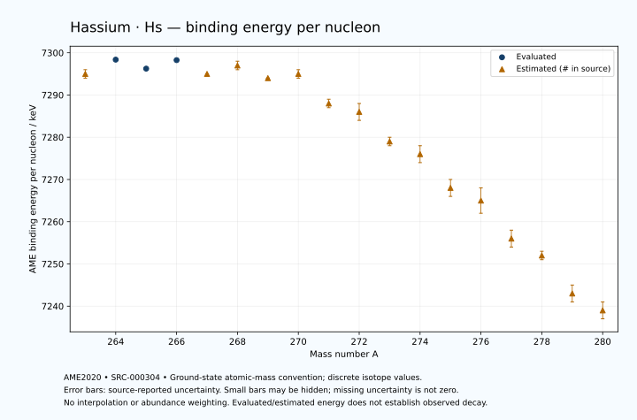

# Hassium — Atomic Masses and Reaction Energies

<!-- generated-by: sync-ame2020.mjs -->

**Dated evaluated data · scientific coverage remains partial.** 18 ground-state nuclides from AME2020. Values and uncertainties are transcribed from the retained unrounded analysis files; estimated quantities remain labelled.

- [Parent Hassium record](0108-Hassium-Hs.md) · [NUBASE states and decays](0108-Hassium-Hs-Nuclear-Evaluation.md)
- [Structured data](data/isotopes/0108-Hassium-Hs-AME2020-Evaluation.yaml)
- [Original mass table](../../data/catalog/sources/ame2020-mass_1.mas20.txt) · [Original reaction table](../../data/catalog/sources/ame2020-rct1.mas20.txt)
- [AME2020 methods](https://doi.org/10.1088/1674-1137/abddb0) (SRC-000303) · [Tables and definitions](https://doi.org/10.1088/1674-1137/abddaf) (SRC-000304)

## Reading the data

All table energies and uncertainties are in keV; binding energy is per nucleon. A # replaces a decimal point in the original estimated value. UNKNOWN (*) retains the source's not-calculable entry; it is neither zero nor automatically NOT APPLICABLE. Source lines are one-based in the retained files. Uncertainties remain those published by the evaluation, with no replacement by independent-mass quadrature.

Atomic-mass conventions apply. Qα is total decay energy, not alpha-particle kinetic energy. Positive Q alone does not establish a decay branch, rate or observation. He-4's source Qα of zero is a bookkeeping identity. These tables describe ground-state combinations, not isomer or excited-daughter transitions. Nuclear state and daughter lookups are explicit in the structured companion. The binding quantity follows [Z M(¹H) + N mₙ − M(A,Z)]c²/A; it has not been converted to a bare-nucleus convention.

## Mass and binding table

| Nuclide | N | Atomic mass excess / keV | AME binding per nucleon / keV | Mass-file line |
|---|---:|---|---|---:|
| Hs-263 | 155 | 119678# ± 197# | 7295# ± 1# | 3433 |
| Hs-264 | 156 | 119563.165 ± 28.881 | 7298.3762 ± 0.1094 | 3440 |
| Hs-265 | 157 | 120900.245 ± 23.958 | 7296.2474 ± 0.0904 | 3446 |
| Hs-266 | 158 | 121139.675 ± 27.106 | 7298.2611 ± 0.1019 | 3453 |
| Hs-267 | 159 | 122658# ± 95# | 7295# ± 0# | 3459 |
| Hs-268 | 160 | 122968# ± 300# | 7297# ± 1# | 3466 |
| Hs-269 | 161 | 124493# ± 131# | 7294# ± 0# | 3472 |
| Hs-270 | 162 | 125112# ± 248# | 7295# ± 1# | 3478 |
| Hs-271 | 163 | 127691# ± 276# | 7288# ± 1# | 3483 |
| Hs-272 | 164 | 129004# ± 510# | 7286# ± 2# | 3488 |
| Hs-273 | 165 | 131767# ± 374# | 7279# ± 1# | 3494 |
| Hs-274 | 166 | 133406# ± 469# | 7276# ± 2# | 3499 |
| Hs-275 | 167 | 136492# ± 593# | 7268# ± 2# | 3504 |
| Hs-276 | 168 | 138185# ± 720# | 7265# ± 3# | 3509 |
| Hs-277 | 169 | 141375# ± 447# | 7256# ± 2# | 3515 |
| Hs-278 | 170 | 143220# ± 300# | 7252# ± 1# | 3521 |
| Hs-279 | 171 | 146500# ± 600# | 7243# ± 2# | 3527 |
| Hs-280 | 172 | 148420# ± 600# | 7239# ± 2# | 3533 |

## Q-values and separation energies

| Nuclide | Qβ− / keV | Qα / keV | S₂n / keV | S₂p / keV | Reaction-file line |
|---|---|---|---|---|---:|
| Hs-263 | UNKNOWN (*) | 10733.4999 ± 78.1025 | UNKNOWN (*) | 2905# ± 198# | 3432 |
| Hs-264 | UNKNOWN (*) | 10590.7541 ± 20.3083 | UNKNOWN (*) | 3383.8491 ± 36.3961 | 3439 |
| Hs-265 | -5724# ± 439# | 10470.3244 ± 15.2303 | 14920# ± 199# | 3873# ± 98# | 3445 |
| Hs-266 | -6533.0066 ± 100.2087 | 10345.6864 ± 15.5994 | 14566.1268 ± 39.5982 | 4221# ± 284# | 3452 |
| Hs-267 | -5133# ± 512# | 10037.5052 ± 13.0051 | 14385# ± 98# | 4714# ± 169# | 3458 |
| Hs-268 | -6183# ± 380# | 9760# ± 100# | 14315# ± 301# | 5227# ± 387# | 3465 |
| Hs-269 | -4807# ± 338# | 9274# ± 167# | 14307# ± 162# | 5891# ± 292# | 3471 |
| Hs-270 | -5597# ± 313# | 9069.8978 ± 37.7008 | 13998# ± 389# | 6265# ± 531# | 3477 |
| Hs-271 | -3409# ± 430# | 9460# ± 87# | 12945# ± 305# | 6579# ± 460# | 3482 |
| Hs-272 | -4477# ± 704# | 9780# ± 200# | 12250# ± 567# | 7005# ± 686# | 3487 |
| Hs-273 | -3015# ± 565# | 9649.9999 ± 64.0312 | 12066# ± 464# | 7428# ± 699# | 3493 |
| Hs-274 | -3843# ± 602# | 9550# ± 100# | 11741# ± 693# | 7692# ± 836# | 3498 |
| Hs-275 | -2275# ± 709# | 9449.9999 ± 53.8516 | 11418# ± 701# | 8006# ± 715# | 3503 |
| Hs-276 | -3127# ± 895# | 9240# ± 200# | 11363# ± 860# | UNKNOWN (*) | 3508 |
| Hs-277 | -1633# ± 799# | 9030# ± 200# | 11260# ± 743# | UNKNOWN (*) | 3514 |
| Hs-278 | -2547# ± 652# | UNKNOWN (*) | 11108# ± 780# | UNKNOWN (*) | 3520 |
| Hs-279 | -1085# ± 900# | UNKNOWN (*) | 11018# ± 748# | UNKNOWN (*) | 3526 |
| Hs-280 | -2090# ± 848# | UNKNOWN (*) | 10943# ± 671# | UNKNOWN (*) | 3532 |

Qβ− comes from the mass-file line in the first table. The other three columns come from the reaction-file line. Definitions and original source strings are retained in the structured data.

## Binding-energy chart

Discrete source values and source-reported uncertainties. No interpolation, natural-abundance weighting or observed-decay claim is implied. This quantitative chart supplements the 22 separate illustrative panels.

## Remaining review

Later measurements, state-specific decay branches, isomer Q-values, additional reaction channels and full claim-level review remain open. Existing authored values retain their own provenance; this companion does not overwrite them.
