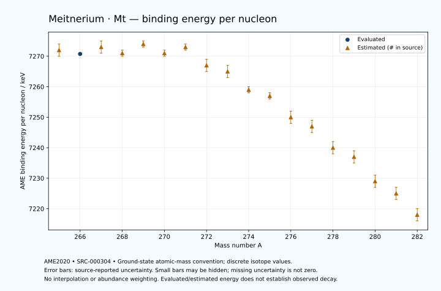

# Meitnerium — Atomic Masses and Reaction Energies

<!-- generated-by: sync-ame2020.mjs -->

**Dated evaluated data · scientific coverage remains partial.** 18 ground-state nuclides from AME2020. Values and uncertainties are transcribed from the retained unrounded analysis files; estimated quantities remain labelled.

- [Parent Meitnerium record](0109-Meitnerium-Mt.md) · [NUBASE states and decays](0109-Meitnerium-Mt-Nuclear-Evaluation.md)
- [Structured data](data/isotopes/0109-Meitnerium-Mt-AME2020-Evaluation.yaml)
- [Original mass table](../../data/catalog/sources/ame2020-mass_1.mas20.txt) · [Original reaction table](../../data/catalog/sources/ame2020-rct1.mas20.txt)
- [AME2020 methods](https://doi.org/10.1088/1674-1137/abddb0) (SRC-000303) · [Tables and definitions](https://doi.org/10.1088/1674-1137/abddaf) (SRC-000304)

## Reading the data

All table energies and uncertainties are in keV; binding energy is per nucleon. A # replaces a decimal point in the original estimated value. UNKNOWN (*) retains the source's not-calculable entry; it is neither zero nor automatically NOT APPLICABLE. Source lines are one-based in the retained files. Uncertainties remain those published by the evaluation, with no replacement by independent-mass quadrature.

Atomic-mass conventions apply. Qα is total decay energy, not alpha-particle kinetic energy. Positive Q alone does not establish a decay branch, rate or observation. He-4's source Qα of zero is a bookkeeping identity. These tables describe ground-state combinations, not isomer or excited-daughter transitions. Nuclear state and daughter lookups are explicit in the structured companion. The binding quantity follows [Z M(¹H) + N mₙ − M(A,Z)]c²/A; it has not been converted to a bare-nucleus convention.

## Mass and binding table

| Nuclide | N | Atomic mass excess / keV | AME binding per nucleon / keV | Mass-file line |
|---|---:|---|---|---:|
| Mt-265 | 156 | 126624# ± 439# | 7272# ± 2# | 3447 |
| Mt-266 | 157 | 127672.681 ± 96.473 | 7270.7598 ± 0.3627 | 3454 |
| Mt-267 | 158 | 127791# ± 503# | 7273# ± 2# | 3460 |
| Mt-268 | 159 | 129151# ± 233# | 7271# ± 1# | 3467 |
| Mt-269 | 160 | 129300# ± 312# | 7274# ± 1# | 3473 |
| Mt-270 | 161 | 130709# ± 191# | 7271# ± 1# | 3479 |
| Mt-271 | 162 | 131100# ± 330# | 7273# ± 1# | 3484 |
| Mt-272 | 163 | 133481# ± 485# | 7267# ± 2# | 3489 |
| Mt-273 | 164 | 134782# ± 424# | 7265# ± 2# | 3495 |
| Mt-274 | 165 | 137249# ± 377# | 7259# ± 1# | 3500 |
| Mt-275 | 166 | 138767# ± 387# | 7257# ± 1# | 3505 |
| Mt-276 | 167 | 141312# ± 532# | 7250# ± 2# | 3510 |
| Mt-277 | 168 | 143008# ± 662# | 7247# ± 2# | 3516 |
| Mt-278 | 169 | 145767# ± 579# | 7240# ± 2# | 3522 |
| Mt-279 | 170 | 147585# ± 671# | 7237# ± 2# | 3528 |
| Mt-280 | 171 | 150510# ± 600# | 7229# ± 2# | 3534 |
| Mt-281 | 172 | 152400# ± 600# | 7225# ± 2# | 3539 |
| Mt-282 | 173 | 155455# ± 447# | 7218# ± 2# | 3544 |

## Q-values and separation energies

| Nuclide | Qβ− / keV | Qα / keV | S₂n / keV | S₂p / keV | Reaction-file line |
|---|---|---|---|---|---:|
| Mt-265 | UNKNOWN (*) | 11120# ± 400# | UNKNOWN (*) | 2450# ± 534# | 3446 |
| Mt-266 | UNKNOWN (*) | 10995.6467 ± 25.3824 | UNKNOWN (*) | 2863# ± 202# | 3453 |
| Mt-267 | -6089# ± 543# | 10870# ± 400# | 14976# ± 667# | 3182# ± 557# | 3459 |
| Mt-268 | -4497# ± 381# | 10768# ± 151# | 14665# ± 252# | 3531# ± 284# | 3466 |
| Mt-269 | -5535# ± 313# | 10480# ± 200# | 14634# ± 592# | 4043# ± 408# | 3472 |
| Mt-270 | -3973# ± 195# | 10180# ± 100# | 14584# ± 301# | 4576# ± 427# | 3478 |
| Mt-271 | -4853# ± 344# | 9910# ± 200# | 14343# ± 454# | 4955# ± 499# | 3483 |
| Mt-272 | -2601# ± 645# | 10350# ± 300# | 13370# ± 522# | 5326# ± 570# | 3488 |
| Mt-273 | -3503# ± 447# | 10880# ± 200# | 12460# ± 538# | 5655# ± 572# | 3494 |
| Mt-274 | -1948# ± 542# | 10595# ± 230# | 12375# ± 614# | 6116# ± 652# | 3499 |
| Mt-275 | -2899# ± 516# | 10482.6999 ± 51.0099 | 12158# ± 575# | 6495# ± 761# | 3504 |
| Mt-276 | -1227# ± 764# | 10099.9999 ± 10.0000 | 12080# ± 652# | 7028# ± 786# | 3509 |
| Mt-277 | -2084# ± 770# | 9900# ± 100# | 11901# ± 767# | 7350# ± 894# | 3515 |
| Mt-278 | -484# ± 771# | 9579.9999 ± 30.0000 | 11688# ± 786# | 7761# ± 834# | 3521 |
| Mt-279 | -1439# ± 903# | 9380# ± 300# | 11566# ± 943# | 8093# ± 900# | 3527 |
| Mt-280 | 190# ± 958# | 9135# ± 848# | 11400# ± 834# | 8438# ± 721# | 3533 |
| Mt-281 | -873# ± 776# | 8875# ± 848# | 11328# ± 900# | UNKNOWN (*) | 3538 |
| Mt-282 | 665# ± 538# | 8660# ± 200# | 11197# ± 748# | UNKNOWN (*) | 3543 |

Qβ− comes from the mass-file line in the first table. The other three columns come from the reaction-file line. Definitions and original source strings are retained in the structured data.

## Binding-energy chart

Discrete source values and source-reported uncertainties. No interpolation, natural-abundance weighting or observed-decay claim is implied. This quantitative chart supplements the 22 separate illustrative panels.

## Remaining review

Later measurements, state-specific decay branches, isomer Q-values, additional reaction channels and full claim-level review remain open. Existing authored values retain their own provenance; this companion does not overwrite them.
