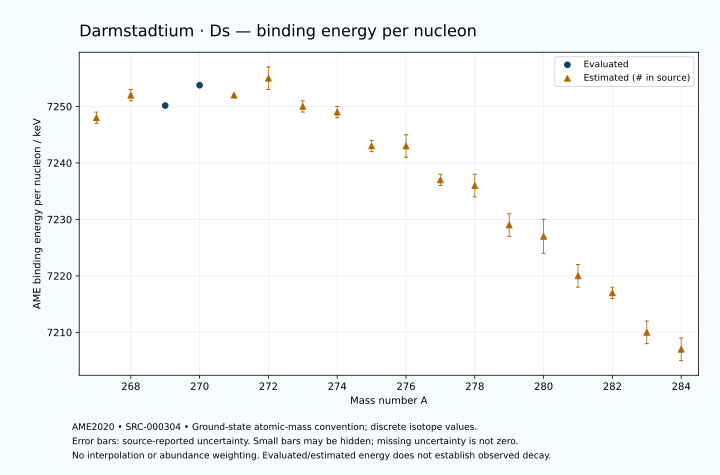

# Darmstadtium — Atomic Masses and Reaction Energies

<!-- generated-by: sync-ame2020.mjs -->

**Dated evaluated data · scientific coverage remains partial.** 18 ground-state nuclides from AME2020. Values and uncertainties are transcribed from the retained unrounded analysis files; estimated quantities remain labelled.

- [Parent Darmstadtium record](0110-Darmstadtium-Ds.md) · [NUBASE states and decays](0110-Darmstadtium-Ds-Nuclear-Evaluation.md)
- [Structured data](data/isotopes/0110-Darmstadtium-Ds-AME2020-Evaluation.yaml)
- [Original mass table](../../data/catalog/sources/ame2020-mass_1.mas20.txt) · [Original reaction table](../../data/catalog/sources/ame2020-rct1.mas20.txt)
- [AME2020 methods](https://doi.org/10.1088/1674-1137/abddb0) (SRC-000303) · [Tables and definitions](https://doi.org/10.1088/1674-1137/abddaf) (SRC-000304)

## Reading the data

All table energies and uncertainties are in keV; binding energy is per nucleon. A # replaces a decimal point in the original estimated value. UNKNOWN (*) retains the source's not-calculable entry; it is neither zero nor automatically NOT APPLICABLE. Source lines are one-based in the retained files. Uncertainties remain those published by the evaluation, with no replacement by independent-mass quadrature.

Atomic-mass conventions apply. Qα is total decay energy, not alpha-particle kinetic energy. Positive Q alone does not establish a decay branch, rate or observation. He-4's source Qα of zero is a bookkeeping identity. These tables describe ground-state combinations, not isomer or excited-daughter transitions. Nuclear state and daughter lookups are explicit in the structured companion. The binding quantity follows [Z M(¹H) + N mₙ − M(A,Z)]c²/A; it has not been converted to a bare-nucleus convention.

## Mass and binding table

| Nuclide | N | Atomic mass excess / keV | AME binding per nucleon / keV | Mass-file line |
|---|---:|---|---|---:|
| Ds-267 | 157 | 133880# ± 204# | 7248# ± 1# | 3461 |
| Ds-268 | 158 | 133648# ± 301# | 7252# ± 1# | 3468 |
| Ds-269 | 159 | 134834.671 ± 31.403 | 7250.1551 ± 0.1167 | 3474 |
| Ds-270 | 160 | 134681.584 ± 39.275 | 7253.7634 ± 0.1455 | 3480 |
| Ds-271 | 161 | 135952# ± 97# | 7252# ± 0# | 3485 |
| Ds-272 | 162 | 136083# ± 424# | 7255# ± 2# | 3490 |
| Ds-273 | 163 | 138285# ± 142# | 7250# ± 1# | 3496 |
| Ds-274 | 164 | 139197# ± 389# | 7249# ± 1# | 3501 |
| Ds-275 | 165 | 141666# ± 340# | 7243# ± 1# | 3506 |
| Ds-276 | 166 | 142539# ± 548# | 7243# ± 2# | 3511 |
| Ds-277 | 167 | 145092# ± 392# | 7237# ± 1# | 3517 |
| Ds-278 | 168 | 146251# ± 510# | 7236# ± 2# | 3523 |
| Ds-279 | 169 | 149024# ± 605# | 7229# ± 2# | 3529 |
| Ds-280 | 170 | 150320# ± 748# | 7227# ± 3# | 3535 |
| Ds-281 | 171 | 153273# ± 493# | 7220# ± 2# | 3540 |
| Ds-282 | 172 | 154790# ± 300# | 7217# ± 1# | 3545 |
| Ds-283 | 173 | 157830# ± 500# | 7210# ± 2# | 3549 |
| Ds-284 | 174 | 159460# ± 500# | 7207# ± 2# | 3553 |

## Q-values and separation energies

| Nuclide | Qβ− / keV | Qα / keV | S₂n / keV | S₂p / keV | Reaction-file line |
|---|---|---|---|---|---:|
| Ds-267 | UNKNOWN (*) | 11776.7587 ± 50.7619 | UNKNOWN (*) | 1599# ± 205# | 3460 |
| Ds-268 | UNKNOWN (*) | 11660# ± 300# | UNKNOWN (*) | 2070# ± 303# | 3467 |
| Ds-269 | UNKNOWN (*) | 11509.5104 ± 29.5992 | 15188# ± 206# | 2401# ± 100# | 3473 |
| Ds-270 | UNKNOWN (*) | 11116.9933 ± 28.4218 | 15109# ± 304# | 2864# ± 303# | 3479 |
| Ds-271 | UNKNOWN (*) | 10869.9743 ± 17.6255 | 15025# ± 102# | 3119# ± 163# | 3484 |
| Ds-272 | -6690# ± 484# | 10690# ± 300# | 14742# ± 426# | 3607# ± 491# | 3489 |
| Ds-273 | -4600# ± 424# | 11366.8999 ± 53.9638 | 13810# ± 172# | 3984# ± 310# | 3495 |
| Ds-274 | -5415# ± 442# | 11660# ± 300# | 13028# ± 576# | 4385# ± 641# | 3500 |
| Ds-275 | -3729# ± 561# | 11550# ± 200# | 12762# ± 369# | 4679# ± 506# | 3505 |
| Ds-276 | -4847# ± 834# | 11110# ± 200# | 12800# ± 672# | 5445# ± 721# | 3510 |
| Ds-277 | -3315# ± 611# | 10900# ± 119# | 12716# ± 519# | 5978# ± 711# | 3516 |
| Ds-278 | -4270# ± 641# | 10420# ± 200# | 12431# ± 748# | 6512# ± 883# | 3522 |
| Ds-279 | -2697# ± 737# | 10107# ± 117# | 12211# ± 721# | 6929# ± 752# | 3528 |
| Ds-280 | -3566# ± 918# | 9710# ± 200# | 12073# ± 905# | 7478# ± 805# | 3534 |
| Ds-281 | -2060# ± 918# | 9473# ± 208# | 11894# ± 780# | 7805# ± 776# | 3539 |
| Ds-282 | -2952# ± 660# | 9145# ± 424# | 11673# ± 805# | 8207# ± 671# | 3544 |
| Ds-283 | -1550# ± 843# | 8905# ± 781# | 11586# ± 702# | UNKNOWN (*) | 3548 |
| Ds-284 | -2510# ± 707# | 8615# ± 781# | 11473# ± 583# | UNKNOWN (*) | 3552 |

Qβ− comes from the mass-file line in the first table. The other three columns come from the reaction-file line. Definitions and original source strings are retained in the structured data.

## Binding-energy chart

Discrete source values and source-reported uncertainties. No interpolation, natural-abundance weighting or observed-decay claim is implied. This quantitative chart supplements the 22 separate illustrative panels.

## Remaining review

Later measurements, state-specific decay branches, isomer Q-values, additional reaction channels and full claim-level review remain open. Existing authored values retain their own provenance; this companion does not overwrite them.
