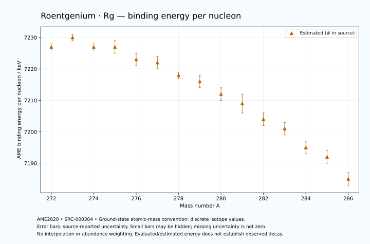

# Roentgenium — Atomic Masses and Reaction Energies

<!-- generated-by: sync-ame2020.mjs -->

**Dated evaluated data · scientific coverage remains partial.** 15 ground-state nuclides from AME2020. Values and uncertainties are transcribed from the retained unrounded analysis files; estimated quantities remain labelled.

- [Parent Roentgenium record](0111-Roentgenium-Rg.md) · [NUBASE states and decays](0111-Roentgenium-Rg-Nuclear-Evaluation.md)
- [Structured data](data/isotopes/0111-Roentgenium-Rg-AME2020-Evaluation.yaml)
- [Original mass table](../../data/catalog/sources/ame2020-mass_1.mas20.txt) · [Original reaction table](../../data/catalog/sources/ame2020-rct1.mas20.txt)
- [AME2020 methods](https://doi.org/10.1088/1674-1137/abddb0) (SRC-000303) · [Tables and definitions](https://doi.org/10.1088/1674-1137/abddaf) (SRC-000304)

## Reading the data

All table energies and uncertainties are in keV; binding energy is per nucleon. A # replaces a decimal point in the original estimated value. UNKNOWN (*) retains the source's not-calculable entry; it is neither zero nor automatically NOT APPLICABLE. Source lines are one-based in the retained files. Uncertainties remain those published by the evaluation, with no replacement by independent-mass quadrature.

Atomic-mass conventions apply. Qα is total decay energy, not alpha-particle kinetic energy. Positive Q alone does not establish a decay branch, rate or observation. He-4's source Qα of zero is a bookkeeping identity. These tables describe ground-state combinations, not isomer or excited-daughter transitions. Nuclear state and daughter lookups are explicit in the structured companion. The binding quantity follows [Z M(¹H) + N mₙ − M(A,Z)]c²/A; it has not been converted to a bare-nucleus convention.

## Mass and binding table

| Nuclide | N | Atomic mass excess / keV | AME binding per nucleon / keV | Mass-file line |
|---|---:|---|---|---:|
| Rg-272 | 161 | 142773# ± 233# | 7227# ± 1# | 3491 |
| Rg-273 | 162 | 142885# ± 400# | 7230# ± 1# | 3497 |
| Rg-274 | 163 | 144612# ± 209# | 7227# ± 1# | 3502 |
| Rg-275 | 164 | 145395# ± 446# | 7227# ± 2# | 3507 |
| Rg-276 | 165 | 147386# ± 629# | 7223# ± 2# | 3512 |
| Rg-277 | 166 | 148407# ± 469# | 7222# ± 2# | 3518 |
| Rg-278 | 167 | 150521# ± 389# | 7218# ± 1# | 3524 |
| Rg-279 | 168 | 151721# ± 422# | 7216# ± 2# | 3530 |
| Rg-280 | 169 | 153886# ± 532# | 7212# ± 2# | 3536 |
| Rg-281 | 170 | 155333# ± 774# | 7209# ± 3# | 3541 |
| Rg-282 | 171 | 157742# ± 588# | 7204# ± 2# | 3546 |
| Rg-283 | 172 | 159380# ± 678# | 7201# ± 2# | 3550 |
| Rg-284 | 173 | 161970# ± 500# | 7195# ± 2# | 3554 |
| Rg-285 | 174 | 163730# ± 600# | 7192# ± 2# | 3558 |
| Rg-286 | 175 | 166510# ± 458# | 7185# ± 2# | 3562 |

## Q-values and separation energies

| Nuclide | Qβ− / keV | Qα / keV | S₂n / keV | S₂p / keV | Reaction-file line |
|---|---|---|---|---|---:|
| Rg-272 | UNKNOWN (*) | 11197.4272 ± 13.3083 | UNKNOWN (*) | 2514# ± 302# | 3490 |
| Rg-273 | UNKNOWN (*) | 11160# ± 250# | UNKNOWN (*) | 2793# ± 518# | 3496 |
| Rg-274 | UNKNOWN (*) | 11477.8999 ± 86.0233 | 14304# ± 314# | 3448# ± 529# | 3501 |
| Rg-275 | UNKNOWN (*) | 11870# ± 300# | 13633# ± 599# | 3965# ± 616# | 3506 |
| Rg-276 | -2974# ± 804# | 11480# ± 400# | 13368# ± 663# | 4441# ± 733# | 3511 |
| Rg-277 | -3925# ± 493# | 11200# ± 200# | 13130# ± 647# | 4937# ± 608# | 3517 |
| Rg-278 | -2321# ± 585# | 10846.2999 ± 95.3595 | 13008# ± 739# | 5370# ± 659# | 3523 |
| Rg-279 | -3299# ± 578# | 10529.9999 ± 167.6305 | 12828# ± 631# | 5865# ± 786# | 3529 |
| Rg-280 | -1768# ± 789# | 10148.7999 ± 10.2000 | 12777# ± 659# | 6459# ± 786# | 3535 |
| Rg-281 | -2614# ± 870# | 9900# ± 400# | 12531# ± 882# | 6830# ± 1024# | 3540 |
| Rg-282 | -1084# ± 804# | 9550# ± 104# | 12287# ± 793# | 7346# ± 840# | 3545 |
| Rg-283 | -1957# ± 916# | 9370# ± 100# | 12096# ± 1029# | 7598# ± 905# | 3549 |
| Rg-284 | -445# ± 912# | 9035# ± 781# | 11914# ± 772# | 8063# ± 671# | 3553 |
| Rg-285 | -1357# ± 785# | 8905# ± 848# | 11793# ± 905# | UNKNOWN (*) | 3557 |
| Rg-286 | 61# ± 836# | 8630# ± 100# | 11602# ± 678# | UNKNOWN (*) | 3561 |

Qβ− comes from the mass-file line in the first table. The other three columns come from the reaction-file line. Definitions and original source strings are retained in the structured data.

## Binding-energy chart

Discrete source values and source-reported uncertainties. No interpolation, natural-abundance weighting or observed-decay claim is implied. This quantitative chart supplements the 22 separate illustrative panels.

## Remaining review

Later measurements, state-specific decay branches, isomer Q-values, additional reaction channels and full claim-level review remain open. Existing authored values retain their own provenance; this companion does not overwrite them.
